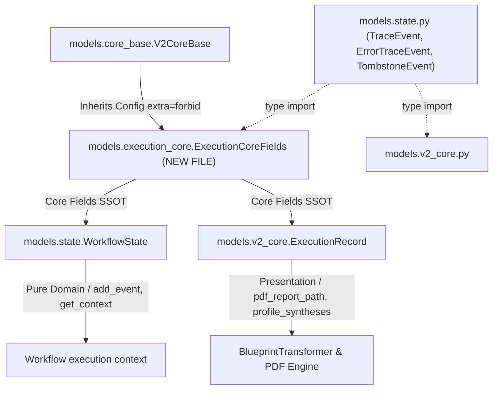

# Epic 63: Execution Model Decoupling & Parity Hardening (Jaetun Datarungon Mixin, Tiukka Skeemapariteetti ja CI-tason Fail-Fast-Valvonta)

> [!IMPORTANT]
> **THE ZERO-COMPROMISE PARITY & STRUCTURAL INTEGRITY MANDATE**: 
> Tämä Epic poistaa pysyvästi työnkulun ajonaikaisen aggregaattijuuren (`WorkflowState`) ja tietokanta-/esityskerroksen historiatallenteen (`ExecutionRecord`) välisen siirtymävajeen (Schema Disparity). Toteutus noudattaa 2026-ohjelmistokehityksen tiukimpia arkkitehtuurisia standardeja. Yhteinen datasopimus (Shared Core Contract) eriytetään kummankin mallin kantaluokaksi (`ExecutionCoreFields`), jolloin kaikki askelet, kontekstit ja muuttujat synkronoituvat automaattisesti skeematasolla ilman inhimillisen virheen mahdollisuutta. Kaikki dynaamiset tiedon offloading- (Storage Blobs) ja lazy-hydration-mekanismit integroidaan suoraan jaettuun ytimeen. Vanhojen suoritusajojen tai historiallisten siemenaineistojen taaksepäin yhteensopivuudesta luovutaan tietoisesti puhtaan, robustin ja parhaan nykytilan varmistamiseksi (Clean-Slate Migration).

---

## 1. Yhteenveto ja Tavoite (Objective)

Tämän Epicin tavoitteena on ratkaista lopullisesti työnkulun ajonaikaisen domain-tilan (`WorkflowState`) ja tietokantaan persistoitavan sekä esityskerroksen (PDF/SDUI) käyttämän historialuokan (`ExecutionRecord`) välinen skeemaepäsymmetria (Kaksoismalliongelma / Dual Model Hazard).

### Tunnistetut Nykytilan Ongelmat:
1. **Kaksoismallin pariteettivaje (Dual Model Hazard)**: `WorkflowState` (`models/state.py`) ja `ExecutionRecord` (`models/v2_core.py`) jakavat 90 % suoritustilasta (kuten `status`, `execution_trace`, `execution_trace_storage_path` sekä äskettäin lisätyt `context_variables` ja `context_variables_storage_path`). Koska ne ovat kaksi erillistä Pydantic-mallia eri tiedostoissa, yhden kehittyminen (esim. uudet dynamic strictness -muuttujat) jättää toisen jälkeen ja aiheuttaa rajapinnoissa kaatumisia.
2. **Implisiittiset sanakirjamuunnokset (`dict`)**: Työnkulun suoritus ja tallennus nojaavat useissa kohdin tyypittämättömiin `isinstance(data, dict)` tai `.model_validate(execution_dict, strict=False)` -muunnoksiin. Jos tietokannan raw JSON -muodossa on ylimääräisiä tai puuttuvia kenttiä, tiukka Pydantic-moodi (`extra="forbid"`) aiheuttaa `ValidationError`-katastrofeja tai poistaa dataa hiljaisesti, johtaen downstream-ajonaikaisiin `AttributeError`-kaatumisiin.
3. **Regressioriskit ja staattisen synkronoinnin puute**: Kehittäjät voivat lisätä uusia ydinmuuttujia työnkulun ajonaikaiseen tilaan huomaamatta, että historiantallennus tai PDF-sivujen koonti kaatuu myöhemmin kentän puuttumisen vuoksi. Testaus ei havaitse tätä staattisesti ennen kuin visualisointimoottori yrittää lukea puuttuvaa attribuuttia.

### Arkkitehtoninen Ratkaisu (Clean-Slate Mandate):
1. **Jaettu abstrakti tietorunko (`ExecutionCoreFields`)**: Luodaan yhteinen abstrakti kantaluokka (`ExecutionCoreFields`), joka perii `V2CoreBase`-luokan. Kaikki molemmille malleille yhteiset ydinmuuttujat (status, trace, storage_paths, context_variables) määritellään **vain tässä yhdessä paikassa** (Single Source of Truth).
2. **SRP-mukainen eriyttäminen (Single Responsibility Principle Decoupling)**:
   * **`WorkflowState` (Domain)**: Perii `ExecutionCoreFields`-luokan ja laajentaa sitä puhtaasti ajonaikaisella logiikalla ja dynaamisilla apumetodeilla (`add_event`, `get_context`). Ei sisällä mitään esityskerroksen (PDF/SDUI) riippuvuuksia.
   * **`ExecutionRecord` (Presentation & DB DTO)**: Perii `ExecutionCoreFields`-luokan ja laajentaa sitä tietokanta-, välimuisti- ja PDF-raportointikohtaisilla kentillä (`pdf_report_path`, `profile_syntheses`, `is_resumable`, `duration_ms`).
3. **CI-tason Fail-Fast Meta-testaus (Structural Parity Unit Test)**: Kirjoitetaan automaattinen yksikkötesti, joka vertaa Pythonin `inspect`- ja Pydanticin `model_fields`-ominaisuuksia dynaamisesti ja kaataa testiajot välittömästi, jos mallien jaettujen ydinkenttien tyypit tai nimet eroavat.
4. **Eksplisiittinen tyyppiturvallinen adapteri (`Factory/Adapter Pattern`)**: Korvataan löysät sanakirjamuunnokset tyyppiturvallisella adapterifunktiolla (`create_execution_record`), joka takaa staattisen tyyppitarkastuksen (MyPy) kääntöaikaisen suojan.

---

## 2. Arkkitehtuuristen sääntöjen huomiointi (Compliance Matrix)

Kehityksessä on noudatettava tiukasti seuraavia `c:\src\quorum\.agents\rules` -hakemiston sääntöjä:

### 2.1. Ydinjärjestelmä ja laatuportit (00-antigravity-core.md & 01-python-backend.md)
* **The Zero-Compromise Pledge (00)**: Mitään dynamic-fallbackkeja, löysiä sanakirjamuunnoksia tai tyhjiä korvaavia arvoja ei sallita. Jos skeema ei täsmää, järjestelmän on kaaduttava fail-fast validointitasolla rajapinnassa.
* **Fail-Fast Pydantic Schema (01)**: Molemmat mallit perivät `V2CoreBase`-luokan, joka pakottaa `ConfigDict(frozen=True, strict=True, extra="forbid")` -asetuksen. Ylimääräisiä tai arvaamattomia kenttiä ei sallita missään suoritusmuodossa.

### 2.2. Tietokanta ja persistointi (03_seed_vault.md & 04_directory_reference.md)
* **No Legacy Support (Clean-Slate)**: Koska vanhoja ajoja ei tarvitse säästää tai tukea, voimme suorittaa täydellisen ja puhtaan skeemamigraation ilman taaksepäin yhteensopivuuden painolastia. Kaikki siemenaineisto (`seed_data.json`) ja kehitysaikainen TinyDB pyyhitään ja päivitetään vastaamaan uutta skeemarakennetta.

---

## 3. Arkkitehtuurinen Suunnittelu (Proposed Code/Schema Changes)



> [!CAUTION]
> **CIRCULAR IMPORT PREVENTION (Agentille Kriittinen Ohje)**:
> `ExecutionCoreFields` **EI SAA** sijaita `models/v2_core.py`-tiedostossa, koska `v2_core.py` importtaa jo `models/state.py`:stä `TraceEvent`-tyypit (rivi 35). Jos `state.py` alkaisi importtaamaan `v2_core.py`:stä `ExecutionCoreFields`-luokkaa, syntyisi välitön `ImportError`-ympyrä.
>
> **Ratkaisu**: Luodaan uusi lehtimoduuli `backend_v2/models/execution_core.py`, joka importtaa `TraceEvent`-tyypit `state.py`:stä ja `V2CoreBase`-luokan `core_base.py`:stä. Sekä `v2_core.py` että `state.py` importtaavat kantaluokan tästä uudesta lehtimoduulista. Inline-importit ovat **01-python-backend.md `no_inline_imports`** -säännön nojalla kiellettyjä.

### 3.1. Abstrakti jaettu tietorunko (`ExecutionCoreFields`)

Esitellään uusi abstrakti kantaluokka **uuteen erilliseen lehtimoduuliin** `backend_v2/models/execution_core.py`:

```python
# backend_v2/models/execution_core.py  [NEW FILE]
"""Shared SSOT structural core for workflow executions.

This module is an intentional LEAF MODULE in the import graph.
It imports TraceEvent types from state.py and V2CoreBase from core_base.py,
but NOTHING imports this module's siblings (v2_core.py) to prevent circular imports.
"""
from __future__ import annotations

from typing import Any, Literal  # R24: X | None, ei Optional

from pydantic import Field

from backend_v2.models.core_base import V2CoreBase  # R73: global import, ei inline
from backend_v2.models.state import ErrorTraceEvent, TombstoneEvent, TraceEvent


class ExecutionCoreFields(V2CoreBase):
    """The Single Source of Truth (SSOT) structural core for workflow executions.

    Inherited by both the active domain state (WorkflowState) and the
    historical persistent database record (ExecutionRecord).

    Attributes:
        status: Current lifecycle status of the execution.
        execution_trace: Append-only log of all trace events.
        execution_trace_storage_path: Cloud Storage offload path for large traces.
        context_variables: Dynamic blackboard for cross-step data sharing.
        context_variables_storage_path: Cloud Storage offload path for large context.
    """
    # R55-59: PEP 257 Google-style docstring above ^

    status: Literal["pending", "running", "completed", "failed"] = Field(
        default="pending",
        description="Current status of the workflow execution.",
    )
    execution_trace: list[ErrorTraceEvent | TombstoneEvent | TraceEvent] = Field(
        default_factory=list,
        description="Immutable log of all events.",
    )
    execution_trace_storage_path: str | None = Field(  # R24: X | None
        default=None,
        description="Path to offloaded trace JSON in Cloud Storage.",
    )
    context_variables: dict[str, Any] = Field(
        default_factory=dict,
        description="Current snapshots of context variables (the dynamic blackboard).",
    )
    context_variables_storage_path: str | None = Field(
        default=None,
        description="Path to offloaded context variables JSON in Cloud Storage.",
    )
```

### 3.2. Eriytyneet ja puhtaat mallit

#### 1. Domain-malli (`WorkflowState`) tiedostossa `backend_v2/models/state.py`
```python
from backend_v2.models.execution_core import ExecutionCoreFields

class WorkflowState(ExecutionCoreFields):
    """Aggregate root containing the active execution trace and transient domain state."""
    execution_id: uuid.UUID = Field(default_factory=uuid.uuid4, description="Unique execution identifier.")
    workflow_id: str = Field(
        ...,
        min_length=1,
        pattern=r"^([a-z]{2,5})_[a-zA-Z0-9]{8,}$",
        description="The ID of the workflow definition."
    )
    trace_version: int = Field(default=0, description="Optimistic Concurrency Control version.")
    workflow_name: str | None = Field(default=None, description="Human-readable name of the workflow.")
    created_at: datetime = Field(default_factory=lambda: datetime.now(timezone.utc), description="Creation timestamp.")

    # Pure Domain Methods (add_event, get_context, properties)...
```

#### 2. Persistointi- ja visualisointimalli (`ExecutionRecord`) tiedostossa `backend_v2/models/v2_core.py`

> [!NOTE]
> `v2_core.py`:n olemassa oleva `from backend_v2.models.state import ErrorTraceEvent, TombstoneEvent, TraceEvent` (rivi 35) **korvataan** importilla `from backend_v2.models.execution_core import ExecutionCoreFields`. TraceEvent-tyypit tulevat nyt transitiivisesti `ExecutionCoreFields`-luokan kautta, tai ne voidaan importata suoraan `state.py`:stä rinnakkain.

```python
class ExecutionRecord(ExecutionCoreFields):
    """Record of a workflow execution, including presentation caches and persistent logs."""
    id: str = Field(pattern=r"^([a-z]{2,5})_[a-fA-F0-9]{16,32}$", description="Execution ID, usually a uuid")
    workflow_id: str = Field(description="Workflow ID")
    active_profile_id: str | None = Field(
        default=None, description="The ID of the output profile selected for formatting and printing."
    )
    raw_inputs: WorkflowInputs = Field(default_factory=WorkflowInputs, description="Raw user inputs by role")
    frozen_context: FrozenContext = Field(default_factory=FrozenContext, description="Immutable snapshot of context")
    frozen_context_storage_path: str | None = Field(
        default=None, description="Optional path to Blob Storage offloaded Frozen Context JSON"
    )
    
    # Presentation- & Persistointi-spesifiset laajennukset
    pdf_report_path: str | None = Field(default=None, description="Path to the generated PDF Execution Report.")
    output_profile_id: str | None = Field(
        default=None, description="Target profile ID for formatting instructions and synthesis."
    )
    step_states: dict[str, ExecutionStepState] = Field(
        default_factory=dict, description="Real-time status tracking for DAG nodes"
    )
    profile_syntheses: dict[str, RenderedSynthesisCache] = Field(
        default_factory=dict, description="Multi-profile synthesis caching"
    )
    is_resumable: bool = Field(
        default=False, description="Dynamic flag indicating if a failed/pending execution can be safely resumed."
    )
    duration_ms: int = Field(default=0, description="Total execution duration in milliseconds")
    created_at: datetime = Field(default_factory=lambda: datetime.now(timezone.utc))
```

### 3.3. Tyyppiturvallinen Adapteri (`Factory Pattern`)

> [!WARNING]
> **Agentille Kriittinen Ohje**: Nykyisessä koodikannassa `WorkflowState`-oliota **ei koskaan muunneta suoraan** `ExecutionRecord`:iksi. `DAGExecutor` operoi alusta loppuun suoraan `ExecutionRecord`-instanssilla. Tehdasmetodin lisäksi on **etsittävä ja refaktoroitava** seuraavat kaksi olemassa olevaa suoraa `ExecutionRecord(...)` -instansiointia:
>
> 1. **`backend_v2/services/orchestrator/dag_executor.py` rivi ~348**: `exec_record = ExecutionRecord(id=execution_id, workflow_id=workflow.id, ...)` — uuden ajon luonti DAG-suorituksen alussa.
> 2. **`backend_v2/services/execution.py` rivi ~319**: `initial_record = ExecutionRecord(id=execution_id, workflow_id=workflow.id, ...)` — `start_execution()`-metodin initialisointi.
>
> Molemmat kohdat on korvattava `create_execution_record`-tehdasmetodilla tai niiden ydinkenttien on tultava `ExecutionCoreFields`-perintänä eikä käsin kopioituna.

Tehdasmetodi sijoitetaan `backend_v2/services/execution.py` -tiedostoon:

```python
def create_execution_record(
    execution_id: str,
    workflow_id: str,
    raw_inputs: WorkflowInputs,
    frozen_context: FrozenContext,
    **extra_persistence_fields: Any,  # R7: explicit Any type for **kwargs
) -> ExecutionRecord:
    """Type-safe factory for ExecutionRecord creation.

    Centralizes initialization logic to prevent field drift between
    dag_executor.py and execution.py instantiation sites.

    Args:
        execution_id: Opaque Stripe ID for the execution.
        workflow_id: ID of the workflow definition.
        raw_inputs: Validated user inputs by role.
        frozen_context: Immutable snapshot of context at execution start.
        **extra_persistence_fields: Additional presentation-layer fields.

    Returns:
        A strictly validated ExecutionRecord instance.

    Raises:
        AppException: If Pydantic validation fails (VALIDATION_FAILED).
    """
    # R80: Explicit Pydantic instantiation, NOT dict(model)
    # R18: AppException wrapping, NOT raw ValueError
    try:
        return ExecutionRecord(
            id=execution_id,
            workflow_id=workflow_id,
            status=ExecutionStatus.PENDING,
            raw_inputs=raw_inputs,
            frozen_context=frozen_context,
            **extra_persistence_fields,
        )
    except ValidationError as e:
        logger.error(
            "[ExecutionService] Fail-Fast: ExecutionRecord creation failed: %s",
            e,
            exc_info=True,
        )
        raise AppException(
            message=f"ExecutionRecord creation failed: {e}",
            status_code=500,
            details={"error_code": ErrorCodes.VALIDATION_FAILED.value},
        ) from e
```

---

## 4. Toteutusvaiheet (Implementation Phases)

### Phase 1: Lehtimoduulin `execution_core.py` luonti ja `ExecutionRecord`-päivitys (Core Refactor)
* **Uusi tiedosto**: Luodaan `backend_v2/models/execution_core.py` -lehtimoduuli, joka sisältää `ExecutionCoreFields`-kantaluokan. Tämä moduuli importtaa `TraceEvent`-tyypit `state.py`:stä ja `V2CoreBase`-luokan `core_base.py`:stä.
* **Import-graafin eheys**: `execution_core.py` on puhdas lehtimoduuli — se EI importtaa `v2_core.py`:stä mitään. Tämä estää import-ympyrät.
* **`v2_core.py`-päivitys**: `ExecutionRecord` päivitetään perimään `ExecutionCoreFields` (importattu `execution_core.py`:stä). Poistetaan `ExecutionRecord`:ista monistetut ydinkentät (`status`, `execution_trace`, `execution_trace_storage_path`, `context_variables`, `context_variables_storage_path`). Poistetaan `v2_core.py`:n suora `from backend_v2.models.state import ErrorTraceEvent, TombstoneEvent, TraceEvent` -import (rivi 35) ja korvataan se `from backend_v2.models.execution_core import ExecutionCoreFields` -importilla.

### Phase 2: Domain-mallin `WorkflowState` päivitys (Domain Sync)
* **Toimenpide**: Päivitetään `WorkflowState` (`backend_v2/models/state.py`) perimään `ExecutionCoreFields` (importattu `execution_core.py`:stä) ja poistetaan siitä monistetut kentät (`status`, `execution_trace`, `execution_trace_storage_path`, `context_variables`, `context_variables_storage_path`).
* **Import-tarkistus**: `state.py` importtaa `from backend_v2.models.execution_core import ExecutionCoreFields`. Koska `execution_core.py` importtaa `state.py`:stä `TraceEvent`-tyypit, on varmistettava ettei synny ympyrää: `execution_core.py`:n `TraceEvent`-import on jo resolvautunut ennen kuin `state.py` importtaa `ExecutionCoreFields`. Tämä toimii, koska `TraceEvent` on määritelty `state.py`:ssä ennen `WorkflowState`-luokkaa.
* **Tyyppikorjaukset**: Korjataan kaikki MyPy-varoitukset. `WorkflowState`-luokan `execution_trace`-kenttä käytti aiemmin `list[TraceEvent]` (ilman union-tyyppejä), mutta kantaluokan kautta se saa nyt `list[ErrorTraceEvent | TombstoneEvent | TraceEvent]` -tyypin. Tämä on oikein ja tarkoituksellinen pariteettipäivitys.

### Phase 3: Adapterin ja Rajapintojen Hardening (API Boundaries)
* **Tehdasmetodi**: Toteutetaan `create_execution_record` -tehdasmetodi `backend_v2/services/execution.py` -tiedostoon.
* **Korvattavat instansioinnit** (eksplisiittinen lista):
    1. `backend_v2/services/orchestrator/dag_executor.py` — `ExecutionRecord(id=execution_id, ...)` -kutsu `execute_workflow()`-metodissa (~rivi 348). Korvataan `create_execution_record()`-kutsulla.
    2. `backend_v2/services/execution.py` — `initial_record = ExecutionRecord(id=execution_id, ...)` -kutsu `start_execution()`-metodissa (~rivi 319). Korvataan `create_execution_record()`-kutsulla.
* **Fail-Fast**: Varmistetaan, että `UnifiedWorkflowRepository` ja `PdfReportService` validoivat ladattavat aineistot heti tiukasti.

### Phase 4: CI-tason Meta-yksikkötestin toteutus (Automated Parity Quality Gate)
* **Toimenpide**: Lisätään `backend_v2/tests/unit/test_v2_core_models.py` -tiedostoon `test_strict_schema_parity_for_core_execution_fields` -yksikkötesti.
* **Varmistus**: Testataan sen toimivuus muuttamalla kokeellisesti jotain tyyppiä ja varmistamalla, että testiajo kaatuu välittömästi punaiseksi.

> [!WARNING]
> **Agentille Kriittinen Ohje (Meta-testin logiikka)**:
> Pydanticin `model_fields` sisältää **sekä** perityt **että** luokan omat kentät, joten sitä EI voi käyttää uudelleenmäärittelyjen tunnistamiseen. Sen sijaan käytetään `cls.__annotations__`-attribuuttia, joka sisältää **vain kyseisen luokan tasolla** eksplisiittisesti määritellyt kentät.
>
> ```python
> def test_strict_schema_parity_for_core_execution_fields():
>     """Meta-test: Enforce that child classes inherit and do NOT redefine core fields."""
>     from backend_v2.models.execution_core import ExecutionCoreFields
>     from backend_v2.models.state import WorkflowState
>     from backend_v2.models.v2_core import ExecutionRecord
>
>     core_field_names = set(ExecutionCoreFields.model_fields.keys())
>     assert len(core_field_names) >= 5, "ExecutionCoreFields must define at least 5 shared fields"
>
>     for child_cls in [WorkflowState, ExecutionRecord]:
>         # 1. Verify inheritance
>         assert issubclass(child_cls, ExecutionCoreFields), (
>             f"{child_cls.__name__} must inherit from ExecutionCoreFields"
>         )
>
>         # 2. Verify NO redefinition of core fields using __annotations__
>         own_annotations = child_cls.__annotations__  # Only THIS class level
>         redefined = core_field_names & set(own_annotations.keys())
>         assert not redefined, (
>             f"{child_cls.__name__} illegally redefines inherited core fields: {redefined}. "
>             f"These must be defined ONLY in ExecutionCoreFields."
>         )
>
>         # 3. Verify all core fields are accessible on the child
>         child_all_fields = set(child_cls.model_fields.keys())
>         missing = core_field_names - child_all_fields
>         assert not missing, (
>             f"{child_cls.__name__} is missing inherited core fields: {missing}"
>         )
> ```

### Phase 5: Tietokannan ja Siemenaineiston Pyyhintä (Clean-Slate DB Reset)
* **Toimenpide**: Koska vanhoja ajoja ei tarvitse tukea, pyyhitään `data/db_v2.json` kehitys- ja testitietokannat.
* **Polymorphic Seed**: Ajetaan seederi uudestaan päivitetyn rakenteen mukaisesti:
  ```powershell
  uv run python backend_v2/seed/run_seed.py
  ```

### Phase 6: Laadunvarmistus, Hardening ja Auditoinnit (Hardening Verification)
* **Toimenpide 1**: Suoritetaan täysi Ruff-linttaus, Ruff-formatointi ja tiukka MyPy-tyyppitarkastus koko backend-koodille laatuportin läpäisemiseksi:
  ```powershell
  uv run python scripts/backend_audit_loop.py backend_v2/ --test
  ```
* **Toimenpide 2**: Ajetaan `/tier2-hardening-backend` kaikille muutetuille tiedostoille `hardening.xml` -profiilia vasten. Muutetut tiedostot:
  - `models/execution_core.py` (NEW)
  - `models/v2_core.py`
  - `models/state.py`
  - `services/execution.py`
  - `services/orchestrator/dag_executor.py`

> [!IMPORTANT]
> **Hardening-compliance tarkistuslista (hardening.xml -säännöt)**:
> Agentti MUST varmistaa, että jokainen muutettu tiedosto noudattaa seuraavia sääntöjä:
>
> | Sääntö | ID | Vaatimus tässä Epicissä |
> |---|---|---|
> | R2 | `strict_pydantic_v2_rust` | `ExecutionCoreFields` käyttää `V2CoreBase`:n `ConfigDict(strict=True, extra="forbid")` -perintää |
> | R18 | `rfc7807_dual_reporting_strict` | Tehdasmetodin virheet → `AppException(error_code=ErrorCodes.XYZ)`, ei `ValueError` |
> | R24 | `python_314_modern_syntax` | `X \| None`, ei `Optional[X]`. PEP 695 generics. |
> | R55-59 | `pep257_google_style` | Kaikki uudet luokat, metodit ja funktiot: Summary + Attributes/Args/Returns/Raises |
> | R73 | `no_inline_imports_unless_ml` | Kaikki importit globaaleja paitsi ML SDK:t |
> | R80 | `pydantic_validation_bypass_ban` | `model_validate()`, ei `dict(model)` |
> | R92 | `pydantic_mutation_optimization` | `.model_copy(update={...})`, ei `model_dump() → type(model)(**dict)` |
>
> **R78/R85 poikkeus**: Tässä Epicissä EI tehdä kenttien uudelleennimeämistä — ydinkentät siirretään kantaluokkaan sellaisenaan. R78/R85 eivät ole riskissä.

---

## 5. Definition of Done (DoD)

1. **Zero Schema Redundancy**: Kaikki yhteiset ydinkentät työnkulun tilan osalta on eristetty yhteen kantaluokkaan (`ExecutionCoreFields`). Yhtäkään ydinkenttää ei ole määritelty kahteen kertaan erikseen.
2. **Automated CI Parity Check**: Yksikkötesti tarkastaa automaattisesti skeemojen kentät ja tyypit, ja kaataa kehitysputken heti, jos pariteetti rikkoutuu.
3. **Decoupled Architecture**: `WorkflowState` ei sisällä PDF- tai tulostuskerroksen riippuvuuksia, ja `ExecutionRecord` vastaa itsenäisesti esityskerros-DTO:na visualisointitarpeista.
4. **Clean-Slate Database Validation**: Tietokanta ja siemenaineistot on alustettu ilman legacy-taakkaa, ja Pydantic V2 model validation menee 100 % puhtaasti läpi tiukassa moodissa (`extra="forbid"`).
5. **Quality Gates Passed**: Kaikki yksikkö- ja integrointitestit läpäisevät testiajon ja backend-auditoinnin puhtaasti:
   ```powershell
   uv run python scripts/backend_audit_loop.py backend_v2/ --test
   ```
