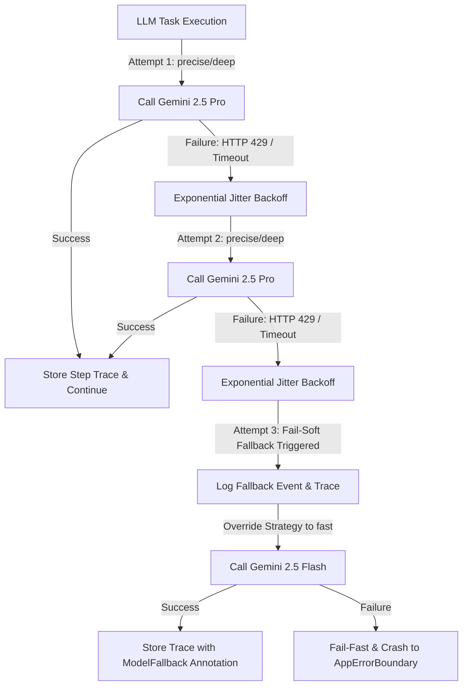

# Epic 64: Dynamic Model Strategy Balancing & Fail-Soft Fallback (Dynaaminen mallikuorman tasapainotus ja vikasietoinen Flash-varajärjestelmä)

> [!IMPORTANT]
> **THE FORENSIC-SAFE FAIL-SOFT DEGRADATION MANDATE**:
> Tämä Epic toteuttaa tiukkojen arkkitehtuuri- ja laatusääntöjen mukaisen dynaamisen mallikuorman tasapainotus- ja varajärjestelmän (Fail-Soft Fallback). Jos suuren kognitiivisen kuorman työnkulkuaskel (kuten `Falsifier` tai `Causal Analyst`, jotka käyttävät Gemini 2.5 Pro -mallia) kohtaa peräkkäisiä rajapintatason kiintiö- tai aikakatkaisuongelmia (HTTP 429 / 503) ja kuluttaa tenacity-yrityksensä loppuun, järjestelmä suorittaa viimeisellä yrityksellään hallitun ja turvallisen siirtymän `"fast"`-strategiaan (Gemini 2.5 Flash). Siirtymä tapahtuu täysin tyyppiturvallisesti, eksplisiittisesti kirjattuna ajonaikaiseen lokeihin ja suoritusjälkiin (`TraceEvent`), säilyttäen järjestelmän täydellisen läpinäkyvyyden ja forensisen auditoitavuuden (Forensic Sovereignty). Mitään hiljaisia tai piilotettuja taustamuutoksia ei sallita.

---

## 1. Yhteenveto ja Tavoite (Objective)

Tämän Epicin tavoitteena on varmistaa Quorum-työnkulkujen katkeamaton ajo ja maksimaalinen vikasietoisuus raskaiden ja rinnakkaisten LLM-suoritusten aikana. 

### Tunnistetut Nykytilan Haasteet:
1. **Vertex AI -kiintiöiden alttius rinnakkaistuksessa**: Raskaiden työnkulkujen (esim. Falsifier ja Causal Analyst) TaskGroup-askeleet kuluttavat sekunti- ja minuuttikohtaisia RPM/TPM-rajoja nopeasti. Tämä johtaa HTTP 429 (Resource Exhausted) rate-limit -kaatumisiin.
2. **Kovakoodatut ja jäykät mallivalinnat**: Monet työnkulkuaskeleet (kuten `step_input_processing` ja `Archivist`) käyttävät nykyisessä siemenaineistossa (`seed_data.json`) Pro-mallia (`"precise"`), vaikka ne suoriutuisivat nopeammin ja edullisemmin Flash-mallilla (`"fast"`).
3. **Hiljaisten fallbackien kielto vs. Täydellinen kaatuminen**: Tiukat arkkitehtoniset säännöt kieltävät hiljaiset ja hallitsemattomat varajärjestelmät (shadow states). Kuitenkin ilman hallittua fail-soft-degradointia järjestelmä kaatuu kokonaan pitkien ajojen päätteeksi, mikä heikentää käyttökokemusta ja tuhlaa jo tehtyjen askeleiden resursseja.

### Arkkitehtoninen Ratkaisu (Proposed Solution):
1. **Siemenaineiston mallistrategian optimointi**: Siirretään matalan kognitiivisen kuorman vaiheet (`step_input_processing`, `Profiler` ja `Archivist`) käyttämään `"fast"`-strategiaa (Gemini 2.5 Flash).
2. **Dynamic Fail-Soft Fallback -protokolla**:
   * Kun työnkulkuaskel suoritetaan `"deep"`, `"precise"` tai `"strict"` -strategialla (Pro-malli), tenacity-pohjainen `AsyncRetrying`-silmukka yrittää suoritusta dynaamisen eksponentiaalisen perääntymisajan puitteissa.
   * Jos suoritus epäonnistuu kaksi kertaa tilapäisiin virheisiin (HTTP 429, timeout, 502/503/504), tenacityn **kolmannella (viimeisellä) yrityksellä** järjestelmä pudottaa mallistrategian dynaamisesti `"fast"`-tasolle (Gemini 2.5 Flash).
3. **Eksplisiittinen auditoitavuus (Forensic Trail)**:
   * Vikasietoinen mallin alennus (downgrade) kirjataan explicit-tasolla järjestelmälokeihin ja tallennetaan suoritushistoriaan (`TraceEvent`) dynaamisena `ModelFallbackEvent`-tapahtumana tai lisämääreenä suoritusolioon.
   * Tämä takaa, että kehittäjät, analyytikot ja loppukäyttäjät näkevät tarkalleen, mitkä askeleet suoritettiin poikkeustilanteessa kevyemmällä mallilla.

---

## 2. Arkkitehtuuristen sääntöjen huomiointi (Compliance Matrix)

Kehityksessä on noudatettava tiukasti seuraavia `c:\src\quorum\.agents\rules` -hakemiston sääntöjä:

### 2.1. Ydinjärjestelmä ja laatuportit (00-antigravity-core.md)
* **The Zero-Compromise Pledge (00)**: Varajärjestelmää ei toteuteta hiljaisena oikotienä tai arvauksena. Jokainen fallback-tapahtuma on mallinnettu tiukasti Pydantic-skeemaan ja visualisoitavissa lokeissa ja suoritusjäljissä. Jos suoritus epäonnistuu myös vikasietoisella Flash-mallilla tai palauttaa virheellistä dataa, järjestelmän on kaaduttava välittömästi (`ValidationError` tai `AppException`).
* **The Duct Tape Ban (00)**: Ei peitetä virheitä tyhjillä sanakirjoilla tai unohdeta virheiden loggausta. Jos suoritus epäonnistuu myös Flash-mallilla, järjestelmä kaatuu fail-fast-periaatteen mukaisesti ja antaa AppErrorBoundarylle virheilmoituksen.
* **Mocking Mandate for LLM (00)**: Yksikkötestauksessa on ehdottomasti kiellettyä tehdä suoria verkkokutsuja ulkoisiin rajapintoihin. Kaikki testit on suoritettava hyödyntäen mock-ympäristöä (`backend_v2/llm/mock.py`) ja JSON-fixtuureja.
* **Atomic Checkpoint Mandate (00)**: Jokaisen onnistuneen vaiheen jälkeen on tehtävä atomaattinen git-tallennuspiste englanninkielisellä viestillä.

### 2.2. Backend-arkkitehtuuri ja rajoitukset (01-python-backend.md)
* **Security Logging Ban (01)**: Mitään käyttäjän antamia syötteitä (prompteja), raakoja vastauksia tai API-avaimia ei saa kirjoittaa lokeihin fallback-siirtymän aikana. Lokituksen on oltava DLP-yhteensopivaa (Data Leak Prevention).
* **No Inline Imports Exception (01)**: Kaikki raskaat ML/AI-kirjastot (kuten `litellm` tai `google-genai`) on ladattava laiskasti (lazy loading) suoraan funktioiden tai metodien sisältä (`__init__` tai `generate`), jotta PyO3-monialustusvirheet vältetään `pytest-cov`-ajoissa ja käynnistys nopeutuu.
* **No Naked Dicts in State (01)**: Vaikka tietokanta tai välimuisti vaatisi sanakirjamuotoista dataa, kaikki ajonaikaiset suoritusjäljet on vahvistettava Pydantic-mallien kautta ennen tallennusta: `MyModel.model_validate(data).model_dump(mode='json')`.

### 2.3. LLM-arkkitehtuuri ja suoritus (05_llm_architecture.md)
* **Direct SDK Calls Ban (05)**: Dynaaminen fallback ei saa ohittaa Model Registryä. Flash-malli on kutsuttava suoraan Model Registryn kautta käyttäen `"fast"`-strategiaa (`LLMClient.from_strategy("fast", repo)`), jotta FinOps-mittarit, kustannusseuranta ja token-seuranta pysyvät eheinä.
* **Infinite Retry Loops (05)**: Järjestelmän tenacity-yritysten enimmäismäärä on rajoitettava tiukasti arvoon `SystemConcurrency.LLM_MAX_RETRIES` (kiinnitetty arvoon 2, jolloin yrityskertoja on yhteensä 3).
* **High-Fidelity Prompting (05)**: Fallback-tilanteessa varmistetaan, että promptit pidetään 100 % yhteensopivina ja XML-tagitettuina (`<execution_parameters>`, `<source_data>`), jotta Flash-malli kykenee lukemaan ne oikein ilman huomion hajoamista ja hyödyntää maksimaalista välimuistia (Context Caching).

---

## 3. Arkkitehtuurinen Suunnittelu (Proposed Implementation)



### 3.1. Mallistrategian dynaaminen korvaus `provider.py` -tiedostossa

Muutetaan `LiteLLMProvider.generate` -metodia tai `LLMTaskExecutor` -kerrosta siten, että suorituksen epäonnistuessa yrityskerrat havaitaan dynaamisesti:

> [!IMPORTANT]
> **NO INLINE IMPORTS EXCEPTION FOR HEAVY AI LIBRARIES**:
> Varmista, että `import litellm` tai muut vastaavat raskaat riippuvuudet tuodaan ainoastaan metoditason sisällä. Älä sijoita näitä moduulin ylätasolle.

> [!CAUTION]
> **SECURITY LOGGING BAN Compliance**:
> Kun teet lokimerkintöjä tai tallennat `ModelFallbackEvent` -suoritusjälkiä, älä koskaan sisällytä lokiin raakaa kehotetta (`prompt`), käyttäjän PII-dataa tai API-avaimia. Tallenna vain looginen syy, yrityskerta ja Opaque System ID.

```python
# Hahmotelma muutoksesta LiteLLMProvider.generate -metodissa
max_rate_limit_retries = SystemConcurrency.LLM_MAX_RETRIES.value
current_strategy = self.model_name # esim. "vertex_ai/gemini-2.5-pro"

# LAISKA LATAUS (01-python-backend sääntö):
import litellm  # Tuodaan vasta metodin alussa

async for attempt in AsyncRetrying(
    stop=stop_after_attempt(max_rate_limit_retries + 1),
    wait=wait_combine(
        wait_exponential(
            multiplier=SystemConcurrency.LLM_RETRY_MULTIPLIER.value,
            min=SystemConcurrency.LLM_RETRY_MIN_SECONDS.value,
            max=SystemConcurrency.LLM_RETRY_MAX_SECONDS.value,
        ),
        wait_random(1, 5),
    ),
    retry=retry_if_exception(_is_transient_llm_error),
    reraise=True,
):
    with attempt:
        # PÄÄTÖS: Kolmannella (viimeisellä) yrityksellä alennetaan malli vikasietoiseksi Flashiksi
        if attempt.retry_state.attempt_number == (max_rate_limit_retries + 1):
            if current_strategy != "vertex_ai/gemini-2.5-flash":
                # TIETOSUOJA-AUDITOINTI: Ei PII-tietoja tai kehotteita lokeihin!
                logger.warning(
                    "[Fail-Soft Fallback] Heavy model strategy exhausted on attempt %s. "
                    "Downgrading from '%s' to 'vertex_ai/gemini-2.5-flash' to guarantee execution safety.",
                    attempt.retry_state.attempt_number,
                    current_strategy
                )

                # Korvataan kohdemalli dynaamisesti Model Registrystä haetulla Flashilla
                call_kwargs["model"] = "vertex_ai/gemini-2.5-flash"
                
        response = await asyncio.wait_for(
            self.router.acompletion(**call_kwargs), timeout=float(_timeout)
        )
```

---

## 4. Toteutusvaiheet (Implementation Phases)

### Phase 1: Siemenaineiston Mallistrategioiden Optimointi (Seed Database Updates)
* **Toimenpide**: Päivitetään matalan kognitiivisen tason askeleiden (`step_input_processing`, `Profiler`, `Archivist`) `model_strategy` arvoon `"fast"` `seed_data.json` -tiedostossa.
* **Varmistus**: Tyhjennetään ja ladataan tietokanta uudelleen (`run_seed.py local`).
* > [!WARNING]
  > **DIRECT DATABASE MUTATION BAN**:
  > Älä muokkaa käynninaikaista `data/db_v2.json` -tietokantaa suoraan lennosta. Kaikki muutokset on tehtävä siemenaineistoon `backend_v2/seed/seed_data.json` ja suoritettava `uv run python backend_v2/seed/run_seed.py` -skriptin kautta.

### Phase 2: Dynamic Fallback -logiikan Toteutus `provider.py` -tiedostoon (Engine Hardening)
* **Toimenpide**: Lisätään dynaaminen yrityskertojen seuranta tenacity-silmukkaan ja korvataan kutsuttava malli `"fast"`-strategian mukaisella mallilla viimeisellä yrityksellä.
* **Laiska Lataus**: Varmistetaan, että `litellm` tai `google-genai` tuodaan ainoastaan metoditasolla.
* > [!NOTE]
  > **NO NAKED DICTS IN STATE**:
  > Varmista, että askeleen palauttama raaka data validoidaan tiukalla Pydantic-skeemalla (`model_validate()`) ennen sen välittämistä eteenpäin.

### Phase 3: Auditoinnin ja Jäljitettävyyden Hardening (Forensic Parity)
* **Toimenpide**: Lisätään suoritusjälkiin (`TraceEvent`) tieto siitä, jos askel joutui turvautumaan fail-soft fallbackiin, jotta visualisointi (PDF/UI) voi näyttää varoituksen.
* **Varmistus**: Jäljen on noudatettava `Structured State Envelopes` -rakennetta (`List[StepOutputDTO]`), jossa fallback merkitään eksplisiittiseksi boolean-kentäksi tai `TraceEvent`-metadataksi.

### Phase 4: Yksikkötestien ja TDD-varmistuksen Luonti
* **Toimenpide**: Kirjoitetaan yksikkötesti tiedostoon `test_provider_rate_limit.py`, joka simuloi kahta 429-virhettä ja varmistaa, että kolmas yritys ohjautuu onnistuneesti Flash-malliin ja menee läpi.
* > [!IMPORTANT]
  > **MOCKING MANDATE FOR LLM**:
  > Yksikkötestit EIVÄT saa tehdä suoria HTTP-kutsuja ulkoisiin rajapintoihin. Käytä aina `backend_v2/llm/mock.py`-tiedoston mock-ratkaisuja ja `polyfactory`-kirjastoa testidatan luomiseen.
* **Testaus**: Suoritetaan testit tiukan laatuportin ja kattavuusvaatimusten (>90% kattavuus) puitteissa:
  ```powershell
  uv run python scripts/backend_audit_loop.py backend_v2/llm/tests/unit/test_provider_rate_limit.py --test
  ```

---

## 5. Definition of Done (DoD)

1. **Catastrophe Prevention**: Kaikki raskaat työkulut selviävät Vertex AI kiintiökatkoista pudottamalla suorituksen tarvittaessa hallitusti Flash-mallille.
2. **Zero Hardcoded Model Bypasses**: Varajärjestelmä käyttää yksinomaan Model Registryn `"fast"`-konfiguraatiota.
3. **Forensic Trace Integrity**: Jokainen dynamic-fallback-tapahtuma on logattu explisiittisesti ja tallennettu työnkulun ajonaikaiseen trace-lokiin.
4. **Zero Deprecation & Warning**: Koodi ei saa sisältää yhtäkään deprecated-varoitusta tai tyypitysvirhettä.
5. **Circuit Breaker Protocol**: Jos pytest tai auditointi epäonnistuu yli 3 kertaa peräkkäin, kehittäjä keskeyttää suorituksen ja analysoi virheen syvemmältä.
6. **Atomic Checkpoint Mandate**: Kaikki muutokset on tallennettu git-versionhallintaan atomaattisina englanninkielisinä committeina tarkkojen tiedostopolkujen kautta:
   ```powershell
   git add backend_v2/llm/provider.py backend_v2/tests/unit/test_provider_rate_limit.py
   git commit -m "feat: implement fail-soft fallback with lazy-loaded provider logic"
   ```
