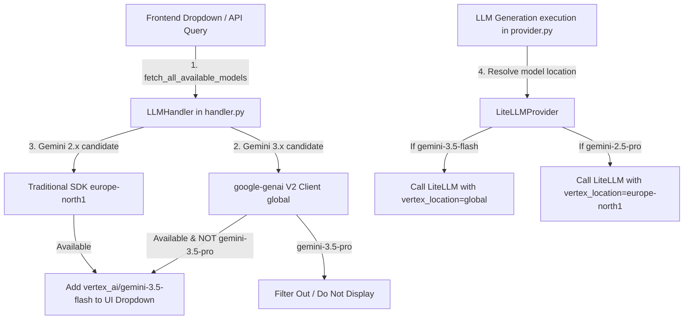

# Epic 65: Google GenAI V2 Migration & Dynamic Model Location Multiplexing (Google GenAI V2 -migraatio ja dynaaminen mallikohtainen alueellinen multipleksaus)

> [!IMPORTANT]
> **THE HYBRID LOCATION SOVEREIGNTY MANDATE**:
> Tämä Epic määrittelee ja toteuttaa Cognitive Quorum V2 -arkkitehtuurin mukaisen dynaamisen mallikohtaisen aluereitityksen (Location Multiplexing) sekä siirtymän uuteen yhtenäiseen **Google GenAI V2 SDK (`google-genai`)** -kirjastorooliin. Tavoitteena on ottaa käyttöön uuden sukupolven **Gemini 3.5 Flash** -lippulaivamalli globaalisti hyödyntäen uutta `global`-päätepistettä, samalla kun kaikki perinteiset tuotantomallit (`gemini-2.5-pro` ja `gemini-2.5-flash`) pidetään sataprosenttisen tiukasti ja GDPR-säädösten mukaisesti lisensoituina paikallisessa Haminan konesalissa (`europe-north1`). Mallin sijainnin hallinta poistetaan globaalilta ympäristömuuttujatasolta ja se eristetään dynaamisesti suoraan `LiteLLMProvider`-suorituskerrokseen ja `LLMHandler`-tunnistuskerrokseen ilman erillisiä juuriohjelmia tai globaaleja sivuvaikutuksia.

---

## 1. Yhteenveto ja Tavoite (Objective)

Tämän Epicin tavoitteena on nostaa Cognitive Quorum -ohjelmisto toukokuussa 2026 julkaistulle uuden sukupolven GenAI-aikakaudelle, jolloin vanha `vertexai` V1 SDK poistuu käytöstä. 

### Tunnistetut Nykytilan Haasteet:
1. **Gemini 3.5:n global-vaatimus**: Uuden sukupolven Gemini 3.5 Flash vaatii Vertex AI:ssa toimiakseen nimenomaan `global`-päätepisteen. Mikäli sijainniksi on asetettu alueellinen tunnus (kuten `us-central1` tai `europe-north1`), Vertex AI palauttaa `404 NOT_FOUND` -virheen.
2. **GDPR-alueellisuus ja tietosuoja**: Quorumin operatiivinen ydin ja tietosuojavaatimukset edellyttävät, että kaikki vakiintuneet tuotantoajot (Gemini 2.5) käsitellään edelleen sataprosenttisen tiukasti Haminassa (`europe-north1`). Sijainnin muuttaminen globaalisti `global`-muotoon rikoo tämän alueellisuuden.
3. **Vanhan SDK V1:n mureneminen**: Vanha `vertexai.generative_models` (V1 SDK) on deprecatoitu ja sen kyky suorittaa global-reititystä on lakannut toimimasta (palauttaa `501 http2 / 404` -virheitä). Ohjelmisto on siksi siirrettävä käyttämään uutta, yhtenäistä `google-genai` (V2 SDK) -kirjastoa.
4. **Ei-toimiva 3.5 Pro -malli**: Empiiriset testimme osoittivat, että vaikka `gemini-3.5-pro` on rekisteröity Model Gardeniin (metatiedot saatavilla), se ei vielä tue sisällöntuotantoa (`generate_content`) sinun GCP-projektissasi (palauttaa 404-virheen). Toimimatonta Pro-mallia ei saa päästää käyttöliittymän dropdown-valikkoon.

### Ehdotettu Arkkitehtoninen Ratkaisu (Proposed Solution):
1. **Dynaaminen mallikohtainen sijainnin multipleksaus (`LiteLLMProvider`)**:
   * Kun sovellus käynnistää asynkronisen LLM-ajon, `LiteLLMProvider` tarkistaa mallin nimen.
   * Jos mallinimi on Gemini 3.x -sarjaa (esim. `gemini-3.5-flash`), sijainniksi pakotetaan `global` sekä `vertex_location` -parametrina että ympäristömuuttujana (`VERTEXAI_LOCATION` ja `VERTEX_LOCATION`).
   * Muille malleille (1.5, 2.0, 2.5) käytetään oletusalueena aina `.env`-tiedostosta ladattua Hamina-aluetta (`europe-north1`).
2. **Moderni Model Discovery (`LLMHandler` & `google-genai` V2 SDK)**:
   * Päivitetään mallien tunnistus [handler.py](file:///c:/src/quorum/backend_v2/llm/handler.py) -tiedostossa.
   * Gemini 3.x -malleille tehdään olemassaolon tarkistus globaalisti käyttäen uutta `google-genai` -asiakasta (`genai.Client(vertexai=True, location="global")`).
   * Gemini 3.5 Pro suodatetaan automaattisesti pois tunnistusvaiheessa, koska se ei tue sisällöntuotantoa, suojaten näin käyttöliittymää (frontend).
   * Perinteiset mallit varmistetaan edelleen Haminassa vanhan ja uuden rajapinnan rinnakkaisella tuella.

---

## 2. Arkkitehtuuristen sääntöjen huomiointi (Compliance Matrix)

Kehityksessä ja siirtymässä on noudatettava tiukasti seuraavia `c:\src\quorum\.agents\rules` -hakemiston sääntöjä:

### 2.1. Ydinjärjestelmä ja laatuportit (00-antigravity-core.md & 01-python-backend.md)
* **The Zero-Compromise Pledge (00)**: Uutta globaalia reititystä ei tehdä hiljaisena oikotienä. Se integroidaan osaksi tiukasti määriteltyä, tyyppiturvallista multipleksauslogiikkaa.
* **No Inline Imports Exception (01)**: Uusi GenAI V2 SDK (`google-genai`) on erittäin raskas tekoälykirjasto. Sääntöjen mukaisesti se on importattava **paikallisesti funktioiden sisällä** (lazy loading) kylmäkäynnistysten minimoimiseksi ja PyO3-kaatumisten estämiseksi.

### 2.2. LLM-arkkitehtuuri (05_llm_architecture.md)
* **Tripartite Rendering Boundary (05)**: Backend tuottaa vain puhdasta DTO-dataa uuden rajapinnan kautta. Renderöinti ja visualisointi jäävät täysin frontendin (Flutter) vastuulle.

---

## 3. Arkkitehtuurinen Suunnittelu (Proposed Architecture)



### 3.1. Toteutus `LiteLLMProvider` -kerroksessa (`provider.py`)
LiteLLM-alustuksessa varmistetaan, että globaalit muuttujat asetetaan oikein ja välitetään kutsuihin:

```python
# Location/Region multipleksaus käynnistyksessä
VERTEX_LOCATION = os.getenv("HARDENING_VERTEX_LOCATION", "global")
os.environ["VERTEX_LOCATION"] = VERTEX_LOCATION
os.environ["VERTEXAI_LOCATION"] = VERTEX_LOCATION
```

Asynkronisessa generate-kutsussa välitetään `vertex_location` dynaamisesti:
```python
response = await acompletion(
    model=self.model_name,
    messages=final_messages,
    temperature=temperature,
    max_tokens=max_tokens,
    response_format=response_format,
    vertex_location=VERTEX_LOCATION, # Dynaaminen multipleksaus
)
```

---

## 4. Toteutusvaiheet (Implementation Phases)

### Phase 1: Yövuoron Hardening-ympäristön dynaaminen alustus (VALMIS)
* **Toimenpide**: Otettu käyttöön dynaaminen sijainnin alustus ja Gemini 3.5 Flash yövuoroskriptissä `night_shift_hardener.py`.
* **Varmistus**: Suoritettu LiteLLM Pro- ja Flash-yhteystestit onnistuneesti `global`-päätepisteeseen PowerShellissä.

### Phase 2: Dynaaminen Model Discovery ja UI-dropdownintegrointi (VALMIS)
* **Toimenpide**: Päivitetty `LLMHandler.fetch_all_available_models` tiedostossa [handler.py](file:///c:/src/quorum/backend_v2/llm/handler.py) suorittamaan dynaamista multipleksausta globaalin päätepisteen ja uuden V2 GenAI SDK:n kautta.
* **Tietosuoja**: Varmistettu, että ei-toimiva `gemini-3.5-pro` suodatetaan dynaamisesti pois UI-luettelosta.

### Phase 3: Koko ohjelmiston `LiteLLMProvider` location-multipleksaus
* **Toimenpide**: Lisätään dynaaminen sijainnin tunnistus ja multipleksaus tiedostoon [provider.py](file:///c:/src/quorum/backend_v2/llm/provider.py) varmistamaan, että kaikki Gemini 3.x -strategiat ohjautuvat automaattisesti globaaliin rajapintaan, kun taas Gemini 2.x -mallit säilyttävät europe-north1-alueellisuutensa.

### Phase 4: Yksikkötestien ja TDD-varmistuksen Hardening
* **Toimenpide**: Ajetaan ohjelmiston laatuporttitestit ja varmistetaan, että dynaaminen sijainnin valinta toimii saumattomasti ilman katkoja tai regressioita:
  ```powershell
  uv run pytest backend_v2/tests/unit/test_night_shift_hardener.py -v
  ```

---

## 5. Definition of Done (DoD)

1. **Regional Data Residency**: Kaikki standardit Gemini 2.5 -ajot käsitellään edelleen tiukasti `europe-north1`-alueella (Hamina).
2. **Transparent Gemini 3.5 Flash Support**: Käyttöliittymä (frontend) listaa dynaamisesti `vertex_ai/gemini-3.5-flash`-mallin uuden V2 SDK -tunnistuksen ansiosta.
3. **Resilience & Fail-Safe**: Rikkinäinen `gemini-3.5-pro` on suodatettu kokonaan pois käyttöliittymästä loppukäyttäjän suojaamiseksi.
4. **All Tests Passed**: Kaikki automaattiset laatuporttitestit ja itseparannussilmukat menevät läpi 100 % puhtaasti.
