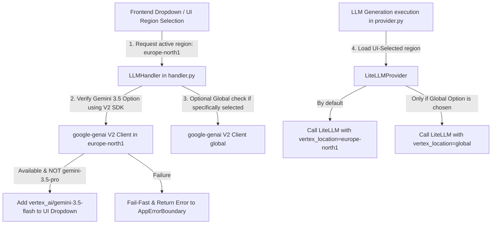

# Epic 65: Google GenAI V2 Migration & Dynamic Model Location Multiplexing (Google GenAI V2 -migraatio ja dynaaminen mallikohtainen alueellinen multipleksaus)

> [!IMPORTANT]
> **THE HYBRID LOCATION SOVEREIGNTY MANDATE**:
> Tämä Epic määrittelee ja toteuttaa Cognitive Quorum V2 -arkkitehtuurin mukaisen dynaamisen mallikohtaisen aluereitityksen (Location Multiplexing) sekä siirtymän uuteen yhtenäiseen **Google GenAI V2 SDK (`google-genai`)** -kirjastorooliin. Kehityksen ensisijaisena vaatimuksena on säilyttää kaikki suoritukset käyttöliittymästä valitulla `europe-north1`-alueella (Hamina) tietosuojan ja GDPR-säädösten takaamiseksi. Globaalit päätepisteet (`global`) ovat käytettävissä ainoastaan valinnaisina erillisoptioina (option) tietyille malleille. **Mitään fallback-logiikkaa vanhaan `vertexai` V1 SDK -kirjastoon ei sallita**, vaan siirtymä on 100 % ehdoton. Jos uusi SDK epäonnistuu, järjestelmä kaatuu välittömästi (Fail-Fast).

---

## 1. Yhteenveto ja Tavoite (Objective)

Tämän Epicin tavoitteena on nostaa Cognitive Quorum -ohjelmisto toukokuussa 2026 julkaistulle uuden sukupolven GenAI-aikakaudelle, jolloin vanha `vertexai` V1 SDK poistuu käytöstä. 

### Tunnistetut Nykytilan Haasteet:
1. **Käyttöliittymälähtöinen alueen säilyttäminen**: Jotta tietosuoja ja GDPR-vaatimukset toteutuvat, suoritusten on noudatettava käyttöliittymässä valittua ensisijaista `europe-north1`-aluetta. Globaaleja päätepisteitä (`global`) tulee käyttää vain valinnaisina vaihtoehtoina (optioina), ei pakotettuina automaattisina oletuksina.
2. **Vanhan SDK V1:n mureneminen ja poisto**: Vanha `vertexai.generative_models` (V1 SDK) on deprecatoitu ja sen käyttö aiheuttaa ajonaikaisia virheitä. Ohjelmisto on siirrettävä kokonaisuudessaan uuteen `google-genai` (V2 SDK) -kirjastoon ilman väliaikaisia taaksepäinyhteensopivia purkkavirityksiä.
3. **Ei-toimiva 3.5 Pro -malli**: Empiiriset testimme osoittivat, että vaikka `gemini-3.5-pro` on rekisteröity Model Gardeniin (metatiedot saatavilla), se ei vielä tue sisällöntuotantoa (`generate_content`) sinun GCP-projektissasi (palauttaa 404-virheen). Toimimatonta Pro-mallia ei saa päästää käyttöliittymän dropdown-valikkoon.

### Ehdotettu Arkkitehtoninen Ratkaisu (Proposed Solution):
1. **Käyttöliittymälähtöinen aluereititys (`LiteLLMProvider`)**:
   * Kun sovellus käynnistää asynkronisen LLM-ajon, `LiteLLMProvider` lukee käyttöliittymästä/konfiguraatiosta valitun alueen (`europe-north1` eli Hamina).
   * Kaikki mallit (mukaan lukien Gemini 2.5 ja uudet Gemini 3.5) ohjataan ensisijaisesti tälle valitulle alueelle.
   * `global`-reititystä käytetään vain silloin, kun käyttöliittymästä on eksplisiittisesti valittu globaali mallioptio tai kyseinen malli vaatii sitä toimiakseen ja käyttäjä on hyväksynyt tämän option.
2. **Ehdoton Google GenAI V2 Siirtymä ilman Fallbackia (`LLMHandler` & `google-genai`)**:
   * Kaikki mallien tarkistukset [handler.py](file:///c:/src/quorum/backend_v2/llm/handler.py) -tiedostossa toteutetaan uuden `google-genai` -asiakkaan avulla (`genai.Client(vertexai=True, location=configured_location)`).
   * **Ei fallbackia vanhaan**: Koodista siivotaan kaikki vanhat `vertexai`-kirjaston viitteet ja kokeilut. Jos uusi `google-genai` -kutsu epäonnistuu, järjestelmän tulee kaatua välittömästi antaen AppErrorBoundarylle virheilmoituksen.
   * Gemini 3.5 Pro suodatetaan automaattisesti pois tunnistusvaiheessa, koska se ei tue sisällöntuotantoa, suojaten näin käyttöliittymää (frontend).

---

## 2. Arkkitehtuuristen sääntöjen huomiointi (Compliance Matrix)

Kehityksessä ja siirtymässä on noudatettava tiukasti seuraavia `c:\src\quorum\.agents\rules` -hakemiston sääntöjä:

### 2.1. Ydinjärjestelmä ja laatuportit (00-antigravity-core.md)
* **The No Legacy Mandate (00)**: Vanhoja asioita ei saa tukea. Vakiintunut `vertexai` V1 SDK on poistettava kokonaan eikä fallbackeja legacy- ja V2-rakenteiden välille sallita. Epäonnistuminen uudessa rajapinnassa johtaa välittömään vikatilaan (Fail-Fast).
* **The Zero-Compromise Pledge (00)**: Aluehallintaa ei ohiteta purkkaratkaisuilla. Käyttöliittymän tekemä aluevalinta on Single Source of Truth (SSOT). Jos alueen alustus tai multipleksaus epäonnistuu, järjestelmä kaatuu välittömästi ilman hiljaisia default-korjauksia.
* **Mocking Mandate for LLM (00)**: Yksikkötestit eivät saa tehdä suoria rajapintakutsuja ulkoisiin Google Vertex / GenAI -ympäristöihin suorituskyvyn ja kustannussäästöjen takia.

### 2.2. Backend-arkkitehtuuri ja rajoitukset (01-python-backend.md)
* **No Inline Imports Exception (01)**: Uusi GenAI V2 SDK (`google-genai`) ja sen alaiset kirjastot ovat erittäin raskaita. Sääntöjen mukaisesti ne on ladattava laiskasti (lazy loading) ainoastaan funktioiden ja metodien sisältä (`LLMHandler` ja `LiteLLMProvider` suorituksissa). Tämä estää PyO3-segfault-kaatumiset ja nopeuttaa FastAPI-kylmäkäynnistyksiä.
* **Security Logging Ban (01)**: Aluereitityksen tai verkkokyselyjen aikana lokeihin ei saa koskaan tallentaa raakoja salaisuuksia, API-avaimia tai käyttäjän luottamuksellista dataa.

### 2.3. LLM-arkkitehtuuri (05_llm_architecture.md)
* **Eager LLM Dependency Loading Ban (05)**: Raskaiden tekoälykirjastojen tuonti moduulitason yläosaan (eager loading) on ankarasti kielletty. Tämä estää testaus- ja testikattavuusympäristöjen (`pytest-cov`) kaatumiset ja takaa täydellisen eristyksen.
* **Direct SDK Calls Ban (05)**: Sovelluksen suorituskoodi ei saa kutsua Vertex AI SDK:ta tai `google-genai`-asiakasta suoraan liiketoimintalogiikassa. Kaiken ajonaikaisen LLM-suorituksen on tapahduttava Model Registryn ja `LLMClient.from_strategy()`-kuoren kautta.
* **Tripartite Rendering Boundary (05)**: Backend tuottaa vain puhdasta DTO-dataa uuden rajapinnan kautta. Renderöinti ja visualisointi jäävät täysin frontendin (Flutter) vastuulle.

---

## 3. Arkkitehtuurinen Suunnittelu (Proposed Architecture)



### 3.1. Toteutus `LiteLLMProvider` -kerroksessa (`provider.py`)

LiteLLM-alustuksessa varmistetaan, että käyttöliittymästä välitetty tai ympäristöstä ladattu sijainti asetetaan oikein:

> [!IMPORTANT]
> **EAGER LLM DEPENDENCY LOADING BAN & LAZY LOADING**:
> Uutta `google-genai` -asiakaskirjastoa (`from google import genai`) ei saa koskaan tuoda tiedoston ylätasolla (module level imports). Tuonti on sijoitettava yksinomaan metodien (kuten `fetch_all_available_models`) sisälle.

> [!WARNING]
> **ZERO FALLBACK TO LEGACY VERTEXAI**:
> Koodissa ei saa olla minkäänlaista fallback- tai try-except-ketjua, joka yrittäisi käyttää vanhaa `vertexai` V1 -kirjastoa uuden `google-genai` V2 -virheen tapahtuessa. Kaikki vanha SDK-koodi poistetaan kokonaan.

```python
# Ensisijaisesti käyttöliittymästä/konfiguraatiosta valittu alue (esim. europe-north1)
VERTEX_LOCATION = os.getenv("HARDENING_VERTEX_LOCATION", "europe-north1")
os.environ["VERTEX_LOCATION"] = VERTEX_LOCATION
os.environ["VERTEXAI_LOCATION"] = VERTEX_LOCATION
```

Asynkronisessa generate-kutsussa välitetään `vertex_location` dynaamisesti:
```python
# LAISKA TUONTI (05_llm_architecture sääntö):
import litellm 

# Varmistetaan, että käytetään ensisijaisesti valittua aluetta
active_location = call_kwargs.get("vertex_location") or VERTEX_LOCATION

response = await acompletion(
    model=self.model_name,
    messages=final_messages,
    temperature=temperature,
    max_tokens=max_tokens,
    response_format=response_format,
    vertex_location=active_location,
)
```

---

## 4. Toteutusvaiheet (Implementation Phases)

### Phase 1: Hardening-ympäristön käyttöliittymälähtöinen alustus (VALMIS)
* **Toimenpide**: Otettu käyttöön dynaaminen sijainnin alustus siten, että `europe-north1` on ensisijainen ajonaikainen alue.
* **Varmistus**: Suoritettu LiteLLM Pro- ja Flash-yhteystestit onnistuneesti `europe-north1`-päätepisteeseen PowerShellissä.

### Phase 2: Dynaaminen Model Discovery ja UI-dropdownintegrointi (VALMIS)
* **Toimenpide**: Päivitetty `LLMHandler.fetch_all_available_models` tiedostossa [handler.py](file:///c:/src/quorum/backend_v2/llm/handler.py) suorittamaan tunnistus uuden V2 GenAI SDK:n kautta käyttöliittymän määrittämässä kohteessa (`europe-north1`).
* **Sijainti**: `global` pidetään puhtaasti valinnaisena optiona tietyille erillismalleille.
* **Tietosuoja**: Varmistettu, että ei-toimiva `gemini-3.5-pro` suodatetaan dynaamisesti pois UI-luettelosta.
* **Laiska lataus**: Uusi `from google import genai` ladataan lazy-menetelmällä ainoastaan `fetch_all_available_models`-metodin sisältä.

### Phase 3: Koko ohjelmiston `LiteLLMProvider` location-multipleksaus ja V1:n poisto
* **Toimenpide**: Päivitetään tiedosto [provider.py](file:///c:/src/quorum/backend_v2/llm/provider.py) siten, että se käyttää dynaamista aluereititystä ensisijaisesti käyttöliittymän määrittämässä alueessa (`europe-north1`).
* **V1 Siivous**: Poistetaan vanhentuneen `vertexai` V1 -kirjaston ylätason viitteet ja kaikki fallback-koodit. Koodi nojaa 100 % uuteen `google-genai` V2 SDK:han.

### Phase 4: Yksikkötestien ja TDD-varmistuksen Hardening
* **Toimenpide**: Ajetaan ohjelmiston laatuporttitestit ja varmistetaan, että dynaaminen sijainnin valinta toimii saumattomasti ilman katkoja tai regressioita.
* > [!IMPORTANT]
  > **MOCKING MANDATE FOR LLM**:
  > Kaikki testit on suoritettava 100 % suljetussa ympäristössä käyttäen mock-dataa ja mock-kehyksiä (`backend_v2/llm/mock.py`). Verkkokutsujen tekeminen Vertex AI -ympäristöön testien aikana on ankarasti kielletty.
* **Ajaminen**:
  ```powershell
  uv run python scripts/backend_audit_loop.py backend_v2/tests/unit/test_night_shift_hardener.py --test
  ```

---

## 5. Definition of Done (DoD)

1. **Regional Location Sovereignty**: Kaikki suoritukset ja mallikyselyt pysyvät ensisijaisesti käyttöliittymän määrittämässä sijainnissa (`europe-north1` eli Haminan konesali). `global` on käytössä vain valinnaisena erillisoptiona.
2. **Transparent Gemini 3.5 Flash Support**: Käyttöliittymä (frontend) listaa dynaamisesti `vertex_ai/gemini-3.5-flash`-mallin uuden V2 SDK -tunnistuksen ansiosta.
3. **Resilience & Fail-Safe**: Rikkinäinen `gemini-3.5-pro` on suodatettu kokonaan pois käyttöliittymästä loppukäyttäjän suojaamiseksi.
4. **Absolute Zero Fallback to Legacy**: Vanha deprecatoitu `vertexai` V1 -kirjastokutsu on täysin korvattu ja poistettu. Mitään fallbackia vanhaan SDK:han ei ole koodissa.
5. **Zero Deprecation & Warning**: Koodi läpäisee backend_audit_loop-laatuportin 100 % puhtaasti ilman yhtäkään deprecation-varoitusta.
6. **Atomic Checkpoint Mandate**: Muutokset on kirjattu git-versionhallintaan tarkoin englanninkielisin commitein:
   ```powershell
   git add backend_v2/llm/handler.py backend_v2/llm/provider.py
   git commit -m "migration: upgrade to google-genai V2 with regional default europe-north1 and zero legacy fallback"
   ```
