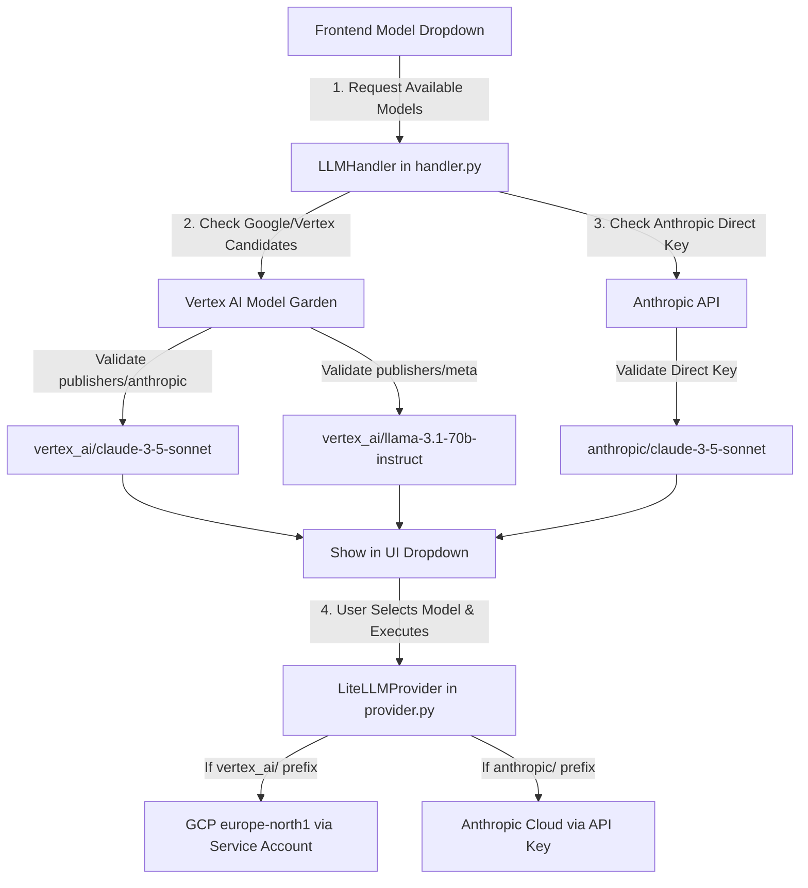

# Epic 66: Unified Vertex AI Model Garden & Multi-Provider Integration (Yhtenäistetyn Vertex AI Model Gardenin ja monitarjoajamalliston integrointi)

> [!IMPORTANT]
> **THE MULTI-PROVIDER RESILIENCE MANDATE**:
> Tämä Epic määrittelee ja toteuttaa Cognitive Quorum V2 -arkkitehtuurin mukaisen monitarjoajamalliston (Multi-Provider Model Garden) integroinnin. Tavoitteena on tuoda käyttöliittymään (frontend dropdown) valittavaksi Googlen Gemini-mallien lisäksi muut maailman johtavat huippumallit – erityisesti **Anthropic Claude 3.5**, **Meta Llama 3.1/3.2** ja **Mistral AI** – kahta rinnakkaista reititysväylää pitkin:
> 1. **Väylä A (Vertex AI Model Garden)**: Suojattu, yritystason integrointi, jossa kolmannen osapuolen mallit suoritetaan Google Cloudin suojatussa konesalissa palvelutilin (`service-account.json`) kautta ilman ulkopuolisia API-avaimia.
> 2. **Väylä B (Direct Provider API)**: Suora integraatio Anthropicin pilvirajapintoihin hyödyntäen `.env`-tiedoston erillisiä avaimia (`ANTHROPIC_API_KEY`) joustavuuden ja kehittäjätestauksen maksimoimiseksi.
> OpenAI:n ChatGPT-mallit eristetään tiukasti kulkemaan ainoastaan suoran OpenAI-väylän kautta, sillä niitä ei kilpailutilanteen vuoksi tueta Google Cloudin Model Gardenissa.
> **Mitään hiljaisia fallbackeja ei sallita**: Jos valittu kolmannen osapuolen malli tai rajapinta epäonnistuu, järjestelmän on kaaduttava välittömästi (Fail-Fast) ilman hiljaista siirtymistä Geminiin.

---

## 1. Yhteenveto ja Tavoite (Objective)

Tämän Epicin tavoitteena on muuttaa Cognitive Quorum täysin malli-agnostiseksi enterprise-luokan diagnostiikka-alustaksi (Model Agnostic Architecture). Käyttäjällä ja taustatyönkuluilla on oltava vapaus valita kulloiseenkin kognitiiviseen tehtävään parhaiten soveltuva malli suoraan käyttöliittymästä.

### Tunnistetut Nykytilan Haasteet:
1. **Gemini-riippuvuus käyttöliittymässä**: Vaikka ydinarkkitehtuuri (`provider.py`) tukee LiteLLM-kääreen ansiosta monia malleja, backendin mallintunnistus (`handler.py`) suodattaa ja palauttaa frontendille vain Googlen Gemini-malleja.
2. **Keskittämätön avaintenhallinta**: Kolmannen osapuolen mallien (kuten Clauden) käyttö edellyttää kehittäjiltä erillisten API-avaimien hankintaa ja konfigurointia, mikä estää keskitetyn yritystason laskutuksen ja auditointipolun suojatuissa tuotantoympäristöissä.
3. **Model Gardenin dynaamisen reitityksen puute**: Vertex AI:ssa eri julkaisijoiden (kuten Metan, Anthropicin ja Mistralin) mallit on rekisteröity eri nimiavaruuksiin ja päätepisteisiin Model Gardenissa, eikä nykyinen `LLMHandler` osaa dynaamisesti luokitella tai tarkistaa näiden saatavuutta.

### Arkkitehtoninen Ratkaisu (Proposed Solution):
1. **Dynaaminen monitarjoaja-Discovery (`LLMHandler.fetch_all_available_models`)**:
   * Laajennetaan `LLMHandler`-luokkaa tunnistamaan ja validoimaan kolmannen osapuolen ehdokkaat (kuten `vertex_ai/claude-3-5-sonnet` tai `vertex_ai/llama-3.1-70b-instruct`) Model Gardenista.
   * Kyselyjen reititys osoitetaan dynaamisesti oikeille julkaisijatunnuksille (esim. `/publishers/anthropic/models/...` tai `/publishers/meta/models/...`).
2. **Anthropic Direct API -integrointi käyttöliittymään**:
   * Aktivoidaan `anthropic` yhtenä suorista UI-tarjoajista `Settings.enabled_providers` -kentässä, jos `ANTHROPIC_API_KEY` on määritetty `.env`-tiedostossa.
   * Palautetaan viralliset, tuotantovalmiit suorat Claude-mallit frontendille.
3. **Malli-Agnostinen laadunvalvonta**:
   * Varmistetaan, että `LiteLLMProvider` suorittaa ja kustannusseuraa kaikkia näitä malleja täysin yhtenäisesti, raportoiden tokenit ja FinOps-kulutuksen yhtenäiseen `TokenUsage`-tietokantatauluun.

---

## 2. Arkkitehtuuristen sääntöjen huomiointi (Compliance Matrix)

Kehityksessä on noudatettava tiukasti seuraavia `c:\src\quorum\.agents\rules` -hakemiston sääntöjä:

### 2.1. Ydinjärjestelmä ja laatuportit (00-antigravity-core.md)
* **The Zero-Compromise Pledge (00)**: Kolmannen osapuolen malleja käytettäessä ei toteuteta hiljaisia fallbackeja. Jos Claude tai Llama epäonnistuu, järjestelmän on kaaduttava välittömästi (`AppException` tai `ValidationError`), jotta virhe ei peity eikä kognitiivinen taso heikkene salaa ilman jälkeä lokeissa.
* **Mocking Mandate for LLM (00)**: Kaikki kolmansien osapuolten rajapintoihin ja Model Garden -päätepisteisiin kohdistuvat kyselyt yksikkö- ja integraatiotesteissä on korvattava 100 % suljetulla mock-ympäristöllä (`backend_v2/llm/mock.py`) ja testikohtaisilla JSON-fixtuureilla.
* **Temporary Workspace Sandbox (00)**: Mahdolliset ad-hoc yhteydentestausohjelmat ja aputyökalut on kirjoitettava ja suoritettava ainoastaan `c:\src\quorum\tmp\` -hakemistossa.

### 2.2. Backend-arkkitehtuuri ja rajoitukset (01-python-backend.md)
* **No Inline Imports Exception (01)**: Kaikki uudet ja vanhat ML/AI-kirjastot (mukaan lukien `litellm`, `google-genai` ja mahdollinen `vertexai`-asiakas) on tuotava laiskasti (lazy loading) suoraan funktioiden tai metodien sisältä. Tämä estää PyO3-kaatumiset ja nopeuttaa FastAPI-kylmäkäynnistyksiä.
* **Security Logging Ban (01)**: Mitään kolmansien osapuolien rajapinta-avaimia (kuten `ANTHROPIC_API_KEY` tai GCP-palvelutilin salaisuuksia) ei saa koskaan kirjoittaa lokitiedostoihin (`backend_debug.log`) tai palauttaa virheviesteissä.
* **Zero DB Hardcoding Mandate (01)**: Monitarjoajaympäristön mallien on oltava dynaamisesti luokiteltavissa ja suodatettavissa polymorfisesti ilman kovakoodattuja ID-ehtoja backend-logiikassa.

### 2.3. LLM-arkkitehtuuri ja suoritus (05_llm_architecture.md)
* **Eager LLM Dependency Loading Ban (05)**: Tekoälykirjastojen ylätason tuonnit moduulin yläosassa ovat ankarasti kiellettyjä, jotta testauskattavuuden kerääminen (`pytest-cov`) ja CI/CD-putket eivät kaadu puuttuvien tekoälyympäristöjen vuoksi.
* **Direct SDK Calls Ban (05)**: Suorat, ad-hoc API-kutsut kolmannen osapuolen omiin kirjastoihin ovat liiketoimintalogiikassa kiellettyjä. Kaikki LLM-suoritukset ohjataan yhtenäisen Model Registryn ja `LLMClient.from_strategy()`-kuoren kautta.

---

## 3. Arkkitehtuurinen Suunnittelu (Proposed Implementation)



### 3.1. Mallien tunnistuksen dynaaminen laajennus (`handler.py`)

Muutetaan `check_model` -alifunktiota siten, että se osaa dynaamisesti luokitella julkaisijat Google Model Gardenissa:

> [!IMPORTANT]
> **NO INLINE IMPORTS & LAZY LOADING EXCEPTION**:
> `import vertexai` tai muut vastaavat raskaat tekoälymoduulit on tuotava ainoastaan metodin/funktion sisällä (`check_model` alussa). Ylätason tuonnit moduulissa ovat ehdottomasti kiellettyjä.

> [!CAUTION]
> **SECURITY LOGGING & KEY FIREWALL**:
> Älä koskaan lokita tai altista `.env`-tiedostosta ladattuja API-avaimia tai palvelutilien salaisuuksia.

```python
def check_model(model_id: str) -> str | None:
    # LAISKA TUONTI (01-python-backend & 05_llm_architecture säännöt):
    import vertexai
    
    clean_id = model_id
    for prefix in ["vertex_ai/", "gemini/", "models/"]:
        if clean_id.startswith(prefix):
            clean_id = clean_id[len(prefix) :]

    # Luokitellaan julkaisija nimen perusteella
    if "claude" in clean_id:
        publisher = "anthropic"
    elif "llama" in clean_id:
        publisher = "meta"
    elif "mistral" in clean_id:
        publisher = "mistralai"
    else:
        publisher = "google"

    try:
        vertexai.init(project=project, location=target_location, credentials=credentials)
        try:
            # Varmistetaan olemassaolo dynaamisen julkaisija-osoitteen kautta
            url = f"https://{target_location}-aiplatform.googleapis.com/v1/publishers/{publisher}/models/{clean_id}"
            resp = requests.get(url, headers=headers, timeout=5)
            if resp.status_code == 200:
                return f"vertex_ai/{clean_id}"
            return None
        except Exception:
            return None
    except Exception:
        return None
```

---

## 4. Toteutusvaiheet (Implementation Phases)

### Phase 1: Asetusten ja Feature Flagien Hardening (`settings.py`)
* **Toimenpide**: Otetaan `Settings.enabled_providers` -metodiin mukaan `anthropic`-tarjoaja, jos `anthropic_api_key` löytyy `.env`-tiedostosta.
* **Varmistus**: Ajetut asetustestit varmistavat, ettei tyhjiä avaimia päästetä läpi.

### Phase 2: Dynaaminen Julkaisijatunnistus Model Gardenissa (`handler.py`)
* **Toimenpide**: Päivitetään [handler.py](file:///c:/src/quorum/backend_v2/llm/handler.py) osamaankin tekemään dynaamisia Model Garden -varmistuksia muille kuin `google`-julkaisijoille (kuten `anthropic` ja `meta`).
* **Laiska Lataus**: Varmistetaan, että `vertexai` ladataan lazy loading -menetelmällä.
* **Varmistus**: Varmistetaan, että `vertex_ai/claude-3-5-sonnet` palauttaa onnistuneen tuloksen, kun se otetaan käyttöön testissä.

### Phase 3: Natiivi Anthropic Direct -malliluettelo
* **Toimenpide**: Lisätään suorien Anthropic-mallien listaus (`anthropic/claude-3-5-sonnet-20241022` jne.) osaksi `fetch_all_available_models` -metodia.

### Phase 4: Käyttöliittymätestaus ja Päästä-Päähän-valideeraus (End-to-End)
* **Toimenpide**: Testataan mallien dynaaminen latautuminen frontendin dropdown-valikkoon ja suoritetaan testikyselyt sekä suoran Anthropic API:n että Vertex AI:n Claude-moottorin kautta.
* > [!IMPORTANT]
  > **MOCKING MANDATE FOR LLM**:
  > Kaikki testit on suoritettava 100 % suljetussa ympäristössä käyttäen mock-dataa ja mock-kehyksiä (`backend_v2/llm/mock.py`). Verkkokutsujen tekeminen Vertex AI -ympäristöön testien aikana on ankarasti kielletty.
* **Ajaminen**:
  ```powershell
  uv run python scripts/backend_audit_loop.py backend_v2/tests/unit/test_night_shift_hardener.py --test
  ```

---

## 5. Definition of Done (DoD)

1. **Model Independence**: Käyttäjä voi valita käyttöliittymästä dynaamisesti joko Geminin, Clauden, Llaman tai GPT:n.
2. **Unified Billing & Security**: Kaikki `vertex_ai/` -etuliitteellä varustetut kolmannen osapuolen mallit reitittyvät onnistuneesti suojatun GCP-palvelutilin kautta ilman tarvetta erillisille API-avaimille.
3. **FinOps & Telemetry Parity**: Kaikki eri tarjoajien token-kulutukset ja kustannustiedot tallentuvat sekunnilleen oikein tietokantaan.
4. **Zero Fallback & Fail-Fast**: Mikäli kolmannen osapuolen malli ei ole tavoitettavissa, järjestelmä kaatuu välittömästi ilman hiljaista siirtymistä toiseen malliin.
5. **Zero Deprecation & Warning**: Koodi läpäisee backend_audit_loop-laatuportin 100 % puhtaasti ilman yhtäkään deprecation-varoitusta.
6. **Atomic Checkpoint Mandate**: Muutokset on kirjattu git-versionhallintaan tarkoin englanninkielisin commitein:
   ```powershell
   git add backend_v2/llm/handler.py backend_v2/settings.py
   git commit -m "feat: implement unified model garden discovery and direct anthropic support with lazy-loaded dependencies"
   ```
