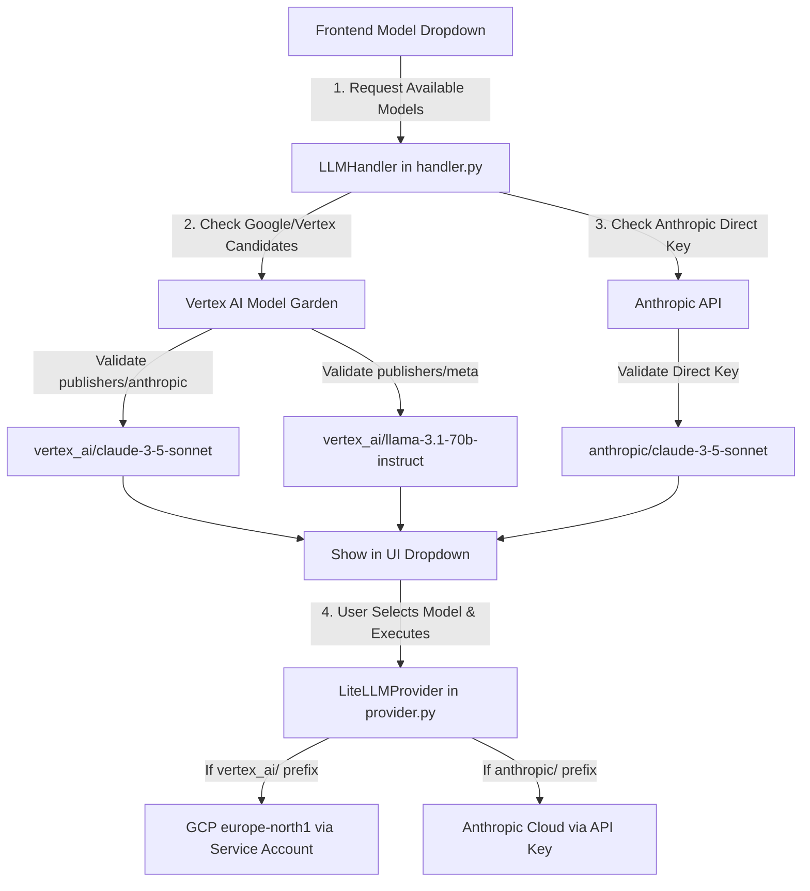

# Epic 66: Unified Vertex AI Model Garden & Multi-Provider Integration (Yhtenäistetyn Vertex AI Model Gardenin ja monitarjoajamalliston integrointi)

> [!IMPORTANT]
> **THE MULTI-PROVIDER RESILIENCE MANDATE**:
> Tämä Epic määrittelee ja toteuttaa Cognitive Quorum V2 -arkkitehtuurin mukaisen monitarjoajamalliston (Multi-Provider Model Garden) integroinnin. Tavoitteena on tuoda käyttöliittymään (frontend dropdown) valittavaksi Googlen Gemini-mallien lisäksi muut maailman johtavat huippumallit – erityisesti **Anthropic Claude 3.5**, **Meta Llama 3.1/3.2** ja **Mistral AI** – kahta rinnakkaista reititysväylää pitkin:
> 1. **Väylä A (Vertex AI Model Garden)**: Suojattu, yritystason integrointi, jossa kolmannen osapuolen mallit suoritetaan Google Cloudin suojatussa konesalissa palvelutilin (`service-account.json`) kautta ilman ulkopuolisia API-avaimia.
> 2. **Väylä B (Direct Provider API)**: Suora integraatio Anthropicin pilvirajapintoihin hyödyntäen `.env`-tiedoston erillisiä avaimia (`ANTHROPIC_API_KEY`) joustavuuden ja kehittäjätestauksen maksimoimiseksi.
> OpenAI:n ChatGPT-mallit eristetään tiukasti kulkemaan ainoastaan suoran OpenAI-väylän kautta, sillä niitä ei kilpailutilanteen vuoksi tueta Google Cloudin Model Gardenissa.

---

## 1. Yhteenveto ja Tavoite (Objective)

Tämän Epicin tavoitteena on muuttaa Cognitive Quorum täysin malli-agnostiseksi enterprise-luokan diagnostiikka-alustaksi (Model Agnostic Architecture). Käyttäjällä ja taustatyönkuluilla on oltava vapaus valita kulloiseenkin kognitiiviseen tehtävään parhaiten soveltuva malli suoraan käyttöliittymästä.

### Tunnistetut Nykytilan Haasteet:
1. **Gemini-riippuvuus käyttöliittymässä**: Vaikka ydinarkkitehtuuri (`provider.py`) tukee LiteLLM-kääreen ansiosta monia malleja, backendin mallintunnistus (`handler.py`) suodattaa ja palauttaa frontendille vain Googlen Gemini-malleja.
2. **Keskittämätön avaintenhallinta**: Kolmannen osapuolen mallien (kuten Clauden) käyttö edellyttää kehittäjiltä erillisten API-avaimien hankintaa ja konfigurointia, mikä estää keskitetyn yritystason laskutuksen ja auditointipolun suojatuissa tuotantoympäristöissä.
3. **Model Gardenin dynaamisen reitityksen puute**: Vertex AI:ssa eri julkaisijoiden (kuten Metan, Anthropicin ja Mistralin) mallit on rekisteröity eri nimiavaruuksiin ja päätepisteisiin Model Gardenissa, eikä nykyinen `LLMHandler` osaa dynaamisesti luokitella tai tarkistaa näiden saatavuutta.

### Arkkitehtoninen Ratkaisu (Proposed Solution):
1. **Dynaaminen monitarjoaja-Discovery (`LLMHandler.fetch_all_available_models`)**:
   * Laajennetaan `LLMHandler`-luokkaa tunnistamaan ja validoimaan kolmannen osapuolen ehdokkaat (kuten `vertex_ai/claude-3-5-sonnet` tai `vertex_ai/llama-3.1-70b-instruct`) Model Gardenista.
   * Kyselyjen reititys osoitetaan dynaamisesti oikeille julkaisijatunnuksille (esim. `/publishers/anthropic/models/...` tai `/publishers/meta/models/...`).
2. **Anthropic Direct API -integrointi käyttöliittymään**:
   * Aktivoidaan `anthropic` yhtenä suorista UI-tarjoajista `Settings.enabled_providers` -kentässä, jos `ANTHROPIC_API_KEY` on määritetty `.env`-tiedostossa.
   * Palautetaan viralliset, tuotantovalmiit suorat Claude-mallit frontendille.
3. **Malli-Agnostinen laadunvalvonta**:
   * Varmistetaan, että `LiteLLMProvider` suorittaa ja kustannusseuraa kaikkia näitä malleja täysin yhtenäisesti, raportoiden tokenit ja FinOps-kulutuksen yhtenäiseen `TokenUsage`-tietokantatauluun.

---

## 2. Arkkitehtuuristen sääntöjen huomiointi (Compliance Matrix)

Kehityksessä on noudatettava tiukasti seuraavia `c:\src\quorum\docs\rules` -hakemiston sääntöjä:

### 2.1. Ydinjärjestelmä ja tietosuoja (00-antigravity-core.md & 01-python-backend.md)
* **The Zero-Compromise Pledge (00)**: Kolmannen osapuolen malleja käytettäessä on huolehdittava, ettei arkaluontoista PII-dataa tai järjestelmälokeja vuodateta suojaamattomiin rajapintoihin.
* **Opaque Stripe ID Mandate (01)**: Kaikki relaatiot ja pyynnöt on edelleen yksilöitävä opaakeilla ID-tunnuksilla (esim. `req_xyz123`), eikä mitään käyttäjätietoja saa välittää osana mallien suoraa API-kutsua.

### 2.2. LLM-arkkitehtuuri (05_llm_architecture.md)
* **Direct SDK Calls Ban (05)**: Kaikki uudet mallit integroidaan LiteLLM-kääreen ja Model Registryn kautta. Suoria, ad-hoc API-kutsuja Anthropicin tai OpenAI:n omiin kirjastoihin liiketoimintalogiikassa ei sallita.

---

## 3. Arkkitehtuurinen Suunnittelu (Proposed Implementation)



### 3.1. Mallien tunnistuksen dynaaminen laajennus (`handler.py`)
Muutetaan `check_model` -alifunktiota siten, että se osaa dynaamisesti luokitella julkaisijat Google Model Gardenissa:

```python
def check_model(model_id: str) -> str | None:
    clean_id = model_id
    for prefix in ["vertex_ai/", "gemini/", "models/"]:
        if clean_id.startswith(prefix):
            clean_id = clean_id[len(prefix) :]

    # Luokitellaan julkaisija nimen perusteella
    if "claude" in clean_id:
        publisher = "anthropic"
    elif "llama" in clean_id:
        publisher = "meta"
    elif "mistral" in clean_id:
        publisher = "mistralai"
    else:
        publisher = "google"

    try:
        vertexai.init(project=project, location=target_location, credentials=credentials)
        try:
            # Varmistetaan olemassaolo dynaamisen julkaisija-osoitteen kautta
            url = f"https://{target_location}-aiplatform.googleapis.com/v1/publishers/{publisher}/models/{clean_id}"
            resp = requests.get(url, headers=headers, timeout=5)
            if resp.status_code == 200:
                return f"vertex_ai/{clean_id}"
            return None
        except Exception:
            return None
    except Exception:
        return None
```

---

## 4. Toteutusvaiheet (Implementation Phases)

### Phase 1: Asetusten ja Feature Flagien Hardening (`settings.py`)
* **Toimenpide**: Otetaan `Settings.enabled_providers` -metodiin mukaan `anthropic`-tarjoaja, jos `anthropic_api_key` löytyy `.env`-tiedostosta.
* **Varmistus**: Ajetut asetustestit varmistavat, ettei tyhjiä avaimia päästetä läpi.

### Phase 2: Dynaaminen Julkaisijatunnistus Model Gardenissa (`handler.py`)
* **Toimenpide**: Päivitetään [handler.py](file:///c:/src/quorum/backend_v2/llm/handler.py) osamaankin tekemään dynaamisia Model Garden -varmistuksia muille kuin `google`-julkaisijoille (kuten `anthropic` ja `meta`).
* **Varmistus**: Varmistetaan, että `vertex_ai/claude-3-5-sonnet` palauttaa onnistuneen tuloksen, kun se otetaan käyttöön testissä.

### Phase 3: Natiivi Anthropic Direct -malliluettelo
* **Toimenpide**: Lisätään suorien Anthropic-mallien listaus (`anthropic/claude-3-5-sonnet-20241022` jne.) osaksi `fetch_all_available_models` -metodia.

### Phase 4: Käyttöliittymätestaus ja Päästä-Päähän-valideeraus (End-to-End)
* **Toimenpide**: Testataan mallien dynaaminen latautuminen frontendin dropdown-valikkoon ja suoritetaan testikyselyt sekä suoran Anthropic API:n että Vertex AI:n Claude-moottorin kautta.

---

## 5. Definition of Done (DoD)

1. **Model Independence**: Käyttäjä voi valita käyttöliittymästä dynaamisesti joko Geminin, Clauden, Llaman tai GPT:n.
2. **Unified Billing & Security**: Kaikki `vertex_ai/` -etuliitteellä varustetut kolmannen osapuolen mallit reitittyvät onnistuneesti suojatun GCP-palvelutilin kautta ilman tarvetta erillisille API-avaimille.
3. **FinOps & Telemetry Parity**: Kaikki eri tarjoajien token-kulutukset ja kustannustiedot tallentuvat sekunnilleen oikein tietokantaan.
4. **All Tests Passed**: Kaikki yksikkö- ja integraatiotestit suoriutuvat virheettömästi laatuportissa:
   ```powershell
   uv run pytest backend_v2/tests/unit/test_night_shift_hardener.py -v
   ```
