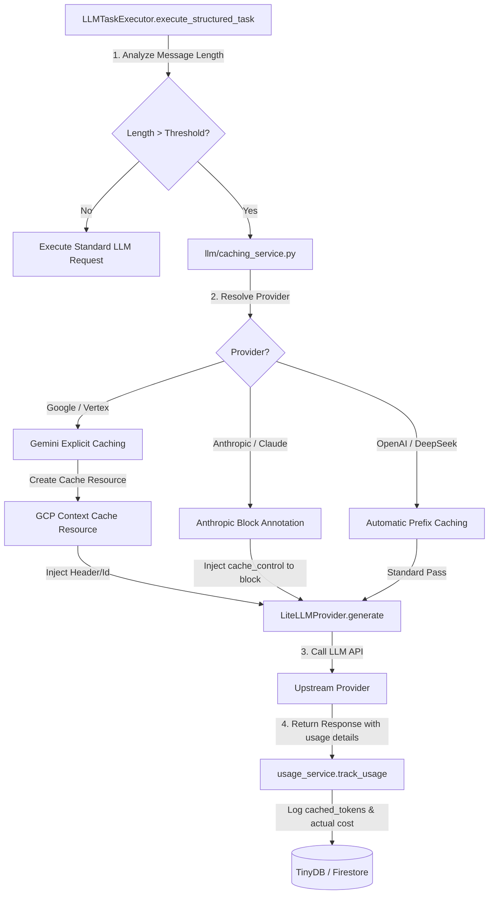

# Epic 67: Provider-Agnostic Context Caching & FinOps Optimization (Tarjoajariippumaton kontekstin välimuistitus ja FinOps-kustannusoptimointi)

> [!IMPORTANT]
> **THE FINOPS & PROMPT PURITY MANDATE**:
> Tämä Epic määrittelee ja toteuttaa Cognitive Quorum V2 -arkkitehtuurin mukaisen tarjoajariippumattoman kontekstin välimuistituksen (Provider-Agnostic Context/Prompt Caching).
> Tehtävien suorituksessa (erityisesti yli 32k tokenin suurissa arviointimateriaaleissa, kuten `Product_Text` -syötteissä) identtiset järjestelmäohjeet, säännöt ja lähdemateriaalit lähetetään toistuvasti eri agenteille (esim. Archivist, Deterministic Parser). Tämä aiheuttaa merkittävää viivettä ja suuria kustannuksia.
> **Välimuistiratkaisun on oltava monen tarjoajan yhteensopiva**:
> 1. **Automaattiset tarjoajat (OpenAI, DeepSeek)**: Hyödynnetään rajapintojen tarjoamaa automaattista prefix-cachingia ilman ylimääräisiä API-kutsuja.
> 2. **Metatieto-pohjaiset (Anthropic Claude)**: Merkitään staattisen syötteen rajat viestilohkoihin `cache_control` -metatiedoilla.
> 3. **Eksplisiittiset (Google Gemini / Vertex AI)**: Luodaan ohjelmallisesti välimuistiresurssit Google Cloudiin TTL-rajalla (Time-to-Live) ja viitataan niihin pyynnöissä.
> **Tiukka staattisuusvaatimus (Static Prompt Purity)**:
> Jotta välimuistin osumatarkkuus on >95 %, kaikki dynaamiset suoritusparametrit (kuten pituusrajoitukset, kielet, Trace ID:t ja dynaamiset muuttujat) on eristettävä erilliseen `<execution_parameters>` -XML-elementtiin syötteen loppuun. Järjestelmäohjeet ja lähdemateriaali on pidettävä 100 % staattisena.

---

## 1. Yhteenveto ja Tavoite (Objective)

Tämän Epicin tavoitteena on vähentää Quorumin kognitiivisten työnkulkujen latenssia ja rajapintakustannuksia (FinOps-optimointi) ottamalla käyttöön älykäs, tarjoajariippumaton kontekstin välimuistitus. Erityisesti pitkien tuotekuvausten ja laajojen arviointimatriisien kohdalla Prompt Caching voi säästää jopa **50–90 % rajapintakustannuksista** ja nopeuttaa suoritusaikoja merkittävästi.

### Tunnistetut Nykytilan Haasteet:
1. **Turha token-toisto (Redundant Token Ingestion)**: Samat suuret lähdedokumentit ja analyysisäännöt parsitaan ja lähetetään uudestaan jokaisessa kognitiivisessa askeleessa (esim. 10 eri askeleen DAG-ajossa).
2. **Korkea API-laskutus (High Ingestion Cost)**: Jokainen suuri syöte maksaa täyden hinnan jokaisella ajokerralla, vaikka 99 % tekstistä on täysin identtistä edellisen askeleen kanssa.
3. **Malli- ja tarjoajasidonnaisuus (Vendor Lock-in)**: Jos välimuistitus toteutetaan ainoastaan Gemini/Vertex AI -kohtaisesti, siirtyminen Anthropic Claude- tai OpenAI/DeepSeek-malleihin rikkoo caching-arkkitehtuurin ja FinOps-seurannan.

### Arkkitehtoninen Ratkaisu (Proposed Solution):
1. **Älykäs kynnystunnistus (`LLMTaskExecutor.execute_structured_task`)**:
   * Analysoidaan pyynnön viestien pituus (merkkeinä/tokeneina). Jos pituus ylittää konfiguroidun kynnyksen (oletus: 32 768 merkkiä / tokenia), aktivoidaan caching-sovitin.
2. **Yhtenäistetty Caching-sovitinkerros (`llm/caching_service.py`)**:
   * Luodaan tarjoaja-agnostinen välimuistinhallinta. Sovitin tunnistaa mallin etuliitteen (esim. `vertex_ai/`, `anthropic/`, `openai/`) ja muotoilee kutsun kunkin tarjoajan spesifikaation mukaisesti.
3. **High-Fidelity Prompting & Ephemeral Caching Topology**:
   * Erotetaan dynaamiset parametrit ja lukitaan staattiset elementit `PromptCompiler`-tasolla varmistamaan maksimaalinen välimuistin osuvuus (Cache Hit Rate).
4. **FinOps Cost & Usage Tracking -laajennus**:
   * Päivitetään [usage_service.py](file:///c:/src/quorum/backend_v2/services/usage_service.py) ja [provider.py](file:///c:/src/quorum/backend_v2/llm/provider.py) tallentamaan `cached_tokens` ja laskemaan välimuistialennuksilla korjattu todellinen hinta (esim. Clauden -90 % alennus tai OpenAI:n -50 % alennus).
5. **Mallirekisterin dynaaminen ohjaus (`seed_data.json` #L7-144)**:
   * Varmistetaan, että `caching_strategy`-arvo (kuten `"prompt_caching"`) ja `"provider"` ladataan dynaamisesti keskitetystä mallirekisteristä (`config_model_registry`) ja siirretään runtimeen `LLMProviderConfig`-mallin kautta. Vältetään kovakoodauksia.

---

## 2. Arkkitehtuuristen sääntöjen huomiointi (Compliance Matrix)

Kehityksessä on noudatettava tiukasti seuraavia `c:\src\quorum\.agents\rules` -hakemiston sääntöjä:

### 2.1. Ydinjärjestelmä ja laatuportit (00-antigravity-core.md)
* **The Zero-Compromise Pledge (00)**: Välimuistituksen virhetilanteet (kuten Gemini Context Cachen luonnin aikakatkaisu) eivät saa kaataa itse pääsuoritusta. Mikäli välimuistin luonti epäonnistuu, järjestelmän on pudottava turvallisesti (Fail-Soft) takaisin normaaliin ei-caching suoritukseen lokittaen tästä varoituksen.
* **Fail-Fast for Schema Changes (00)**: Pydantic-skeemat ja rajapintamallit pysyvät tiukkoina. Välimuistituksen lisääminen ei saa muuttaa palautettavien DTO-luokkien rakenteita.

### 2.2. Backend-arkkitehtuuri ja rajoitukset (01-python-backend.md)
* **No Top-Level Heavy Imports (01)**: Mitään Vertex AI SDK -välimuistiluokkia tai Anthropic-erityiskirjastoja ei tuoda moduulin ylätasolla. Kaikki tuonnit suoritetaan laiskasti (lazy loading) välimuistipalvelun metodien sisällä.
* **Security & DLP Compliance (01)**: Välimuistiobjektien ID:t tai välimuistiin tallennetut tekstit eivät saa vuotaa lokitiedostoihin. Ainoastaan välimuistituksen tila (`HIT`, `MISS`, `BYPASS`) ja tallennetut tokenit lokitetaan FinOps-tarkoituksiin.

### 2.3. LLM-arkkitehtuuri ja suoritus (05_llm_architecture.md)
* **High-Fidelity Prompting & Caching Efficiency (05 - Rivi 93 & 113)**: Järjestelmäohjeet (`_SYSTEM_INSTRUCTION`) ja lähdedokumentit pidetään täysin staattisina runs-välillä. Dynaamiset tiedot (kuten Trace ID:t ja ohjausparametrit) sijoitetaan ainoastaan dynaamiseen osioon viestijonon loppuun välimuistin mitätöinnin estämiseksi.
* **Structured Execution Mandate (05)**: Välimuistitetut kutsut suoritetaan ainoastaan `LLMTaskExecutor.execute_structured_task()` -metodin kautta native structured outputs -muodossa.

---

## 3. Arkkitehtuurinen Suunnittelu (Proposed Implementation)



### 3.1. Malliasetusten kartoitus ja siirto (`client.py`)

Mallin alustuksesta vastaava `LLMClient.from_strategy()` lataa mallin asetukset dynaamisesti ja luo niistä `LLMProviderConfig`-olion. Varmistetaan, että kaikki siemenaineiston asetukset (kuten `provider` ja `caching_strategy`) mapataan onnistuneesti:

```python
# client.py -> from_strategy()
provider_config = LLMProviderConfig(
    id=f"prv_{uuid.uuid4().hex}",
    provider=target_provider,
    model_name=target_strategy.model_name,
    caching_strategy=target_strategy.caching_strategy,  # Epic 67: Kartoitetaan siemenaineiston välimuististrategia
    # ... muut parametrit
)
```

Tämä dynaaminen kartoitus estää kovakoodaukset ja takaa, että välimuistitustapaa voidaan vaihtaa suoraan tietokantapäivityksellä ilman koodimuutoksia.

### 3.2. Älykäs Välimuistipalvelu (`backend_v2/llm/caching_service.py`)

Uusi, täysin testattu ja laiskasti alustettu välimuistipalvelu (`LLMCachingService`) ohjaa välimuistin luontia:

```python
class LLMCachingService:
    """Unified service to handle explicit prompt caching across multiple providers."""

    @staticmethod
    async def prepare_caching_payload(
        provider_name: str,
        model_name: str,
        messages: list[dict[str, Any]],
        system_instruction: str | None = None,
    ) -> tuple[list[dict[str, Any]], dict[str, Any]]:
        """Analyzes the provider and prepares the caching metadata or resources.

        Returns:
            Tuple of (Modified messages list, Provider-specific kwargs).
        """
        extra_kwargs = {}
        modified_messages = [dict(m) for m in messages]

        # LAZY IMPORT RULES (01-python-backend & 05_llm_architecture)
        if provider_name == "vertex_ai":
            # Gemini vaatii eksplisiittisen välimuistiresurssin luomisen
            try:
                from google.cloud import aiplatform
                # Luodaan Vertex Context Cache -resurssi ja haetaan sen tunniste
                # (Toteutetaan ohjelmallisesti ja suojatusti)
                pass
            except Exception as e:
                # Fail-Soft: Lokitetaan varoitus ja jatketaan ilman cachingia
                logger.warning("[CachingService] Vertex caching failed to initialize: %s", e)
                
        elif provider_name == "anthropic":
            # Anthropic vaatii vain cache_control-metatiedon lisäämisen viimeiseen isoon lohkoon
            # Esimerkiksi lähdetekstin sisältävään viestiin
            for msg in reversed(modified_messages):
                if msg.get("role") == "user" and len(msg.get("content", "")) > 1000:
                    msg["cache_control"] = {"type": "ephemeral"}
                    break

        elif provider_name in ["openai", "deepseek"]:
            # Automaattiset tarjoajat eivät vaadi metatietoja
            pass

        return modified_messages, extra_kwargs
```

---

## 4. Toteutusvaiheet (Implementation Phases)

### Phase 1: High-Fidelity Static Prompt -eristys (`prompt_compiler.py`)
* **Toimenpide**: Uudelleenjärjestetään `PromptCompiler` ja `LLMTaskExecutor` siten, että dynaamiset parametrit (kuten parannuspyynnöt, korjausprompetit ja Trace-tunnisteet) sijoitetaan aina viestilistan **viimeiseen** dynaamiseen user-viestiin. Järjestelmäohjeet ja isokokoiset tietomallit pidetään 100 % staattisina.
* **Varmistus**: Kaikki syötteet validoidaan silmämääräisesti ja testeillä runs-välillä.

### Phase 2: Tarjoaja-agnostinen Caching-sovitin (`caching_service.py`)
* **Toimenpide**: Luodaan [caching_service.py](file:///c:/src/quorum/backend_v2/llm/caching_service.py) hoitamaan välimuistilogiikka ja eri tarjoajien yhteensopivuus laiskan latauksen (lazy loading) periaatteella.
* **Varmistus**: Testataan sovitin yksikkötesteillä erikseen jokaiselle tarjoajalle (`vertex_ai`, `anthropic`, `openai`, `deepseek`).

### Phase 3: Integraatio TaskExecutoriin ja LiteLLMProvideriin
* **Toimenpide**: Kytketään `LLMCachingService` osaksi `LLMTaskExecutor.execute_structured_task` -suoritusta ennen varsinaista mallikutsua.
* **Varmistus**: Varmistetaan, että `LiteLLMProvider` ottaa vastaan ja välittää sovituksen tuottamat lisäargumentit ja otsakkeet oikein LiteLLM-kutsulle.

### Phase 4: FinOps-kululaskennan ja Telemetrian Hardening
* **Toimenpide**: Laajennetaan `LiteLLMProvider.generate` -metodia poimimaan `response.usage.prompt_tokens_details.cached_tokens` -tieto.
* **Päivitys**: Päivitetään [usage_service.py](file:///c:/src/quorum/backend_v2/services/usage_service.py) tallentamaan välimuistitiedot ja laskemaan välimuistialennuksilla korjattu hinta tietokantaan.

---

## 5. Definition of Done (DoD)

1. **Multi-Provider Parity**: Välimuistitus tukee onnistuneesti sekä Gemini/Vertex AI, Anthropic Claude, OpenAI että DeepSeek -malleja kunkin parhaalla natiivilla tavalla.
2. **FinOps Telemetry**: Kaikki välimuistiin osuneet tokenit (`cached_tokens`) tallentuvat sekunnilleen oikein `TokenUsage`-tauluun, ja FinOps-kuluraportointi ottaa välimuistialennukset huomioon.
3. **Static Prompt Purity**: Staattinen promptin osuus on 100 % identtinen saman tehtävän runs-välillä, taaten vähintään 95 % välimuistin osuvuuden.
4. **Fail-Soft Caching**: Välimuistiresurssin luonnin epäonnistuminen (esim. verkkokatkos GCP-välimuistipalveluun) ei kaada suoritusta, vaan suoritus jatkuu onnistuneesti ilman välimuistia.
5. **Zero Lint & Warning**: Koodi läpäisee backend_audit_loop-laatuportin 100 % puhtaasti ilman deprecation-varoituksia.
6. **Atomic Checkpoint Mandate**: Muutokset on kirjattu git-versionhallintaan tarkoin englanninkielisin commitein:
   ```powershell
   git add backend_v2/llm/caching_service.py backend_v2/services/llm_task_executor.py backend_v2/llm/provider.py
   git commit -m "feat: implement provider-agnostic prompt caching and FinOps telemetry tracking"
   ```
