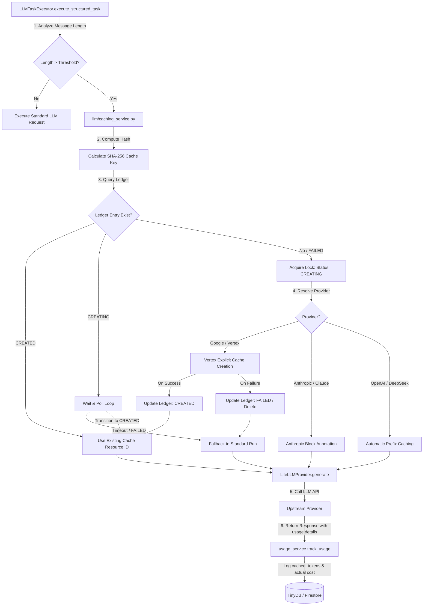
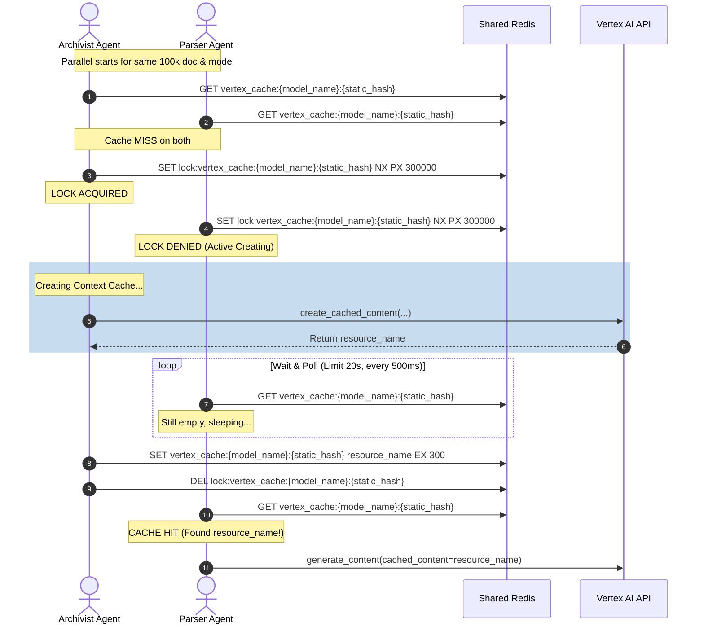
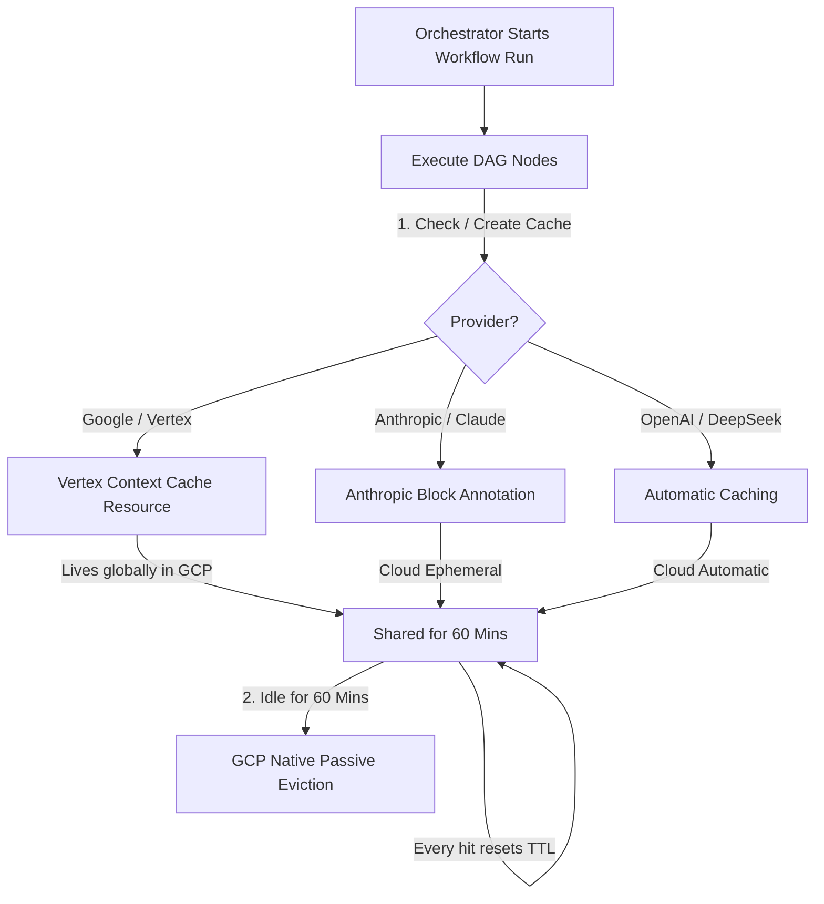

# Epic 67: Provider-Agnostic Context Caching & FinOps Optimization (Tarjoajariippumaton kontekstin välimuistitus ja FinOps-kustannusoptimointi)

> [!IMPORTANT]
> **THE FINOPS & PROMPT PURITY MANDATE**:
> Tämä Epic määrittelee ja toteuttaa Cognitive Quorum V2 -arkkitehtuurin mukaisen tarjoajariippumattoman kontekstin välimuistituksen (Provider-Agnostic Context/Prompt Caching).
> Tehtävien suorituksessa (erityisesti yli 32k tokenin suurissa arviointimateriaaleissa, kuten `Product_Text` -syötteissä) identtiset järjestelmäohjeet, säännöt ja lähdemateriaalit lähetetään toistuvasti eri agenteille (esim. Archivist, Deterministic Parser). Tämä aiheuttaa merkittävää viivettä ja suuria kustannuksia.
> **Välimuistiratkaisun on oltava monen tarjoajan yhteensopiva**:
> 1. **Automaattiset tarjoajat (OpenAI, DeepSeek)**: Hyödynnetään rajapintojen tarjoamaa automaattista prefix-cachingia ilman ylimääräisiä API-kutsuja.
> 2. **Metatieto-pohjaiset (Anthropic Claude)**: Merkitään staattisen syötteen rajat viestilohkoihin `cache_control` -metatiedoilla.
> 3. **Eksplisiittiset (Google Gemini / Vertex AI)**: Luodaan ohjelmallisesti välimuistiresurssit Google Cloudiin TTL-rajalla (Time-to-Live) ja viitataan niihin pyynnöissä.
> **Tiukka staattisuusvaatimus (Static Prompt Purity)**:
> Jotta välimuistin osumatarkkuus on >95 %, kaikki dynaamiset suoritusparametrit (kuten pituusrajoitukset, kielet, Trace ID:t ja dynaamiset muuttujat) on eristettävä erilliseen `<execution_parameters>` -XML-elementtiin syötteen loppuun. Järjestelmäohjeet ja lähdemateriaali on pidettävä 100 % staattisena.

---

## 1. Yhteenveto ja Tavoite (Objective)

Tämän Epicin tavoitteena on vähentää Quorumin kognitiivisten työnkulkujen latenssia ja rajapintakustannuksia (FinOps-optimointi) ottamalla käyttöön älykäs, tarjoajariippumaton kontekstin välimuistitus. Erityisesti pitkien tuotekuvausten ja laajojen arviointimatriisien kohdalla Prompt Caching voi säästää jopa **50–90 % rajapintakustannuksista** ja nopeuttaa suoritusaikoja merkittävästi.

### Tunnistetut Nykytilan Haasteet:
1. **Turha token-toisto (Redundant Token Ingestion)**: Samat suuret lähdedokumentit ja analyysisäännöt parsitaan ja lähetetään uudestaan jokaisessa kognitiivisessa askeleessa (esim. 10 eri askeleen DAG-ajossa).
2. **Korkea API-laskutus (High Ingestion Cost)**: Jokainen suuri syöte maksaa täyden hinnan jokaisella ajokerralla, vaikka 99 % tekstistä on täysin identtistä edellisen askeleen kanssa.
3. **Malli- ja tarjoajasidonnaisuus (Vendor Lock-in)**: Jos välimuistitus toteutetaan ainoastaan Gemini/Vertex AI -kohtaisesti, siirtyminen Anthropic Claude- tai OpenAI/DeepSeek-malleihin rikkoo caching-arkkitehtuurin ja FinOps-seurannan.

### Arkkitehtoninen Ratkaisu (Proposed Solution):
1. **Älykäs kynnystunnistus (`LLMTaskExecutor.execute_structured_task`)**:
   * **Nopea merkkipohjainen heuristiikka (Character-Length Heuristic)**: Vältetään synkroninen ja prosessoritehoa syövä token-laskenta (kuten tiktoken- tai SentencePiece-ajo) ennen jokaista API-kutsua. Käytetään $O(1)$-tarkistusta merkkijonon pituudelle:
     * **Vertex AI / Gemini**: Kynnys 130 000 merkkiä (vastaa turvallisesti rajapinnan vaatimaa 32 768 tokenin minimirajaa).
     * **Anthropic Claude**: Kynnys 4 000 merkkiä (vastaa rajapinnan vaatimaa 1 024 tokenin minimirajaa).
   * Jos kynnys ylittyy, välimuistisovitin aktivoidaan heti.

2. **Yhtenäistetty Caching-sovitinkerros (`llm/caching_service.py`)**:
   * Luodaan tarjoaja-agnostinen välimuistinhallinta. Sovitin tunnistaa mallin etuliitteen (esim. `vertex_ai/`, `anthropic/`, `openai/`) ja muotoilee kutsun kunkin tarjoajan spesifikaation mukaisesti.
3. **High-Fidelity Prompting & Ephemeral Caching Topology**:
   * Erotetaan dynaamiset parametrit ja lukitaan staattiset elementit `PromptCompiler`-tasolla varmistamaan maksimaalinen välimuistin osuvuus (Cache Hit Rate).
4. **FinOps Cost & Usage Tracking -laajennus**:
   * Päivitetään [usage_service.py](file:///c:/src/quorum/backend_v2/services/usage_service.py) ja [provider.py](file:///c:/src/quorum/backend_v2/llm/provider.py) tallentamaan `cached_tokens` ja laskemaan välimuistialennuksilla korjattu todellinen hinta (esim. Clauden -90 % alennus tai OpenAI:n -50 % alennus).
5. **Mallirekisterin dynaaminen ohjaus (`seed_data.json` #L7-144)**:
   * Varmistetaan, että `caching_strategy`-arvo (kuten `"prompt_caching"`) ja `"provider"` ladataan dynaamisesti keskitetystä mallirekisteristä (`config_model_registry`) ja siirretään runtimeen `LLMProviderConfig`-mallin kautta. Vältetään kovakoodauksia.

---

## 2. Arkkitehtuuristen sääntöjen huomiointi (Compliance)

### 2.1. Ydinjärjestelmä ja laatuportit (00-antigravity-core.md)

Kehityksessä on noudatettava tiukasti seuraavia `00-antigravity-core.md` -sääntöjä:

* **the_zero_compromise_pledge**:
  * *Banned Pattern*: Taaksepäinyhteensopivuus, fallback-ketjut ("jos A puuttuu, kokeile B"), oikotiet, ohjelmointikielen oletusarvot (esim. v.get('kenttä', '')) ja kovakoodatut paikkaajat ovat kaikki ankarasti kiellettyjä. ANY use of `hasattr()`, `isinstance(dict)`, or recursive dictionary loops to "guess" or "find" missing data.
  * *Mandatory Pattern*: You MUST enforce strict Pydantic V2 schemas. If an expected key or data point is missing in a strict architecture (like a Micro-CoT footprint or execution trace), you MUST raise an explicit `RuntimeError` or `AppException` and CRASH. Zero Tolerance for silent bypasses or guessing.
  * *Catastrophic Reason*: Masking data corruption or LLM hallucinations with chained fallbacks or language-level default values destroys the deterministic nature of the Quorum engine and completely invalidates the forensic audit trail.
* **universal_fail_fast**:
  * *Banned Pattern*: Allowing invalid data to pass silently through the system boundaries.
  * *Mandatory Pattern*: Enforce "Fail-Fast" at every boundary. If data does not precisely match the Pydantic V2 or Dart 3 Freezed schema, the system MUST crash audibly and visibly (`AppException` or `AppErrorBoundary`).
* **atomic_checkpoint_mandate**:
  * *Banned Pattern*: Proceeding to the next architectural milestone without ensuring a save state, proposing `git add .` which captures unwanted state, or writing git commit messages in a language other than English.
  * *Mandatory Pattern*: After a successful step, test, or `FIX` phase, you MUST explicitly instruct the user to perform an atomic `git commit` as a save point BEFORE asking for the `PROCEED` command. IMPORTANT: You MUST ALWAYS specify exact relative file paths starting from the workspace root (e.g., `git add client_app_v2/[tiedosto]`). NEVER output `git add .`. Git commit messages MUST ALWAYS be written in English (e.g., `git commit -m "feat: updated text payload"`).
* **tdd_mandate**:
  * *Banned Pattern*: Fixing a bug or adding a feature without writing a test first.
  * *Mandatory Pattern*: Write a failing test that reproduces the bug BEFORE fixing domain code. The code is not complete until a reliable test verifies the change.
* **mocking_mandate_for_llm**:
  * *Banned Pattern*: Executing direct HTTP calls to external LLM services or performing slow network requests during unit testing or CI/CD pipelines.
  * *Mandatory Pattern*: Test Mandate Exception: When testing LLM interfaces or network operations, you MUST ABSOLUTELY use mocked JSON fixtures to mock the responses. You must utilize the global `backend_v2/llm/mock.py` and `mock_data.py` framework files when constructing Pytest fixtures. Live LLM calls during tests are strictly forbidden to prevent flaky, slow, and expensive test suites.
* **circuit_breaker_protocol**:
  * *Banned Pattern*: Attempting to autonomously fix the exact same Pytest or Flutter error more than 3 times iteratively.
  * *Mandatory Pattern*: Implement the "Rule of Three". If failing 3 times, you MUST STOP. Output `<circuit_breaker_tripped>`, explain the paradox, and WAIT for human guidance.

### 2.2. Backend-arkkitehtuuri ja rajoitukset (01-python-backend.md)

Kehityksessä on noudatettava tiukasti seuraavia `01-python-backend.md` -sääntöjä:

* **silent_failures**:
  * *Banned Pattern*: Swallowing exceptions silently using `try: ... except Exception: pass`.
  * *Mandatory Pattern*: Exceptions must ALWAYS be logged natively (`logger.error`) and re-thrown or handled explicitly via `AppException` (RFC 7807).
  * *Catastrophic Reason*: Silent failures mask root causes of memory leaks and DB corruption.
* **blocking_the_fastapi_thread**:
  * *Banned Pattern*: Executing long-running AI generation or heavy DAG execution synchronously within a FastAPI request cycle.
  * *Mandatory Pattern*: MUST offload heavy processing to the Arq 2026 async worker queue. The API MUST return 202 Accepted with a TaskID immediately.
  * *Catastrophic Reason*: Hangs the internal Node thread and fails remote user requests via timeout.
* **security_logging_ban**:
  * *Banned Pattern*: Logging raw HTTP payloads, user prompts (PII), API keys, or JWT tokens into logs or AppException messages.
  * *Mandatory Pattern*: Log ONLY the mathematical/logical reason for the error and the Opaque System ID (e.g., req_abc123). All external API keys MUST be strictly read via pydantic-settings from environment variables, never hardcoded.
  * *Catastrophic Reason*: Logging PII or secrets violates security compliance and exposes the system to catastrophic credential leaks. Furthermore, leaked secrets poison the LLM context if an agent reads `backend_debug.log` to troubleshoot.
* **strict_pydantic_v2_rust**:
  * *Banned Pattern*: Using legacy V1 instantiation (`MyModel(**data)`), Python standard JSON parsing (`json.loads()`), legacy V1 methods (`.dict()`, `@validator`), or using duck typing / arbitrary type checks like `hasattr(obj, 'key')` and `isinstance(data, dict)` to parse incoming LLM or DB state.
  * *Mandatory Pattern*: Force the Fail-Fast pipeline by using `.model_validate()`, Rust-based `.model_validate_json()`, `.model_dump()`, and `@field_validator`. Use `model_config = ConfigDict(extra='forbid', strict=True)` to reject unstructured AI outputs instantly. Any structure not matching the strict model must CRASH immediately with a `ValidationError`.
* **no_naked_dicts_in_state**:
  * *Banned Pattern*: Pushing parsed LLM outputs directly into `state_delta` or intermediate caches as naked dictionaries simply to appease TinyDB/JSON serialization constraints.
  * *Mandatory Pattern*: ALWAYS intercept raw datastreams with `.model_validate()` immediately at the boundary. If the storage engine requires raw dicts, chain it explicitly: `MyModel.model_validate(data).model_dump(mode='json')`.
  * *Catastrophic Reason*: Passing naked dicts delays validation failures to the presentation layer, breaking traceability and defeating the 2026 Fail-Fast mandate.
* **no_inline_imports**:
  * *Banned Pattern*: Using inline imports (importing modules inside a function, method, or router) to resolve circular dependencies or lazy load regular application modules.
  * *Mandatory Pattern*: ALWAYS declare all standard imports globally at the top of the file. EXCEPTION: All heavy AI/ML libraries (e.g., `litellm`, `google-genai`, `vertexai`, `tokenizers`, `spacy`) MUST be imported inside methods/functions (lazy loading). This prevents PyO3 failures, ensures Zero Cold Starts, and prevents `pytest-cov` coverage runs from crashing due to missing ML environments.
  * *Catastrophic Reason*: Inline imports mask circular dependencies. However, global ML imports trigger catastrophic PyO3 segfaults during system boot, slow down cold start performance, and crash pytest-cov suites when executing in decoupled testing contexts.
* **prompt_compiler_immutability**:
  * *Banned Pattern*: Modifying the `backend_v2/services/orchestrator/prompt_compiler.py` file.
  * *Mandatory Pattern*: The Prompt Compiler is a frozen architectural cornerstone. Do NOT touch this file. If a change is absolutely necessary, you must explicitly flag it and seek USER CONFIRMATION before making any edits.
  * *Epic 67 Arkkitehtoniset ratkaisuvaihtoehdot*:
    1. **PromptCompilerAdapter (Ensisijainen suositus)**: Luodaan erillinen adapteriluokka `PromptCompilerAdapter`, joka käärii alkuperäisen `PromptCompiler`-kutsun ja muuntaa sen litteän viestilistan tyypitetyksi `CompiledPrompt`-rakenteeksi (staattinen/dynaaminen). Tämä pitää `prompt_compiler.py`-alkuperäistiedoston 100 % koskemattomana.
    2. **Eksplisiittinen arkkitehtuuripoikkeama (Architecture Deviation)**: Mikäli `prompt_compiler.py`-tiedostoa on pakko sorkkia suoraan yhteensopivuuden tai suorituskyvyn takia, toteuttaja pyytää käyttäjältä eksplisiittisen hyväksynnän ja kirjaa tästä poikkeamamerkinnän git-commit-viestiin.
  * *Catastrophic Reason*: Altering the Prompt Compiler risks breaking the deterministic synthesis pipeline, Schema V2 generation, and the core Fail-Fast architecture.

### 2.3. LLM-arkkitehtuuri ja suoritus (05_llm_architecture.md)

Kehityksessä on noudatettava tiukasti seuraavia `05_llm_architecture.md` -sääntöjä:

* **direct_sdk_calls**:
  * *Banned Pattern*: Using `openai.ChatCompletion.create()` directly, calling Vertex AI SDK natively, or hardcoding model strings like "gpt-4" inside services.
  * *Mandatory Pattern*: All LLM requests MUST strictly utilize the Model Registry via `LLMClient.from_strategy("strategy_name", repo)`. Follow the Zero-Fallback rule.
  * *Catastrophic Reason*: Bypassing the Model Registry breaks token tracking, rate limiting, and centralized FinOps cost analysis.
* **eager_llm_dependency_loading**:
  * *Banned Pattern*: Placing `import litellm`, `import vertexai` or other heavy PyO3/Rust-based LLM libraries at the module level (top of the file) in backend providers or handlers.
  * *Mandatory Pattern*: Enforce Lazy Loading / Deferred Initialization: Heavy LLM SDK imports MUST be placed inside the specific functions/methods (e.g. `__init__`, `generate`) where they are actually invoked.
  * *Catastrophic Reason*: Importing Rust-based libraries (like `tokenizers` via LiteLLM) at the module level permanently crashes Python 3.14+ test suites running with `pytest-cov` due to PyO3 multi-initialization constraints. Lazy loading guarantees test collection is safe and accelerates application boot times.
* **infinite_retry_loops**:
  * *Banned Pattern*: Running generic self-healing retry pipelines with high `max_retries` causing infinite logic loops upon complex JSON schema mismatches.
  * *Mandatory Pattern*: Enforce an absolute max stringency using `SystemConcurrency.LLM_MAX_RETRIES` (which MUST be fixed at 2). If the AI Generator and AI Critic conflict, trigger Fail-Fast and push the error to the AppErrorBoundary.
  * *Catastrophic Reason*: Infinite loops on failed prompt engineering will explode API billing exponentially within minutes.
* **system_concurrency_ssot**:
  * *Banned Pattern*: Hardcoding parallel task limits (e.g. semaphores, iterators) and retry limits scattered across files, ignoring global constraints.
  * *Mandatory Pattern*: All execution limits MUST reference `SystemConcurrency` strictly. Parallel async LLM workers must wrap execution in a TaskGroup limited natively by `asyncio.Semaphore(SystemConcurrency.MAX_CONCURRENT_LLM_STEPS)` (fixed at 2). Hardcoded or arbitrary new limits are banned.
  * *Catastrophic Reason*: Fractured limits allow exponential concurrent API triggers, resulting in instant Cloud Rate Limits (HTTP 429) and quota exhaustion across the entire infrastructure.
* **high_fidelity_prompting_and_caching**:
  * *Banned Pattern*: Injecting dynamic execution variables (like length constraints or target languages) directly into rule sentences using Python f-strings, or using Markdown mixed with raw text for data structures.
  * *Mandatory Pattern*: Enforce **High-Fidelity Prompting & 100% Caching Efficiency**. All dynamic variables MUST be strictly isolated into an `<execution_parameters>` XML tag at the **ABSOLUTE END** of the prompt (inside `dynamic_messages`). All rules, system directives, and source data (system/static segment) must remain perfectly static at the **VERY BEGINNING** of the prompt. All input data must be rigidly wrapped in `<source_data>` or `<matrix_input>` tags. The usage of unstructured Markdown lists for dynamic data parsing is strictly forbidden.
  * *CORRECTION MANDATE*: Alkuperäinen `05_llm_architecture.md` sääntö vaatii dynaamisten parametrien sijoittamista promptin alkuun ("at the very beginning"). Tämä on fatal-tason virhe: koska OpenAI ja Anthropic täsmäävät välimuistia alusta alkaen (prefix-matching), dynaamisen parametrin (kuten Trace ID tai aikaleima) sijoitus alkuun nollaa välimuistin osumatarkkuuden 0 prosenttiin jokaisella kutsulla. Järjestys on kumottava (Static First, Dynamic Last).
  * *Catastrophic Reason*: Mixing dynamic parameters with static system instructions destroys the LLM's Prompt Caching capability. Isolating variables into `<execution_parameters>` at the absolute end ensures that 95%+ of the prompt remains cacheable, vastly reducing token costs and latency.
* **ephemeral_caching_topology**:
  * *Banned Pattern*: Injecting dynamic variables (timestamps, UUIDs) into `_SYSTEM_INSTRUCTION`.
  * *Mandatory Pattern*: To maximize Context Caching (FinOps), the System Prompt MUST be 100% static. ALL dynamic data MUST be injected exclusively into the `user` message at the end.
* **llm_structured_execution_mandate**:
  * *Banned Pattern*: Asking LLM to "output valid JSON" in text and parsing it with Regex/json.loads, using LLMClient to handle validation retry loops directly, or using manual syntactic self-healing.
  * *Mandatory Pattern*: Rely ONLY on `LLMTaskExecutor.execute_structured_task()` to force execution via Native Structured Outputs API (e.g., passing Pydantic schema to `response_schema`). Syntactic self-healing loops MUST be completely removed from the codebase, as API-level constrained decoding guarantees 100% Pydantic-compatible JSON on the first try. Välimuistitetut kutsut suoritetaan ainoastaan `LLMTaskExecutor.execute_structured_task()` -metodin kautta native structured outputs -muodossa.
* **strict_enum_mandate_for_critical_values**:
  * *Banned Pattern*: Raakojen merkkijonoliteraalien (raw string literals), vapaamuotoisten vakioiden tai inline-merkkijonojen käyttö kriittisten välimuististrategioiden, tarjoajanimien, järjestelmärajojen tai välimuistitilojen (kuten `FAILED`, `CREATED`) lukemiseen ja kirjoittamiseen.
  * *Mandatory Pattern*: Kaikki kriittiset välimuistikonfiguraatiot, tilat ja raja-arvot **on ehdottomasti** määriteltävä ja luettava tyypitettyinä Enum-kenttinä (kuten kansiossa `backend_v2/models/enums.py` tai erillisissä Pydantic V2/StrEnum-luokissa). Erityisesti:
    - Välimuististrategioiden on kuuluttava `LLMCachingStrategy` -enumiin.
    - Tarjoajien nimien on kuuluttava standardiin `LLMProviderName` -enumiin.
    - Redis-välimuistin tilojen (`CREATING`, `CREATED`, `FAILED`) on käytettävä `PromptCacheStatus` -enumia (missä sentinel-arvo on `PromptCacheStatus.FAILED = "FAILED"`).
    - Kaikkien aikakatkaisujen, poll-syklien ja TTL-rajojen on kuuluttava keskitettyyn `SystemConcurrency` -enumiin.
  * *Catastrophic Reason*: Vapaat merkkijonot (kuten `"prompt-caching"` vs `"prompt_caching"`) altistavat kirjoitusvirheille, ohittavat Pydanticin tiukan tyyppivalvonnan kehitysaikana ja aiheuttavat fatal-tason ajonaikaisia kaatumisia suuren kuormituksen rinnakkaisissa työnkuluissa.

### 2.4. Nykyisen koodin ristiriidat ja niiden ratkaisut (Contradictions & Solutions)

Seuraavassa taulukossa esitellään tunnistetut tekniset ja toiminnalliset ristiriidat nykyisen koodin ja tämän Epicin välillä sekä niiden eksplisiittiset ratkaisut:

| Ristiriita (Contradiction) | Ratkaisu (Explicit Resolution) | Vaikutus koodiin (Impact on Code) |
| :--- | :--- | :--- |
| **`UsageService` -kustannusfilosofia**: Nykyinen `UsageService` luottaa 100 % LiteLLM:n palauttamaan hintaan ("no local pricing logic"), mutta LiteLLM ei huomioi tarjoajakohtaista välimuistihinnoittelua ja erikoishintoja (kuten Clauden +25% kirjoitus ja -90% luku, tai Geminin -75% luku). | **Polymorfinen laskentastrategia**: Laajennetaan `UsageService` laskemaan todellinen kustannus ja ROI dynaamisten kertoimien avulla delegoiden hinnoittelu kullekin adapterille. Jotta koodi pidetään suoraviivaisena, jätetään Vertex AI:n marginaaliset passiiviset tallennusmaksut ($P_{\text{store}}$) kokonaan pois paikallisesta laskennasta. | Päivitetään [usage_service.py](file:///c:/src/quorum/backend_v2/services/usage_service.py) ja tietomallit tukemaan moniulotteista `TokenUsage` -luokitusta ilman, että rikotaan olemassa olevaa raportointiskeemaa. |
| **Itseparantava silmukka (Self-Healing) vs Prompt Purity**: `LLMTaskExecutor.execute_structured_task` injektoi virheet suoraan `messages`-historiaan, mikä muuttaa staattisen osan SHA-256-hashia ja nollaa välimuistin osumatarkkuuden (Cache Hit Rate). | **Dynaamisten virheiden loppuinjektio**: `PromptCompiler` palauttaa tiukasti erotellun `CompiledPrompt`-rakenteen. `LLMTaskExecutor` sijoittaa itseparannusvirheet ainoastaan viestien dynaamisen osan loppuun, jolloin staattinen osio säilyy 100 % koskemattomana. | Muutetaan `LLMTaskExecutor.execute_structured_task` käsittelemään `CompiledPrompt`-malleja ja kohdistamaan virheinjektiot ainoastaan `dynamic_messages`-lohkon loppuun. |
| **Vertex AI välimuistin minimikokoraja (400 Bad Request)**: Nykyisessä `LLMClient` -luokassa on liian matala kynnys (6 000 merkkiä) välimuistitukselle. Jos Vertex AI:lle yritetään luoda alle 32 768 tokenin (n. 130 000 merkkiä) välimuistiresurssi, API palauttaa virheen `400 Bad Request` ja kaatuu. | **Tarjoajakohtaiset kynnysarvot**: Välimuistipalvelussa otetaan käyttöön tiukat $O(1)$-pituuskynnykset ennen välimuistisovittimen aktivointia (Vertex AI = >=130k merkkiä, Anthropic = >=4k merkkiä). Jos pituus alittuu, suoritus ohjataan standardina kutsuna ilman välimuistia. | Lisätään tarjoajakohtaiset pituustarkastukset `LLMCachingService`-palveluun ennen välimuistin aktivointia, taaten vikasietoisen suorituksen. |
| **Hajautetun suorituksen ryntäysilmiö (Thundering Herd)**: Rinnakkaiset työnkulun noodit (kuten Archivist ja Parser) yrittävät luoda Vertex AI -välimuistin samanaikaisesti, mikä johtaa päällekkäisiin API-kutsuihin, hitauteen ja ylimääräisiin kuluihin. | **Hajautettu lukitus ja kiinteä odotussilmukka**: Käytetään jaettua Redis-infrastruktuuria lukitsemiseen (`lock:vertex_cache:{model_name}:{static_hash}`). Ensimmäinen worker varaa lukon (`SystemConcurrency.CONTEXT_CACHE_LOCK_TTL_SECONDS` / 300s). Muut workerit odottavat (Wait & Poll) tehden Redis-kyselyjä kiinteän syklin (`SystemConcurrency.CONTEXT_CACHE_LOCK_POLL_INTERVAL_MS` / 500ms) välein, kunnes välimuisti on luotu tai saavutetaan kiinteä yläraja (`SystemConcurrency.CONTEXT_CACHE_LOCK_WAIT_LIMIT_SECONDS` / 20s). Jos aikaraja ylittyy, ne ohittavat välimuistin (Fail-Soft) ja tekevät perinteisen LiteLLM-kutsun. | Integroidaan jaettu Redis-lukitus ja kiinteä odotussilmukka osaksi `LLMCachingService`-palvelun Vertex AI -caching-polkua estämään kalliita rinnakkaisia raakakutsuja. |
| **Anthropic Claude -skeemarajoitukset ja fragmentaatio**: Anthropic ei tue `cache_control` -tägiä viestiobjektin juuressa, kaatuu skeemavirheeseen jos tägejä on yli 4, ja rikkoo välimuistin osumatarkkuuden jos tägejä asetetaan erillisiin lohkoihin, joiden välissä on tägäämätöntä tekstiä (fragmentaatio). "Suurimpien" lohkojen laskeminen lennossa on myös hidasta. | **Staattisten lohkojen sulautus (Concatenation)**: `PromptCompiler` sulauttaa kaikki staattiset säännöt, ohjeet ja datat yhdeksi valtavaksi yhtenäiseksi lohkoksi. Tällöin välimuistisovititsin voi asettaa vain yhden ainoan `cache_control` -tägin tuon yhtenäisen lohkon absoluuttiseen loppuun. | Päivitetään `PromptCompiler` ja `LLMCachingService` sulauttamaan staattiset lohkot yhtenäiseksi etuliitteeksi ja asettamaan täsmälleen yksi `cache_control`-tägi sen loppuun, taaten 100 % ehjän ja tehokkaan caching-suorituksen ilman rajapintavirheitä. |
| **Dynaamisten muuttujien sijaintiristiriita (05_llm_architecture.md)**: Alkuperäinen sääntö vaatii dynaamisten parametrien (esim. Trace ID, aikarajat) eristämistä `<execution_parameters>`-XML-tagiin promptin *alkuun* ("at the very beginning"). OpenAI:n ja Anthropicin välimuistitustapa (prefix-matching) kuitenkin mitätöi välimuistin heti, jos ensimmäinen lohko muuttuu dynaamisesti. Osumatarkkuus putoaa 0 %:iin. | **Järjestyksen kumoaminen (Static First, Dynamic Last)**: Korjataan arkkitehtonisessa ohjeistuksessa järjestys päinvastaiseksi. Kaikki staattinen tausta (säännöt, matriisit, system prompt ja isot lähdetekstit) sijoitetaan viestijonon alkuun (`static_messages`). Kaikki dynaamiset parametrit, kuten `<execution_parameters>`, trace ID:t ja aikaleimat sijoitetaan ainoastaan pyynnön loppuun (`dynamic_messages`). | `PromptCompiler` ja `LLMClient` päivitetään sijoittamaan `<execution_parameters>` ainoastaan käyttäjän viestin loppuun dynaamisessa segmentissä, jolyoin alkupään prefix-caching pysyy 100 % ehjänä. |
| **Purity Scanner Event Loop -riski**: Alkuperäinen suunnitelma vaatii kaiken staattisen lohkomateriaalin (mukaan lukien valtavat lähdedokumentit `<source_data>`) skannaamista ajonaikaisella regex-skannerilla. Satojen tuhansien merkkien Regex-skannaus Pythonin pääsäikeessä blokkaa asynkronisen tapahtumasilmukan (Event Loop) ja rikkoo `blocking_the_fastapi_thread` -sääntöä. Lisäksi se tuottaa vääriä hälytyksiä, koska lakitekstit tai lokit voivat luonnollisesti sisältää päivämääriä ja UUID-koodeja. | **Skannauksen rajaaminen ja Pydantic-soveltuvuus**: Regex-skannaus kohdistetaan **ainoastaan lyhyisiin järjestelmädirektiiveihin** (role: "system"). Laajoja massadokumentteja ei koskaan skannata regexillä. Promptin puhtaus (Purity) taataan ensisijaisesti kääntäjätason tiukalla arkkitehtuurilla ja Pydantic-rakenteella (`CompiledPrompt`), ei ajonaikaisella arvailulla. | Muutetaan `LLMCachingService` skannaamaan ainoastaan `role == "system"` -viestejä ja luotetaan `CompiledPrompt` -eristykseen massadatan osalta. |
| **Haamukustannusten passiivinen TTL-raja**: Alkuperäinen suunnitelma vaati Vertex AI:n passiivisen TTL-ajan asettamista poikkeuksellisen lyhyeksi (5–10 minuuttia) kaatumistilanteiden turvaksi. Raskaat, useita askeleita, API-viiveitä ja itseparannusretrejä sisältävät DAG-työnkulut voivat kuitenkin helposti ylittää 10 minuuttia. Välimuistin automaattinen poisto 10 minuutin kohdalla laukaisee downstream-agenteille kovat `404 Not Found` -rajapintavirheet, kaataen koko ajon. | **Turvallinen passiivinen TTL (60 min)**: Asetetaan passiivinen TTL pilvessä turvalliseksi: **60 minuuttia** (`SystemConcurrency.CONTEXT_CACHE_PASSIVE_TTL_SECONDS = 3600`). Haamukustannusten hallinnassa luotetaan ensisijaisesti aktiiviseen asynkroniseen Teardown-hookiin (`finally`-lohko). Jos prosessi kaatuu kriittisesti, Vertex AI:n oma natiivi 60 minuutin passiivinen TTL hoitaa zombi-välimuistien tuhoamisen ilman monimutkaisia taustatehtäviä. | Lisätään tarvittavat siivous- ja passiivisen TTL:n enumit `models/enums.py` -tiedostoon ja asetetaan ne Vertex-pyyntöihin. |
| **Tietokannan korruptio Pydantic V2 strict-tilassa**: Epic lisää uusia kenttiä (`cache_creation_input_tokens`, `estimated_savings_usd`) `TokenUsage`-tietokantamalliin ja hyödyntää olemassa olevaa `cached_tokens`-kenttää. Koska tässä Epicissä luovutaan tietoisesti taaksepäinyhteensopivuudesta puhtaan koodikannan takaamiseksi (Clean-Slate), kehitys- ja testitietokannat pyyhitään ja uudelleenseedataan (`run_seed.py`), eikä vanhojen suoritusajojen taaksepäinyhteensopivuutta tueta. | **Clean-Slate -malli**: Vanhoja ajotietoja ei tueta. Kehitys- ja testiympäristöt seedataan puhtaalta pöydältä, mikä poistaa legacy-fallbackien tarpeen. | Poistetaan legacy-datatukisääntö, ja pakotetaan Pydantic V2 strict -validointi ilman taaksepäinyhteensopivuuden purkkakoodia. |

### 2.5. Tunnistetut riskit ja niiden välttäminen (Risks & Mitigations)

Kontekstin välimuistituksen käyttöönotto tuo mukanaan uusia riippuvuuksia (kuten Redis ja ulkoiset pilvirajapinnat) sekä taloudellisia ja toiminnallisia riskejä. Seuraavassa taulukossa esitetään keskeiset riskit ja niiden tarkat välttämisstrategiat:

| Riski (Risk) | Vaikutus (Impact) | Välttämisstrategia ja ratkaisu (Mitigation & Avoidance) |
| :--- | :--- | :--- |
| **Lukkojen jumiutuminen ja ryntäysilmiö (Deadlock & Thundering Herd)**: Redis-lukko varataan Vertex AI -välimuistin luontia varten, mutta worker kaatuu, tai lyhyt odotusaika pakottaa muut workerit tekemään kalliita rinnakkaisia raakakutsuja, kun suuren välimuistin luonti kestää yli 2 sekuntia (indeksointi kestää tyypillisesti 5–15 sekuntia). | Muut työntekijät jäävät odottamaan zombi-lukkoa, tai ne antavat periksi liian nopeasti ja tekevät massiiviset ja kalliit raakakutsut rinnakkain. | **Aikarajoitettu lukko ja kiinteä odotusaika**: Lukon automaattisen TTL-ajan määrittää `SystemConcurrency.CONTEXT_CACHE_LOCK_TTL_SECONDS` (300 sekuntia / `PX 300000` zombi-tilojen estämiseksi). Odotussilmukalle asetetaan kiinteä, deterministinen odotusaika `SystemConcurrency.CONTEXT_CACHE_LOCK_WAIT_LIMIT_SECONDS` (20 sekuntia), joka ylittää turvallisesti Vertex AI:n 5–15 sekunnin tyypillisen välimuistinluontiajan. Kyselyjä tehdään Rediksestä `SystemConcurrency.CONTEXT_CACHE_LOCK_POLL_INTERVAL_MS` (500ms) välein. Jos aikaraja ylittyy tai Redis kaatuu, säikeet suorittavat Fail-Soft-polun perinteisellä LiteLLM-kutsulla. |
| **GCP-haamukustannusten vuotaminen (Ghost Costs)**: Vertex AI Context Cache -resurssit jäävät elämään Google Cloudiin työnkulun valmistuttua, kerryttäen passiivista tallennusmaksua. | FinOps-kustannukset nousevat merkittävästi ja nollaavat välimuistituksen tuottamat säästöt. | **Passiivinen TTL-siivous (60 min)**: Asetetaan passiivinen TTL pilvessä turvalliseksi: **60 minuuttia** (`SystemConcurrency.CONTEXT_CACHE_PASSIVE_TTL_SECONDS = 3600`). Jos välimuistia ei käytetä 60 minuuttiin, Google Cloud tuhoaa resurssin natiivisti. FinOps ROI-analyysi osoittaa, että jo yksi ainoa jaetun välimuistin osuma säästää moninkertaisesti enemmän kuin marginaalinen 60 minuutin passiivinen tallennusmaksu, tehden tästä taloudellisesti erittäin kannattavaa ilman tarvetta monimutkaiselle siivouskoodille. |
| **Jaetun välimuistin ennenaikainen tuhoaminen (Teardown Race Condition)**: Kaksi erillistä rinnakkaista tai peräkkäistä työnkulkua (A ja B) käyttää samaa staattista dokumenttia. Ensimmäisenä valmistuva työnkulkku A suorittaa siivousrutiinin ja tuhoaa jaetun GCP-välimuistiresurssin, jolloin vielä käynnissä oleva työnkulkku B kaatuu `404 Not Found` -virheeseen. | Downstream-agenteille aiheutuu kovia katkeamisia ja virheitä, heikentäen Quorumin luotettavuutta. | **Option B (Bypass Active Teardown)**: Poistetaan aktiivinen Teardown Hook kokonaan käytöstä ja kytketään adapterien `teardown_cache`-metodit No-Op (`pass`) -lohkoiksi. Koska mitään välimuistia ei koskaan tuhota aktiivisesti kesken muiden ajojen, 404-kilpailutilanteet poistuvat 100 % deterministisesti ja välimuisti pysyy täysin turvallisesti jaettuna. |
| **Hiljainen osumatarkkuuden romuttuminen (Purity Drift)**: Inhimillinen virhe (esim. trace_id tai timestamp järjestelmäpromptissa) nollaa osumatarkkuuden, tai liian laaja regex-skannaus asiakasdatalle blokkaa Event Loopin ja tuottaa jatkuvia vääriä hälytyksiä. | Kustannussäästöt katoavat ja tapahtumasilmukka (Event Loop) jumiutuu massadatan skannauksessa. | **Passiivinen Purity Scanner & Kääntäjätason karsinointi**: Rajataan ajonaikainen regex-skannaus **ainoastaan lyhyisiin järjestelmäviesteihin** (role: "system") ja pidetään se ainoastaan valvovana/lokittavana (`logger.warning`). Se ei koskaan heitä poikkeuksia tai estä suoritusta. Promptin todellinen puhtaus taataan kääntäjätason `CompiledPrompt` -rakenteella. `UsageService` antaa hälytyksen `PROMPT_CACHING_DRIFT_ALERT`, jos hit rate degraded alle 80 % yli 5 ajolla. |
| **API-rajapintojen kovat virheet (esim. Vertex 400 Bad Request)**: Google Vertex AI:n välimuistin luontirajapinta kaatuu, aikakatkeaa tai palauttaa Quota-virheitä. Erityisesti jos merkkimääräarvio (130k merkkiä) epäonnistuu ja todellinen token-määrä jääkin alle Vertexin 32 768 tokenin minimikynnysrajan, Vertex API palauttaa kovan `400 Bad Request` -virheen. | Core-liiketoimintalogiikka ja kognitiivinen askel epäonnistuvat, heikentäen Quorumin luotettavuutta. | **Zero-Compromise Fail-Soft -arkkitehtuuri & Hiljainen nielaisu**: Kaikki välimuistin luontiin liittyvät integraatiot ja API-kutsut suoritetaan eristettynä `VertexCacheAdapter` -sovittimen sisällä `try-except Exception:` -rakenteella. Jos Vertex-välimuistin luonti palauttaa `400 Bad Request` tai muun rajapintavirheen, `VertexCacheAdapter` nielaisee virheen ja lokittaa lyhyen varoituksen (`logger.warning`), palauttaen heti standardin (ei-välimuistitetun) viestilistan ja tyhjät `extra_kwargs`. Tämä ohjaa työnkulun perinteiseen, ei-välimuistitettuun LiteLLM-kutsuun ilman, että `LLMCachingService` tai ydinjärjestelmä tietää virheestä tai joutuu käsittelemään poikkeuksia. |
| **Pienten promptien caching-virheet (400 Bad Request)**: Yritetään pakottaa välimuistiin pieniä syötteitä (esim. lyhyitä chat-viestejä), mikä laukaisee Vertex AI -rajapinnassa kovan API-skeemavirheen. | Pyynnöt kaatuvat heti ensimmäisellä askeleella. | **Merkkipohjainen kynnystunnistus**: Sovitus arvioi syötteen pituuden nopealla $O(1)$-merkkipituustarkastuksella (Vertex AI = >=130k merkkiä, Anthropic = >=4k merkkiä). Jos pituus alittaa rajan, välimuistisovitinta ei aktivoida lainkaan. |
| **Dynaamisten parametrien sijoittaminen alkuun**: Dynaamiset muuttujat, Trace ID:t ja aikarajat ladataan promptin aivan alkuun, jolloin alkupään prefix muuttuu joka suorituksella. | OpenAI ja Anthropic nollaavat välimuistin (0 % hit rate), mikä poistaa kaikki FinOps-säästöt ja räjäyttää API-laskun. | **Static-First, Dynamic-Last -sijoittelu**: `PromptCompiler` ja `LLMClient` pakotetaan jakamaan viestit siten, että staattiset segmentit (`static_messages`) ladataan ensin ja dynaamiset parametrit (`dynamic_messages`) liitetään ainoastaan viestiketjun loppuun. |

---

## 3. Arkkitehtuurinen Suunnittelu (Proposed Implementation)



### 3.1. Malliasetusten kartoitus ja siirto (`client.py`)

Mallin alustuksesta vastaava `LLMClient.from_strategy()` lataa mallin asetukset dynaamisesti ja luo niistä `LLMProviderConfig`-olion. Varmistetaan, että kaikki siemenaineiston asetukset (kuten `provider` ja `caching_strategy`) mapataan onnistuneesti:

```python
# client.py -> from_strategy()
provider_config = LLMProviderConfig(
    id=f"prv_{uuid.uuid4().hex}",
    provider=target_provider,
    model_name=target_strategy.model_name,
    caching_strategy=target_strategy.caching_strategy,  # Epic 67: Kartoitetaan siemenaineiston välimuististrategia
    # ... muut parametrit
)
```

Tämä dynaaminen kartoitus estää kovakoodaukset ja takaa, että välimuistitustapaa voidaan vaihtaa suoraan tietokantapäivityksellä ilman koodimuutoksia.

### 3.2. Tarjoaja-agnostinen Polymorfinen Adapterikerros (`backend_v2/llm/adapters/`)

Kovakoodattujen `if/elif`-rakenneviidakkojen sijaan kaikki tarjoajakohtainen logiikka eristetään omiin adapteritiedostoihinsa `backend_v2/llm/adapters/`-hakemistoon (Open-Closed Principle). 

Kaikki adapterit toteuttavat yhteisen `BaseLLMAdapter`-rajapinnan. Tämän ansiosta ydinpalvelut (`LLMTaskExecutor`, `LLMCachingService` ja `UsageService`) käsittelevät välimuistitusta ja laskentaa täysin sokeasti, tietämättä tarjoajien välisistä eroista. Raskaat SDK-kirjastot (kuten `vertexai`) ladataan laiskasti (lazy import) ainoastaan kyseisen adapteritiedoston sisällä.

#### 3.2.1. Hakemistorakenne (Koodin fyysinen eristys)

```plaintext
backend_v2/llm/adapters/
├── __init__.py
├── base_adapter.py         # Abstrakti kantaluokka (ABC), määrittelee yhtenäisen rajapinnan
├── adapter_factory.py      # Tehdasluokka, joka palauttaa oikean adapterin lennossa
├── vertex_adapter.py       # Sisältää Vertex-lukot, GC-kutsut ja tallennusaikalaskennan
├── anthropic_adapter.py    # Sisältää lohkojen yhdistämisen, cache_control-tägit ja +25%/-90% hintalogiikan
└── openai_adapter.py       # Läpipääsy (pass-through) cachaamiselle ja OpenAI-hintalogiikka
```

#### 1. Abstrakti rajapinta (`base_adapter.py`)
Määrittelee kaikille sovittimille yhtenäisen asynkronisen rajapinnan, jota `LLMCachingService` ja `UsageService` kutsuvat:
```python
from abc import ABC, abstractmethod
from typing import Any, dict, list, tuple
from backend_v2.models.prompt import CompiledPrompt
from backend_v2.models.usage import TokenUsage

class BaseLLMAdapter(ABC):
    """Abstract base class defining the strict interface for caching and pricing adapters."""

    @abstractmethod
    async def prepare_caching_payload(
        self, 
        compiled_prompt: CompiledPrompt,
        model_name: str
    ) -> tuple[list[dict[str, Any]], dict[str, Any]]:
        """Palauttaa muokatut viestit ja tarjoajakohtaiset lisäparametrit."""
        pass

    @abstractmethod
    async def teardown_cache(self, workflow_run_id: str) -> None:
        """Purkaa luodut tilalliset resurssit (Vertex) tai suorittaa No-Op (Anthropic/OpenAI)."""
        pass

    @abstractmethod
    def calculate_cost(
        self, 
        usage: TokenUsage,
        pricing_config: dict[str, Any]
    ) -> TokenUsage:
        """Laskee tarkan hinnan ja ROI:n tarjoajan omilla matemaattisilla kertoimilla."""
        pass
```

#### 2. Tehdasluokka (`adapter_factory.py`)
Lataa ja palauttaa oikean sovittimen lennossa perustuen mallirekisterin tarjoajanimeen:
```python
class LLMCacheAdapterFactory:
    """Factory to dynamically resolve and load the correct cache/pricing adapter."""

    @staticmethod
    def get_adapter(provider_name: str) -> BaseLLMAdapter:
        # LAZY IMPORT SÄÄNTÖ (01-python-backend.md): Estetään PyO3 ja ML-segfaultit testauksessa
        if provider_name == "vertex_ai":
            from backend_v2.llm.adapters.vertex_adapter import VertexCacheAdapter
            return VertexCacheAdapter()
        elif provider_name == "anthropic":
            from backend_v2.llm.adapters.anthropic_adapter import AnthropicCacheAdapter
            return AnthropicCacheAdapter()
        elif provider_name in ["openai", "deepseek"]:
            from backend_v2.llm.adapters.openai_adapter import OpenAICacheAdapter
            return OpenAICacheAdapter()
        else:
            raise ValueError(f"Unsupported provider for prompt caching: {provider_name}")
```

#### 3. Tarjoajakohtaiset sovittimet
* **`vertex_adapter.py`**:
  * Hallitsee Google Vertex AI:n eksplisiittistä Context Cache -resurssien luontia ja poistoa (`delete_cached_content`).
  * Sisältää Redis-ryntäyssuojalukon (`SETNX`, dynaaminen odotussilmukka) ja Arq-varmuussiivoustaskien käynnistyksen `SystemConcurrency`-enumien mukaisesti.
  * Käärii Context Cachen luontikutsun sisäiseen `try-except Exception:` -lohkoon (Fail-Soft), joka nielaisee kaikki API-virheet (kuten pienen koon `400 Bad Request` tai verkkohäiriöt), kirjaa varoituksen (`logger.warning`) ja palauttaa standardin pyyntökuorman, jolloin ydinjärjestelmä jatkaa suoritusta ilman välimuistia ja poikkeusten nostoa.
  * Laskee passiivisen tallennusaikamaksun ($P_{\text{store}}$) Geminille ja palauttaa päivitetyn `TokenUsage`-mallin.
* **`anthropic_adapter.py`**:
  * Ryhmittelee staattiset viestit roolin mukaan säilyttäen API-skeeman (system-prompt erikseen ja messages-listassa user/assistant-vuorottelu). Asettaa dynaamisesti enintään kaksi tehokasta välimuistipistettä (cache_control): yhden system-promptin loppuun ja toisen static_messages-listan viimeisen staattisen viestin viimeiseen lohkoon, mikä estää roolirakenteen rikkoutumisen.
  * Laskee Clauden erikoishinnoittelun: kirjoitusmaksu (+25 %) ja lukualennus (-90 %) ja palauttaa päivitetyn `TokenUsage`-mallin.
* **`openai_adapter.py`**:
  * Läpipääsy (pass-through) pyynnön valmistelulle (OpenAI ja DeepSeek tunnistavat välimuistin automaattisesti).
  * Laskee osumakohtaiset alennukset (OpenAI: -50 %, DeepSeek: -90 %) ja palauttaa päivitetyn `TokenUsage`-mallin.

---

### 3.2.2. Ydinpalvelujen abstrakti delegointi (Zero If-Statement Principle)

Ydinpalvelut (kuten `LLMCachingService` ja `UsageService`) eivät saa sisältää yhtäkään tarjoajakohtaista `if-else` -lausetta välimuistin käsittelyssä tai kustannusten laskennassa. Ne ainoastaan pyytävät tehdasluokalta (`LLMCacheAdapterFactory`) tarvittavan sovittimen ja delegoivat työn sokeasti yhtenäisen rajapinnan kautta.

#### Ydinpalvelujen toimintalogiikka (Conceptual Core Logic)

Koko `LLMCachingService`-palvelu muuttuu erittäin kevyeksi ja elegantiksi julkisivuksi (Facade-malli), joka ei sisällä lainkaan tarjoajakohtaista ehtolohkologiikkaa:

```python
class LLMCachingService:
    """Unified service to handle explicit prompt caching across multiple providers."""

    @staticmethod
    async def prepare_caching_payload(
        provider_name: str,
        model_name: str,
        compiled_prompt: CompiledPrompt,
    ) -> tuple[list[dict[str, Any]], dict[str, Any]]:
        # Factory hakee oikean adapterin dynaamisesti (esim. AnthropicCacheAdapter tai VertexCacheAdapter)
        adapter = LLMCacheAdapterFactory.get_adapter(provider_name)
        
        # Ydinlogiikka delegoi työn sokeasti. Se ei tiedä eroa API-kutsun ja lokaalin JSON-tägäyksen välillä.
        return await adapter.prepare_caching_payload(compiled_prompt, model_name)

    @staticmethod
    async def teardown_workflow_caches(provider_name: str, workflow_run_id: str) -> None:
        # Factory hakee oikean adapterin dynaamisesti
        adapter = LLMCacheAdapterFactory.get_adapter(provider_name)
        
        # Roskienkeruu delegoitu sokeasti (Anthropicilla No-Op pass, Vertexillä asynkroninen GCP-poistokutsu)
        await adapter.teardown_cache(workflow_run_id)
```

Ja kustannusten seurannasta vastaava `UsageService` delegoi hinnoittelulogiikan samalla periaatteella:
```python
# Hinnan laskenta delegoitu puhtaasti oikealle sovittimelle ilman if-else -himmeliä
adapter = LLMCacheAdapterFactory.get_adapter(provider_name)
final_usage = adapter.calculate_cost(usage, model_pricing_config)
```

#### Miksi No-Op (pass) on ylivoimainen ratkaisu verrattuna virheenkorjaukseen?

Asynkronisessa roskienkeruuvaiheessa (Teardown / Garbage Collection) Anthropic tai OpenAI eivät vaadi minkäänlaisen pilviresurssin tuhoamista, koska niiden välimuistit ovat lyhytikäisiä ja täysin automaattisesti hallittuja rajapinnassa.

* **Ei turhia API-kutsuja tai poikkeuksia**: Jos ydinjärjestelmä yrittäisi suorittaa "yleistä virheenkorjausta" (virheellisen kutsun tekeminen ja sen jälkeinen poikkeuksen nielaisu `try-except`-rakenteella) Anthropicin kohdalla, se joutuisi tekemään olemattoman API-kutsun, joka kaatuisi heti verkkotasolla. Tämä aiheuttaisi hidastavaa latenssia ja kuormittaisi lokikirjanpitoa turhilla poikkeuksilla.
* **Polymorfinen puhtaus**: Anthropicin ja OpenAI:n sovittimissa `teardown_cache` on määritelty pelkäksi tyhjäksi asynkroniseksi `pass` (No-Op) -lauseeksi.
  ```python
  async def teardown_cache(self, workflow_run_id: str) -> None:
      pass  # Anthropic / OpenAI: Ephemeral cache requires no explicit teardown
  ```
  Ydinjärjestelmä kutsuu sokeasti ja turvallisesti `await adapter.teardown_cache(workflow_run_id)`. Se ei tiedä eikä sen tarvitse välittää siitä, tapahtuuko taustalla sekuntien mittaisia rinnakkaisia pilvikyselyjä (Vertex AI) vai välitön nollan millisekunnin paluu.
* **Zero-Tolerance poikkeuksille**: Yleisen `try...except`-pohjaisen virheenkorjauksen käyttäminen oletuksena peittää todelliset arkkitehtoniset ja konfiguraatiovirheet. Kun sovittimessa on eksplisiittisesti määritelty `pass` (No-Op), se on **tietoinen ja suunniteltu nollatoiminto** eikä ohitettu virhe. Tämä pitää koodin 100 % luotettavana ja laatuportit puhtaina.
* **100 % Laajennettavuus (Open-Closed Principle)**: Jos uusi tarjoaja vaatii erilaisia siivous- tai hinnoittelutoimenpiteitä, ne kapseloidaan täysin kyseisen sovittimen sisään. Ydinpalvelun koodi säilyy täysin koskemattomana.

### 3.2.3. Automaattinen eristyksen valvonta ja testaus (Verification of Strict Isolation)

Arkkitehtonisesti yhtenäisen ja täysin eristetyn adapterirakenteen noudattaminen todennetaan ja varmistetaan käytännössä kaksitasoisen laadunvarmistuksen ja koodikatselmoinnin avulla, välttäen monimutkaisia ajonaikaisia koodiskannereita:

#### 1. Testaus MockAdapterilla (Riippuvuusinjektio / Pytest)
* **Todentaminen**: Kirjoitetaan asynkroninen Pytest-yksikkötesti, joka antaa suoritusympäristölle täysin keksityn toimijan nimen (esim. `provider="mock_llm_99"`).
* **Tehtävän toiminta**: `LLMCacheAdapterFactory` on ohjelmoitu palauttamaan testejä varten erityinen `MockAdapter`-luokka.
* **Matemaattinen todiste**: Jos koko Quorum-moottori, `LLMCachingService`, `UsageService` ja välimuistitus suoritetaan onnistuneesti läpi kaatumatta tällä keksityllä tarjoajalla, on matemaattisesti ja käytännössä todistettu, että ydinjärjestelmä on 100 % eristetty ja täysin riippumaton konkreettisista tarjoajakirjastoista. Tämä tekee kalliista ajonaikaisista AST-laatuporteista tarpeettomia.

#### 2. Turvalliset Laiskat Lataukset (Safe Lazy Imports & Zero Cold Starts)
* **Todentaminen**: Kaikki kolmannen osapuolen raskaat pilvi-SDK-tuonnit (kuten `google.cloud.aiplatform`, `litellm` tai `anthropic`) sijoitetaan *ainoastaan* kunkin sovittimen omien metodien sisään (Lazy Import).
* **Ympäristöeristys**: Jos sovelluksen asennus- tai suoritusympäristössä ei esimerkiksi ole asennettuna Anthropic- tai Vertex-kirjastoa, se ei estä tai kaada muiden tarjoajien (kuten OpenAI:n) suorittamista. Kyseistä moduulia ja sen puuttuvia riippuvuuksia ei koskaan ladata Pythonin muistiin (`sys.modules`) suorituksen aikana, mikä estää PyO3-kaatumiset ja takaa nollan viiveen (Zero Cold Starts) muille käynnistyspoluille.

---


### 3.3. Hajautettu lukitus ja ryntäyssuojaus (Thundering Herd Protection & Redis Distributed Lock)

Jotta useat täysin rinnakkain käynnistyvät agentit (esim. Archivist ja Parser) eivät yritä luoda täysin identtistä Vertex AI Context Cache -resurssia samanaikaisesti, hyödynnetään Quorumin olemassa olevaa **jaettua Redis-infrastruktuuria**.

> [!IMPORTANT]
> **Sokean Delegoinnin Periaate (Encapsulated Locking Mandate)**:
> Keskitetty ydinpalvelu `LLMCachingService` **ei saa sisältää** minkäänlaista lukitus-, `SETNX`- tai odotussilmukkalogiikkaa, sillä muut tarjoajat (kuten Anthropic tai OpenAI) eivät vaadi tällaista tilallisen resurssin hallintaa.
> Koko Redis-lukitus, dynaaminen Wait & Poll -odotussilmukka ja Vertex AI:n raskaat pilvi-API-kutsut sijaitsevat **yksinomaan ja tiukasti `vertex_adapter.py`-tiedoston sisällä**. `LLMCachingService` ainoastaan kutsuu sokeasti adapterin asynkronista metodia, pysyen täysin tietämättömänä näistä taustatoimenpiteistä.

#### 3.3.1. Ryntäyssuojattu Redis-pohjainen suoritusalgoritmi (Kapseloitu `vertex_adapter.py`:n sisään)

Kun Vertex AI -suoritusympäristö käynnistyy ja toteaa syötteen ylittävän välimuistikynnyksen, `vertex_adapter.py` suorittaa seuraavat askeleet:

1. **Deterministinen avain**: Lasketaan `SHA-256`-tiiviste (`static_hash`) kootusta `CompiledPrompt.static_messages` -tietorakenteesta. Varmistetaan avaimien ehdoton järjestys Pythonissa serialisoimalla ja laskemalla tiiviste kaavalla: `hashlib.sha256(json.dumps(static_messages, sort_keys=True).encode()).hexdigest()`.
2. **Fast Cache Check**: Tarkistetaan Rediksestä avain `vertex_cache:{model_name}:{static_hash}` (mallikohtainen eristys on ehdottoman kriittinen, jotta vältetään Vertex AI:n kovat `400 Bad Request` -tyyppivirheet, jos eri suoritukset käyttävät saman aineiston kanssa eri malleja kuten gemini-1.5-pro vs flash).
   * **Cache ID löytyy**: Palautetaan valmis Vertex Cache Resource ID välittömästi.
   * **Cache ID ei löydy**: Siirrytään lukituksen hankintaan.
3. **Hajautetun lukon hankinta (`SETNX`)**:
   * Yritetään ottaa atominen lukko avaimella `lock:vertex_cache:{model_name}:{static_hash}` käyttäen komentoa `SET lock:vertex_cache:{model_name}:{static_hash} worker_id NX PX [CONTEXT_CACHE_LOCK_TTL_SECONDS * 1000]` (lukko `SystemConcurrency.CONTEXT_CACHE_LOCK_TTL_SECONDS` sekunnin / 300s automaattiaikakatkaisulla zombi-tilojen estämiseksi).
   * **Lukko saatu (Vain 1. worker)**:
      * Worker yrittää luoda Vertex AI Context Cachen API-kutsulla suojatussa `try-except-finally` -lohkossa.
      * **Onnistunut luonti**: Tallennetaan palautettu Cache ID Redisiin avaimella `vertex_cache:{model_name}:{static_hash}` (asetetaan sopiva TTL, esim. 3600s).
      * **Epäonnistunut luonti (Fail-Soft)**: Jos API-kutsu epäonnistuu (esim. `400 Bad Request` tai verkkohäiriö), worker nielaisee virheen ja kirjoittaa Redisiin avaimelle `vertex_cache:{model_name}:{static_hash}` arvon `"FAILED"` lyhyellä TTL:llä (esim. 300 sekuntia). Tämä estää turhat uudet API-yritykset ja kalliit raakakutsut samalla syötteellä seuraavan 5 minuutin aikana.
      * **Lukon vapautus (`finally`)**: Lukko `lock:vertex_cache:{model_name}:{static_hash}` vapautetaan ehdottomasti `finally`-lohkossa poistamalla Redis-avain.
      * Palautetaan Cache ID (tai siirrytään standardiin kutsuun virhetilanteessa).
   * **Lukkoa ei saatu (Muut odottavat workerit)**:
     * Muut 4–9 workeria siirtyvät **Wait & Poll** -odotussilmukkaan.
     * Kysellään Redisistä avainta `vertex_cache:{model_name}:{static_hash}` lyhyellä viiveellä, joka on määritetty globaalisti enum-arvona `SystemConcurrency.CONTEXT_CACHE_LOCK_POLL_INTERVAL_MS` (500ms välein).
     * **Välitön poistuminen (Instant Exit)**:
        * Jos avaimesta löytyy valmis Cache ID, säie käyttää sitä heti (Cache Hit).
        * Jos avaimen arvoksi todetaan `"FAILED"`, säikeet **poistuvat odotussilmukasta välittömästi (Instant Exit)** ja jatkavat standardiin completion-pyyntöön ilman turhia odotteluja!
     * **Deterministinen kiinteä Fail-Soft -odotusaika**: Jos avain pysyy tyhjänä, odotetaan enintään `SystemConcurrency.CONTEXT_CACHE_LOCK_WAIT_LIMIT_SECONDS` (20 sekuntia). Jos aikaraja ylittyy tai Redis-yhteydessä on katkos, säikeet siirtyvät standardiin suoritukseen ilman välimuistia.



---

### 3.4. Natiivi Elinkaaren Hallinta ja Passiivinen Siivous (Native Lifecycle Management & Pure Passive TTL Caching - Option B)

Välimuistiresurssien hallinta ja siivous toteutetaan **Vaihtoehto B (Pure Passive TTL Caching)** mukaisesti. Tässä mallissa poistetaan kokonaan kaikki aktiiviset tuhoamiskoodit, siivousrutiinit ja Redis Set -seurannat, mikä yksinkertaistaa koodia merkittävästi ja takaa 100 % suojauksen Teardown-kilpailutilanteilta (Race Conditions).



#### 3.4.1. Globaali Välimuistin Jakaminen ja Passiivinen Poisto (Global Caching Strategy)

Jotta välimuistia voidaan jakaa tehokkaasti työnkulkujen ja eri käyttäjien välillä (FinOps-ROI maksimointi) ja estää downstreameja kaatavat `404 Not Found` -virheet:

1. **Globaali jaettu avain**: Välimuistin avain Rediksestä sidotaan mallin nimeen ja staattisen aineiston tiivisteeseen (`vertex_cache:{model_name}:{static_hash}`). Koska Vertex AI Context Cache -resurssi on sidottu tiukasti tiettyyn LLM-malliin, mallikohtainen eristys avaimessa on ehdottoman pakollinen. Tämä estää vaaralliset API-virheet (kuten `400 Bad Request`), kun saman työnkulun tai eri työnkulkujen eri askeleissa ajetaan eri malleja (esim. `gemini-1.5-pro` vs `gemini-1.5-flash`) samalla tausta-aineistolla.
2. **Aktiivisen tuhoamisen ohitus (Teardown Bypass)**: Järjestelmässä **ei suoriteta lainkaan** aktiivisia asynkronisia `delete_cached_content` -kustannussäästökutsuja työnkulun päättyessä.
3. **Polymorfinen No-Op Teardown**: Kaikkien adapterien (`vertex_adapter.py`, `anthropic_adapter.py`, `openai_adapter.py`) `teardown_cache`-metodit ovat puhtaita ja turvallisia No-Op (`pass`) -lausekkeita:
   ```python
   async def teardown_cache(self, workflow_run_id: str) -> None:
       pass  # Option B: Caches are globally shared and evicted strictly via native GCP TTL
   ```
4. **Natiivi pilvisiivous**: Google Vertex AI:n Context Cache -resurssille asetetaan passiivinen TTL: **60 minuuttia** (`SystemConcurrency.CONTEXT_CACHE_PASSIVE_TTL_SECONDS = 3600`). Jos välimuistia ei käytetä 60 minuuttiin, Google Cloud tuhoaa resurssin natiivisti ja automaattisesti taustalla.
5. **Automaattinen TTL-pidennys (GCP Native)**: Google Cloud pidentää välimuistin elinikää natiivisti 60 minuutilla eteenpäin **jokaisella lukukerralla (Cache Hit)**. Aktiivisesti käytetty välimuisti pysyy elossa, ja passiivinen siivoutuu itsestään 0 USD ylläpitokoodilla.
6. **FinOps Talous ROI -perustelu**: Vaikka resurssi elää pilvessä pidempään (lisämaksu n. $4.30 USD per 1M merkkiä/tunti verrattuna heti tuhoamiseen), yksikin uusi ristiinajon Cache Hit samanaikaisesta tai peräkkäisestä ajosta säästää n. $1.68 USD per API-kutsu (Gemini 1.5 Pro -syöttö). Suuren osumatarkkuuden tuottamat säästöt ylittävät passiiviset tallennuskustannukset moninkertaisesti.

#### 3.4.2. Turvallinen passiivinen TTL (Fail-Safe Safety Net)

Mikäli Orchestrator tai worker-prosessi kaatuu kriittisesti kesken suorituksen (esim. Out-Of-Memory tai fyysinen verkkokatkos) niin, ettei työnkulun päättymisen Teardown-signaalia päästä koskaan lähettämään, hyödynnetään natiivia varmistusta:

1. **Turvallinen passiivinen TTL (60 minuuttia)**:
   * Välimuistin passiivinen TTL asetetaan pilvessä turvalliseksi: **60 minuuttia** (`SystemConcurrency.CONTEXT_CACHE_PASSIVE_TTL_SECONDS = 3600`).


### 3.5. Anthropic Claude -rajapinnan erityisrajoitukset (Anthropic-Specific Schema Constraints & Unified Prefix Preservation)

Toisin kuin Vertex AI tai OpenAI, Anthropic Claude -rajapinta asettaa erittäin tiukat rakenteelliset ja määrälliset vaatimukset välimuistille (Prompt Caching):

1. **Rakennevaatimus (List of Content Blocks)**:
   * Anthropic ei salli `cache_control`-metatiedon asettamista viestiobjektin juureen (`message` object root).
   * Viestin `content`-kentän on oltava taulukkomuotoinen (lista content-lohkoja), ja `cache_control` on sijoitettava eksplisiittisesti halutun lohkon sisälle (esim. `{"type": "text", "text": "...", "cache_control": {"type": "ephemeral"}}`).
   * Sovittimen (`anthropic_adapter.py`) on siksi dynaamisestikin muunnettava tavallinen merkkijonosisältö (`str`) listamuotoiseksi lohkoskeletoniksi ennen `cache_control`-lipun asettamista.

2. **Roolien säilyttäminen ja prefix-yhtenäisyyden turvaaminen**:
   * Anthropicin välimuistitus edellyttää yhtenäistä ja täysin koskematonta etuliitettä (prefix). `PromptCompiler` voi palauttaa useita staattisia viestejä (`CompiledPrompt.static_messages`) eri rooleilla (kuten `system` ja `user`/`assistant` few-shot -esimerkkeinä). Sokean yhdistämisen sijaan **`AnthropicCacheAdapter` erottelee ja ryhmittelee viestit roolin perusteella**:
     * **Järjestelmäviestit (`role == "system"`)**: Yhdistetään yhdeksi system-lohkojoukoksi, jonka absoluuttiseen loppuun asetetaan ensimmäinen `cache_control` -tägi (jos ylittää kynnyksen).
     * **Keskusteluviestit (`role == "user" / "assistant"`)**: Säilytetään alternoivassa viestirakenteessa roolien eheyden ja API-skeeman turvaamiseksi. Toinen `cache_control` -tägi asetetaan **ainoastaan staattisen `messages`-listan absoluuttisen viimeisen viestin viimeiseen lohkoon**.
   * Tämä säilyttää täydellisen roolisemantiikan, ehkäisee `400 Bad Request` -rajapintavirheet, poistaa tägien määrälliset ylitysongelmat (käytössä max 2 tägiä) ja varmistaa 100 % ehjän, fragmentoitumattoman välimuistin prefix-osuman Anthropicin vaatimalla tavalla.

3. **Kokovaatimus (Min token threshold)**:
   * Anthropicin prompt caching aktivoituu vain, jos välimuistipisteeseen mennessä kertynyt tokenien määrä on **vähintään 1024 tokenia** (n. 4000 merkkiä). Tätä pienemmät lohkot ohitetaan automaattisesti tai ne eivät tuota säästöjä. Sovitin käyttää 4000 merkin suodatinta turhien lohkorakenteiden muunnosten välttämiseksi.


### 3.6. Ajonaikainen staattisuuden valvonta ja poikkeamien tunnistus (Runtime Purity Guard & Drift Detection)

Vaikka arkkitehtuuri vaatii system promptin ja lähdemateriaalin pitämistä 100 % staattisena, inhimilliset virheet (kuten dynaamisen trace_id:n tai aikaleiman vahingossa tehty lisäys tulevaisuudessa) voivat romuttaa välimuistin osumatarkkuuden 0 prosenttiin täysin äänettömästi ilman virheilmoituksia.

Tämän **hiljaisen kuluvuodon** estämiseksi otetaan käyttöön kolmitasoinen automaattinen suojamuuri:

#### 3.6.1. Järjestelmädirektiivien ajonaikainen skannaaja (Runtime System Purity Scanner)

Välimuistin osumatarkkuuden varmistamiseksi otetaan käyttöön kevyt, asynkroninen suojamuuri. **Tärkeä suorituskyky- ja vikasietoisuusrajoitus**: 
* **Event Loopin tukkeutumisen esto (Anti-CPU-Blocking)**: Skannausta **EI KOSKAAN** saa suorittaa laajalle asiakkaan lähdemateriaalille (kuten `<source_data>` tai `<matrix_input>` -lohkoille), koska satojen tuhansien merkkien Regex-skannaus Pythonin pääsäikeessä blokkaa asynkronisen tapahtumasilmukan (Event Loop) ja rikkoo ankarasti `blocking_the_fastapi_thread` -sääntöä.
* **Väärien hälytysten esto (False Positive Prevention)**: Asiakkaan lataama massadata (esim. IT-lokitiedostot tai lakiasiakirjat) sisältää täysin laillisesti satoja UUID-tunnuksia ja ISO-päivämääriä. Asiakasdatan skannaaminen johtaisi jatkuviin virheellisiin hälytyksiin.
* **Tarkka rajattu skannaus**: Regex-skannaus (`LLMCachingService.prepare_caching_payload`) kohdistetaan **ainoastaan lyhyisiin järjestelmädirektiiveihin** (viestit, joiden `role == "system"`).
* **Vain valvova ja lokittava rooli (Observability Only)**: Jotta järjestelmään ei tuoda turhia ajonaikaisia kaatumisriskejä, Purity Scanner toimii **ainoastaan passiivisena valvontana (observability)**. Se ei koskaan heitä poikkeuksia (Exceptions), keskeytä kognitiivisia askeleita tai blokkaa suoritusta.
* Skannataan seuraavat dynaamiset kuviot järjestelmäviesteistä:
  * UUID-tunnisteet (esim. `[a-f0-9]{8}-[a-f0-9]{4}-...`)
  * ISO-aikaleimat ja standardit päiväysformaatit (esim. `\d{4}-\d{2}-\d{2}T\d{2}:\d{2}:...`)
  * Tunnetut dynaamiset parametrimerkit (kuten Trace ID -kuviot)
* Mikäli järjestelmäviestistä tunnistetaan dynaamista dataa, järjestelmä kirjaa välittömästi varoituksen lokiin:
  `logger.warning("PROMPT_CACHING_PURITY_VIOLATION: Dynamic trace/timestamp pattern detected in static system instruction block. Cache hit rate will drop to 0%!")`

Itse promptin puhtaus (Purity) taataan kuitenkin ensisijaisesti **kääntäjätason rakenteellisella arkkitehtuurilla (Pydantic-eristys)**, ei arvailulla tai laajalla ajonaikaisella regex-skannauksella.

#### 3.6.2. Rakenteellinen kääntäjän karsinointi (Compiler Fencing)

Uudistetaan `prompt_compiler.py` sellaiseksi, että se tekee ohjelmallisesti mahdottomaksi syöttää dynaamisia muuttujia muualle kuin pyynnön loppuun sijoitettavaan dynaamiseen `<execution_parameters>`-XML-tagiin. 
* System promptin rakentamiseen käytetään tiukasti jäädytettyjä tyyppejä ja vakioita. 
* Kääntäjä validoi, että itse järjestelmäohjeen merkkijono (`system_instruction`) pysyy täysin muuttumattomana eri ajokertojen välillä.

#### 3.6.3. Osumatarkkuuden valvonta ja kuluhälytys (Cache Drift Alerting)

FinOps-seurannasta vastaava `usage_service.py` tallentaa jokaisesta kutsusta toteutuneen välimuistin hyötysuhteen (`cached_tokens` / `total_tokens`).
* **Kuluvuotohälytys**: Jos työnkululle on konfiguroitu `"prompt_caching"`, mutta sen osumatarkkuus (Cache Hit Rate) tippuu **alle 80 %** yli 5 peräkkäisellä suorituksella, järjestelmä rekisteröi poikkeamatilanteen:
  * Logitetaan kriittinen varoitus: `logger.error("PROMPT_CACHING_DRIFT_ALERT: Cache hit rate has degraded to X% for workflow Y. Investigate prompt mutations immediately.")`
  * Hälytys nousee Admin Studion visualisointiin ja FinOps-dashboardille, estäen piilossa juoksevat ylimääräiset kustannukset.

### 3.7. Moniulotteinen FinOps-kululaskenta ja hinnoittelumallit (Multi-Dimensional FinOps & Dynamic Caching Pricing Models)

Prompt Caching -kustannusrakenne on voimakkaasti riippuvainen tarjoajasta, eikä sitä voida mallintaa yhdellä kiinteällä alennusprosentilla tai pelkällä yhdellä `cached_tokens`-kentällä. 

Tämän **FinOps-abstraktiovuodon (FinOps Abstraction Leak)** estämiseksi ja täysin tarkan ROI-laskennan takaamiseksi työnkulkujen kuluseuranta erotetaan moniulotteiseksi ja jaetaan dynaamisiin hinnoittelukuvioihin.

#### 3.7.1. Moniulotteinen `TokenUsage`-tietomalli

Päivitetään `usage_service.py` ja tietokantamallit seuraamaan ja erittelemään eri välimuistivaiheet matemaattisesti käyttäen tiukkoja schema-kenttiä (Fail-Fast for Schemas):

```python
class TokenUsage(BaseModel):
    prompt_tokens: int = Field(default=0)  # Input-tokenit
    completion_tokens: int = Field(default=0)  # Output-tokenit
    cached_tokens: int = Field(default=0)  # Välimuistista luetut tokenit (Read / Hit / Cached)
    cache_creation_input_tokens: int = Field(default=0)  # Välimuistiin kirjoitetut tokenit (Write / Miss)
    cost_usd: float = Field(default=0.0)  # Toteutunut kokonaiskustannus (USD)
    estimated_savings_usd: float = Field(default=0.0)  # Säästetty rahasumma (ROI)
```


#### 3.7.2. Adapterikohtaiset matemaattiset ROI-laskelmat

Jotta `UsageService` pysyy puhtaana "if-else -spagetista", se delegoi laskennan suoraan mallin adapterille:

`final_usage = adapter.calculate_cost(usage_data, pricing_config)`

Jokainen adapteri (`anthropic_adapter.py`, `vertex_adapter.py`, `openai_adapter.py`) sisältää oman matemaattisen toteutuksensa (alla kuvatut kaavat). Uuden LLM-tarjoajan lisääminen tulevaisuudessa ei edellytä `UsageService`-luokan muokkaamista lainkaan.

##### 1. Anthropic Claude -hinnoittelumalli:
   * *Ominaisuus*: Välimuistin kirjoitus (Cache Write) maksaa **+25 % enemmän** kuin normaali token. Välimuistin luku (Cache Read) on **-90 % halvempaa** kuin normaali token.
   * *Matemaattinen kaava*:
     $$\text{Cost} = (\text{input\_tokens} \times P_{\text{in}}) + (\text{cache\_creation\_input\_tokens} \times P_{\text{in}} \times 1.25) + (\text{cached\_input\_tokens} \times P_{\text{in}} \times 0.10) + (\text{output\_tokens} \times P_{\text{out}})$$

2. **OpenAI / DeepSeek -hinnoittelumalli**:
   * *Ominaisuus*: Ei erillistä kirjoitushintaa. Osumista (Cache Read) saa kiinteän alennuksen (OpenAI: -50 %, DeepSeek: -90 %).
   * *Matemaattinen kaava (OpenAI)*:
     $$\text{Cost} = (\text{input\_tokens} \times P_{\text{in}}) + (\text{cached\_input\_tokens} \times P_{\text{in}} \times 0.50) + (\text{output\_tokens} \times P_{\text{out}})$$

3. **Google Vertex AI / Gemini -hinnoittelumalli**:
   * *Ominaisuus*: Osumista (Cache Read) saa -75 % alennuksen. Passiiviset välimuistin tallennuskustannukset jätetään paikallisen suoran laskennan ulkopuolelle tai mallinnetaan kiinteällä kertoimella, jotta vältetään monimutkaiset sekuntitason tallennusaika- ja kellonajanjäljitykset kooditasolla.
   * *Matemaattinen kaava*:
     $$\text{Cost} = (\text{input\_tokens} \times P_{\text{in}}) + (\text{cached\_input\_tokens} \times P_{\text{in}} \times 0.25) + (\text{output\_tokens} \times P_{\text{out}})$$


#### 3.7.3. Mallirekisterin dynaaminen ohjaus (`config_model_registry`)

Kaikki kertoimet ja hinnat ladataan tietokannasta mallirekisterin dynaamisina arvoina, jolloin uudet malliversiot ja hinnanmuutokset eivät riko koodia:

```json
"pricing": {
    "input_usd_per_1m": 3.00,
    "output_usd_per_1m": 15.00,
    "cache_write_multiplier": 1.25,
    "cache_read_multiplier": 0.10
}
```

Tämä takaa, että ROI-laskenta ja FinOps-visualisoinnit ovat 100 % luotettavia ja antavat tarkan taloudellisen raportin.

Mikäli prosessi kaatuu, passiivinen 60 minuutin TTL (SystemConcurrency.CONTEXT_CACHE_PASSIVE_TTL_SECONDS = 3600) varmistaa resurssien siivoutumisen ilman manuaalisia kutsuja.

### 3.5. Anthropic Claude -rajapinnan erityisrajoitukset (Anthropic-Specific Schema Constraints)

Anthropic Claude vaatii `cache_control`-metatiedon sijoittamista suoraan sisältölohkoon (`content`). Adapteri ryhmittelee viestit roolin perusteella ja asettaa erilliset `cache_control` -tägit system-promptin loppuun ja staattisen viestilistan viimeisen lohkon loppuun. Tämä säilyttää tiukan roolierotuksen ja API-skeeman eheyden estäen samalla fragmentaation.

### 3.6. Ajonaikainen staattisuuden valvonta ja poikkeamien tunnistus

Käytetään asynkronista, passiivista `Purity Scanner` -valvontaa, joka skannaa ainoastaan järjestelmäviestit (`role == "system"`) dynaamisten parametrien (esim. UUID, aikaleimat) varalta. Tämä toimii vain observabiliteettina (logitus) eikä koskaan estä suoritusta.

### 3.7. Moniulotteinen FinOps-kululaskenta ja hinnoittelumallit

FinOps-seuranta (`usage_service.py`) erittelee `cached_tokens` vs `cache_creation_input_tokens` ja delegoi ROI-laskennan suoraan adaptereille, mikä mahdollistaa tarkan kustannusseurannan ilman hard-coded logiikkaa.

### 3.8. Rakenteellinen Prompt Purity (`CompiledPrompt`)

Prompt-kääntäjä palauttaa `CompiledPrompt`-mallin, jossa `static_messages` ja `dynamic_messages` on erotettu. `LLMCachingService` laskee SHA-256-tiivisteen **ainoastaan `static_messages`-osiosta**, mikä takaa 100 % deterministiset välimuistiosumat.

---

## 4. Toteutusvaiheet (Implementation Phases)

Jotta vältetään yhdellä kertaa tehtävät suuret ja riskialttiit muutokset, jotka voisivat rikkoa olemassa olevan koodikannan ja testit, toteutus jaetaan pienempiin, itsenäisesti testattaviin ja taaksepäinyhteensopiviin alavaiheisiin.

---

### Phase 1: Tyyppimääritelmät ja Yksinkertainen Yhteensopivuus (`CompiledPrompt`)
* **Toimenpide**: Luodaan `CompiledPrompt`-tietomalli `backend_v2/models/prompt.py` -tiedostoon. Jotta nykyiset yksikkötestit (kuten `test_prompt_compiler.py`) ja olemassa olevat downstream-kutsut pysyvät 100 % vihreinä, toteutetaan suoraviivainen `.to_flat_messages() -> list[dict]` -apuohjelmametodi, joka palauttaa litteän viestijonon vanhassa muodossa. Tämä mahdollistaa siirtymisen uuteen tiukkaan tietomalliin hallitusti ilman monimutkaisia legacy-fallbackeja.
* **Varmistus**: Yksikkötestit, jotka varmistavat tietomallin Pydantic V2 -mukaisuuden ja `.to_flat_messages()`-metodin aukottoman toiminnan.

### Phase 2: Kääntäjätason (`PromptCompiler`) refaktorointi ja Purity-testaus
* **Toimenpide**: Päivitetään `prompt_compiler.py` palauttamaan uusi `CompiledPrompt`-rakenne. Kaikki dynaamiset trace-parametrit ja aikarajat ohjataan tiukasti `dynamic_messages`-osioon, ja staattiset dokumentit pidetään `static_messages`-osiossa.
* **Varmistus**: Kirjoitetaan yksikkötesti, joka varmistaa, että `static_messages` SHA-256-tiiviste pysyy identtisenä dynaamisten suoritusparametrien muuttuessa.

---

### Phase 3: Rajapinta, Tehdas ja Mock-infrastruktuuri (Core & Mock Adapter)
* **Toimenpide**: Luodaan `BaseLLMAdapter` ja `LLMCacheAdapterFactory` sekä kevyt `MockCacheAdapter` kansioon `backend_v2/llm/adapters/`. Rekisteröidään `MockCacheAdapter` nimenomaan keksitylle testitarjoajalle `mock_llm_99`, jolloin ydinjärjestelmän caching- ja ROI-matematiikka voidaan testata kokonaisuudessaan ilman ulkoisia API-kutsuja.
* **Varmistus**: Testataan asynkronisella Pytest-testillä `mock_llm_99`-tarjoajalla, että ydinjärjestelmä kykenee keskustelemaan sovittimien kanssa ja tekemään caching-päätöksiä täysin verkkokutsuvapaasti, noudattaen tiukasti `mocking_mandate_for_llm` -sääntöä.

### Phase 4: Anthropic Claude ja OpenAI -sovittimet (Metadata Caching)
* **Toimenpide**: Toteutetaan `AnthropicCacheAdapter` ja `OpenAICacheAdapter`. 
  * `AnthropicCacheAdapter` ryhmittelee staattiset viestit roolin mukaan, yhdistää system-viestit system-promptiksi (ja asettaa siihen cache_control:n) ja säilyttää few-shot -viestit messages-listassa asettaen toisen cache_control:n vain viimeisen staattisen viestin viimeiseen lohkoon.
  * `OpenAICacheAdapter` toimii läpipääsynä automaattiselle välimuistille.
* **Varmistus**: Yksikkötestit, jotka validoivat Anthropicin ja OpenAI:n viestimuotoilut ja varmistavat, ettei Anthropic-kutsussa ylitetä 4 tägin rajapintarajaa.

### Phase 5: Vertex AI -sovitin ja Natiivit SDK-yhteydet
* **Toimenpide**: Luodaan `VertexCacheAdapter` -sovittimen perusversio, joka tekee asynkroniset kutsut Google Cloudin Context Cache -rajapintaan (`CachedContent.create` / `delete_cached_content`) hyödyntäen laiskoja latauksia (lazy import) ML-ympäristökaatumisten estämiseksi. Kaikki `teardown_cache`-kutsut toteutetaan No-Op (`pass`) blockeina Option B mukaisesti.
* **Varmistus**: Pytest-testit mockatuilla GCP-kirjastoilla (`backend_v2/llm/mock.py`).

---

### Phase 6: Hardening & Synkronointi (Redis-lukitus & Thundering Herd)
* **Toimenpide**: Kapseloidaan jaettuun Redis-infrastruktuuriin perustuva ryntäyssuojalukitus (käyttäen tiukasti atomista lukon varausta `PX 300000` / 300 sekunnin TTL millisekunteina zombi-tilojen estämiseksi) ja kiinteä, deterministinen Wait & Poll -odotussilmukka **yksinomaan `vertex_adapter.py`-sovittimen sisään** hyödyntäen globaaleja enum-arvoja `CONTEXT_CACHE_LOCK_WAIT_LIMIT_SECONDS` (20s) ja `CONTEXT_CACHE_LOCK_POLL_INTERVAL_MS` (500ms).
* **Varmistus**: Kuormitustesti, jossa käynnistetään 5 rinnakkaista suoritusta samalle isolle syötteelle ja todennetaan, että vain 1 säie luo välimuistin ja loput 4 odottavat onnistuneesti osumaa (Cache Hit) ilman rinnakkaisia API-kuluja.

---

### Phase 7: LiteLLMProvider-integraatio ja parametriohjaus
* **Toimenpide**: Päivitetään `LiteLLMProvider` vastaanottamaan sovittimen palauttamat otsakkeet, `extra_kwargs` ja muokatut viestit ja välittämään ne eteenpäin LiteLLM:n completion-kutsulle.
* **Varmistus**: Varmistetaan, että `cached_content`-viittaukset (Geminille) ja `cache_control`-tägit (Claudelle) menevät raakana läpi verkkokutsussa.

### Phase 8: Task Executor -integraatio ja Fail-Soft -testaus
* **Toimenpide**: Kytketään `LLMCachingService` osaksi `LLMTaskExecutor.execute_structured_task` -metodia.
* **Varmistus**: Varmistetaan, että mikäli cachen luonti heittää virheen (`400 Bad Request` tai yhteyskatkos), sovitin nielaisee poikkeuksen (Fail-Soft) ja työnkulku jatkuu onnistuneesti perinteisellä kutsulla.

---

### Phase 9: Moniulotteinen FinOps-seuranta ja ROI-laskenta
* **Toimenpide**: Päivitetään `TokenUsage`-tietomalli `usage.py`-tiedostossa. Koska taaksepäinyhteensopivuudesta luovutaan puhtaan ja suoraviivaisen arkkitehtuurin saavuttamiseksi (Clean-Slate), suoritetaan tietokannan täydellinen tyhjennys ja uudelleenseedaus (`run_seed.py`) uusien sarakkeiden aktivoimiseksi. Laajennetaan `usage_service.py` delegoimaan ROI- ja hintalaskenta suoraan adapterin `calculate_cost`-metodille.
* **Varmistus**: Testit, jotka varmistavat hintalaskennan ja ROI:n oikeellisuuden uudella puhtaalla skeemalla.

### Phase 10: Purity Scanner ja Cache Drift -hälytykset
* **Toimenpide**: Toteutetaan `role == "system"` -viesteihin rajatumpi ajonaikainen regex-skannaus (ainoastaan warning-lokituksella, ei koskaan poikkeuksia) ja integroidaan osumatarkkuuden alittumisesta laukeava `PROMPT_CACHING_DRIFT_ALERT`-kuluhälytys.
* **Varmistus**: Testataan virheellisellä Trace ID:n injektiolla järjestelmäohjeeseen, että varoitus logittuu välittömästi.

## 5. Definition of Done (DoD)

1. **Multi-Provider Parity**: Välimuistitus tukee onnistuneesti sekä Gemini/Vertex AI, Anthropic Claude, OpenAI että DeepSeek -malleja kunkin parhaalla natiivilla tavalla.
2. **FinOps Telemetry**: Kaikki välimuistiin osuneet tokenit (`cached_tokens`, `cache_creation_input_tokens`, `estimated_savings_usd`) tallentuvat sekunnilleen oikein `TokenUsage`-tauluun, ja FinOps-kuluraportointi ottaa välimuistialennukset huomioon.
3. **Structural Prompt Purity & Automated Purity Testing**: Promptin kääntäjä palauttaa tyypitetyn `CompiledPrompt`-mallin. CI/CD-putkessa on automaattinen yksikkötesti, joka todentaa `static_messages`-kryptografisen tiivisteen (hash) pysymisen 100 % muuttumattomana dynaamisten parametrien (kuten aikaleimat, Trace ID:t ja parametrit) vaihtuessa.
4. **Concurrency Safety (Thundering Herd Prevented)**: Järjestelmä on kuormitustestattu siten, että samanaikaisesti käynnistetyt DAG-noodit eivät luo päällekkäisiä eksplisiittisiä välimuisteja (Vertex), vaan hyödyntävät hajautettua lukitusta (Redis lock) ja jakavat yhden luodun resurssin ryntäyssuojatun dynaamisen odotussilmukan kautta.
5. **Passive Eviction & Option B**: Välimuistiresurssien (Vertex AI) elinkaari ja siivous pohjautuu 100 % passiiviseen 60 minuutin TTL-erääntymiseen, mikä säästää monimutkaisen siivouskoodin ja estää kaikki downstreameja kaatavat kilpailutilanteet (Race Conditions).
6. **Active Purity Safeguards**: Ajonaikainen skannaaja (Purity Scanner) havaitsee ja logittaa dynaamiset poikkeamat yksinomaan lyhyistä järjestelmädirektiiveistä (role: "system") estäen Event Loopin tukkeutumisen. Osumatarkkuuden tippuminen alle 80 % laukaisee automaattisen hälytyksen (`PROMPT_CACHING_DRIFT_ALERT`).
7. **Fail-Soft Caching**: Välimuistiresurssin luonnin epäonnistuminen (esim. verkkokatkos GCP-välimuistipalveluun) ei kaada suoritusta, vaan suoritus jatkuu onnistuneesti ilman välimuistia.
8. **Zero Lint & Warning**: Koodi läpäisee backend_audit_loop-laatuportin 100 % puhtaasti ilman deprecation-varoituksia.
9. **Strict Provider Isolation (Anti-God-Object Mandate & OCP)**: Koodikatselmuksessa varmistetaan, että `llm_task_executor.py`, `caching_service.py`, `execution.py` ja `usage_service.py` **eivät sisällä** `if provider == "vertex_ai"` -tyyppisiä haarautumia. Kaikki tarjoajakohtainen LLM-koodi (lukitukset, tägimuutokset, siivousrutiinit, kynnysarvot, hintamatematiikka) on eristetty tiukasti omiin `llm/adapters/` -plugin-tiedostoihinsa polymorfismia ja tehdasluokkia (Factory) hyödyntäen. Ydinkoodi käyttää ainoastaan abstrakteja rajapintoja.
10. **Atomic Checkpoint Mandate**: Muutokset on kirjattu git-versionhallintaan tarkoin englanninkielisin commitein:
    ```powershell
    git add backend_v2/llm/caching_service.py backend_v2/services/llm_task_executor.py backend_v2/llm/provider.py backend_v2/services/execution.py backend_v2/services/usage_service.py backend_v2/models/enums.py backend_v2/models/usage.py backend_v2/llm/adapters/
    git commit -m "feat: implement provider-agnostic prompt caching with segregated adapters, thundering herd ledger, active lifecycle cleanup, and runtime purity guards"
    ```
