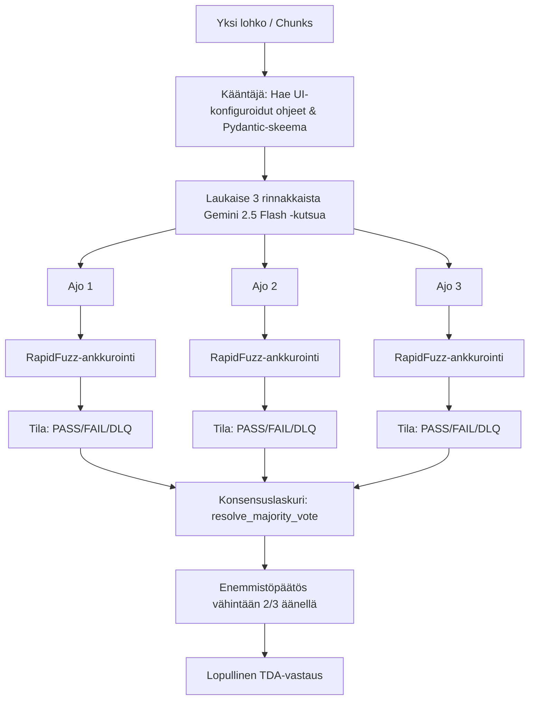

# EPIC 77: TDA Best-of-Three Gemini 2.5 Flash -arviointiarkkitehtuuri

## 1. Yhteenveto & Tavoite (Executive Summary)

Tämä Epic-dokumentti määrittelee uuden **Best-of-Three (2/3) Gemini 2.5 Flash -pohjaisen arviointiarkkitehtuurin** Test-Driven Assertion (TDA) -sääntöjen evaluointiin. Uusi malli korvaa aiemmin suunnitellun monimutkaisen kolmiagenttisen väittelymallin (Puolustaja-Syyttäjä-Tuomari) sekä hauraan syntaktisen ankkurien esisuodatuksen.

Tavoitteena on saavuttaa lähes **100 % parittainen itse-konsistenssi (Self-Consistency)** ja äärimmäinen monikielinen vakaus poistamalla kallista Gemini 2.5 Pro -mallia käyttävä kognitiivinen päättely rutiininomaisista uuttotehtävistä ja korvaamalla se matalatasoisten Flash-mallien rinnakkaisella enemmistöäänestyksellä ja tiukalla fyysisellä ankkuroinnilla.

---

## 2. Opit Mismatch-analyyseistä (A, B, C, D)

Analysoimme neljä erillistä simulaatioajoa ([A](file:///c:/src/quorum/scratch/mismatch_traces_raw%20A.md), [B](file:///c:/src/quorum/scratch/mismatch_traces_raw%20B.md), [C](file:///c:/src/quorum/scratch/mismatch_traces_raw%20C.md), [D](file:///c:/src/quorum/scratch/mismatch_traces_raw%20D.md)), joissa evaluoitiin 183–186 atomia eri kokoonpanoilla. Havaitut ongelmat ja niiden ratkaisut uudessa arkkitehtuurissa ovat:

### A. API-virheiden ja aikakatkaisujen hallinta
*   **Havaittu ongelma (Raportti A):** Run 1 kaatui yhdessä lohkossa virheeseen `AGENT_EXECUTION_CRITICAL` upstream-aikakatkaisun vuoksi. Tämä pudotti kyseisen ajon konsistenssin **84.15 %**:iin.
*   **Ratkaisu:** Best-of-3 -eräajossa ajetaan 3 rinnakkaista LLM-kutsua. Jos yksi kutsu epäonnistuu tai aikakatkaistaan, meillä on edelleen kaksi onnistunutta vastea, joiden pohjalta enemmistöpäätös (2/2) voidaan muodostaa ilman koko askeleen DLQ-hylkäystä.

### B. Semanttinen "venytys" rajatapauksissa
*   **Havaittu ongelma (Raportit C ja D):** Malli oskilloi rajatapauksissa, kuten `tda_453ddf8b14a442e988836098e3c7b55c` (onko fyysinen lievennystoimenpide kuvattu verbin avulla vai ei). Toinen ajo tulkitsi suositukset lievennykseksi, toinen vaati tiukempaa toimintaa.
*   **Ratkaisu:** Enemmistöäänestys (2/3) tasoittaa stokastisen kohinan näissä semanttisissa rajatapauksissa, mikä nostaa Fleissin Kappan ($\kappa$) lähelle arvoa 1.0.

### C. Leksikaaliset erot ja kääntäminen suomen kielessä
*   **Havaittu ongelma (Raportti C):** Erot siinä, miten malli tunnistaa suomenkieliset ankkurit (esim. `eli` vs `toisin sanoen` säännössä `tda_131403148eab4c739149e6bd29164ce2`).
*   **Ratkaisu:** Best-of-3 -uutto tekee poiminnan suoraan suomenkielisestä alkutekstistä ja hyödyntää RapidFuzz partial-ratio -varmennusta. Jokainen kolmesta erillisestä uutosta ankkuroidaan fyysisesti tekstiin NFKC-normalisoinnilla ennen äänten laskemista.

---

## 3. Uusi Arkkitehtuuri: Best-of-Three Flash -putki

Kunkin suorituslohkon (Chunk) sisällä TDA-sääntöjen arviointi tapahtuu seuraavasti:

### Vaihe 1: Rinnakkaisajo (Concurreny & Caching)
Kaikki kolme Flash-ajoa käynnistetään asynkronisesti hyödyntämällä `asyncio.TaskGroup` -rakennetta. Koska syöte on identtinen, Vertex AI:n **Prompt Caching** säästää 75 % toisen ja kolmannen ajon input-kustannuksista ja pudottaa vasteajan lähes nollaan ensimmäisen ajon jälkeen.

### Vaihe 2: Leksikaalinen auditointi ennen äänestystä
Jokaisen ajon tuottama `exact_quote` syötetään `AnchorValidationService.validate_evidence` -palveluun. Jos sitaattia ei löydy tekstistä tai se on hallusinoitu:
*   Ajon tilaksi merkitään `FAIL`.
*   Tämä estää "keksittyjen" sitaattien pääsyn enemmistöäänestykseen.

### Vaihe 3: Enemmistöpäätöksen muodostaminen
Lasketaan kullekin atomille tilastollinen konsensus:
*   Jos vähintään 2 ajoa palauttaa `PASS` (validi sitaatti löytynyt ja varmennettu) $\rightarrow$ Lopullinen tila on `PASS`. Sitaatiksi valitaan jompikumpi validi sitaatti.
*   Jos vähintään 2 ajoa palauttaa `DLQ` (Contextual Override aktivoitu) $\rightarrow$ Lopullinen tila on `DLQ`.
*   Muussa tapauksessa lopputulos on `FAIL`.

---

## 4. UI-ohjauksen ja Poimintaprotokollien integrointi

Putki tukee täydellisesti Admin Studion nykyistä toiminnallisuutta:

1.  **Evidenssin poimintaprotokolla (Extraction Protocol Block):**
    *   Jos valittuna on *"Kevyt JSON-uutto (Ei perusteluja)"*, mallia kielletään tekemästä Chain-of-Thought -päättelyä. Generoidaan vain `exact_quote` ja `contextual_override`.
    *   Jos valittuna on *"Globaali Zero-Trust evidenssin poimintaprotokolla"*, malli velvoitetaan tuottamaan 5-vaiheinen jäsennystrace `semantic_reasoning` -kenttään.
2.  **Execution Persona Block:**
    *   Injektoi globaalin hardening-kehyksen (esim. `DETERMINISTIC_PARSER` varmistamaan ettei semanttista venytystä sallita).

Tämä tarkoittaa, että **käyttöliittymän SDUI-elementit ja ohjauspaneelit säilyvät 100 % yhteensopivina**, ja muutokset tapahtuvat puhtaasti backendin suorituskerroksessa.

---

## 5. Kustannus- ja tehokkuushyödyt

*   **Gemini Pro -riippuvuuden poistaminen:** Gemini 2.5 Pro -mallia ei enää tarvita rutiinipoiminnoissa.
*   **Output-tokeneiden leikkaaminen:** Kevyen JSON-uuton ansiosta poistetaan tarpeettomat reasoning-tokenit silloin, kun niitä ei tarvita. Tämä säästää jopa 60 % tuotoskustannuksista.
*   **Vasteajat:** Rinnakkaisuuden ansiosta kokonaislatenssi pysyy matalana (1–2 sekuntia per chunk), toisin kuin sequential-pohjaisessa väittelymallissa.

---

## 6. Onnistumisen Kriteerit

*   [ ] Parittainen konsistenssi (Self-Consistency) nousee yli **98 %**:iin kaikissa standardiajoissa.
*   [ ] Työnkulun kokonaiskustannukset putoavat vähintään **40 %** verrattuna aiempaan sekventiaaliseen Pro-pohjaiseen ajoon.
*   [ ] Järjestelmä sietää yksittäisen LLM-kutsun aikakatkaisun (1/3) ilman askeleen kaatumista.
*   [ ] Kaikki olemassa olevat yksikkötestit ja auditointilooppi (`backend_audit_loop.py`) menevät onnistuneesti läpi.
