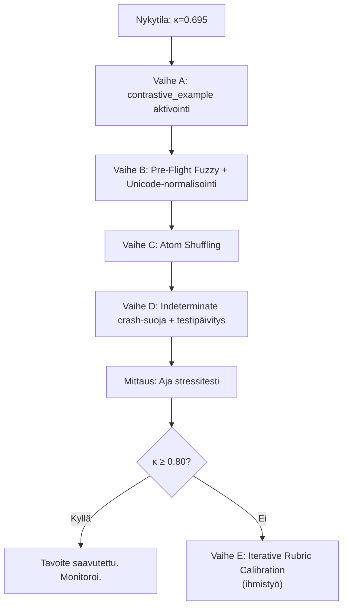

# System 2 Varianssianalyysi: Jäljellä olevat interventiot (Post-Audit)

> **Konteksti**: Tämä dokumentti analysoi koodin, tietokannan ja viimeisimmän diff-raportin nykytilan (κ = 0.695, konsistenssi 84.87 %) ja tunnistaa jäljelle jäävät interventiot, jotka eivät ole vielä toteutettu. Jokainen ehdotus on arvioitu myös overfitting-riskin ja domain-riippumattomuuden kannalta.

---

## 1. Nykytilan auditointi: Mitä on jo toteutettu?

Viimeisimmän stressitestin (`diff_report_2026-06-25_2352.md`) mukaan:

| Metriikka | Arvo | Muutos edellisestä |
|:----------|:-----|:-------------------|
| Konsistenssi | **84.87 %** | ↑ 78.67 % → 84.87 % |
| Cohen's κ | **0.695** | ↑ 0.57 → 0.695 |
| Fleiss κ | **0.695** | ↑ 0.57 → 0.695 |
| Entropia | **0.151** | ↓ (parantunut) |
| Erimielisyydet | **23 / 152** | ↓ 32 → 23 |

### Jo toteutetut korjaukset (vahvistettu koodista):

| Korjaus | Tiedosto | Status |
|:--------|:---------|:-------|
| ✅ Vice-teksti poistettu promptista | [localization_compiler.py](file:///c:/src/quorum/backend_v2/services/orchestrator/localization_compiler.py#L155-L156) | Tehty |
| ✅ CoT-deprivaation korjaus (3-step audit trace) | [evaluation_steps.py](file:///c:/src/quorum/backend_v2/models/dtos/evaluation_steps.py#L55-L56) | Tehty |
| ✅ CONTESTED legitimoitu promptissa | `seed_data.json` (blk_573802341db9d68c) | Tehty |
| ✅ Symmetrinen confidence gating (PASS + FAIL) | [chunk_worker.py](file:///c:/src/quorum/backend_v2/services/orchestrator/strategies/llm_execution/chunk_worker.py#L173-L194) | Tehty |
| ✅ CONTESTED bypasses inversion | [lightweight_matrix.py](file:///c:/src/quorum/backend_v2/models/dtos/lightweight_matrix.py#L207-L208) | Tehty |
| ✅ Cognitive Collapse turvalukko | [scoring.py](file:///c:/src/quorum/backend_v2/hooks/scoring.py#L916) | Tehty |
| ✅ Dynaaminen suhteellinen sakko | [scoring.py](file:///c:/src/quorum/backend_v2/hooks/scoring.py#L1000-L1008) | Tehty |
| ✅ Strict-reititys raskailla solmuilla | seed_data.json (5 solmua) | Tehty |

---

## 2. Jäljellä olevat interventiot (prioriteettijärjestyksessä)

> [!IMPORTANT]
> Jokainen alla oleva ehdotus on suunniteltu **domain-agnostiseksi** — mikään ei sido järjestelmää tiettyihin lähtötiedostoihin, toimialoihin tai sisältötyyppeihin. Overfitting-riski on arvioitu erikseen.

---

### 2.1 🔴 KRIITTINEN: `contrastive_example` -kentän aktivointi (Dormant Metadata)

**Nykytila**: [localization_compiler.py](file:///c:/src/quorum/backend_v2/services/orchestrator/localization_compiler.py#L120-L177) EI injektoi `contrastive_example` -kenttää promptiin. 152 atomilla on valmiit X/Y-abstraktiot tietokannassa, mutta LLM ei koskaan näe niitä.

**Tieteellinen perusta**: 
- CalibJudge (arXiv 2026): Kontrastiiviset esimerkit vähentävät varianssia 15–25 % ilman fine-tuningia.
- Min et al. 2022: Esimerkkien **formaatti** (PASS/FAIL -rakenne) on tärkeämpi kuin konkreettinen sisältö.
- Contrastive Learning (arXiv 2025): Kontrastiiviset esimerkit parantavat päätösrajan vakautta ilman overfittingiä.

**Miksi ei ylisovita**: X/Y-abstraktiot ovat tarkoituksella domain-agnostisia (esim. `"X directly results in Y"`). Ne opettavat mallia tunnistamaan **loogisia rakenteita**, eivät toimialakohtaisia sanoja. Koska ne ovat jo tietokannassa ja universaaleja, ne toimivat kaikilla syötetiedostoilla.

**Toteutus**: Lisää `compile_xml_rubrics` -metodiin uusi XML-blokki:
```python
if assertion.contrastive_example:
    assertion_xml.append(
        f"    <CONTRASTIVE_EXAMPLE>{assertion.contrastive_example}</CONTRASTIVE_EXAMPLE>"
    )
```

**Odotettu vaikutus**: κ +0.03–0.05 (varovainen arvio)
**Riski**: Matala. Worst case: ei vaikutusta. Lisää ~20–30 tokenia per atomi.
**Overfitting-riski**: ❌ Ei. X/Y-abstraktiot ovat universaaleja eivätkä viittaa mihinkään tiettyyn dataan.

---

### 2.2 🟡 KESKITASO: Pre-Flight Fuzzy Matching (Deterministinen Route Divergence)

**Nykytila**: [extractive_sensor_service.py](file:///c:/src/quorum/backend_v2/services/orchestrator/extractive_sensor_service.py#L40) käyttää `AnchorValidationService.strict_match()` -funktiota pre-flight-ankkuroinnissa. Jos syötetekstissä on pienikin typografi (kuten "aa" vs "a"), ankkurimätsäys epäonnistuu ja atomi reititetään LLM:lle sen sijaan, että se käsiteltäisiin deterministisesti. Tämä tuottaa **deterministisen varianssin** — eri reitti → eri tulos.

**Tieteellinen perusta**:
- Raportin oma forensinen löydös (osio 1.4) tunnistaa tämän varianssilähteeksi.
- 2026 best practice: Deterministic pre-screening layered defense.

**Miksi ei ylisovita**: Fuzzy matching on puhtaasti mekaaninen operaatio (Levenshtein-etäisyys / partial_ratio), joka ei riipu sisällöstä.

**Toteutus**: Muutetaan `pre_evaluate` käyttämään fuzzy-mätsäystä korkealla kynnyksellä (esim. ≥95 %):
```python
# extractive_sensor_service.py
from rapidfuzz import fuzz

@staticmethod
def _fuzzy_match(source_text: str, anchor: str, threshold: float = 95.0) -> bool:
    """Fuzzy match that tolerates minor typos in source text."""
    from backend_v2.services.orchestrator.anchor_validation_service import AnchorValidationService
    # First try strict
    if AnchorValidationService.strict_match(source_text, [anchor]):
        return True
    # Fallback to fuzzy
    return fuzz.partial_ratio(anchor.lower(), source_text.lower()) >= threshold

found = [a for a in tda.syntactic_anchors if ExtractiveSensorService._fuzzy_match(source_text, a)]
```

**Odotettu vaikutus**: Eliminoi deterministinen route divergence kokonaan (arviolta 3–5 atomia 23:sta).
**Riski**: Matala. Korkea kynnysarvo (95 %) estää false positivet.
**Overfitting-riski**: ❌ Ei. Mekaaninen toleranssi, ei sisältöriippuvainen.

---

### 2.3 🟡 KESKITASO: Normalisoinnin laajentaminen (Unicode ja Zero-Width Characters)

**Nykytila**: [normalization.py](file:///c:/src/quorum/backend_v2/utils/normalization.py#L33-L47) tekee Markdown-puhdistuksen ja moninkertaisten välilyöntien kollapsoinnin, mutta **ei käsittele**:
- Unicode zero-width charactereja (ZWSP, ZWJ, ZWNJ)
- BOM-merkkejä (Byte Order Mark)
- Unicode-normalisointia (NFC vs NFD)
- En-dash/Em-dash vs hyphen -variantteja
- "Smart quotes" vs straight quotes

**Tieteellinen perusta**: 
- Self-Denoising (ResearchGate 2026): Mekaaninen normalisointi on tutkimuksen mukaan turvallisempi kuin LLM-pohjainen, koska se on deterministinen.
- Alkuperäinen raportti tunnisti tämän (osio 2.4).

**Miksi ei ylisovita**: Unicode-normalisointi on universaali tekstinkäsittely — se ei riipu kielen tai toimialan sisällöstä.

**Toteutus**: Lisätään `normalize_evaluation_input` -funktioon:
```python
import unicodedata

# 0. Unicode normalization (NFC canonical form)
cleaned = unicodedata.normalize("NFC", text)

# 0.5. Remove zero-width characters and BOM
cleaned = re.sub(r'[\u200b\u200c\u200d\ufeff\u00ad]', '', cleaned)

# 0.7. Normalize dashes and quotes
cleaned = cleaned.replace('\u2013', '-').replace('\u2014', '-')  # en/em dash
cleaned = cleaned.replace('\u201c', '"').replace('\u201d', '"')  # smart quotes
cleaned = cleaned.replace('\u2018', "'").replace('\u2019', "'")
```

**Odotettu vaikutus**: Vähentää tokenisointi-varianssia, erityisesti PDF-pohjaisissa syötteissä.
**Riski**: Erittäin matala. Puhdas preprocessing.
**Overfitting-riski**: ❌ Ei.

---

### 2.4 🟡 KESKITASO: Atom Shuffling per Ensemble Run (Positional Bias)

**Nykytila**: [chunk_worker.py](file:///c:/src/quorum/backend_v2/services/orchestrator/strategies/llm_execution/chunk_worker.py#L572-L573) lähettää atomit samassa järjestyksessä kaikille 3 ensemble-ajoille. Tutkimus (2025–2026) osoittaa, että LLM:t kärsivät **position biasista** — pitkässä kontekstissa ensimmäisten ja viimeisten atomien arvioinnit ovat vakaita, mutta keskellä olevat atomit "hukkuvat" (lost-in-the-middle -efekti).

**Tieteellinen perusta**:
- Position Swapping on 2026 LLM-as-judge standard practice (Zheng et al., 2023 & 2026 best practices).
- Wang et al. 2025 (Self-Consistency): Eri järjestyksessä shufflatut promptit ovat tehokkaampia kuin identtiset.

**Miksi ei ylisovita**: Shuffling on puhtaasti rakenteellinen muutos, joka ei lisää sisältöä promptiin.

**Toteutus**: `_execute_chunk_logic`:ssa shufflataan chunk.items eri järjestykseen eri ensemble-ajoille. Koska `resolve_majority_vote` yhdistää tulokset `atom_id`:n perusteella, shuffling on turvallista.

```python
# chunk_worker.py, _safe_execute -funktion alussa:
if index > 0 and has_shuffled_atoms and chunk is not None:
    import random
    rng = random.Random(index)  # Deterministinen seed per indeksi
    shuffled_items = list(chunk.items)
    rng.shuffle(shuffled_items)
    chunk = chunk.model_copy(update={"items": shuffled_items})
```

**Odotettu vaikutus**: κ +0.01–0.03 (vaikuttaa erityisesti pitkiin chunkkeihin).
**Riski**: Matala. `atom_id` -perustainen yhdistys on jo toteutettu.
**Overfitting-riski**: ❌ Ei. Rakennesiirto, ei sisältömuutos.

---

### 2.5 🟢 MATALA PRIORITEETTI: Indeterminate-tilan crash-suoja (Gap 3 auditoinnista)

**Nykytila**: [scoring.py](file:///c:/src/quorum/backend_v2/hooks/scoring.py#L1174) `normalize_matrix_scores_hook` ohittaa (`continue`) matriisin, jos `raw_score` ei ole numeerinen. Jos stepissä on vain yksi matriisi ja se on INDETERMINATE, `_evaluative_matrices` jää tyhjäksi. [apply_scoring_logic_hook](file:///c:/src/quorum/backend_v2/hooks/scoring.py#L233) saattaa heittää fatal-poikkeuksen.

**Kriittinen audit-raportin löydös**: Gap 3 tunnisti tämän crash-riskin.

**Toteutus**: Lisätään `apply_scoring_logic_hook` -funktioon tarkistus:
```python
if count == 0:
    # Check if the zero count is due to valid INDETERMINATE matrices
    has_indeterminate = any(
        isinstance(new_data.get(k), dict) and "[INDETERMINATE]" in str(new_data.get(k, {}).get("justification", ""))
        for k, _ in matrix_keys
    )
    if has_indeterminate:
        logger.warning("[ScoringHook] All matrices are INDETERMINATE. Skipping aggregation.")
        return HookResult(success=True, state_delta=new_data)
```

**Odotettu vaikutus**: Estää 500-crashin onnistuneen epävarmuuden tunnistamisen yhteydessä.
**Riski**: Matala.
**Overfitting-riski**: ❌ Ei.

---

### 2.6 🟢 MATALA PRIORITEETTI: Vanhentunut integraatiotesti

**Nykytila**: [test_prompt_compiler.py](file:///c:/src/quorum/backend_v2/tests/integration/test_prompt_compiler.py) `test_inverse_logic_injected` testaa V1 Vice-tekstin läsnäoloa, joka on tietoisesti poistettu.

**Toteutus**: Päivitetään testi heijastamaan uutta arkkitehtuuria (ei Vice-tekstiä, vain sääntöelementtien läsnäolo).

---

## 3. Interventiot jotka HYLÄTÄÄN (overfitting- tai destruktioriskin vuoksi)

| Hylätty interventio | Syy |
|:---------------------|:----|
| ❌ **Bounty Hunter (66 atomin uudelleenkirjoitus)** | Tuhoaa BARS-skaalan tasojen 1–2 semantiikan. >100h työtä. |
| ❌ **Domain-spesifiset few-shot-esimerkit** | Ylisovittuvat nykyiseen dataan. Eivät siirry uusille syötetiedostoille. |
| ❌ **Temperature jitter (Model Registry)** | Arkkitehtuurisesti raskas. Strict-reititys on jo parempi ratkaisu. Ei todistettua hyötyä kun rakenteelliset ongelmat on korjattu. |
| ❌ **TRUE/FALSE -kentän eliminointi** | Raportissa tunnistettu "Phantom Evidence" -ongelma on jo ratkaistu arkkitehtuuritasolla (`evaluate_extraction` ylikirjoittaa LLM:n statuksen deterministisesti). |
| ❌ **Self-Denoising LLM-vaihe** | Ei-deterministinen itsessään. Lisää kustannuksia ja latenssia. Mekaaninen normalisointi (2.3) on turvallisempi. |
| ❌ **Ensemble-koon dynaaminen kasvatus (3→7)** | Kustannustehoton ilman atom-kohtaista historiadataa. Nykyinen strict+confidence gating on parempi ratkaisu. |

---

## 4. Tieteellinen State-of-the-Art 2026: Mikä puuttuu vielä?

Uusimman tutkimuksen perusteella tunnistetaan **kolme kategoriaa** joista järjestelmä ei vielä hyödy:

### 4.1 Hierarchical Measurement Model (Instance-Level Reliability)

**Idea**: Sen sijaan, että laskemme yhden globaalin κ-arvon, lasketaan jokaiselle atomille **instanssikohtainen luotettavuusarvio**. Tämä mahdollistaa:
- Aidosti vaikeiden atomien tunnistamisen (ne joissa ihmisetkin olisivat eri mieltä)
- Raportointitason varmuuden differentioidun esittämisen (ei "kaikki ovat 100 % varmoja")

**Toteutus**: Tämä ei vaadi koodimuutoksia nyt — se on analytiikkatason muutos diff-raportoinnin jälkeen. E2E-varianssiskripta voisi laskea atom-kohtaisen varianssin yli ajojen ja tallentaa sen metadataksi.

### 4.2 Distributional Mean Scoring (Token Logprobs)

**Idea**: Sen sijaan, että luemme mallin binäärisen `decision: true/false` -outputin, laskettaisiin todennäköisyysjakauma token-tasolla. 
**Nykytilan rajoite**: Gemini 2.5 Vertex AI ei vielä (2026-06) palauta logprobeja structured output -kontekstissa. Tämä on tulevaisuuden interventio. **Nykyinen confidence gating simuloi tätä** ensemblen hajonnalla.

### 4.3 Iterative Rubric Calibration Loop

**Idea**: Kerätään 50–200 "golden label" -esimerkkiä ihmisarvioijilta ja kalibroidaan sääntöjä niitä vasten. Tutkimus (2026) osoittaa, että **ihmisen ja koneen välinen κ on aina rajoite** — jos ihmiset ovat eri mieltä, kone ei voi olla johdonmukaisempi.

**Toteutettavuus**: Tämä on pitkän aikavälin investointi. Se ei ole koodimuutos vaan operatiivinen prosessi: aja testi, anna ihmisen arvioida erimielisyydet, päivitä sääntöjen muotoilua. **Ei ylisovita**, koska tavoitteena on sääntöjen yksiselitteisyyden parantaminen, ei mallin sovittaminen dataan.

---

## 5. Suositeltu toteutusjärjestys



| Vaihe | Interventio | Odotettu κ | Työmäärä | Riski |
|:------|:-----------|:-----------|:---------|:------|
| A | Contrastive Example aktivointi | 0.72–0.74 | 1 päivä | Matala |
| B | Fuzzy Pre-Flight + Unicode | 0.74–0.76 | 1 päivä | Matala |
| C | Atom Shuffling | 0.76–0.78 | 0.5 päivää | Matala |
| D | Crash-suoja + testi | — | 0.5 päivää | Matala |
| Mittaus | Stressitesti | — | ~2h (automaattinen) | — |
| E | Rubric Calibration (ihmis) | 0.80+ | 3–5 päivää | Matala |
