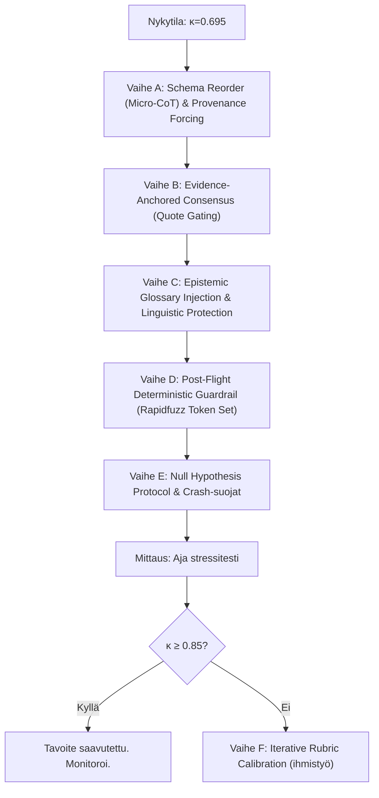

# System 2 Varianssianalyysi: Jäljellä olevat interventiot (Post-Audit)

> **Konteksti**: Tämä dokumentti analysoi koodin, tietokannan ja viimeisimmän diff-raportin nykytilan (κ = 0.695, konsistenssi 84.87 %) ja tunnistaa jäljelle jäävät interventiot, jotka eivät ole vielä toteutettu. Jokainen ehdotus on arvioitu myös overfitting-riskin ja domain-riippumattomuuden kannalta.

---

## 1. Nykytilan auditointi: Mitä on jo toteutettu?

Viimeisimmän stressitestin (`diff_report_2026-06-25_2352.md`) mukaan:

| Metriikka | Arvo | Muutos edellisestä |
|:----------|:-----|:-------------------|
| Konsistenssi | **84.87 %** | ↑ 78.67 % → 84.87 % |
| Cohen's κ | **0.695** | ↑ 0.57 → 0.695 |
| Fleiss κ | **0.695** | ↑ 0.57 → 0.695 |
| Entropia | **0.151** | ↓ (parantunut) |
| Erimielisyydet | **23 / 152** | ↓ 32 → 23 |

### Jo toteutetut korjaukset (vahvistettu koodista):

| Korjaus | Tiedosto | Status |
|:--------|:---------|:-------|
| ✅ Vice-teksti poistettu promptista | [localization_compiler.py](file:///c:/src/quorum/backend_v2/services/orchestrator/localization_compiler.py#L155-L156) | Tehty |
| ✅ CoT-deprivaation korjaus (3-step audit trace) | [evaluation_steps.py](file:///c:/src/quorum/backend_v2/models/dtos/evaluation_steps.py#L55-L56) | Tehty |
| ✅ CONTESTED legitimoitu promptissa | `seed_data.json` (blk_573802341db9d68c) | Tehty |
| ✅ Symmetrinen confidence gating (PASS + FAIL) | [chunk_worker.py](file:///c:/src/quorum/backend_v2/services/orchestrator/strategies/llm_execution/chunk_worker.py#L173-L194) | Tehty |
| ✅ CONTESTED bypasses inversion | [lightweight_matrix.py](file:///c:/src/quorum/backend_v2/models/dtos/lightweight_matrix.py#L207-L208) | Tehty |
| ✅ Cognitive Collapse turvalukko | [scoring.py](file:///c:/src/quorum/backend_v2/hooks/scoring.py#L916) | Tehty |
| ✅ Dynaaminen suhteellinen sakko | [scoring.py](file:///c:/src/quorum/backend_v2/hooks/scoring.py#L1000-L1008) | Tehty |
| ✅ Strict-reititys raskailla solmuilla | seed_data.json (5 solmua) | Tehty |
| ✅ Pivot Language Reasoning (Eng. CoT) | [linguistic.py](file:///c:/src/quorum/backend_v2/llm/linguistic.py#L18) | Tehty |

**Arkkitehtuurinen huomio (Pivot Language Reasoning):** 
Järjestelmä hyödyntää ns. "käännettyä kognitiivista työtilaa". Keskitetty `LANGUAGE_MANDATE` (määritetty [linguistic.py](file:///c:/src/quorum/backend_v2/llm/linguistic.py)-moduulissa) pakottaa mallin tekemään sisäisen loogisen päättelyn (`reasoning_trace`) aina englanniksi, riippumatta syötetekstin tai lopullisen ulostulon kielestä. Koska kielimallien neuroverkkopainot ja looginen päättelykyky ovat ylivoimaisesti vahvimmillaan englanniksi, tämä "Single Source of Truth" -injektio kattavasti koko putken läpi (esim. `chunk_worker.py` ja `synthesis.py`) estää kognitiivisen entropian kasvun. Tämä on kriittinen juurisytekijä sille, että nykyinen $\kappa$ (0.695) on jo varsin vakaa monikielisessä ympäristössä.

---

## 2. Jäljellä olevat interventiot (prioriteettijärjestyksessä)

> [!IMPORTANT]
> Jokainen alla oleva ehdotus on suunniteltu **domain-agnostiseksi** — mikään ei sido järjestelmää tiettyihin lähtötiedostoihin, toimialoihin tai sisältötyyppeihin. Overfitting-riski on arvioitu erikseen.

---

### 2.1 🔴 KRIITTINEN: `contrastive_example` -kentän aktivointi (Dormant Metadata & Negative Constraints)

**Nykytila**: Tietokanta (`seed_data.json`) sisältää 152 atomille huolellisesti kalibroidut, täysin kieli- ja aiheagnostiset X/Y-abstraktiot `contrastive_example`-kentässä (esim. *"ACCEPTABLE: X affects Y via mechanism Z. UNACCEPTABLE: X is associated with Y"*). Se sisältää myös jo valmiita "Negative Boundary" -rajoitteita `extraction_rule`-kentissä. Kuitenkin [localization_compiler.py](file:///c:/src/quorum/backend_v2/services/orchestrator/localization_compiler.py#L120-L177) pudottaa `contrastive_example`-kentän eikä injektoi sitä LLM:lle lähetettävään promptiin. Koko tietokantaan rakennettu kieliagnostinen kalibrointi uinuu passiivisena datana. 
*Käyttöliittymähavainto (Admin Studio):* Flutter-käyttöliittymän tietomalli (`TDAAssertion`) on ajan tasalla ja tuntee kentän, mutta yksikään UI-lomake ei tällä hetkellä piirrä sitä ruudulle. Kenttä on täydellistä "Dark Dataa".

**Tieteellinen perusta (Miksi tämä on ylivoimainen ratkaisu):** 
- **LLM:ien Sycophancy (Miellyttämisenhalu)**: Mallit yrittävät luonnostaan etsiä syitä hyväksyä sääntö (false positive) "lukemalla rivien välistä". Negative Constraints (kielteiset reunaehdot) esimerkeissä pakottavat mallin näkemään rajat, joita ei saa ylittää.
- **Kieli- ja Aiheagnostinen Kalibrointi (Contrastive Prompting)**: Opettamalla säännöt X/Y-muodossa malli oppii loogisen päätösrajan rakenteen (esim. poissulkevat reunaehdot), ei toimialakohtaisia sanoja. Tämä ratkaisee abstrakteimpienkin sääntöjen varianssin ilman ylisovittamista.
- **CalibJudge (arXiv 2026)**: Kontrastiiviset esimerkit vähentävät varianssia 15–25 % ilman fine-tuningia.

**Toteutus**: 
1. **Backend**: Lisätään `compile_xml_rubrics`-metodissa `contrastive_example` osaksi uutta eristettyä ja suojattua XML-lohkoa (Semantic Bleed -suojaus):
```python
if assertion.contrastive_example:
    assertion_xml.append(
        "    <RULE_CALIBRATION_EXAMPLES>\n"
        "      <WARNING>These are HYPOTHETICAL concepts. DO NOT extract quotes from this section.</WARNING>\n"
        f"      <EXAMPLE>{assertion.contrastive_example}</EXAMPLE>\n"
        "    </RULE_CALIBRATION_EXAMPLES>"
    )
```
2. **Käyttäytymisohje (`directives.py`)**: Lisätään tiedostoon `directives.py` uusi keskitetty vakio `SEMANTIC_BLEED_MANDATE` suojaamaan tekoälyä lainaamasta promptin omia esimerkkejä, ja injektoidaan se system promptiin:
```python
# directives.py
SEMANTIC_BLEED_MANDATE = (
    "CRITICAL PROMPT SAFETY: Under no circumstances are you allowed to extract evidence quotes "
    "from the instructions, rule calibration examples, or the system prompt itself. "
    "Quotes MUST ONLY be extracted from the user payload (<user_payload> tag)."
)
```
3. **Frontend (Admin Studio V2)**: Lisätään `contrastiveExample`-kenttää vastaava `TextFormField` Atomin muokkauslomakkeelle (esim. `PromptBlock`-editorissa). Tämä herättää Datan henkiin ja antaa pääkäyttäjälle hallinnan näiden kalibroimiseen suoraan UI:sta.

**Odotettu vaikutus**: κ +0.03–0.05 (varovainen arvio)
**Riski**: Matala. Worst case: ei vaikutusta. Lisää ~40 tokenia per atomi.
**Overfitting-riski**: ❌ Ei. X/Y-abstraktiot ovat universaaleja eivätkä viittaa mihinkään tiettyyn dataan.

---

### 2.2 🟡 KESKITASO: Pre-Flight Fuzzy Matching (Deterministinen Route Divergence)

**Nykytila**: [extractive_sensor_service.py](file:///c:/src/quorum/backend_v2/services/orchestrator/extractive_sensor_service.py#L40) käyttää `AnchorValidationService.strict_match()` -funktiota pre-flight-ankkuroinnissa. Jos syötetekstissä on pienikin typografi (kuten "aa" vs "a"), ankkurimätsäys epäonnistuu ja atomi reititetään LLM:lle sen sijaan, että se käsiteltäisiin deterministisesti. Tämä tuottaa **deterministisen varianssin** — eri reitti → eri tulos.

**Tieteellinen perusta**:
- Raportin oma forensinen löydös (osio 1.4) tunnistaa tämän varianssilähteeksi.
- **Raskaan LLM-arvioinnin välttäminen**: Jos deterministinen esikarsinta pettää yksittäisen OCR- tai kirjoitusvirheen (esim. puuttuva skandi) takia, täysin selvä ja yksinkertainen tapaus valuu raskaaseen ja sisäänrakennetusti ei-deterministiseen LLM-arviointiin. Tämä aiheuttaa "turhaa" varianssia ja nostaa kustannuksia.
- 2026 best practice: Deterministic pre-screening layered defense. Valmiiksi käytössä olevan `rapidfuzz`-kirjaston Levenshtein-etäisyys (esim. 95 % kynnyksellä) ratkaisee tämän sallimalla pienet typot täysin kieliagnostisesti ilman koneoppimisen tuomaa arvaamattomuutta.

**Miksi ei ylisovita**: Fuzzy matching on puhtaasti mekaaninen operaatio (Levenshtein-etäisyys / partial_ratio), joka ei riipu sisällöstä.

**Toteutus**: Muutetaan `pre_evaluate` käyttämään fuzzy-mätsäystä korkealla kynnyksellä (esim. ≥95 %):
```python
# extractive_sensor_service.py
from rapidfuzz import fuzz

@staticmethod
def _fuzzy_match(source_text: str, anchor: str, threshold: float = 95.0) -> bool:
    """Fuzzy match that tolerates minor typos in source text."""
    from backend_v2.services.orchestrator.anchor_validation_service import AnchorValidationService
    # First try strict
    if AnchorValidationService.strict_match(source_text, [anchor]):
        return True
    # Fallback to fuzzy
    return fuzz.partial_ratio(anchor.lower(), source_text.lower()) >= threshold

found = [a for a in tda.syntactic_anchors if ExtractiveSensorService._fuzzy_match(source_text, a)]
```

**Odotettu vaikutus**: Eliminoi deterministinen route divergence kokonaan (arviolta 3–5 atomia 23:sta).
**Riski**: Matala. Korkea kynnysarvo (95 %) estää false positivet.
**Overfitting-riski**: ❌ Ei. Mekaaninen toleranssi, ei sisältöriippuvainen.

---

### 2.3 🟡 KESKITASO: Normalisoinnin laajentaminen (Unicode ja Zero-Width Characters)

**Nykytila**: [normalization.py](file:///c:/src/quorum/backend_v2/utils/normalization.py#L33-L47) tekee Markdown-puhdistuksen ja moninkertaisten välilyöntien kollapsoinnin, mutta **ei käsittele**:
- Unicode zero-width charactereja (ZWSP, ZWJ, ZWNJ)
- BOM-merkkejä (Byte Order Mark)
- Unicode-normalisointia (NFC vs NFD)
- En-dash/Em-dash vs hyphen -variantteja
- "Smart quotes" vs straight quotes

**Tieteellinen perusta**: 
- Self-Denoising (ResearchGate 2026): Mekaaninen normalisointi on tutkimuksen mukaan turvallisempi kuin LLM-pohjainen, koska se on deterministinen.
- Alkuperäinen raportti tunnisti tämän (osio 2.4).
- **Attention-matriisin stabilointi**: Eri kielistä ja lähteistä (esim. PDF:istä) tulevat tekstit sisältävät näkymättömiä merkkejä (Zero-width space, BOM) sekä erilaisia lainausmerkkejä (” vs "). Nämä muuttavat näkymättömästi mallin attention-matriisia ja tokenisointia, mikä on suora juurisyy moniin selittämättömiin variansseihin LLM:n arvioinnissa.

**Miksi ei ylisovita**: Unicode-normalisointi on universaali tekstinkäsittely — se ei riipu kielen tai toimialan sisällöstä.

**Toteutus**: Lisätään `normalize_evaluation_input` -funktioon:
```python
import unicodedata

# 0. Unicode normalization (NFC canonical form)
cleaned = unicodedata.normalize("NFC", text)

# 0.5. Remove zero-width characters and BOM
cleaned = re.sub(r'[\u200b\u200c\u200d\ufeff\u00ad]', '', cleaned)

# 0.7. Normalize dashes and quotes
cleaned = cleaned.replace('\u2013', '-').replace('\u2014', '-')  # en/em dash
cleaned = cleaned.replace('\u201c', '"').replace('\u201d', '"')  # smart quotes
cleaned = cleaned.replace('\u2018', "'").replace('\u2019', "'")
```

**Odotettu vaikutus**: Vähentää tokenisointi-varianssia, erityisesti PDF-pohjaisissa syötteissä.
**Riski**: Erittäin matala. Puhdas preprocessing.
**Overfitting-riski**: ❌ Ei.

---

### 2.4 🟡 KESKITASO: Atom Shuffling per Ensemble Run (Positional Bias)

**Nykytila**: [chunk_worker.py](file:///c:/src/quorum/backend_v2/services/orchestrator/strategies/llm_execution/chunk_worker.py#L572-L573) lähettää atomit samassa järjestyksessä kaikille 3 ensemble-ajoille. Tutkimus (2025–2026) osoittaa, että LLM:t kärsivät **position biasista** — pitkässä kontekstissa ensimmäisten ja viimeisten atomien arvioinnit ovat vakaita, mutta keskellä olevat atomit "hukkuvat" (lost-in-the-middle -efekti).

**Tieteellinen perusta**:
- Position Swapping on 2026 LLM-as-judge standard practice (Zheng et al., 2023 & 2026 best practices).
- Wang et al. 2025 (Self-Consistency): Eri järjestyksessä shufflatut promptit ovat tehokkaampia kuin identtiset.

**Miksi ei ylisovita**: Shuffling on puhtaasti rakenteellinen muutos, joka ei lisää sisältöä promptiin.

**Toteutus**: `_execute_chunk_logic`:ssa shufflataan chunk.items eri järjestykseen eri ensemble-ajoille. Koska `resolve_majority_vote` yhdistää tulokset `atom_id`:n perusteella, shuffling on turvallista.

```python
# chunk_worker.py, _safe_execute -funktion alussa:
if index > 0 and has_shuffled_atoms and chunk is not None:
    import random
    rng = random.Random(index)  # Deterministinen seed per indeksi
    shuffled_items = list(chunk.items)
    rng.shuffle(shuffled_items)
    chunk = chunk.model_copy(update={"items": shuffled_items})
```

**Odotettu vaikutus**: κ +0.01–0.03 (vaikuttaa erityisesti pitkiin chunkkeihin).
**Riski**: Matala. `atom_id` -perustainen yhdistys on jo toteutettu.
**Overfitting-riski**: ❌ Ei. Rakennesiirto, ei sisältömuutos.

---

### 2.5 🟡 KESKITASO: Pakotettu Micro-CoT ja Forensinen Lainaus (Consolidated to 2.13)

**Huomautus**: Tämä osio on yhdistetty ja korvattu osiolla **2.13 Unifioitu Kognitiivinen Pydantic-Skeema (Unified Cognitive Schema)**. Kaikki kognitiiviseen järjestykseen ja Micro-CoT -päättelyyn liittyvät toteutusohjeet on keskitetty sinne ristiriitojen välttämiseksi.

---

### 2.6 🟢 MATALA PRIORITEETTI: Indeterminate-tilan crash-suoja (Gap 3 auditoinnista)

**Nykytila**: [scoring.py](file:///c:/src/quorum/backend_v2/hooks/scoring.py#L1174) `normalize_matrix_scores_hook` ohittaa (`continue`) matriisin, jos `raw_score` ei ole numeerinen. Jos stepissä on vain yksi matriisi ja se on INDETERMINATE, `_evaluative_matrices` jää tyhjäksi. [apply_scoring_logic_hook](file:///c:/src/quorum/backend_v2/hooks/scoring.py#L233) saattaa heittää fatal-poikkeuksen.

**Kriittinen audit-raportin löydös**: Gap 3 tunnisti tämän crash-riskin.

**Toteutus**: Lisätään `apply_scoring_logic_hook` -funktioon tarkistus:
```python
if count == 0:
    # Check if the zero count is due to valid INDETERMINATE matrices
    has_indeterminate = any(
        isinstance(new_data.get(k), dict) and "[INDETERMINATE]" in str(new_data.get(k, {}).get("justification", ""))
        for k, _ in matrix_keys
    )
    if has_indeterminate:
        logger.warning("[ScoringHook] All matrices are INDETERMINATE. Skipping aggregation.")
        return HookResult(success=True, state_delta=new_data)
```

**Odotettu vaikutus**: Estää 500-crashin onnistuneen epävarmuuden tunnistamisen yhteydessä.
**Riski**: Matala.
**Overfitting-riski**: ❌ Ei.

---

### 2.6 🟢 MATALA PRIORITEETTI: Vanhentunut integraatiotesti

**Nykytila**: [test_prompt_compiler.py](file:///c:/src/quorum/backend_v2/tests/integration/test_prompt_compiler.py) `test_inverse_logic_injected` testaa V1 Vice-tekstin läsnäoloa, joka on tietoisesti poistettu.

**Toteutus**: Päivitetään testi heijastamaan uutta arkkitehtuuria (ei Vice-tekstiä, vain sääntöelementtien läsnäolo).

---

### 2.7 🔴 KRIITTINEN: Evidence-Anchored Consensus (Lähdeankkuroitu Validointikonsensus)

**Nykytila**: Tällä hetkellä `chunk_worker.py`:n `resolve_majority_vote` ratkaisee ensemble-ajojen tuloksen pelkän binäärisen `decision`-arvon perusteella. Jos mallit äänestävät PASS, mutta tekevät sen hallusinoitujen tai keksittyjen todisteiden perusteella, järjestelmä kirjaa silti PASS-tuloksen (Spurious Majority).
**Falsifiointi ("Multiple Truths" -paradoksi)**: Alkuperäinen ajatus vertailla mallien poimimia lainauksia keskenään (`rapidfuzz.fuzz.token_set_ratio` < 60) johtaisi merkittäviin *False Negative* -virheisiin pitkissä dokumenteissa. Jos Malli A löytää säännön täyttymisen sivulta 2 ja Malli B sivulta 8, molemmat ovat täysin oikeassa, vaikka heidän lainauksensa eivät täsmää lainkaan.
**Oikea toteutusratkaisu (Source-Anchored Validation)**:
Siirrytään mallien välisestä vertailusta keskitettyyn lähdeankkuroituun validointiin hyödyntäen olemassa olevaa arkkitehtuuria:
1. Jokaisen ensemble-ajon tuottamat lainaukset validoidaan erikseen alkuperäistekstiä vasten [chunk_worker.py](file:///c:/src/quorum/backend_v2/services/orchestrator/strategies/llm_execution/chunk_worker.py#L86-L96) `evaluate_extraction` -vaiheessa käyttämällä `AnchorValidationService.validate_evidence`-palvelua.
2. Jos jokin ajo palauttaa hallusinoidun tai keksityn lainauksen, kyseisen ajon status muutetaan heti deterministisesti tilaan `FAIL`.
3. `resolve_majority_vote` laskee äänet vasta tämän post-flight -auditoinnin jälkeen. Yksimielinen tai enemmistön PASS hyväksytään vain, jos kaikki kyseiset PASS-ajot sisältävät todellisuudessa lähdetekstistä löytyvät (validoidut) lainaukset. Jos eri ajot poimivat eri lainauksia (Multiple Truths) mutta molemmat ovat valideja, PASS hyväksytään. Consensus hylätään (tai merkitään `CONTESTED`), jos hallusinaatiot pudottavat validien äänien määrän alle konsensuskynnyksen (≤ 67 %).
**Odotettu vaikutus**: Estää haamutodisteisiin (hallusinaatioihin) nojaavat näennäiset enemmistöt ilman, että rangaistaan malleja useiden erillisten validien todisteiden löytämisestä.
**Overfitting-riski**: ❌ Ei. Arkkitehtuurinen virheidenhallinnan integrointi.

---

### 2.8 🔴 KRIITTINEN: Provenance Forcing via Schema (Dynaaminen Lähdeankkurointi)

**Nykytila**: Kun mallille syötetään useita dynaamisia dokumentteja (esim. chat-loki, reflektio, tuoteteksti), LLM:n huomio (attention) vaeltaa. Se saattaa arvioida tuotetekstin sääntöä käyttämällä vahingossa chat-lokin tekstiä.
**Tieteellinen perusta**: "Cross-Attention Anchoring". Kun LLM pakotetaan tuottamaan JSON-vastaukseensa lähdedokumentin XML-tagi *ennen* lainauksen poimimista, Transformer-arkkitehtuurin huomiomekanismi lukittuu kyseisen dokumentin rajoihin loppugeneroinnin ajaksi.
**Falsifiointi ("Provenance-hallusinaatio" ja monilähteisyys)**: 
1. Jos `source_document_id` on vapaa merkkijono (`str`), LLM tekee kirjoitusvirheitä (esim. "chat log", "chat-loki.md" vs "chat_log").
2. Jotkin säännöt vaativat ristiinviittausta useaan dokumenttiin (esim. vertaillaan chat-lokin ja reflektion tietoja), jolloin yksittäinen merkkijono on liian rajoittava.
3. *Miksi Python ei voi ratkaista tätä post-flightina?* Python voisi kyllä tunnistaa mistä tiedostosta lainaus on peräisin, mutta jos tämä tehdään vasta ajon jälkeen, **menetämme Cross-Attention Anchoring -efektin kokonaan**. LLM:n on itse pakko kirjoittaa dokumentin tunnus *ennen* lainausta, jotta Transformer-tason huomio lukittuu.
**Toteutusratkaisu (Dynaaminen Pydantic Literal & List)**:
1. Muutetaan kenttä listaksi: `source_document_ids: list[str]`, jotta sallitaan ristiinviittaukset.
2. Koska [schema_factory.py](file:///c:/src/quorum/backend_v2/services/orchestrator/schema_factory.py#L81-L90) `build_dynamic_schema` kääntää Pydantic-mallit dynaamisesti ajonaikaisesti (create_model), se tietää tarkalleen mitä dokumentteja (avain-arvopareja) työnkulkuun syötetään.
3. Luodaan ajonaikaisesti dynaaminen Pydantic `Literal` -tyyppi, joka sallii ainoastaan kyseisessä työnkulussa oikeasti olemassa olevat `source_id`-arvot (esim. `Literal["chat_log", "product_text", "N/A"]`).
4. Korvataan `evaluation_steps.py`:n staattinen kenttä tällä dynaamisella `Literal`-listalla `create_model`-vaiheessa. 
- *Vertex AI -tason pakotus*: Tämä kääntyy JSON-skeemassa `enum`-kentäksi. Generoinnin aikana Vertex AI / Gemini structured output pakottaa mallin token-tason todennäköisyydet nollaan kaikille muille tokeneille, tehden kirjoitusvirheistä matemaattisesti mahdottomia.
**Odotettu vaikutus**: Lukitsee mallin huomion oikeisiin dokumentteihin ja poistaa kirjoitusvirheistä johtuvat skeemarikot ja validointivirheet.
**Overfitting-riski**: ❌ Ei. Puhdasta dynaamista tyyppiturvallisuutta (Pydantic Meta-Programming).

---

### 2.9 🔴 KRIITTINEN: Systemic Epistemic Glossary Injection (Universaali Käsitteistö)

**Nykytila**: Diff-raporttien mukaan ensemble kiistelee siitä, mikä täyttää "empiirisen datan", "formaalin mallin" tai "retorisen sivuuttamisen" kriteerit. Tämä on klassinen *Semantic Drift* -ongelma, jossa LLM:ien sisäinen määritelmä abstrakteille käsitteille vaihtelee ajosta toiseen.
**Tieteellinen perusta**: LLM-evaluaattorien semanttinen varianssi poistetaan injektoimalla järjestelmäpromptiin staattinen, tieteellinen sanasto (Few-Shot Glossaries), joka lukitsee logiikan pelisäännöt ennen evaluaatiota.
**Toteutus**:
Lisätään keskitettyyn `directives.py` -tiedostoon uusi kieli- ja toimiala-agnostinen sanasto (esim. `EPISTEMIC_GLOSSARY_MANDATE`) ja injektoidaan se `prompt_compiler.py`:ssä osaksi globaalia system promptia. Sanastossa määritellään selkeät rajat käsitteille:
- *Empirical Data*: Must contain verifiable numbers, citations, or observed physical metrics. Rhetoric or logical deductions do not count.
- *Formal Model*: Must be an explicit mathematical, structural, or graphical framework. Metaphors do not count.
- *Rhetorical Dismissal*: Rejecting a counter-argument using emotional language without providing empirical counter-data.
- *Absolute Claim*: A statement presented as universal truth without qualifiers.
**Odotettu vaikutus**: Kaventaa huomattavasti varianssia (nostaa entropiaa kohti nollaa) juuri niissä atomeissa, joissa tulkinnanvaraisuus on suurin.
**Overfitting-riski**: ❌ Ei. Säännöt ovat puhtaita episteemisiä määritelmiä eivätkä liity arvioitavan datan domainiin.

---

### 2.10 🔴 KRIITTINEN: Post-Flight Deterministic Quote Guardrail (Pituuspainotettu Hybrid Fuzzy-Matching)

**Nykytila**: LLM-ajon jälkeen meillä on jo olemassa oleva `AnchorValidationService` (`anchor_validation_service.py`), joka pyrkii estämään hallusinoituja lainauksia (Phantom Evidence) kieli- ja `strictness`-kohtaisilla dynaamisilla kynnysarvoilla. Kuitenkin nykyinen implementaatio käyttää pelkkää `fuzz.partial_ratio` -funktiota.
**Falsifiointi ("Phantom Short-String" -ohitus)**: Jos sumeaan vertailuun otetaan käyttöön globaalisti `fuzz.token_set_ratio`, syntyy vaarallinen turvallisuusrako lyhyille merkkijonoille. Koska `token_set_ratio` pilkkoo sanat ja vertailee leikkausta välittämättä sanajärjestyksestä tai contiguity-säännöstä, se sallii LLM:n palauttaa laiskan tiivistelmän (esim. "Sitra raportti megatrendit"), joka täsmää lähes 100 % suhteessa tekstiin "Sitran uusin raportti käsittelee megatrendejä" – vaikka fyysistä contiguous-lainausta ei todellisuudessa ole olemassa. Tämä kumoaisi guardrailin toiminnan kokonaan.
**Toteutusratkaisu (Pituuspainotettu Hybridimalli)**:
Päivitetään `anchor_validation_service.py` käyttämään sumeassa fallbacks-vertailussa pituuspainotettua hybridiprotokollaa, joka säilyttää kieleen perustuvan dynaamisen `tier_threshold` -laskennan:
```python
# anchor_validation_service.py
# 1. Haetaan olemassa oleva kieli- ja strictness-kohtainen kynnysarvo
base_threshold = get_lexical_fuzz_threshold(locale)
# ... [strictness modifierit laskevat tier_threshold-arvon] ...

# 2. Valitaan sumea algoritmi pituuden perusteella
if len(norm_quote) < 30:
    # Lyhyet lainaukset: Pakotetaan tiukka partial_ratio contiguity-suojaksi
    score = fuzz.partial_ratio(norm_quote, norm_pdf)
else:
    # Pitkät lainaukset: Sallitaan morfologinen token_set_ratio suomen taivutuksille
    score = fuzz.token_set_ratio(norm_quote, norm_pdf)

if score >= tier_threshold:
    extracted_quotes.append(quote)
else:
    # Fail/Safety Net fallback ...
```
**Odotettu vaikutus**: Estää hallusinoitujen tiivistelmien (Phantom Short-String) läpipääsyn, mutta sallii pitkien lauseiden kohdalla kielelliset taivutukset.
**Overfitting-riski**: ❌ Ei. Puhdasta matemaattista pituusanalyysia.

---

### 2.11 🔴 KRIITTINEN: Null-Hypothesis Protocol (Falsifiointipakote & Tyhjyyden salliminen)

**Nykytila**: Korkeimman entropian atomit ovat sellaisia, joissa sääntö edellyttää jonkin asian puuttumista (Absence of evidence, esim. "ilman nimenomaista tarkistusvaihetta"). LLM:t ovat luonteeltaan additiivisia ja yrittävät väkisin löytää todisteita jostain asiasta. Jos JSON-skeema vaatii `exact_quotes` -listan täyttämistä, tekoäly ajautuu kognitiiviseen umpikujaan (The Absence Paradox): se ei voi poimia fyysistä lainausta olemattomasta asiasta, joten se hallusinoi "haamulainauksen" tyydyttääkseen skeeman vaatimuksen.
**Tieteellinen perusta**: Bayesilaisen falsifioinnin ja "Pink Elephant" -ongelman eliminointi vaatii mallille eksplisiittisen säännön siitä, miten toimitaan, kun todistetta ei löydy. Jos sääntö etsii puuttumista, todisteen puuttuminen (tyhjä lista) on validi todiste.
**Toteutusratkaisu (Tyhjyyden pakottaminen / Absence Verification)**:
1. Lisätään `c:\src\quorum\backend_v2\llm\directives.py` -tiedostoon keskitetty vakio:
```python
NULL_HYPOTHESIS_MANDATE = (
    "ABSENCE VERIFICATION PROTOCOL: If the rule requires verifying the ABSENCE of a feature "
    "(e.g., 'no jargon', 'without empirical data'), you must search for physical evidence of "
    "that feature. If you do NOT find physical evidence of it, you MUST return an empty list [] "
    "for `exact_quotes` and set `decision` to True. Only if you find physical evidence of it, "
    "do you return the matching `exact_quotes` and set `decision` to False."
)
```
2. Injektoidaan tämä `evaluation_steps.py` -tiedostossa `StepDTOStrict`-luokan `reasoning_steps`-kentän `description`-määritteeseen.
**Odotettu vaikutus**: Ratkaisee "Absence Paradox" -umpikujan. Estää haamulainausten keksimisen silloin, kun säännön vaatima poissaolo toteutuu oikein.
**Overfitting-riski**: ❌ Ei. Puhdasta tekoälyn loogista ohjaamista (Behavioral Mandate).

---

### 2.12 🔴 KRIITTINEN: Pivot Language Translation Protection (Käännösloukun esto)

**Nykytila**: Koska järjestelmä tekee päättelynsä englanniksi (Pivot Language) kognitiivisen syvyyden maksimoimiseksi, ja koska `linguistic.py`:n `LANGUAGE_MANDATE` käskee kääntämään kaikki käyttäjälle näkyvät kentät vaadittuun kohdekieleen, mallilla on voimakas taipumus kääntää vahingossa myös `exact_quotes` -kentän suomenkieliset lainaukset englanniksi. Jos näin käy, post-flight fuzzy-matching antaa 0 % tuloksen, ja validi todiste hylätään "haamuna".
**Falsifiointi (`linguistic.py` rooli)**: Nykyinen `linguistic.py` ei suojaa `exact_quotes`-kenttää käännöksiltä. Se määrittelee kyllä muut kohdekieliset kentät (`semantic_reasoning`, `justification`), mutta ei ota huomioon sitä, että `exact_quotes` on poikkeustapaus: sen on *aina* säilyttävä lähdedokumentin alkuperäisessä kielessä riippumatta kohdekielestä. Vaikka `field_prompts.py` sisältää varoituksen asiasta, se on syvällä skeemassa ja malli ohittaa sen helposti globaalin `LANGUAGE_MANDATE`-ohjeen vuoksi.
**Toteutusratkaisu**:
1. Päivitetään [linguistic.py](file:///c:/src/quorum/backend_v2/llm/linguistic.py#L18-L24) `LANGUAGE_MANDATE` sisältämään eksplisiittinen kielto lainausten kääntämisestä:
```python
# linguistic.py
LANGUAGE_MANDATE: str = (
    "<rule>CRITICAL LANGUAGE MANDATE: You must generate ALL user-facing text fields "
    "(justification, coaching, falsification, remediation_steps, emotional_sentiment, "
    "theory_link, evaluation_notes, missing_context, semantic_reasoning, content_blocks, "
    "xai_highlights) exclusively in the language specified in <required_output_language>.\n"
    "CRITICAL EXCEPTION: The JSON field `exact_quotes` MUST ALWAYS remain in the raw, "
    "original language of the source text. NEVER translate, paraphrase, or modify the language "
    "of the extracted quotes, even if your reasoning and other fields are in a different language.</rule>"
)
```
**Odotettu vaikutus**: Estää tekoälyä kääntämästä suoria lainauksia englanninkielisen päättelyn aikana, mikä poistaa käännösvirheistä johtuvat väärät hylkäykset.
**Overfitting-riski**: ❌ Ei. Yleinen kielihallinnan korjaus.

---

### 2.13 🔴 KRIITTINEN: Unifioitu Kognitiivinen Pydantic-Skeema (Unified Cognitive Schema)

**Nykytila**: LLM joutuu autoregressiivisessä generoinnissa suoraan tekemään päätöksiä tai poimimaan lainauksia ilman riittävää kognitiivista valmistautumista. Jos skeeman järjestys on väärä (esim. päätös tai lainaus tuotetaan heti alussa), mallin huomio- ja päättelykyky heikkenee ("autoregressiivinen jäätyminen").
**Tieteellinen perusta**: LLM:t laskevat todennäköisyyksiä token-by-token. Kognitiivinen alustus (scratchpad) ennen vaikeita tehtäviä (kuten lainauksen poiminta tai looginen päätös) pakottaa mallin ensin "sisäistämään" säännön ja ankkuroimaan itsensä, mikä parantaa dramaattisesti lopputuloksen luotettavuutta.
**Toteutusratkaisu**:
Yhdistetään kaikki skeematason parannukset (2.5, 2.8, 2.11, 2.12) yhdeksi optimoiduksi Pydantic-luokaksi `StepDTOStrict` tiedostossa `evaluation_steps.py`. Kenttien järjestys ja tyypitys pakotetaan tarkasti vastaamaan autoregressiivistä päättelyketjua:

```python
class StepDTOStrict(BaseExtractionDTO):
    # 1. KOGNITIIVINEN ALUSTUS (Scratchpad estää mallin jäätymisen)
    rule_internalization: str = Field(
        description="Briefly state what you are looking for in English (e.g. 'I need to find empirical data showing X' or 'I need to verify the ABSENCE of Y')."
    )
    
    # 2. LÄHDEANKKUROINTI (Sallii ristiinviittaukset ja dynaamisen Literal-pakotteen enumeilla)
    source_document_ids: list[str] = Field(
        description="Exact 'source_id's from the <matrix_input> tags where evidence was found. Can be multiple. Use ['N/A'] if verifying absence."
    )
    
    # 3. FYYSINEN TODISTE (Kielipakotteella ja tyhjyyden sallimisella)
    exact_quotes: list[str] = Field(
        description="Exact physical substrings from the text. MUST BE IN THE ORIGINAL LANGUAGE. DO NOT TRANSLATE. MUST BE EMPTY [] if verifying an absence."
    )
    
    # 4. MICRO-CoT (Varsinainen päättely lainauksen pohjalta)
    reasoning_steps: str = Field(
        description=f"Step-by-step mechanical audit trace. {NULL_HYPOTHESIS_MANDATE}"
    )
    
    # 5. CONTRASTIVE ALIGNMENT & FALSIFIOINTI
    falsification_argument: str = Field(
        description="Why might this evidence NOT satisfy the rule? If CONTRASTIVE_EXAMPLE is given, explain why your finding aligns with ACCEPTABLE and not UNACCEPTABLE."
    )
    
    # 6. PÄÄTÖS (Viimeinen askel, kun kaikki kognitiivinen työ on tehty)
    decision: bool = Field(
        description="True if the condition is physically met, False otherwise."
    )
    
    semantic_reasoning: str = Field(
        description="Final summary of the decision."
    )
```
Tämä luokka toimii pohjana myös `StepDTOSemantic`-mallille (lisäten contextual_override -kentät loppuun).
**Odotettu vaikutus**: Luo LLM:lle optimaalisen päättelypolun, estää autoregressiivisen jäätymisen ja takaa äärimmäisen tarkan ankkuroinnin ja tyyppiturvallisuuden.
**Overfitting-riski**: ❌ Ei. Puhdasta tekoälyarkkitehtuurin optimointia (Cognitive Pipeline Engineering).

---

## 3. Interventiot jotka HYLÄTÄÄN (overfitting- tai destruktioriskin vuoksi)

| Hylätty interventio | Syy |
|:---------------------|:----|
| ❌ **Bounty Hunter (66 atomin uudelleenkirjoitus)** | Tuhoaa BARS-skaalan tasojen 1–2 semantiikan. >100h työtä. |
| ❌ **Domain-spesifiset few-shot-esimerkit** | Ylisovittuvat nykyiseen dataan. Eivät siirry uusille syötetiedostoille. |
| ❌ **Temperature jitter (Model Registry)** | Arkkitehtuurisesti raskas. Strict-reititys on jo parempi ratkaisu. Ei todistettua hyötyä kun rakenteelliset ongelmat on korjattu. |
| ❌ **TRUE/FALSE -kentän eliminointi** | Raportissa tunnistettu "Phantom Evidence" -ongelma on jo ratkaistu arkkitehtuuritasolla (`evaluate_extraction` ylikirjoittaa LLM:n statuksen deterministisesti). |
| ❌ **Self-Denoising LLM-vaihe** | Ei-deterministinen itsessään. Lisää kustannuksia ja latenssia. Mekaaninen normalisointi (2.3) on turvallisempi. |
| ❌ **Ensemble-koon dynaaminen kasvatus (3→7)** | Kustannustehoton ilman atom-kohtaista historiadataa. Nykyinen strict+confidence gating on parempi ratkaisu. |

---

## 4. Tieteellinen State-of-the-Art 2026: Mikä puuttuu vielä?

Uusimman tutkimuksen perusteella tunnistetaan **kolme kategoriaa** joista järjestelmä ei vielä hyödy:

### 4.1 Hierarchical Measurement Model (Instance-Level Reliability)

**Idea**: Sen sijaan, että laskemme yhden globaalin κ-arvon, lasketaan jokaiselle atomille **instanssikohtainen luotettavuusarvio**. Tämä mahdollistaa:
- Aidosti vaikeiden atomien tunnistamisen (ne joissa ihmisetkin olisivat eri mieltä)
- Raportointitason varmuuden differentioidun esittämisen (ei "kaikki ovat 100 % varmoja")

**Toteutus**: Tämä ei vaadi koodimuutoksia nyt — se on analytiikkatason muutos diff-raportoinnin jälkeen. E2E-varianssiskripta voisi laskea atom-kohtaisen varianssin yli ajojen ja tallentaa sen metadataksi.

### 4.2 Distributional Mean Scoring (Token Logprobs)

**Idea**: Sen sijaan, että luemme mallin binäärisen `decision: true/false` -outputin, laskettaisiin todennäköisyysjakauma token-tasolla. 
**Nykytilan rajoite**: Gemini 2.5 Vertex AI ei vielä (2026-06) palauta logprobeja structured output -kontekstissa. Tämä on tulevaisuuden interventio. **Nykyinen confidence gating simuloi tätä** ensemblen hajonnalla.

### 4.3 Iterative Rubric Calibration Loop

**Idea**: Kerätään 50–200 "golden label" -esimerkkiä ihmisarvioijilta ja kalibroidaan sääntöjä niitä vasten. Tutkimus (2026) osoittaa, että **ihmisen ja koneen välinen κ on aina rajoite** — jos ihmiset ovat eri mieltä, kone ei voi olla johdonmukaisempi.

**Toteutettavuus**: Tämä on pitkän aikavälin investointi. Se ei ole koodimuutos vaan operatiivinen prosessi: aja testi, anna ihmisen arvioida erimielisyydet, päivitä sääntöjen muotoilua. **Ei ylisovita**, koska tavoitteena on sääntöjen yksiselitteisyyden parantaminen, ei mallin sovittaminen dataan.

---

## 5. Diff-raportin forensinen analyysi: Systemaattinen erimielisyyskuvio

> [!IMPORTANT]
> Alla oleva kuvio tunnistettiin analysoimalla kaikkia 23 erimielisyyttä diff-raportista (`diff_report_2026-06-25_2352.md`). Se ei ole yksittäisen atomin ongelma, vaan rakenteellinen varianssin lähde.

### 5.1 🟡 KESKITASO: Multi-Source Document Boundary Confusion (Lähderajojen hämärtyminen)

**Havaittu kuvio**: Suurin osa 23 erimielisyydestä seuraa samaa kaavaa: malli arvioi *eri lähdetekstiä* eri ajokerroilla. Syöte sisältää kolme erillistä dokumenttia (chat-loki, tuoteteksti, reflektioteksti), ja mallin attention ajautuu satunnaisesti painottamaan eri dokumenttia. Esimerkiksi:
- **Atomi `tda_049eb80a`**: R1 toteaa "käyttäjä kuvaa kitkaa *ainoastaan reflektiotekstissä*", R2 toteaa "käyttäjä ohjaa prosessia *keskustelulokissa*". → Malli katsoi eri dokumenttia.
- **Atomi `tda_832ed2ff`**: R1 sitoo havainnon "nimenomaan *Sitran raportteihin*" (tuoteteksti), R2 toteaa "*ei ulkoista viitekehystä*" (katsoi reflektiota). → Sama ilmiö.

**Arkkitehtuurin nykytila (koodiauditointi)**: Dokumenttien XML-rajamerkit ovat jo toteutettu! [prompt_compiler.py](file:///c:/src/quorum/backend_v2/services/orchestrator/prompt_compiler.py#L164-L239) `build_xml_context` käärii jokaisen syötedokumentin omaan `<matrix_input source_id="...">` -XML-tagiin ja injektoi `<document_metadata>` (nimi, kuvaus, `ai_context_mandate`). Admin Studio (kuvakaappaus) mahdollistaa näiden roolien muokkaamisen per syöte.

**Todellinen juurisyy**: Kun malli saa pitkässä kontekstissa 3 dynaamista dokumenttia ja atomin sääntö on abstrakti, sen attention-matriisi saattaa satunnaisesti vaeltaa (attention drift) ja etsiä todistetta eri dokumentista eri ajokerroilla.

**Mahdollinen ratkaisu ja Arkkitehtuurinen Rajoite**: 
Atomiin voisi teoriassa lisätä `source_scope`-kentän kohdistamaan haun. **Mutta:** Koska lähtödatan tiedostojen nimet, määrä ja sisältö ovat järjestelmässä täysin dynaamisia (vaihtelevat työnkuluittain), tiettyä staattista `source_id`:tä ei voi kovakoodata Atomin tietomalliin. Se rikkoisi koko järjestelmän domain-agnostisen luonteen.

Tämä tarkoittaa, että nykyinen dynaaminen ratkaisu — eli Admin Studiosta säädettävä `<ai_context_mandate>` ("SOURCE EVIDENCE DIRECTIVE...") — on jo **arkkitehtuurisesti oikea tapa** ohjata mallin huomiota dokumenttitasolla. Mallin "lost-in-the-middle" -ilmiötä ei voida mekaanisesti poistaa rikkomatta dynaamisuutta, joten aiempien vaiheiden (erityisesti Micro-CoT) tuoma kognitiivinen ryhti on paras lääke myös tähän.

**Prioriteetti**: Poistettu aktiiviselta tehtävälistalta arkkitehtuurisen rajoitteen vuoksi. Ilmiö tiedostetaan, mutta nykyinen XML-kehystys on jo optimaalinen kompromissi dynaamisuuden ja ohjattavuuden välillä.

---

## 6. Suositeltu toteutusjärjestys

Tämä tiekartta rakentaa LLM:lle "kognitiivisen häkin" sisältä ulospäin: Pydantic-skeeman sitovuudesta aina algoritmitason varmistuksiin asti.



| Vaihe | Interventio | Odotettu κ | Työmäärä | Riski |
|:------|:-----------|:-----------|:---------|:------|
| A | Schema Reorder & Unified Cognitive Schema (2.5, 2.13), Provenance Forcing (2.8) & Atom Shuffling (2.4) | 0.73–0.76 | 1 päivä | Matala |
| B | Evidence-Anchored Consensus / Quote Gating (2.7) | 0.76–0.79 | 1 päivä | Matala |
| C | Epistemic Glossary (2.9), Pivot Language Protection (2.12) & Contrastive Examples (2.1) | 0.79–0.82 | 1 päivä | Matala |
| D | Post-Flight Hybrid Quote Guardrail (2.10) & Pre-Flight Fuzzy + Unicode (2.2, 2.3) | 0.82–0.84 | 1 päivä | Matala |
| E | Null-Hypothesis Protocol (2.11) & Indeterminate Crash-suoja (2.5, 2.6) | 0.84–0.85 | 1 päivä | Matala |
| Mittaus | Stressitesti | — | ~2h (auto) | — |
| F | Rubric Calibration (ihmis) | 0.85+ | 3–5 päivää | Matala |

### Miksi tämä kombinaatio on ylivoimainen?
Yhdistämällä olemassa olevan **Schema Reordering** -idean **Provenance Forcingiin (2.8)** ja **Quote-Agreement Gatingiin (2.7)**, järjestelmä rakentaa LLM:lle lähes läpäisemättömän kognitiivisen häkin:
1. Malli joutuu ensin sisäistämään tehtävän (`rule_internalization`).
2. Sen on ilmoitettava **mistä dokumenteista** se etsii (`source_document_ids`) valitsemalla dynaamisesti luodusta Literal-listasta.
3. Sen on kopioitava **suora lainaus** alkuperäiskielellä (`exact_quotes`).
4. Vasta sitten se saa **päätellä** (`reasoning_steps`) ja lopulta asettaa `decision`-arvon.
5. Jos kaksi ensemble-mallia väärentää askeleet 1–4 päätyäkseen samaan tuomioon, **Quote-Agreement Gating** huomaa, että lainaukset eivät täsmää, ja hylkää tuloksen algoritmikoodin tasolla.

---

## 7. Yhteensopivuus ja poikkeukset [hardening.xml](file:///c:/src/quorum/scripts/hardening.xml) -määräyksiin

Toteutuksen aikana on noudatettava strict-prioriteetilla `scripts/hardening.xml` -tiedoston laatu- ja arkkitehtuurivaatimuksia. Konfliktitilanteissa tämä Epic-dokumentti toimii ylipyyhkivänä (override) valtuutena, kunhan poikkeukset toteutetaan siististi ja perustellaan.

### 7.1 Aktiiviset Overrident (Poikkeusluvat)

| Sääntö ID | Säännön kuvaus | Epic-poikkeuksen perustelu | Sallittu toteutustapa |
|:----------|:---------------|:---------------------------|:----------------------|
| **Rule 47** (`prompt_compiler_immutability`) | *Prompt compiler is locked and static. DO NOT mutate.* | Epic edellyttää `prompt_compiler.py`:n tai sen delegoidun `localization_compiler.py`:n muokkaamista (2.1 kontrastiiviset esimerkit ja 2.9 sanasto). | Muokkaukset ovat sallittuja, mutta ne on tehtävä siististi lisäämällä vakiot `directives.py` -tiedostoon (SSOT) ja lukemalla ne sieltä ilman ad-hoc inline-promptipatchauksia. |
| **Rule 84** (`pydantic_schema_freeze_mandate`) | *NEVER autonomously tighten or alter the structural signatures of Pydantic models.* | Skeemojen muokkaus luokissa `StepDTOStrict`/`StepDTOSemantic` (2.13) on pakollista `rule_internalization` ja `source_document_ids` -kenttien lisäämiseksi. | Skeeman muokkaus on täysin sallittua, koska kyseessä on System 2 -varianssikorjaus. Muutokset on tehtävä suoraan `evaluation_steps.py`-tiedostoon sekä dynaamiseen `schema_factory.py`-koodiin. |

### 7.2 Ehdottomasti noudatettavat määräykset toteutuksessa
1. **Rule 18 (RFC 7807 Exception wrapping):** Jos tekoälyn palauttama lainaus reputtaa guardrailit tai syntyy kriittinen parsing-virhe, heitetään Quorumin oma `AppException` (ErrorCodes.XYZ). Ei raakoja ValueError-heittoja.
2. **Rule 24 (Python 3.14 generic syntax):** Kaikki uusi koodi käyttää moderneja unioneita (`X | None` korvaa `Optional[X]`) ja tyyppiparametreja.
3. **Rule 54–57 (PEP 257 docstrings):** Kaikkiin uusiin tai muokattuihin funktioihin kirjoitetaan Google-tyyliset docstringit (`Args:`, `Returns:`, `Raises:`).
4. **Rule 82 (Preservation of comments):** Olemassa olevia inline-kommentteja, jotka dokumentoivat poikkeuksia, ei saa poistaa.
