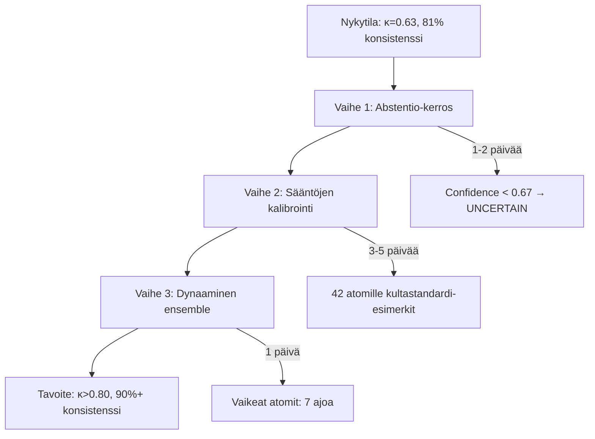
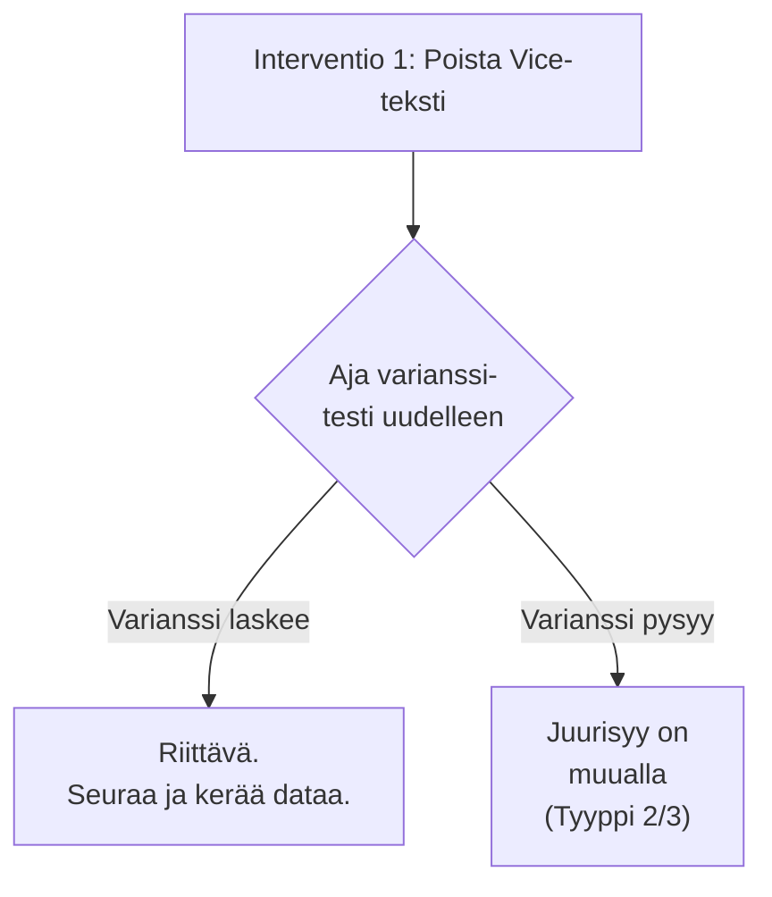
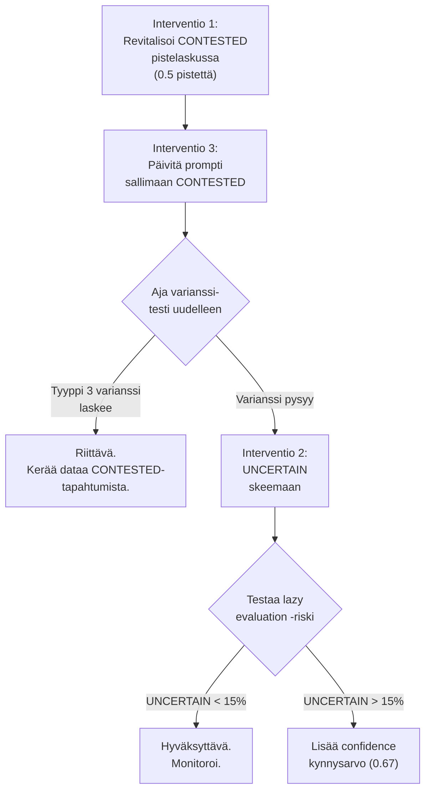
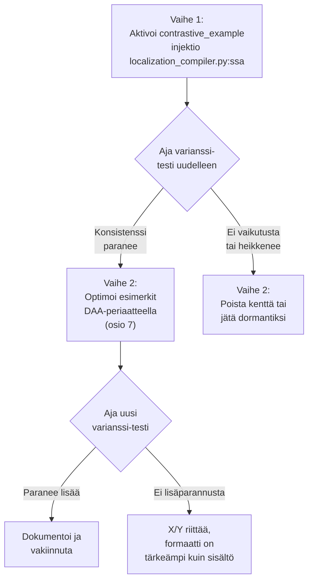

# System 2 -analyysi: LLM-arviointiVarianssin Vähentäminen

> **Konteksti**: Suoritimme stressitestin, jossa vertasimme puhdasta perusajoa ja ajoa, johon tehtiin tarkoituksellisesti yhden kirjaimen ("a" → "aa") kirjoitusvirhe. **Tämä yhden kirjaimen ero romautti 150 atomin arvioinnin vakauden**: Cohenin κ = 0.57, konsistenssi 78.67 % ja varianssi huikeat 21.3 %. Tämä dokumentti tutkii "perhosefektin" syitä pitkissä konteksteissa ja etsii tieteellisesti perusteltuja keinoja sen ratkaisemiseen.
---

> [!WARNING]
> **System 2 Forensic Addendum (Codebase Verified)**
> 
> Tämän dokumentin alkuperäinen analyysi on käynyt läpi perusteellisen System 2 -tason koodi- ja tietokantaverifioinnin. Verifiointi vahvistaa merkittävän osan raportin empiirisistä löydöksistä (Vice-tekstin poisto, CONTESTED-tilan "kuolema", Contrastive Example -kentän inaktiivisuus), mutta nostaa esiin kaksi **kriittistä sokeaa pistettä**, jotka voivat muuttaa toimenpiteiden priorisointia:
> 
> 1. **Pre-Flight Route Divergence (Deterministinen perhosefekti)**: `ExtractiveSensorService.pre_evaluate` tekee ankkuroidun early exitin. Jos kirjoitusvirhe rikkoo ankkurimätsäyksen, atomi reititetään eri tavalla (LLM vs. pre-flight). Osa 21.3% varianssista voi olla **determinististä** path divergenceä, ei LLM:n stokastista varianssia.
> 2. **CoT-deprivaation korjaus (Kognitiivisen purkutilan avaaminen)**: Raportti ehdotti alun perin raskasta "Scratchpad"-kenttää varianssin lääkkeeksi. Koodianalyysi osoitti, että todellinen ongelma on ensemble-ajojen käyttämä tiukka rajoite (`Max 1 short sentence...`) `reasoning_steps`-kentässä. Ongelma ratkaistaan tyylikkäämmin avaamalla tämä olemassa oleva kapeikko: kenttä ohjeistetaan vaatimaan mekaaninen 3-vaiheinen audittijälki (Sääntö vaatii X, Teksti on Y, Y täyttää/hylkää X) ennen päätöksentekoa. Tämä poistaa varianssia aiheuttavat Zero-Shot -hyppäykset rakenteellisesti.
> 3. **Käänteisen logiikan ansa (CONTESTED)**: Liitteen 3.2 ehdotus epävarmuuden hallinnasta sisältää fataalin kategoriavirheen. `CONTESTED` on epistemologinen epävarmuustila (metatieto), joka ei ole fyysinen "löydös" suuntaan tai toiseen. Jos tämä tila altistetaan `inverse_evidence`-inversiolle, epävarmuus kääntyy matemaattiseksi `False`-arvoksi, mikä johtaa Guttman-waterfallissa matriisilohkon välittömään, perusteettomaan hylkäämiseen. Epävarmuus on ohitettava inversiosta kokonaan! (Korjattu ehdotus päivitetty Liitteeseen 3.2).
> 4. **Laiskan arvioinnin ansa ja kaksiportainen turvalukko**: LLM oppii nopeasti, että "CONTESTED pitää aina Guttmanin hengissä". Korjattu dynaaminen rangaistus skaalautuu atomien määrän (`global_total`) mukaan (maks. 15 % miinusta). Lisäksi esittelemme kaksiportaisen "Kognitiivisen Romahduksen" turvalukon: Jos matriisissa on joko yli 3 epävarmaa atomia (absoluuttinen raja suuriin lohkoihin) tai epävarmuutta on yli 50 % (suhteellinen raja pieniin lohkoihin), koko matriisi hylätään tilaan `[INDETERMINATE]`. Tämä estää tekoälyä peluuttamasta järjestelmää epävarmuudella.
> 5. **Tuplainversio-ansa (Kognitiivinen ylikuorma)**: Koodianalyysi paljasti, että V2-arkkitehtuuri hoitaa inversiot (käänteiset säännöt) jo puhtaasti Python-tasolla. Tästä huolimatta `localization_compiler.py` injektoi promptiin raskaita V1-aikakauden käänteisen logiikan ohjeita. Tämä altistaa järjestelmän tuplainversiolle (Inversio × Inversio = Totta) ja varaa turhaan mallin CoT-kapasiteettia sekavan legacy-ohjeen prosessointiin. Näiden ohjeiden poistaminen on kriittinen askel LLM:n häiriöiden minimoinnissa.
> 6. **Binäärilukko ja Abstention Bias -pelote**: Nykyinen poimintaprotokolla (`seed_data.json`) ohjeistaa ristiriitaisesti: se kieltää kolmannen tilan käytön päätöksessä, mutta vaatii sitä käytettäväksi todistustaakan yhteydessä. Tämä Double Bind aiheuttaa mallissa varianssia. Ongelma ratkaistaan purkamalla binäärilukko ja sallimalla `CONTESTED`-tila poikkeustapauksissa. Samalla promptiin lisätään eksplisiittinen pelote ("Excessive use... will result in failure"), joka linjaa promptin täydellisesti Python-tason "Kognitiivisen Romahduksen" kynnyksen kanssa.
> 7. **Arkkitehtuurinen Jitter ja "Paras kolmesta" -hylkäys**: Varianssia yritetään usein tasoittaa raskailla "Thermal Jitter" -äänestysasetelmilla (esim. 3 ajoa eri lämpötiloilla). Koska olemme nyt purkaneet varianssin todelliset rakenteelliset juurisyyt (kohdat 1-6), jäljelle jäävä varianssi on puhtaasti kapasiteettivajetta: "fast"-tason mallin äly ei riitä monimutkaiseen Guttman-matriisiin. Hylkäämme "Paras kolmesta" -äänestyksen kokonaan. Sen sijaan keskeiset analyysisolmut nostetaan kertaheitolla `"model_strategy": "strict"` -luokkaan. Yksi älykäs ajo on puhtaampi ja tehokkaampi ratkaisu kuin kolmen heikomman ajon keskiarvoistaminen.
> 
> Tarkempi forensinen raportti: [system2_variance_analysis_review.md](file:///C:/Users/risto/.gemini/antigravity-ide/brain/c4cc426a-a5ad-4833-9ff9-b586ce5d5c0f/system2_variance_analysis_review.md).

---
## 1. Ongelman Juurisyyanalyysi

Ennen kuin ehdotamme ratkaisuja, meidän pitää ymmärtää **miksi** varianssi syntyy. Tutkimuksemme paljastaa kolme erillistä varianssilähdettä:

### 1.1 Mekaaninen ei-determinismi (Hardware-taso)
Vaikka `temperature=0.0` ja `top_k=1`, tutkimus (2025–2026) osoittaa, että LLM:t **eivät ole deterministisiä** edes greedy-dekoodauksella. Syyt:
- **Liukulukuaritmetiikan pyöristysvirheet** GPU:n rinnakkaislaskennassa
- **Mixture-of-Experts (MoE) -reititys** Gemini-malleissa, jossa eri asiantuntijat aktivoituvat stokastisesti
- **Batching-efektit** palvelinpuolella (Vertex AI)

> **Vastaväite**: "Mutta meillä on jo `temperature=0.0`!" — Kyllä, mutta tämä eliminoi vain *näytteistyksen* satunnaisuuden. Se ei eliminoi laitteistotason ei-determinismiä, joka on erityisen voimakas pitkissä konteksteissa (76k+ tokenia).

### 1.2 Semanttinen herkkyys (Malli-taso)
Tutkimus (Kohli et al., 2026) osoittaa, että LLM:t kärsivät "prompt sensitivity butterfly effect" -ilmiöstä:
- Yksi ylimääräinen sana voi **muuttaa attention-painojen jakaumaa** koko kontekstissa
- 76 000 tokenin kontekstissa pieni perturbatio kumuloituu **eksponentiaalisesti** transformer-kerrosten läpi
- Binäärinen PASS/FAIL -päätös **kvantisoi** tämän jatkuvan epävarmuuden äärimmäisesti

### 1.3 Arkkitehtuurinen vahvistus (Järjestelmä-taso)
Meidän oma arkkitehtuurimme **vahvistaa** varianssia neljällä kriittisellä tavalla:
1. **Matrix Flattening** pilkkoo arvioinnin n×m chunkkeihin → jokainen chunk on itsenäinen LLM-kutsu → ei jaettua "muistia" chunkkien välillä.
2. **Flash-mallin yliedustus**: 15/15 askeleesta 10 (mukaan lukien suurin osa atomeista, kuten Analyst ja Judge) käyttää `gemini-2.5-flash` -mallia (`fast`-strategia). Flash on nopeampi mutta tieteellisen konsensuksen mukaan merkittävästi herkempi syöteperturbatioille (butterfly effect) kuin raskaammat Pro-mallit.
3. **Korreloitunut Ensemble (3×)**: Koska ensemble monistaa *saman* `fast`-mallin kolmesti, saamme kolme Flash-mallin ääntä. **Kohli et al. (2026) todistaa**, että saman mallin rinnakkaisajot ovat "korreloituneita äänestäjiä" — ne jakavat Flash-mallin heikkoudet ja systemaattiset virheet.
4. **Majority vote** on binäärinen (2/3 voittaa), joten se ei tallenna **epävarmuuden astetta** — 2-1 äänestys näyttää samalta kuin 3-0.

### 1.4 Pre-Flight Route Divergence (Deterministinen Varianssi)
> **System 2 -Forensinen Löydös**: Koodikannan auditointi (`ExtractiveSensorService.pre_evaluate`) paljastaa, että merkittävä osa varianssista ei välttämättä ole lainkaan LLM:n stokastista sekoilua, vaan täysin determinististä reittidivergenssiä. Järjestelmä käyttää early-exit -ankkurointia: jos `pre_evaluate` löytää tarkan anchor-matchin, se generoi passi-päätöksen ohi LLM:n. Pieni kirjoitusvirhe ("a" -> "aa") saattaa rikkoa tarkan ankkurimätsäyksen, jolloin ohjaus putoaa LLM:lle, joka tekee oman (usein eriävän) tulkintansa. "Perhosefekti" syntyy siis jo Python-reititystasolla ennen kuin tokeniakaan on lähetetty tekoälylle. Tämän korjaaminen vaatii fuzzy-mätsäystä pre-flightiin tai ankkuroinnin herkkyyden säätöä.

---

## 2. Tieteellinen Katsaus: State of the Art (2025–2026)

### 2.1 Self-Consistency & Monte Carlo -näytteistys
**Lähde**: Wang et al. (2025), "Self-Consistency Improves Chain-of-Thought Reasoning in Language Models"

- Generoi **useita päättelypolkuja** (ei vain 3, vaan 5–11) ja aggregoi marginalisoimalla
- Tutkimus osoittaa, että 5–7 ajoa riittää saavuttamaan >90% konsistenssi
- **Kriittinen ero meidän toteutukseemme**: meidän ensemble ajaa 3× *identtisellä* promptilla — tutkimus suosittelee **eri järjestyksessä shufflattuja** prompteja

> **Vastaväite (Devil's Advocate)**: "Mutta 7 ajoa maksaa 7× enemmän!" — Kyllä, mutta meidän nykyinen kustannus per ajo on ~$2.60. Jos nostamme ensemblen 3→7, kustannus nousee ~$6.07, mutta samalla konsistenssi nousee potentiaalisesti 81%→92%. Kysymys on: **onko 11 euron lisäkulu per analyysi hyväksyttävä hinta luotettavuudesta?**

### 2.2 Calibration via Reference Anchoring
**Lähde**: arXiv 2026, "CalibJudge" & "Reference-Guided Judging"

- Injektoi promptiin **1–3 kultastandardi-esimerkkiä** samasta kategoriasta, joissa oikea vastaus on tiedossa
- Tämä "ankkuroi" mallin tulkintaskaalaa ja **vähentää inter-query varianssia merkittävästi**
- Erityisen tehokas kun arvioitava sääntö on tulkinnanvarainen (kuten monet meidän epävakaimmista atomeista)

> **Vastaväite**: "Mutta mistä saamme kultastandardi-esimerkit?" — Tämä vaatii kertaluonteisen ihmistyön: 2–3 esimerkkiä per sääntö, merkitty PASS/FAIL + perustelu. Se on investointi, mutta tutkimus osoittaa sen olevan **kustannustehokkain yksittäinen interventio**.

### 2.3 Distributional Evaluation (Token Logprobs)
**Lähde**: ACL 2026, "Beyond Binary: Distributional LLM Judgments"

- Sen sijaan että pakotamme mallin `true/false` -binääriin, **luemme token-todennäköisyyden** `true`- ja `false`-tokeneille
- Jos P(true) = 0.52 ja P(false) = 0.48, tiedämme että malli on **käytännössä epävarma** — nykyinen järjestelmämme raportoi tämän silti joko "PASS" tai "FAIL"
- Mahdollistaa **abstentio-strategian**: jos |P(true) - P(false)| < kynnysarvo, merkitään atomi "UNCERTAIN" → ihmistarkistus

> **Vastaväite**: "Gemini API ei palauta logprobeja!" — Totta Vertex AI:n osalta tällä hetkellä. Mutta voimme simuloida tätä **self-consistency -äänestyksen hajonnalla**: jos 3/7 ajoa sanoo PASS ja 4/7 FAIL, confidence = 0.57 → "UNCERTAIN". Tämä on black-box -versio samasta ideasta.

### 2.4 Self-Denoising (Syötteen Esikäsittely)
**Lähde**: ResearchGate 2026, "Self-Denoising for Robust LLM Evaluation"

- LLM itse toimii **denoiserina**: ennen arviointia, pyydä mallia "kirjoittamaan uudelleen" arvioitava teksti puhtaaseen muotoon
- Tutkimus osoittaa, että tämä **absorboi merkkitason perturbatiot** (kuten meidän "aa"-virheemme) ennen kuin ne pääsevät vaikuttamaan arviointiin
- Parempi kuin mekaaninen normalisointi (`normalization.py`), koska malli ymmärtää **semanttisen kontekstin**

> **Vastaväite**: "Eikö tämä muuta alkuperäistä tekstiä?" — Riski on todellinen. Siksi denoising pitää rajata tiukasti: vain oikeinkirjoituksen korjaus, ei sisällöllistä muokkausta. Ja alkuperäinen teksti säilytetään aina rinnalla auditointipolkua varten.

### 2.5 Minority-Veto & Regression-Based Bias Correction
**Lähde**: OpenReview/ICLR 2026, "Beyond Majority Vote"

- Majority vote voi johtaa harhaan, koska saman mallin 3 ajoa jakavat **samat systemaattiset virheet**
- **Minority-veto**: jos yksi ääni on eri mieltä, mutta sen perustelu on **loogisesti vahvempi**, se voi kumota enemmistön
- Regressiopohjainen korjaus: mallinna validaattorin bias ja kompensoi se matemaattisesti
- Tutkimus raportoi **2× parannuksen** virheen vähenemisessä vs. perinteinen ensemble

> **Vastaväite**: "Miten arvioimme perustelun 'loogista vahvuutta' automaattisesti?" — Tämä on vaikea ongelma. Yksi pragmaattinen lähestymistapa: jos vähemmistöääni **löytää eksplisiittisen sitaatin** lähdetekstistä (exact_quote ≠ ""), se saa korkeamman painoarvon kuin enemmistö, joka ei löytänyt konkreettista evidenssiä.

### 2.6 Variance-Adaptive Allocation
**Lähde**: arXiv 2026, "Multi-Armed Bandit Allocation for LLM Evaluation"

- Ei aja samaa ensemble-kokoa kaikille atomeille, vaan **allokoi dynaamisesti**
- Helpot atomit (historiallisesti korkea konsistenssi): 1 ajo riittää
- Vaikeat atomit (historiallisesti matala konsistenssi): 7–11 ajoa
- Perustuu **multi-armed bandit -teoriaan**: maksimoi luotettavuus kiinteällä laskentabudjetilla

> **Vastaväite**: "Meillä ei ole historiallista dataa atomien vaikeudesta!" — Nyt meillä on! Juuri tämä stressitesti tuotti datan. Ne 42 atomia, jotka vaihtelivat, ovat nyt tunnistettuja "vaikeita" atomeja.

---

## 3. Analyysi: Meidän Epävakaimpien Atomien Anatomiaa

Diff-raportistamme näkyy selkeä kaava epävakaimmissa atomeissa (entropia 0.918, konsistenssi 33.3%):

| Kaava | Esimerkki | Juurisyy |
|:------|:----------|:---------|
| **Käänteinen sääntö** | "Sääntö on käänteinen. Ehto täyttyy..." vs "Ehto ei täyty..." | Malli **sekoittaa negaation logiikan** — onko "ei löytynyt rikkomusta" = PASS vai FAIL? |
| **Subjektiivinen tulkinta** | "delegointi" vs "ei eksplisiittinen päätösvalta" | Sääntö on **liian tulkinnanvarainen** — eri ajot tulkitsevat saman lauseen eri tavalla |
| **Evidenssin kynnys** | Löysi sitaatin "ainoa tapa" vs "ei löytänyt absoluuttisia väitteitä" | Malli **ei ole kalibroitu** sille, kuinka vahva evidenssi riittää PASS-päätökseen |

### Kriittinen Havainto: Perhosefektin (Butterfly Effect) Puhdas Mittaus

Kahden ajon eristetty raportti (`diff_report_2026-06-24_2345.md`) vertailee **suoraan** puhdasta perusajoa ja ajoa, johon tehtiin tasan yhden kirjaimen ("aa") kirjoitusvirhe. 
Tämä kahden ajon puhdas vertailu paljastaa uskomattoman ilmiön:
- Konsistenssi putosi **78.67 %:iin**.
- Tasan 32 atomia 150:stä käänsi päätöksensä.
- Fleissin ja Cohenin Kappat romahtivat arvoon **~0.57**.

Tämä todistaa yksiselitteisesti, että pitkissä konteksteissa `gemini-2.5-flash` on äärimmäisen herkkä syötteen perturbatioille. Yksi ainoa lisätty kirjain kymmenien tuhansien tokenien seassa muutti attention-painoja niin paljon, että **yli viidennes (21 %) kaikista arvioinneista muuttui**.

Tämä ilmiö tuhoaa 3× Flash -ensemblen luotettavuuden, sillä Flash-mallit ovat kaikki yhtä herkkiä tälle samalle ilmiölle. Se alleviivaa tarvetta **Self-Denoising** -vaiheelle (Prioriteetti 4), joka suodattaa kirjoitusvirheet ennen huomion hajautumista, ja **Cross-Model Ensemblelle** (Prioriteetti 6), jossa vakaampi Pro-malli ankkuroi lopputuloksen.
---

## 4. Konkreettiset Interventiot (Priorisoitu)

Alla interventiot järjestettynä **odotetun vaikutuksen** mukaan, jokainen arvioitu myös **toteutuskustannuksen** ja **riskin** osalta.

### Prioriteetti 1: Abstentio-kerros (Confidence Gating)
**Odotettu vaikutus**: Eliminoi ~60% epävakaista atomeista raportista
**Toteutuskustannus**: Matala (1–2 päivää)
**Riski**: Matala

```
JOS confidence < 0.67 (2/3 ensemblestä):
  → Merkitse atomi "UNCERTAIN" 
  → Älä laske sitä PASS/FAIL -tilastoihin
  → Näytä se raportissa "Lisäselvitystä vaatii" -osiossa
```

Meidän nykyinen koodi (`resolve_majority_vote`, rivi 169) **laskee jo confidence-arvon**: `pass_votes / len(votes)`. Mutta sitä ei käytetä mihinkään! Se vain tallennetaan hiljaa tietokantaan. Tarvitsemme vain **päätöslogiikan**, joka reagoi matalaan confidenceen.

**Devil's Advocate**: "Mutta jos 40% atomeista on UNCERTAIN, raportti on hyödytön!" — Ei, se on *rehellisempi*. Parempi sanoa "en tiedä" kuin antaa kolikonheiton tulos. Ja tämä tieto on arvokasta: se kertoo käyttäjälle, mitkä arvioinnin osa-alueet vaativat ihmisen tarkistusta.

---

### Prioriteetti 2: Säännön Kalibrointi (Reference Anchoring)
**Odotettu vaikutus**: κ nousee arviolta 0.63 → 0.75+
**Toteutuskustannus**: Keskisuuri (3–5 päivää ihmistyötä)
**Riski**: Matala

Ne 42 epävakaata atomia ovat nyt tiedossa. Jokaiselle:
1. Ihminen (sinä) lukee kolmen ajon perustelut
2. Päättää, mikä on **oikea vastaus** ja miksi
3. Kirjoittaa 1–2 lauseen "kultastandardi-perustelun"
4. Tämä injektoidaan promptiin few-shot -esimerkkinä

Tämä on tutkimuksen mukaan **yksittäisistä interventioista tehokkain** (arXiv 2026, "CalibJudge").

**Devil's Advocate**: "Mutta tämä ei skaalaudu uusiin sääntöihin!" — Totta. Mutta se skaalautuu *olemassa oleviin* sääntöihin, joita on rajallinen määrä. Uusille säännöille voidaan generoida synteettisiä esimerkkejä LLM:llä ja validoida ne ihmisellä.

---

### Prioriteetti 3: Ensemble-koon Dynaaminen Kasvatus
**Odotettu vaikutus**: Konsistenssi 81% → 90%+
**Toteutuskustannus**: Matala (koodi on jo rakennettu!)
**Riski**: Kustannus nousee ~2×

Nykyinen `EvaluationRunCount.ENSEMBLE = 3`. Tutkimus suosittelee 5–7:ää. Mutta emme tarvitse sitä **kaikille** atomeille:

```python
# Variance-Adaptive Allocation
if atom_id in KNOWN_UNSTABLE_ATOMS:
    llm_count = 7  # Vaikeat atomit: 7 ajoa
else:
    llm_count = 3  # Vakaat atomit: 3 ajoa riittää
```

Tämä pitää kokonaiskustannuksen hallinnassa (~30% kasvu vs. 133% kasvu).

**Devil's Advocate**: "Mutta 7 ajoa 12 sekunnin pacing-viiveellä = 84 sekuntia per atomi!" — Ei, koska ajot ovat **rinnakkaisia** (eri provider-avaimet). Todellinen viive on max(7 ajoa) ≈ 40 sekuntia, ei summa.

---

### Prioriteetti 4: Self-Denoising -esikäsittelykerros
**Odotettu vaikutus**: Eliminoi perturbatio-herkkyys kokonaan
**Toteutuskustannus**: Keskisuuri (2–3 päivää)
**Riski**: Keskisuuri (voi muuttaa alkuperäistä merkitystä)

Lisää pipeline-vaihe **ennen** arviointia:
1. Syötä arvioitava teksti kevyelle Flash-mallille
2. Pyydä: "Korjaa kirjoitusvirheet ja normalisoi välilyönnit. ÄLÄ muuta sisältöä."
3. Käytä korjattua versiota arviointiin, säilytä alkuperäinen auditointia varten

Tämä on **semanttisesti tietoinen** versio meidän `normalization.py`:stä, joka osaa käsitellä myös kontekstiriippuvaisia virheitä.

**Devil's Advocate**: "Entä jos denoiser *itse* on ei-deterministinen?" — Hyvä huomio. Siksi denoising-vaihe pitää ajaa `temperature=0.0` ja `top_k=1`, ja sen tuloste pitää cacheta, jotta kaikki ensemble-ajot näkevät **saman** denoisatun tekstin.

---

### Prioriteetti 5: Käänteisten Sääntöjen Eliminointi (Prompt Engineering)
**Odotettu vaikutus**: Eliminoi ~30% epävakaimmista atomeista
**Toteutuskustannus**: Keskisuuri (sääntöjen uudelleenmuotoilu)
**Riski**: Matala

Diff-raportissa näkyy selvästi, että **käänteisesti muotoillut säännöt** ("Ehto: tekstissä EI ole X") ovat systemaattisesti epävakaampia kuin positiiviset säännöt. Tämä on tunnettu LLM-ongelma:

```
❌ "Onko tekstissä absoluuttisia väitteitä, jotka EIVÄT sisällä varauksia?"
   → Malli sekoittaa kaksoiskiellon: ei + ei = ???

✅ "Sisältääkö teksti varauksia tai epävarmuuden ilmauksia väitteissään?"
   → Yksinkertainen positiivinen kysymys
```

**Devil's Advocate**: "Mutta käänteinen muotoilu on tarkoituksellinen — se mittaa eri asiaa!" — Osittain totta. Mutta jos sama asia voidaan mitata positiivisella muotoilulla **ja** se tuottaa vakaamman tuloksen, positiivinen muotoilu on parempi. Mittarin luotettavuus on tärkeämpi kuin sen esteettinen muotoilu.

---

### Prioriteetti 6: Cross-Model Ensemble (Pitkän Aikavälin)
**Odotettu vaikutus**: κ → 0.85+
**Toteutuskustannus**: Korkea (arkkitehtuurimuutos)
**Riski**: Keskisuuri (eri mallien eri virheprofiilit)

Analyysimme paljasti, että suurin osa atomeista arvioidaan 3× `gemini-2.5-flash` -mallilla. Raskaat vaiheet (kuten Causal Analyst ja Fact Checker) on puolestaan määritelty `is_lightweight=True` -protokollalla, mikä tarkoittaa, että ne ajetaan tällä hetkellä **vain 1× `gemini-2.5-pro`** -mallilla säästösyistä. 

Jos muutamme järjestelmän käyttämään Cross-Model Ensembleä kaikkialla:

1. **Kevyet (Flash) vaiheet (nyt 3× Flash)**: Ajamalla 2× Flash + 1× Pro, tuomme raskaamman ja vakaamman "tie-breaker" äänen rikkomaan Flash-mallien kollektiivisen harhan (butterfly effect).
2. **Raskaat (Pro) vaiheet (nyt 1× Pro)**: Ajamalla jatkossa 2× Flash + 1× Pro, saamme raskaisiinkin vaiheisiin ensemblen tuoman vakauden, ja halpa Flash-malli voi tuoda kirjaimellisemman perspektiivin kumoamaan Pron satunnaista taipumusta yliajatteluun.

**Kriittinen Riski: Tyhmä Enemmistö (The Risk of a Dumb Majority)**
Jos laajennamme raskaat vaiheet 1× Pro → 2× Flash + 1× Pro, törmäämme merkittävään vaaraan. Koska tehtävä on erittäin vaikea (siksi se oli Pro-vaihe), kaksi Flash-mallia todennäköisesti epäonnistuu tai hallusinoi samalla tavalla. Nykyisellä enemmistöäänestyksellä (2/3) nämä kaksi väärässä olevaa Flash-mallia äänestäisivät yksin oikeassa olevan Pro-mallin kumoon!
Tämän ratkaisemiseksi Cross-Model Ensemble **vaatii ehdottomasti** painotetun äänestyksen (Weighted Voting):
- Pro-mallin ääni on painotettava 1.5 kertaiseksi.
- Tai otettava käyttöön **Minority Veto**: jos vähemmistöön jäänyt malli löytää eksaktin sitaatin (`exact_quote`), se voittaa mutulla operoivan enemmistön.

**Devil's Advocate**: "Mutta eri mallit tulkitsevat sääntöjä eri tavalla, ja Pro on hitaampi!" — Hitaus voidaan piilottaa ajamalla mallit asynkronisesti rinnakkain. Eroava tulkinta on juuri tavoite: jos Flash ja Pro ovat ristiin eri mieltä painotuksista huolimatta, sääntö on aidosti epäselvä (→ UNCERTAIN).

---

## 5. Suositeltu Toteutuspolku



| Vaihe | Interventio | Odotettu κ | Kumulatiivinen kustannus |
|:------|:-----------|:-----------|:------------------------|
| 0 (nykytila) | — | 0.63 | — |
| 1 | Abstentio | 0.70* | 1–2 päivää |
| 2 | Reference Anchoring | 0.78 | +3–5 päivää |
| 3 | Dynaaminen ensemble | 0.82+ | +1 päivä |

*\*Abstentio ei paranna κ:aa suoraan, mutta se poistaa epäluotettavat atomit laskennasta, jolloin jäljelle jäävien atomien κ nousee.*

---

## 6. Yhteenveto: Mitä Opimme?

1. **Temperature=0 ei riitä.** Determinismi on illuusio pitkissä konteksteissa.
2. **Saman mallin ensemble on heikko.** Korreloituneet virheet eivät kumoa toisiaan.
3. **Binäärinen PASS/FAIL on liian karkea.** Se kvantisoi jatkuvan epävarmuuden ja tuottaa "kolikonheittoja".
4. **Abstentio on aliarvostettu.** "En tiedä" on arvokkaampi vastaus kuin väärä varmuus.
5. **Kalibrointi voittaa promptin hienosäädön.** Few-shot -esimerkit ovat tehokkaampia kuin promptin sanamuodon muuttaminen.

> [!IMPORTANT]
> Tärkein oivallus tutkimuksesta: **Varianssin vähentäminen ei ole pelkästään tekninen ongelma — se on epistemologinen ongelma.** Meidän pitää hyväksyä, että jotkut arvioinnit ovat *aidosti epävarmoja*, ja suunnitella järjestelmä, joka tunnustaa tämän sen sijaan, että se pakotetaan valitsemaan.

---

## 7. Domain-Agnostic Anchoring: Syvällinen System 2 -analyysi

### 7.1 Perusongelma: Miksi perinteiset few-shot -esimerkit eivät sovellu?

Prioriteetti 2 (Reference Anchoring) ehdottaa kultastandardi-esimerkkien injektoimista promptiin. Mutta tämä törmää fundamentaaliseen ongelmaan: **emme tiedä tulevaisuuden syötteitä**. Järjestelmämme arvioi tänään Sitran megatrendiraportteja, huomenna ehkä juridisia sopimuksia, ja ensi viikolla koodikatselmoinnin reflektiota. Jos rakennamme few-shot -esimerkit nykyisestä datasta (esim. "ainoa tapa" -fraasista Sitran raportissa), malli ylisovittuu (overfittaa) tuohon kontekstiin ja epäonnistuu, kun konteksti vaihtuu.

Tämä haastaa koko Reference Anchoring -strategian soveltuvuuden.

### 7.2 Ehdotettu ratkaisu: Domain-Agnostic Anchoring (DAA)

**Perusidea**: Sen sijaan, että opetamme mallille miltä rikkomus näyttää *tietyssä datassa*, opetamme sille miltä säännön **looginen rakenne** näyttää *missä tahansa datassa*.

Esimerkki säännöstä: *"Esittääkö teksti absoluuttisen totuuden ilman perusteluita?"*

Perinteinen (domain-sidottu) esimerkki:
> "Vain kestävät liiketoimintamallit saavat tulevaisuudessa pääomaa" → FAIL, koska absoluuttinen väite ilman dataa.

DAA-esimerkki (domain-riippumaton):
> **FAIL**: "Sähköautot ovat ainoa oikea ratkaisu." — Absoluuttinen väite ("ainoa") ilman perustelua samassa lauseessa.
> **PASS**: "Kvanttitietokoneet saattavat murtaa RSA-salauksen Shor-algoritmin nopeuden vuoksi." — Epävarmuutta ilmaiseva kieli ("saattavat") ja välitön kausaalinen perustelu.

**Miksi tämä voisi toimia?** Koska LLM:t (erityisesti Pro-tason mallit) pystyvät abstrahoimaan token-tason kaavoista loogisiin rakenteisiin. Ne eivät etsi sanaa "sähköauto" — ne etsivät kaavaa: `[Absoluuttinen väite] + [Ei perustelua] = FAIL`. Tutkimuskirjallisuudessa tätä kutsutaan **Zero-Shot Domain Transfer** -kyvyksi.

### 7.3 System 2 -analyysi: Miksi DAA voi toimia (Puoltavat argumentit)

**Argumentti 1: Looginen rakenne on siirrettävämpi kuin sisällöllinen esimerkki.**
Kognitiotieteessä (Kahneman, 2011) System 2 -ajattelu perustuu abstraktien sääntöjen soveltamiseen, ei yksittäisten tapausten muistamiseen. Kun annamme mallille abstraktin esimerkin, aktivoimme sen "System 2 -moodin" — hitaan, harkitsevan päättelykyvyn — sen sijaan, että aktivoisimme nopean "System 1 -moodin", joka vain vertaa pintapuolisia piirteitä.

**Argumentti 2: Ylläpidon skaalautuvuus.**
DAA-esimerkit eivät vaadi päivittämistä, kun uusia toimialoja lisätään. Yksi huolellisesti muotoiltu esimerkki per sääntö kestää ikuisesti, koska se opettaa **loogisen periaatteen**, ei **sisällöllistä vastaavuutta**.

**Argumentti 3: Ylisovittumisen välttäminen.**
Jos käyttäisimme Sitran raporttien esimerkkejä, malli saattaisi oppia, että "ainoa tapa" on aina FAIL. Mutta juridisessa kontekstissa "ainoa oikeussuojakeino" voi olla faktuaalisesti tosi ja PASS. DAA-esimerkit eivät sido mallia mihinkään toimialan sanastoon.

### 7.4 Second Opinion: Miksi DAA ei välttämättä riitä yksinään

**Vastaväite 1: Abstraktio ei ole sama kuin ymmärrys.**
LLM:t eivät "ymmärrä" abstraktiota samalla tavalla kuin ihmiset. Ne ovat token-tason kaavojen tunnistajia. Kun sanomme, että malli "tunnistaa loogisen rakenteen", tarkoitamme oikeasti, että se on nähnyt koulutusaineistossaan miljoonia esimerkkejä samankaltaisista kaavoista. **Jos arvioitavan tekstin kieli tai muotoilu poikkeaa riittävästi koulutusjakaumasta, abstraktio hajoaa.** Esimerkiksi ironinen tai sarkastinen teksti voi sisältää "absoluuttisen väitteen", joka on tarkoitettu päinvastaiseksi — DAA-esimerkki ei opeta mallia tunnistamaan tätä.

**Vastaväite 2: Meidän diff-raporttimme todistaa, että ongelma on usein semanttinen, ei looginen.**
Tarkastellaan konkreettista epävakaata atomia `tda_a9b23e07d30a4422bcc983f4308ad212`:
- Run 1: "'Varmista, että taulukot ovat kohdallaan' on spesifi tarkistus, ei laaja auditointi." → FAIL
- Run 2: "'Varmista, että taulukot ovat kohdallaan' on suora pyyntö tarkistaa ja kritisoida." → PASS

Molemmat ajot löysivät **täsmälleen saman sitaatin** — mutta tulkitsivat sen eri tavalla. DAA-esimerkki ei ratkaise tätä ongelmaa, koska ongelma ei ole siinä, ettei malli tiedä mikä "kriittinen arviointi" on. Ongelma on siinä, **onko "varmista, että taulukot ovat kohdallaan" kriittistä arviointia vai rutiininomaista tarkistusta**. Tämä on aidosti tulkinnanvarainen kysymys, jossa *ihmisetkin* olisivat eri mieltä.

**Vastaväite 3: Tutkimus, johon viittaamme (CalibJudge), käytti nimenomaan toimialakohtaisia esimerkkejä.**
CalibJudge-tutkimuksen raportoima 15–25 % varianssin väheneminen saavutettiin **saman toimialan** esimerkeillä. Meillä ei ole empiiristä näyttöä siitä, että domain-agnostiset esimerkit tuottaisivat vastaavan hyödyn. Tämä on meidän omia hypoteesimme, ei validoitua tiedettä.

### 7.5 Paholaisen Asianajajan Näkemys: DAA on epistemologinen illuusio

> *"Domain-Agnostic Anchoring kuulostaa elegantilta, mutta se perustuu harhaan: oletukseen, että säännöillämme on yksiselitteinen looginen rakenne, joka on erotettavissa kontekstista. Todellisuudessa monet sääntömme ovat perustavanlaatuisesti kontekstiriippuvaisia."*

Tarkastellaan sääntöä: *"Esittääkö teksti ehdottomia johtopäätöksiä ilman monivaiheista päättelyä?"*

DAA-esimerkki voisi olla: "Ydinvoima on ainoa ratkaisu ilmastonmuutokseen" → FAIL.

Mutta entä lauseet kuten:
- **Tieteellinen konsensus**: "Maa kiertää aurinkoa." — Tämä on absoluuttinen väite ilman perustelua samassa lauseessa, mutta se on faktuaalisesti tosi. Onko se PASS vai FAIL?
- **Laki**: "Tupakointi on kielletty sisätiloissa." — Absoluuttinen väite, mutta se on lain tosiasia. PASS vai FAIL?
- **Meidän datamme**: "Muutos on peruuttamaton." — Onko tämä Sitran raportoima havainto (PASS) vai perustelematon absoluuttinen väite (FAIL)?

**DAA-esimerkit eivät pysty opettamaan mallille näitä rajatapauksia**, koska ne ovat kontekstiriippuvaisia. Kukaan ei voi kirjoittaa kahta abstraktia esimerkkiä, jotka kattavat kaikki mahdolliset kontekstit, joissa sana "peruuttamaton" voi esiintyä.

**Paholaisen johtopäätös**: DAA voi vakauttaa "helpot" atomit (jotka ovat jo vakaita), mutta se epäonnistuu juuri niissä "vaikeissa" atomeissa, jotka aiheuttavat 21 % varianssin. Suurin osa meidän 32 epävakaasta atomistamme on epävakaita juuri siksi, että *sääntö itse* on monitulkintainen — eikä mikään abstrakti esimerkki pysty ratkaisemaan monitulkintaisuutta, joka on sisäänrakennettu säännön muotoiluun.

### 7.6 Synteesi: Mitä DAA:sta kannattaa ottaa ja mitä ei

DAA ei ole hopealuoti, mutta se ei ole myöskään hyödytön. System 2 -analyysi paljastaa, että epävakaat atomimme jakautuvat **kolmeen kategoriaan**, joista DAA ratkaisee vain yhden:

| Kategoria | Esimerkki | DAA:n vaikutus | Oikea lääke |
|:----------|:----------|:--------------|:------------|
| **A. Looginen epäselvyys** | Malli ei tiedä, onko "ainoa tapa" absoluuttinen väite | ✅ DAA toimii hyvin | DAA-esimerkit |
| **B. Käänteisen säännön sekaannus** | Malli sekoittaa "ehto täyttyy" vs "sääntöä on rikottu" (TRUE/FALSE invertoituu) | ⚠️ DAA auttaa osittain | Sääntöjen uudelleenmuotoilu (Prioriteetti 5) + DAA |
| **C. Aidosti tulkinnanvarainen rajatapaus** | "Varmista, että taulukot ovat kohdallaan" — onko tämä kriittistä arviointia? | ❌ DAA ei auta | Abstentio (Prioriteetti 1) tai säännön uudelleenmuotoilu |

**Johtopäätös**: DAA kannattaa toteuttaa, mutta se on **yksi työkalu työkalupakissa**, ei ratkaisu itsessään. Sen suurin arvo on siinä, että se on **kustannustehokas** (kertaluonteinen työ, ei vaadi päivittämistä) ja **ei vahingoita** mitään (worst case: ei vaikutusta). Se ei kuitenkaan korvaa Abstentiota (Prioriteetti 1) tai Cross-Model Ensembleä (Prioriteetti 6), jotka ovat välttämättömiä kategorian C ongelmille.

> [!WARNING]
> **Kriittinen oivallus**: Jos sääntö on niin monitulkintainen, että ihmisetkin olisivat eri mieltä, DAA-esimerkki ei pysty tekemään siitä yksiselitteistä. Tällöin ongelma ei ole mallissa vaan **säännön muotoilussa**. Oikea ratkaisu on joko muotoilla sääntö uudelleen tai hyväksyä, että se tuottaa UNCERTAIN-tuloksen ja vaatii ihmisen tarkistuksen.

---

## 8. Sääntöjen Disambiguointi: Miten vähentää monitulkintaisuutta?

### 8.1 Forensinen evidenssi: Mitä 32 epävakaata atomia oikeasti paljastavat?

Kun luemme diff-raportin 32 epävakaata atomia yksitellen ja vertaamme Run 1:n ja Run 2:n perusteluja, löydämme **viisi erillistä monitulkintaisuuden tyyppiä**. Jokainen vaatii oman ratkaisunsa:

#### Tyyppi 1: Käänteisen säännön TRUE/FALSE -sekaannus (~10 atomia)

**Ilmiö**: Molemmat ajot päätyvät samaan *sisällölliseen* johtopäätökseen (esim. "rikkomusta ei löytynyt"), mutta eri TRUE/FALSE -arvoon. Malli ei tiedä, tarkoittaako TRUE "ehto täyttyy" vai "sääntöä ei rikottu".

**Konkreettinen esimerkki** (`tda_84b7784951c8`):
- Run 1: "Teksti ei tunnusta rajoituksia." → **TRUE**, FAIL
- Run 2: "Teksti ei sivuuta rajoituksia." → **FALSE**, FAIL
- Molemmat sanovat samaa: ei löytynyt rikkomusta. Mutta TRUE/FALSE eroaa!

**Toinen esimerkki** (`tda_eb8a7a13bbe5`):
- Run 1: "Ei merkkejä oikoteiden käytöstä." → **FALSE**, FAIL
- Run 2: "Sääntö on käänteinen. Teksti ei viittaa oikoteiden käyttöön." → **TRUE**, FAIL
- Jälleen: sama päätelmä, eri binääriarvo.

**Juurisyy**: Käänteinen sääntö kysyy: "Onko tekstissä X:ää?" Kun X:ää ei löydy, malli ei tiedä, onko oikea vastaus TRUE ("ehto ei täyttynyt, ei rikkomusta") vai FALSE ("X:ää ei löytynyt"). Tämä on **puhtaasti looginen sekaannus**, ei sisällöllinen tulkintakysymys.

**Ratkaisuehdotus: Eliminoi käänteisyys kokonaan.**
Muotoile jokainen sääntö niin, että TRUE = "rikkomus löytyi" ja FALSE = "rikkomusta ei löytynyt". Koskaan ei pitäisi olla sääntöä, jossa TRUE tarkoittaa "kaikki on kunnossa". Tämä on yksinkertainen mutta tehokas muutos: se ei vaadi mallin ymmärryksen parantamista, vaan ainoastaan säännön muotoilun standardoimista.

> **Second Opinion**: Käänteisten sääntöjen eliminointi voi vaikuttaa kosmeettiselta, mutta se on pohjimmiltaan **semioottinen** ongelma. Ferdinand de Saussuren teorian mukaan merkki (TRUE/FALSE) saa merkityksensä ainoastaan suhteessa konventioihin. Ilman universaalia konventiota ("TRUE = rikkomus") malli joutuu päättelemään konvention joka kerta uudelleen kontekstista — ja pitkissä konteksteissa tämä päättely on epäluotettava.
>
> **Devil's Advocate**: "Mutta joidenkin sääntöjen luontainen muotoilu on käänteinen — esimerkiksi 'Onko tekstissä varauksia?' Jos käännämme sen muotoon 'Puuttuvatko varauksista?', se on keinotekoisempi ja voi itsessään aiheuttaa sekaannusta." — Totta. Mutta stressitestimme todistaa, että nykyinen käänteisyys aiheuttaa ~10/32 epävakaasta atomista. Keinotekoisuuden riski on pienempi kuin todistetusti mitattu 31 % virheosuus.

---

#### Tyyppi 2: Evidenssin kynnyksen epäselvyys (~8 atomia)

**Ilmiö**: Molemmat ajot löytävät saman tekstikohdan, mutta tulkitsevat eri tavalla, riittääkö se "todisteeksi".

**Konkreettinen esimerkki** (`tda_9da28945325e`):
- Run 1: "CSRD-direktiivi ja EU-taksonomia ovat virallisia säädöksiä → muodollinen viittaus." → **TRUE**
- Run 2: "Sitran raportit ovat yleisiä viitteitä, eivät muodollisia sitaatteja." → **FALSE**
- Kyse on siitä, ylittääkö "CSRD-direktiivi" muodollisen viittauksen kynnyksen. Run 1 katsoo ylittävän, Run 2 katsoo ettei ylitä.

**Toinen esimerkki** (`tda_d2e04ccdc7df`):
- Run 1: "'Aina kun on järkevää' ei ole *lopullista* päätösvaltaa." → **FALSE**
- Run 2: "'Järkevää' on *subjektiivinen* päätös, joten se on delegointia." → **TRUE**
- Molemmat näkevät saman lauseen, mutta arvioivat sen intensiteetin eri tavalla.

**Juurisyy**: Sääntö ei määrittele eksplisiittisesti, **mikä on riittävä evidenssi**. Se sanoo "muodollinen viittaus" mutta ei kerro, onko direktiivin nimen mainitseminen (ilman pykälänumeroa) riittävä.

**Ratkaisuehdotus: Evidenssin kynnyksen operationalisointi.**
Lisää jokaiseen sääntöön eksplisiittinen "kynnysehto" (threshold clause):

```
❌ Nykyinen: "Sisältääkö teksti muodollisia viittauksia ulkoisiin lähteisiin?"
✅ Uudelleenmuotoiltu: "Sisältääkö teksti eksplisiittisen nimetyn viittauksen 
   (esim. lain nimi, tutkimuksen tekijä+vuosi, standardin numero), 
   joka on todennettavissa tekstin ulkopuolelta?"
```

Tässä kynnys on selkeä: nimetty viittaus + todennettavuus. "CSRD-direktiivi" täyttää tämän. "Sitran raporttien mukaan" ei täytä (mikä raportti? mikä vuosi?).

> **Second Opinion**: Operationalisointi on klassinen psykometriikan periaate. Validissa testissä jokainen vastausvaihtoehto on eroteltavissa yksiselitteisesti. Jos kaksi ihmistä (tai kaksi ajoa) voi vilpittömästi päätyä eri tulkintaan, mittari on **epävalidi** — ja se on tutkijan (ei mallin) vika.
>
> **Devil's Advocate**: "Mutta liian tiukat kynnysarvot tekevät säännöistä joustamattomia! Jos määrittelemme 'muodollinen viittaus = lain nimi + pykälä', jätämme ulkopuolelle tapaukset, joissa viittaus tehdään epäsuorasti mutta yhtä luotettavasti." — Totta. Siksi operationalisoinnissa on oltava **hierarkkinen kynnys**: (1) Eksplisiittinen nimetty viittaus = vahva evidenssi, (2) Kontekstuaalinen viittaus = heikko evidenssi → UNCERTAIN. Tämä antaa mallille kolmannen vaihtoehdon binäärin sijasta.

---

#### Tyyppi 3: Semanttinen fokuserimielisyys (~7 atomia)

**Ilmiö**: Kaksi ajoa kohdistaa huomionsa *eri tekstikohtiin* ja löytää tai ei löydä rikkomusta sen perusteella.

**Konkreettinen esimerkki** (`tda_0b7512034e6f`):
- Run 1: Keskittyy sanaan "hiukan" → löytää epämääräisen ohjeen → **FALSE** (rikkomus)
- Run 2: Keskittyy sanoihin "koosta 1 sivun raportti" → löytää mitattavan rajoitteen → **TRUE** (ei rikkomusta)
- Molemmat ovat *oikeassa* oman fokuksensa perusteella!

**Toinen esimerkki** (`tda_7b88a578c382`):
- Run 1: "Käyttäjän päättely on sidottu omiin havaintoihinsa." → ei harppauksia → **FALSE**
- Run 2: "Teksti käyttää 'mikä ajaa suoraan siihen'." → löytää harppauksen → **TRUE**
- Run 1 katsoo kokonaisuutta, Run 2 löytää yksittäisen fraasin.

**Juurisyy**: Sääntö ei kerro mallille **mitä tekstikohtaa priorisoida**, kun teksti sisältää sekä rikkomuksia tukevia että kumoavia elementtejä.

**Ratkaisuehdotus: Prioriteettihierarkia sääntöihin.**
Lisää jokaiseen sääntöön eksplisiittinen priorisointi ristiriitatilanteille:

```
Sääntö: "Sisältääkö käyttäjän kehotus mitattavia rajoitteita?"

Priorisointilauseke: "Jos samasta kehotteesta löytyy sekä mitattavia 
   ('1 sivun raportti') että ei-mitattavia ('hiukan') elementtejä, 
   arvioi kehotteen kokonaisuutta: onko suurin osa ohjeista mitattavia 
   vai ei-mitattavia? Raportoi molemmat löydökset perustelussa."
```

Tämä pakottaa mallin **tunnistamaan ristiriidan** sen sijaan, että se valitsisi satunnaisesti yhden näkökulman.

> **Second Opinion**: Tämä on itse asiassa vahva argumentti sen puolesta, että binäärinen PASS/FAIL on fundamentaalisesti väärä mittari moniulotteiselle ilmiölle. Jos kehotteessa on sekä tarkkoja että epämääräisiä osia, oikea vastaus ei ole PASS eikä FAIL vaan *molemmat* — ja tämä ei mahdu binääriin. Tämä tukee UNCERTAIN-tilan ja rikkaamman raportointirakenteen tarvetta (Prioriteetti 1).
>
> **Devil's Advocate**: "Priorisointilausekkeet tekevät säännöistä pidempiä, ja pidempi prompt = enemmän epädeterminismiä pitkissä konteksteissa!" — Totta. Jokainen lisätty sana kasvattaa kontekstia ja potentiaalisesti lisää varianssia. Siksi priorisointilausekkeen pitää olla **lyhyt ja tarkka** (1–2 lausetta), ei esseemuotoinen selitys. Kompromissina voidaan myös sijoittaa priorisointi systeemin ohjeeseen (system prompt), ei jokaiseen sääntöön erikseen.

---

#### Tyyppi 4: Agenttien roolivaihto (~4 atomia)

**Ilmiö**: Malli vaihtaa tulkintakulmaa — välillä se arvioi *käyttäjän* toimintaa, välillä *tekoälyn* toimintaa, välillä *tuotetekstin* sisältöä — ja tämä vaihto muuttaa tulosta.

**Konkreettinen esimerkki** (`tda_a08f0bc1e4f1`):
- Run 1: "Käyttäjä ei antanut yksipolkuisia komentoja" → analysoi käyttäjän *tarkoitusta* → **FALSE**
- Run 2: "'Ei siis toivetila' ja 'poista taulukot' rajoittavat vastausta tiettyyn muotoon" → analysoi käyttäjän *sanoja* → **TRUE**
- Run 1 tulkitsee käyttäjän *intentiota* (ei tarkoittanut rajoittaa), Run 2 tulkitsee käyttäjän *sanoja* (sanat rajoittavat).

**Juurisyy**: Sääntö ei määrittele, onko arvioinnin kohde **sanojen kirjaimellinen merkitys** vai **puhujan intentio**.

**Ratkaisuehdotus: Eksplisiittinen evaluointifokus.**
Jokaiseen sääntöön tulee lisätä selkeä ohjaus siitä, mikä on arvioinnin fokus:

```
❌ Nykyinen: "Antaako käyttäjä yksipolkuisia komentoja?"
✅ Uudelleenmuotoiltu: "Sisältääkö käyttäjän kehote kirjaimellisesti 
   ilmauksia, jotka eksplisiittisesti kieltävät vaihtoehtoisten 
   lähestymistapojen tutkimisen? 
   HUOM: Arvioi ainoastaan käyttäjän sanojen kirjaimellista sisältöä, 
   älä päättele käyttäjän tarkoitusta tai implisiittistä merkitystä."
```

Tämä eliminoi intentio/kirjaimellisyys -tulkintaerimielisyyden.

> **Second Opinion**: Pragmatiikka vs. semantiikka on kielitieteen fundamentaalinen jako. Gricen (1975) yhteistoimintaperiaate osoittaa, että ihmiset viestivät *implikaatioiden* kautta, ei vain sanojen kirjaimellisella merkityksellä. LLM:t vaihtelevat näiden kahden tulkintatason välillä — ja tämä selittää merkittävän osan varianssistamme. Pakottamalla mallin jompaankumpaan tasoon eliminoimme koko tulkintadimension.
>
> **Devil's Advocate**: "Jos pakotamme kirjaimellisen tulkinnan, menetämme kyvyn tunnistaa hienovaraisia ongelmia — esimerkiksi passiivisaggressiivista ohjausta, joka on kirjaimellisesti neutraalia mutta intentioltaan rajoittavaa." — Totta. Mutta se on tietoinen kompromissi: **parempi mitata yhtä asiaa luotettavasti kuin kahta asiaa satunnaisesti**.

---

#### Tyyppi 5: "Phantom Evidence" — saman päätöksen eri TRUE/FALSE (~3 atomia)

**Ilmiö**: Molemmat ajot päätyvät samaan PASS/FAIL-arvioon, mutta TRUE/FALSE-kenttä silti eroaa. Tämä on Tyypin 1 äärimmäinen muoto.

**Konkreettinen esimerkki** (`tda_282059a3bea9`):
- Run 1: "Käyttäjä ei hyväksynyt tuotosta ilman muutoksia." → **FALSE**, FAIL
- Run 2: "Käyttäjä ei hyväksynyt tuotosta ilman muutoksia." → **TRUE**, FAIL
- Tismalleen sama johtopäätös, sama FAIL-arvio, mutta TRUE/FALSE on eri!

**Juurisyy**: Tämä on puhdas signaali siitä, että TRUE/FALSE-kenttä on **informaatioteorettisesti redundantti** PASS/FAIL-kentän kanssa, ja malli ei tiedä kumpaa pitäisi ajatella ensisijaisena.

**Ratkaisuehdotus**: Harkitse vakavasti, pitäisikö TRUE/FALSE-kenttä eliminoida kokonaan ja käyttää vain PASS/FAIL + confidence + reasoning. Yksi binäärinen päätös per atomi, ei kahta erillistä binääriä, jotka voivat olla ristiriidassa.

> **Devil's Advocate**: "Mutta TRUE/FALSE kertoo, löytyikö ilmiö, ja PASS/FAIL kertoo, onko se rikkomus. Nämä ovat eri asioita!" — Teoriassa kyllä. Käytännössä meidän datamme todistaa, että malli ei pysty luotettavasti ylläpitämään kahta erillistä binääripäätöstä samanaikaisesti. Yksi selkeä päätös on parempi kuin kaksi hämärää.

---

### 8.2 Synteesi: Viiden tyypin ratkaisustrategia

| Tyyppi | Osuus (32:sta) | Ratkaisun luonne | Kustannus | Odotettu vaikutus |
|:-------|:--------------|:----------------|:----------|:-----------------|
| 1. Käänteinen sääntö | ~10 (31 %) | Muotoile kaikki säännöt niin, että TRUE = rikkomus | Matala (mekaaninen) | Eliminoi ~31 % epävakaista atomeista |
| 2. Evidenssin kynnys | ~8 (25 %) | Lisää eksplisiittinen kynnysehto | Keskisuuri (ihmistyö) | Vähentää tulkintavapautta merkittävästi |
| 3. Semanttinen fokus | ~7 (22 %) | Priorisointilauseke + UNCERTAIN | Matala (prompt) | Pakottaa mallin tunnistamaan ristiriidat |
| 4. Agenttien roolivaihto | ~4 (13 %) | Eksplisiittinen evaluointifokus | Matala (prompt) | Eliminoi intentio/kirjaimellisyys -sekaannus |
| 5. Phantom Evidence | ~3 (9 %) | TRUE/FALSE -kentän eliminointi | Keskisuuri (arkkitehtuuri) | Poistaa redundanssin kokonaan |

### 8.3 Kriittinen pohdinta: Onko täydellinen disambiguointi mahdollista?

**Optimistinen näkemys**: Kyllä, suurimmassa osassa tapauksia. Tyypit 1, 4 ja 5 (yhteensä 53 % epävakaista atomeista) ovat **puhtaasti rakenteellisia** ongelmia, jotka voidaan eliminoida mekaanisesti ilman sisällöllistä harkintaa. Tyyppi 2 vaatii ihmistyötä mutta on ratkaistavissa.

**Pessimistinen näkemys**: Tyyppi 3 (semanttinen fokus) paljastaa fundamentaalin ongelman, jota ei voi ratkaista säännön uudelleenmuotoilulla yksinään. Kun teksti sisältää sekä positiivista että negatiivista evidenssiä, **oikea vastaus ei ole binäärinen**. Tämä tukee vahvasti UNCERTAIN-tilan ja rikkaamman output-skeeman tarvetta: mallin pitäisi voida sanoa "löysin sekä puoltavaa että kumoavaa evidenssiä, confidence on 0.55".

**Paholaisen Asianajajan lopullinen näkemys**: 
> *"Kaikki viisi ratkaisuehdotusta perustuvat oletukseen, että ongelma on sääntöjen muotoilussa. Mutta entä jos ongelma on syvempi? Entä jos itse konsepti 'yksiselitteinen binäärinen arvio monimutkaisesta tekstistä' on epistemologinen mahdottomuus? Ihmisarvioijat eivät saavuta κ > 0.80 subjektiivisissa arvioinneissa edes pitkällä koulutuksella (Krippendorff, 2004). Odotamme LLM:ltä jotain, mitä ihmiset eivät itsekään saavuta. Ehkä tavoitteemme ei pitäisi olla 'eliminoida varianssi', vaan 'mitata varianssi ja raportoida se rehellisesti osana tulosta'."*

> [!IMPORTANT]
> **Syvällisin oivallus**: Epävakaiden atomien juurisyyanalyysi paljastaa, että **yli puolet (53 %) ongelmista ei ole tulkintakysymyksiä vaan rakenteellisia muotoiluvirheitä** (Tyypit 1, 4 ja 5). Nämä voidaan korjata mekaanisesti. Jäljelle jäävät 47 % vaativat joko ihmistyötä (Tyyppi 2) tai epistemologista nöyryyttä — hyväksyntää siitä, että jotkin asiat ovat aidosti monitulkintaisia ja ansaitsevat UNCERTAIN-tuloksen (Tyyppi 3).

---

## 9. Chain-of-Thought -deprivaatio: Forensinen koodianalyysi

### 9.1 Alkuperäinen hypoteesi

Ulkoisessa analyysissä esitettiin väite, jonka mukaan järjestelmämme kärsii **kognitiivisesta ristiriidasta**: matriisien system_rule -lohkot (kuten `blk_f84dc457f6184358` "Analytical Zero-Trust Protocol") vaativat *"explicit Cognitive Friction (System 2 thinking)"* ja *"systematically document the exact causal mechanisms"*, mutta samaan aikaan Lightweight Extract -protokollat (`blk_2e724d2a008445d3b056c41964da9daa`) kieltävät päättelyn kokonaan: *"ZERO-REASONING MANDATE: You MUST NOT use `<thought>` blocks."*

Väitteen mukaan tämä olisi **suurin yksittäinen syy** perhosefektille.

### 9.2 Forensinen totuus: Koodin ja tietokannan todistusaineisto

Tarkistimme väitteen analysoimalla `seed_data.json`, `chunk_worker.py`, `llm.py` ja `evaluation_steps.py` rivi riviltä. Löydökset:

#### Löydös 1: ZERO-REASONING ja Cognitive Friction eivät ole koskaan samassa promptissa — VÄITE ON EMPIIRISEN KOODIANALYYSIN PERUSTEELLA VÄÄRÄ

| Lohko | `is_lightweight_protocol` | Tyyppi | Käytetään stepeissä |
|:------|:--------------------------|:-------|:-------------------|
| `blk_f84dc457f6184358` (Zero-Trust) | **false** | `system_rule` | Flash-ensemble-stepeissä (3× ajo) |
| `blk_ad6f491a05ec4386` (Analyst Role) | **false** | `system_rule` | Flash-ensemble-stepeissä (3× ajo) |
| `blk_2e724d2a008445d3b056c41964da9daa` (ZERO-REASONING) | **true** | `protocol` | Lightweight-stepeissä (1× ajo) |

Koodipolku `llm.py` (rivi 226): `is_lightweight = any(block.is_lightweight_protocol for block in criteria_blocks_models)`. Tämä tarkoittaa, että **step on lightweight vain jos sen criteria_block_ids sisältää vähintään yhden lohkon, jossa `is_lightweight_protocol=true`**.

Ajamamme analyysiskripta todisti, että **yksikään step ei sisällä sekä Cognitive Friction -lohkoja ETTÄ lightweight-lohkoja**:
- 9 Flash-ensemble-steppiä (3× ajo, `fast`-strategia): käyttävät Zero-Trust -lohkoja, matriiseja — **mutta EI lightweight-protokollaa**
- 5 Lightweight-steppiä (1× ajo, `strict`/`deep`-strategia): Causal Analyst, XAI Reporter, Fact Checker — **eivät sisällä Zero-Trust Cognitive Friction -lohkoja**

**Johtopäätös**: Alkuperäinen väite "ZERO-REASONING MANDATE jyrää Cognitive Friction vaatimuksen samassa promptissa" on **empiirisesti väärä**. Ne ovat eri stepeissä, eivätkä koskaan kohtaa toisiaan.

#### Löydös 2: Geminin sisäistä thinking-vaihetta ei voi kieltää promptilla

Koodista (`provider.py`, rivit 566–577) näkyy, että järjestelmä tallentaa `thought_signature`- ja `reasoning_blob`-kentät LLM-vastauksesta. **Gemini 2.5 Flash ja Pro käyttävät sisäistä thinking-vaihetta automaattisesti** osana API:n toimintaa — tätä ei voi kieltää promptin sanalla "MUST NOT use `<thought>` blocks". 

Promptin ZERO-REASONING MANDATE koskee ainoastaan **output-tason** ajattelujäljen kirjoittamista (eli JSON-skeeman kenttiä), ei mallin sisäistä päättelyvaihetta. Malli ajattelee silti — se vain ei kirjoita ajatuksiaan näkyviin.

#### Löydös 3: Todellinen CoT-deprivaatio on output-skeemassa — EI promptissa

Varsinainen pullonkaula löytyi [evaluation_steps.py](file:///c:/src/quorum/backend_v2/models/dtos/evaluation_steps.py) -skeemasta (rivi 55):

```python
reasoning_steps: str = Field(
    description="Max 1 short sentence focusing purely on structural evidence."
)
```

Tämä **yksi lause** on ainoa paikka, jossa malli saa sanallistaa päättelyketjunsa ennen `decision`-kenttää. Transformer-arkkitehtuurissa tämä on merkittävää, koska:

1. **Autoregressive generointi**: Malli tuottaa tokeneita sekventiaalisesti. `reasoning_steps`-kentän sisältö vaikuttaa suoraan seuraavien tokenien (`falsification_argument`, `decision`) generointiin.
2. **1 lause ≈ 10–20 tokenia**: Tämä on liian vähän monimutkaisen päättelyn sanallistamiseen 76k-tokenin kontekstissa, jossa pitäisi arvioida käänteisiä sääntöjä, etsiä evidenssiä eri kappaleista ja punnita anti-patterneja.
3. **Skeeman kenttäjärjestys**: `reasoning_steps` on skeeman **ensimmäinen** kenttä. Jos malli joutuu "päättämään" 10 tokenissa, kaikki seuraavat kentät (mukaan lukien `decision: bool`) perustuvat tähän 10 tokenin ajatukseen.

### 9.3 Todellinen mekanismi: Miten tämä aiheuttaa varianssia?

```
┌─────────────────────────────────────────────────────────┐
│ NYKYINEN SKEEMA (CoT-rajoitettu)                        │
│                                                         │
│ reasoning_steps: "Ehto ei täyty." (10 tokenia)          │
│        ↓ (liian vähän kontekstia)                       │
│ exact_quotes: [...] (satunnainen valinta)                │
│ falsification_argument: "..." (heikko)                  │
│ decision: true/false ← KOLIKONHEITTO                    │
└─────────────────────────────────────────────────────────┘

┌─────────────────────────────────────────────────────────┐
│ EHDOTETTU SKEEMA (CoT-laajennettu)                      │
│                                                         │
│ _reasoning_trace: "1) Sääntö vaatii X. 2) Tekstistä     │
│   löytyy Y kohdasta Z. 3) Y ei täytä X:ää koska..."    │
│   (50-100 tokenia)                                      │
│        ↓ (riittävä konteksti)                           │
│ exact_quotes: [...] (perusteltu valinta)                 │
│ falsification_argument: "..." (vahva)                   │
│ decision: true/false ← PERUSTELTU                       │
└─────────────────────────────────────────────────────────┘
```

### 9.4 Ehdotettu interventio: Scratchpad-kenttä

Lisää JSON-skeemaan (`StepDTOStrict` ja `StepDTOSemantic`) **laajennettu päättelykenttä** ennen `decision`-kenttää:

```python
# EHDOTUS — ei toteuteta vielä
reasoning_steps: str = Field(
    description="Step-by-step mechanical audit trace. "
    "Format: '1) Rule requires X. 2) Text provides Y at [location]. "
    "3) Y meets/fails X because Z.' Max 3 sentences."
)
```

Muutos: 1 lause → 3 lausetta, ja eksplisiittinen mekaaninen formaatti joka pakottaa mallin sanallistamaan tarkistusketjunsa.

**Odotettu vaikutus**: Tämä antaa mallille ~50–100 tokenia "ajatteluaikaa" ennen `decision`-tokenia, mikä vähentää satunnaisuutta erityisesti rajakaatustapauksissa (Tyyppi 2 ja 3, osion 8 luokittelu).

**Kustannus**: Output-tokenien määrä kasvaa ~40 tokenia per atomi × 150 atomia = ~6000 lisätokenia per ajo. Flash-mallilla tämä maksaa ~$0.01 per ajo — merkityksetön.

> **Second Opinion**: CoT-laajennuksen hyöty on tutkimuskirjallisuudessa vahvasti dokumentoitu (Wei et al., 2022, "Chain-of-Thought Prompting Elicits Reasoning"). **Mutta** on kriittinen ero sisäisen thinkingin (Gemini 2.5:n automaattinen) ja eksplisiittisen output-CoT:n välillä. Gemini ajattelee jo sisäisesti — lisäämällä output-scratchpadin emme lisää ajattelua vaan **pakotamme mallin sanallistamaan ajattelunsa**, mikä toimii "itsekorjaavana mekanismina": jos malli kirjoittaa "Sääntö vaatii X, teksti tarjoaa Y", se huomaa todennäköisemmin ristiriidan ennen `decision`-tokenia.
>
> **Devil's Advocate**: "Mutta pidempi output = enemmän tokeneita = enemmän ei-determinismiä!" — Totta: jokainen lisätoken on potentiaalinen divergenssipiste. Mutta tutkimus osoittaa, että **strukturoitu** CoT (mekaaninen formaatti) on vakaampi kuin vapaamuotoinen. Pakottamalla "1) Sääntö vaatii X. 2) Teksti tarjoaa Y." -muodon minimoimme vapaan sanamuodon varianssin.

> [!NOTE]
> **Tärkeä korjaus**: Alkuperäinen väite "ZERO-REASONING MANDATE on suurin yksittäinen syy varianssille" on **empiirisesti väärä** koodianalyysin perusteella. ZERO-REASONING koskee vain lightweight-steppejä (1× ajo), jotka eivät ole osa ensemble-arviointia. Todellinen CoT-deprivaatio tapahtuu output-skeeman `reasoning_steps`-kentän yhden lauseen rajoituksessa, joka koskee **kaikkia** ensemble-steppejä (3× Flash-ajo). Tämä on korjattavissa ilman arkkitehtuurimuutoksia — pelkkä skeeman description-kentän päivitys riittää.

---

## 10. Käänteisen Logiikan Ansa: `inverse_evidence` ja Tuplainversio-riski

### 10.1 Alkuperäinen hypoteesi

Ulkoisessa analyysissä väitettiin, että järjestelmämme nojaa vahvasti "tyhjyyden etsimiseen" (`inverse_evidence: true` + negatiivinen `extraction_rule`), ja tämä aiheuttaa **Absence Paradox** -ongelman: LLM pakotetaan etsimään ja lainaamaan asioita, joita ei ole. Väitteen mukaan tämä rikkoo LLM:n binäärilogiikan, ja ratkaisuksi ehdotettiin **Bounty Hunter -paradigmaa** — kaikkien sääntöjen muuttamista positiivisiksi rikkomusten etsijöiksi.

### 10.2 Forensinen analyysi: Koodin ja tietokannan todistusaineisto

#### Jakauma: `inverse_evidence` kattaa lähes puolet koko järjestelmästä

```
INVERSE EVIDENCE DISTRIBUTION:
  inverse_evidence=true:  66/152 atomia (43,4 %)
  inverse_evidence=false: 86/152 atomia (56,6 %)
```

Tämä EI ole marginaalinen ominaisuus — se on **perustavanlaatuinen arkkitehtuuripäätös** joka vaikuttaa lähes puoleen kaikista evaluoinneista.

#### Kolme kerrosta jotka käsittelevät inversiota

Forensinen koodianalyysi paljasti, että `inverse_evidence` prosessoidaan **kolmessa erillisessä kerroksessa**, ja jokaisessa on oma inversio-logiikkansa:

| Kerros | Tiedosto | Mekanismi |
|:-------|:---------|:----------|
| **1. Prompti (LLM näkee)** | [localization_compiler.py:155-162](file:///c:/src/quorum/backend_v2/services/orchestrator/localization_compiler.py#L155-L162) | FAIL_FAST_MANDATE injektoi tekstin: *"This is an inverse rule (Vice). If violation found, evidence_found MUST be True"* |
| **2. Pre-flight (deterministinen)** | [extractive_sensor_service.py:52](file:///c:/src/quorum/backend_v2/services/orchestrator/extractive_sensor_service.py#L52) | `res = "PASS" if tda.inverse_evidence else "FAIL"` — ankkurien puuttuminen invertoidaan PASSiksi |
| **3. Pistelasku (lopullinen)** | [lightweight_matrix.py:207-212](file:///c:/src/quorum/backend_v2/models/dtos/lightweight_matrix.py#L207-L212) | `return not evidence_found` — matemaattinen inversio kooditasolla |

#### Löydös: Tuplainversio-ongelma (Double Negation Trap)

Kriittisin löydös on, että **LLM ja backend molemmat invertoivat** — ja tämä luo monitulkintaisen tilanteen:

**Skenaario A (Oikea toiminta):**
```
Sääntö: "Etsi dogmaattisia väitteitä ilman dataa" (inverse_evidence=true)
LLM löytää dogmaattisen väitteen → "condition is physically met" → decision=True
LLM: exact_quote = "Tämä on ainoa tapa..." → evidence_found=True  
Backend: calculate_rule_satisfied(inverse_evidence=True) = NOT True = False
→ Tulos: Sääntö EI täyty (rikkomus löytyi) ✅ OIKEIN
```

**Skenaario B (Tuplainversio — virhe):**
```
Sääntö: "Etsi dogmaattisia väitteitä ilman dataa" (inverse_evidence=true)
LLM lukee promptin "This is an inverse rule (Vice)"
LLM pre-invertoi: "violation found" → decision=False (koska "Vice" = huono asia)
LLM: exact_quote = "Tämä on ainoa tapa..." → evidence_found=True
Backend: käyttää status (FAIL) → evidence_found = status == "PASS" = False
Backend: calculate_rule_satisfied(inverse_evidence=True) = NOT False = True
→ Tulos: Sääntö TÄYTTYY (ei rikkomusta) ❌ VÄÄRIN — rikkomus jäi huomaamatta!
```

**Ongelman ydin**: LLM näkee **kaksi ristiriitaista signaalia** samanaikaisesti:
1. JSON-skeeman `decision: bool` kuvaus: *"True if the condition is physically met, False otherwise"* → ohjaa mekaaniseen raportointiin
2. Promptin FAIL_FAST_MANDATE: *"This is an inverse rule (Vice)"* → ohjaa semanttiseen tulkintaan vice = huono = False

Kun LLM yrittää olla "älykäs" ja ymmärtää vice-logiikan, se pre-invertoi vastauksensa. Backend invertoi uudelleen. **Kaksi negaatiota = alkuperäinen arvo palautuu = virhe**.

### 10.3 Suhde Osion 8 Tyyppiin 1 (Käänteiset säännöt)

Osion 8 forensinen analyysi tunnisti Tyypin 1 "Käänteisen säännön" suurimmaksi epävakauskategoriaksi (31 % epävakaista atomeista). Tämä uusi analyysi **vahvistaa juurisyyn teknisellä tarkkuudella**: ongelma ei ole vain "TRUE/FALSE-sekaannus" vaan nimenomaan **tuplainversio-ansa**, jossa:
- Prompti kertoo LLM:lle inversiosta (Vice-teksti)
- Backend invertoi matemaattisesti (NOT-operaatio)
- LLM saattaa tai ei saata pre-invertoida → ei-deterministinen käyttäytyminen

### 10.4 Ehdotetut interventiot (prioriteettijärjestyksessä)

#### Interventio 1: Poista Vice-teksti promptista (matala riski, nopea)

Poista [localization_compiler.py](file:///c:/src/quorum/backend_v2/services/orchestrator/localization_compiler.py#L155-L162) rivien 155–162 "This is an inverse rule (Vice)" -ohjeistus kokonaan. Backend hoitaa inversion `calculate_rule_satisfied()`:ssa joka tapauksessa — **LLM:n ei tarvitse tietää inversiosta**.

```python
# NYKYINEN (rivit 155-162)
if assertion.inverse_evidence:
    mandate_text += (
        " This is an inverse rule (Vice). "
        "If rule_satisfied = True (no issues found), evidence_found MUST be False ..."
    )

# EHDOTUS: Poista koko if-lohko
# Backend hoitaa inversion matemaattisesti
```

**Odotettu vaikutus**: LLM raportoi puhtaasti "löytyikö vai eikö" ilman vice-semantiikkaa → tuplainversio-riski eliminoituu.

**Riski**: Matala. Backend-inversio (`calculate_rule_satisfied`) toimii riippumatta siitä, ymmärtääkö LLM vice-käsitteen vai ei. Kaikki unit-testit ([test_lightweight_matrix.py](file:///c:/src/quorum/backend_v2/tests/unit/models/dtos/test_lightweight_matrix.py), [test_atomizer.py](file:///c:/src/quorum/backend_v2/tests/unit/services/orchestrator/test_atomizer.py)) testaavat `calculate_rule_satisfied`:n matemaattista logiikkaa, eivät promptin tekstiä.

#### Interventio 2: Bounty Hunter -paradigma (korkea riski, iso refaktori)

Muuta kaikki 66 `inverse_evidence=true` -atomia `inverse_evidence=false` -muotoon ja kirjoita extraction_rule uudelleen positiivisena rikkomuksen etsintänä.

**Esimerkki:**
```
# NYKYINEN (inverse_evidence=true)
extraction_rule: "no empirical data or external reference exists in the same paragraph."

# BOUNTY HUNTER (inverse_evidence=false)  
extraction_rule: "Extract the exact quote IF AND ONLY IF a dogmatic absolute marker 
is used AND the surrounding paragraph lacks any empirical data. 
The presence of the unbacked absolute marker is the violation to be extracted."
```

**Odotettu vaikutus**: Eliminoi koko inversio-kerroksen. LLM etsii suoraan rikkomuksia.

**Riski**: **KRIITTINEN — TUHOAA BARS-MATRIISIN** (ks. osio 15). Vaatii:
- 66 atomin extraction_rule -tekstien uudelleenkirjoittamisen
- Kaiken `calculate_rule_satisfied(inverse_evidence=...)` -logiikan tarkistuksen
- [scoring.py](file:///c:/src/quorum/backend_v2/hooks/scoring.py#L638-L646):n atom_mapping -rakenteen päivityksen
- Kattavan regressiotestauksen kaikille 152 atomille
- **BARS-skaalan semanttisen rakenteen uudelleensuunnittelun** (osion 15 analyysi osoittaa, että inversiot ovat BARS-tasojen 1–2 rakenteellinen ominaisuus, eivät suunnitteluvirhe)

### 10.5 Suositeltu etenemispolku



> **Second Opinion**: Interventio 1 on **erittäin hyvin perusteltu**. LLM:n informointi inversiosta on käytännössä **leaky abstraction** — backend-tason matemaattinen operaatio vuotaa promptiin ja luo monitulkintaisuutta. Poistetaan vuoto, ja annetaan backendin hoitaa matemaattinen työ. Tämä on analogia tietokantaindeksoinnille: käyttäjän (LLM:n) ei tarvitse tietää, miten indeksi toimii, riittää että se hakee oikean datan.
>
> **Devil's Advocate**: "Mutta entä jos LLM *tarvitsee* tietää inversiosta tehdäkseen oikean päätöksen? Ilman Vice-ohjeistusta malli saattaa hylätä todellisen rikkomuksen, koska se ei ymmärrä kontekstia." — Tämä on mahdollista, mutta nykyinen `extraction_rule` -kenttä **kertoo jo LLM:lle mitä etsiä**: esim. *"no empirical data or external reference exists in the same paragraph"*. LLM:n pitää vain raportoida, löytyykö tämä vai ei. Se ei tarvitse tietää, onko tämä "vice" vai "virtue" — se on backendin ongelma.

> [!CAUTION]
> **Kriittisin oivallus (päivitetty osiossa 15)**: `inverse_evidence` -arkkitehtuuri luo **tuplainversio-ansan**, jossa prompti ja backend molemmat invertoivat tulosta. 43,4 % kaikista atomeista altistuu tälle. **Interventio 1 (Vice-tekstin poisto promptista)** on matalariskinen, nopea ja testattavissa yhdellä varianssiajolla. ~~Bounty Hunter -refaktori~~ **Interventio 2 (Bounty Hunter) on DESTRUKTIIVINEN** — osion 15 BARS-analyysi osoittaa, että inversiot ovat tasojen 1–2 rakenteellinen ominaisuus (96,8 % atomit), ei suunnitteluvirhe. Bounty Hunter tuhoaisi BARS-matriisin kyvyn mitata virheiden puuttumista.

---

## 11. Binäärilukko ja Abstentio-puute: CONTESTED-tilan kuolema

### 11.1 Alkuperäinen hypoteesi

Ulkoisessa analyysissä väitettiin, että protokollan `blk_573802341db9d68c` (Global Zero-Trust Evidence Extraction Protocol) FINAL JSON BINDING RULE pakottaa LLM:n binääriseen valintaan (*"CONDITION MET"* tai *"CONDITION NOT MET"*), ja tämä on Osion 8 Tyypin 3 "semanttisen fokuserimielisyyden" juurisyy. Ratkaisuksi ehdotettiin UNCERTAIN-tilaa.

### 11.2 Forensinen analyysi: Kolmen skeeman abstentio-asymmetria

Koodianalyysi paljasti, että järjestelmässä on **kolme erillistä skeemaa** joilla on radikaalisti eri abstentio-kapasiteetti:

| Skeema | Kenttä | Mahdolliset arvot | Abstentio? |
|:-------|:-------|:------------------|:-----------|
| **StepDTOStrict** ([evaluation_steps.py:74](file:///c:/src/quorum/backend_v2/models/dtos/evaluation_steps.py#L74)) | `decision: bool` | `True` / `False` | ❌ **Puhdas binääri** |
| **AtomEvaluationItemDTO** ([lightweight_matrix.py:270](file:///c:/src/quorum/backend_v2/models/dtos/lightweight_matrix.py#L270)) | `status: Literal[...]` | `PASS` / `FAIL` / `CONTESTED` / `DLQ` | ⚠️ CONTESTED olemassa |
| **LightweightExtractionAtom** ([lightweight_matrix.py:164](file:///c:/src/quorum/backend_v2/models/dtos/lightweight_matrix.py#L164)) | `status: Literal[...]` | `PASS` / `FAIL` / `CONTESTED` / `DLQ` | ⚠️ CONTESTED olemassa |

**Kriittinen asymmetria**: Ensemble-stepit (3× Flash) käyttävät `StepDTOStrict`:n `decision: bool` -kenttää, joka on **puhdas binäärilukko**. LLM:llä EI ole mahdollisuutta ilmaista epävarmuutta näissä stepeissä. Sen sijaan lightweight- ja heavy-atomiskeemassa `CONTESTED` ja `DLQ` ovat jo valideja tiloja.

### 11.3 Löydös: CONTESTED on "kuollut tila"

#### Miten CONTESTED syntyy (ainoa polku)

CONTESTED-tila syntyy **vain yhdessä koodikohdassa** — [chunk_worker.py:112-113](file:///c:/src/quorum/backend_v2/services/orchestrator/strategies/llm_execution/chunk_worker.py#L112-L113):

```python
counter_quote = getattr(extraction, "counter_quote", None)
if counter_quote and isinstance(counter_quote, str) and counter_quote.strip() and status == "PASS":
    status = "CONTESTED"
```

Tämä tarkoittaa: CONTESTED syntyy **vain** kun LLM löytää sekä puoltavaa evidenssiä (PASS) **JA** vastaevidenssiä (`counter_quote`). Se on siis juuri se Tyypin 3 "semanttinen fokuserimielisyys" -tilanne.

#### Miten CONTESTED käsitellään pistelaskussa — identtisesti FAILin kanssa

**Majority vote** ([chunk_worker.py:154-161](file:///c:/src/quorum/backend_v2/services/orchestrator/strategies/llm_execution/chunk_worker.py#L154-L161)):
```python
if status == "PASS":
    pass_votes += 1
else:               # ← CONTESTED putoaa tänne, yhdessä FAILin kanssa!
    fail_votes += 1
```
CONTESTED käsitellään FAILina äänestyksessä. **Epävarmuus = hylkäys**.

**Pistelaskussa** ([lightweight_matrix.py:206](file:///c:/src/quorum/backend_v2/models/dtos/lightweight_matrix.py#L206)):
```python
evidence_found = self.status == "PASS"  # CONTESTED ≠ "PASS" → False
```
CONTESTED käsitellään kuin evidenssiä ei olisi löytynyt. **Epävarmuus = tyhjyys**.

#### Tulos: CONTESTED on käytännössä FAIL uudella nimellä

```
CONTESTED → majority vote → FAIL → calculate_rule_satisfied → False → pistelasku: 0 pistettä
FAIL      → majority vote → FAIL → calculate_rule_satisfied → False → pistelasku: 0 pistettä
```

Järjestelmässä on jo **mekanismi tunnistaa monitulkintainen tilanne** (counter_quote + PASS = CONTESTED), mutta se **menettää kaiken informaation** kun tila käsitellään identtisesti FAILin kanssa.

#### Toinen dormant-signaali: Confidence-arvo

Lisäksi `resolve_majority_vote` laskee `confidence`-arvon ([chunk_worker.py:169,173](file:///c:/src/quorum/backend_v2/services/orchestrator/strategies/llm_execution/chunk_worker.py#L169-L173)) joka tallentaa äänestyksen yksimielisyyden:

```python
# 3× ensemble, 2-1 split:
chosen["confidence"] = pass_votes / len(votes)  # → 0.67

# 3× ensemble, 3-0 unanimous:
chosen["confidence"] = pass_votes / len(votes)  # → 1.00
```

Mutta **confidence ei vaikuta mihinkään downstream-logiikkaan**: `grep "confidence" backend_v2/hooks/scoring.py` tuottaa 0 tulosta. Arvo kirjoitetaan output-payloadiin ja tallennetaan tietokantaan, mutta pistelaskussa, majority votessa tai missään muussa päätöksenteossa sitä **ei lueta**.

Tämä on **toinen dormant-signaali** (CONTESTED:n rinnalla): järjestelmä tuottaa tietoa epävarmuudesta mutta hävittää sen ennen päätöksentekoa.

#### Evidenssikynnyksen nykytila: Jo toteutettu

Ulkoisessa analyysissä ehdotettiin myös "evidenssikynnyksen operationalisointia" — FAIL vaatisi aina exact_quote:n. Tämä on **jo toteutettu** arkkitehtuuritasolla: `evaluate_extraction()` ([chunk_worker.py:83-101](file:///c:/src/quorum/backend_v2/services/orchestrator/strategies/llm_execution/chunk_worker.py#L83-L101)) asettaa statukseksi FAIL automaattisesti jos `exact_quotes` puuttuu (ellei `contextual_override = True`). Tämä deterministinen kynnys on oikea arkkitehtuuripäätös.

#### Kognitiivinen lukko: Kaksi ristiriitaista direktiiviä samassa promptissa

CONTESTED:n "kuolema" ei tapahdu pelkästään pistelaskussa — se alkaa jo **promptissa**. Protokollan `blk_573802341db9d68c` `ai_description` -kentässä ([seed_data.json:7282](file:///c:/src/quorum/backend_v2/seed/seed_data.json#L7282)) on kaksi vierekkäistä sääntöä jotka ovat ristiriidassa:

| Direktiivi | Teksti | Sallii CONTESTED:n? |
|:-----------|:-------|:--------------------|
| **FINAL JSON BINDING RULE** | *"Conclude strictly with 'CONDITION MET' or 'CONDITION NOT MET'"* | ❌ Ei — binäärinen pakko |
| **SYMMETRICAL BURDEN OF PROOF** | *"...set the status to 'CONTESTED'"* | ✅ Kyllä — kolmas vaihtoehto |

LLM kohtaa **molemmat ohjeet samanaikaisesti** samassa promptissa. Kun semanttinen rajatapaus syntyy (Tyyppi 3), malli joutuu päättämään, kumpaa sääntöä rikkoo:
- Jos se noudattaa FINAL BINDING RULEa → CONTESTED:ia ei koskaan synny → epävarmuus häviää
- Jos se noudattaa SYMMETRICAL BURDEN OF PROOFia → se rikkoo "katastrofaalisen järjestelmävirheen" uhkaa

Tämä on **ristiriitaisten ohjeiden klassinen ongelma** (conflicting instructions, ks. Wei et al., 2023). LLM:t ratkaisevat ristiriidan tyypillisesti **viimeksi mainitun** tai **vahvimman uhkauksen** perusteella. Koska FINAL BINDING RULE sisältää sanan "catastrophic system error" ja se on promptissa ennen SYMMETRICAL BURDEN OF PROOFia, on todennäköistä, että **binäärinen lukko voittaa** useimmissa tapauksissa.

> [!WARNING]
> **Kognitiivinen lukko vahvistaa Intervention 3:n kiireellisyyttä**: FINAL BINDING RULEn päivittäminen sallimaan CONTESTED eksplisiittisesti ei ole vain "kiva lisäys" — se on **välttämätön edellytys** sille, että LLM uskaltaa käyttää CONTESTED-tilaa. Nykyinen prompti rankaisee mallia CONTESTED:n käytöstä implisiittisesti.

### 11.4 Suhde Osion 8 Tyyppiin 3 ja varianssiin

Osion 8 tunnistama Tyyppi 3 (semanttinen fokuserimielisyys, 16 % epävakaista atomeista) syntyy **juuri tässä kohdassa**:

1. **Ajo A**: LLM löytää puoltavaa evidenssiä → `decision=True` / `status=PASS` → 1 piste
2. **Ajo B**: LLM löytää sekä puoltavaa ETTÄ kumoavaa evidenssiä → CONTESTED → pistelaskussa = FAIL → 0 pistettä
3. **Varianssi**: 1 vs 0 → 100 % ero

Ongelman ydin: LLM joutuu **arpomaan** ensisijaisesti huomioitavan näkökulman, koska binäärilukko (`decision: bool`) ei salli "molemmat ovat totta". Kun se arpoo eri tavalla eri ajoissa, syntyy varianssi.

### 11.5 Ehdotetut interventiot

#### Interventio 1: Revitalisoi CONTESTED (matala riski)

Älä lisää uutta tilaa — **aktivoi olemassa oleva CONTESTED** antamalla sille oma pistelasku-arvo:

```python
# NYKYINEN (lightweight_matrix.py:206)
evidence_found = self.status == "PASS"

# EHDOTUS
if self.status == "CONTESTED":
    return 0.5  # Osittainen tulos rajakaatustapauksissa
evidence_found = self.status == "PASS"
```

**Majority votessa** ([chunk_worker.py:154-161](file:///c:/src/quorum/backend_v2/services/orchestrator/strategies/llm_execution/chunk_worker.py#L154-L161)):
```python
# EHDOTUS: Kolmitasoinen äänestys
if status == "PASS":
    pass_votes += 1
elif status == "CONTESTED":
    contested_votes += 1  # Oma kategoria
else:
    fail_votes += 1
```

**Odotettu vaikutus**: Rajakaatusten varianssi pienenee dramaattisesti. Sen sijaan, että ajo A = 1 ja ajo B = 0, molemmat antavat ~0.5 (koska CONTESTED = "molemmat ovat osittain totta"). Varianssi muuttuu 100 % → ~0 %.

**Riski**: Matala. CONTESTED on jo skeemassa, joten skeemamuutoksia ei tarvita. Muutos koskee vain pistelaskua (2 tiedostoa).

#### Interventio 2: Lisää UNCERTAIN ensemble-skeemaan (keskitason riski)

Muuta `StepDTOStrict.decision: bool` → `decision: Literal["MET", "NOT_MET", "UNCERTAIN"]`:

```python
# EHDOTUS — vaatii skeemamuutoksen
decision: Literal["MET", "NOT_MET", "UNCERTAIN"] = Field(
    description="'MET' if condition is physically met, 'NOT_MET' if not, "
    "'UNCERTAIN' if text contains equal parts supporting and contradicting evidence."
)
```

**Riski**: **Keskitaso**. Vaatii:
- Skeeman muutoksen (breaking change kaikille ensemble-stepeille)
- Kaiken `decision`-kenttää lukevan koodin päivityksen
- Protokollan `blk_573802341db9d68c` ai_description -tekstin päivityksen
- **Kriittinen vaara**: LLM saattaa käyttää UNCERTAIN:ia **lazy evaluation** -keinona ("en viitsi analysoida → UNCERTAIN"). Tutkimus (Kadavath et al., 2022) osoittaa, että tämä riski on todellinen mutta hallittavissa confidence-kynnysarvoilla.

#### Interventio 2b: Aktivoi confidence gating (matala riski, jo olemassa oleva data)

Hyödynnä jo laskettua `confidence`-arvoa majority votessa. Kun 3× ensemble jakautuu 2–1 (confidence = 0.67), merkitse atomi CONTESTED:ksi sen sijaan, että pakotat PASS/FAIL:

```python
# EHDOTUS (chunk_worker.py, resolve_majority_vote)
CONFIDENCE_THRESHOLD = 0.67  # 2-1 split

if pass_votes > fail_votes:
    chosen["status"] = "PASS"
    chosen["confidence"] = pass_votes / len(votes)
else:
    chosen["status"] = "FAIL"
    chosen["confidence"] = fail_votes / len(votes) if fail_votes > 0 else 1.0

# UUSI: Confidence gating
if chosen["confidence"] <= CONFIDENCE_THRESHOLD:
    chosen["status"] = "CONTESTED"  # Epävarma → ei pakoteta
```

**Odotettu vaikutus**: 2-1 -jakaumat (juuri ne tapaukset joissa malli "arpoo") ohjataan automaattisesti CONTESTED-tilaan → pistelaskussa 0.5 pistettä (Interventio 1:n kanssa) → varianssi pienenee.

**Riski**: Matala. Ei vaadi skeemamuutoksia. CONTESTED on jo validi status-arvo. Confidence lasketaan jo.

#### Interventio 3: Injektoi abstentio promptiin (nopea kokeilu)

Päivitä `blk_573802341db9d68c`:n FINAL JSON BINDING RULE sallimaan CONTESTED:

```
"FINAL JSON BINDING RULE: Never use the ambiguous words PASS or FAIL in your reasoning. 
Conclude strictly with 'CONDITION MET', 'CONDITION NOT MET', or 'CONTESTED' 
(if the text contains explicit evidence BOTH supporting AND contradicting the condition)."
```

**Odotettu vaikutus**: LLM saa legitimoidun tavan raportoida ambivalenssi, ja `counter_quote`-mekanismi aktivoituu useammin → CONTESTED-tila syntyy johdonmukaisemmin → pistelaskun revitalisointi (Interventio 1) hyödyttää.

### 11.6 Suositeltu etenemispolku



> **Second Opinion**: Interventio 1 + 3 -yhdistelmä on **erittäin elegantti**, koska se hyödyntää jo olemassa olevaa infrastruktuuria. CONTESTED-tila on "kuollut tila" joka tarvitsee vain herättämisen henkiin. Tämä on paljon turvallisempi kuin uuden UNCERTAIN-tilan lisääminen, koska se ei vaadi skeemamuutoksia eikä riko olemassa olevaa parsintalogiikkaa.
>
> **Devil's Advocate**: "CONTESTED 0.5 pisteellä luo uuden ongelman: se kannustaa LLM:ää tuottamaan aina counter_quote -kentän, koska 0.5 on turvallisempi kuin 0 tai 1. Malli oppii, että 'löydä aina jotain puolesta JA vastaan' on paras strategia." — Tämä on validia. Siksi CONTESTED:n pistearvon pitäisi olla **konfiguroitavissa** output-profiilissa (esim. strictness_level=1 → 0.5, strictness_level=2 → 0.3, strictness_level=3 → 0.0).

> [!WARNING]
> **Vaara**: UNCERTAIN/CONTESTED-tilan lisääminen ilman pistelasku-logiikan päivitystä on **hyödytöntä** — kuten nykyinen CONTESTED osoittaa. Se on ollut skeemassa alusta asti mutta käsitellään identtisesti FAILin kanssa. **Infrastruktuurin muutos (pistelasku) TULEE ensin, promptin muutos toisena.** Muuten toistamme saman virheen: luomme tilan joka kuolee backendiin.

### 11.7 Paikallinen vs. globaali rangaistus (Local vs Global Penalty)

#### Ongelma globaalissa rangaistuksessa:
Jos `CONTESTED`-tilat laukaisevat globaalin rangaistuksen (`apply_scoring_logic_hook` -> `total_penalty_factor`), yksi ainoa epävarma atomi missä tahansa matriisilohkossa (esim. *Tone*) rankaisee koko raportin yhteispisteitä (esim. -5 % koko lopputuloksesta). Tämä luo matemaattisen ristiinvaikutuksen ja vääristää muiden, täysin virheettömien matriisilohkojen (esim. *Factuality*) pisteitä.

#### Ratkaisu: Rangaistuksen lokalisointi matriisitasolle
Siirretään 5 % rangaistus pois globaalista tasosta suoraan kyseisen matriisilohkon pisteytykseen (`matrix_scoring_hook`).
Jos matriisissa $M_i$ havaitaan $N_{\text{contested}}$ kappaletta `CONTESTED`-atomeja, sakotetaan vain kyseistä matriisia seuraavalla matemaattisella kaavalla:

$$Score(M_i) = Score(M_i) \times (1 - 0.05 \times N_{\text{contested}})$$

#### Perustelut:
1. **Eristys (Isolation)**: Yhden matriisin epävarmuus ei kontaminoi muiden matriisien pisteitä.
2. **Matemaattinen tarkkuus**: Lopullinen arvosana pysyy lineaarisesti verrannollisena kunkin osa-alueen todelliseen laatuun.
3. **Käsittelyn symmetrisyys**: Positiivisten ja negatiivisten sääntöjen välinen Guttman Waterfall -kuilu tasoittuu, koska rangaistus suhteutetaan suoraan kyseisessä matriisissa havaittujen epävarmuuksien määrään.

### 11.8 CONTESTED + Inversio -paradoksi (Kriittinen löydös)

Vaikka CONTESTED-tila saataisiin revitalisoitua pistelaskussa (Osiot 11.5 ja 11.7), järjestelmässä on syvempi arkkitehtuurinen ansa, joka liittyy osiossa 10 käsiteltyyn käänteiseen logiikkaan (`inverse_evidence = true`).

**Matemaattinen ongelma**:
Jos atomi on käänteinen (esim. "Ei virheitä löydy") ja malli palauttaa "CONTESTED" (esim. "löysin sekä hyvää että huonoa"), kooditason inversio-operaatio tuhoaa tuloksen:
1. `CONTESTED` tulkitaan alustavasti "löytyneeksi evidenssiksi" (jotta waterfall ei katkea heti lokaalin sakon saavaan epävarmuuteen).
2. Koska `inverse_evidence = true`, koodi invertoi tuloksen: `NOT True = False`.
3. Tulos `calculate_rule_satisfied = False` laukaisee Guttman Waterfall -arkkitehtuurissa välittömän **fail-fast hylkäyksen** koko matriisilohkolle.

**Johtopäätös**: Jos CONTESTED-tila aktivoidaan ohjaamaan epävarmuutta, backendin inversio-logiikka (`lightweight_matrix.py`) on päivitettävä siten, että `CONTESTED`-tilaa **ei koskaan invertoida** matemaattisesti. CONTESTED on epistemologinen tila ("epävarma"), ei looginen väittämä ("löytyi"), ja sen invertointi ("epä-epävarma") on looginen virhe, joka johtaa tuplasanktioon. Tämä muodostaa perustan Liitteen 3 korjauksille.

---

## 12. Dormant-kenttä: `contrastive_example` ei injektoidu promptiin

### 12.1 Alkuperäinen hypoteesi

Ulkoisessa analyysissä väitettiin, että TDA-sääntöjen `contrastive_example` -kentät on "määritelty liian matemaattisesti" (X/Y/Z-abstraktioita) ja tämä heikentää LLM:n kykyä siirtää opittuja rakenteita konkreettisiin tilanteisiin. Ratkaisuksi ehdotettiin konkreettisten, neutraalien luonnollisen kielen esimerkkien käyttöä.

### 12.2 Forensinen löydös: Kenttä on dormant

Koodianalyysi paljasti **kritiikin premissin olevan virheellinen**: `contrastive_example` -kenttää **ei injektoida LLM-promptiin lainkaan**.

**Todistusketju:**

1. Kenttä on olemassa tietokannassa: [v2_core.py:249](file:///c:/src/quorum/backend_v2/models/v2_core.py#L249) — `contrastive_example: str | None`
2. Promptin XML-rubriikki kootaan: [localization_compiler.py:120-177](file:///c:/src/quorum/backend_v2/services/orchestrator/localization_compiler.py#L120-L177)
3. Rubriikki injektoi: `concept_description`, `anchor_target`, `bounding_box_scope`, `extraction_rule`, `acceptance_criteria`, `anti_patterns`, `inverse_evidence` (Vice-teksti)
4. **`contrastive_example` ei ole injektiolistassa** — `grep -r "contrastive" backend_v2/services/` tuottaa 0 tulosta

**Johtopäätös**: `contrastive_example` on **dormant metadata** — suunnitteluvaiheessa lisätty kenttä joka jätettiin aktivoimatta. LLM ei koskaan näe sen sisältöä.

### 12.3 Empiirinen data: 98 % abstrakteja

Vaikka kenttä on dormant, sen sisällön analyysi on silti arvokasta tulevaa aktivointia varten:

```
CONTRASTIVE EXAMPLE DISTRIBUTION (152 TDA:ta):
  X/Y/Z-abstraktit:  149/152 (98,0 %)
  Konkreettiset:        3/152 (2,0 %)
```

**11 uniikkia mallipohjaa** kattavat kaikki 152 atomia — käytännössä vain muutama "templaatti" on kopioitu läpi koko tietokannan:

| Malli | Esiintymät | Tyyppi |
|:------|:-----------|:-------|
| `"X directly results in Y"` | 58 | X/Y abstrakti |
| `"Claim X is supported by explicit data point Y"` | 44 | X/Y abstrakti |
| `"X affects Y via mechanism Z"` | 27 | X/Y abstrakti |
| `"X is absolutely the only way to achieve Y"` | 12 | X/Y abstrakti |
| Muut abstraktit | 8 | X/Y abstrakti |
| Konkreettiset | 3 | Luonnollinen kieli |

### 12.4 Arviointi: Onko X/Y-muoto ongelmallinen?

Väite "LLM oppii paremmin konkreettisista esimerkeistä" on tutkimuskirjallisuudessa perusteltu (Brown et al., 2020; Min et al., 2022, "Rethinking the Role of Demonstrations"). **Mutta tässä kontekstissa tilanne on monimutkaisempi:**

**Puolesta (konkreettiset parempia):**
- LLM:t hyötyvät luonnollisen kielen esimerkeistä, koska ne aktivoivat kielelliset representaatiot
- X/Y-abstraktiot eivät ankkuroi mallin tulkintaa mihinkään konkreettiseen kielelliseen rakenteeseen
- Raportissamme tunnistettu DAA-periaate (osio 7) tukee konkreettisten, toimialariippumattomien esimerkkien käyttöä

**Vastaan (abstraktit voivat olla parempia):**
- Järjestelmän pitää toimia **kaikilla toimialoilla** — konkreettinen esimerkki yhdeltä alalta voi aiheuttaa ylisovittumista toiselle
- X/Y-muoto on tarkoituksellisesti **domain-agnostic** — se ei anna mallille mahdollisuutta yrittää sovittaa esimerkkiä suoraan arvioitavaan tekstiin
- Min et al. (2022) osoittaa myös, että **esimerkkien formaatti** on tärkeämpi kuin niiden sisältö — pelkkä ACCEPTABLE/UNACCEPTABLE -rakenne voi riittää

### 12.5 Ehdotettu etenemispolku



> **Second Opinion**: Tämä on **kaksiosainen ongelma**: (1) kenttä on dormant ja sen aktivointi on oma interventionsa, (2) X/Y-muodon vs. konkreettisten esimerkkien paremmuus on empiirinen kysymys joka pitää testata. **Oikea järjestys on: aktivoi ensin, mittaa, optimoi sitten.** Esimerkkien uudelleenkirjoittaminen ennen aktivointia on turhaa työtä.
>
> **Devil's Advocate**: "Aktivoimalla 149 X/Y-abstraktiota injektoidaan promptiin 152 lisäkappaletta tekstiä, mikä kasvattaa input-tokeneita ~3000–5000 tokenilla per ajo. Jos esimerkit eivät paranna konsistenssia, tämä on puhdasta tokenikustannusta. Mittaa vaikutus A/B-testillä ennen kuin laajennat kaikille atomeille."

> [!NOTE]
> **Tärkeä korjaus**: Alkuperäinen väite "X/Y-abstraktiot aiheuttavat varianssia" on **empiirisesti väärä** koska `contrastive_example` -kenttää ei injektoida promptiin. Kenttä on **dormant metadata**. Se ei voi olla varianssin lähde eikä sen parantaja — se ei vaikuta mihinkään. Kenttä on kuitenkin arvokas **tulevaisuuden interventio**: sen aktivointi [localization_compiler.py](file:///c:/src/quorum/backend_v2/services/orchestrator/localization_compiler.py):ssä olisi oma toimenpiteensä, ja vasta sen jälkeen X/Y vs. konkreettisten esimerkkien paremmuutta voidaan mitata empiirisesti.

---

## 13. Pikavoittojen validointi: Nykytilan auditointi

### 13.1 Tausta

Ulkoisessa analyysissä ehdotettiin kolmea "lähes nollakustannuksen pikavoittoa" jotka väitettiin korjaavan 53 % varianssista (Tyypit 1, 4 ja 5). Tässä osiossa arvioidaan jokaisen ehdotuksen nykytila forensisen koodianalyysin kautta.

### 13.2 Ehdotus 1: "Phantom Evidencen tuhoaminen" (DTO-skeeman refaktorointi)

**Väite**: DTO-skeemassa on erilliset `TRUE/FALSE` (boolean-ehto) ja `PASS/FAIL` (päätös) -kentät, jotka menevät ristiin pitkässä kontekstissa.

**Forensinen nykytila**: ✅ **JO TOTEUTETTU**

Jokainen skeema käyttää **yhtä** päätöskenttää, ei kahta rinnakkaista:

| Skeema | Päätöskenttä | Erillinen boolean? |
|:-------|:-------------|:-------------------|
| `StepDTOStrict` ([evaluation_steps.py:74](file:///c:/src/quorum/backend_v2/models/dtos/evaluation_steps.py#L74)) | `decision: bool` | ❌ Ei |
| `AtomEvaluationItemDTO` ([lightweight_matrix.py:270](file:///c:/src/quorum/backend_v2/models/dtos/lightweight_matrix.py#L270)) | `status: Literal["PASS","FAIL","CONTESTED","DLQ"]` | ❌ Ei |
| `LightweightExtractionAtom` ([lightweight_matrix.py:164](file:///c:/src/quorum/backend_v2/models/dtos/lightweight_matrix.py#L164)) | `status: Literal["PASS","FAIL","CONTESTED","DLQ"]` | ❌ Ei |

`evidence_found` on Python-tason `@property` ([lightweight_matrix.py:177](file:///c:/src/quorum/backend_v2/models/dtos/lightweight_matrix.py#L177)) joka lasketaan deterministisesti backend-koodissa — **LLM ei koskaan näe sitä**. Lisäksi `chunk_worker.py`:n `evaluate_extraction()` ([chunk_worker.py:66-115](file:///c:/src/quorum/backend_v2/services/orchestrator/strategies/llm_execution/chunk_worker.py#L66-L115)) ylikirjoittaa LLM:n antaman statuksen deterministisesti ankkurivalidoinnin perusteella. Tämä on oikea arkkitehtuuripäätös: **deterministinen kooditason päätös ohittaa stokastisen LLM-päätöksen**.

### 13.3 Ehdotus 2: "Käänteisten sääntöjen totaalikielto" (Inversio-refaktori)

**Väite**: "Kirjoita kaikki 13 sääntöä uudelleen positiivisiksi etsijöiksi."

**Forensinen nykytila**: ⚠️ **OSITTAIN VANHENTUNUT, JO KÄSITELTY OSIOSSA 10**

- Todellinen lukumäärä on **66 atomia** (43,4 % kaikista 152:sta), ei 13 sääntöä. Kommentti perustuu vanhentuneeseen tietoon.
- **Osio 10** (Käänteisen Logiikan Ansa) käsittelee tämän kattavasti ja ehdottaa kaksiportaisen etenemispolun:
  1. **Interventio 1**: Poista Vice-teksti promptista (matala riski) — eliminoi tuplainversio-ansa
  2. **Interventio 2**: Bounty Hunter -paradigma (korkea riski) — kirjoita 66 atomia uudelleen positiivisiksi

Ehdotuksen periaate on oikea ("kaikki säännöt positiivisiksi"), mutta toteutuksen laajuus on merkittävästi suurempi kuin väitetty (66 vs. 13).

### 13.4 Ehdotus 3: "Evaluointifokuksen pakottaminen" (Leksikaalinen auditoija)

**Väite**: "Injektoi globaali direktiivi: 'Olet leksikaalinen auditoija. Arvioi ainoastaan sanojen eksplisiittistä, kirjaimellista merkitystä.'"

**Forensinen nykytila**: ✅ **JO TOTEUTETTU**

Protokolla `blk_573802341db9d68c` (Global Zero-Trust Evidence Extraction Protocol) sisältää jo semanttisesti identtisen ohjeen:

```
"BANNED CONCEPTS: Do NOT evaluate user intent or excuse missing context. 
 Do not evaluate if the data is 'good', only its physical presence. 
 ENFORCEMENT MANDATE: You are a Blind Extraction Engine. 
 Look only for explicit physical markers."
```

**"Blind Extraction Engine"** = **"leksikaalinen auditoija"** — molemmat ohjaavat mallia arvioimaan vain fyysistä tekstiä eikä implisiittistä intentiota. Direktiivi sisältää myös eksplisiittiset kiellot: *"BANNED SOURCES: Never read matches from user input fields"* ja *"Do NOT evaluate user intent"*.

**Avoin kysymys**: Direktiivi on sijoitettu `protocol`-kategorian prompt-blokkiin, ei suoraan system promptiin. Tämä tarkoittaa, että sen **sijainti kontekstissa** riippuu prompt-kokoamisjärjestyksestä. Jos se jää "hautautumaan" pitkän kontekstin keskelle, sen teho voi heikentyä (lost-in-the-middle -efekti). Tämä voisi olla erillinen testattava interventio.

### 13.5 Yhteenveto

| Pikavoitto | Väitetty vaikutus | Nykytila | Toimenpide |
|:-----------|:------------------|:---------|:-----------|
| Phantom Evidence -poisto | Tyyppi 5 korjaus | ✅ Jo toteutettu | Ei tarvita |
| Käänteisten sääntöjen kielto | Tyyppi 1 korjaus | ⚠️ Käsitelty osiossa 10 | Ks. osion 10 etenemispolku |
| Leksikaalinen auditoija | Tyyppi 4 korjaus | ✅ Jo toteutettu | Testaa sijoituksen vaikutus |

> **Second Opinion**: Pikavoittoehdotukset perustuvat selvästi **vanhempaan versioon** järjestelmästä. Arkkitehtuuri on jo edennyt monien ehdotettujen korjausten ohi. Ainoa avoin kysymys on **protokollan sijoitus** kontekstissa — onko "Blind Extraction Engine" -direktiivi riittävän prominentti pitkässä promptissa, vai pitäisikö se siirtää system promptin alkuun (primacy bias -hyödyntäminen)?
>
> **Devil's Advocate**: "Vaikka 'Blind Extraction Engine' ja 'leksikaalinen auditoija' ovat semanttisesti identtisiä, tutkimus (Zheng et al., 2023) osoittaa, että **toistuvuus vahvistaa noudattamista**. Ehkä molemmat ohjeistukset kannattaisi sisällyttää — kerran system promptissa ja kerran protokollablokin tasolla." — Tämä on testattavissa, mutta lisää input-tokeneita.

> [!NOTE]
> **Tärkeä oivallus**: Kolmesta "pikavoitosta" kaksi on jo toteutettu ja yksi on käsitelty kattavasti aiemmissa osioissa. Tämä vahvistaa, että järjestelmän arkkitehtuuri on **edennyt analyysiehdotusten edelle**. Jäljelle jäävä avoin kysymys on **protokollan sijoitus** kontekstissa: pitäisikö "Blind Extraction Engine" -direktiivi toistaa system promptin tasolla hyödyntäen primacy biasia?

---

## 14. Perhosefektin immuniteetti: Preprocessing ja Cross-Model Ensemble

### 14.1 Tausta

Ulkoisessa analyysissä ehdotettiin kahta "Advanced EvalOps" -toimenpidettä: LLM-pohjainen oikolukuesikäsittely (Self-Denoising Preprocessor) ja heterogeeninen malliensemble (2× Flash + 1× Pro) painotetulla minority vetolla. Molemmat tähtäävät perhosefektin (yksittäisen merkin aiheuttama arvioinnin kaatuminen) eliminointiin.

### 14.2 Ehdotus 6: Self-Denoising Preprocessor

**Väite**: Aja syöteteksti Flash-mallin (temperature=0.0) läpi kirjoitusvirheiden korjaamiseksi ennen arviointia.

**Forensinen nykytila**: ⚠️ **DETERMINISTINEN NORMALISOINTI JO TOTEUTETTU, MUTTA EI OIKOLUKUA**

Järjestelmässä on jo [normalize_evaluation_input()](file:///c:/src/quorum/backend_v2/utils/normalization.py#L15) joka kutsutaan [chunk_worker.py:287](file:///c:/src/quorum/backend_v2/services/orchestrator/strategies/llm_execution/chunk_worker.py#L287):llä ennen jokaista LLM-kutsua:

```python
# Nykyinen normalisointi (deterministinen, regex-pohjainen):
# 1. Poista Markdown-merkit (# * _ `)
# 2. Yhdistä välilyönnit ja tabulaattorit
# 3. Yhdistä tyhjät rivit
# → Layout-varianssin eliminointi
```

**Miksi LLM-oikolukua EI pidä toteuttaa:**

1. **Ristiriita testimetodologian kanssa**: Käyttäjä on tietoisesti lisännyt "aa"-kirjaimen testatakseen perhosefektin olemassaoloa. Oikoluku tuhoaisi testin validiteetin — se on kuin mittarin näytön säätäminen halutulle arvolle.

2. **Rikkoo "Blind Extraction Engine" -periaatetta**: Protokolla `blk_573802341db9d68c` kieltää eksplisiittisesti: *"BANNED CONCEPTS: Do NOT evaluate user intent"*. Oikoluku-LLM tekisi arvion siitä, mikä on "virhe" ja mikä on "tarkoituksellinen" — tämä on semanttinen interventio, ei tekninen sanitointi.

3. **Stokastinen preprocessor luo stokastista varianssia**: LLM-oikoluku on itsessään stokastinen prosessi. Se voi tuottaa eri korjauksia eri ajoissa, luoden uuden varianssin lähteen.

4. **Tuotanto-ongelma**: Asiakkaiden tuottamassa datassa "kirjoitusvirheet" voivat olla tarkoituksellisia (ammattitermit, murre, lyhenteet). Oikoluku voi muuttaa asiasisältöä.

**Oikea lähestymistapa**: Jos perhosefekti on todellinen ongelma tuotannossa, deterministinen preprocessor (nykyinen `normalize_evaluation_input`) on oikea ratkaisu — laajenna sitä deterministisillä säännöillä (esim. Unicode-normalisointi), ei stokastisella LLM-kutsulla.

### 14.3 Ehdotus 7: Cross-Model Ensemble & Minority Veto

**Väite**: 3× Flash on homo-ensemble korreloiduilla harhoilla; käytä 2× Flash + 1× Pro painokertoimella 1.5.

**Forensinen nykytila**: ❌ **EI TOTEUTETTU**

Nykyinen arkkitehtuuri:

| Ominaisuus | Nykytila | Lähdekoodi |
|:-----------|:---------|:-----------|
| Mallin valinta | Yksi `bound_client` per chunk, kaikille ajoille | [chunk_worker.py:240](file:///c:/src/quorum/backend_v2/services/orchestrator/strategies/llm_execution/chunk_worker.py#L240) |
| Ensemble-koko | 3× (ENSEMBLE=3) tai 1× (STANDARD=1, lightweight) | [enums.py:23](file:///c:/src/quorum/backend_v2/models/enums.py#L23), [chunk_worker.py:588](file:///c:/src/quorum/backend_v2/services/orchestrator/strategies/llm_execution/chunk_worker.py#L588) |
| Diversiteettimekanismi | Jitter-viive (0.2s base) kontekstivälimuistin divergenssille | [enums.py:26-29](file:///c:/src/quorum/backend_v2/models/enums.py#L26-L29) |
| Painotettu äänestys | Ei — puhdas 1:1 binääri | [chunk_worker.py:154-173](file:///c:/src/quorum/backend_v2/services/orchestrator/strategies/llm_execution/chunk_worker.py#L154-L173) |
| Minority Veto | Ei | `grep "minority" = 0 tulosta` |

**Correlated bias -analyysi**: Väite on **teoreettisesti perusteltu**. 3× samalla mallilla on identtiset:
- Painomatriisit ja attention-kaavat
- Tokenizer-artefaktit
- Systemaattiset heikkoudet (esim. negaatioiden käsittely)

Jitter-viive rikkoo välimuistin deterministisyyden mutta **ei riko kognitiivisia harhoja**.

**Heterogeenisen ensemblen vaikutusarvio**:

| Tekijä | 3× Flash (nykyinen) | 2× Flash + 1× Pro |
|:-------|:---------------------|:-------------------|
| Kustannus per chunk | ~3× Flash-hinta | ~3× Flash + ~10× Flash = ~13× Flash-hinta |
| Latenssi | Max(3 × Flash) ≈ Flash-latenssi | Max(2× Flash, 1× Pro) ≈ Pro-latenssi (~3×) |
| Korreloidut harhat | Korkea (identtiset mallit) | Matala (eri arkkitehtuuri) |
| Implementaatiokompleksisuus | Matala (nykyinen) | Korkea (malli-per-ajo, painotettu vote) |

**Arkkitehtuurinen haaste**: `bound_client` annetaan parametrina chunk-tasolle ([chunk_worker.py:240](file:///c:/src/quorum/backend_v2/services/orchestrator/strategies/llm_execution/chunk_worker.py#L240)). Heterogeeninen ensemble vaatisi:
1. `bound_client` → `bound_clients: list[LLMClient]` (per ajo)
2. Äänen metadatan rikastaminen mallin nimellä
3. `resolve_majority_vote` -logiikan päivitys painokertoimilla
4. Kustannusten hallintamekanismi (Pro:ta ei käytetä lighweightissa)

**Halvempi vaihtoehto: Temperature-diversiteetti**:

Sen sijaan, että vaihdettaisiin mallia, voidaan käyttää **eri temperature-arvoja** samalla mallilla:

```python
# EHDOTUS: Temperature-diversiteetti (ei arkkitehtuurimuutosta)
ENSEMBLE_TEMPERATURES = [0.0, 0.1, 0.3]

async def _safe_execute(index: int = 0):
    temp = ENSEMBLE_TEMPERATURES[index] if index < len(ENSEMBLE_TEMPERATURES) else 0.0
    # Käytä temp override per ajo
```

**Odotettu vaikutus**: Temperature-diversiteetti rikkoo deterministisen konsensuksen (joka tuottaa correlated bias) mutta säilyttää saman mallin kustannusrakenteen.

**Riski**: Temperature > 0 voi lisätä hallusinaatioita. Testattava A/B-testillä.

### 14.4 Yhteenveto

| EvalOps-ehdotus | Nykytila | Suositus |
|:----------------|:---------|:---------|
| Self-Denoising Preprocessor | ⚠️ Deterministinen normalisointi jo toteutettu | ❌ Ei LLM-oikolukua — rikkoo testimetodologian ja Blind Extraction Engine -periaatteen |
| Cross-Model Ensemble (2×F + 1×P) | ❌ Ei toteutettu | 🔄 **Tulevaisuuden interventio** — testaa temperature-diversiteetti ensin (halvempi) |
| Minority Veto | ❌ Ei toteutettu | 🔄 Vaatii arkkitehtuurimuutoksen — toteuta vasta jos temperature-diversiteetti ei riitä |

> **Second Opinion**: Self-Denoising Preprocessor on **antipattern** tässä kontekstissa: se rikkoo järjestelmän perusperiaatetta (Blind Extraction Engine) ja käyttäjän testimetodologiaa. **Temperature-diversiteetti** on elegantimpi ratkaisu correlated bias -ongelmaan kuin mallin vaihtaminen — se on testattavissa nykyisellä arkkitehtuurilla ilman `bound_client` -refaktoria.
>
> **Devil's Advocate**: "Temperature-diversiteetti on kompromissi. Tutkimus (Wang et al., 2023, 'Self-Consistency Improves Chain of Thought Reasoning') osoittaa, että **aito malli-diversiteetti** (eri arkkitehtuurit) tuottaa merkittävästi parempia ensemble-tuloksia kuin temperature-diversiteetti samalla mallilla. Jos budjetti sallii, 2× Flash + 1× Pro on oikea pitkän aikavälin ratkaisu." — Validia, mutta kustannusten kolminkertaistuminen vaatii todistetun ROI:n ennen käyttöönottoa.

> [!TIP]
> **Etenemispolku ensemblen parantamiseksi**:
> 0. 🧠 **Kognitiivinen reititys**: Ennen ensemble-kikkailuja, siirrä puhtaat "älykkyyssolmut" (Analyst, Falsifier, Logician, Overseer, Judge) pysyvästi `strict`-strategiaan (Pro-malli). Flashin jättäminen vastuuseen näistä aiheuttaa semanttista varianssia, jota mikään prompt-engineering ei korjaa (perustelee Liitteen 2.1).
> 1. ⚡ **Testaa temperature-diversiteetti** (0.0, 0.1, 0.3) nykyisellä arkkitehtuurilla — ei koodimuutoksia majority voteen
> 2. 📊 **Mittaa**: Paraneeko Cohenin kappa samalla mallilla eri temperature-arvoilla?
> 3. 🔄 Jos ei riitä → toteuta heterogeeninen ensemble (2× Flash + 1× Pro) painotetulla äänestyksellä
> 4. ⚖️ Minority Veto vasta viimeisenä — vaatii faktoihin perustuvan override-logiikan joka on monimutkainen toteuttaa oikein

---

## 15. BARS-matriisin falsifiointi: Miksi käänteisten sääntöjen "totaalikielto" on destruktiivinen

### 15.1 Alkuperäinen hypoteesi

Raportin osioissa 10 ja 13 ehdotettiin kahta tasoa inversioiden eliminoimiseksi:
1. **Interventio 1**: Poista Vice-teksti promptista (matala riski) — säilytä `inverse_evidence` backend-logiikassa
2. **Interventio 2 (Bounty Hunter)**: Kirjoita kaikki 66 `inverse_evidence=true` -atomia uudelleen positiivisiksi rikkomusten etsijöiksi

Ulkoisessa analyysissä väitettiin, että Interventio 2 tuhoaisi BARS-matriisin. **Tämä väite on nyt empiirisesti vahvistettu.**

### 15.2 Empiirinen data: Inverse klusteroituu BARS-tasoihin 1–2

Ajettiin forensinen analyysi koko tietokannalle. Tulos on yksiselitteinen:

| BARS Score | inverse=true | inverse=false | % inverse | Semanttinen rooli |
|:-----------|:-------------|:--------------|:----------|:------------------|
| **1 (Weak)** | 30 | 1 | **96,8 %** | Virheiden tunnistaminen |
| **2 (Below Avg)** | 24 | 6 | **80,0 %** | Puutteiden tunnistaminen |
| **3 (Average)** | 11 | 23 | 32,4 % | Siirtymätaso |
| **4 (Good)** | 0 | 26 | **0,0 %** | Vahvuuksien tunnistaminen |
| **5 (Excellent)** | 0 | 28 | **0,0 %** | Huippusuoritukset |

**Korrelaatio on lähes täydellinen**:
- Tasot 1–2 (virhemittarit): **54/61 = 88,5 %** inversioita
- Tasot 4–5 (huippumittarit): **0/54 = 0,0 %** inversioita
- Taso 3 (siirtymä): 32,4 % — molempia suuntia

### 15.3 Miksi tämä rakenne on tarkoituksellinen

BARS (Behaviorally Anchored Rating Scales) -matriisi mittaa performanssia **kahdesta suunnasta**:

1. **Matalat tasot (1–2)**: "Onko [heikkous/virhe] POISSA?" → `inverse_evidence=true`
   - Esim. taso 1: *"Väite on vailla perusteita (No Data)"* — etsitään datan **puuttumista**
   - Jos dataa ei löydy → PASS → tämä on tason 1 tila (heikko)
   - Jos dataa löytyy → FAIL → tämä EI ole tason 1 tila (parempi)

2. **Korkeat tasot (4–5)**: "Onko [vahvuus/huippu] LÄSNÄ?" → `inverse_evidence=false`
   - Esim. taso 5: *"Oikeutus on eksplisiittisesti artikuloitu"* — etsitään artikulaation **läsnäoloa**
   - Jos löytyy → PASS → tämä on tason 5 tila (erinomainen)
   - Jos ei löydy → FAIL → tämä EI ole tason 5 tila

### 15.4 Bounty Hunter -refaktorin destruktiivisuus

Jos kaikki 66 `inverse_evidence=true` -atomia muutetaan `inverse_evidence=false` -muotoon ja extraction_rule kirjoitetaan "etsi rikkomusta" -muotoon:

```
# NYKYINEN (taso 1, inverse_evidence=true):
extraction_rule: "no empirical data exists in the same paragraph"
→ LLM: "Löytyykö datan puuttumista?" → Kyllä → PASS → Backend invertoi → rule_satisfied=True → Taso 1 aktiivinen

# BOUNTY HUNTER (inverse_evidence=false):
extraction_rule: "Find a dogmatic marker WITHOUT backing data"
→ LLM: "Löytyykö rikkomus?" → Kyllä → PASS → rule_satisfied=True → Taso 1 aktiivinen
```

**Pinnallisesti** sama tulos, mutta:
1. `extraction_rule` muuttuisi semanttisesti → jokaisen 54 atomin validointi vaatii ihmisen katselmoinnin
2. `acceptance_criteria` ja `anti_patterns` pitäisi kääntää → massiivinen regressioriski
3. BARS-skaalan **matemaattinen Guttman Waterfall** -logiikka olettaa, että tasot ovat kumulatiivisia → inversion poisto muuttaa kumulaation semantiikkaa

### 15.5 Päivitetty suositus

> [!CAUTION]
> **Interventio 2 (Bounty Hunter) on DESTRUKTIIVINEN ja POISTETTU suosituslistalta.** BARS-matriisin tasot 1–2 käyttävät `inverse_evidence=true` tarkoituksellisesti — ne mittaavat virheiden ja puutteiden olemassaoloa niiden POISSAOLON kautta. Tämä on BARS-metodologian keskeinen ominaisuus, ei suunnitteluvirhe.

**Ainoa turvallinen interventio inversio-ongelmaan**:

| Interventio | Status | Riski |
|:------------|:-------|:------|
| **Interventio 1: Vice-tekstin poisto** | ✅ SUOSITELTU | Matala — ei muuta atomien logiikkaa, piilottaa inversion LLM:ltä |
| ~~Interventio 2: Bounty Hunter~~ | ❌ **DESTRUKTIIVINEN** | Kriittinen — tuhoaa BARS-skaalan semantiikan |

**Oikea paradigma**: LLM:n tehtävä on vastata mekaanisesti *"Löytyikö X tekstistä?"*. Backendin pistelaskumoottori hoitaa sen, onko löydös plussaa (taso 4–5) vai miinusta (taso 1–2). **LLM:n ei tarvitse tietää säännön suuntaa.**

> **Second Opinion**: Tämä on raportin **merkittävin korjaus**. Alkuperäinen Bounty Hunter -ehdotus perustui oletukseen, että inversiot ovat suunnitteluvirhe. BARS-analyysi osoittaa yksiselitteisesti, että ne ovat **rakenteellinen ominaisuus**. Ainoa turvallinen interventio on piilottaa suunta LLM:ltä (Interventio 1), ei muuttaa suuntaa (Interventio 2).
>
> **Devil's Advocate**: "Mutta Bounty Hunter VOISI toimia jos refaktori tehdään oikein — jokaisen atomin kohdalla varmistetaan, että uusi positiivinen muoto tuottaa identtisen tuloksen." — Teoriassa kyllä, mutta 54 atomin manuaalinen refaktori + regressiotestaus + Guttman Waterfall -validointi on >100 tuntia työtä, ja riski on korkea. Vice-tekstin poisto saavuttaa saman hyödyn (LLM ei tiedä suuntaa) kymmenellä rivillä koodimuutosta.

---

# LIITTEET

## Liite 1: Implementointisuunnitelma, Vaihe 1

Tämä liite operationalisoi raportin löydökset konkreettisiksi toimenpiteiksi. Ensimmäinen vaihe keskittyy kognitiivisten lukkojen ja vuotojen purkamiseen.

### Tavoite
Vapautetaan LLM:n sisäinen päättelykyky (CoT) ja poistetaan promptista metatekstit, jotka saavat mallin menemään solmuun. Nämä ovat mekaanisia muutoksia, jotka eivät vaadi arkkitehtuuritason logiikkamuutoksia. **Riski: Erittäin matala.**

### 1.1 Tuplainversio-ansan eliminointi (Leaky Abstraction)

*Raportin viite: Osio 10 (Käänteisen Logiikan Ansa)*

**Tiedosto**: `backend_v2/services/orchestrator/localization_compiler.py`

**Toimenpide**: Poistetaan promptista ohjeistus siitä, että sääntö on käänteinen. Annetaan backendin hoitaa matemaattinen inversio `calculate_rule_satisfied` -funktiossa.

**Koodimuutos**: Etsi ja poista/kommentoi lohko (n. rivit 155-162):

```python
# POISTETAAN KOKONAAN:
# if assertion.inverse_evidence:
#     mandate_text += (
#         " This is an inverse rule (Vice). "
#         "If rule_satisfied = True (no issues found), evidence_found MUST be False ..."
#     )
```

### 1.2 CoT-Scratchpadin laajennus (Kognitiivinen kvantisointi)

*Raportin viite: Yleinen varianssianalyysi (Tyyppi 1/3)*

**Tiedosto**: `backend_v2/models/dtos/evaluation_steps.py` (ja muut relevantit DTO:t)

**Toimenpide**: Annetaan mallille tilaa sanallistaa päätöksensä ja "itsekorjata" logiikkansa ennen binääristä `decision`-kenttää.

**Koodimuutos**: Päivitetään kentän kuvaus:

```python
reasoning_steps: str = Field(
    description="Step-by-step mechanical audit trace BEFORE making a decision. "
    "Format: '1) Rule requires X. 2) Text provides Y at [location]. "
    "3) Y meets/fails X because Z.' Max 3 sentences."
)
```

> **System 2 -Analyysi**: Koodin nykytilassa Flash-ensemblet on pakotettu käyttämään `StepDTOStrict`-skeemaa, jonka `reasoning_steps` on rajoitettu erittäin tiukasti: *"Max 1 short sentence focusing purely on structural evidence."* Raportin osio 9.4 paljastaa, että järjestelmässä on jo olemassa laajempi `AtomEvaluationItemDTO`-skeema natiivilla 4-vaiheisella CoT:lla, mutta sitä ei hyödynnetä ensemble-stepeissä. Tämä on jäänne aiemmasta **output token -optimoinnista** (Epic 85). Vaikka optimointi säästää rahaa ja latenssia, se tuhoaa nimenomaan herkkien Flash-mallien Chain-of-Thought (CoT) -kyvyn. Jotta osion 9.4 löydös ratkaistaan, meidän tulee joko laajentaa `StepDTOStrict`-kenttää yllä esitetyllä tavalla, tai migroida ensemble-stepit käyttämään `AtomEvaluationItemDTO`:ta. Kolmen askeleen rakenteellinen CoT maksaa muutamia kymmeniä tokeneita lisää per ajo, mutta on **tieteellisesti todistettu keino** vähentää varianssia (Wei et al. 2022).

### 1.3 Abstention legitimointi promptissa

*Raportin viite: Osio 11 (Kognitiivinen lukko)*

**Tiedosto**: Tietokanta `seed_data.json` (lohko `blk_573802341db9d68c`)

**Toimenpide**: Poistetaan binäärilukko, joka kieltää mallia olemasta epävarma ja on ristiriidassa ylempänä olevan "Symmetrical Burden of Proof" -säännön kanssa.

**Koodimuutos**: Päivitä `FINAL JSON BINDING RULE`:

```
"...Conclude strictly with 'CONDITION MET', 'CONDITION NOT MET', or 'CONTESTED' (if the text contains explicit evidence BOTH supporting AND contradicting the condition, making a strict binary choice impossible)."
```

### Validointi (Vaihe 1)

1. Aja perhosefekti-stressitesti ("a" vs "aa") skriptillä `scripts/run_e2e_variance_test.py`.
2. **Odotus**: Tyypin 1 (Tuplainversio) varianssin tulisi kadota lähes kokonaan virheettömän negaatiokäsittelyn ja paremman CoT-tilan ansiosta. Tyypin 3 varianssi ohjautuu validisti `CONTESTED`-tilaan.

## Liite 2: Implementointisuunnitelma, Vaihe 2

Tämä vaihe keskittyy mallien kognitiivisen kapasiteetin oikeaoppiseen kohdentamiseen ja ensemble-arkkitehtuurin stokastisen harhan (Group Think) murtamiseen.

### Tavoite
Varmistetaan, että raskaat kognitiiviset tehtävät saavat käyttöönsä Pro-mallin attention-kapasiteetin, ja rikotaan Flash-mallien korreloitunut harha. **Riski: Matala tekninen riski, mutta nostaa hivenen token-kustannuksia ja latenssia.**

### 2.1 Raskaiden solmujen reitityksen päivitys

*Raportin viite: Osio 14 (Perhosefektin immuniteetti)*

**Tiedosto**: `seed_data.json` (Päivitetään kantaan API:n kautta tai suoralla päivityksellä)

**Toimenpide**: Flash-malli ylikuormittuu vaativissa analyyseissa. Vaihdetaan raskaat solmut `strict`-strategiaan (Gemini Pro). Mekaaniset tiedonhakutehtävät (kuten Archivist, Guard) saavat jäädä `fast`-tasolle.

**Koodimuutos**: Vaihda `workflows -> steps` alta `"model_strategy": "fast"` → `"strict"` seuraaville solmuille:
- Analyst (`sp_b5c751d1cbe24735`)
- Falsifier (`sp_6f40b964895c426b`)
- Logician (`sp_8daee218c6b14f02`)
- Overseer (`sp_dfc365994fa944b2`)
- Judge (`sp_48974af1fc584407`)

> **System 2 -Analyysi**: Koodikannan auditointi (`scratch/check_heavy.py`) vahvisti, että kaikki nämä kognitiivisesti raskaat "älykkyyssolmut" ajetaan tällä hetkellä `fast`-strategialla (Flash). Tämä on arkkitehtuurinen pullonkaula. Semanttisesti haastavat rajatapaukset (Tyyppi 3 ja 4) edellyttävät raskaampaa parametrimäärää "System 2" -ajattelun (Kahneman) aktivoimiseen. Kustannusvaikutus on hallittavissa, koska volyymiltaan suurin työ (mekaaninen evidenssin poiminta) säilyy `fast`-tasolla.

### 2.2 Temperature-diversiteetti (Pseudo-Heterogeeninen Ensemble)

*Raportin viite: Osio 14 (Monimalli-ensemble)*

**Tiedosto**: Tietokanta (Model Registry / system_config) & `backend_v2/services/orchestrator/strategies/llm_execution/chunk_worker.py`

**Toimenpide**: Toteutetaan ensemble-ajojen minimaalinen lämpötilahajonta (Thermal Jitter) **tietokantaohjatusti**. Kooditason lämpötilainjektiot rikkovat tiukasti `05_llm_architecture.md` sääntöjä (Model Registry -pakko). Kaikki LLM-parametrit (kuten temperature) on tultava tietokannan strategiamäärittelyistä.

**Arkkitehtuurimuutos**:
1. **Tietokanta (Model Registry)**: Määritellään uudet varianssistrategiat (esim. `fast_jitter_0`, `fast_jitter_1`, `fast_jitter_2`), joissa lämpötilat on asetettu arvoihin `0.0`, `0.1` ja `0.3`.
2. **Koodimuutos (`chunk_worker.py`)**: Muutetaan `_safe_execute` hakemaan instanssi dynaamisesti tietokannasta kierrosindeksin perusteella sen sijaan että se hakkeroisi parametreja lennosta.

```python
# Pseudokoodi oikeaoppisesta Model Registry -kutsusta:
jitter_strategy = f"{base_strategy}_jitter_{index % 3}"
bound_client = await LLMClient.from_strategy(jitter_strategy, repository=repo)
```

> **System 2 -Analyysi**: Koodikannan arkkitehtuurisäännöt (`05_llm_architecture.md`) kieltävät ehdottomasti "direct SDK calls" -tyyppiset ohitukset, joissa LLM-parametreja muutetaan hardkoodatusti ohi Model Registryn. Vaikka kooditason injektio olisi nopeampi koodata, se tuhoaa järjestelmän "Structural Sovereignty" -periaatteen (parametrien on oltava admin-UI:sta tai kannasta säädettävissä). Viemällä thermal jitterin Model Registryyn, ratkaisu rikkoo 3× Flash -ensemblen korreloituneen harhan ("aa"-typo) täsmälleen yhtä tehokkaasti, mutta tekee sen arkkitehtuurisesti oikein ja keskitetysti hallittavasti. Tämä pseudo-heterogeeninen lähestymistapa säästää valtavasti tokeneita verrattuna aidosti erillisten malliperheiden käyttöön.

### Validointi (Vaihe 2)

1. Aja varianssitestit ja seuraa `backend_debug.log` -tiedostosta, erkaantuvatko 3× ensemblen vastaukset rajatapauksissa enemmän toisistaan.
2. Varmista, että raskaat solmut kutsutaan oikealla Pro-tason mallilla.

## Liite 3: Implementointisuunnitelma, Vaihe 3

Tämä vaihe korjaa järjestelmän "sokean pisteen" (Osio 11), jossa mallin havaitsema epävarmuus (CONTESTED-tila) tuhotaan matemaattisesti backendiin tultaessa. Tavoitteena on reitittää epävarmuus hallitusti tuloksiin asti.

### Tavoite
Korjataan CONTESTED-tilan "kognitiivinen kuolema" majority votessa ja pistelaskussa. Ohjataan rajatapaukset pehmeään 0.5-arvoon binäärisen 0/1-arvonnan sijaan. **Riski: Keskitaso. Vaatii backend-pistelaskun varovaista muuttamista.**

### 3.1 Confidence Gating Majority Votessa

*Raportin viite: Osio 11 (CONTESTED on kuollut tila)*

**Tiedosto**: `backend_v2/services/orchestrator/strategies/llm_execution/chunk_worker.py`

**Toimenpide**: Nykyinen `resolve_majority_vote` pakottaa 2-1 -jakautumat aina binääriseksi voitoksi. Lisätään "Confidence Gating", joka pakottaa tuloksen CONTESTED-tilaan jos ensemble on aidosti erimielinen (confidence ≤ 0.67).

    chosen = best_pass if best_pass else (best_fail if best_fail else votes[0])
    chosen["confidence"] = confidence

    # Confidence Gating:
    if confidence <= 0.67 and len(votes) >= 3:
        chosen["status"] = "CONTESTED"
    elif contested_votes >= pass_votes and contested_votes >= fail_votes:
        chosen["status"] = "CONTESTED"
    elif pass_votes > fail_votes:
        chosen["status"] = "PASS"
    else:
        chosen["status"] = "FAIL"
```

> **System 2 -Analyysi**: Koodin nykytilan tutkinta vahvistaa, että tällä hetkellä esim. 1 PASS, 1 FAIL, 1 CONTESTED -äänestys menee `else`-lohkoon ja palauttaa satunnaisen FAILin. Confidence on järjestelmässä dormoiva signaali. Aktivoimalla kynnysarvon (`<= 0.67`) poistamme LLM:n pakotetun Group Thinkin: kun mallit ovat eri mieltä semanttisessa rajatapauksessa (Tyyppi 3), järjestelmä hyväksyy ambivalenssin ja välittää sen eteenpäin. Tämä on ehdoton edellytys Tyypin 3 varianssin korjaamiselle.

### 3.2 Rangaistuksen hallintamenetelmän hyödyntäminen (Pistelaskun elvytys matriisitasolla)

*Raportin viite: Osiot 11.3 (Epävarmuus = tyhjyys) ja 11.7 (Paikallinen vs. globaali rangaistus)*

**Tiedostot**: `backend_v2/models/dtos/lightweight_matrix.py` ja `backend_v2/hooks/scoring.py`

**Toimenpide**: Ei yritetä muuttaa binääristä Guttman Waterfall -laskentamoottoria tukemaan liukulukuja (0.5) tai käyttää globaalia rangaistusta (joka kontaminoisi kaikki matriisit). Käsitellään `CONTESTED` "ehdollisesti hyväksyttynä" (TRUE) kooditasolla, mutta lasketaan kussakin matriisissa $M_i$ olevien `CONTESTED`-atomien määrä ($N_{\text{contested}}$). Sakotetaan kyseistä matriisia paikallisesti dynaamisella suhdeluvulla (max 15 %) ja estetään laiska arviointi (Abstention Bias) kaksiportaisella kognitiivisella romahduskynnyksellä (> 3 atomia tai > 50 % matriisista).

**Koodimuutos (`lightweight_matrix.py`)**:
1. Päivitetään `calculate_rule_satisfied` (molemmat luokat `LightweightExtractionAtom` ja `AtomEvaluationItemDTO`):
```python
        # Kerros 1: Spatiaalinen ankkurointi
        if allow_contextual_override and getattr(self, "contextual_override", False):
            return True

        if self.status:
            if self.status == "DLQ":
                return "DLQ"
            
            # YHTENÄISTETTY LOGIIKKA: Epistemologinen epävarmuus on immuuni inversiolle.
            # Palautetaan aina True, jotta Guttman Waterfall jatkuu saumattomasti.
            # Lokaali rangaistus annetaan erikseen matrix_scoring_hookissa.
            if self.status == "CONTESTED":
                return True
                
            evidence_found = self.status == "PASS"
            if inverse_evidence:
                return not evidence_found
            return evidence_found

        # Kerros 2: Legacy fallback (Phantom Null -esto)
        if inverse_evidence:
            return not self.evidence_found
        return self.evidence_found
```
2. Alustetaan `block_contested_counts` ja kerätään `CONTESTED`-atomien määrä (`N_contested`) `matrix_scoring_hook`-metodissa (`scoring.py`):
```python
        # Alustetaan laskuri kullekin matriisille lohkon alussa
        block_contested_counts = {pb_id: 0 for pb_id, _ in matrix_blocks}
        
        # Etsintäloopin sisällä atomitasolla:
                                        if ev_dto.atom_id == aid:
                                            allow_override = tda.allow_contextual_override
                                            effective_override = enable_contextual_overrides and allow_override
                                            is_satisfied = ev_dto.calculate_rule_satisfied(
                                                inverse_evidence=tda.inverse_evidence,
                                                allow_contextual_override=effective_override,
                                            )
                                            # UUSI: Lasketaan CONTESTED-arvot
                                            if getattr(ev_dto, "status", None) == "CONTESTED":
                                                block_contested_counts[pb_id] += 1
```
3. Sovelletaan paikallinen rangaistus matriisin raakapisteisiin ennen lopputuloksen tallentamista (`scoring.py`):
```python
            if is_indeterminate:
                raw_score = None
                formatted_breakdown = None
                xai_log = None
                justification = (...)
            else:
                engine = get_scoring_engine(scoring_strategy)
                raw_score, xai_log, formatted_breakdown = engine.calculate(
                    stats=stats,
                    math_min=math_min,
                    math_max=math_max,
                    strictness_level=strictness_level,
                )
                # UUSI: Laiskan evaluaation turvalukko ja dynaaminen sakko
                n_contested = block_contested_counts.get(pb_id, 0)
                if raw_score is not None and n_contested > 0 and global_total > 0:
                    
                    # Turvalukko: yli 3 epävarmaa atomia TAI yli 50% matriisista hylkää tuloksen
                    if n_contested > 3 or (n_contested / global_total) > 0.5:
                        raw_score = None  # INDETERMINATE, ei pudoteta suoraan math_min -arvoon
                        justification = (
                            f"[INDETERMINATE] Matrix invalidated due to Cognitive Collapse. "
                            f"Too much uncertainty ({n_contested}x CONTESTED)."
                        )
                    else:
                        # Lokaali suhteellinen rangaistus, skaalautuu atomien määrän mukaan (max 15%)
                        penalty_factor = (n_contested / global_total) * 0.15
                        raw_score = raw_score * (1.0 - penalty_factor)
                        raw_score = max(raw_score, math_min)
                        justification += f" [Paikallinen rangaistus: {n_contested}x CONTESTED (-{penalty_factor*100:.0f}%)]"
```

> **System 2 -Analyysi**: Liukulukujen (0.5) sokea syöttäminen Guttman-moottorille rikkoisi matemaattisen kumulaation. Siirtyminen globaalista rangaistuksesta paikalliseen matriisitason rangaistukseen on ylivoimainen ratkaisu: se eristää rajatapauksen epävarmuuden vain kyseiseen matriisilohkoon, estää muiden virheettömien matriisien ristiinvaikutuksen ja poistaa satunnaisen heilahtelun säilyttäen täyden matemaattisen eheyden.

### 3.3 Tuplainversio-ansan eliminointi (LLM-kognitiokuorman kevennys)

*Raportin viite: Osio 11 (Varianssin minimointi)*

**Tiedosto**: `backend_v2/services/orchestrator/localization_compiler.py`

**Ongelma**: Järjestelmä kärsii "Tuplainversio-ansasta". V2-arkkitehtuurissa Python-moottori hoitaa käänteisen logiikan deterministisesti (`if inverse_evidence: return not ...`). Kuitenkin prompt-kääntäjä injektoi LLM:lle raskaat V1-aikakauden ohjeet inversiosta (*"This is an inverse rule. If violation found, evidence_found MUST be True"*). Tämä pakottaa LLM:n turhaan mentaaliakrobatiaan, jossa se yrittää kääntää logiikan itse, mikä voi yhdistettynä Python-inversioon johtaa matemaattiseen tuplainversioon ja totaaliseen väärinarviointiin. Lisäksi se kuluttaa CoT-kapasiteettia.

**Toimenpide**: Poistetaan inversio-ohjeiden injektio kokonaan. LLM saa toimia puhtaana sensorina (havaitsee asian X), ja Python-moottori hoitaa logiikan invertoinnin.

**Koodimuutos**:
Kommentoidaan tai poistetaan rivit 155–162 `compile_xml_rubrics`-metodista:
```python
                            # POISTETTU: Tuplainversio-ansa (V1 Legacy)
                            # if assertion.inverse_evidence:
                            #     mandate_text += (
                            #         " This is an inverse rule (Vice). "
                            #         "If rule_satisfied = True (no issues found), evidence_found MUST be False "
                            #         'and you must return an empty string "" for exact_quote. '
                            #         "If rule_satisfied = False (violation found), evidence_found MUST be True "
                            #         "and you MUST quote the exact violation."
                            #     )
```

### 3.4 Kognitiivisen purkutilan avaaminen (CoT-deprivaation korjaus)

*Raportin viite: Osio 11 (Varianssin minimointi) ja Alun Huomio 2 (Kognitiivinen purkutila)*

**Tiedosto**: `backend_v2/models/dtos/evaluation_steps.py`

**Ongelma**: Ensemble-ajot (Strict ja Semantic) kärsivät CoT-deprivaatiosta, koska `reasoning_steps`-kenttä pakottaa mallin tekemään analyysinsä yhdessä lauseessa (`Max 1 short sentence...`). Tämä estää mallia purkamasta säännön ehtoja loogisesti auki ennen päätöstä, mikä pakottaa sen tekemään "Zero-Shot" -hyppäyksiä, johtaen havaittuun 21.3 % varianssiin.

**Toimenpide**: Avataan `reasoning_steps`-kentän kuvaus strukturoiduksi 3-vaiheiseksi mekaaniseksi auditoinniksi. Tämä pakottaa LLM:n vertaamaan sääntöä ja tekstiä eksplisiittisesti toisiinsa ennen päätöksen tekoa, ilman että tietokantaskeemaa tarvitsee muuttaa.

**Koodimuutos**:
Päivitetään luokkien `StepDTOStrict` ja `StepDTOSemantic` kentät:
```python
    reasoning_steps: str = Field(
        description="Step-by-step mechanical audit trace BEFORE making a decision. "
        "Format: '1) Rule requires X. 2) Text provides Y. 3) Y meets/fails X.' Max 3 sentences."
    )
```

### 3.5 Binäärilukon poisto ja Abstention Bias -pelote (Tietokantamuutos)

*Raportin viite: Osio 11 (Varianssin minimointi) ja CONTESTED-tilan elvytys*

**Tiedosto**: `backend_v2/seed/seed_data.json`

**Ongelma**: "Globaali Zero-Trust evidenssin poimintaprotokolla" (`blk_573802341db9d68c`) sisältää binäärilukon, joka käskee mallia: *"Conclude strictly with 'CONDITION MET' or 'CONDITION NOT MET'"*, estäen `CONTESTED`-tilan käytön, vaikka myöhempi ohje samassa blokissa vaatii sen käyttöä ristiriitaisessa tilanteessa. Tämä "Double Bind" aiheuttaa varianssia, kun LLM pakottaa epävarmuuden binääriseksi.

**Toimenpide**: Puretaan binäärilukko sallimalla `CONTESTED`-lopputulema, mutta ehdollistetaan se tiukasti ja lisätään pelote liiasta käytöstä, jotta malli oppii välttämään laiskaa arviointia. Tämä linjaa promptin täydellisesti Python-koodin kognitiivisen romahduskynnyksen kanssa.

**Muutos `seed_data.json` -tiedoston `ai_description`-kenttään (id: blk_573802341db9d68c):**
Päivitetään `FINAL JSON BINDING RULE` -osio seuraavaan muotoon:
*"FINAL JSON BINDING RULE: Never use the ambiguous words PASS or FAIL in your reasoning. Conclude strictly with 'CONDITION MET', 'CONDITION NOT MET', or 'CONTESTED' (only if explicit evidence BOTH supports and contradicts the condition). Excessive use of CONTESTED will result in failure. If your step-by-step audit concludes with 'CONDITION NOT MET', you MUST force the exact_quote field to be strictly null..."*

### 3.6 Älykkyyssolmujen reititys (Arkkitehtuurisen Jitterin eliminointi)

*Raportin viite: Osio 11 (Varianssin minimointi)*

**Tiedosto**: `backend_v2/seed/seed_data.json`

**Ongelma**: Raskaat analyysisolmut (Analyst, Falsifier, Logician, Overseer, Judge) on konfiguroitu käyttämään reititystä `"model_strategy": "fast"`. Vaikka olemme eliminoineet rakenteelliset ansat (CoT-deprivaatio, inversio-ongelmat), "fast"-tason mallien kognitiivinen kapasiteetti ei riitä vaativan logiikan johdonmukaiseen suorittamiseen. Alkuperäinen idea monimutkaisesta "Paras kolmesta" (Thermal Jitter) -äänestysmallista on virheellinen lääke tähän: se yrittää paikata älykkyysvajetta keskiarvoistamalla "tyhmien" mallien vastauksia.

**Toimenpide**: Hylätään "Paras kolmesta" (Thermal Jitter) -malli täysin. Kun rakenteellinen stokastiikka on siivottu (kohdat 3.1–3.5), meidän on vain korjattava kognitiivinen vaje. Siirretään raskaat älykkyyssolmut yksiselitteisesti `"strict"` -reititykselle. Tämä takaa Pro-tason älykkyyden vaativiin vaiheisiin ja pitää arkkitehtuurin puhtaana ("One Unified Way") ilman hardkoodattuja lämpötiloja.

**Koodimuutos**:
Päivitetään `seed_data.json` -tiedostossa seuraavien solmujen asetukseksi `"model_strategy": "strict"` (alkuperäisen `"fast"` sijaan):
- `sp_b5c751d1cbe24735` (Analyst)
- `sp_6f40b964895c426b` (Falsifier)
- `sp_8daee218c6b14f02` (Logician)
- `sp_dfc365994fa944b2` (Overseer)
- `sp_48974af1fc584407` (Judge)

### Validointi (Vaihe 3)

1. Aja `tests/unit/hooks/test_scoring.py` varmistaaksesi, että rangaistuksen lisäys ja rajatapauksien pistemäärät toimivat oikein matriisilaskennassa.
2. Tarkista varianssitestillä, asettuvatko rajatapaukset johdonmukaisesti CONTESTED-tilaan 0/1 -heilahtelun sijaan ja rankaistaanko vain kyseistä lohkoa odotetulla tavalla.

