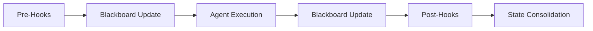

# Hooks System Documentation (V3.0)

## Overview

**Hooks** are deterministic Python functions executed by the `GraphEngine` at specific points in a step's lifecycle. They provide a mechanism for:

1.  **Input Pre-processing (Pre-hooks)**: executed before the Agent's LLM call.
2.  **Output Post-processing (Post-hooks)**: executed after the Agent's handler returns.
3.  **Deterministic Logic**: Pure code execution without LLM variance.
4.  **External Integrations**: Google Search, Database Archival, etc.



> [!IMPORTANT]
> **Schema-First**: All hooks must output strict **Pydantic Models** defined in `backend/models/domain.py`. Loose dictionaries (`aux_data`) are deprecated for new hooks.

---

## Architecture

### 1. Blackboard Pattern (`context_variables`)

Hooks interact with the `WorkflowState` primarily through `context_variables`. This acts as a shared blackboard where different agents and hooks can read/write typed data.

*   **Read**: Hooks read input data from `state.context_variables`.
*   **Write**: Hooks return a **new** state with updated `context_variables` containing their Pydantic result model.
*   **Immutability**: `WorkflowState` is frozen. Hooks use `state.model_copy(update=...)` to modify data.

### 2. Strict Pydantic Models

Every hook typically has a corresponding result model in `backend/models/domain.py`:

| Hook | Result Model | Description |
| :--- | :--- | :--- |
| `sanitize_text` | `SanitizationResult` | Redacted inputs & threat logs |
| `detect_performative_patterns` | `LinguisticsResult` | Detected "AI-ese" patterns |
| `execute_google_search` | `SearchResult` | Structured search items |
| `verify_structure` | `ValidationResult` | Pass/Fail status & errors |
| `apply_scoring_logic` | `ScoringResult` | Calculated totals & penalties |
| `generate_report` | `ReportResult` | Final Markdown & metadata |
| `calculate_text_metrics` | `TextMetrics` | Word count & control ratio |

### 3. Zero-Fallback Principle

Hooks do **not** fail silently.
*   If a dependency (like `repository`) is missing, they log an error and return an explicit Error state or raise an exception (if critical).
*   They do NOT return "default strings" or empty dicts that could confuse downstream agents.

---

## Hook Reference

### 1. Security Hooks (`backend/hooks/security.py`)

#### `sanitize_text_hook` (Pre-hook)
*   **Action**: Scans inputs for PII (SSN, Phone, Email).
*   **Output**: `SanitizationResult` (contains `sanitized_inputs` dict).

#### `check_banned_phrases_hook` (Pre-hook)
*   **Action**: Fetches banned phrases from DB and blocks execution if found.
*   **Behavior**: Raises `ValueError` explicitly if a banned phrase is found.

### 2. Metrics Hooks (`backend/hooks/metrics.py`)

#### `calculate_text_metrics_hook` (Pre-hook)
*   **Action**: Calculates `word_count`, `lexical_diversity`, etc.
*   **Output**: `TextMetrics` model.

### 3. Validation Hooks (`backend/hooks/validation.py`)

#### `verify_structure` (Pre-hook)
*   **Action**: Enforces minimum content length.
*   **Output**: `ValidationResult`. Raises `ValueError` if `is_valid=False`.

### 4. Search Hooks (`backend/hooks/search.py`)

#### `execute_google_search` (Post-hook for Analyst)
*   **Action**: Executes Google Custom Search based on Analyst hypotheses.
*   **Output**: `SearchResult` containing list of `SearchResultItem`.

### 5. Scoring Hooks (`backend/hooks/scoring.py`)

#### `apply_scoring_logic` (Post-hook)
*   **Action**: Aggregates scores from all judges and applies deterministic penalties (Security/Logic).
*   **Output**: `ScoringResult`. **Overwrites** `JudgeOutput` with authoritative scores.

#### `enforce_passivity_penalty` (Post-hook)
*   **Action**: Caps scores if `input_control_ratio` indicates passivity.
*   **Implementation**: Uses `model_copy` to safely update frozen `JudgeOutput` models.

### 6. Reporting Hooks (`backend/hooks/reporting.py`)

#### `generate_report` (Post-hook)
*   **Action**: Renders the final PDF/Markdown report using Jinja2.
*   **Input**: Aggregates `TextMetrics`, `ScoringResult`, and Agent outputs.
*   **Output**: `ReportResult` (wraps the generated Markdown).

### 7. Integrity Hooks (`backend/hooks/integrity.py`)

#### `verify_citation_integrity` (Post-hook)
*   **Action**: Verifies that quotes used by Analyst, Critics, and Judges exist in the source text.
*   **Fail Fast**: Raises `AppException` if hallucination rate > 50% (Score < 0.5).
*   **Output**: `CitationAudit` (logged in metadata).

#### `enforce_hypothesis_linking` (Post-hook)
*   **Action**: Ensures Analyst Hypotheses have sequential IDs (HYP-1, HYP-2...).
*   **Fail Fast**: Raises `ValueError` on ID sequence gaps or format errors.

---

## Developer Guide: Creating a New Hook

1.  **Define Model**: Create a result model in `backend/models/domain.py`.
    ```python
    class MyHookResult(BaseModel):
        value: int
        model_config = ConfigDict(frozen=True)
    ```
2.  **Implement Hook**: Create function in `backend/hooks/`.
    ```python
    def my_hook(state: WorkflowState) -> WorkflowState:
        result = MyHookResult(value=100)
        new_context = state.context_variables.copy()
        new_context["my_hook_result"] = result
        return state.model_copy(update={"context_variables": new_context})
    ```
3.  **Register**: Add to `HOOK_MAPPING` in `backend/core/engine.py`.
4.  **Configure**: Add to `seed_data.json` workflow config.
