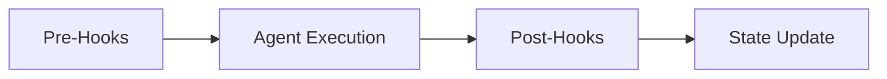

# Hooks System Documentation (V2.9)

## Overview

**Hooks** are deterministic Python functions executed by the `GraphEngine` at specific points in a step's lifecycle. They provide a mechanism for:

1.  **Input Pre-processing (Pre-hooks)**: executed before the Agent's LLM call.
2.  **Output Post-processing (Post-hooks)**: executed after the Agent's handler returns.
3.  **Deterministic Logic**: Pure code execution without LLM variance.
4.  **External Integrations**: Google Search, Database Archival, etc.



> [!IMPORTANT]
> **Single Mechanism**: Hooks are **only** executed via the `HOOK_MAPPING` registry. Class-based hook methods have been deprecated and removed.

---

## Architecture

### Hook Registry (`HOOK_MAPPING`)

All hooks are registered centrally in `backend/core/engine.py`. This is the **Single Source of Truth**.

```python
# backend/core/engine.py
HOOK_MAPPING = {
    "generate_report": ("backend.hooks.reporting", "generate_report"),
    "verify_structure": ("backend.hooks.validation", "verify_structure"),
    "execute_google_search": ("backend.hooks.search", "execute_google_search"),
    "sanitize_text": ("backend.hooks.security", "sanitize_text_hook"),
    "check_banned_phrases": ("backend.hooks.security", "check_banned_phrases_hook"),
    "generate_bibliography": ("backend.hooks.references", "generate_bibliography_hook"),
    # ...
}
```

### Configuration (`seed_data.json`)

Hooks are activated per-step in the `config` field of `seed_data.json`.

```json
{
    "id": "step_judge",
    "task_key": "judge",
    "config": {
        "pre_hooks": [],
        "post_hooks": ["apply_scoring_logic"]
    }
}
```

---

## Hook Reference

### 1. Security Hooks (`backend/hooks/security.py`)

#### `sanitize_text` (Pre-hook)
*   **Agent**: Guard
*   **Action**: Scans `history_text`, `product_text`, and `reflection_text` for PII (Emails, Finnish SSNs, Phone Numbers, IP Addresses).
*   **Output**: 
    *   Redacts PII in `aux_data["sanitized_inputs"]`.
    *   Logs detected threats in `aux_data["pii_threats_detected"]`.

#### `check_banned_phrases` (Pre-hook)
*   **Agent**: Guard
*   **Action**: Fetches banned phrases from the database (via `repository`) and scans inputs.
*   **Behavior**:
    *   **Zero-Fallback**: Requires `repository` injection. Falls back to empty list if missing (logs error).
    *   **Blocking**: Raises `SecurityViolationError` if a banned phrase is detected.

### 2. Metrics Hooks (`backend/hooks/metrics.py`)

#### `calculate_text_metrics` (Pre-hook)
*   **Agent**: Profiler
*   **Action**: Calculates objective metrics (Word Count, Lexical Diversity, etc.).
*   **Output**: Writes a `TextMetrics` object to the strict field `state.audit_metrics`.

#### `calculate_control_ratio` (Pre-hook)
*   **Agent**: Interaction
*   **Action**: Calculates the ratio of Human vs. AI characters in the conversation history.
*   **Output**: Writes a float (0.0 - 1.0) to `state.input_control_ratio`.

### 3. Validation Hooks (`backend/hooks/validation.py`)

#### `verify_structure` (Pre-hook)
*   **Agent**: Analyst
*   **Action**: Enforces minimum content length (100 chars) for inputs.
*   **Behavior**: **Blocking**. Raises `ValueError` if inputs are too short, preventing wasted LLM calls.

### 4. Linguistics Hooks (`backend/hooks/linguistics.py`)

#### `detect_performative_patterns` (Pre-hook)
*   **Agent**: Detector
*   **Action**: Scans for "AI-ese" filler words (e.g., "delve into", "tapestry").
*   **Output**: Writes JSON list of matches to `aux_data["performative_patterns_detected"]`.

### 5. Search Hooks (`backend/hooks/search.py`)

#### `execute_google_search` (Pre-hook)
*   **Implementation**: Delegates to `backend/hooks/search_client.py` (`GoogleSearchTool`) for robust API interaction and error handling.
*   **Agent**: Overseer
*   **Action**: Executes Google Custom Search queries based on hypotheses from the Analyst agent.
*   **Output**: Writes search results JSON to `aux_data["google_search_results"]`.

### 6. Archival Hooks (`backend/hooks/archival.py`)

#### `retrieve_precedent` (Pre-hook)
*   **Agent**: Archivist
*   **Action**: Retrieves the last 3-5 completed executions from the database to provide "Case Law" context.
*   **Requirement**: Requires `repository` injection.
*   **Output**: Writes summary text to `aux_data["archivist_precedents"]`.

### 7. Scoring Hooks (`backend/hooks/scoring.py`)

#### `apply_scoring_logic` (Post-hook)
*   **Agent**: Judge
*   **Action**: Applies deterministic penalties and calculates averages.
    *   **Security Threat**: Caps all scores at 1.
    *   **Logical Fallacy**: Caps scores at 2 (if > 2).
*   **Output**: Updates `aux_data` with `score_summary`, `calculated_average`, and `penalties_applied`.

### 8. Reporting Hooks (`backend/hooks/reporting.py`)

#### `generate_report` (Post-hook)
*   **Agent**: XAI Reporter
*   **Action**: Aggregates all results, generates comparison matrices (for Dual Execution), and renders the final Markdown report using `report_template.jinja2`.
*   **Output**: Hoists result to `state.xai_report_formatted`.

### 9. Reference Hooks (`backend/hooks/references.py`)

#### `generate_bibliography_hook` (Pre/Post-hook)
*   **Agent**: Coach (or any requiring citations)
*   **Action**: Scans combined input text and Coach output for specific citations (e.g., "Kahneman 2011") using the `ReferenceManager`.
*   **Behavior**: Matches citations against the `StepContext`'s knowledge base.
*   **Output**: Writes a sorted list of full bibliographic strings to `aux_data["bibliography"]`.

---

## Developer Guide: Creating a New Hook

1.  **Define the Function**: Create a python function in `backend/hooks/` that accepts `state: WorkflowState` and optionally `repository`.
    ```python
    def my_hook(state: WorkflowState) -> WorkflowState:
        state.aux_data["my_metric"] = 123
        return state
    ```
2.  **Register**: Add it to `HOOK_MAPPING` in `backend/core/engine.py`.
3.  **Configure**: Add the hook name to the `pre_hooks` or `post_hooks` list in `seed_data.json` for the desired step.
