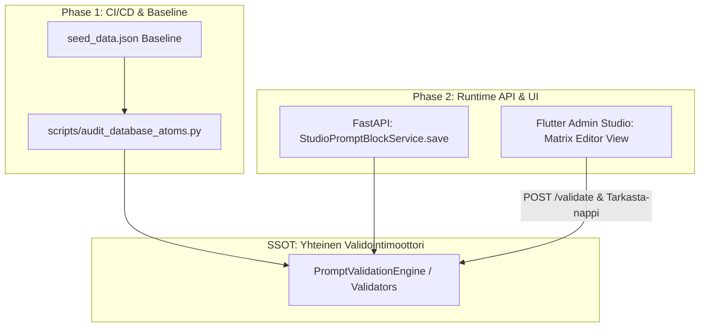

# FEATURE AUDIT: REST API -ohitus ja "Kognitiivisen Saastan" Paluu (The API Bypass Risk & Admin Studio UI Matrix Linter)

**Status:** AUDITED & ARCHITECTURALLY RESOLVED  
**Audit Tier:** Tier 8 (System 2 Proposed Feature Analysis)  
**Target Proposal:** REST API -ohitusriskin torjuminen ja "Tarkasta matriisi" -linterin/napin lisääminen Admin Studioon.  
**Evaluated Context:** `IMPLEMENTATION_PLAN_Full_Database_Verification_Engine.md` vs. Tuleva Admin Studio -jatkosuunnitelma.

---

## 1. Yhteenveto & Pääarkkitehdin Tuomio (Executive Verdict)

### Kysymys:
> *"Olisiko tämä vasta seuraavan plänin aihe, missä `IMPLEMENTATION_PLAN_Full_Database_Verification_Engine.md` tekemisestä tehdään "tarkasta" nappi käyttöliittymään matriiseille?"*

### Arkkitehtoninen Päätös:
**KYLLÄ, EHDOTTOMASTI.** Tehtävän jakaminen kahteen erilliseen, toisiaan seuraavaan vaiheeseen on arkkitehtonisesti **välttämätöntä ja ainoa kestävä ratkaisu**. 

Syyt tähän ovat:
1. **Skooppiräjähdyksen ja God-Planin esto:** Nykyinen `IMPLEMENTATION_PLAN_Full_Database_Verification_Engine.md` on massiivinen, 152 atomia ja 13 matriisia käsittelevä kanta- ja kehotekerroksen kovennus. Sen sekoittaminen Flutter-käyttöliittymään (`client_app_v2`), SDUI-malleihin ja Admin Studio REST API -palveluun rikkoo SRP-periaatetta (Single Responsibility Principle) ja räjäyttää muutosriskin (Blast Radius).
2. **Kaksivaiheinen arkkitehtoninen elinkaari (Two-Phase SSOT Hardening):**
   - **Vaihe 1 (Nykyinen pläni):** *Kultaisen kannan sanitointi & CI/CD-portti.* Luodaan `scripts/audit_database_atoms.py`, puhdistetaan `seed_data.json`, lukitaan `matrix_evaluation.py` ja todistetaan tilastollinen varianssin poistuminen E2E-testeillä.
   - **Vaihe 2 (Seuraava pläni / Epic):** *Admin Studio Live Prompt Firewall & UI Diagnostics.* Kapseloidaan Vaiheessa 1 luodut säännöt jaettuun `PromptValidationEngine` -palveluun, integroidaan se suoraan `StudioPromptBlockService.save_prompt_block()` -metodiin (REST API 422 -sulku) ja lisätään Flutter Admin Studioon reaaliaikainen "Tarkasta matriisi" -painike ja virhediagnostiikkapaneeli.

---

## 2. Juurisyyanalyysi & Ensimmäiset Periaatteet (Root Cause & First Principles)

### 2.1 Miksi API-ohitus on aito arkkitehtoninen riski?
Jos validointi elää *vain* CI/CD-skriptissä (`scripts/audit_database_atoms.py`), syntyy **Episteeminen Paluuvuoto (Cognitive Regression)**:
- CI/CD tarkastaa vain Git-versionhallintaan tallennetun `seed_data.json` -tiedoston.
- Tuotantoympäristössä tai paikallisessa kehitysympäristössä loppukäyttäjä (Admin Studio -käyttäjä) voi kutsua `PUT /api/v2/studio/prompt-blocks/{id}` ja tallentaa takaisin kantaan:
  - Tyhjiä sääntöjä (`extraction_rule: ""`).
  - Raakaa XML:ää (`<ambiguity_protocol>`).
  - Kiellettyjä komentoja (`FAIL FAST`, `BANNED SOURCES`).
  - Chattiin sidottua kovakoodausta (`Scan ONLY user prompts`).
- Seuraavassa ajossa LLM kokee jälleen **Split-Brain** -tilan, vaikka CI/CD oli vihreä koodin julkaisuhetkellä.

### 2.2 Oikea Arkkitehtoninen Sijoitus (Architectural Placement)
Logiikka ei saa olla hajautettuna erilliseen UI-nappiin eikä pelkkään erillisskriptiin:

---

## 3. Asiantuntijaraadin Auditointi (Panel of Experts)

### 3.1 Backend & Typing Architect
- **Risk:** Jos sääntöjä kovakoodataan suoraan `TDAAssertion` Pydantic-malliin (`@field_validator`), olemassa oleva kanta voi hajota käynnistyksen yhteydessä (`ValidationError`), jos jokin historiallinen atomi ei vielä täytä sääntöjä.
- **Solution:** 
  1. Vaiheessa 1 säännöt ajetaan `audit_database_atoms.py` -skriptinä ja sanitoidaan `seed_data.json`.
  2. Vaiheessa 2 validointi kytketään `StudioPromptBlockService.save_prompt_block()` -metodiin: uusi tai päivitetty atomi ei voi mennä kantaan läpi ilman puhdasta validointitodistusta (HTTP 422 `VALIDATION_FAILED`).

### 3.2 LLM & Context Architect
- **Risk:** Loppukäyttäjät yrittävät luonnostaan "ohjata" kielimallia kirjoittamalla imperatiiveja (`"LOCATE..."`, `"Do not evaluate..."`) tai suoria kehotemuuttujia (`"user prompt"`).
- **Solution:** Admin Studio tarvitsee interaktiivisen, kognitiivisen esitarkastusraportin (UI Linter). UI:n "Tarkasta" -painike antaa käyttäjälle välittömän palautteen ennen tallennusta: *"Sääntö sisältää kiellettyä raakaa XML-koodia tai negatiivisia kieltoja. Muotoile ontologiana ja heuristiikkana."*

### 3.3 SDUI & Frontend Architect
- **Risk:** Jos Flutter-sovellukseen lisätään "Tarkasta" -nappi ilman taustajärjestelmän standardoitua diagnostiikka-DTO:ta (`ValidationIssueDTO`), UI joutuu parsimaan tekstimuotoisia virheilmoituksia.
- **Solution:** Luodaan Phase 2:ssa tyypitetty `PromptBlockValidationResponseDTO` (sis. lista `AuditIssue` -olioita kenttäpolkuineen ja korjausehdotuksineen), jota Flutter-puolen `PromptBlockBuilderView` käyttää näyttääkseen punaiset/keltaiset huomiomerkit suoraan kyseisen atomin syöttökentän kohdalla.

---

## 4. Anti-Happy-Path & Falsifikaatio (Failure Modes)

| Vikatila (Failure Mode) | Todennäköisyys | Vaikutus | Torjuntamekanismi |
| :--- | :--- | :--- | :--- |
| **1. UI Bypass via Direct REST PUT** | Korkea | Korkea: Kanta saastuu uudelleen ohi UI:n kautta tehtyjen tarkastusten (esim. Postman / Script). | `StudioPromptBlockService.save_prompt_block` ajaa validointimoottorin aina ennen tallennusta. |
| **2. False Positive Block on Valid Complex Prompts** | Keskitaso | Keskitaso: Käyttäjä ei voi tallentaa laillista sääntöä, jos linterin regex-säännöt ovat liian jäykkiä. | Deterministiset virhekategoriat (ERROR estää tallennuksen, WARNING antaa ohjeen). |
| **3. Monoliittisen suunnitelman kaatuminen (Scope Creep)** | Erittäin korkea (jos yhdistetään) | Kriittinen: 152 atomin korjaus pysähtyy Flutter-käännösvirheisiin tai DTO-synkronointiin. | Erotetaan tiukasti Phase 1 (Database & Engine) ja Phase 2 (Studio REST & UI). |

---

## 5. Tri-Axis Dialectical Audit (Syyttäjä, Puolustus, Realisti)

- **⚖️ Syyttäjä (Ylisuunnittelun karsinta):** "Emme tarvitse massiivista monimutkaista validointikehystä. Pydantic-mallit ja yksi palvelukutsu riittävät."
- **🛡️ Puolustus (Fail-Fast & Arkkitehtuurin puhtaus):** "Ilman REST API -tason porttia `scripts/audit_database_atoms.py` on vain toiveajattelua. Jokainen tallennus on validoitava rajapinnassa."
- **🔭 Realisti (Käytännön toteutusjärjestys):** "Suoritetaan ensin `IMPLEMENTATION_PLAN_Full_Database_Verification_Engine.md` (kannan siivous + skripti + E2E-testit). Sen jälkeen luodaan suoraan jatko-Epic/Plan, joka nostaa skriptin validointiytimen jaetuksi palveluksi ja kytkee sen Admin Studioon."

---

## 6. 5-Column Architectural Directives

| 1. Kohdealue & Skoopit (Target Scope) | 2. 🚫 KIELLETTY PURKKA (Eradicated Duct-Tape) | 3. 🎯 TEE NÄIN (Approved Best Practice) | 4. ✂️ KARSITTU YLISUUNNITTELU (Pruned Over-Engineering) | 5. 🔒 VERIFIOINTI & FAIL-FAST (Proof Anchor) |
| :--- | :--- | :--- | :--- | :--- |
| **Vaiheistus & Suunnitelmarajat** `IMPLEMENTATION_PLAN_...Engine.md` | UI-komponenttien, Flutter-koodin ja REST API -muutosten ahtaminen samaan pläniin 152 atomin siivouksen kanssa. | Pidetään nykyinen pläni 100 % puhtaana taustajärjestelmän / kannan sanitointina. Luodaan heti perään jatkosuunnitelma Studio API:lle ja UI:lle. | Ei luoda väliaikaisia puolittaisia UI-nappeja nykyiseen pläniin. | `backend_audit_loop.py` ja `run_e2e_variance_test.py` menevät läpi puhtaasti ilman UI-riippuvuuksia. |
| **REST API -tallennussuoja (Phase 2)** `StudioPromptBlockService` | Oletus, että käyttäjä ei syötä saastaa REST API:n läpi; validointilogiikan kopiointi kahteen paikkaan. | Eristetään validointisäännöt uudelleenkäytettäväksi `PromptValidationEngine` -moduuliksi, jota `save_prompt_block` kutsuu suoraan. | Ei monimutkaisia middleware-virityksiä; selkeä domain-tarkastus palvelukerroksessa. | Yksikkötesti `test_save_prompt_block_rejects_banned_xml_and_commands` palauttaa HTTP 422 / `AppException`. |
| **Admin Studio UI Linter (Phase 2)** `MatrixEditorView` / `PromptBlockBuilderView` | Käyttäjälle näkymätön kaatuminen tallennuksessa ilman selkeitä kenttäkohtaisia virheilmoituksia. | Lisätään "Tarkasta matriisi" -painike, joka kutsuu `POST /prompt-blocks/{id}/validate` ja korostaa virheelliset atomit punaisella. | Ei rakenneta erillistä monimutkaista kielimallipohjaista esitarkastajaa; nopea deterministinen sääntötarkastus riittää. | Flutter-yksikkötestit `testWidgets('validates matrix and highlights broken atoms')`. |

---

## 7. Suositeltu Etenemisjärjestys (Actionable Next Steps)

1. **VAIHE 1 (NYKYINEN):**
   - Hyväksy ja toteuta `IMPLEMENTATION_PLAN_Full_Database_Verification_Engine.md` (`/tier2-execute`).
   - Lopputulos: `seed_data.json` on 100 % puhdas, `scripts/audit_database_atoms.py` toimii CI/CD-porttina, ja varianssitestit todistavat $\kappa > 0.85$ ja yli 92 % itse-konsistenssin.
2. **VAIHE 2 (VÄLITTÖMÄSTI SEURAAVA):**
   - Luodaan uusi suunnitelma: `/tier0-create-plan "Admin Studio Real-Time Matrix Validation & UI Diagnostics Gate"`.
   - Toteutetaan:
     - `PromptValidationEngine` (skriptin ja API:n yhteinen SSOT).
     - `StudioPromptBlockService.save_prompt_block` -validointiportti (API-ohituksen esto).
     - `POST /api/v2/studio/prompt-blocks/validate` -endpoint.
     - Flutter UI: "Tarkasta matriisi" -painike ja visuaaliset virhekorostukset `MatrixEditorView` -näkymään.
