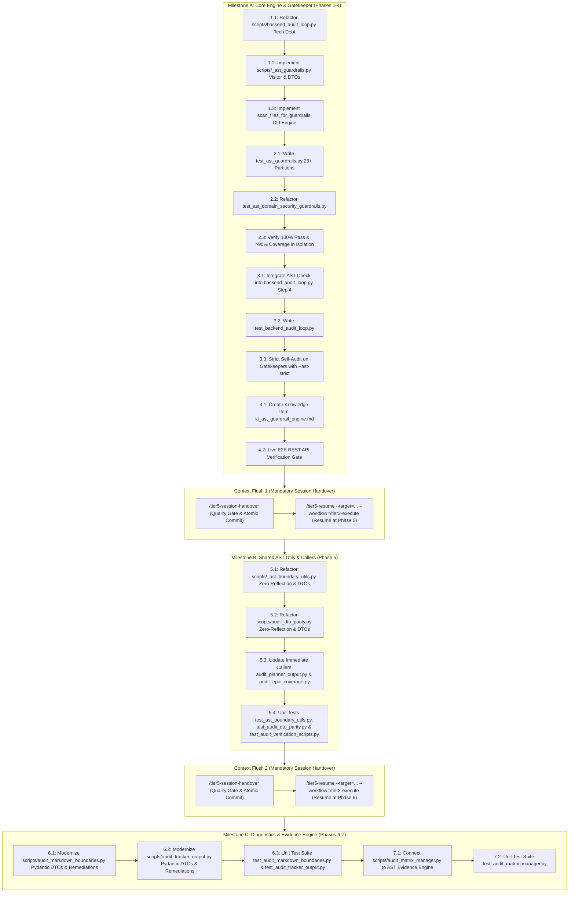

> **STATUS: PENDING / ODOTTAA TOTEUTUSTA (Quality Gate Hardening)**

# Automated AST Codebase Guardrails & Workflow Scripts Modernization (`.get()`, `getattr()`, Silent `except Exception` Prevention, and Neuro-Symbolic Gate Standardization)

> **SSOT Implementation Plan — Generated from Tier 8 Feature Audits `feature_audit_ast_guardrail_scripts.md`, `feature_audit_hypocritical_gatekeeper_tech_debt.md`, `feature_audit_ast_syntax_error_resilience.md`, `feature_audit_ast_guardrails_e2e_verification_gate.md`, `feature_audit_guardrail_violation_pydantic_strictness.md`, `feature_audit_ast_self_scanning_paradox.md`, `feature_audit_ast_guardrail_tdd_phasing.md`, `feature_audit_workflow_scripts_ast_evolution.md`, `feature_audit_ast_tokenizer_recursion_resilience.md`, `feature_audit_recursive_testing_paradox.md`, `feature_audit_ast_temporal_coupling_phase5_phase6.md`, `feature_audit_ast_guardrails_context_amnesia.md`, and `feature_audit_target_filepath_syntax_standardization.md`.**  
> **Epic**: Automated Architectural Quality Gate Hardening & Workflow Scripts Modernization

<required_context_rules>
  <rule>@[.agents/rules/00-antigravity-core.md]</rule>
  <rule>@[.agents/rules/01-python-backend.md]</rule>
  <rule>@[.agents/rules/04_directory_reference.md]</rule>
  <knowledge_item>@[ki_ast_guardrail_testing.md]</knowledge_item>
  <knowledge_item>@[ki_ast_guardrail_engine.md]</knowledge_item>
  <knowledge_item>@[ki_python_314_concurrency_strictness.md]</knowledge_item>
  <knowledge_item>@[ki_god_code_prevention.md]</knowledge_item>
  <knowledge_item>@[ki_global_config_sovereignty.md]</knowledge_item>
</required_context_rules>

<anti_targets>
- Do NOT use regex or string matching (`str.find`) for code AST validation (`no_string_matching_in_ast`).
- Do NOT allow false positives on string literals (`label = "getattr"`), comments, docstrings, or test assertions.
- Do NOT allow unhandled `SyntaxError`, `IndentationError`, `tokenize.TokenError`, or `RecursionError` crashes during `ast.parse()`, `tokenize.tokenize()`, or `visitor.visit()` to tear down the scanner process or sidetrack remaining files (`syntax_error_resilience_mandate`).
- Do NOT swallow scanner exceptions or return empty dictionaries/lists (`{}` / `[]`) upon `SyntaxError`, `tokenize.TokenError`, or `UnicodeDecodeError` (`the_duct_tape_ban`).
- Do NOT introduce duck-typing (`getattr`/`hasattr`/`isinstance(dict)`) or fallback dictionaries `{}` inside any guardrail or audit script.
- Do NOT use reflection (`getattr`/`hasattr`) inside `scripts/_ast_guardrails.py` or `scripts/_ast_boundary_utils.py` to inspect AST nodes; enforce strict structural pattern matching (`match/case`) or `isinstance()` type narrowing (`zero_reflection_in_ast_scanner_mandate`).
- Do NOT use `# noqa: QGR001` or any suppression comments in `scripts/_ast_guardrails.py` itself; the guardrail engine must achieve 100% self-compliance with 0 violations and 0 suppressions.
- Do NOT integrate the AST scanner into `backend_audit_loop.py` before unit tests (`test_ast_guardrails.py`) verify the scanner in complete isolation (`tdd_mandate`).
- Do NOT execute unmocked `subprocess.run()` or `sys.exit()` calls in unit tests targeting `backend_audit_loop.py`; all unit tests MUST enforce hermetic mocking via `@patch('subprocess.run')` and `@patch('sys.exit')` to prevent the Recursive Testing Paradox (Fork Bomb / CI Deadlock risk and premature runner termination) (`hermetic_subprocess_mocking_mandate`).
- Do NOT hardcode file lists; scanners MUST dynamically accept target files or directories passed via CLI arguments.
- Do NOT add new quality gate stages to `backend_audit_loop.py` without first eradicating all existing technical debt within `backend_audit_loop.py` (`touched_scope_tech_debt_mandate`).
- Do NOT introduce a new Single Source of Truth (`_ast_guardrails.py`) without creating its corresponding Knowledge Item (`ki_ast_guardrail_engine.md`) per architectural governance.
- Do NOT implement automated code rewriting or auto-fix (`--fix`) functionality in `scripts/_ast_guardrails.py`; the scanner must strictly act as an auditor and gatekeeper to prevent destructive, unverified automated codemods (`no_blind_codemods_mandate`).
- Do NOT convert lightweight workflow utilities into bloated multi-layer framework libraries; maintain sub-100ms startup execution speed using Python standard library and Pydantic V2.
- Do NOT leave shared utility callers (`scripts/audit_planner_output.py`, `scripts/audit_epic_coverage.py`) unmigrated across phase boundaries when `scripts/_ast_boundary_utils.py` is refactored to Pydantic DTOs, causing temporal coupling and broken quality gates (`atomic_phase_consolidation_mandate`).
- Do NOT attempt to execute all 7 phases / 19 files in a single monolithic execution session without executing mandatory `/tier5-session-handover` and `/tier5-resume` context flush checkpoints between Milestones, preventing Context Window Saturation, rule degradation, and truncated AST visitors (`context_amnesia_prevention_mandate`).
- Do NOT use bare file paths without `@[...]` formatting in target lists, `<step target="...">` attributes, or `<required_context_rules>` (`universal_file_path_syntax_mandate`).
- Do NOT use `@[...]` formatting inside executable shell code blocks (PowerShell/Bash in `## Verification Plan`), preventing PowerShell parser errors (`powershell_cli_syntax_mandate`).
</anti_targets>

## Problem Statement

Standard Python tooling (`ruff` and `mypy --strict`) cannot enforce domain-level architectural rules in Quorum:
1. `getattr(obj, "field", None)` and `hasattr(obj, "field")` are legal Python syntax; `mypy` and `ruff` allow them without warnings.
2. `dict.get(key, default)` is a standard library dictionary method; linter tools cannot distinguish between unvalidated raw external payloads and domain state that must be strict Pydantic models.
3. Silent exception swallowing (`except Exception: pass` or `except Exception: return {}`) is allowed by linters if accompanied by comments or simple log lines, violating `the_duct_tape_ban` and Fail-Fast principles.
4. **Chameleon / Pseudo-Class Metaprogramming**: Overriding `__new__` on `BaseModel` classes or overriding `model_construct` with `# type: ignore[override]` to fake union behavior bypasses Rust `pydantic-core` validation, breaks MyPy/LSP attribute resolution, and introduces unvalidated silent fallbacks.
5. **Raw String Discriminator Routing**: Checking `block.category_id == "matrix"` or `category_id == "system_rule"` with raw string literals instead of strict `PromptBlockCategory` Enum members bypasses type safety and creates silent prompt compilation fractures.
6. **"Hypocritical Gatekeeper" Policy Violation (`touched_scope_tech_debt_mandate`)**: The gatekeeper file `scripts/backend_audit_loop.py` itself contains reflection duck-typing (`hasattr(sys.stdout, "reconfigure")`), silent exception swallowing (`except Exception: pass`), non-fail-fast template reading (`except Exception as e:` in Jinja scanning loop), non-English docstrings/prints, and outdated 30% coverage comments. Under the Scoped Boy Scout mandate, touching `backend_audit_loop.py` strictly requires eradicating this technical debt in Phase 1 before integrating new quality gate steps.
7. **Tokenizer, SyntaxError, and AST Traversal Crash Risk (Resilience Hole)**: Calling `ast.parse()` without localized error wrapping crashes the entire scanning process if a file contains a syntax error (specifically unclosed parentheses, unexpected EOF, or indentation mismatches). Furthermore, extracting `# noqa: QGRxxx` inline comment suppressions requires Python's `tokenize.tokenize()` which expects a binary byte stream (`io.BytesIO(source_bytes).readline`) and raises `tokenize.TokenError` or `IndentationError` on malformed code (specifically unclosed multi-line strings `"""` or unbalanced brackets). Additionally, traversing complex or deeply nested AST structures with `ast.NodeVisitor` can trigger `RecursionError`. Without complete per-file fault domain isolation catching `(SyntaxError, IndentationError, TabError, tokenize.TokenError, OSError, UnicodeDecodeError, RecursionError)`, a single broken file crashes the global gatekeeper script and halts scanning of remaining files.
8. **The Self-Scanning Paradox & Developer Trap**: Python's `ast.NodeVisitor` uses `getattr()` internally in `stdlib/ast.py`. While static `ast.parse()` only inspects the target file's physical source and does not evaluate standard library code, developers implementing AST visitors almost universally fall into the anti-pattern of using `getattr(node.func, "id", "")` or `hasattr(node, "attr")` to inspect polymorphic AST nodes. If `scripts/_ast_guardrails.py` or `scripts/_ast_boundary_utils.py` uses naive reflection, it will fail `QGR001` during `--ast-strict` self-auditing. The scanners must enforce pure structural pattern matching (`match/case`) and `isinstance()` type narrowing with zero reflection.
9. **The Recursive Testing Paradox & CI Deadlock Risk (Fork Bomb)**: `scripts/backend_audit_loop.py` executes external toolchains via `subprocess.run()`, including `pytest backend_v2/tests/... --cov`. If unit tests for `backend_audit_loop.py` (`test_backend_audit_loop.py`) invoke `backend_audit_loop.main()` or `run_tests_with_strict_coverage()` without hermetic mocking of `subprocess.run`, running `pytest` will recursively execute `test_backend_audit_loop.py`, spawning an infinite subprocess chain (Fork Bomb) that deadlocks CI/CD runners and crashes the OS process table. Additionally, unmocked `sys.exit()` calls prematurely abort the entire parent test runner. Hermetic isolation with `@patch('subprocess.run')` and `@patch('sys.exit')` is mathematically mandatory.
10. **Workflow Scripts Temporal Coupling & Interface Fracture Risk**: Refactoring `scripts/_ast_boundary_utils.py` to return Pydantic V2 DTOs (`TargetFileReferenceDTO`) in Phase 5 without simultaneously updating its direct callers (`scripts/audit_planner_output.py`, `scripts/audit_epic_coverage.py`) and existing test suite (`test_audit_verification_scripts.py`) breaks the CI/CD quality gate immediately after Phase 5 with `TypeError` / `AttributeError`. To uphold the `atomic_checkpoint_mandate`, Phase 5 must consolidate the utility refactor with its direct callers, leaving Phase 6 dedicated to independent diagnostic tools (`audit_markdown_boundaries.py`, `audit_tracker_output.py`).
11. **TDD Phasing Risk & 5-Tier Regression Defense Inversion**: Integrating an unverified AST scanner directly into `scripts/backend_audit_loop.py` before unit tests are written violates TDD (`tdd_mandate`). If the scanner encounters an unhandled AST node, it breaks the global gatekeeper, preventing developers and agents from executing test runs across the codebase. Unit testing must strictly precede gatekeeper integration.
12. **Context Window Saturation & Execution Fatigue Risk (Context Amnesia)**: The implementation plan requires massive modifications across 19 distinct files and 7 heavy phases. Attempting to execute this full plan in a single monolithic session will inevitably saturate the LLM context window (200k+ tokens of AST node trees, test outputs, and Pydantic schemas). Context saturation degrades attention across core rules (causing accidental use of `getattr()`, lazy dictionaries, or incomplete AST visitors). To prevent Context Amnesia, the execution protocol MUST be partitioned into 3 distinct Milestones separated by mandatory `/tier5-session-handover` and `/tier5-resume` Context Flush checkpoints (`context_amnesia_prevention_mandate`).
13. **Target Filepath Syntax & Context Anchor Fracture Risk**: Historically, implementation plans declared target files in `<step target="path">` as bare strings without `@[...]` formatting. This creates a dual vulnerability: 1) Downstream agents (Tier 2 Execute, Tier 5 Resume) fail to treat bare string attributes as active context anchors, leading to Context Amnesia, and 2) Static boundary checkers (`scripts/audit_markdown_boundaries.py`) search exclusively for `@\[([^#\]]+)\]`, skipping unanchored step targets and failing to validate physical file existence or AST symbol boundaries. Furthermore, any naive global replacement that injects `@[...]` into PowerShell code blocks causes immediate `ParserError` crashes during automated execution.

### Codebase Blast Radius Audit (Day-One Reality)

Physical scanning of `backend_v2/` reveals **~442 pre-existing legacy violations**:
- `getattr()` / `hasattr()` calls: **160** (65 in `provider.py` alone for LiteLLM dynamic exception introspection)
- 2-arg `.get(key, default)` calls in domain logic: **112** (including valid Enum map lookups in `enums.py`)
- Broad `except Exception:` handlers: **~170** (including valid Circuit Breaker, Worker DLQ, and Archival boundaries)
- `__new__` / `model_construct` hijacking on BaseModel: **0** (fully cleaned)

> [!CAUTION]
> **The Scope Creep Bomb**: Activating a rigid, fatal AST check across all legacy files without phased rollout or suppression mechanisms would immediately brick development velocity — any 3-line bug fix would be blocked by 15+ pre-existing legacy violations.

---

## Architecture Decision: Seven-Phase Architectural Lifecycle with 3 Context-Isolated Milestones

> [!IMPORTANT]
> **Seven-Phase Architectural Lifecycle with Context-Flush Milestones**:
> 
> ### Milestone A: Core Engine & Gatekeeper (Phases 1–4)
> 1. **Phase 1**: Pre-requisite Refactoring of `scripts/backend_audit_loop.py` (Scoped Boy Scout Rule) followed by Core AST Guardrail Engine implementation in `scripts/_ast_guardrails.py` with Zero-Reflection Structural Pattern Matching, Binary Byte Stream Tokenization (`io.BytesIO`), and Complete Fault Domain Isolation (`SyntaxError`, `tokenize.TokenError`, `RecursionError`).
> 2. **Phase 2**: ISTQB Unit Testing and Isolated Scanner Verification (TDD First) in `backend_v2/tests/unit/scripts/test_ast_guardrails.py` and refactoring of `test_ast_domain_security_guardrails.py` with 100% pass rate and >90% coverage in isolation.
> 3. **Phase 3**: Quality Gate Integration in `scripts/backend_audit_loop.py`, CLI integration testing in `backend_v2/tests/unit/scripts/test_backend_audit_loop.py`, and Strict Self-Audit on gatekeeper scripts with `--ast-strict`.
> 4. **Phase 4**: Architectural Knowledge Item Documentation in `ki_ast_guardrail_engine.md` and Final Live E2E REST API Verification Gate.
> - **Checkpoint 1 (Context Flush)**: Mandatory `/tier5-session-handover` -> Atomic Commit -> `/tier5-resume --target="docs/implementationplans/IMPLEMENTATION_PLAN_AST_Codebase_Guardrails.md" --workflow="/tier2-execute" --rules="01-python-backend.md"` (Resuming at Phase 5).
> 
> ### Milestone B: Shared AST Utilities & Immediate Callers (Phase 5)
> 5. **Phase 5**: Shared AST Utilities, Immediate Workflow Consumers & DTO Parity Modernization (`scripts/_ast_boundary_utils.py`, `scripts/audit_dto_parity.py`, `scripts/audit_planner_output.py`, `scripts/audit_epic_coverage.py`) with zero reflection, atomic DTO migration, and unit testing in `backend_v2/tests/unit/scripts/test_ast_boundary_utils.py`, `test_audit_dto_parity.py`, and migrated `test_audit_verification_scripts.py`.
> - **Checkpoint 2 (Context Flush)**: Mandatory `/tier5-session-handover` -> Atomic Commit -> `/tier5-resume --target="docs/implementationplans/IMPLEMENTATION_PLAN_AST_Codebase_Guardrails.md" --workflow="/tier2-execute" --rules="01-python-backend.md"` (Resuming at Phase 6).
> 
> ### Milestone C: Diagnostics & Evidence Engine (Phases 6–7)
> 6. **Phase 6**: Standalone Workflow Diagnostics and Actionable Remediation Standardization (`scripts/audit_markdown_boundaries.py`, `scripts/audit_tracker_output.py`) with structured Pydantic V2 DTOs and unit tests in `backend_v2/tests/unit/scripts/test_audit_markdown_boundaries.py` and `test_audit_tracker_output.py`.
> 7. **Phase 7**: Neuro-Symbolic Matrix AST Evidence Engine Integration in `scripts/audit_matrix_manager.py` with unit tests in `backend_v2/tests/unit/scripts/test_audit_matrix_manager.py`.



---

## User Review Required

> [!IMPORTANT]
> **Inline Suppression Policy**: To maintain forensic audibility, inline suppression `# noqa: QGR001` and `# noqa: QGR003` is permitted ONLY for:
> 1. Dynamic third-party library introspection (specifically `litellm` exception routing, standard I/O stream reconfigurations).
> 2. System-boundary resilience handlers (Worker task supervision, Circuit Breaker classification) that log warnings and update status.
> Suppressions in core domain services (`backend_v2/services/orchestrator/`, `backend_v2/models/`) are strictly audited. `QGR000` (SyntaxError, TokenError, RecursionError, ReadError) CANNOT be suppressed. `scripts/_ast_guardrails.py` itself must have ZERO suppressions.

> [!IMPORTANT]
> **Enum & Header Exemption**: Calling `.get(key, default)` on `_LABEL_MAP` inside `Enum`/`StrEnum` classes, `os.environ.get()`, and `request.headers.get()` is recognized as legitimate and does NOT trigger `QGR002`.

> [!IMPORTANT]
> **Coexistence with Existing AST Tests**: Existing contract tests (`test_ast_prompt_xml_sovereignty.py` and `test_ast_domain_security_guardrails.py`) remain intact as domain-specific regression tests, while `scripts/_ast_guardrails.py` serves as the reusable codebase-wide engine. `test_ast_domain_security_guardrails.py` must be refactored to eliminate legacy `getattr()` calls.

---

## Target Files and Modification Categories

### Phase 1-4: Core AST Engine & Backend Gatekeeper
- **[MODIFY]** @[scripts/backend_audit_loop.py]
- **[NEW]** @[scripts/_ast_guardrails.py]
- **[NEW]** @[backend_v2/tests/unit/scripts/test_ast_guardrails.py]
- **[NEW]** @[backend_v2/tests/unit/scripts/test_backend_audit_loop.py]
- **[MODIFY]** @[backend_v2/tests/unit/test_ast_domain_security_guardrails.py#L8-L89]
- **[NEW]** @[ki_ast_guardrail_engine.md]

### Phase 5: Shared AST Utils, Immediate Workflow Consumers & DTO Parity Modernization
- **[MODIFY]** @[scripts/_ast_boundary_utils.py]
- **[MODIFY]** @[scripts/audit_dto_parity.py]
- **[MODIFY]** @[scripts/audit_planner_output.py]
- **[MODIFY]** @[scripts/audit_epic_coverage.py]
- **[MODIFY]** @[backend_v2/tests/unit/scripts/test_audit_verification_scripts.py]
- **[NEW]** @[backend_v2/tests/unit/scripts/test_ast_boundary_utils.py]
- **[NEW]** @[backend_v2/tests/unit/scripts/test_audit_dto_parity.py]

### Phase 6: Standalone Workflow Diagnostics & Remediation Standardization
- **[MODIFY]** @[scripts/audit_markdown_boundaries.py]
- **[MODIFY]** @[scripts/audit_tracker_output.py]
- **[NEW]** @[backend_v2/tests/unit/scripts/test_audit_markdown_boundaries.py]
- **[NEW]** @[backend_v2/tests/unit/scripts/test_audit_tracker_output.py]

### Phase 7: Neuro-Symbolic Matrix AST Evidence Engine Integration
- **[MODIFY]** @[scripts/audit_matrix_manager.py]
- **[NEW]** @[backend_v2/tests/unit/scripts/test_audit_matrix_manager.py]

---

```xml
<execution_protocol>
  <phase id="1" name="Pre-requisite Gatekeeper Cleanup &amp; Core AST Guardrail Engine">
    <step id="1.1" target="@[scripts/backend_audit_loop.py]">
      <description>Refactor @[scripts/backend_audit_loop.py] to eradicate all existing technical debt per touched_scope_tech_debt_mandate.</description>
      <constraint invariant="the_duct_tape_ban">Remove `hasattr(sys.stdout, 'reconfigure')` and `except Exception: pass`. Replace with strict `try: sys.stdout.reconfigure(encoding='utf-8') except (AttributeError, io.UnsupportedOperation): pass` without reflection or broad exception swallowing.</constraint>
      <constraint invariant="universal_fail_fast">Refactor Jinja template scanning loop: replace `except Exception as e: print(...)` with `except (OSError, UnicodeDecodeError) as e: print(f'❌ Error reading template {jinja_file}: {e}'); sys.exit(1)` so corrupted templates fail fast.</constraint>
      <constraint invariant="english_language_mandate">Translate all docstrings, comments, and CLI console print statements into 100% English.</constraint>
      <constraint invariant="strict_90_coverage">Update header docstring and CLI messages to reflect strict 90% TDD coverage requirement.</constraint>
    </step>

    <step id="1.2" target="@[scripts/_ast_guardrails.py]">
      <description>Implement GuardrailSeverity StrEnum, GuardrailViolation Pydantic V2 DTO with ConfigDict(strict=True, extra="forbid", frozen=True), CommentSuppressor for tokenized # noqa: QGRxxx with multiline [lineno, end_lineno] span evaluation, and QuorumGuardrailVisitor with fault-isolated file parsing, binary stream tokenization, recursion guards, and zero-reflection pattern matching in @[scripts/_ast_guardrails.py].</description>
      <constraint invariant="zero_reflection_ast_mandate">Inspect AST nodes exclusively via structural pattern matching (`match / case`) or `isinstance()` type narrowing. Forbid any use of `getattr()` or `hasattr()` in @[scripts/_ast_guardrails.py] to guarantee self-audit passes with 0 violations and 0 suppressions.</constraint>
      <constraint invariant="ast_guardrail_testing">Implement ast.NodeVisitor detecting: 0) QGR000: SyntaxError/IndentationError/TabError/TokenError/RecursionError and file read errors (FATAL severity, non-suppressible), 1) QGR001: getattr/hasattr calls, 2) QGR002: 2-argument .get(key, default) fallback calls in domain code (exempting Enum methods and os.environ/headers), 3) QGR003: broad except Exception handlers lacking ast.Raise (exempting logged boundary handlers), 4) QGR004: __new__ and model_construct definitions on BaseModel classes, 5) QGR005: raw string literals in category discriminator routing.</constraint>
      <constraint invariant="syntax_error_resilience">Wrap file reading in `try...except (OSError, UnicodeDecodeError)`, AST parsing in `try...except (SyntaxError, IndentationError, TabError) as exc:`, and AST traversal in `try...except RecursionError:`, appending QGR000 violation without process termination, allowing scanning of remaining files.</constraint>
      <constraint invariant="inline_suppression_support">Parse inline comments via tokenize module using binary streams (`tokenize.tokenize(io.BytesIO(source_bytes).readline)`) wrapped in `try...except (tokenize.TokenError, IndentationError, UnicodeDecodeError)` to support `# noqa: QGR001`, `# noqa: QGR002`, `# noqa: QGR003`, `# noqa: QGR004`, `# noqa: QGR005`. Evaluate suppression across the entire AST node span range(node.lineno, (node.end_lineno if node.end_lineno is not None else node.lineno) + 1) without getattr() to eliminate AST-comment amnesia on multiline calls and except blocks. Explicitly reject suppression for QGR000.</constraint>
      <constraint invariant="pydantic_v2_strictness">Implement GuardrailViolation as a strict Pydantic V2 BaseModel with ConfigDict(strict=True, extra='forbid', frozen=True), GuardrailSeverity(StrEnum) for severity tiers (WARNING | FATAL), and regex-validated rule_code pattern r"^QGR\d{3}$" per Quorum Modernity Gate.</constraint>
      <constraint invariant="structured_violation_reporting">Return list of GuardrailViolation Pydantic V2 DTO objects containing filepath: str, lineno: int, col_offset: int, rule_code: str, message: str, remediation: str, severity: GuardrailSeverity, and is_suppressed: bool.</constraint>
      <constraint invariant="safe_remediation_guidance">Enforce architecturally safe `remediation` instructions in `GuardrailViolation` (specifically instructing Pydantic schema modeling or documented `# noqa: QGRxxx` for third-party dynamic reflection, and explicitly forbidding direct dictionary indexing `d[k]` that causes runtime `KeyError` regressions).</constraint>
    </step>

    <step id="1.3" target="@[scripts/_ast_guardrails.py]">
      <description>Implement scan_files_for_guardrails supporting single files, directories, glob patterns, fault-isolated multi-file aggregation, and strict vs advisory modes in @[scripts/_ast_guardrails.py].</description>
      <constraint invariant="directory_routing_mandate">Safely resolve target paths within workspace, ignoring .venv, __pycache__, and node_modules.</constraint>
      <constraint invariant="fatal_severity_enforcement">Ensure that if any violation has severity='FATAL' (specifically QGR000), the scan returns a failure status even when running in advisory mode.</constraint>
    </step>
  </phase>

  <phase id="2" name="ISTQB Unit Testing &amp; Isolated Scanner Verification (TDD First)">
    <step id="2.1" target="@[backend_v2/tests/unit/scripts/test_ast_guardrails.py]">
      <description>Implement ISTQB unit tests in @[backend_v2/tests/unit/scripts/test_ast_guardrails.py] covering all positive, negative, false-positive avoidance, syntax error resilience, tokenization resilience, recursion guards, and inline suppression partitions (including multiline spans).</description>
      <constraint invariant="anti_happy_path_mandate">Test partitions: 1) Detection of QGR000 on invalid Python syntax without crashing runner, 2) Detection of QGR000 on IndentationError, 3) Detection of QGR000 on tokenize.TokenError (unclosed multi-line string """ or unbalanced brackets), 4) Detection of QGR000 on RecursionError (deeply nested AST structure exceeding recursion limits), 5) Immunity of QGR000 against # noqa suppression, 6) Detection of getattr(), 7) Detection of hasattr(), 8) Detection of .get('k', default), 9) Detection of silent except Exception: pass, 10) Detection of except Exception: return {}, 11) Detection of __new__ on BaseModel, 12) Detection of model_construct override on BaseModel, 13) Detection of raw string category routing (== 'matrix'), 14) False-positive immunity for string literals ('getattr'), 15) False-positive immunity for comments, 16) False-positive immunity for os.environ.get and request.headers.get, 17) False-positive immunity for Enum _LABEL_MAP.get, 18) Inline suppression via # noqa: QGR001 on single-line calls, 19) Multiline suppression via # noqa: QGR001 at end_lineno of multiline getattr, 20) Multiline suppression via # noqa: QGR003 inside multiline except tuple, 21) Valid except Exception with raise AppException, 22) Multi-file scanning resilience where bad syntax or broken tokens in file 1 does not prevent scanning file 2, 23) Zero-reflection self-test verifying that the visitor logic itself contains no getattr/hasattr calls.</constraint>
    </step>

    <step id="2.2" target="@[backend_v2/tests/unit/test_ast_domain_security_guardrails.py#L8-L89]">
      <description>Refactor DomainSecurityVisitor in @[backend_v2/tests/unit/test_ast_domain_security_guardrails.py#L8-L89] to eliminate all legacy getattr() calls using isinstance/match-case, and verify it passes cleanly alongside the new AST engine without regression.</description>
      <constraint invariant="regression_defense">Verify all existing AST guardrail unit tests pass without regression and comply with zero-reflection inspection.</constraint>
    </step>

    <step id="2.3" target="@[backend_v2/tests/unit/scripts/test_ast_guardrails.py]">
      <description>Execute isolated Pytest run on @[backend_v2/tests/unit/scripts/test_ast_guardrails.py] and @[backend_v2/tests/unit/test_ast_domain_security_guardrails.py], verifying 100% test pass and strict >90% coverage on @[scripts/_ast_guardrails.py] before gatekeeper integration.</description>
      <constraint invariant="tdd_mandate">Ensure the scanner engine is proven stable and bug-free in complete isolation before modifying backend_audit_loop.py.</constraint>
    </step>
  </phase>

  <phase id="3" name="Backend Audit Loop Quality Gate Integration, CLI Testing &amp; Self-Audit">
    <step id="3.1" target="@[scripts/backend_audit_loop.py]">
      <description>Integrate AST Guardrail check into @[scripts/backend_audit_loop.py] main() as Step 4 (before Jinja/Seed/Pytest validation) with --ast-strict CLI flag support and FATAL violation failure handling.</description>
      <constraint invariant="ast_boundary_verification_mandate">Target lines in main() using ast.parse boundaries.</constraint>
      <constraint invariant="phased_rollout_gate">If strict mode is enabled and violations exist, OR if any FATAL violation exists in advisory mode, print formatted error table with remediation and exit(1). If only advisory warnings exist, print warning table and continue.</constraint>
    </step>

    <step id="3.2" target="@[backend_v2/tests/unit/scripts/test_backend_audit_loop.py]">
      <description>Implement hermetically isolated ISTQB unit tests for @[scripts/backend_audit_loop.py] in @[backend_v2/tests/unit/scripts/test_backend_audit_loop.py] verifying CLI argument parsing, Jinja Fail-Fast handling on read error, AST gate invocation in strict vs advisory modes, and FATAL error exit in advisory mode.</description>
      <constraint invariant="hermetic_subprocess_mocking_mandate">Enforce 100% hermetic isolation across all test functions using `@patch('subprocess.run')` and `@patch('sys.exit')` (or `pytest.raises(SystemExit)`). Forbid any unmocked live tool invocation or subprocess execution to eliminate the Recursive Testing Paradox (Fork Bomb / CI Deadlock risk). Mock subprocess returns using `subprocess.CompletedProcess(args=..., returncode=..., stdout=..., stderr=...)`.</constraint>
      <constraint invariant="anti_happy_path_mandate">Test partitions: 1) CLI parsing with --ast-strict flag, 2) CLI parsing with target files, 3) Jinja scan failing fast with exit code 1 when template file has read error, 4) Jinja scan failing fast when template contains forbidden default/get expressions, 5) AST gate triggering exit 1 in strict mode upon warning violation, 6) AST gate triggering exit 1 in advisory mode upon FATAL QGR000 violation, 7) AST gate passing with exit 0 in advisory mode with only suppressible warnings, 8) Subprocess failure simulation for Ruff check returning code 1 triggering sys.exit(1), 9) Subprocess failure simulation for MyPy strict returning code 1 triggering sys.exit(1), 10) Subprocess failure simulation for Seed Data dry-run returning code 1 triggering sys.exit(1), 11) Coverage runner verification ensuring correct dotted module path conversion and flag assembly.</constraint>
    </step>

    <step id="3.3" target="@[scripts/backend_audit_loop.py]">
      <description>Execute Strict Self-Audit proof by running @[scripts/backend_audit_loop.py] against both gatekeeper scripts (@[scripts/backend_audit_loop.py] and @[scripts/_ast_guardrails.py]) with --ast-strict.</description>
      <constraint invariant="zero_hypocrisy_gate">Verify 100% clean pass with 0 violations and 0 suppressions across gatekeeper files.</constraint>
    </step>
  </phase>

  <phase id="4" name="Knowledge Item Governance &amp; Live E2E Verification">
    <step id="4.1" target="@[ki_ast_guardrail_engine.md]">
      <description>Create Knowledge Item @[ki_ast_guardrail_engine.md] documenting the AST Guardrail Engine Architecture as the new codebase SSOT for structural rules and suppression policies.</description>
      <constraint invariant="knowledge_base_mandate">Document: 1) AST Guardrail Engine role as the codebase SSOT for domain AST constraints, 2) QGR rule code registry (QGR000-QGR005) with severity classifications (FATAL vs WARNING) and remediation guidelines, 3) Tokenized CommentSuppressor mechanics with closed interval [lineno, end_lineno] evaluation across multiline spans, 4) Zero-Reflection Structural Pattern Matching Mandate (match/case and isinstance) preventing the Self-Scanning Paradox, 5) SyntaxError Fault Domain Isolation per file, 6) Dual-mode quality gate CLI integration (--ast-strict vs advisory mode) in backend_audit_loop.py.</constraint>
    </step>

    <step id="4.2" target="@[backend_v2/tests/integration/test_integration_real_llm.py]">
      <description>Execute Final Live E2E REST API Verification Gate on @[backend_v2/tests/integration/test_integration_real_llm.py] with RUN_LIVE_E2E="true" to prove zero holistic regressions across the FastAPI backend runtime, DAG execution engine, and real LLM pipeline.</description>
      <constraint invariant="mandatory_e2e_verification_gate">Verify that the entire system end-to-end passes without regression.</constraint>
    </step>

    <step id="4.3" target="@[docs/implementationplans/IMPLEMENTATION_PLAN_AST_Codebase_Guardrails.md]">
      <description>Execute Context Flush Checkpoint 1 (Mandatory Session Handover). Run global backend audit loop on completed Milestone A files, execute atomic git commit, append # Session Handover Context to plan, and generate /tier5-resume command for a new fresh chat window.</description>
      <constraint invariant="context_amnesia_prevention_mandate">Halt execution upon completing Milestone A (Phases 1-4). Output baton pass command `/tier5-resume --target="@[docs/implementationplans/IMPLEMENTATION_PLAN_AST_Codebase_Guardrails.md]" --workflow="/tier2-execute" --rules="01-python-backend.md"` instructing the user to resume at Phase 5 in a fresh context window.</constraint>
    </step>
  </phase>

  <phase id="5" name="Shared AST Utilities, Immediate Workflow Consumers &amp; DTO Parity Modernization">
    <step id="5.1" target="@[scripts/_ast_boundary_utils.py]">
      <description>Refactor @[scripts/_ast_boundary_utils.py] to eradicate all reflection duck-typing (getattr), untyped dictionaries, and broad exception handling, implementing centralized normalize_target_path() sanitization and migrating all return structures to strict Pydantic V2 DTOs.</description>
      <constraint invariant="zero_reflection_ast_mandate">Replace `getattr(node, "end_lineno", node.lineno)` at L65 with structural pattern matching or `node.end_lineno if node.end_lineno is not None else node.lineno` without reflection.</constraint>
      <constraint invariant="target_path_sanitization_mandate">Implement normalize_target_path(raw_path: str) -> str to strip @, [, ], backticks, and whitespace, returning a POSIX relative path for safe pathlib.Path construction without OSError.</constraint>
      <constraint invariant="pydantic_v2_strictness">Replace raw tuple/dict returns with strict Pydantic V2 DTOs: TargetFileReferenceDTO, AstLineBoundDTO, SymbolDefinitionDTO with ConfigDict(strict=True, extra="forbid", frozen=True).</constraint>
      <constraint invariant="syntax_error_resilience">Wrap AST parsing in localized `except (SyntaxError, UnicodeDecodeError):` exception boundaries returning typed error status rather than silent False or unhandled crash.</constraint>
    </step>

    <step id="5.2" target="@[scripts/audit_dto_parity.py]">
      <description>Refactor @[scripts/audit_dto_parity.py] to eradicate hasattr standard stream duck-typing, silent exception swallowing, and convert finding reports to strict Pydantic V2 DTOs.</description>
      <constraint invariant="the_duct_tape_ban">Replace `hasattr(sys.stdout, "reconfigure")` and `except Exception: pass` with strict `try: sys.stdout.reconfigure(encoding="utf-8") except (AttributeError, io.UnsupportedOperation): pass`.</constraint>
      <constraint invariant="pydantic_v2_strictness">Model parity findings with DtoParityReportDTO and DtoFieldMismatchDTO containing model_name: str, field_name: str, python_type: str, dart_type: str, mismatch_reason: str, and remediation: str.</constraint>
      <constraint invariant="zero_reflection_ast_mandate">Inspect Python ClassDef and AnnAssign AST nodes via structural pattern matching (`match/case`) without reflection.</constraint>
    </step>

    <step id="5.3" target="@[scripts/audit_planner_output.py]">
      <description>Migrate @[scripts/audit_planner_output.py] and @[scripts/audit_epic_coverage.py] to consume refactored @[scripts/_ast_boundary_utils.py] DTOs (TargetFileReferenceDTO, SymbolDefinitionDTO) and eliminate tuple indexing in the same atomic step, preventing temporal coupling and quality gate breakdown.</description>
      <constraint invariant="atomic_phase_consolidation_mandate">Update all tuple accesses (target[0], target[1], target[2]) to use strict DTO fields (target.action, target.file_path, target.line_bound) across audit_planner_output.py and audit_epic_coverage.py.</constraint>
      <constraint invariant="zero_reflection_ast_mandate">Verify all symbol scanning in Python AST uses isinstance/match-case without reflection.</constraint>
    </step>

    <step id="5.4" target="@[backend_v2/tests/unit/scripts/test_ast_boundary_utils.py]">
      <description>Implement ISTQB unit tests for @[scripts/_ast_boundary_utils.py], @[scripts/audit_dto_parity.py], and refactor existing @[backend_v2/tests/unit/scripts/test_audit_verification_scripts.py] to assert on Pydantic V2 DTOs, guaranteeing 100% green quality gates after Phase 5.</description>
      <constraint invariant="anti_happy_path_mandate">Test partitions: 1) Extracting MODIFY, NEW, DELETE targets from markdown returning TargetFileReferenceDTO objects, 2) Validating valid AST line bounds matching ClassDef/FunctionDef/AsyncFunctionDef, 3) Rejecting mismatched line bounds, 4) Resilient handling of malformed Python syntax, 5) Parity validation between matching Python Pydantic and Dart Freezed classes, 6) Detection of missing fields in Dart model, 7) Detection of missing fields in Python model, 8) Zero-reflection compliance test verifying 0 getattr/hasattr calls in both utility scripts, 9) Regression verification of migrated test_audit_verification_scripts.py ensuring 100% pass.</constraint>
    </step>

    <step id="5.5" target="@[docs/implementationplans/IMPLEMENTATION_PLAN_AST_Codebase_Guardrails.md]">
      <description>Execute Context Flush Checkpoint 2 (Mandatory Session Handover). Run global backend audit loop on completed Milestone B files, execute atomic git commit, append # Session Handover Context to plan, and generate /tier5-resume command for a new fresh chat window.</description>
      <constraint invariant="context_amnesia_prevention_mandate">Halt execution upon completing Milestone B (Phase 5). Output baton pass command `/tier5-resume --target="@[docs/implementationplans/IMPLEMENTATION_PLAN_AST_Codebase_Guardrails.md]" --workflow="/tier2-execute" --rules="01-python-backend.md"` instructing the user to resume at Phase 6 in a fresh context window.</constraint>
    </step>
  </phase>

  <phase id="6" name="Standalone Workflow Diagnostics &amp; Remediation Standardization">
    <step id="6.1" target="@[scripts/audit_markdown_boundaries.py]">
      <description>Modernize @[scripts/audit_markdown_boundaries.py] to eradicate getattr calls in decorator/bound inspection, replace generic except Exception handlers, and emit structured MarkdownAuditFinding with deterministic remediation guidance.</description>
      <constraint invariant="zero_reflection_ast_mandate">Refactor verify_ast_bounds (L167-L170): eliminate `getattr(node, "decorator_list", None)` and `getattr(node, "end_lineno", ...)` using `match/case` and direct attribute access.</constraint>
      <constraint invariant="universal_fail_fast">Replace `except Exception as e:` in check_class_hallucinations and check_settings_validation with explicit `except (OSError, UnicodeDecodeError, SyntaxError) as e:`.</constraint>
      <constraint invariant="pydantic_v2_strictness">Define MarkdownAuditFinding with line_number: int, rule_code: str, category: str, message: str, severity: GuardrailSeverity, and remediation: str.</constraint>
    </step>

    <step id="6.2" target="@[scripts/audit_tracker_output.py]">
      <description>Modernize @[scripts/audit_tracker_output.py] to utilize structured TrackerAuditFinding with standard rule codes (TRK001-TRK006) and explicit remediation guidance.</description>
      <constraint invariant="pydantic_v2_strictness">Define TrackerAuditFinding with section: str, rule_code: str, message: str, and remediation: str.</constraint>
      <constraint invariant="deterministic_quality_gates">Verify 100% compliance of mandatory headers, phase formats, plan links, and post-implementation checkbox matrices.</constraint>
    </step>

    <step id="6.3" target="@[backend_v2/tests/unit/scripts/test_audit_markdown_boundaries.py]">
      <description>Implement ISTQB unit tests for standalone workflow audit scripts (@[scripts/audit_markdown_boundaries.py] and @[scripts/audit_tracker_output.py]).</description>
      <constraint invariant="anti_happy_path_mandate">Test partitions: 1) Detection of unclosed XML tags in markdown, 2) Detection of non-existent file references, 3) Detection of AST line bound mismatches, 4) Detection of class hallucinations, 5) Detection of missing tracker mandatory sections, 6) Detection of un-indented or incomplete tracker checkboxes, 7) Verification of structured DTO output serialization.</constraint>
    </step>
  </phase>

  <phase id="7" name="Neuro-Symbolic Matrix AST Evidence Engine Integration">
    <step id="7.1" target="@[scripts/audit_matrix_manager.py]">
      <description>Modernize @[scripts/audit_matrix_manager.py] to eradicate UTF-8 stream duck-typing, integrate directly with @[scripts/_ast_guardrails.py] scan results for automated mathematical evidence population, and enforce strict Pydantic V2 schemas on audit matrix JSON.</description>
      <constraint invariant="pydantic_v2_strictness">Define AuditMatrixDTO and AuditRuleEntryDTO with ConfigDict(strict=True, extra="forbid", frozen=True) enforcing target_file: str, rule_id: str, status: str, evidence_type: str (STATIC_AST | SEMANTIC_DIFF | MANUAL_AUDIT), ast_violations: list[GuardrailViolation], and substantive_justification: str.</constraint>
      <constraint invariant="ast_evidence_binding">Incorporate --ast-scan flag in cmd_generate / cmd_verify to automatically populate static rule evaluations (specifically the_duct_tape_ban, the_zero_compromise_pledge, zero_service_layer_fallbacks) with deterministic AST proof directly from _ast_guardrails.py.</constraint>
      <constraint invariant="anti_rubber_stamping_mandate">Enforce substantive justification verification: reject placeholder texts (specifically 'N/A', 'ok', 'verified') with explicit remediation instructions.</constraint>
    </step>

    <step id="7.2" target="@[backend_v2/tests/unit/scripts/test_audit_matrix_manager.py]">
      <description>Implement ISTQB unit tests for @[scripts/audit_matrix_manager.py] verifying matrix generation, AST evidence binding, anti-rubber-stamping heuristics, and verification gates.</description>
      <constraint invariant="anti_happy_path_mandate">Test partitions: 1) Generating matrix for backend target file with injected rule blocks, 2) Generating matrix with automated AST scan binding from _ast_guardrails.py, 3) Verifying valid matrix with substantive justifications exits with code 0, 4) Verifying matrix with empty/placeholder justifications fails with code 1, 5) Verifying matrix with un-suppressed AST violations fails with code 1, 6) Strict JSON schema validation against AuditMatrixDTO.</constraint>
    </step>
  </phase>
</execution_protocol>
```

---

## Verification Plan

### Automated Tests by Milestone & Context Flush Boundaries

```powershell
# ==============================================================================
# MILESTONE A: Core Engine & Gatekeeper (Phases 1-4)
# ==============================================================================
# 1. Run isolated AST Guardrail & Gatekeeper unit tests
uv run pytest backend_v2/tests/unit/scripts/test_ast_guardrails.py -v
uv run pytest backend_v2/tests/unit/test_ast_domain_security_guardrails.py -v
uv run pytest backend_v2/tests/unit/scripts/test_backend_audit_loop.py -v

# 2. Run Gatekeeper audit loop with strict coverage on Milestone A
uv run python scripts/backend_audit_loop.py backend_v2/tests/unit/scripts/test_ast_guardrails.py --test
uv run python scripts/backend_audit_loop.py backend_v2/tests/unit/scripts/test_backend_audit_loop.py --test

# 3. Execute Live E2E Verification Gate
$env:RUN_LIVE_E2E="true"; uv run pytest backend_v2/tests/integration/test_integration_real_llm.py

# 4. Mandatory Context Flush 1 Checkpoint:
# Run: /tier5-session-handover
# Close chat, open new chat, and run:
# /tier5-resume --target="@[docs/implementationplans/IMPLEMENTATION_PLAN_AST_Codebase_Guardrails.md]" --workflow="/tier2-execute" --rules="01-python-backend.md"

# ==============================================================================
# MILESTONE B: Shared AST Utilities, Immediate Callers & DTO Parity (Phase 5)
# ==============================================================================
# 5. Run Shared AST Utilities, Workflow Callers & DTO Parity unit tests
uv run pytest backend_v2/tests/unit/scripts/test_ast_boundary_utils.py -v
uv run pytest backend_v2/tests/unit/scripts/test_audit_dto_parity.py -v
uv run pytest backend_v2/tests/unit/scripts/test_audit_verification_scripts.py -v

# 6. Run Gatekeeper audit loop with strict coverage on Milestone B
uv run python scripts/backend_audit_loop.py backend_v2/tests/unit/scripts/test_ast_boundary_utils.py --test
uv run python scripts/backend_audit_loop.py backend_v2/tests/unit/scripts/test_audit_dto_parity.py --test

# 7. Mandatory Context Flush 2 Checkpoint:
# Run: /tier5-session-handover
# Close chat, open new chat, and run:
# /tier5-resume --target="@[docs/implementationplans/IMPLEMENTATION_PLAN_AST_Codebase_Guardrails.md]" --workflow="/tier2-execute" --rules="01-python-backend.md"

# ==============================================================================
# MILESTONE C: Standalone Diagnostics & Evidence Engine (Phases 6-7)
# ==============================================================================
# 8. Run Standalone Workflow Diagnostics unit tests (Phase 6)
uv run pytest backend_v2/tests/unit/scripts/test_audit_markdown_boundaries.py -v
uv run pytest backend_v2/tests/unit/scripts/test_audit_tracker_output.py -v

# 9. Run Neuro-Symbolic Matrix Manager unit tests (Phase 7)
uv run pytest backend_v2/tests/unit/scripts/test_audit_matrix_manager.py -v

# 10. Run full global audit loop on all script test suites
uv run python scripts/backend_audit_loop.py backend_v2/tests/unit/scripts/ --test
```

### Self-Audit Proof (Zero Hypocrisy Gate)

Run `backend_audit_loop.py` against all modified and created script files with `--ast-strict`:
```powershell
uv run python scripts/backend_audit_loop.py scripts/backend_audit_loop.py --ast-strict
uv run python scripts/backend_audit_loop.py scripts/_ast_guardrails.py --ast-strict
uv run python scripts/backend_audit_loop.py scripts/_ast_boundary_utils.py --ast-strict
uv run python scripts/backend_audit_loop.py scripts/audit_dto_parity.py --ast-strict
uv run python scripts/backend_audit_loop.py scripts/audit_markdown_boundaries.py --ast-strict
uv run python scripts/backend_audit_loop.py scripts/audit_planner_output.py --ast-strict
uv run python scripts/backend_audit_loop.py scripts/audit_tracker_output.py --ast-strict
uv run python scripts/backend_audit_loop.py scripts/audit_epic_coverage.py --ast-strict
uv run python scripts/backend_audit_loop.py scripts/audit_matrix_manager.py --ast-strict
```
Verify 100% clean pass with 0 violations and 0 suppressions across all gatekeeper and workflow scripts.

### Negative Verification (Anti-Happy-Path)

1. Feed invalid Python code (`def broken(`) -> Verify scanner returns `QGR000: FATAL_SYNTAX_ERROR` without process crash and exits with code 1 even in advisory mode.
2. Feed Python code with unclosed multi-line string (`x = """unclosed`) -> Verify tokenizer captures `tokenize.TokenError` and yields `QGR000: FATAL` without crashing scanner.
3. Feed deeply nested expression tree (500+ operators) -> Verify visitor captures `RecursionError` and yields `QGR000: FATAL` with depth message.
4. Feed multiple files where file 1 is invalid Python and file 2 contains `getattr` -> Verify both file 1 (`QGR000`) and file 2 (`QGR001`) are reported in the violation list.
5. Feed invalid Python code with `# noqa: QGR000` -> Verify violation is NOT suppressed (Fatal immunity).
6. Feed code containing `getattr(obj, "field", None)` without noqa -> Verify audit loop in strict mode exits with code 1 and logs `QGR001: BAN_REFLECTION_DUCK_TYPING`.
7. Feed code containing `getattr(obj, "field", None)  # noqa: QGR001` -> Verify audit loop passes cleanly (Suppression Gate).
8. Feed code containing `except Exception: pass` -> Verify audit loop in strict mode exits with code 1 and logs `QGR003: BAN_SILENT_EXCEPTION`.
9. Feed code containing `d.get("key", "")` in `backend_v2/services/` -> Verify audit loop in strict mode exits with code 1 and logs `QGR002: BAN_LAZY_GET_FALLBACK`.
10. Feed code containing `os.environ.get("PORT", "8000")` -> Verify audit loop passes cleanly (Zero False Positives on standard libraries).
11. Feed code containing `class X(BaseModel): def __new__(cls): ...` in `models/` -> Verify audit loop in strict mode exits with code 1 and logs `QGR004: BAN_PYDANTIC_METAPROGRAMMING`.
12. Feed code containing string literal `x = "getattr"` -> Verify audit loop passes cleanly (Zero False Positives on literals).
13. Feed Jinja template with read permissions error -> Verify audit loop exits with code 1 (Fail-Fast Jinja Gate).
14. Feed simulated subprocess failure (`returncode=1`) for Ruff check/format, MyPy strict, or Seed data dry-run in `test_backend_audit_loop.py` -> Verify audit loop fails fast and calls `sys.exit(1)` deterministically without spawning real system processes (`hermetic_subprocess_mocking_mandate`).
15. Feed markdown plan with missing line bounds -> Verify `audit_planner_output.py` returns structured `PlannerFidelityReport` with exact missing line bound list.
16. Feed markdown document with unclosed XML tag -> Verify `audit_markdown_boundaries.py` reports `MarkdownAuditFinding` with line number and expected closing tag.
17. Feed audit matrix with placeholder justification -> Verify `audit_matrix_manager.py verify` exits with code 1.
18. Feed markdown document with bare target file in step attribute (`<step target="scripts/file.py">`) -> Verify `audit_markdown_boundaries.py` / `audit_planner_output.py` requires or normalizes `@[path]` and validates AST line bounds.

### Knowledge Item Governance Verification

1. Verify that `ki_ast_guardrail_engine.md` is created in the Knowledge Item repository and registered inside `<required_context_rules>` across planning and execution workflows.

### Final E2E REST API Verification Gate

To ensure zero holistic regressions across the FastAPI backend runtime, DAG execution engine, and real LLM pipeline, the final verification gate MUST execute the live integration test suite with `RUN_LIVE_E2E="true"`:

- **Windows (PowerShell)**:
  ```powershell
  $env:RUN_LIVE_E2E="true"; uv run pytest backend_v2/tests/integration/test_integration_real_llm.py
  ```
- **Unix (Bash / macOS / Docker / CI)**:
  ```bash
  RUN_LIVE_E2E="true" uv run pytest backend_v2/tests/integration/test_integration_real_llm.py
  ```
