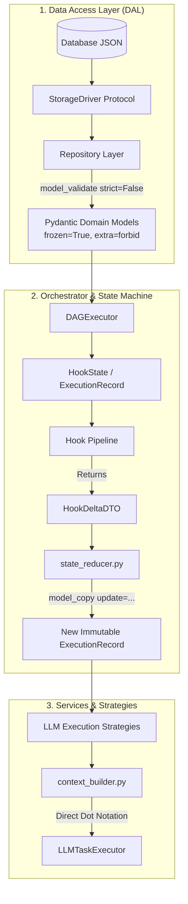

# Automated Implementation Plan: WP1 — Data Flow Strictness & State Transitions (Datan ja Tilasiirtymien Tyyppilukitus)

> **SSOT Implementation Plan — Work Package 1 (WP1)**  
> **Tavoite:** Hävittää sivuvaikutukset (side-effects), raakasanakirjat ja dynaaminen duck-typing-manipulointi tilakoneesta ja palveluista. Kaikki data elää ja siirtyy vain immutaabeleina Pydantic V2 -malleina (`frozen=True`, `extra="forbid"`, `strict=True`).

<required_context_rules>
  <rule>@[.agents/rules/00-antigravity-core.md]</rule>
  <rule>@[.agents/rules/01-python-backend.md]</rule>
  <rule>@[.agents/rules/04_directory_reference.md]</rule>
  <rule>@[.agents/rules/05_llm_architecture.md]</rule>
  <knowledge_item>@[ki_zero_permissive_typing.md]</knowledge_item>
  <knowledge_item>@[ki_ast_guardrail_engine.md]</knowledge_item>
  <knowledge_item>@[ki_python_314_concurrency_strictness.md]</knowledge_item>
  <knowledge_item>@[ki_tripartite_pipeline_architecture.md]</knowledge_item>
  <knowledge_item>@[ki_god_code_prevention.md]</knowledge_item>
</required_context_rules>

<anti_targets>
- Do NOT use `dict[str, Any]`, `list[dict]`, `TypedDict`, or naked dictionary types in function signatures, return types, or internal hook/DAG state transit (`no_naked_dicts_in_state`).
- Do NOT serialize models to dictionaries just to mutate fields (`model_dump() -> dict -> model_validate()` or `dict(model)`) (`pydantic_mutation_optimization_mandate`).
- Do NOT use in-place mutations (`setattr`, `object.__setattr__`, or `event.status = 'done'`) on frozen domain models (`frozen_state_mutability`).
- Do NOT use defensive duck-typing checks (`if isinstance(x, dict):`, `if type(x) is dict:`, `hasattr(obj, "field")`, or `getattr(obj, "field", default)`) in service, hook, or orchestrator layers (`the_zero_compromise_pledge`).
- Do NOT use dictionary `.get("key", default)` or fallback operators (`or "en"`, `or {}`, `or []`) to silently bypass missing state; enforce Fail-Fast with `AppException` (`the_duct_tape_ban`).
- Do NOT allow raw database dictionary payloads to leak across the Repository boundary into Service or Controller layers (`service_layer_hydration_firewall`).
- Do NOT allow hooks to mutate state directly or return untyped dictionaries; hooks MUST return `HookDeltaDTO` (`append_only_state_mutation`).
- Do NOT break SDUI semantic parity or alter database seed schemas without running integration parity gates (`sdui_contract_fracture_prevention`).
</anti_targets>

---

## 1. Problem Statement & Nykyarkkitehtuurin Haasteet

Quorum-järjestelmän arkkitehtuurissa on saavutettu laaja Pydantic V2 -mallinnus ja pisteytyslogiikan dekomponointi, mutta datavirrassa ja tilansiirroissa esiintyy edelleen kolme toisiinsa kytkeytyvää heikkoutta:

1. **Tilamutaatioiden sarjallistuskuorma ja tyyppihävikki (`model_dump` $\rightarrow$ sanakirjamutaatio $\rightarrow$ `model_construct`/`model_validate`):**
   * Useissa orkestraattorin ja strategioiden tiedostoissa (erityisesti `context_builder.py`, `llm.py` ja `rag_preflight_service.py`) immutaabeli malli puretaan sanakirjaksi `model.model_dump()`, jolloin Pydanticin Rust-tason tyyppiturva menetetään. Sanakirjaa muokataan dynaamisesti ja kasataan uudelleen.
   * `state_reducer.py` tekee syväkopiointeja (`copy.deepcopy`) heterogeenisille sanakirjoille ja etsii `__replace__`-erikoisohjausavaimia sanakirjojen sisältä.

2. **Puolustuskoodin ja heijastusten ("Duck-Typing") jäänteet:**
   * Palveluissa, hookeissa ja kääntäjissä on edelleen `isinstance(data, dict)` -suojamuureja ja `TypeAdapter(dict[str, Any]).validate_python(...)` -välivaiheita, koska rajapintasopimukset ovat aiemmin sallineet heterogeenisen sanakirjasyötteen (`ExecutionInputsDTO | dict[str, Any]`).
   * Tämä johtaa koodin haaroittumiseen ja estää staattista tyyppitarkastusta (MyPy strict) toimimasta 100 % deterministisesti.

3. **Data Access Layerin (DAL) ja Repository Reconstitution -rajapinnan vuoto:**
   * `database/interfaces.py` määrittelee vahvasti tyypitetyt Protocol-rajapinnat, mutta sisäinen `StorageDriver` (`database/driver.py`) ja tietokanta-ajurit (`tinydb_driver.py`, `firestore_driver.py`, `wrapper.py`) palauttavat `dict[str, Any]`.
   * Vaikka tietokanta-ajurin sisäinen JSON-palautus on hyväksyttävä rajapintaraja, tietyt repositoriot ja palvelut (kuten `repositories/execution.py`) käsittelevät edelleen raakasanakirjoja manuaalisesti ennen mallin validointia.

---

## 2. Tavoitetila & Ratkaisuarkkitehtuuri



### 2.1 Tilamutaatiot: 100 % `model_copy(update={...})` ja `HookDeltaDTO`
- Kaikki orkestraattorin ja palveluiden tilapäivitykset tehdään Pydanticin C/Rust-optimoidulla `.model_copy(update={...})` -metodilla.
- `state_reducer.py` päivitetään käsittelemään tyypitettyjä tilasäiliöitä (`ExecutionInputsDTO`, `GlobalContextVarsDTO`, `HookDeltaDTO`) suorilla mallipäivityksillä ilman `deepcopy`-sanakirjamutaatioita.
- Kaikki hookit palauttavat eksplisiittisen `HookDeltaDTO`-olion.

### 2.2 Repository Reconstitution Firewall
- Repositoriot (`database/repositories/`) toimivat ehdottomana suojamuurina: tietokannasta luettu raakadata validoidaan välittömästi `Model.model_validate(raw_data)` -kutsulla.
- Ylöspäin palvelu- ja orkestrointikerrokseen palautetaan vain ja ainoastaan validoituja Pydantic Domain -malleja.

### 2.3 Puolustuskoodin ja Duck-Typingin Täysi Eliminointi
- Poistetaan kaikki `if isinstance(x, dict):`, `if type(x) is dict:` ja `getattr(obj, "field", default)` -haarat palvelu-, hook- ja orkestraattorikerroksista.
- Päästään täyteen suoraan pistenotaatioon (`context.metadata.target_locale`, `dto.step_id`, `state.inputs.raw_inputs`).

---

## 3. Implementation Phases (WP1 Yksityiskohtainen Vaihejako)

### Phase 1: DTO- ja Tilamallien Täydentäminen (`models/dtos/hook_state.py` & `models/state.py`)

#### [MODIFY] `@[backend_v2/models/dtos/hook_state.py]`
- Tiukennetaan `ExecutionInputsDTO`, `GlobalContextVarsDTO` ja `HookDeltaDTO` malleja.
- Määritellään `HookDeltaDTO.delta` tyypitetyksi `BaseModel`- tai `dict[str, BaseModel]` -säiliöksi raakasanakirjan sijaan.
- Poistetaan taaksepäin yhteensopivat sanakirjamenetelmät (`__getitem__`, `__contains__`) ja korvataan ne eksplisiittisillä kentillä.

#### [MODIFY] `@[backend_v2/models/state.py]`
- Varmistetaan, että `ExecutionState`, `DAGNodeState` ja `StepState` käyttävät `ConfigDict(frozen=True, extra="forbid", strict=True)`.

---

### Phase 2: State Reducerin ja Tilakoneen Refaktorointi (`services/orchestrator/state_reducer.py`)

#### [MODIFY] `@[backend_v2/services/orchestrator/state_reducer.py]`
- Korvataan sanakirjoja rekursiivisesti yhdistävä `merge_dynamic_inputs(base: dict, delta: dict)` puhtaasti tyypitetyllä versiolla:
  `reduce_execution_inputs(base: ExecutionInputsDTO, delta: HookDeltaDTO) -> ExecutionInputsDTO`.
- Poistetaan `__replace__`-sanakirjahakkerointi ja käytetään Pydanticin `.model_copy(update={...})` -päivitysmekanismia.
- Poistetaan kaikki `isinstance(value, dict)` ja `# noqa: QGR012` -ohitukset.

---

### Phase 3: Orkestraattorin Strategioiden ja Context Builderin Puhdistus

#### [MODIFY] `@[backend_v2/services/orchestrator/strategies/llm_execution/context_builder.py]`
- Korvataan `pruned_dict: dict[str, Any] = pruned.model_dump()` suorilla DTO-projektioilla.
- Korvataan `input_mappings: dict[str, Any]` ja `state_data: dict[str, Any]` vahvasti tyypitetyillä DTO-parametreilla.
- Poistetaan 12 kpl `dict[str, Any]` -esiintymää ja korvataan suoralla pistenotaatiolla.

#### [MODIFY] `@[backend_v2/services/orchestrator/strategies/llm.py]`
- Poistetaan `cast(dict[str, Any], step_def_raw)` ja `cast(dict[str, Any], workflow_def_raw)`.
- Käytetään suoraan `V2Step` ja `Workflow` Pydantic Domain -malleja.
- Korvataan `current_state` ja `safe_context` -sanakirjakasaukset `ExecutionContextDTO`- ja `PromptContextDTO`-rakenteilla.

#### [MODIFY] `@[backend_v2/services/orchestrator/synthesis_payload_compressor.py]`
- Poistetaan `_prune_and_stratify_evaluations(evals: list[dict[str, Any]])` sanakirjatyypitykset.
- Käytetään suoraan `list[AtomEvaluationResultDTO]`- ja `list[EvaluationStepDTO]` -listoja.
- Poistetaan `validated_payload = TypeAdapter(dict[str, Any] | list[Any]).validate_python(v)` ja korvataan tyypitetyllä Discriminated Union TypeAdapterilla.

---

### Phase 4: Hook-Putken DTO-Lukitus ja Duck-Typingin Poisto

#### [MODIFY] `@[backend_v2/hooks/scoring/falsifier_hook.py]`
- Poistetaan `inputs: ExecutionInputsDTO | dict[str, Any] | None` -unionityypitys $\rightarrow$ pakotetaan `inputs: ExecutionInputsDTO`.
- Poistetaan `_extract_payloads`, `_extract_guard_flag` ja `_extract_falsifier_data` -apufunktioiden sanakirjahaarat.

#### [MODIFY] `@[backend_v2/hooks/scoring/matrix_hook.py]`
- Poistetaan `TypeAdapter(dict[str, Any]).validate_python(...)` -kutsuhaarat.
- Käytetään suoraan `MatrixResultDTO` ja `StepOutputDTO` -malleja.

#### [MODIFY] `@[backend_v2/hooks/scoring/normalization_hook.py]`
- Korvataan `async def recalculate(payload: dict[str, Any], ...)` tyypitetyllä `NormalizationPayloadDTO`-parametrilla.
- Poistetaan `payload_dict = TypeAdapter(dict[str, Any]).validate_python(payload)`.

#### [MODIFY] `@[backend_v2/hooks/dlq_guard.py]` & `@[backend_v2/hooks/integrity.py]`
- Poistetaan `content_payload: dict[str, Any]` ja `_gather_rag_context(global_vars: GlobalContextVarsDTO | dict[str, Any])`.
- Korvataan puhtaalla `GlobalContextVarsDTO` -tyypityksellä.

---

### Phase 5: Repository Reconstitution & DAL Suojamuuri

#### [MODIFY] `@[backend_v2/database/repositories/execution.py]`
- Tiukennetaan `_offload_payloads` ja `_hydrate_payloads` siten, että ne operoivat suoraan `ExecutionRecord`-malliin `model_copy`-metodilla sen sijaan, että mutatoi `data: dict[str, Any]`.
- Varmistetaan, että jokainen `get()`- ja `search()`-metodi palauttaa 100 % validoituja `ExecutionRecord`-malleja.

#### [MODIFY] `@[backend_v2/database/repositories/workflow.py]`
- Poistetaan `cast(dict[str, Any], json.load(f))` ja validoidaan JSON suoraan `Workflow.model_validate_json(f.read())` Rust-ytimellä.

---

### Phase 6: AST-Laatuporttien Lukitus & Regressiotestaus

#### [MODIFY] `@[scripts/_ast_guardrails.py]`
- Lukitaan `QGR001` (Naked Dicts in State) ja `QGR002` (Reflection/getattr/hasattr) `FATAL`-tilaan ilman poikkeuslupia palvelu- ja orkestrointikerroksessa.
- Varmistetaan, että `scripts/audit_dict_eradication.py` antaa 0 virhettä `backend_v2/services/orchestrator/` ja `backend_v2/hooks/` -hakemistoille.

#### [NEW] `@[backend_v2/tests/unit/services/orchestrator/test_state_reducer_strictness.py]`
- Kirjoitetaan kattavat ISTQB-yhteensopivat yksikkötestit `state_reducer.py`:n immutaabelille DTO-tilasiirtymälle.

---

## 4. Verification Plan (Laadunvarmistus & Testit)

### Automatisoidut Testit & Laatuportit (PowerShell)

```powershell
# 1. State Reducer & Orchestrator Yksikkötestit
uv run pytest backend_v2/tests/unit/services/orchestrator/test_state_reducer.py backend_v2/tests/unit/services/orchestrator/test_dag_executor.py -v

# 2. Hook-putken ja Scoring DTO -testit
uv run pytest backend_v2/tests/unit/hooks/test_scoring.py backend_v2/tests/unit/hooks/test_atom_flattening.py -v

# 3. Repository Reconstitution & DAL -testit
uv run pytest backend_v2/tests/unit/test_repositories_v2.py backend_v2/tests/unit/database/repositories/ -v

# 4. SDUI Semanttinen Pariteetti (Varmistetaan ettei UI/PDF rikkoudu)
uv run pytest backend_v2/tests/integration/test_sdui_semantic_parity.py -v

# 5. AST Guardrail & Diktieradikointi-auditointi
uv run python scripts/audit_dict_eradication.py backend_v2/services/orchestrator/ backend_v2/hooks/
uv run python scripts/backend_audit_loop.py backend_v2/services/orchestrator/ --test
uv run python scripts/backend_audit_loop.py backend_v2/hooks/ --test
```

### Manuaalinen / E2E Tarkastus
- Ajetaan täysi E2E-orkestrointitesti `uv run pytest backend_v2/tests/integration/test_e2e_orchestration.py -v` todentamaan, että monivaiheinen DAG-ajo tuottaa virheettömän lopputuloksen ilman sanakirjamutaatioita.
