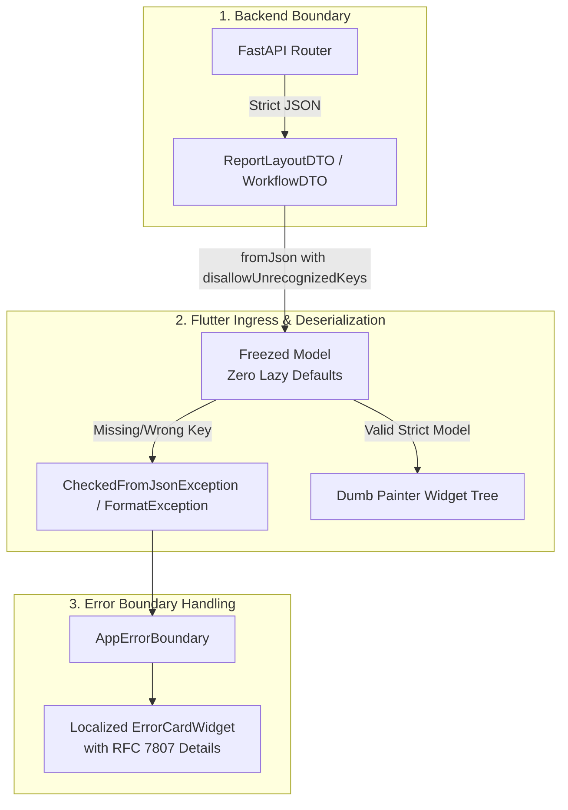

# Automated Implementation Plan: WP4 — Frontend Schema Hardening, Parity & AppErrorBoundary (Flutter-Skeeman Kiristys ja Pariteetti)

> **SSOT Implementation Plan — Work Package 4 (WP4)**  
> **Tavoite:** Poistaa Flutter-asiakassovelluksen Dart Freezed -malleista laiskat `@Default`-fallit ja defensiiviset suojamuurit. Jos backend-sopimus rikkoutuu tai kenttä puuttuu, deserialisointi kaatuu välittömästi `FormatException` / `CheckedFromJsonException` -virheeseen ja laukaisee sovelluksen `AppErrorBoundary`:n. Piilobugit tehdään näkyviksi kehitysaikana.

<required_context_rules>
  <rule>@[.agents/rules/00-antigravity-core.md]</rule>
  <rule>@[.agents/rules/02_flutter_desktop.md]</rule>
  <rule>@[.agents/rules/04_directory_reference.md]</rule>
  <knowledge_item>@[ki_app_error_boundary.md]</knowledge_item>
  <knowledge_item>@[ki_dumb_painter_sdui.md]</knowledge_item>
  <knowledge_item>@[ki_e2e_sdui_parity_architecture.md]</knowledge_item>
  <knowledge_item>@[ki_dual_axis_localization_architecture.md]</knowledge_item>
</required_context_rules>

<anti_targets>
- Do NOT use lazy `@Default('')`, `@Default([])`, `@Default({})`, or `@Default(null)` on mandatory API/DTO fields to mask missing backend data (`the_zero_compromise_pledge`).
- Do NOT use `SizedBox.shrink()`, empty placeholders, or silent `try...catch` blocks to hide rendering or deserialization crashes (`the_duct_tape_ban`).
- Do NOT compute, format, or synthesize business logic in Flutter UI widgets; follow 100% "Dumb Painter" SDUI architecture (`ki_dumb_painter_sdui.md`).
- Do NOT alter field names or camelCase $\leftrightarrow$ snake_case mappings without 1:1 backend Pydantic DTO parity (`anti_semantic_drift_renaming`).
- Do NOT modify `.dart` models without running `uv run python scripts/flutter_audit_loop.py client_app_v2/ --build` to regenerate Freezed `.freezed.dart` and `.g.dart` files (`flutter_audit_execution`).
</anti_targets>

---

## 1. Problem Statement & Nykyarkkitehtuurin Haasteet

1. **Laiskat `@Default`-annotaatiot peittävät backend-skeemarikot:**
   * Dartin Freezed-malleissa esiintyy 16 tiedostossa `@Default('')`, `@Default([])` ja `@Default({})` -annotaatioita (esim. `sdui_block_dto.dart`, `atom_result_dto.dart`, `workflow.dart`, `matrix_scorecard_dto.dart`).
   * Jos backend jättää virheellisesti jonkin pakollisen kentän lähettämättä tai nimeää sen uudelleen, Dart luo hiljaisesti tyhjän listan tai merkkijonon. Tämän seurauksena UI piirtää tyhjiä ruutuja ("Ghost Components") ilman, että kehittäjä tai järjestelmä saa virheestä mitään lokia.
2. **Defensiivinen "Valkoinen Ruutu" vs. Lokalisoitu `AppErrorBoundary`:**
   * Kun virheitä peitetään laiskoilla oletusarvoilla, sovellus saattaa kaatua vasta syvällä widget-puussa arvaamattomasti.
   * Arkkitehtuurin vaatimus on ehdoton Fail-Fast: deserialisoinnin tulee kaatua heti ingress-rajapinnassa, jotta `AppErrorBoundary` pystyy eristämään virheen paikalliseen virhekorttiin (`ErrorCardWidget`) koko sovelluksen kaatamisen sijaan.
3. **SDUI Semanttisen Pariteetin Varmistus:**
   * Backendin generoiman ReportLayoutDTO:n ja Flutterin `SduiBlockDTO`-puun on oltava matemaattisesti 1:1 identtisiä ilman ylimääräisiä tai puuttuvia avaimia (`disallowUnrecognizedKeys: true`).

---

## 2. Tavoitetila & Ratkaisuarkkitehtuuri



### 2.1 Pakollisten Kenttien Tiukennus (`required`)
* Kaikki kentät, joiden saapuminen on backendin DTO-sopimuksen mukaan taattua, merkitään `required`-avainsanalla ilman `@Default`-annotaatiota.
* `@Default`-annotaatio on sallittu **ainoastaan** puhtaissa käyttöliittymän paikallisissa tiloissa (esim. `isExpanded: bool = false`) tai valinnaisissa lisäominaisuuksissa.

### 2.2 Deserialisoinnin Fail-Fast & `AppErrorBoundary`
* Kun `fromJson` kohtaa puuttuvan tai vääräntyyppisen kentän, se heittää välittömästi poikkeuksen.
* `AppErrorBoundary` nappaa virheen ja renderöi paikallisen virheilmoituksen. Kehitysympäristössä virhe nousee heti esiin, jolloin backend- tai frontend-pariteettiero korjataan välittömästi.

---

## 3. Implementation Phases (WP4 Vaihejako)

### Phase 1: SDUI & Suoritusmallien Tiukennus (`features/execution/` & `shared/`)

#### [MODIFY] `@[client_app_v2/lib/shared/models/sdui_block_dto.dart]`
- Tarkistetaan kaikki 12 SDUI-blokin määritelmää (`paragraph`, `bullet_list`, `accordion`, `alert_box`, `hero_insight`, `markdown`, `scorecard`, `table`, `callout_box` jne.).
- Poistetaan `@Default([])` kentistä `citations` ja `exactQuotes` niissä blokeissa, joissa backend lähettää aina listan.
- Poistetaan `@Default('default')` severity-kentistä ja korvataan tyypitetyllä `AlertSeverity` enumilla ilman hiljaista oletusta.

#### [MODIFY] `@[client_app_v2/lib/features/execution/models/atom_result_dto.dart]`
- Poistetaan `@Default({})` ja `@Default([])` kentistä:
  - `extensions`
  - `dependsOnTdaIds`
  - `shortCircuitReasonTdaIds`
- Pakotetaan `required List<String> dependsOnTdaIds` backendin `AtomResultDTO` -mallin mukaisesti.

#### [MODIFY] `@[client_app_v2/lib/features/execution/models/matrix_scorecard_dto.dart]` & `@[client_app_v2/lib/features/execution/models/report_data_v2_dto.dart]`
- Tiukennetaan matriisipisteytysten ja raporttidatan listakentät ilman laiskoja tyhjälista-fallbeckeja.

---

### Phase 2: Studio- & Konfiguraatiomallien Tiukennus (`features/studio/`)

#### [MODIFY] `@[client_app_v2/lib/features/studio/models/workflow.dart]`
- Poistetaan laiskat `@Default('')` -merkkijonot ja `@Default([])` -listat työnkulun askelmäärityksistä (`WorkflowStepDTO`).
- Pakotetaan `id`, `name` ja `stepType` vaadituiksi kentiksi.

#### [MODIFY] `@[client_app_v2/lib/features/studio/models/prompt_block.dart]` & `@[client_app_v2/lib/features/studio/models/output_profile.dart]`
- Varmistetaan 1:1 pariteetti backendin `PromptBlock`- ja `OutputProfile` Domain-malleihin.
- Poistetaan `@Default` kentistä, jotka backendin tietokantakanta takaa aina olemassa oleviksi.

#### [MODIFY] `@[client_app_v2/lib/features/studio/models/blueprint_config.dart]` & `@[client_app_v2/lib/features/studio/models/model_config.dart]`
- Tiukennetaan LLM-mallikonfiguraatioiden ja task blueprintien Freezed-määritykset.

---

### Phase 3: Freezed Koodin Generointi & Auditointi (`flutter_audit_loop.py`)

#### [RUN] `uv run python scripts/flutter_audit_loop.py client_app_v2/ --build`
- Ajetaan Flutterin build_runner (`dart run build_runner build --delete-conflicting-outputs`).
- Generoidaan uudet `.freezed.dart` ja `.g.dart` -tiedostot.
- Korjataan mahdolliset widget-kutsut, jotka luottivat vanhoihin laiskoihin oletusarvoihin.

---

### Phase 4: E2E SDUI Semanttinen Pariteetti & Regressiotestaus

#### [RUN] `uv run pytest backend_v2/tests/integration/test_sdui_semantic_parity.py -v`
- Ajetaan semanttisen pariteetin varmistustesti, joka vertaa backendin generoimaa SDUI-mallia ja Jinja PDF -mallia.
- Varmistetaan, että Flutterin Dart-mallit ja Pythonin Pydantic-mallit ovat 100 % synkronissa.

---

## 4. Verification Plan (Laadunvarmistus & Testit)

### Automatisoidut Testit & Laatuportit (PowerShell)

```powershell
# 1. Suoritetaan Flutter-koodin auditointi ja Freezed-generointi
uv run python scripts/flutter_audit_loop.py client_app_v2/ --build

# 2. Ajetaan Dart-yksikkötestit
cd client_app_v2 ; flutter test ; cd ..

# 3. Backend Enum- ja SDUI-pariteettitestit
uv run pytest backend_v2/tests/unit/test_enum_parity.py -v
uv run pytest backend_v2/tests/integration/test_sdui_semantic_parity.py -v

# 4. Täysi backend-laatuportti
uv run python scripts/backend_audit_loop.py backend_v2/models/view/sdui.py --test
```

### Manuaalinen / UI Tarkastus
- Käynnistetään Flutter-asiakassovellus kehitystilassa ja avataan raporttinäkymä. Varmistetaan, että `AppErrorBoundary` toimii oikein eikä mikään näkymä jää hiljaisesti latautumatta.
