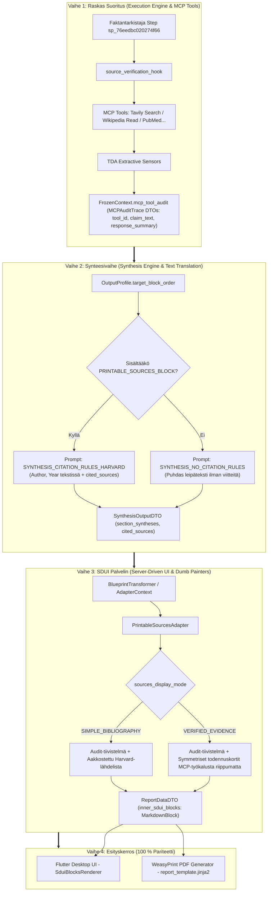

> **STATUS: COMPLETED / TOTEUTETTU (100% Implemented & Verified in commit b31e4161)**

# Implementation Plan: Harvard-Style Bibliography & Configurable Source Verification

Rikastetaan raportin lähdeluettelo Harvard-viittausstandardilla ja tuodaan Tulostusprofiiliin (`OutputProfile`) mahdollisuus konfiguroida lähdeluettelon esitystapaa ja tiivistelmälaatikkoa tiukasti Tripartite Pipeline- ja SDUI Adapter Pattern -arkkitehtuurien mukaisesti rajattuna, kohdellen kaikkia MCP-tiedonhakuyhdyskäytäviä (Tavily, Wikipedia, PubMed jne.) yhdenvertaisina, samantasoisina tietolähteinä.

<required_context_rules>
  <rule>@[.agents/rules/00-antigravity-core.md]</rule>
  <rule>@[.agents/rules/01-python-backend.md]</rule>
  <rule>@[.agents/rules/02_flutter_desktop.md]</rule>
  <rule>@[.agents/rules/03_seed_vault.md]</rule>
  <rule>@[.agents/rules/05_llm_architecture.md]</rule>
  <knowledge_item>@[ki_tripartite_pipeline_architecture.md]</knowledge_item>
  <knowledge_item>@[ki_dumb_painter_sdui.md]</knowledge_item>
  <knowledge_item>@[ki_sdui_adapter_pattern.md]</knowledge_item>
  <knowledge_item>@[ki_dual_axis_localization_architecture.md]</knowledge_item>
  <knowledge_item>@[ki_god_code_prevention.md]</knowledge_item>
  <knowledge_item>@[ki_workflow_context_governance.md]</knowledge_item>
  <knowledge_item>@[ki_global_config_sovereignty.md]</knowledge_item>
</required_context_rules>

<anti_targets>
- Do NOT output sources or verification summaries into non-sources SDUI blocks (Scope Isolation Mandate).
- Do NOT generate in-text Harvard citations in synthesis when `TargetBlockType.PRINTABLE_SOURCES_BLOCK` is disabled in `target_block_order`.
- Do NOT perform LLM calls, domain data parsing, or database lookups inside SDUI Adapters (Dumb Painter Invariant).
- Do NOT hardcode tool-specific special branching (specifically hardcoding tool-dependent conditional branches) in adapter presentation logic.
- Do NOT pass raw mutable dictionaries between pipeline phases (Event-Driven Data Envelopes Mandate).
- Do NOT use fallback default dictionaries `{}` or `.get(..., "")` in domain logic (Universal Fail-Fast).
- Do NOT introduce parallel DTOs or duplicate models (One Concept = One Schema).
- Do NOT edit live runtime database files directly (mutate `seed_data.json` and sync via `run_seed.py local`).
- Do NOT use fuzzy string matching for evidence extraction (Strict Lexical Anchoring).
</anti_targets>

## Problem Statement

Tällä hetkellä Quorumin lähdeluettelo ([PrintableSourcesAdapter](file:///c:/src/quorum/backend_v2/services/sdui/adapters/printable_sources_adapter.py)) tulostaa lähteet yksinkertaisena Markdown-linkkilistana ilman julkaisijatietoja tai tutkimuskontekstia. Lisäksi synteesivaihe voi vahingossa vuotaa sisäisiä DAG-askeltunnisteita (`sr_..._results`) `cited_sources`-listaan.

Käyttäjä haluaa:
1. **Harvard-viittausstandardin:** Tekstissä ja lähdeluettelossa käytetään aina Harvard-järjestelmää (`Tekijä, Vuosi`).
2. **Kaikkien MCP-tietolähteiden (Tavily, Wikipedia, PubMed jne.) samantasoisen ja yhdenvertaisen esityksen:**
   - Kaikki MCP-tiedonhakutyökalut ovat saman tason tietolähteitä.
   - Ne esitetään lähdeluettelossa ja todennuskorteissa symmetrisesti ja samalla arvolla, selkokielisellä nimellä ja ikonilla varustettuna.
3. **Lähdeosion rikasteet ja Tulostusprofiilin (`OutputProfile`) konfiguroitavuuden:**
   - **Lähdeluettelon tila (sources_display_mode):**
     - VERIFIED_EVIDENCE: *Todennetut lähteet ja faktantarkistus* (Täysi aakkostettu Harvard-kirjallisuusviite, jonka alle on sisennetty todennusmenetelmä/tietolähde, status, tekstin väite, todennettu tutkimusnäyttö ja toimiva linkki).
     - SIMPLE_BIBLIOGRAPHY: *Pelkkä lähdeluettelo* (Puhdas aakkostettu Harvard-kirjallisuuslista: Tekijä, Vuosi, Otsikko, Julkaisija ja linkki).
   - **Auditointitiivistelmä (show_sources_summary_box):** Kytkin tiivistelmälaatikon näyttämiselle lähdeosiossa (ilmoittaa tarkistetut väitteet, todennusstatuksen ja käytetyt MCP-tietolähteet kuten Tavily / Wikipedia / PubMed).
4. **Tiukan eristyksen ja ehdollisuuden:**
   - Kaikki nämä asetukset koskevat **vain ja ainoastaan lähdeluettelo-osiota** (`PRINTABLE_SOURCES_BLOCK`).
   - Jos lähdeluettelo-osio on kytketty pois päältä, leipätekstiin **ei generoida mitään lähdeviitteitä**, jolloin teksti säilyy puhtaana ilman orpoja viittauksia.

---

## Tripartite Pipeline Architecture & SDUI Adapter Governance

Toteutus noudattaa täsmällisesti Knowledge Itemien ([ki_tripartite_pipeline_architecture.md](file:///c:/Users/risto/.gemini/antigravity-ide/knowledge/tripartite_pipeline_architecture/artifacts/ki_tripartite_pipeline_architecture.md), [ki_dumb_painter_sdui.md](file:///c:/Users/risto/.gemini/antigravity-ide/knowledge/dumb_painter_sdui_architecture/artifacts/ki_dumb_painter_sdui.md), [ki_sdui_adapter_pattern.md](file:///c:/Users/risto/.gemini/antigravity-ide/knowledge/sdui_adapter_decomposition/artifacts/ki_sdui_adapter_pattern.md), [ki_dual_axis_localization_architecture.md](file:///c:/Users/risto/.gemini/antigravity-ide/knowledge/dual_axis_localization/artifacts/ki_dual_axis_localization_architecture.md)) määrittelemää 3-vaiheista vastuunjakoa ja 2-osaista SDUI-adapterirakennetta:



### 1. Vaihe 1: Raskas Suoritus (Execution Phase)
- **Vastuu:** Puhdas kognitiivinen tiedonhaku ja väitteiden todentaminen.
- **Toiminta:** `source_verification_hook` ja MCP-työkalut (`TavilyTool`, `WikipediaTool` jne.) hakevat ulkoista näyttöä, ja TDA-sensorit arvioivat väitteet. Tulokset tallennetaan puhtaina, muuttumattomina [`MCPAuditTrace`](file:///c:/src/quorum/backend_v2/models/v2_core.py#L410-L431) -tietueina `FrozenContext.mcp_tool_audit` -rekisteriin sisältäen `tool_id`-tunnisteen (esim. `mcp_tavily_search`, `mcp_wikipedia_read`, `mcp_pubmed_search`).
- **Kielto:** Ei UI-muotoilua, ei Markdown-kasausta, ei kielisävyohjausta tässä vaiheessa.

### 2. Vaihe 2: Synteesivaihe (Synthesis Phase)
- **Vastuu:** Puhdas tekstin kääntäminen ja laadullinen narratiivi.
- **Toiminta:** Lukee suorituksen tulokset. Jos `TargetBlockType.PRINTABLE_SOURCES_BLOCK` on aktiivinen profiilissa, LLM ohjeistetaan käyttämään Harvard-viitteitä `(Author, Year)` leipätekstissä ja täyttämään `cited_sources`. Jos lohko on pois päältä, LLM tuottaa puhdasta tekstiä ilman sulkeissa olevia viitteitä (`cited_sources = []`).
- **Kielto:** Ei SDUI-komponenttien luontia, ei kuvaajien piirtoa tässä vaiheessa.

### 3. Vaihe 3: SDUI Palvelin ([PrintableSourcesAdapter](file:///c:/src/quorum/backend_v2/services/sdui/adapters/printable_sources_adapter.py))
- **Vastuu:** Deterministinen visuaalinen muunnos ("Dumb Painter") noudattaen [`ki_sdui_adapter_pattern.md`](file:///c:/Users/risto/.gemini/antigravity-ide/knowledge/sdui_adapter_decomposition/artifacts/ki_sdui_adapter_pattern.md) -ohjeen 2-osaista arkkitehtuuria:
  - **SECTION 1: AESTHETICS RULES:** Moduulitason `PRINTABLE_SOURCES_RULES` -sanakirja visuaalisille asetuksille ja laajennettavalle `MCP_TOOL_DISPLAY_REGISTRY` -kartoitukselle, jossa jokaisella MCP-työkalulla on selkokielinen nimi ja visuaalinen ikoni.
  - **SECTION 2: ADAPTER CLASS:** `PrintableSourcesAdapter` staattisella `build(context: AdapterContext) -> list[AnySduiBlock]` -metodilla.
    - Suodattaa sisäiset `sr_...`-avaimet pois.
    - Käsittelee kaikkia MCP-tietolähteitä (Tavily, Wikipedia, PubMed jne.) täysin symmetrisesti samalla hierarkiatasolla.
    - Molemmissa tiloissa lähteet muotoillaan täydellisenä Harvard-kirjallisuusviitteenä (`Tekijä, Vuosi. Otsikko. Julkaisija/Linkki`).
    - `VERIFIED_EVIDENCE` -tilassa Harvard-viitteen alle sisennetään lisäksi todennustiedot: Status (`✅ Vahvistettu`), Tietolähde / Todennusmenetelmä (selkokielinen MCP-työkalun nimi), Tekstin väite ja Todennettu tutkimusnäyttö.
    - Tiivistelmälaatikko ilmoittaa tarkistettujen väitteiden määrän lisäksi kaikki käytetyt MCP-tietolähteet.
    - `SIMPLE_BIBLIOGRAPHY` -tilassa tulostetaan puhdas aakkostettu Harvard-kirjallisuuslista.
    - Kääntää otsikot `LocalizationService`-palvelun kautta (`backend_v2/l10n/*.json`).
- **Kielto:** Ei LLM-kutsuja, ei tietokantakyselyitä, ei datan mutaatiota adapterissa.

### 4. Esityskerros ja Pariteetti (Flutter & WeasyPrint)
- **Vastuu:** 1:1 identtinen esitys käyttöliittymässä ja PDF-raportissa ([`ki_dumb_painter_sdui.md`](file:///c:/Users/risto/.gemini/antigravity-ide/knowledge/dumb_painter_sdui_architecture/artifacts/ki_dumb_painter_sdui.md)).
- **Toiminta:** Sekä Flutter (`SduiBlocksRenderer`) että WeasyPrint (`report_template.jinja2`) kuluttavat samaa `ReportDataDTO`-dataa. Tekstit ja linkit renderöityvät samalla tavalla. Studion UI-tekstit tulevat Flutter `.arb`-tiedostoista (Dual-Axis Axis 1).

---

## User Review Required

> [!IMPORTANT]
> **Arkkitehtuurilliset valinnat ja oletukset:**
> 1. `sources_display_mode`: Oletuksena `verified_evidence`. Vaihtoehtona `simple_bibliography`.
> 2. `show_sources_summary_box`: Oletuksena `true`.
> 3. **MCP-tietolähteiden symmetrinen esitys:** Kaikki `AllowedMCPTool` -tunnisteet (esim. `mcp_tavily_search`, `mcp_wikipedia_search`, `mcp_wikipedia_read`, `mcp_pubmed_search`) saavat yhdenvertaisen selkokielisen muotoilun todennuskorteissa ja tiivistelmälaatikossa.
> 4. **Ehdollisuus:** Kun `PRINTABLE_SOURCES_BLOCK` ei ole aktiivinen profiilin `target_block_order` -listassa, synteesikehote ohjeistaa tuottamaan sujuvaa narratiivia ilman Harvard-viittauksia.

---

## Target & Context File Boundaries

### TARGET Files
- `[MODIFY]` `@[backend_v2/models/enums.py#L221-L236]` — Lisätään `SourcesDisplayMode(StrEnum)`.
- `[MODIFY]` `@[backend_v2/models/v2_core.py#L941-L1080]` — Lisätään `show_sources_summary_box` ja `sources_display_mode` `OutputProfile`-malliin.
- `[MODIFY]` `@[backend_v2/models/dtos/output_profile.py#L325-L419]` — Lisätään kentät DTO-malleihin (`OutputProfileResponseDTO`, `OutputProfileUpdateDTO`).
- `[MODIFY]` `@[backend_v2/models/prompts/style_directives.py]` — Lisätään Harvard- ja no-citations -säännöt.
- `[MODIFY]` `@[backend_v2/services/sdui/adapters/printable_sources_adapter.py#L30-L94]` — Päivitetään adapteri suodattamaan `sr_...`-tunnisteet ja rakentamaan Harvard-muotoinen todennusosio tai bibliografia symmetrisellä MCP-tietolähdekartoituksella.
- `[MODIFY]` `@[backend_v2/l10n/fi.json]` & `@[backend_v2/l10n/en.json]` — Lisätään käännösavaimet.
- `[MODIFY]` `@[client_app_v2/lib/core/models/enums.dart]` — Lisätään Dart `SourcesDisplayMode` enum.
- `[MODIFY]` `@[client_app_v2/lib/features/studio/models/output_profile.dart]` — Lisätään kentät Freezed-malliin.
- `[MODIFY]` `@[client_app_v2/lib/features/studio/views/widgets/profile/blocks/bibliography_block_card.dart]` — Lisätään esitystavan valitsin ja tiivistelmälaatikon kytkin.
- `[MODIFY]` `@[client_app_v2/lib/l10n/app_fi.arb]` & `@[client_app_v2/lib/l10n/app_en.arb]` — Lisätään Studion UI-käännökset.

### CONTEXT Files (Read-Only)
- `@[backend_v2/services/sdui/adapters/base_adapter.py]` — `AdapterContext` määritelmä.
- `@[backend_v2/models/v2_core.py#L410-L431]` — `MCPAuditTrace` kentät (`tool_id`, `claim_text`, `response_summary`, `source_urls`).
- `@[backend_v2/services/orchestrator/engines/synthesis_engine.py]` — Synteesin suoritusmoottori.

---

## Pre-Implementation Technical Debt Cleanups

1. **`PrintableSourcesAdapter` -suodatus:** Vanha toteutus luotti siihen, että `cited_sources` sisältää vain puhtaita merkkijonoja. Lisätään eksplisiittinen puhdistussääntö, joka poistaa `sr_...`- ja `_results`-tunnisteet.
2. **`style_directives.py` -harmonisointi:** Vanha `SYNTHESIS_CITATION_RULES` ohjeisti numeroviitteitä `[1]`. Korvataan se eksplisiittisillä Harvard-direktiiveillä.

---

## Execution Protocol

```xml
<execution_protocol>
  <phase id="1" name="DOMAIN_MODELS_AND_DTOS">
    <step id="1.1" name="Add SourcesDisplayMode Enum to Python Backend">
      <action>In `backend_v2/models/enums.py`, define `SourcesDisplayMode(StrEnum)` with `VERIFIED_EVIDENCE = "verified_evidence"` and `SIMPLE_BIBLIOGRAPHY = "simple_bibliography"`.</action>
      <constraint invariant="pydantic_strictness">Enum must be StrEnum and export in __all__.</constraint>
    </step>
    <step id="1.2" name="Update OutputProfile Model in v2_core.py">
      <action>In `backend_v2/models/v2_core.py`, add `show_sources_summary_box: bool = Field(default=True)` and `sources_display_mode: SourcesDisplayMode = Field(default=SourcesDisplayMode.VERIFIED_EVIDENCE)` to `OutputProfile`.</action>
      <constraint invariant="pydantic_strictness">ConfigDict(strict=True, extra='forbid') must remain intact.</constraint>
    </step>
    <step id="1.3" name="Update OutputProfile DTOs">
      <action>In `backend_v2/models/dtos/output_profile.py`, add `show_sources_summary_box` and `sources_display_mode` to `OutputProfileResponseDTO` and `OutputProfileUpdateDTO`.</action>
      <constraint invariant="sdui_contract_fracture_prevention">DTO fields must match domain model 1:1.</constraint>
    </step>
  </phase>

  <phase id="2" name="SDUI_PRINTABLE_SOURCES_ADAPTER_AND_L10N">
    <step id="2.1" name="Add L10n Translation Keys for Sources Section">
      <action>In `backend_v2/l10n/fi.json` and `backend_v2/l10n/en.json`, add keys for audit summary box title, verified claims count, verification method label, used sources label, status, claim label, evidence label, and source publication label.</action>
      <constraint invariant="dual_axis_localization">Server-side report strings reside strictly in backend_v2/l10n/*.json.</constraint>
    </step>
    <step id="2.2" name="Refactor PrintableSourcesAdapter for Harvard & Display Modes">
      <action>In `backend_v2/services/sdui/adapters/printable_sources_adapter.py`:
        1. Conform to the 2-section adapter structure: Section 1 `PRINTABLE_SOURCES_RULES` (with extensible MCP tool display mapping) and Section 2 `PrintableSourcesAdapter.build(context)`.
        2. Filter out all `sr_...` step result identifiers from `profile_cache.cited_sources`.
        3. Resolve `show_sources_summary_box` and `sources_display_mode` from `context.output_profile`.
        4. In BOTH modes, format sources with complete Harvard bibliographic entries (`Author, Year. Title. Publisher/URL`).
        5. If `VERIFIED_EVIDENCE`: render audit summary box with list of used MCP tools, and nest verified evidence fields (Status, Symmetrical MCP Tool source name, Claim in text, Research evidence) beneath each Harvard source.
        6. If `SIMPLE_BIBLIOGRAPHY`: render audit summary box (if enabled) and alphabetically sorted Harvard bibliographic entries without sub-bullet evidence.
      </action>
      <constraint invariant="sdui_adapter_dumb_painter">Adapter acts as pure Dumb Painter without domain mutations.</constraint>
    </step>
  </phase>

  <phase id="3" name="FLUTTER_STUDIO_UI_AND_MODELS">
    <step id="3.1" name="Add SourcesDisplayMode to Dart Enums">
      <action>In `client_app_v2/lib/core/models/enums.dart`, define `SourcesDisplayMode` enum with `@JsonValue('verified_evidence') verifiedEvidence` and `@JsonValue('simple_bibliography') simpleBibliography`.</action>
      <constraint invariant="anti_semantic_drift_renaming">Dart enum values must serialize 1:1 to Python snake_case.</constraint>
    </step>
    <step id="3.2" name="Update OutputProfile Freezed Model in Dart">
      <action>In `client_app_v2/lib/features/studio/models/output_profile.dart`, add `showSourcesSummaryBox` and `sourcesDisplayMode` fields with `@Default` annotations.</action>
      <constraint invariant="flutter_audit_execution">Run flutter_audit_loop.py with --build to regenerate Freezed models.</constraint>
    </step>
    <step id="3.3" name="Update BibliographyBlockCard in Studio UI">
      <action>In `client_app_v2/lib/features/studio/views/widgets/profile/blocks/bibliography_block_card.dart`, add controls:
        1. SegmentedButton or RadioListTile for `sourcesDisplayMode` (Verified Evidence vs Simple Bibliography).
        2. SwitchListTile for `showSourcesSummaryBox` (Show Audit Summary Box).
      </action>
      <constraint invariant="rich_aesthetics">Use curated AppSpacing, theme colors, and semantic icons.</constraint>
    </step>
    <step id="3.4" name="Add Studio UI Localization Strings">
      <action>In `client_app_v2/lib/l10n/app_fi.arb` and `app_en.arb`, add labels and tooltips for display mode options and summary toggle.</action>
      <constraint invariant="dual_axis_localization">All Studio UI Chrome strings reside strictly in Flutter .arb files.</constraint>
    </step>
  </phase>

  <phase id="4" name="SYNTHESIS_PROMPT_DIRECTIVES">
    <step id="4.1" name="Define Harvard and Conditional Citation Directives">
      <action>In `backend_v2/models/prompts/style_directives.py`, add `SYNTHESIS_CITATION_RULES_HARVARD` (mandating Harvard author-date in-text citations and forbidding internal step IDs) and `SYNTHESIS_NO_CITATION_RULES` (mandating clean narrative without citation tags when bibliography is disabled).</action>
      <constraint invariant="prompt_asset_ssot_mandate">Directives reside strictly in models/prompts/.</constraint>
    </step>
  </phase>

  <phase id="5" name="TESTING_AND_QUALITY_GATES">
    <step id="5.1" name="Unit Tests for SDUI PrintableSourcesAdapter">
      <action>In `backend_v2/tests/unit/services/sdui/adapters/test_printable_sources_adapter.py`, test:
        1. Positive: `VERIFIED_EVIDENCE` mode renders summary box with tool badges and verified evidence cards with complete Harvard citations.
        2. Positive: `SIMPLE_BIBLIOGRAPHY` mode renders alphabetical Harvard references.
        3. Negative: `sr_..._results` internal keys are filtered out completely.
        4. Negative: Disabled `show_sources_summary_box` omits summary card while preserving citations.
        5. Negative: Empty `mcp_audit_map` and empty `cited_sources` returns `[]`.
      </action>
      <constraint invariant="anti_happy_path_mandate">At least 2 negative test cases covering boundary and filtering conditions.</constraint>
    </step>
    <step id="5.2" name="Unit Tests for OutputProfile DTOs & Serialization">
      <action>In `backend_v2/tests/unit/models/dtos/test_output_profile.py`, verify serialization and round-trip validation of `sources_display_mode` and `show_sources_summary_box`.</action>
      <constraint invariant="universal_fail_fast">Invalid string values in sources_display_mode must fail fast with ValidationError.</constraint>
    </step>
    <step id="5.3" name="Run Backend & Flutter Quality Gates">
      <action>Execute `uv run python scripts/backend_audit_loop.py backend_v2/services/sdui/adapters/printable_sources_adapter.py --test` and `uv run python scripts/flutter_audit_loop.py client_app_v2/lib/features/studio/views/widgets/profile/blocks/bibliography_block_card.dart --build`.</action>
      <constraint invariant="zero_tolerance_audit_loop">100% clean pass on Ruff, MyPy, and Flutter analyzer.</constraint>
    </step>
  </phase>
</execution_protocol>
```

---

## Verification Plan

### Automated Tests
1. **Backend Audit Loop:**
   ```bash
   uv run python scripts/backend_audit_loop.py backend_v2/services/sdui/adapters/printable_sources_adapter.py --test
   uv run python scripts/backend_audit_loop.py backend_v2/tests/unit/services/sdui/adapters/test_printable_sources_adapter.py --test
   uv run pytest backend_v2/tests/unit/models/dtos/test_output_profile.py -v
   ```
2. **Flutter Audit Loop:**
   ```bash
   uv run python scripts/flutter_audit_loop.py client_app_v2/lib/features/studio/views/widgets/profile/blocks/bibliography_block_card.dart --build
   ```

### Manual Verification
1. Avaa Quorum Studio ja tarkasta Tulostusprofiilin "Lähdeluettelo ja viitteet" -kortti.
2. Varmista, että valintojen vaihto tallentuu profiiliin ja että raportin loppuun tulostuu valittu muoto.
3. Kytke Lähdeluettelo-lohko pois päältä ja varmista, että leipätekstiin ei generoidu viittauksia ja lohko piilotetaan.
