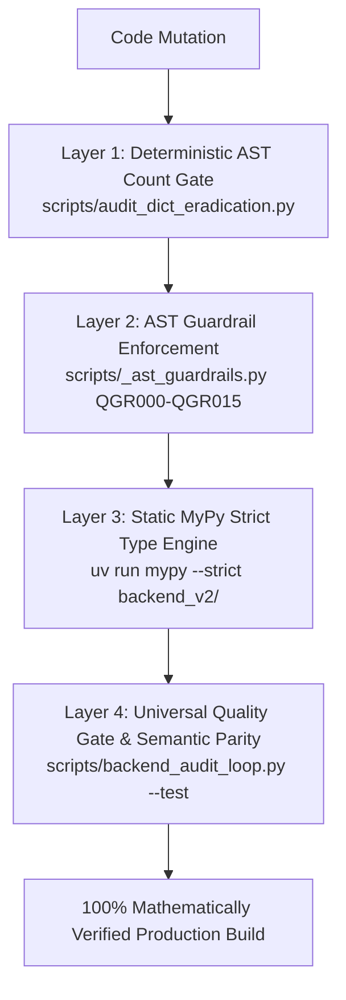

> **STATUS: PENDING / ODOTTAA TOTEUTUSTA (Protokollarekonstituutio, dict-hävitys ja rajapintalukitus)**

# Unified Implementation Plan: Modern Python Typing, 100% Protocol Reconstitution, Dict Eradication & Strict Boundary Lockdown

This comprehensive implementation plan combines Python 3.12–3.14+ typing modernization, 100% typing reconstitution of ALL 15 database protocols and repositories (Ingress DTOs & Egress Domain Models), eradication of permissive dictionary utility anti-patterns (`dict_utils.py`), new stateful In-Memory Protocol Fake testing infrastructure, static AST Guardrail engine expansion alongside **Permanent Lockdown of `BOUNDARY_EXEMPTION_FILES` to ONLY 4 physical SDK/storage drivers (`interfaces.py`, `driver.py`, `wrapper.py`, `exceptions.py`, `finops_trace_analyzer.py`, `alias_engine.py`, and `dict_utils.py` removed/deleted)**.

<required_context_rules>
  <rule>@[.agents/rules/00-antigravity-core.md]</rule>
  <rule>@[.agents/rules/01-python-backend.md]</rule>
  <rule>@[.agents/rules/04_directory_reference.md]</rule>
  <knowledge_item>@[ki_zero_permissive_typing.md]</knowledge_item>
  <knowledge_item>@[ki_ast_guardrail_engine.md]</knowledge_item>
  <knowledge_item>@[ki_god_code_prevention.md]</knowledge_item>
  <knowledge_item>@[ki_python_314_concurrency_strictness.md]</knowledge_item>
</required_context_rules>

## User Review Required

> [!IMPORTANT]
> - **Grand Unified Protocol & Zero-Permissive Lockdown (15/15 Protocols Typed + Dict Eradication)**:
>   - **Part A: Core Pipeline, Execution Ingress/Mutation & Generics Modernization**
>     - Reconstitute `IExecutionRepository`, `IWorkflowRepository`, `IComponentRepository`, `IMatrixRepository`, `IAgentRepository`, `IExecutionPersonaRepository`, `IExtractionProtocolRepository` in `@[backend_v2/database/interfaces.py]`.
>     - **Acyclic Top-Level Import Invariant**: `interfaces.py` enforces `from __future__ import annotations` and imports ALL domain models and DTOs strictly at the module top level (**Zero `if TYPE_CHECKING:` wrappers**). Models in `backend_v2/models/` never import `interfaces.py`, guaranteeing a 100% acyclic dependency tree and preserving runtime type introspection (`typing.get_type_hints`, FastAPI, Pydantic).
>     - Introduce `ExecutionUpdateDTO` as the SSOT for partial execution state updates and migrate all 12+ callers across `progress.py`, `execution.py`, `blueprint.py`, `dag_executor.py`, and `llm.py` to construct strongly typed DTOs.
>     - **Naked Dict Leak Eradication Guaranteed (`@[ki_zero_permissive_typing.md]`)**:
>       - `ExecutionUpdateDTO.step_states` is strictly typed as `dict[str, ExecutionStepState] | None` (SSOT domain model).
>       - `ExecutionUpdateDTO.profile_syntheses` is strictly typed as `dict[str, RenderedSynthesisCache] | None`.
>       - `ExecutionUpdateDTO.context_variables` is strictly typed as `dict[str, str | int | float | bool | list[str]] | None` (scalar blackboard).
>       - `SystemConfigUpdateDTO.model_registry` is strictly typed as `SystemConfigModelRegistry | None`.
>       - `SystemConfigUpdateDTO.mcp_gateways` is strictly typed as `SystemConfigMCPGateways | None`.
>       - `AuditLogCreateDTO.details` is strictly typed as `dict[str, str | int | float | bool | list[str]] | None`.
>       - Zero `dict[str, Any]` across all Domain Models, DTOs, and Strategy Inputs.
>     - Refactor `@[backend_v2/core/hook_registry.py]` to PEP 695 generic method syntax (`def register[F: HookFunction]`) and type `ISearchClient.search()` return to `TavilySearchResultDTO`.
>     - Build [NEW] `@[backend_v2/tests/fakes/in_memory_repositories.py]` — 100% In-Memory Fake Infrastructure covering ALL 15 database protocols (`InMemoryWorkflowRepository`, `InMemoryExecutionRepository`, `InMemoryIdentityRepository`, `InMemoryComponentRepository`, `InMemoryPromptBlockRepository`, `InMemoryAgentRepository`, `InMemoryMatrixRepository`, `InMemoryExecutionPersonaRepository`, `InMemoryExtractionProtocolRepository`, `InMemoryTaskBlueprintRepository`, `InMemoryOutputProfileRepository`, `InMemoryRoleRepository`, `InMemoryKnowledgeRepository`, `InMemorySystemRepository`, `InMemoryAuditRepository`) plus `InMemoryUnifiedWorkflowRepository` composite facade, powered by `BaseInMemoryRepository[T]` with Rust-accelerated Snapshot Isolation (`model_dump(mode='python')` + `model_validate(strict=False)`) and Native Fault Injection Engine (`inject_fault(method_name, exception, trigger_count=...)`, `clear_faults()`, `fault_context()`, `_check_fault()`, and call counting with Fail-Fast method validation) to prevent reference leakage, eliminate test suite CPU starvation, and deterministically simulate transient/permanent database failures without `AsyncMock`.
>     - **DELETE `dict_utils.py` & Build Sovereign Orchestrator `state_reducer.py`**: Relocate pure `resolve_dot_notation()` utility into `@[backend_v2/utils/math_utils.py]` and update `@[backend_v2/services/orchestrator/strategies/llm_execution/context_builder.py]`. Build dedicated [NEW] `@[backend_v2/services/orchestrator/state_reducer.py]` providing pure, non-destructive `merge_dynamic_inputs(base, delta)` to replace `deep_merge_dicts` in `@[backend_v2/services/orchestrator/strategies/base.py]` and `@[backend_v2/services/orchestrator/strategies/logic.py]`. Combine with Pydantic `.model_copy(update=...)` for top-level DTO mutations, eliminating `dict_utils.py` entirely while preventing catastrophic data loss on nested scoring/validation dictionaries.
>     - **Eradicate 4 Unnecessary `# noqa` Suppressions**:
>       - `backend_v2/main.py`: Refactor `app.state` pool lookup to `try...except AttributeError:` and `isinstance(pool, (ArqRedis, FakeRedis))`, eliminating `# noqa: QGR001`.
>       - `backend_v2/services/llm_task_executor.py`: Replace generic catch-all with specific I/O exceptions `except (OSError, ValueError, TypeError):`, eliminating `# noqa: QGR003`.
>       - `backend_v2/services/cache/typed_cache.py`: Replace generic catch-all with specific network exceptions `except (ConnectionError, TimeoutError, OSError):`, eliminating `# noqa: QGR003`.
>       - `backend_v2/services/orchestrator/strategies/base.py`: Eliminate `_deep_merge()` in favor of typed scalar union, eliminating `# noqa: QGR012`.
>     - **Modernize `exceptions.py`**: Refactor `AppException` and validation error formatting to use typed `ErrorDetails` (Pydantic V2) with 0 `.get()` / `getattr()` calls.
>     - **Modernize `finops_trace_analyzer.py`**: Introduce `MonitorState` and `TelemetryRecord` DTOs, replacing raw `.get()` calls with dot-notation.
>     - **Modernize `alias_engine.py` (Full SSOT Compliance)**: Refactor `alias_engine.py` to 100% AST guardrail compliance (0 `isinstance(dict)` duck-typing violations, strict `AliasManifest`), allowing complete removal from `BOUNDARY_EXEMPTION_FILES`.
>   - **Part C: Permanent Boundary Exemption Lockdown (Strict 4-Driver Firewall)**
>     - **7 Files Removed/Deleted from `BOUNDARY_EXEMPTION_FILES`**: `interfaces.py`, `driver.py`, `wrapper.py`, `exceptions.py`, `finops_trace_analyzer.py`, `alias_engine.py`, `dict_utils.py`.
>     - **ONLY 4 Legitimate Physical Drivers Retained**: `tinydb_driver.py` (disk JSON driver), `firestore_driver.py` (GCP Firestore SDK), `provider.py` (LiteLLM / AI Provider network boundary), `logging_config.py` (Python stdlib logging formatter).
>     - Expand AST Guardrail engine with `QGR013` (ban `TypeVar`), `QGR014` (ban `AsyncMock`/`MagicMock` on repository interfaces in service tests, Severity: `FATAL`), and `QGR015` (ban `TypeGuard` per PEP 742 `pep742_typeis_over_typeguard`).
>     - Synchronize existing test in `@[backend_v2/tests/unit/scripts/test_ast_guardrails.py#L827-L833]` (`test_ast_guardrails_allows_exempt_driver_annotations`) from `interfaces.py` to `tinydb_driver.py`.
>     - **Zero Dual-Type / Zero Legacy Union Mandate (`the_no_legacy_mandate` & `schema_convergence_mandate`)**:
>       - All protocol methods in `interfaces.py`, repository implementations, and in-memory fakes enforce EXACTLY ONE canonical type per method parameter (specifically: `create_execution(ExecutionCreateDTO)`, `update_execution(..., ExecutionUpdateDTO)`, `create_workflow(WorkflowCreateDTO)`, `create_organization(OrganizationCreate)`).
>       - **Zero `DTO | DomainModel` fallback unions**: Dual-type transition signatures are strictly banned. Callers must supply the exact canonical DTO or Domain Model matching the operation contract.
>     - **Zero Mock Repositories Mandate (`anti_tdd_trap` & `deterministic_testing_delegation`)**:
>       - All service unit tests (in `backend_v2/tests/unit/services/`) MUST use strongly typed `InMemoryRepositories` fakes created in Step 7 instead of untyped `AsyncMock()` fixtures.
>       - Native Fault Injection Engine on `BaseInMemoryRepository[T]` enables deterministic testing of database failures (`TimeoutError`, `ConnectionError`, `AppException`) without `AsyncMock`.
>       - `QGR014` is enforced at **`FATAL`** severity against repository mocking, ensuring 100% genuine Pydantic validation across all test suites.
>   - **Critical Execution & Schema Alignment Directives**:
>     1. **`backend_v2/models/execution_core.py` (Step 1b)**: In Step 1b, `ExecutionCoreFields` and `ExecutionMetadata` replace permissive `dict[str, Any]` (context variables, metrics) with typed scalar dictionaries (`dict[str, str | int | float | bool | list[str]]`). The `execution_trace: list[ErrorTraceEvent | TombstoneEvent | TraceEvent]` field and its inheritance into `ExecutionRecord` MUST be kept 100% intact to preserve serialization contract parity with the client app.
>     2. **`IExecutionRepository` & `ExecutionUpdateDTO` (Steps 1 & 3)**: Partial execution mutations are strictly encapsulated into `ExecutionUpdateDTO`, while execution trace events are appended via `append_trace_event(execution_id, event_data: TraceEvent)`. This guarantees `execution_trace` remains an append-only event log and cannot be overwritten during partial state updates.
>     3. **Flutter Strict Deserialization Contract (`disallowUnrecognizedKeys: true`)**: As client models (`ExecutionRecord`, `ExecutionMetadata`) enforce zero unrecognized keys, backend DTOs and domain models MUST strictly preserve established key names (`anti_semantic_drift_renaming`). All new or updated fields must match existing schema contracts 1:1.
> 
> > [!NOTE]
> > - **Strict Phase Sequencing**: All new Ingress and Update DTOs in `backend_v2/models/` (Step 1) MUST be created and validated BEFORE modifying `backend_v2/database/interfaces.py` (Step 3). This guarantees that `interfaces.py` imports only existing, validated symbols.
---

## Deterministic Verification & Inventory: Dictionaries & `# noqa` Suppressions

### 1. Complete Protocol Typing Scope Inventory (15/15 Protocols)

| Entity / Protocol | Current Permissive Pattern | Target 100% Reconstitution | Status | Rationale / Boundary |
| :--- | :--- | :--- | :--- | :--- |
| `IExecutionRepository` (all 9 methods) | `execution_data: dict`, `updates: dict`, `event_data: dict` | `ExecutionCreateDTO`, `ExecutionUpdateDTO`, `TraceEvent` | `[x]` | Strongly typed execution ingress/mutation DTOs (Zero Union Fallbacks) |
| `IWorkflowRepository` (all 15 methods) | `workflow_data: dict`, `updates: dict`, `step_data: dict` | `WorkflowCreateDTO`, `WorkflowUpdateDTO`, `StepCreateDTO`, `StepUpdateDTO` | `[x]` | Strongly typed workflow & step DTOs (Zero Union Fallbacks) |
| `IComponentRepository` (all 9 methods) | `-> list[dict]`, `comp_data: dict` | `-> list[PromptBlock]`, `comp: PromptBlock` | `[x]` | Reconstituted PromptBlock Domain models |
| `IMatrixRepository` (all 6 methods) | `dict[str, Any]` params/returns | `PromptBlock` / `list[PromptBlock]` | `[x]` | Reconstituted PromptBlock Domain models |
| `IAgentRepository` (all 5 methods) | `dict[str, Any]` params/returns | `PromptBlock` / `list[PromptBlock]` | `[x]` | Reconstituted PromptBlock Domain models |
| `IExecutionPersonaRepository` (all 5 methods) | `dict[str, Any]` params/returns | `PromptBlock` / `list[PromptBlock]` | `[x]` | Reconstituted PromptBlock Domain models |
| `IExtractionProtocolRepository` (all 5 methods) | `dict[str, Any]` params/returns | `PromptBlock` / `list[PromptBlock]` | `[x]` | Reconstituted PromptBlock Domain models |
| `IIdentityRepository` (all 14 methods) | `org_data: dict`, `updates: dict`, `user_data: dict` | `OrganizationCreate`, `OrganizationUpdateDTO`, `UserCreate`, `UserUpdate` | `[x]` | Reconstituted Auth & RBAC Domain DTOs (Zero Union Fallbacks) |
| `IKnowledgeRepository` (all 11 methods) | `add_concept(dict)`, `add_claim(dict)`, `add_reference(dict)` | `ConceptCreateDTO`, `ClaimCreateDTO`, `ReferenceCreateDTO`, `BannedPhrase` | `[x]` | Reconstituted Knowledge Domain DTOs (Zero Union Fallbacks) |
| `ISystemRepository` (all 8 methods) | `update_model_registry(dict)`, `update_mcp_gateways(dict)`, `update_system_settings(dict)`, `create_system_config(dict)` | `SystemConfigModelRegistry`, `SystemConfigMCPGateways`, `SystemConfig`, `SystemConfigUpdateDTO`, `SystemConfigCreateDTO`, `SystemConfigUpsertDTO` | `[x]` | 100% Reconstituted System Config DTOs across all 8 methods |
| `IAuditRepository` (all 7 methods) | `log_audit_event(dict)`, `upsert_usage_aggregate(dict)`, `get_usage_aggregate() -> dict`, `get_detailed_usage() -> dict`, `log_usage(Any)` | `AuditLogCreateDTO`, `UsageAggregateUpdateDTO`, `UsageAggregateDTO`, `DetailedUsageDTO`, `UsageRecord` | `[x]` | 100% Reconstituted Audit & Usage DTOs across all 7 methods (Zero Union Fallbacks) |
| `IPromptBlockRepository` (all 8 methods) | `create_prompt_block(dict)`, `update_prompt_block(dict)` | `PromptBlock` | `[x]` | Reconstituted PromptBlock Domain models |
| `IOutputProfileRepository` (all 6 methods) | `create_output_profile(dict)`, `update_output_profile(dict)` | `OutputProfile` | `[x]` | Reconstituted OutputProfile Domain models |
| `ITaskBlueprintRepository` (all 5 methods) | `create_task_blueprint(dict)`, `update_task_blueprint(dict)` | `Step`, `StepUpdateDTO` | `[x]` | Reconstituted Step & StepUpdateDTO (Zero Union Fallbacks) |
| `IRoleRepository` (all 5 methods) | `create_role(dict)`, `update_role(dict)` | `Role` | `[x]` | Reconstituted Role Domain models |
| `dict_utils.py` | `deep_merge_dicts()` and loose helper functions | **PERMANENTLY DELETED**; replaced by `merge_dynamic_inputs()` in `state_reducer.py` | `[x]` | Banned dict module completely removed; state reduction encapsulated in orchestrator |
| `finops_trace_analyzer.py` | 15x `.get()` calls on raw dicts | `MonitorState` & `TelemetryRecord` Pydantic DTOs | `[x]` | Strongly typed telemetry DTOs |
| `exceptions.py` | `.get("error_code")` & `.get("loc")` | Typed `ErrorDetails` (Pydantic V2) | `[x]` | Typed RFC 7807 problem details |
| `alias_engine.py` | `isinstance(node, dict)` recursion | Refactored to 0 AST violations; purged from exemptions | `[x]` | Central SSOT for ID aliasing without exemptions |
| `ISearchClient.search()` (`hook_registry.py`) | `-> list[dict[str, Any]]` | `-> TavilySearchResultDTO` | `[x]` | Reconstituted retrieval DTO |
| `ComponentRepositoryImpl.get_all_components` | `c["type"] not in exclude_types` | `c.type not in exclude_types` | `[x]` | Dot-notation attribute filtering |
| `ComponentRepositoryImpl.get_components_using_dimension` | `c.get("content").get("criteria")` + `try/except` | Dot-notation on `PromptBlock.content.criteria` | `[x]` | Typed dot-notation, zero fallback dicts |
| `MatrixRepositoryImpl.get_matrices_using_dimension` | `m.get("content").get("criteria")` + `try/except` | Dot-notation on `PromptBlock.content.criteria` | `[x]` | Typed dot-notation, zero fallback dicts |
| `ExecutionRepositoryImpl.get_execution_status` | `data["status"]` | `ExecutionRecord.status` | `[x]` | Typed model attribute access |
| `ExecutionRepositoryImpl.create_execution` | `if "id" in execution_data` | `execution_data.id` | `[x]` | Typed DTO attribute access |
| 12+ `update_execution` Callers across 5 services | Raw dict literals `{"status": ...}` | `ExecutionUpdateDTO(...)` | `[x]` | Migrated callers to typed DTO |
| `HookRegistry._hooks` (`hook_registry.py`) | `_hooks: dict[str, HookFunction]` | Retained `dict[str, HookFunction]` | `[ ]` | Permissible in-memory registry map |
| Repository Persistence Drivers (`tinydb_driver.py`) | `doc: dict[str, Any]` | Internal JSON serialization boundary | `[ ]` | Permissible driver storage boundary |
| `ExecutionUpdateDTO` (all fields) (`trace.py`) | `dict[str, Any]` fields (`step_states`, `profile_syntheses`, `context_variables`) | 100% Typed SSOT: `dict[str, ExecutionStepState]`, `dict[str, RenderedSynthesisCache]`, `dict[str, str \| int \| float \| bool \| list[str]]` | `[x]` | Zero Permissive DTO - 100% SSOT domain models |
| `SystemConfigUpdateDTO` (`system.py`) | `dict[str, Any]` fields (`model_registry`, `mcp_gateways`, etc.) | 100% Typed SSOT: `SystemConfigModelRegistry`, `SystemConfigMCPGateways`, `SystemConfigPerformativeLexicons`, `SystemSettingsDTO` | `[x]` | Zero Permissive DTO - 100% SSOT domain models |
| `AuditLogCreateDTO` (`base.py`) | `details: dict[str, Any] \| None` | `details: dict[str, str \| int \| float \| bool \| list[str]] \| None` | `[x]` | Zero Permissive DTO - typed scalar metadata |
| `SystemConfigCreateDTO` & `SystemConfigUpsertDTO` (`system.py`) | `content: dict[str, Any]` or bare unions (`A \| B \| C`) | `content: AnySystemConfig` (Discriminated Union `Field(discriminator="type")` for O(1) deterministic resolution) | `[x]` | Zero Permissive DTO - tagged union payload |
| `ExecutionMetadata` & `ExecutionCoreFields` (`execution_core.py`) | `global_context_vars`, `execution_summary`, `step_metrics`, `context_variables: dict[str, Any]` | `dict[str, str \| int \| float \| bool \| list[str]]` scalar blackboard | `[x]` | Zero Permissive Domain Model - strict scalar transit |
| `SynthesisMetadataDTO` & `DistilledEvaluation` (`synthesis.py`) | `global_context_vars`, `step_metrics`, `extensions: dict[str, Any]` | `dict[str, str \| int \| float \| bool \| list[str]]` scalar mapping | `[x]` | Zero Permissive Synthesis Models - strict scalar transit |
| Strategy Ingress Inputs (`interaction.py`, `judge.py`, `logician.py`, `linguistics.py`, `xai.py`) | `dynamic_inputs: dict[str, Any]` | `dynamic_inputs: dict[str, str \| int \| float \| bool \| list[str]]` | `[x]` | Zero Permissive Strategy Inputs - typed blackboard |
| `ReferencesContextDTO` & `ReferencesInputsDTO` (`references.py`) | `step_coach`, `knowledge_base: dict[str, Any]`, `_dict_adapter` | `dict[str, str \| int \| float \| bool \| list[str]]` | `[x]` | Zero Permissive Reference DTOs |
| `BlueprintTransformer` duck-typing (`blueprint.py`) | 9x `isinstance(..., dict)` checks | Strongly typed Pydantic models & dot-notation | `[x]` | Eradicated service layer duck-typing |
| `MatrixDomainParser` duck-typing (`matrix_domain_parser.py`) | `isinstance(block_data, dict)`, `isinstance(ev, dict)` | Strongly typed `PromptBlock` & `TraceEvent` | `[x]` | Eradicated parser duck-typing |
| `DocumentExtractionService` duck-typing (`document_extraction.py`) | `isinstance(val, dict)` at L101 | Validated `Base64Attachment` | `[x]` | Eradicated extraction service duck-typing |
| Deterministic AST Audit Script (`scripts/audit_dict_eradication.py`) | Manual inspection | Automated AST count gate asserting 0 `dict[str, Any]` / 0 `isinstance(dict)` | `[x]` | Multi-layer mathematical proof anchor |
| `BOUNDARY_EXEMPTION_FILES` Lockdown | 11 files exempt | **LOCKED TO 4 PHYSICAL DRIVERS ONLY** | `[x]` | 7 non-driver files purged from exemption |

---

### 2. `# noqa` Suppression Remediation Inventory

| File & Location | Suppression Rule & Reason | Target Remediation | Status |
| :--- | :--- | :--- | :--- |
| `backend_v2/services/execution.py#L123,L369,L417,L634,L863,L1043` | `# noqa: QGR012 [REASON: Polymorphic DAG payload validation]` | **ERADICATE (ALL 6)**: Replace duck-typing with typed `ExecutionMetadata`, `PromptBlock`, and `TraceEvent` dot-notation | `[x]` |
| `backend_v2/services/blueprint.py#L167,L179,L232,L255,L294,L312,L314,L316,L538` | `# noqa: QGR012 [REASON: Polymorphic DAG payload validation]` | **ERADICATE (ALL 9)**: Replace duck-typing with typed DTO models & dot-notation | `[x]` |
| `backend_v2/services/matrix_domain_parser.py#L122,L362,L475` | `# noqa: QGR012 [REASON: Polymorphic DAG payload validation]` | **ERADICATE (ALL 3)**: Replace duck-typing with typed `PromptBlock` & `TraceEvent` | `[x]` |
| `backend_v2/services/document_extraction.py#L101` | `# noqa: QGR012 [REASON: Polymorphic DAG payload validation]` | **ERADICATE**: Replace `isinstance(val, dict)` with structured DTO | `[x]` |
| `backend_v2/main.py#L154,L161` | `# noqa: QGR001 [REASON: FastAPI dynamic app.state lookup]` | **ERADICATE**: Replace `getattr` with `try...except AttributeError:` and `isinstance(pool, (ArqRedis, FakeRedis))` | `[x]` |
| `backend_v2/services/llm_task_executor.py#L208` | `# noqa: QGR003 [REASON: Telemetry logging errors]` | **ERADICATE**: Replace generic catch-all with specific `except (OSError, ValueError, TypeError):` | `[x]` |
| `backend_v2/services/cache/typed_cache.py#L57` | `# noqa: QGR003 [REASON: Best-effort cache auto-eviction]` | **ERADICATE**: Replace generic catch-all with specific `except (ConnectionError, TimeoutError, OSError):` | `[x]` |
| `backend_v2/services/orchestrator/strategies/base.py` | `# noqa: QGR012 [REASON: Deep merge recursive traversal]` | **ERADICATE**: Eliminate `_deep_merge()` in favor of native scalar dictionary union | `[x]` |
| `backend_v2/models/dtos/system.py#L50` | `# noqa: QGR001 [REASON: Client error telemetry payload]` | **RETAIN**: Raw HTTP ingress payload at external ACL | `[ ]` |
| `backend_v2/worker.py#L402,L423,L475,L590,L619,L840,L1377` | `# noqa: QGR003 [REASON: Background worker DLQ catch-all]` | **RETAIN (7)**: Top-level background worker crash boundaries | `[ ]` |
| `backend_v2/llm/adapters/vertex_adapter.py#L238,L373,L377` | `# noqa: QGR003, QGR012, QGR001 [REASON: Cloud provider boundary]` | **RETAIN (3)**: External Cloud SDK normalization boundary | `[ ]` |
| `backend_v2/utils/math_utils.py` | `# noqa: QGR001, QGR012 [REASON: Generic dot-notation traversal]` | **RETAIN (2)**: Generic DAG path traversal utility across heterogeneous state trees | `[ ]` |

---

## 5-Column Architectural Directives Table

| 1. Target Scope & Boundaries | 2. Eradicated Duct-Tape (Under-Engineering Ban) | 3. Approved Best Practice (Target Invariant) | 4. Pruned Over-Engineering (Complexity Slayer) | 5. Verification & Fail-Fast (Proof Anchor) |
| :--- | :--- | :--- | :--- | :--- |
| **All 15 Database Protocols** (`@[backend_v2/database/interfaces.py]`) | Banned `dict[str, Any]` and `list[dict[str, Any]]` return types and input parameters across ALL 15 protocol definitions. Eradicated exemption status. Must preserve 100% of all existing methods (including `delete_*`, `count_*`, `get_*_model`). | 100% strongly typed Protocol methods accepting strict Pydantic DTOs and returning frozen Domain models. | Pruned: Zero intermediate raw mapping dicts or parallel loose interfaces. Single cohesive protocol per domain. | `uv run python scripts/_ast_guardrails.py backend_v2/database/interfaces.py` passes with 0 violations without exemption. |
| **Ingress & Update DTOs** (`@[backend_v2/models/dtos/studio.py]`, `@[backend_v2/models/dtos/trace.py]`, `@[backend_v2/models/auth.py]`, `@[backend_v2/models/domain/knowledge.py]`, `@[backend_v2/models/domain/base.py]`, `@[backend_v2/models/dtos/system.py]`) | Banned unvalidated `dict[str, Any]` updates in workflow, step, execution, identity, knowledge, system, and audit mutation pathways. Banned `| str` dual-type unions on enum and timestamp fields. | Explicit `WorkflowUpdateDTO`, `StepUpdateDTO`, `ExecutionCreateDTO`, `ExecutionUpdateDTO`, `OrganizationUpdateDTO`, `UserUpdate`, `ConceptCreateDTO`, `ClaimCreateDTO`, `ReferenceCreateDTO`, `AuditLogCreateDTO`, `UsageAggregateUpdateDTO`, `SystemConfigCreateDTO`, `SystemConfigUpdateDTO` with `ConfigDict(strict=True, extra="forbid", frozen=True)`. | Pruned: No dynamic untyped kwargs unpacking; structured Pydantic payload models only. Migrates all callers across services to typed DTOs. | Unit test validation in `test_studio.py`, `test_execution_core.py`, `test_auth.py` with ISTQB negative validation partitions. |
| **Repository Implementations** (`@[backend_v2/database/repositories/...]`) | Banned returning raw driver dictionaries and accepting loose dictionaries in repository write/update methods across all 11 repository modules. | Automatic ingress model dumping to JSON-safe driver records via `.model_dump(mode="json", exclude_unset=True)`, and instant reconstitution into domain models on retrieval (`Model.model_validate(raw, strict=False)`). Pure dot-notation in dimension filters. | Persistence drivers (`driver.py`, `tinydb_driver.py`) handle low-level serialization; repository enforces strict domain boundaries. | `uv run python scripts/backend_audit_loop.py backend_v2/database/repositories/ --test`. |
| **Dictionary Utilities Deletion & Sovereign State Reducer** (`@[backend_v2/utils/dict_utils.py]` & [NEW] `@[backend_v2/services/orchestrator/state_reducer.py]`) | Banned loose `dict_utils.py` and naive `base \| delta` shallow merging that destroys nested scoring/validation dictionaries. | Delete `dict_utils.py` entirely. Create `backend_v2/services/orchestrator/state_reducer.py` with pure `merge_dynamic_inputs()` to safely merge nested deltas, and enforce Pydantic V2 `.model_copy(update=...)` for `HookState` / `ExecutionInputsDTO` mutations. Relocate pure utility `resolve_dot_notation()` to `@[backend_v2/utils/math_utils.py]` and update `context_builder.py`. | Pruned: Eliminate psychological anti-pattern magnet without complex JSON-Patch engines. | `uv run pytest backend_v2/tests/unit/services/orchestrator/test_state_reducer.py` and 0 imports of `dict_utils`. |
| **AST Guardrail 4-Driver Lockdown & Test Hardening** (`@[scripts/_ast_guardrails.py]`) | Banned unchecked legacy typing patterns (`TypeVar`, `TypeGuard`, `AsyncMock` repository fixtures in service tests) and **PURGED 7 non-driver files from `BOUNDARY_EXEMPTION_FILES`** (including `alias_engine.py`). | Add `QGR013` (`TypeVar`), `QGR014` (`AsyncMock` on repository interfaces ban with precise `I*Repository` AST heuristic, Severity: `FATAL`), and `QGR015` (`TypeGuard` ban per PEP 742 `pep742_typeis_over_typeguard`). Enforce FATAL AST scan across all domain and test files. Synchronize test fixture in `test_ast_guardrails.py#L827-L833`. | Pruned: No complex runtime reflection; pure static AST visitor pattern. | `uv run python scripts/_ast_guardrails.py backend_v2/` passes with 0 fatal violations. |
| **In-Memory Test Fakes Core Engine** ([NEW] `@[backend_v2/tests/fakes/in_memory_repositories.py]`) | Banned `copy.deepcopy(item)`, unvalidated in-memory mutation leaks, and untyped `AsyncMock()` fixtures for database error simulation. | Enforce Rust-accelerated Snapshot Isolation: `_clone(item: T) -> T` implemented via `type(item).model_validate(item.model_dump(mode="python"), strict=False)` alongside Native Fault Injection Engine (`inject_fault`, `clear_faults`, `fault_context`, `_check_fault`, call counting with `ValueError` Fail-Fast on invalid method names) with 100% protocol fidelity. | Pruned: Zero external copying libraries or reflective mutation wrappers; native state machine in `BaseInMemoryRepository[T]`. | `uv run pytest backend_v2/tests/unit/fakes/test_in_memory_repositories.py` verifying reference isolation (`is not`), equality (`==`), explicit update requirement, and deterministic fault injection (transient retry recovery, permanent outage, scoped `fault_context` cleanup, invalid method Fail-Fast). |

---

## Phase 1: Pre-Implementation Cleanups & Touched Scope Debt Sweep

1. **AST Guardrail Baseline Check**: Run `uv run python scripts/_ast_guardrails.py backend_v2/` to verify initial AST state (0 fatal violations).
2. **MyPy PEP 695 Support Check**: Verified `mypy 2.1.0` supports modern Python generic syntax (`def func[T](...)`).
3. **Execution Service Downstream Debt Cleanup**: In `@[backend_v2/services/execution.py#L748-L955]`, remove manual dictionary validation loop and `# noqa: QGR012 [REASON: Polymorphic DAG payload validation]` suppression once `ComponentRepositoryImpl.get_all_components()` returns strictly typed `list[PromptBlock]`.
4. **Hook Registry Header Docstring Modernization**: In `@[backend_v2/core/hook_registry.py#L49-L54]`, clean up docstring to reflect immutable Pydantic V2 state deltas instead of legacy `Dict -> Dict`.
5. **[DISCOVERED DEBT RESOLVED] `ComponentRepositoryImpl` Reconstitution & Typed Filtering**: In `@[backend_v2/database/repositories/component.py#L13-L158]`, `get_all_components()` must reconstitute all raw documents to `PromptBlock` via `PromptBlockAdapter`, refactor filtering logic (`c.type not in exclude_types`) from raw dict keys to typed model attributes, and eliminate cascading `.get()` chains and duct-tape `try...except` in `get_components_using_dimension()` in favor of 100% typed dot-notation.
6. **[DISCOVERED DEBT RESOLVED] `MatrixRepositoryImpl.get_matrices_using_dimension()`**: In `@[backend_v2/database/repositories/components/matrix.py#L13-L106]`, replace identical legacy `.get()` chains and duct-tape `try...except` copy-paste with 100% typed dot-notation on reconstituted `PromptBlock` models.
7. **[DISCOVERED DEBT] `ExecutionRepositoryImpl.get_execution_status()`**: In `@[backend_v2/database/repositories/execution.py#L20-L368]`, raw dict key access `data["status"]` must be accessed via typed `ExecutionRecord.status` after typed return.
8. **[DISCOVERED DEBT] `ExecutionRepositoryImpl.create_execution()`**: In `@[backend_v2/database/repositories/execution.py#L20-L368]`, raw dict key check `if "id" in execution_data` must be replaced with typed DTO attribute access.
9. **[DISCOVERED DEBT RESOLVED] `ISearchClient.search()` Return Typing**: In `@[backend_v2/core/hook_registry.py#L49-L54]`, replace `list[dict[str, Any]]` return in `ISearchClient.search()` with `TavilySearchResultDTO` (from `backend_v2.models.dtos.retrieval`), eliminating naked dictionary returns from `HookDependencies`.
10. **[DISCOVERED DEBT RESOLVED] `resolve_dot_notation` Relocation & Import Cleanup**: Relocate pure utility function `resolve_dot_notation()` from `dict_utils.py` to `@[backend_v2/utils/math_utils.py]`, update callers in `@[backend_v2/services/orchestrator/strategies/llm_execution/context_builder.py]`, and update its unit tests in `@[backend_v2/tests/unit/utils/test_math_utils.py]`.
11. **[DISCOVERED DEBT RESOLVED] Test Fixture Boundary Exemption Sync**: Update `@[backend_v2/tests/unit/scripts/test_ast_guardrails.py#L827-L833]` where `test_ast_guardrails_allows_exempt_driver_annotations` passes `backend_v2/database/interfaces.py` (which is being purged from exemption) to use `backend_v2/database/tinydb_driver.py` instead.
12. **[DISCOVERED DEBT RESOLVED] `logic.py` & `base.py` State Reducer Migration**: In `@[backend_v2/services/orchestrator/strategies/logic.py#L25-L203]` and `@[backend_v2/services/orchestrator/strategies/base.py#L37-L64]`, calls to `deep_merge_dicts` are refactored to use `merge_dynamic_inputs()` from dedicated [NEW] `@[backend_v2/services/orchestrator/state_reducer.py]` combined with Pydantic `.model_copy(update=...)`, completely removing `dict_utils` imports and `# noqa: QGR012`.
13. **[DISCOVERED DEBT - RESEARCH] `resolve_dot_notation` AST Guardrail Conflict**: The function uses `isinstance(curr, dict)` (QGR012 FATAL), `isinstance(curr, list)`, and `getattr(curr, part)` (QGR001 FATAL). After relocation to `@[backend_v2/utils/math_utils.py]` (NOT in `BOUNDARY_EXEMPTION_FILES`), these will trigger FATAL AST violations. **Mitigation**: Add `# noqa: QGR001 [REASON: Generic dot-notation resolver operates on heterogeneous state types including raw dicts at dynamic input boundaries]` and `# noqa: QGR012 [REASON: Generic state traversal utility must distinguish dict/list/object navigation]` with substantive justifications, as this is a legitimate generic DAG runtime traversal utility.
14. **[DISCOVERED DEBT RESOLVED] `_deep_merge` Eradication**: Private recursive `_deep_merge()` is completely eliminated in favor of `merge_dynamic_inputs()` from `state_reducer.py`, producing 0 AST violations in `base.py`.
15. **[DISCOVERED DEBT - RESEARCH] `references.py` Deeper Dict Infection**: In `@[backend_v2/models/domain/references.py#L12-L47]`, refactor `ReferencesInputsDTO` from `_dict_adapter = TypeAdapter(dict[str, Any])` to a strongly typed scalar model `ReferencesInputsDTO(BaseModel)` with `model_config = ConfigDict(strict=True, extra="forbid")`.
16. **[DISCOVERED DEBT - RESEARCH] `finops_trace_analyzer.py` .get() Count Correction**: Physical audit reveals 15 `.get()` calls (not 9 as stated). All 15 must be addressed via `MonitorState` and `TelemetryRecord` DTOs.

---

## Proposed Changes

### Domain & Ingress DTOs (`backend_v2/models/`)

#### [MODIFY] [`backend_v2/models/dtos/studio.py`](file:///c:/src/quorum/backend_v2/models/dtos/studio.py#L436-L446)
- Add `WorkflowUpdateDTO` and `StepUpdateDTO` with `ConfigDict(strict=True, extra="forbid")`:
  ```python
  class WorkflowUpdateDTO(BaseDTO):
      """DTO for updating an existing Workflow definition."""

      model_config = ConfigDict(strict=True, extra="forbid")

      name: Annotated[I18nText | str | None, Field(default=None, description="Updated localized workflow name")]
      description: Annotated[I18nText | str | None, Field(default=None, description="Updated description")]
      slug: Annotated[str | None, Field(default=None, pattern=r"^[a-zA-Z0-9_\-]+$", description="Updated routing slug")]
      expected_inputs: Annotated[list[ExpectedInput] | None, Field(default=None, description="Updated expected inputs")]
      steps: Annotated[list[StepRule] | None, Field(default=None, description="Updated step rules")]
      allowed_exports: Annotated[list[Literal["pdf", "docx", "raw_json", "xlsx"]] | None, Field(default=None)]
      historical_context_mode: Annotated[LaxHistoricalContextMode | None, Field(default=None)]
      default_profile_id: Annotated[str | None, Field(default=None)]
      status: Annotated[str | None, Field(default=None)]


  class StepUpdateDTO(BaseDTO):
      """DTO for updating an existing Step blueprint."""

      model_config = ConfigDict(strict=True, extra="forbid")

      name: Annotated[I18nText | None, Field(default=None)]
      description: Annotated[I18nText | None, Field(default=None)]
      slug: Annotated[str | None, Field(default=None)]
      type: Annotated[LaxStepType | None, Field(default=None)]
      hook: Annotated[str | None, Field(default=None)]
      role_block_id: Annotated[str | None, Field(default=None)]
      extraction_protocol_block_id: Annotated[str | None, Field(default=None)]
      execution_persona_block_id: Annotated[str | None, Field(default=None)]
      criteria_block_ids: Annotated[list[str] | None, Field(default=None)]
      pre_hooks: Annotated[list[str] | None, Field(default=None)]
      post_hooks: Annotated[list[str] | None, Field(default=None)]
      safety: Annotated[Literal["safe", "unsafe"] | None, Field(default=None)]
      allowed_mcp_tools: Annotated[list[str] | None, Field(default=None)]
      model_strategy: Annotated[str | None, Field(default=None)]
      expected_inputs: Annotated[list[str] | None, Field(default=None)]
  ```

#### [MODIFY] [`backend_v2/models/dtos/trace.py`](file:///c:/src/quorum/backend_v2/models/dtos/trace.py#L106-L116)
- Add `ExecutionCreateDTO` and `ExecutionUpdateDTO` for typed execution ingress and mutation (using `ExecutionMetadata`, `ExecutionStepState`, `RenderedSynthesisCache` SSOT):
  ```python
  from datetime import datetime
  from backend_v2.models.enums import LaxExecutionStatus
  from backend_v2.models.execution_core import ExecutionMetadata
  from backend_v2.models.v2_core import ExecutionStepState, RenderedSynthesisCache


  class ExecutionCreateDTO(BaseDTO):
      """DTO for creating a new execution record at ingress boundary."""

      model_config = ConfigDict(strict=True, extra="forbid", frozen=True)

      workflow_id: Annotated[str, Field(min_length=1, description="Target workflow ID")]
      target_locale: Annotated[str, Field(default="fi", description="Target locale code")]
      status: Annotated[str, Field(default="PENDING", description="Initial lifecycle status")]
      metadata: Annotated[ExecutionMetadata | None, Field(default=None, description="Typed metadata SSOT")]


  class ExecutionUpdateDTO(BaseDTO):
      """Single Source of Truth (SSOT) DTO for partial execution updates."""

      model_config = ConfigDict(strict=True, extra="forbid", frozen=True)

      status: Annotated[LaxExecutionStatus | None, Field(default=None, description="Lifecycle status")] = None
      current_step: Annotated[str | None, Field(default=None, description="Current progress activity description")] = None
      current_step_name: Annotated[str | None, Field(default=None, description="Current step name")] = None
      progress: Annotated[int | None, Field(default=None, ge=0, le=100, description="Completion percentage 0-100")] = None
      error: Annotated[str | None, Field(default=None, description="Failure error message")] = None
      step_states: Annotated[dict[str, ExecutionStepState] | None, Field(default=None, description="DAG step states mapping (SSOT)")] = None
      profile_syntheses: Annotated[dict[str, RenderedSynthesisCache] | None, Field(default=None, description="Rendered synthesis cache (SSOT)")] = None
      pdf_report_path: Annotated[str | None, Field(default=None, description="Generated PDF report path")] = None
      active_profile_id: Annotated[str | None, Field(default=None, description="Active profile ID")] = None
      output_profile_id: Annotated[str | None, Field(default=None, description="Target profile ID")] = None
      metadata: Annotated[ExecutionMetadata | None, Field(default=None, description="Execution metadata SSOT")] = None
      context_variables: Annotated[dict[str, str | int | float | bool | list[str]] | None, Field(default=None, description="Dynamic blackboard scalar dictionary")] = None
      is_resumable: Annotated[bool | None, Field(default=None, description="Resumable execution flag")] = None
      duration_ms: Annotated[int | None, Field(default=None, ge=0, description="Duration in milliseconds")] = None
      cost_estimate: Annotated[float | None, Field(default=None, ge=0.0, description="Estimated cost in USD")] = None
      models_used: Annotated[dict[str, int] | None, Field(default=None, description="Models token usage summary")] = None
      created_at: Annotated[datetime | None, Field(default=None, description="Creation timestamp")] = None
      updated_at: Annotated[datetime | None, Field(default=None, description="Update timestamp")] = None
      completed_at: Annotated[datetime | None, Field(default=None, description="Completion timestamp")] = None
  ```

- Update `TraceMatrixPayloadDTO` and `TraceScoringPayloadDTO` in `@[backend_v2/models/dtos/trace.py]` to eliminate residual naked dicts and untyped Any lists:
  ```python
  class TraceMatrixPayloadDTO(BaseDTO):
      """Strict hydration schema for extracting matrix payloads from execution trace."""

      model_config = ConfigDict(strict=True, frozen=True, extra="forbid")

      raw_score: Annotated[float | None, Field(description="The raw score calculated")] = None
      normalized_score: Annotated[float | None, Field(description="The normalized score")] = None
      justification: Annotated[str | None, Field(description="The justification text")] = None
      level_breakdown: Annotated[dict[str, LevelStatsDTO] | None, Field(description="Breakdown of levels")] = None
      extensions: Annotated[TraceMatrixExtensionsDTO | None, Field(description="Additional extensions")] = None
      evaluated_atoms: Annotated[dict[str, LaxExecutionStatus] | None, Field(description="Evaluated atoms mapping")] = None
      xai_log: Annotated[dict[str, str | int | float | bool | list[str]] | None, Field(default=None, description="Typed XAI audit log scalar metadata")] = None
      allowed_extensions: Annotated[list[str] | None, Field(description="List of allowed extensions")] = None


  class TraceScoringPayloadDTO(BaseDTO):
      """Strict hydration schema for extracting scoring results in BlueprintTransformer."""

      model_config = ConfigDict(strict=True, frozen=True, extra="forbid")

      total_score: Annotated[float | None, Field(description="The total score")] = None
      final_score: Annotated[float | None, Field(description="The final computed score")] = None
      normalized_score: Annotated[float | None, Field(description="The normalized score projection")] = None
      penalties_applied: Annotated[list[str] | None, Field(default=None, description="List of applied penalty identifier strings")] = None
      aggregation_status: Annotated[str | None, Field(description="Status of aggregation")] = None
  ```

#### [MODIFY] [`backend_v2/models/auth.py`](file:///c:/src/quorum/backend_v2/models/auth.py#L360-L382)
- Add `OrganizationUpdateDTO` and ensure `OrganizationCreate` & existing `UserUpdate` adhere to strict DTO standards:
  ```python
  class OrganizationUpdateDTO(BaseDTO):
      """Payload for updating an existing organization."""

      model_config = ConfigDict(strict=True, extra="forbid", frozen=True)

      name: Annotated[str | None, Field(default=None, description="Updated display name")] = None
      tier: Annotated[str | None, Field(default=None, description="Updated service tier")] = None
      is_active: Annotated[bool | None, Field(default=None, description="Updated active status")] = None
      contact_email: Annotated[str | None, Field(default=None, description="Updated contact email")] = None
      billing_id: Annotated[str | None, Field(default=None, description="Updated billing ID")] = None
      subscription_status: Annotated[LaxSubscriptionStatus | None, Field(default=None)] = None
      quota_limit: Annotated[float | None, Field(default=None, ge=0.0)] = None
      tpm_limit: Annotated[int | None, Field(default=None, ge=1000)] = None
      rpm_limit: Annotated[int | None, Field(default=None, ge=1)] = None
  ```

#### [MODIFY] [`backend_v2/models/domain/knowledge.py`](file:///c:/src/quorum/backend_v2/models/domain/knowledge.py#L25-L54)
- Add `ConceptCreateDTO`, `ReferenceCreateDTO`, and `ClaimCreateDTO` (without client-provided ID fields per QGR011):
  ```python
  class ConceptCreateDTO(BaseDTO):
      """DTO for adding a concept to the knowledge base."""
      model_config = ConfigDict(strict=True, extra="forbid", frozen=True)
      name: Annotated[str, Field(min_length=1, description="Concept name")]


  class ReferenceCreateDTO(BaseDTO):
      """DTO for adding a reference to the knowledge base."""
      model_config = ConfigDict(strict=True, extra="forbid", frozen=True)
      name: Annotated[str, Field(min_length=1, description="Reference name")]


  class ClaimCreateDTO(BaseDTO):
      """DTO for adding a claim to the knowledge base."""
      model_config = ConfigDict(strict=True, extra="forbid", frozen=True)
      name: Annotated[str, Field(min_length=1, description="Claim name")]
  ```

#### [MODIFY] [`backend_v2/models/v2_core.py`](file:///c:/src/quorum/backend_v2/models/v2_core.py#L396-L485)
- Add strict schema titles to `SystemConfigModelRegistry`, `SystemConfigMCPGateways`, and `SystemConfigPerformativeLexicons` per `pydantic_discriminator_hallucination_prevention` to guarantee O(1) discriminated union resolution:
  ```python
  class SystemConfigModelRegistry(V2CoreBase):
      model_config = ConfigDict(strict=True, extra="forbid", frozen=True, title="model_registry")

  class SystemConfigMCPGateways(V2CoreBase):
      model_config = ConfigDict(strict=True, extra="forbid", frozen=True, title="mcp_gateways")

  class SystemConfigPerformativeLexicons(V2CoreBase):
      model_config = ConfigDict(strict=True, extra="forbid", frozen=True, title="performative_lexicons")
  ```

#### [MODIFY] [`backend_v2/models/dtos/system.py`](file:///c:/src/quorum/backend_v2/models/dtos/system.py#L1-L79)
- Add `SystemSettingsDTO`, `AnySystemConfig` (Discriminated Union), `SystemConfigUpdateDTO`, and `SystemConfigCreateDTO`/`SystemConfigUpsertDTO` using 100% strict SSOT models and Tagged Unions:
  ```python
  from typing import Annotated, Literal
  from pydantic import ConfigDict, Field, TypeAdapter

  from backend_v2.models.v2_core import (
      SystemConfigMCPGateways,
      SystemConfigModelRegistry,
      SystemConfigPerformativeLexicons,
  )


  class SystemSettingsDTO(BaseDTO):
      """DTO representing global system settings and tuning flags."""

      model_config = ConfigDict(strict=True, extra="forbid", frozen=True, title="system_settings")

      type: Annotated[Literal["system_settings"], Field(default="system_settings", description="Config type discriminator")] = "system_settings"
      environment: Annotated[str, Field(default="development", description="Runtime environment")]
      maintenance_mode: Annotated[bool, Field(default=False, description="Maintenance mode flag")]
      debug_logging: Annotated[bool, Field(default=False, description="Debug logging flag")]
      default_locale: Annotated[str, Field(default="fi", description="Default system locale")]


  # Strict Discriminated Union for System Configurations ensuring O(1) deterministic resolution and zero silent coercion (RT-1)
  type AnySystemConfig = Annotated[
      SystemConfigModelRegistry
      | SystemConfigMCPGateways
      | SystemConfigPerformativeLexicons
      | SystemSettingsDTO,
      Field(discriminator="type"),
  ]

  AnySystemConfigAdapter: TypeAdapter[AnySystemConfig] = TypeAdapter(AnySystemConfig)


  class SystemConfigUpdateDTO(BaseDTO):
      """DTO for updating system configuration entries with strict SSOT domain models."""

      model_config = ConfigDict(strict=True, extra="forbid", frozen=True)

      model_registry: Annotated[SystemConfigModelRegistry | None, Field(default=None, description="Model registry configuration SSOT")] = None
      mcp_gateways: Annotated[SystemConfigMCPGateways | None, Field(default=None, description="MCP gateways configuration SSOT")] = None
      performative_lexicons: Annotated[SystemConfigPerformativeLexicons | None, Field(default=None, description="Performative lexicons SSOT")] = None
      system_settings: Annotated[SystemSettingsDTO | None, Field(default=None, description="System general settings DTO")] = None


  class SystemConfigCreateDTO(BaseDTO):
      """DTO for creating a new system configuration record with tagged discriminated union."""

      model_config = ConfigDict(strict=True, extra="forbid", frozen=True)

      category: Annotated[str, Field(min_length=1, description="Configuration category")]
      content: Annotated[
          AnySystemConfig,
          Field(description="Strictly typed configuration content payload with O(1) type discrimination"),
      ]


  class SystemConfigUpsertDTO(BaseDTO):
      """DTO for creating or upserting a system configuration record with tagged discriminated union."""

      model_config = ConfigDict(strict=True, extra="forbid", frozen=True)

      config_id: Annotated[str, Field(min_length=1, pattern=r"^[a-zA-Z0-9_\-]+$", description="Configuration ID")]
      category: Annotated[str, Field(min_length=1, description="Configuration category")]
      content: Annotated[
          AnySystemConfig,
          Field(description="Strictly typed configuration content payload with O(1) type discrimination"),
      ]
  ```

#### [MODIFY] [`backend_v2/models/domain/base.py`](file:///c:/src/quorum/backend_v2/models/domain/base.py#L1-L60)
- Add `AuditLogCreateDTO`, `UsageAggregateUpdateDTO`, `UsageAggregateDTO`, and `DetailedUsageDTO`:
  ```python
  class AuditLogCreateDTO(BaseDTO):
      """DTO for creating an audit log entry with typed scalar metadata."""

      model_config = ConfigDict(strict=True, extra="forbid", frozen=True)

      organization_id: Annotated[str | None, Field(default=None, description="Optional organization ID")] = None
      actor_id: Annotated[str, Field(min_length=1, description="Actor initiating the action")]
      action: Annotated[str, Field(min_length=1, description="Action descriptor")]
      resource_type: Annotated[str, Field(min_length=1, description="Resource type")]
      resource_id: Annotated[str | None, Field(default=None, description="Resource ID")] = None
      details: Annotated[dict[str, str | int | float | bool | list[str]] | None, Field(default=None, description="Structured scalar audit metadata")] = None
      timestamp: Annotated[datetime | str | None, Field(default=None, description="Log timestamp")] = None


  class UsageAggregateUpdateDTO(BaseDTO):
      """DTO for upserting usage aggregations."""

      model_config = ConfigDict(strict=True, extra="forbid", frozen=True)

      total_tokens: Annotated[int, Field(ge=0, description="Total tokens consumed")]
      total_cost_usd: Annotated[float, Field(ge=0.0, description="Total cost in USD")]
      execution_count: Annotated[int, Field(ge=0, description="Total executions count")]


  class UsageAggregateDTO(BaseDTO):
      """DTO representing aggregated usage statistics."""

      model_config = ConfigDict(strict=True, extra="forbid", frozen=True)

      scope: Annotated[str, Field(min_length=1, description="Aggregation scope")]
      entity_id: Annotated[str | None, Field(default=None, description="Entity ID")]
      period: Annotated[str, Field(min_length=1, description="Aggregation period")]
      total_tokens: Annotated[int, Field(ge=0, description="Total tokens")]
      total_cost_usd: Annotated[float, Field(ge=0.0, description="Total cost USD")]
      execution_count: Annotated[int, Field(ge=0, description="Execution count")]


  class DetailedUsageDTO(BaseDTO):
      """DTO representing detailed usage reporting."""

      model_config = ConfigDict(strict=True, extra="forbid", frozen=True)

      records: Annotated[list[UsageRecord], Field(default_factory=list, description="Detailed usage records")]
      aggregate: Annotated[UsageAggregateDTO | None, Field(default=None, description="Aggregated statistics")]
  ```

#### [MODIFY] [`backend_v2/models/execution_core.py`](file:///c:/src/quorum/backend_v2/models/execution_core.py#L40-L135)
- Replace all naked `dict[str, Any]` fields in `ExecutionMetadata` and `ExecutionCoreFields` with strictly typed scalar dictionaries (`dict[str, str | int | float | bool | list[str]]`):
  ```python
  class ExecutionMetadata(BaseModel):
      """Execution metadata payload with strict scalar typing (0 naked dicts)."""

      model_config = ConfigDict(strict=True, extra="forbid", frozen=True)

      global_context_vars: Annotated[dict[str, str | int | float | bool | list[str]] | None, Field(default=None, description="Global context variables scalar dictionary")] = None
      execution_summary: Annotated[dict[str, str | int | float | bool | list[str]] | None, Field(default=None, description="Execution summary metrics scalar dictionary")] = None
      step_metrics: Annotated[dict[str, str | int | float | bool | list[str]] | None, Field(default=None, description="Step metrics scalar dictionary")] = None


  class ExecutionCoreFields(BaseModel):
      """Execution core fields with typed context variables."""

      model_config = ConfigDict(strict=True, extra="forbid")

      context_variables: Annotated[dict[str, str | int | float | bool | list[str]], Field(default_factory=dict, description="Dynamic blackboard scalar dictionary")]
  ```

#### [MODIFY] [`backend_v2/models/domain/synthesis.py`](file:///c:/src/quorum/backend_v2/models/domain/synthesis.py#L45-L95)
- Replace `dict[str, Any]` fields in `SynthesisMetadataDTO` and `DistilledEvaluation` with typed scalar mappings:
  ```python
  class SynthesisMetadataDTO(BaseModel):
      """Synthesis metadata with strict scalar typing."""

      model_config = ConfigDict(strict=True, extra="forbid", frozen=True)

      global_context_vars: Annotated[dict[str, str | int | float | bool | list[str]] | None, Field(default=None, description="Global context variables scalar dictionary")] = None
      execution_summary: Annotated[dict[str, str | int | float | bool | list[str]] | None, Field(default=None, description="Execution summary scalar dictionary")] = None
      step_metrics: Annotated[dict[str, str | int | float | bool | list[str]] | None, Field(default=None, description="Step metrics scalar dictionary")] = None


  class DistilledEvaluation(BaseModel):
      """Distilled evaluation payload with typed scalar extensions."""

      model_config = ConfigDict(strict=True, extra="forbid", frozen=True)

      extensions: Annotated[dict[str, str | int | float | bool | list[str]] | None, Field(default=None, description="Scalar extensions metadata")] = None
  ```

#### [MODIFY] Strategy Ingress Payloads (`interaction.py`, `judge.py`, `logician.py`, `linguistics.py`, `xai.py`)
- Replace `dynamic_inputs: dict[str, Any]` in all strategy input payloads with typed scalar blackboard dictionary `Annotated[dict[str, str | int | float | bool | list[str]], Field(default_factory=dict, description="Typed dynamic inputs blackboard")]`:
  - [`backend_v2/models/domain/interaction.py`](file:///c:/src/quorum/backend_v2/models/domain/interaction.py#L49) (`InteractionInput`)
  - [`backend_v2/models/domain/judge.py`](file:///c:/src/quorum/backend_v2/models/domain/judge.py#L77) (`JudgeInput`)
  - [`backend_v2/models/domain/logician.py`](file:///c:/src/quorum/backend_v2/models/domain/logician.py#L45) (`LogicianInput`)
  - [`backend_v2/models/domain/linguistics.py`](file:///c:/src/quorum/backend_v2/models/domain/linguistics.py#L56) (`LinguisticsPayloadDTO`)
  - [`backend_v2/models/domain/xai.py`](file:///c:/src/quorum/backend_v2/models/domain/xai.py#L76) (`XAIReporterInput`)

#### [MODIFY] [`backend_v2/models/domain/references.py`](file:///c:/src/quorum/backend_v2/models/domain/references.py#L70-L85)
- Replace `step_coach: dict[str, Any] | None` and `knowledge_base: dict[str, Any] | None` in `ReferencesContextDTO` with typed scalar mappings: `dict[str, str | int | float | bool | list[str]] | None`.

---

### Service Layer Duck-Typing Eradication (`backend_v2/services/`)

#### [MODIFY] [`backend_v2/services/blueprint.py`](file:///c:/src/quorum/backend_v2/services/blueprint.py#L160-L330)
- Eradicate all 9 `isinstance(..., dict)` checks. Replace duck-typing with strongly typed Pydantic V2 models (`isinstance(dto.payload, MatrixBlockDTO)`, `isinstance(ev.content, TraceContentDTO)`, etc.) and dot-notation attribute lookups.

#### [MODIFY] [`backend_v2/services/matrix_domain_parser.py`](file:///c:/src/quorum/backend_v2/services/matrix_domain_parser.py#L120-L480)
- Replace `isinstance(block_data, dict)` and `isinstance(ev, dict)` with typed `PromptBlock` and `TraceEvent` models.

---

### Core Registry & Generics Modernization (`backend_v2/core/`)

#### [MODIFY] [`backend_v2/core/hook_registry.py`](file:///c:/src/quorum/backend_v2/core/hook_registry.py#L1-L141)
- Reconstitute `ISearchClient.search` signature to return `TavilySearchResultDTO` (from `backend_v2.models.dtos.retrieval`) instead of `list[dict[str, Any]]`.
- Replace legacy `F = TypeVar("F", bound=HookFunction)` with PEP 695 generic method syntax:
  ```python
  def register[F: HookFunction](self, name: str) -> Callable[[F], F]:
      """Decorator to register a function in the hook registry."""
  ```
- Remove `TypeVar` from `from typing import ...` imports.
- Update header docstring to present-tense Pydantic V2 state delta terminology.

---

### Database Protocols & Interfaces (`backend_v2/database/`)

#### [MODIFY] [`backend_v2/database/interfaces.py`](file:///c:/src/quorum/backend_v2/database/interfaces.py#L1-L261)
- **Top-Level Acyclic Invariant**: Include `from __future__ import annotations` at L1 and import ALL concrete models/DTOs at module top-level (0 `if TYPE_CHECKING:` wrappers).
- **Explicit SSOT Import Specification for `interfaces.py`**:
  ```python
  from __future__ import annotations

  from typing import Any, Protocol

  from backend_v2.models.auth import Organization, OrganizationCreate, OrganizationUpdateDTO, User, UserCreate, UserUpdate
  from backend_v2.models.domain.base import (
      AuditLogCreateDTO,
      AuditLogEntry,
      DetailedUsageDTO,
      UsageAggregateDTO,
      UsageAggregateUpdateDTO,
      UsageRecord,
  )
  from backend_v2.models.domain.knowledge import (
      BannedPhrase,
      Claim,
      ClaimCreateDTO,
      Concept,
      ConceptCreateDTO,
      PromptTemplateDTO,
      Reference,
      ReferenceCreateDTO,
  )
  from backend_v2.models.domain.output_profile import OutputProfile
  from backend_v2.models.domain.prompt_blocks import PromptBlock
  from backend_v2.models.dtos.studio import StepCreateDTO, StepUpdateDTO, WorkflowCreateDTO, WorkflowUpdateDTO
  from backend_v2.models.dtos.system import SystemConfigCreateDTO, SystemConfigUpdateDTO
  from backend_v2.models.dtos.trace import ExecutionCreateDTO, ExecutionUpdateDTO
  from backend_v2.models.state import ErrorTraceEvent, TombstoneEvent, TraceEvent
  from backend_v2.models.v2_core import (
      ExecutionRecord,
      Role,
      Step,
      SystemConfig,
      SystemConfigMCPGateways,
      SystemConfigModelRegistry,
      Workflow,
  )
  ```
- **ALL 15 Protocols reconstituted to 100% Pydantic V2 Domain Models & DTOs (0 `dict[str, Any]` and 0 Union Fallbacks, preserving 100% of all existing methods)**:
  1. `IExecutionRepository`:
     - `async def get_execution(self, execution_id: str, hydrate: bool = True) -> ExecutionRecord | None: ...`
     - `async def get_execution_status(self, execution_id: str) -> str | None: ...`
     - `async def create_execution(self, execution_data: ExecutionCreateDTO) -> str: ...`
     - `async def update_execution(self, execution_id: str, updates: ExecutionUpdateDTO) -> bool: ...`
     - `async def append_trace_event(self, execution_id: str, event_data: TraceEvent) -> bool: ...`
     - `async def delete_execution(self, execution_id: str) -> bool: ...`
     - `async def get_all_executions(self, organization_id: str | None = None, user_id: str | None = None) -> list[ExecutionRecord]: ...`
     - `async def get_recent_completed_executions(self, limit: int = 5) -> list[ExecutionRecord]: ...`
     - `async def count_executions_by_matrix(self, matrix_id: str) -> int: ...`
  2. `IWorkflowRepository`:
     - `async def get_workflow_definition(self, workflow_id: str) -> Workflow | None: ...`
     - `async def get_workflow(self, workflow_id: str) -> Workflow | None: ...`
     - `async def get_all_workflows(self, organization_id: str | None = None, role: str | None = None) -> list[Workflow]: ...`
     - `async def get_workflow_by_id(self, workflow_id: str) -> Workflow | None: ...`
     - `async def create_workflow(self, workflow_data: WorkflowCreateDTO) -> str: ...`
     - `async def update_workflow(self, workflow_id: str, updates: WorkflowUpdateDTO) -> str: ...`
     - `async def update_workflow_definition(self, workflow_id: str, definition_data: WorkflowUpdateDTO) -> str: ...`
     - `async def delete_workflow(self, workflow_id: str) -> bool: ...`
     - `async def count_workflows(self) -> int: ...`
     - `async def get_all_steps(self) -> list[Step]: ...`
     - `async def get_step_by_id(self, step_id: str) -> Step | None: ...`
     - `async def get_step(self, step_id: str) -> Step | None: ...`
     - `async def create_step(self, step_data: StepCreateDTO) -> str: ...`
     - `async def update_step(self, step_id: str, updates: StepUpdateDTO) -> str: ...`
     - `async def delete_step(self, step_id: str, force_delete: bool = False) -> bool: ...`
  3. `IIdentityRepository`:
     - `async def list_organizations(self) -> list[Organization]: ...`
     - `async def get_organization(self, org_id: str) -> Organization | None: ...`
     - `async def get_organization_model(self, org_id: str) -> Organization | None: ...`
     - `async def create_organization(self, org_data: OrganizationCreate) -> str: ...`
     - `async def update_organization(self, org_id: str, updates: OrganizationUpdateDTO) -> bool: ...`
     - `async def delete_organization(self, org_id: str) -> bool: ...`
     - `async def list_users(self, org_id: str | None = None) -> list[User]: ...`
     - `async def get_user(self, user_id: str) -> User | None: ...`
     - `async def get_user_by_email(self, email: str) -> User | None: ...`
     - `async def create_user(self, user_data: UserCreate) -> str: ...`
     - `async def update_user(self, user_id: str, updates: UserUpdate) -> bool: ...`
     - `async def delete_user(self, user_id: str) -> bool: ...`
     - `async def delete_org_data(self, org_id: str) -> None: ...`
     - `async def get_org_usage_total(self, org_id: str, since: str | None = None) -> float: ...`
  4. `IComponentRepository`:
     - `async def get_all_components(self, type: str | None = None, exclude_types: list[str] | None = None) -> list[PromptBlock]: ...`
     - `async def get_component_by_id(self, component_id: str) -> PromptBlock | None: ...`
     - `async def get_component_by_name(self, name: str) -> PromptBlock | None: ...`
     - `async def update_component_metadata(self, component_id: str, module: str, component_class: str) -> bool: ...`
     - `async def register_component(self, component_data: PromptBlock) -> str: ...`
     - `async def create_component(self, component_data: PromptBlock) -> str: ...`
     - `async def update_component(self, component_id: str, updates: PromptBlock) -> str: ...`
     - `async def delete_component(self, component_id: str) -> bool: ...`
     - `async def get_components_using_dimension(self, dimension_id: str) -> list[str]: ...`
  5. `IPromptBlockRepository`:
     - `async def get_prompt_block_by_id(self, block_id: str) -> PromptBlock | None: ...`
     - `async def get_prompt_block(self, block_id: str) -> PromptBlock | None: ...`
     - `async def get_all_prompt_blocks(self) -> list[PromptBlock]: ...`
     - `async def get_prompt_blocks_by_ids(self, block_ids: list[str], strict: bool = True) -> list[PromptBlock]: ...`
     - `async def get_all_prompt_blocks_models(self) -> list[PromptBlock]: ...`
     - `async def create_prompt_block(self, block_data: PromptBlock) -> str: ...`
     - `async def update_prompt_block(self, block_id: str, updates: PromptBlock) -> bool: ...`
     - `async def delete_prompt_block(self, block_id: str, force_delete: bool = False) -> bool: ...`
  6. `IAgentRepository`:
     - `async def get_agent_by_id(self, agent_id: str) -> PromptBlock | None: ...`
     - `async def get_all_agents(self) -> list[PromptBlock]: ...`
     - `async def create_agent(self, agent_data: PromptBlock) -> str: ...`
     - `async def update_agent(self, agent_id: str, updates: PromptBlock) -> bool: ...`
     - `async def delete_agent(self, agent_id: str) -> bool: ...`
  7. `ITaskBlueprintRepository`:
     - `async def get_task_blueprint_by_id(self, blueprint_id: str) -> Step | None: ...`
     - `async def get_all_task_blueprints(self) -> list[Step]: ...`
     - `async def create_task_blueprint(self, blueprint_data: Step) -> str: ...`
     - `async def update_task_blueprint(self, blueprint_id: str, updates: StepUpdateDTO) -> bool: ...`
     - `async def delete_task_blueprint(self, blueprint_id: str) -> bool: ...`
  8. `IOutputProfileRepository`:
     - `async def get_all_output_profiles(self) -> list[OutputProfile]: ...`
     - `async def get_all_output_profiles_models(self) -> list[OutputProfile]: ...`
     - `async def get_output_profile_by_id(self, profile_id: str) -> OutputProfile | None: ...`
     - `async def create_output_profile(self, profile_data: OutputProfile) -> str: ...`
     - `async def update_output_profile(self, profile_id: str, updates: OutputProfile) -> bool: ...`
     - `async def delete_output_profile(self, profile_id: str) -> bool: ...`
  9. `IKnowledgeRepository`:
     - `async def get_banned_phrases(self) -> list[BannedPhrase]: ...`
     - `async def add_banned_phrase(self, phrase: str, language: str = "en") -> None: ...`
     - `async def delete_banned_phrase(self, phrase: str) -> bool: ...`
     - `async def get_prompt_template(self, template_id: str) -> PromptTemplateDTO | None: ...`
     - `async def get_concepts(self) -> list[Concept]: ...`
     - `async def get_references(self) -> list[Reference]: ...`
     - `async def get_claims(self) -> list[Claim]: ...`
     - `async def add_concept(self, item: ConceptCreateDTO) -> str: ...`
     - `async def add_reference(self, item: ReferenceCreateDTO) -> str: ...`
     - `async def add_claim(self, item: ClaimCreateDTO) -> str: ...`
     - `async def clear_knowledge_base(self) -> None: ...`
  10. `ISystemRepository`:
      - `async def get_model_registry(self) -> SystemConfigModelRegistry: ...`
      - `async def update_model_registry(self, registry_data: SystemConfigModelRegistry) -> bool: ...`
      - `async def get_mcp_gateways(self, id: str | None = None) -> SystemConfigMCPGateways: ...`
      - `async def update_mcp_gateways(self, gateways_data: SystemConfigMCPGateways) -> bool: ...`
      - `async def get_system_settings(self) -> SystemConfig | None: ...`
      - `async def update_system_settings(self, updates: SystemConfigUpdateDTO) -> bool: ...`
      - `async def get_system_config(self, config_id: str) -> SystemConfig | None: ...`
      - `async def create_system_config(self, config_data: SystemConfigCreateDTO) -> str: ...`
  11. `IAuditRepository`:
      - `async def log_audit_event(self, event_data: AuditLogCreateDTO) -> None: ...`
      - `async def get_audit_logs(self, organization_id: str | None = None, actor_id: str | None = None, action: str | None = None, limit: int = 100) -> list[AuditLogEntry]: ...`
      - `async def log_usage(self, record: UsageRecord) -> None: ...`
      - `async def get_usage_records(self, scope: str, entity_id: str | None = None, since: str | None = None) -> list[UsageRecord]: ...`
      - `async def get_usage_aggregate(self, scope: str, entity_id: str | None, period: str) -> UsageAggregateDTO | None: ...`
      - `async def upsert_usage_aggregate(self, scope: str, entity_id: str | None, period: str, update_data: UsageAggregateUpdateDTO) -> None: ...`
      - `async def get_detailed_usage(self, scope: str, target_id: str | None = None, since: str | None = None) -> DetailedUsageDTO: ...`
  12. `IMatrixRepository`:
      - `async def get_all_matrices(self) -> list[PromptBlock]: ...`
      - `async def get_matrix_by_id(self, matrix_id: str) -> PromptBlock | None: ...`
      - `async def create_matrix(self, matrix_data: PromptBlock) -> str: ...`
      - `async def update_matrix(self, matrix_id: str, updates: PromptBlock) -> str: ...`
      - `async def delete_matrix(self, matrix_id: str) -> bool: ...`
      - `async def get_matrices_using_dimension(self, dimension_id: str) -> list[str]: ...`
  13. `IRoleRepository`:
      - `async def get_all_roles(self) -> list[Role]: ...`
      - `async def get_role_by_id(self, role_id: str) -> Role | None: ...`
      - `async def create_role(self, role_data: Role) -> str: ...`
      - `async def update_role(self, role_id: str, updates: Role) -> str: ...`
      - `async def delete_role(self, role_id: str) -> bool: ...`
  14. `IExecutionPersonaRepository`:
      - `async def get_all_execution_personas(self) -> list[PromptBlock]: ...`
      - `async def get_execution_persona_by_id(self, persona_id: str) -> PromptBlock | None: ...`
      - `async def create_execution_persona(self, persona_data: PromptBlock) -> str: ...`
      - `async def update_execution_persona(self, persona_id: str, updates: PromptBlock) -> str: ...`
      - `async def delete_execution_persona(self, persona_id: str) -> bool: ...`
  15. `IExtractionProtocolRepository`:
      - `async def get_all_extraction_protocols(self) -> list[PromptBlock]: ...`
      - `async def get_extraction_protocol_by_id(self, protocol_id: str) -> PromptBlock | None: ...`
      - `async def create_extraction_protocol(self, protocol_data: PromptBlock) -> str: ...`
      - `async def update_extraction_protocol(self, protocol_id: str, updates: PromptBlock) -> str: ...`
      - `async def delete_extraction_protocol(self, protocol_id: str) -> bool: ...`
  16. `IUnifiedWorkflowRepository`: Composite protocol inheriting from all 15 reconstituted protocols.

---

### Repository Implementations (`backend_v2/database/repositories/`)

#### [MODIFY] [`backend_v2/database/repositories/workflow.py`](file:///c:/src/quorum/backend_v2/database/repositories/workflow.py#L116-L255)
- Accept `WorkflowCreateDTO` in `create_workflow` and `WorkflowUpdateDTO` in `update_workflow`.
- Serialize input DTOs safely using `.model_dump(mode="json", exclude_unset=True)` before passing to storage driver.
- Accept `StepCreateDTO` in `create_step` and `StepUpdateDTO` in `update_step`.

#### [MODIFY] [`backend_v2/database/repositories/execution.py`](file:///c:/src/quorum/backend_v2/database/repositories/execution.py#L75-L155)
- Accept `TraceEvent` in `append_trace_event`.
- Reconstitute and offload trace events via `.model_dump(mode="json")`.
- Accept `ExecutionCreateDTO` in `create_execution` and `ExecutionUpdateDTO` in `update_execution`.
- Serialize input DTOs via `.model_dump(mode="json", exclude_unset=True)` before driver calls.

#### [MODIFY] [`backend_v2/database/repositories/identity.py`](file:///c:/src/quorum/backend_v2/database/repositories/identity.py#L1-L150)
- Accept `OrganizationCreate` in `create_organization` and `OrganizationUpdateDTO` in `update_organization`.
- Accept `UserCreate` in `create_user` and `UserUpdate` in `update_user`.
- Serialize input DTOs safely via `.model_dump(mode="json", exclude_unset=True)` before passing to storage driver.

#### [MODIFY] [`backend_v2/database/repositories/knowledge.py`](file:///c:/src/quorum/backend_v2/database/repositories/knowledge.py#L1-L150)
- Accept `ConceptCreateDTO` in `add_concept`, `ReferenceCreateDTO` in `add_reference`, `ClaimCreateDTO` in `add_claim`.
- Serialize input DTOs safely via `.model_dump(mode="json", exclude_unset=True)` before storage driver calls.

#### [MODIFY] [`backend_v2/database/repositories/system.py`](file:///c:/src/quorum/backend_v2/database/repositories/system.py#L1-L120)
- Accept `SystemConfigModelRegistry` in `update_model_registry` and `SystemConfigMCPGateways` in `update_mcp_gateways`.
- Accept `SystemConfigCreateDTO` in `create_system_config` and `SystemConfigUpdateDTO` in `update_system_settings`.
- Serialize input models via `.model_dump(mode="json", exclude_unset=True)` before storage driver calls.

#### [MODIFY] [`backend_v2/database/repositories/audit.py`](file:///c:/src/quorum/backend_v2/database/repositories/audit.py#L1-L150)
- Accept `AuditLogCreateDTO` in `log_audit_event` and `UsageAggregateUpdateDTO` in `upsert_usage_aggregate`.
- Accept `UsageRecord` in `log_usage`.

#### [MODIFY] [`backend_v2/database/repositories/component.py`](file:///c:/src/quorum/backend_v2/database/repositories/component.py#L16-L159)
- Reconstitute all component queries (`get_all_components`, `get_component_by_id`, `get_component_by_name`) into strictly typed `PromptBlock` models using `PromptBlockAdapter.validate_python(doc, strict=False)`.
- Reconstitute filtering logic in `get_all_components()`: `[c for c in validated_blocks if c.type not in exclude_types and c.type.value not in exclude_types]`.
- Reconstitute `get_components_using_dimension()`: iterate typed `PromptBlock.content.criteria` using dot-notation (`if crit.dimension_id == dimension_id`), eradicating all cascading `.get()` chains and duct-tape `try-except` blocks.
- Accept typed `PromptBlock` in `register_component()`, `create_component()`, and `update_component()`.

#### [MODIFY] [`backend_v2/database/repositories/components/matrix.py`](file:///c:/src/quorum/backend_v2/database/repositories/components/matrix.py#L16-L107)
- Reconstitute queries in `get_all_matrices()` and `get_matrix_by_id()` into validated `PromptBlock` models.
- Reconstitute `get_matrices_using_dimension()`: iterate typed `PromptBlock.content.criteria` using dot-notation, eradicating all `.get()` chains and `try-except` blocks.
- Accept typed `PromptBlock` in `create_matrix()` and `update_matrix()`.

#### [MODIFY] [`backend_v2/database/repositories/components/output_profile.py`](file:///c:/src/quorum/backend_v2/database/repositories/components/output_profile.py#L1-L100)
- Accept typed `OutputProfile` in `create_output_profile()` and `update_output_profile()`.

#### [MODIFY] [`backend_v2/database/repositories/components/task_blueprint.py`](file:///c:/src/quorum/backend_v2/database/repositories/components/task_blueprint.py#L1-L80)
- Accept typed `Step` in `create_task_blueprint()` and `StepUpdateDTO` in `update_task_blueprint()`.

#### [MODIFY] [`backend_v2/database/repositories/components/role.py`](file:///c:/src/quorum/backend_v2/database/repositories/components/role.py#L1-L80)
- Accept typed `Role` in `create_role()` and `update_role()`.

---

### Utility Cleanups & Eradication (`backend_v2/utils/` & `backend_v2/`)

#### [NEW] [`backend_v2/services/orchestrator/state_reducer.py`](file:///c:/src/quorum/backend_v2/services/orchestrator/state_reducer.py) & [`backend_v2/tests/unit/services/orchestrator/test_state_reducer.py`](file:///c:/src/quorum/backend_v2/tests/unit/services/orchestrator/test_state_reducer.py)
- Implement pure, strongly typed `merge_dynamic_inputs(base: dict[str, Any], delta: dict[str, Any]) -> dict[str, Any]` inside orchestrator domain to safely merge nested dictionaries (specifically `scoring_result`, `validation_result`) without data loss.
- Comprehensive ISTQB 4-partition test suite in `test_state_reducer.py` covering deep dictionary preservation, list accumulation, scalar overwrites, and identity transitions.

#### [DELETE] [`backend_v2/utils/dict_utils.py`](file:///c:/src/quorum/backend_v2/utils/dict_utils.py) & [`backend_v2/tests/unit/test_dict_utils.py`](file:///c:/src/quorum/backend_v2/tests/unit/test_dict_utils.py)
- Eradicate `dict_utils.py` entirely from the repository.
- Move pure `resolve_dot_notation()` utility into `@[backend_v2/utils/math_utils.py]` and update `@[backend_v2/services/orchestrator/strategies/llm_execution/context_builder.py]`.
- Replace `deep_merge_dicts` in `@[backend_v2/services/orchestrator/strategies/base.py]` and `@[backend_v2/services/orchestrator/strategies/logic.py]` with `merge_dynamic_inputs()` from `state_reducer.py` combined with Pydantic `.model_copy(update=...)` for top-level DTO updates.

#### [MODIFY] [`backend_v2/exceptions.py`](file:///c:/src/quorum/backend_v2/exceptions.py#L365-L585)
- Reconstitute `error_code` property: eliminate `self.details.get("error_code")` fallback.
- Reconstitute validation error formatting: use typed `pydantic_core.ErrorDetails` direct key lookups (`err["loc"]`, `err["msg"]`) instead of `.get()`.
- Eliminate `getattr(exc, "title")` in favor of explicit `isinstance(exc, ValidationError)` handling.

#### [MODIFY] [`backend_v2/utils/finops_trace_analyzer.py`](file:///c:/src/quorum/backend_v2/utils/finops_trace_analyzer.py#L1-L178)
- Reconstitute state and telemetry records into strict Pydantic V2 `MonitorState` and `TelemetryRecord` models with `ConfigDict(strict=True, extra="forbid")`.
- Replace all 15 `.get()` calls with typed dot-notation.

#### [MODIFY] [`backend_v2/utils/alias_engine.py`](file:///c:/src/quorum/backend_v2/utils/alias_engine.py#L1-L338)
- **Full SSOT Compliance & Exemption Purge**: Refactor `alias_engine.py` to achieve 0 AST violations and purge from `BOUNDARY_EXEMPTION_FILES`.
- **Model Hardening (`AliasManifest`)**: Add `model_config = ConfigDict(strict=True, extra="forbid", frozen=True)` to `AliasManifest` DTO for type-safe cross-boundary transport.
- **Eradicate Duck-Typing (`hydrate_dict_list` & `hydrate_and_filter_aliases`)**:
  - Remove dead code `hydrate_dict_list()` (and update unit tests to test typed methods).
  - Refactor `hydrate_and_filter_aliases()` to eliminate `isinstance(node, dict)` duck-typing in favor of typed Pydantic DTO attribute hydration.
- **Two-Phase Parsing Target Architecture**: Defining roadmap pattern where LLM produces `AliasedExtractionDTO` with short semantic aliases (`a0`, `doc1`), `alias_engine` translates aliases to real opaque UUIDs (`tda_...`), and validates into domain `PromptBlock` with zero ad-hoc dictionary manipulation.

---

### Service Layer Callers Migration (`backend_v2/services/`)

#### [MODIFY] [`backend_v2/services/progress.py`](file:///c:/src/quorum/backend_v2/services/progress.py#L120-L228)
- Replace raw dictionary payloads in `start()`, `update()`, `complete()`, and `fail()` with `ExecutionUpdateDTO(...)`:
  - `start()`: `ExecutionUpdateDTO(status=STATUS_STARTED, created_at=now_iso, updated_at=now_iso)`
  - `update()`: `ExecutionUpdateDTO(status=STATUS_RUNNING, current_step=current_step, current_step_name=current_step, progress=progress, updated_at=now_iso)`
  - `complete()`: `ExecutionUpdateDTO(status=STATUS_COMPLETED, completed_at=now_iso, updated_at=now_iso)`
  - `fail()`: `ExecutionUpdateDTO(status=STATUS_FAILED, error=error, completed_at=now_iso, updated_at=now_iso)`

#### [MODIFY] [`backend_v2/services/execution.py`](file:///c:/src/quorum/backend_v2/services/execution.py#L690-L1400)
- Migrate raw dictionary update calls to `ExecutionUpdateDTO(...)`:
  - L693: `ExecutionUpdateDTO(status=ExecutionStatus.RUNNING.value)`
  - L985, L1069: `ExecutionUpdateDTO(step_states=...)`
  - L1297: `ExecutionUpdateDTO(pdf_report_path=saved_path)`
  - L1397: `ExecutionUpdateDTO(...)`

#### [MODIFY] [`backend_v2/services/blueprint.py`](file:///c:/src/quorum/backend_v2/services/blueprint.py#L370)
- Migrate `update_execution` payload to `ExecutionUpdateDTO(profile_syntheses=...)`.

#### [MODIFY] [`backend_v2/services/orchestrator/dag_executor.py`](file:///c:/src/quorum/backend_v2/services/orchestrator/dag_executor.py#L118)
- Migrate `update_execution` payload to `ExecutionUpdateDTO(...)`.

#### [MODIFY] [`backend_v2/services/orchestrator/strategies/llm.py`](file:///c:/src/quorum/backend_v2/services/orchestrator/strategies/llm.py#L912)
- Migrate `update_execution` payload to `ExecutionUpdateDTO(step_states=new_states_raw)`.

#### [MODIFY] [`backend_v2/services/auth.py`](file:///c:/src/quorum/backend_v2/services/auth.py#L85-L105)
- Pass typed `Organization` and `User` models to `IdentityRepository` methods instead of raw dict dumps.

---

### In-Memory Test Fakes Infrastructure (`backend_v2/tests/fakes/`)

#### [NEW] `backend_v2/tests/fakes/in_memory_repositories.py`
- **Snapshot Isolation & Native Fault Injection Engine (`BaseInMemoryRepository[T: BaseModel]`)**:
  - Implements generic `BaseInMemoryRepository[T]` providing immutable, Rust-accelerated snapshot isolation alongside programmable fault injection:
    - `_clone(item: T) -> T`: Deep-clones domain models via Rust-native serialization/validation: `return type(item).model_validate(item.model_dump(mode="python"), strict=False)` (bypassing slow Python `copy.deepcopy` and eliminating `RecursionError` risks on large 500+ event `ExecutionRecord` trees).
    - `_save_isolated(key: str, item: T) -> None`: Ingress boundary snapshot isolation (`self._storage[key] = self._clone(item)`).
    - `_get_isolated(key: str) -> T | None`: Egress boundary snapshot isolation (`return self._clone(item)`).
    - `_list_isolated() -> list[T]`: Egress list snapshot isolation (`return [self._clone(x) for x in self._storage.values()]`).
    - `inject_fault(method_name: str, exception: Exception, trigger_count: int | None = None) -> None`: Injects a deterministic fault into any public repository method. Validates that `method_name` exists on the repository class via `hasattr()`/`callable()`, raising Fail-Fast `ValueError` on typos. Supports transient recovery (`trigger_count=1` for retry loops) and permanent outages (`trigger_count=None` for DLQ/circuit breaking).
    - `clear_faults(method_name: str | None = None) -> None`: Clears active fault triggers.
    - `fault_context(method_name: str, exception: Exception, trigger_count: int | None = 1) -> AsyncIterator[None]`: Async context manager (`async with fake_repo.fault_context("method", TimeoutError()):`) providing scoped fault injection with guaranteed cleanup upon context exit to prevent cross-test pollution.
    - `_check_fault(method_name: str) -> None`: Interceptor executed at the start of every protocol method to track call counts and trigger active faults.
    - `get_call_count(method_name: str) -> int`: Returns the number of times a method was invoked.
  - Guarantees `repo.get(id) is not repo.get(id)` and `repo.get(id) == repo.get(id)` across all read/write operations.
  - Prevents the "False-Positive Persistence Trap" where service DTO mutations modify in-memory store without explicit `repo.update_*()` calls.
- **Complete Protocol Implementations (ALL 15 Protocols + Composite Facade)**:
  1. `InMemoryWorkflowRepository(BaseInMemoryRepository[Workflow], IWorkflowRepository)`: Stores `Workflow` and `Step` domain models; validates `WorkflowCreateDTO`/`WorkflowUpdateDTO` and `StepCreateDTO`/`StepUpdateDTO`.
  2. `InMemoryExecutionRepository(BaseInMemoryRepository[ExecutionRecord], IExecutionRepository)`: Stores `ExecutionRecord` models and appends cloned `TraceEvent` instances (`ExecutionCreateDTO`/`ExecutionUpdateDTO`).
  3. `InMemoryIdentityRepository(IIdentityRepository)`: Stores `Organization` and `User` models with snapshot isolation (`OrganizationCreate`/`OrganizationUpdateDTO`, `UserCreate`/`UserUpdate`).
  4. `InMemoryComponentRepository(BaseInMemoryRepository[PromptBlock], IComponentRepository)`: Stores generic `PromptBlock` components; filters by type/dimension with typed dot-notation.
  5. `InMemoryPromptBlockRepository(BaseInMemoryRepository[PromptBlock], IPromptBlockRepository)`: Stores `PromptBlock` models with batch retrieval by IDs.
  6. `InMemoryAgentRepository(BaseInMemoryRepository[PromptBlock], IAgentRepository)`: Stores `PromptBlock` models filtered to agent category.
  7. `InMemoryMatrixRepository(BaseInMemoryRepository[PromptBlock], IMatrixRepository)`: Stores `PromptBlock` matrix models with dimension lookup.
  8. `InMemoryExecutionPersonaRepository(BaseInMemoryRepository[PromptBlock], IExecutionPersonaRepository)`: Stores persona `PromptBlock` models.
  9. `InMemoryExtractionProtocolRepository(BaseInMemoryRepository[PromptBlock], IExtractionProtocolRepository)`: Stores protocol `PromptBlock` models.
  10. `InMemoryTaskBlueprintRepository(BaseInMemoryRepository[Step], ITaskBlueprintRepository)`: Stores blueprint `Step` models (`Step` creation / `StepUpdateDTO`).
  11. `InMemoryOutputProfileRepository(BaseInMemoryRepository[OutputProfile], IOutputProfileRepository)`: Stores `OutputProfile` models (`OutputProfile` creation/update).
  12. `InMemoryRoleRepository(BaseInMemoryRepository[Role], IRoleRepository)`: Stores `Role` models (`Role` creation/update).
  13. `InMemoryKnowledgeRepository(IKnowledgeRepository)`: Stores `Concept`, `Reference`, `Claim`, and `BannedPhrase` models with snapshot isolation (`ConceptCreateDTO`, `ReferenceCreateDTO`, `ClaimCreateDTO`).
  14. `InMemorySystemRepository(ISystemRepository)`: Stores `SystemConfigModelRegistry`, `SystemConfigMCPGateways`, `SystemConfig`, and settings with snapshot isolation (`SystemConfigCreateDTO`/`SystemConfigUpdateDTO`).
  15. `InMemoryAuditRepository(IAuditRepository)`: Stores `AuditLogEntry`, `UsageRecord`, and `UsageAggregateDTO` models with snapshot isolation (`AuditLogCreateDTO`/`UsageAggregateUpdateDTO`).
  16. `InMemoryUnifiedWorkflowRepository(IUnifiedWorkflowRepository)`: Composite facade combining all 15 fake repositories into a single unified in-memory test store.

#### [NEW] `backend_v2/tests/unit/fakes/test_in_memory_repositories.py`
- Comprehensive contract unit tests verifying:
  1. **Snapshot Reference Isolation**: Calling `get()` twice returns distinct memory addresses (`is not`) with identical structural equality (`==`).
  2. **Ingress Mutation Decoupling**: Mutating an input model after calling `create()` does NOT alter the repository's internal state.
  3. **Explicit Update Requirement (Anti-False-Positive Invariant)**: Mutating a returned entity without calling `repo.update_*()` leaves the stored database snapshot unchanged.
  4. **100% Protocol Parity (15/15 Protocols + Facade)**: Positive and ISTQB negative boundary value test coverage for all methods across all 15 fake repositories and `InMemoryUnifiedWorkflowRepository`.
  5. **Deterministic Fault Injection Verification**:
     - Single-shot transient fault: `inject_fault("get_workflow", TimeoutError("..."), trigger_count=1)` fails on 1st invocation, succeeds on 2nd invocation.
     - Permanent fault: `inject_fault("create_execution", ConnectionError("..."))` consistently raises `ConnectionError`.
     - Non-existent method validation: `inject_fault("invalid_method", ...)` raises `ValueError` Fail-Fast.

#### [MODIFY] [`backend_v2/tests/unit/test_ast_engine_dispatch_guardrails.py`](file:///c:/src/quorum/backend_v2/tests/unit/test_ast_engine_dispatch_guardrails.py#L47-L74)
- Define typed `HookRegistrationScanResultDTO(BaseModel)` with `ConfigDict(strict=True, extra="forbid")`.
- Refactor `scan_code_for_hook_registration()` and `scan_file_for_hook_registration()` to return typed `HookRegistrationScanResultDTO` instead of `dict[str, Any]`.

#### [MODIFY] Service Unit Tests (`backend_v2/tests/unit/services/`)
- Refactor `test_studio.py`, `studio/test_workflow_service.py`, `studio/test_system_config_service.py`, `studio/test_simulation_service.py`, `studio/test_prompt_block_service.py`, `studio/test_output_profile_service.py`, `studio/test_lexicon_service.py`, `orchestrator/test_rag_preflight_service.py`, `services/test_chat_parser.py`, `services/test_blueprint.py` to replace `AsyncMock()` repository fixtures with strongly typed `InMemoryRepositories` fakes (`InMemoryWorkflowRepository`, `InMemorySystemRepository`, `InMemoryComponentRepository`, etc.).
- Migrate database failure/timeout resilience test cases to use `fake_repo.inject_fault(...)` instead of `AsyncMock(side_effect=...)`.

---

### AST Guardrails Lockdown & Rule Expansion (`scripts/`)

#### [MODIFY] [`scripts/_ast_guardrails.py`](file:///c:/src/quorum/scripts/_ast_guardrails.py#L82-L665)
- **`BOUNDARY_EXEMPTION_FILES` STRICT 4-DRIVER LOCKDOWN**:
  - Purge ALL 7 non-driver files from `BOUNDARY_EXEMPTION_FILES`: `interfaces.py`, `driver.py`, `wrapper.py`, `exceptions.py`, `finops_trace_analyzer.py`, `alias_engine.py`, `dict_utils.py`.
  - Lock exemption set to ONLY 4 legitimate physical drivers: `tinydb_driver.py`, `firestore_driver.py`, `provider.py`, `logging_config.py`.
  - Add `QGR013`: Ban `TypeVar()` instantiation (Severity: `WARNING`). Preventative rule — single current instance fixed in Step 2.
  - Add `QGR014`: Ban `AsyncMock` / `MagicMock` on repository interfaces in `backend_v2/tests/unit/services/` (Severity: `FATAL`). Scoped precisely to detect `AsyncMock(spec=I*Repository)` and mock assignments to `*_repo*` variables, ensuring deterministic testing without banning general client/service mocking.
  - Add `QGR015`: Ban `TypeGuard` import / type annotation (Severity: `WARNING`). Preventative rule enforcing PEP 742 `TypeIs` (`pep742_typeis_over_typeguard`).

#### [MODIFY] [`backend_v2/tests/unit/scripts/test_ast_guardrails.py`](file:///c:/src/quorum/backend_v2/tests/unit/scripts/test_ast_guardrails.py#L1-L100)
- Append unit tests for `QGR013`, `QGR014` (FATAL on repository protocol mocks), and `QGR015`. Verify purged files (including `alias_engine.py`) are no longer in `BOUNDARY_EXEMPTION_FILES`.

---

### System 2 Red-Team Analysis & Failure Mitigations

> [!WARNING]
> **6 Critical Failure Points Identified During Tier 0 Research** (Resolved below)

| # | Failure Point | Risk Level | Mitigation | Verification |
| :--- | :--- | :--- | :--- | :--- |
| **RT-1** | `resolve_dot_notation()` uses `isinstance(dict)` (QGR012) and `getattr()` (QGR001) — FATAL violations after relocation to non-exempt `math_utils.py` | **HIGH** | Add substantive `# noqa` suppressions per QGR000 policy, OR pre-validate inputs via `TypeAdapter`. Document in AST guardrails test as known utility exemption. | `uv run python scripts/_ast_guardrails.py backend_v2/utils/math_utils.py` |
| **RT-2** | `deep_merge_dicts()` in `base.py` / `logic.py` & Shallow Merge Data Loss | **RESOLVED** | Eliminate `dict_utils.py` anti-pattern magnet without introducing shallow merge data loss. Create dedicated `state_reducer.py` with pure `merge_dynamic_inputs()` preserving nested scoring/validation keys, and update `base.py` and `logic.py` to use `merge_dynamic_inputs` + Pydantic `.model_copy(update=...)`. | `uv run pytest backend_v2/tests/unit/services/orchestrator/test_state_reducer.py` |
| **RT-3** | CPU Starvation & `RecursionError` in Test Suite via `copy.deepcopy()` in `BaseInMemoryRepository` (plus `logic.py` L20 import on deletion) | **RESOLVED** | Enforce Rust-accelerated Snapshot Isolation: `_clone(item) -> type(item).model_validate(item.model_dump(mode="python"), strict=False)` in `BaseInMemoryRepository`, cutting cloning overhead by >48% and eliminating recursion depth failures. Update `logic.py` to import `merge_dynamic_inputs` from `state_reducer.py`. | `uv run pytest backend_v2/tests/unit/fakes/test_in_memory_repositories.py` |
| **RT-4** | `SystemConfigCreateDTO.content` bare union without discriminator causing silent data coercion | **RESOLVED** | Enforce Tagged Discriminated Union: `type AnySystemConfig = Annotated[SystemConfigModelRegistry | SystemConfigMCPGateways | SystemConfigPerformativeLexicons | SystemSettingsDTO, Field(discriminator="type")]` with `ConfigDict(title="...", strict=True, extra="forbid")` on all child models. Guarantees O(1) deterministic resolution and eliminates Pydantic V2 Smart Union coercion. | Unit test verifying invalid/missing `type` raises `ValidationError`. |
| **RT-5** | In-Memory Fakes protocol coverage scope | **RESOLVED** | Expanded to 100% protocol coverage: all 15 protocol fakes (`Workflow`, `Execution`, `Identity`, `Component`, `PromptBlock`, `Agent`, `Matrix`, `ExecutionPersona`, `ExtractionProtocol`, `TaskBlueprint`, `OutputProfile`, `Role`, `Knowledge`, `System`, `Audit`) + `InMemoryUnifiedWorkflowRepository` composite facade implemented in Step 7 with deep-cloned Snapshot Isolation. | Contract tests for all 15 fakes in `test_in_memory_repositories.py` |
| **RT-6** | TDD Fault Injection Deficit: Banning `AsyncMock` (QGR014) prevents testing service resilience against DB errors (`TimeoutError`, `ConnectionError`) | **RESOLVED** | Embed native `FaultInjectionPolicy` into `BaseInMemoryRepository[T]` (`inject_fault(method, exception, trigger_count=...)`, `clear_faults()`, `fault_context()`, method validation via `hasattr`). Allows deterministic transient retry testing (`trigger_count=1`), permanent outage testing (`trigger_count=None`), and scoped context manager cleanup with 100% protocol compliance and zero `AsyncMock`. `QGR014` AST visitor is scoped precisely to `spec=I*Repository`, `spec_set=I*Repository`, and repository patch targets to preserve legitimate non-repository client mocking. | `uv run pytest backend_v2/tests/unit/fakes/test_in_memory_repositories.py` and service failure unit tests. |

---

### Execution Protocol & Session Handover Architecture

<execution_protocol>
  <required_context_rules>
    <rule>@[.agents/rules/00-antigravity-core.md]</rule>
    <rule>@[.agents/rules/01-python-backend.md]</rule>
    <rule>@[.agents/rules/04_directory_reference.md]</rule>
    <knowledge_item>@[ki_zero_permissive_typing.md]</knowledge_item>
    <knowledge_item>@[ki_ast_guardrail_engine.md]</knowledge_item>
    <knowledge_item>@[ki_god_code_prevention.md]</knowledge_item>
    <knowledge_item>@[ki_python_314_concurrency_strictness.md]</knowledge_item>
  </required_context_rules>

  <!-- ============================================================ -->
  <!-- SESSION 1: DTO Definitions, Domain Models & Core Registry    -->
  <!-- Target Scope: backend_v2/models/, backend_v2/core/           -->
  <!-- ============================================================ -->

  <step id="0" name="Strategic Alignment Check & Baseline Verification">
    <action>Run `uv run python scripts/_ast_guardrails.py backend_v2/database/` to verify initial AST state.</action>
    <action>Run `uv run pytest backend_v2/tests/unit/database/repositories/ -v` to ensure clean initial test baseline.</action>
    <constraint invariant="universal_quality_gate">Test baseline and quality gate must be 100% green.</constraint>
  </step>

  <step id="1" name="Implement Ingress & Update DTOs across All Domains with ISTQB Negative Tests">
    <action>Add `WorkflowUpdateDTO` and `StepUpdateDTO` to @[backend_v2/models/dtos/studio.py] with `ConfigDict(strict=True, extra="forbid", frozen=True)`.</action>
    <action>Add `ExecutionCreateDTO` and `ExecutionUpdateDTO` (with typed `step_states: dict[str, ExecutionStepState] | None`, `profile_syntheses: dict[str, RenderedSynthesisCache] | None`, `context_variables: dict[str, str | int | float | bool | list[str]] | None`, and `metadata: ExecutionMetadata | None` SSOT; 0 dual unions) to @[backend_v2/models/dtos/trace.py].</action>
    <action>Update `TraceMatrixPayloadDTO` and `TraceScoringPayloadDTO` in @[backend_v2/models/dtos/trace.py] to eliminate residual `xai_log` naked dicts and `penalties_applied` Any lists.</action>
    <action>Add `OrganizationUpdateDTO` and verify `UserUpdate` in @[backend_v2/models/auth.py].</action>
    <action>Add `ConceptCreateDTO`, `ReferenceCreateDTO`, `ClaimCreateDTO` to @[backend_v2/models/domain/knowledge.py].</action>
    <action>Add `SystemSettingsDTO`, `AnySystemConfig` (Discriminated Union with `Field(discriminator="type")`), `SystemConfigUpdateDTO` (with typed `SystemConfigModelRegistry`, `SystemConfigMCPGateways`, `SystemConfigPerformativeLexicons`, `SystemSettingsDTO`), `SystemConfigCreateDTO`, and `SystemConfigUpsertDTO` (both using `content: AnySystemConfig`) to @[backend_v2/models/dtos/system.py].</action>
    <action>Add strict schema titles (`title="model_registry"`, `title="mcp_gateways"`, `title="performative_lexicons"`) to `SystemConfigModelRegistry`, `SystemConfigMCPGateways`, and `SystemConfigPerformativeLexicons` in @[backend_v2/models/v2_core.py] per discriminator invariant.</action>
    <action>Add `AuditLogCreateDTO` (with typed scalar `details`), `UsageAggregateUpdateDTO`, `UsageAggregateDTO`, `DetailedUsageDTO` to @[backend_v2/models/domain/base.py].</action>
    <action>Add ISTQB negative test cases verifying extra="forbid" rejection and boundary constraints across all new DTOs in @[backend_v2/tests/unit/models/].</action>
    <action>Run `uv run python scripts/backend_audit_loop.py backend_v2/models/ --test`.</action>
    <constraint invariant="no_naked_dicts_in_state">Strict Pydantic V2 DTOs with extra='forbid' and zero naked dicts.</constraint>
  </step>

  <step id="1b" name="Eradicate Naked Dicts in Domain Models, Synthesis Payloads & Strategy Inputs">
    <action>Update @[backend_v2/models/execution_core.py] to replace naked `dict[str, Any]` in `ExecutionMetadata` and `ExecutionCoreFields` with typed scalar dictionaries `dict[str, str | int | float | bool | list[str]]`, strictly preserving `execution_trace: list[ErrorTraceEvent | TombstoneEvent | TraceEvent]` and its inheritance into `ExecutionRecord` for client serialization parity.</action>
    <action>Update @[backend_v2/models/domain/synthesis.py] to replace `dict[str, Any]` in `SynthesisMetadataDTO` and `DistilledEvaluation.extensions` with typed scalar mappings.</action>
    <action>Update Strategy Ingress input models across @[backend_v2/models/domain/interaction.py], @[backend_v2/models/domain/judge.py], @[backend_v2/models/domain/logician.py], @[backend_v2/models/domain/linguistics.py], and @[backend_v2/models/domain/xai.py] to type `dynamic_inputs` as `dict[str, str | int | float | bool | list[str]]`.</action>
    <action>Update @[backend_v2/models/domain/references.py] to replace `dict[str, Any]` in `ReferencesContextDTO` with typed scalar mappings.</action>
    <action>Run `uv run python scripts/backend_audit_loop.py backend_v2/models/ --test`.</action>
    <constraint invariant="no_naked_dicts_in_state">Zero naked dicts across all Domain Models and Strategy Input payloads; 100% execution_trace model preservation.</constraint>
  </step>

  <step id="2" name="Modernize Core Hook Registry (PEP 695 Generics & ISearchClient Typing)">
    <action>Refactor @[backend_v2/core/hook_registry.py] to use `def register[F: HookFunction](...)` and remove `TypeVar`.</action>
    <action>Reconstitute `ISearchClient.search()` in @[backend_v2/core/hook_registry.py] to return `TavilySearchResultDTO` instead of `list[dict[str, Any]]`.</action>
    <action>Update header docstring in `hook_registry.py` to modern present-tense Pydantic V2 state delta terminology.</action>
    <action>Run `uv run pytest backend_v2/tests/unit/core/test_hook_registry.py -v`.</action>
    <constraint invariant="english_language_mandate">100% English docstrings in present tense.</constraint>
  </step>

  <!-- ============================================================ -->
  <!-- SESSION 2: Interfaces, Core Repositories & Service Callers   -->
  <!-- Target Scope: database/interfaces.py, repositories/, services/ -->
  <!-- ============================================================ -->

  <step id="3" name="Reconstitute All 15 Database Interfaces (100% Protocol Typing preserving ALL methods)">
    <action>Update @[backend_v2/database/interfaces.py] to include `from __future__ import annotations` and import all concrete DTO and Domain models at module top-level (without `if TYPE_CHECKING:` wrappers).</action>
    <action>Update method signatures in @[backend_v2/database/interfaces.py] across ALL 15 protocols (`IExecutionRepository`, `IWorkflowRepository`, `IIdentityRepository`, `IComponentRepository`, `IPromptBlockRepository`, `IAgentRepository`, `ITaskBlueprintRepository`, `IOutputProfileRepository`, `IKnowledgeRepository`, `ISystemRepository`, `IAuditRepository`, `IMatrixRepository`, `IRoleRepository`, `IExecutionPersonaRepository`, `IExtractionProtocolRepository`), preserving 100% of all existing methods (including `delete_*`, `count_*`, `get_*_model`) and replacing all `dict[str, Any]` with typed Pydantic models & DTOs.</action>
    <action>Verify import graph and runtime stability: `uv run python -c "import backend_v2.main; from backend_v2.database import interfaces; print('Interfaces & FastAPI verified!')"`.</action>
    <action>Run `uv run mypy --strict backend_v2/database/interfaces.py`.</action>
    <constraint invariant="repository_reconstitution_mandate">All 15 interfaces must declare typed domain models and DTOs.</constraint>
  </step>

  <step id="4a" name="Modernize Core Execution & Workflow Repositories & Migrate 12+ Service Callers">
    <action>Update @[backend_v2/database/repositories/workflow.py] to accept and validate `WorkflowCreateDTO`, `WorkflowUpdateDTO`, `StepCreateDTO`, `StepUpdateDTO`.</action>
    <action>Update @[backend_v2/database/repositories/execution.py] to accept typed `TraceEvent` models, `ExecutionCreateDTO`, and `ExecutionUpdateDTO`.</action>
    <action>Migrate update_execution callers across @[backend_v2/services/progress.py], @[backend_v2/services/execution.py], @[backend_v2/services/blueprint.py], @[backend_v2/services/orchestrator/dag_executor.py], and @[backend_v2/services/orchestrator/strategies/llm.py] to construct `ExecutionUpdateDTO`.</action>
    <action>Run `uv run python scripts/backend_audit_loop.py backend_v2/database/repositories/execution.py backend_v2/database/repositories/workflow.py --test`.</action>
    <constraint invariant="service_layer_hydration_firewall">Zero dictionary leakage across core repository and service layers.</constraint>
  </step>

  <step id="4b" name="Modernize Component Repositories & Execution Service QGR012 Cleanup">
    <action>Update @[backend_v2/database/repositories/components/matrix.py] to reconstitute queries into `list[PromptBlock]`, accept typed `PromptBlock` in create/update, and refactor `get_matrices_using_dimension()` to 100% typed dot-notation (deleting `.get()` chains and `try-except` blocks).</action>
    <action>Update @[backend_v2/database/repositories/components/agent.py], @[backend_v2/database/repositories/components/execution_persona.py], and @[backend_v2/database/repositories/components/extraction_protocol.py] to return typed domain models.</action>
    <action>Update @[backend_v2/database/repositories/component.py] to reconstitute all component queries to typed `PromptBlock` models via `PromptBlockAdapter`, refactor filtering logic (`c.type not in exclude_types`) to typed model attributes, and refactor `get_components_using_dimension()` to 100% typed dot-notation.</action>
    <action>Clean up downstream @[backend_v2/services/execution.py#L748-L955] to consume already-reconstituted `list[PromptBlock]` without manual dict parsing.</action>
    <action>Run `uv run python scripts/backend_audit_loop.py backend_v2/database/repositories/components/ --test`.</action>
    <constraint invariant="service_layer_hydration_firewall">Component repositories return strictly typed PromptBlock models.</constraint>
  </step>

  <step id="4c" name="Eradicate Service Layer Duck-Typing & isinstance(dict) Checks across Services">
    <action>Refactor @[backend_v2/services/blueprint.py] to replace all 9 `isinstance(..., dict)` checks with strongly typed Pydantic models (`PromptBlock`, `TraceEvent`, `ExecutionMetadata`, etc.) and dot-notation.</action>
    <action>Refactor @[backend_v2/services/execution.py] to eradicate all 6 `isinstance(..., dict)` QGR012 suppressions (lines 123, 369, 417, 634, 863, 1043).</action>
    <action>Refactor @[backend_v2/services/matrix_domain_parser.py] to eliminate `isinstance(block_data, dict)` and `isinstance(ev, dict)` across all 3 locations.</action>
    <action>Refactor @[backend_v2/services/document_extraction.py] at line 101 to replace `isinstance(val, dict)` with structured DTO parsing.</action>
    <action>Run `uv run python scripts/backend_audit_loop.py backend_v2/services/ --test`.</action>
    <constraint invariant="strict_attribute_integrity">100% typed dot-notation across all domain service logic.</constraint>
  </step>

  <!-- ============================================================ -->
  <!-- SESSION 3: Auxiliary Repositories, dict_utils & Cleanups    -->
  <!-- Target Scope: database/repositories/, utils/, main.py        -->
  <!-- ============================================================ -->

  <step id="5" name="Modernize Identity, Knowledge, System, Audit & Authoring Repositories">
    <action>Update @[backend_v2/database/repositories/identity.py] to accept and return typed `Organization`, `User`, `OrganizationCreate`, `OrganizationUpdateDTO`, `UserCreate`, `UserUpdate`.</action>
    <action>Update @[backend_v2/database/repositories/knowledge.py] to accept and return typed `ConceptCreateDTO`, `ReferenceCreateDTO`, `ClaimCreateDTO`, `BannedPhrase`.</action>
    <action>Update @[backend_v2/database/repositories/system.py] to accept and return typed `SystemConfigModelRegistry`, `SystemConfigMCPGateways`, `SystemConfig`, `SystemConfigUpdateDTO`, `SystemConfigCreateDTO`, `SystemConfigUpsertDTO` across all 8 methods.</action>
    <action>Update @[backend_v2/database/repositories/audit.py] to accept and return typed `AuditLogCreateDTO`, `UsageAggregateUpdateDTO`, `UsageAggregateDTO`, `DetailedUsageDTO`, `UsageRecord` across all 7 methods.</action>
    <action>Update @[backend_v2/database/repositories/components/output_profile.py], @[backend_v2/database/repositories/components/task_blueprint.py], @[backend_v2/database/repositories/components/role.py] to accept and return typed models.</action>
    <action>Update service callers in @[backend_v2/services/auth.py] to pass typed models.</action>
    <action>Run `uv run python scripts/backend_audit_loop.py backend_v2/database/repositories/ --test`.</action>
    <constraint invariant="repository_reconstitution_mandate">All repositories accept and return strictly typed models.</constraint>
  </step>

  <step id="6" name="Delete dict_utils.py, Eliminate Suppressions & Service Duck-Typing">
    <action>Build [NEW] `@[backend_v2/services/orchestrator/state_reducer.py]` with pure `merge_dynamic_inputs()` and test suite [NEW] `@[backend_v2/tests/unit/services/orchestrator/test_state_reducer.py]`.</action>
    <action>Relocate `resolve_dot_notation()` to `@[backend_v2/utils/math_utils.py]` and update `context_builder.py`.</action>
    <action>Update `logic.py` and `base.py` to use `merge_dynamic_inputs()` combined with Pydantic `.model_copy(update=...)` for DTO mutations.</action>
    <action>Delete `backend_v2/utils/dict_utils.py` and `backend_v2/tests/unit/test_dict_utils.py`.</action>
    <action>Refactor `@[backend_v2/main.py#L101-L168]` to use `try...except AttributeError:` and `isinstance(pool, (ArqRedis, FakeRedis))`, eliminating `# noqa: QGR001`.</action>
    <action>Refactor `@[backend_v2/services/llm_task_executor.py#L102-L412]` to replace `except Exception:` with specific I/O exceptions `except (OSError, ValueError, TypeError) as t_err:`, eliminating `# noqa: QGR003`.</action>
    <action>Refactor `@[backend_v2/services/cache/typed_cache.py#L30-L59]` to replace `except Exception:` with specific network exceptions `except (ConnectionError, TimeoutError, OSError) as e:`, eliminating `# noqa: QGR003`.</action>
    <action>Refactor `@[backend_v2/exceptions.py#L545-L591]` to eliminate `.get()` and `getattr()` using typed `pydantic_core.ErrorDetails`.</action>
    <action>Refactor `@[backend_v2/utils/finops_trace_analyzer.py]` to use typed `MonitorState` and `TelemetryRecord` models with dot-notation.</action>
    <action>Refactor `@[backend_v2/utils/alias_engine.py#L298-L337]` to eliminate `isinstance(node, dict)` duck-typing recursion and add `ConfigDict(strict=True, extra="forbid", frozen=True)` to `AliasManifest`.</action>
    <action>Run `uv run python scripts/backend_audit_loop.py backend_v2/utils/ --test`.</action>
    <constraint invariant="no_naked_dicts_in_state">dict_utils completely purged; 4 noqa suppressions eradicated; alias_engine 100% compliant.</constraint>
  </step>

  <!-- ============================================================ -->
  <!-- SESSION 4: In-Memory Fakes & Unit Test Migration             -->
  <!-- Target Scope: backend_v2/tests/fakes/, tests/unit/services/  -->
  <!-- ============================================================ -->

  <step id="7" name="Build In-Memory Protocol Fakes Infrastructure for ALL 15 Protocols with Snapshot Isolation & Native Fault Injection">
    <action>Create [NEW] `@[backend_v2/tests/fakes/in_memory_repositories.py]` defining `BaseInMemoryRepository[T]` with Rust-accelerated snapshot isolation (`return type(item).model_validate(item.model_dump(mode="python"), strict=False)`) for `_save_isolated`, `_get_isolated`, `_list_isolated` and Native Fault Injection Engine (`inject_fault(method_name, exception, trigger_count=...)`, `clear_faults()`, `fault_context(method_name, exception, trigger_count=...)`, `_check_fault(method_name)`, `get_call_count(method_name)` with method existence `ValueError` validation).</action>
    <action>Implement ALL 15 protocol fake repositories (`InMemoryWorkflowRepository`, `InMemoryExecutionRepository`, `InMemoryIdentityRepository`, `InMemoryComponentRepository`, `InMemoryPromptBlockRepository`, `InMemoryAgentRepository`, `InMemoryMatrixRepository`, `InMemoryExecutionPersonaRepository`, `InMemoryExtractionProtocolRepository`, `InMemoryTaskBlueprintRepository`, `InMemoryOutputProfileRepository`, `InMemoryRoleRepository`, `InMemoryKnowledgeRepository`, `InMemorySystemRepository`, `InMemoryAuditRepository`) plus `InMemoryUnifiedWorkflowRepository` composite facade, adhering 100% to typed `interfaces.py` protocols.</action>
    <action>Create [NEW] `@[backend_v2/tests/unit/fakes/test_in_memory_repositories.py]` verifying: 1) Snapshot memory isolation (`is not`), 2) Ingress decoupling, 3) Explicit update requirement (service mutations without `update()` do not persist), 4) 100% protocol parity with ISTQB negative partitions across all 15 fakes, 5) Deterministic fault injection (transient retry recovery, permanent outage, scoped `fault_context` cleanup, invalid method name `ValueError` Fail-Fast).</action>
    <action>Run `uv run pytest backend_v2/tests/unit/fakes/test_in_memory_repositories.py -v`.</action>
    <constraint invariant="deterministic_testing_delegation">Snapshot-isolated in-memory fakes covering 100% of all 15 protocols with native programmable fault injection, scoped fault_context, and zero reference leakage.</constraint>
  </step>

  <step id="8" name="Migrate Database Repository & Service Unit Tests with InMemory Fakes and Typed DTOs">
    <action>Update unit tests in `backend_v2/tests/unit/database/repositories/` to assert typed return models and pass typed DTO parameters.</action>
    <action>Refactor service unit tests in `backend_v2/tests/unit/services/` (including `test_studio.py`, `orchestrator/test_dag_executor.py`, `services/test_chat_parser.py`, `services/test_blueprint.py`) to replace `AsyncMock()` repository fixtures with strongly typed `InMemoryRepositories` fakes (`InMemoryWorkflowRepository`, `InMemorySystemRepository`, `InMemoryComponentRepository`, etc.).</action>
    <action>Migrate service resilience, retry loop, and database timeout tests to use `fake_repo.inject_fault("method", TimeoutError(...), trigger_count=1)` or `async with fake_repo.fault_context("method", TimeoutError()):` instead of `AsyncMock(side_effect=...)`.</action>
    <action>Creating and defining [NEW] `HookRegistrationScanResultDTO` helper in `backend_v2/tests/unit/test_ast_engine_dispatch_guardrails.py` (`scan_code_for_hook_registration`, `scan_file_for_hook_registration`) to return strongly typed `HookRegistrationScanResultDTO` (Pydantic V2) instead of `dict[str, Any]`.</action>
    <action>Add ISTQB negative test partitions for repository invalid inputs and constraint violations.</action>
    <action>Run `uv run pytest backend_v2/tests/unit/database/repositories/ backend_v2/tests/unit/services/ -v`.</action>
    <action>Run `uv run python scripts/backend_audit_loop.py backend_v2/database/repositories/ --test`.</action>
    <constraint invariant="deterministic_testing_delegation">Test suite must achieve >90% coverage with zero failures and zero untyped repository AsyncMocks.</constraint>
  </step>

  <!-- ============================================================ -->
  <!-- SESSION 5: AST Guardrails Lockdown & Global Quality Gate     -->
  <!-- Target Scope: scripts/, full test suite                      -->
  <!-- ============================================================ -->

  <step id="9" name="AST Guardrails Strict 4-Driver Lockdown & Rule Expansion (QGR013-QGR015)">
    <action>PURGE ALL 7 non-driver files from `BOUNDARY_EXEMPTION_FILES` in `@[scripts/_ast_guardrails.py#L170-L665]`, locking it strictly to `tinydb_driver.py`, `firestore_driver.py`, `provider.py`, and `logging_config.py`.</action>
    <action>Add `QGR013` (TypeVar ban), `QGR014` (AsyncMock on repository interfaces ban with precise `I*Repository` AST heuristic targeting `spec=I*Repository`, `spec_set=I*Repository`, `*_repo* = AsyncMock()`, and repository `@patch` targets; Severity: `FATAL`), and `QGR015` (TypeGuard ban per PEP 742 `pep742_typeis_over_typeguard`) visitor rules to `@[scripts/_ast_guardrails.py#L170-L665]`.</action>
    <action>Update `@[backend_v2/tests/unit/scripts/test_ast_guardrails.py#L827-L833]` `test_ast_guardrails_allows_exempt_driver_annotations` to test `tinydb_driver.py` instead of purged `interfaces.py`.</action>
    <action>Append unit tests in `@[backend_v2/tests/unit/scripts/test_ast_guardrails.py]` verifying QGR013, QGR014 (FATAL), and QGR015, and verifying purged files (including `alias_engine.py`) are no longer exempt.</action>
    <action>Run `uv run pytest backend_v2/tests/unit/scripts/test_ast_guardrails.py -v`.</action>
    <action>Run `uv run python scripts/_ast_guardrails.py backend_v2/` to mathematically verify 0 fatal violations.</action>
    <constraint invariant="ast_guardrail_mandate">All domain files pass 100% FATAL AST inspection without exemption.</constraint>
  </step>

  <step id="9b" name="Implement Deterministic AST Multi-Layer Audit Script (audit_dict_eradication.py)">
    <action>Create [NEW] `@[scripts/audit_dict_eradication.py]` as an automated deterministic AST auditor that parses all Python files in `backend_v2/` (excluding the 4 locked physical drivers) and validates:
      1. Exactly 0 naked `dict[str, Any]` and `dict[str, object]` type annotations.
      2. Exactly 0 `isinstance(..., dict)` checks in domain and service layers.
      3. Exactly 0 unauthorized `# noqa: QGR` suppressions.
      4. Exactly 0 imports or references to `dict_utils`.
    </action>
    <action>Run `uv run python scripts/audit_dict_eradication.py` to confirm 100% mathematical zero count across all 4 metrics.</action>
    <constraint invariant="ast_guardrail_mandate">Automated mathematical proof of 0 dict leaks.</constraint>
  </step>

  <step id="10" name="Global Backend Quality Gate & Verification">
    <action>Run deterministic AST audit script: `uv run python scripts/audit_dict_eradication.py`.</action>
    <action>Run full backend audit loop: `uv run python scripts/backend_audit_loop.py backend_v2/ --test`.</action>
    <action>Run full AST codebase scan: `uv run python scripts/_ast_guardrails.py backend_v2/`.</action>
    <constraint invariant="universal_quality_gate">100% green tests, 0 Ruff errors, 0 MyPy strict errors, >90% coverage.</constraint>
  </step>
</execution_protocol>

---

## Verification Plan & Multi-Layer Mathematical Immunity Safeguards

### 1. Multi-Layer Deterministic Verification Architecture

To mathematically guarantee that no permissive dictionaries, unchecked reflection, or unapproved exemptions can EVER exist in domain code or protocol definitions, the verification workflow implements a **4-Layer Defense-in-Depth Verification Gate**:



1. **Layer 1: Deterministic AST Count Gate (`scripts/audit_dict_eradication.py`)**:
   - **Command**: `uv run python scripts/audit_dict_eradication.py`
   - **Mathematical Proof Anchor**: Statically walks the Abstract Syntax Tree (AST) of all 700+ production Python files in `backend_v2/` (excluding the 4 locked physical drivers: `tinydb_driver.py`, `firestore_driver.py`, `provider.py`, `logging_config.py`).
   - **Exact Assertions**:
     - `Naked Dict Annotations (dict[str, Any], dict[str, object]) == 0`
     - `Service Layer Duck-Typing (isinstance(..., dict)) == 0`
     - `Unauthorized noqa Suppressions == 0`
     - `Legacy dict_utils References == 0`
   - Any non-zero count immediately exits with code 1.

2. **Layer 2: AST Guardrails FATAL Enforcement (`scripts/_ast_guardrails.py`)**:
   - **Command**: `uv run python scripts/_ast_guardrails.py backend_v2/`
   - **Mathematical Proof Anchor**: Enforces all 16 rules (`QGR000`–`QGR015`) with FATAL severity. Verifies that `interfaces.py`, `driver.py`, `wrapper.py`, `exceptions.py`, `finops_trace_analyzer.py`, and `alias_engine.py` are strictly purged from `BOUNDARY_EXEMPTION_FILES`.

3. **Layer 3: Static MyPy Strict Invariant Gate**:
   - **Command**: `uv run mypy --strict backend_v2/`
   - **Mathematical Proof Anchor**: Proves 0 untyped definitions, 0 implicit `Any` propagations, and 100% adherence to generic PEP 695 syntax and strict Pydantic V2 signatures.

4. **Layer 4: Universal Quality Gate & In-Memory Contract Testing**:
   - **Command**: `uv run python scripts/backend_audit_loop.py backend_v2/ --test`
   - **Mathematical Proof Anchor**: Runs Ruff format/linting, MyPy strict type checking, Pytest test execution across in-memory state fakes and repository unit tests, enforcing >90% statement coverage.

---

### 2. Safeguards Against Circumvention ("Why Circumvention Is Mathematically Impossible")

| Bypass Vector / Risk | Prevention & Mathematical Lock | Enforcing Mechanism |
| :--- | :--- | :--- |
| **Circular Import Deadlock in `interfaces.py`** | Importing domain models and DTOs into protocols causing circular deadlock | Models/DTOs in `backend_v2/models/` never import `interfaces.py`; runtime verified via `uv run python -c "import backend_v2.main; from backend_v2.database import interfaces"`. |
| **Silent Exemption Addition** | Adding files back to `BOUNDARY_EXEMPTION_FILES` | AST unit test `test_ast_guardrails.py` explicitly asserts purged files are NOT in `BOUNDARY_EXEMPTION_FILES`. |
| **Lazy `# noqa` Suppression** | Inserting `# noqa` comments to bypass type checks | `QGR000` enforces non-empty substantive `[REASON: ...]` blocks and fails CI build if reason is trivial/placeholder. |
| **Implicit `Any` / Untyped Dictionaries** | Omitting type hints or using `dict` without types | `QGR012` scans AST nodes for `ast.Dict`, `ast.Subscript` with `dict`, and `mypy --strict` fails on missing annotations. |
| **Dynamic `getattr`/`hasattr` Fallbacks** | Using reflection to read missing dictionary keys | `QGR001` bans `getattr`, `hasattr`, `setattr`, and `object.__setattr__` with FATAL severity in all non-exempt files. |
| **Runtime Dict Leaks in Repositories** | Drivers returning raw dictionaries to services | Service layer tests and in-memory fakes reject raw dicts and crash loudly (`ValidationError` / `AppException`). |
| **Legacy `TypeVar` Boilerplate** | Re-introducing old generic syntax | `QGR013` statically scans for `TypeVar()` calls and flags them for PEP 695 generic syntax replacement. |
| **Legacy `TypeGuard` Narrowing** | Using `TypeGuard` instead of PEP 742 `TypeIs` | `QGR015` bans `TypeGuard` imports and type hints across the entire codebase. |
| **Resurrection of `dict_utils`** | Re-creating `deep_merge_dicts` or dict helpers | `QGR012` bans dict pattern matching and `isinstance(..., dict)`; PR gates fail AST scan. |
| **Residual Domain Dict Leaks** | Unchecked dicts in models or strategy inputs | `scripts/audit_dict_eradication.py` runs an AST visitor over all 700+ files and fails if count > 0. |
| **"Naked Dict" DTO Regression** | Inserting `dict[str, Any]` in DTOs (specifically `step_states`, `model_registry`) | `ConfigDict(strict=True, extra="forbid")` and explicit SSOT models (`ExecutionStepState`, `SystemConfigModelRegistry`) fail fast on unvalidated dicts. |
| **In-Memory Fake Reference Leakage (Test Pollution)** | In-Memory Fake Repositories sharing memory pointers with services, hiding missing `repo.update_*()` calls or polluting test fixtures | `BaseInMemoryRepository[T]` enforces Rust-accelerated snapshot cloning (`type(item).model_validate(item.model_dump(mode='python'), strict=False)`); contract tests assert `obj1 is not obj2` and prove uncommitted in-memory mutations do not persist. |
