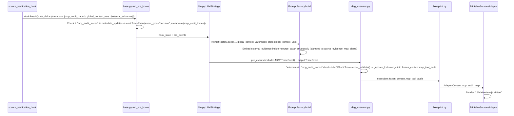

> **STATUS: PENDING / ODOTTAA TOTEUTUSTA (EPIC 89 Hook Integration)**

# Restore Tavily Search & Source Bibliography (MCP Tool Loop Re-Integration)

> **SSOT Plan — Consolidates all planning from conversations `ba5e9168` (original audit), `55d4dd19` (initial plan), `da0f63a5` (Tier 0 Research Analysis), and `a103066d` (Tier 8 Feature & Scope Audit).**
> **Epic**: EPIC 89 Phase 2 Follow-On: Hook Integration

<required_context_rules>
  <rule>@[.agents/rules/00-antigravity-core.md]</rule>
  <rule>@[.agents/rules/01-python-backend.md]</rule>
  <rule>@[.agents/rules/02_flutter_desktop.md]</rule>
  <rule>@[.agents/rules/03_seed_vault.md]</rule>
  <rule>@[.agents/rules/05_llm_architecture.md]</rule>
  <knowledge_item>@[ki_god_code_prevention.md]</knowledge_item>
  <knowledge_item>@[ki_workflow_context_governance.md]</knowledge_item>
  <knowledge_item>@[ki_tripartite_pipeline_architecture.md]</knowledge_item>
  <knowledge_item>@[ki_global_config_sovereignty.md]</knowledge_item>
</required_context_rules>

<anti_targets>
- Do NOT introduce parallel DTOs or duplicate models (One Concept = One Schema).
- Do NOT use fallback default dictionaries `{}` or `.get(..., "")` in domain logic (Universal Fail-Fast).
- Do NOT use raw string concatenation on prompt payloads (`user_payload = f"{user_payload}\n\n{evidence_xml}"` ban). All XML/context assembly MUST happen structurally inside `PromptFactory` / `PromptCompiler`.
- Do NOT hardcode model provider configs inline (all LLM client creation must route through `LLMClient.from_strategy()`).
- Do NOT edit live runtime database files directly (mutate `seed_data.json` and sync via `run_seed.py local`).
- Do NOT directly `.append()` to `frozen_ctx` lists (violates `frozen_state_mutability` and creates concurrency race conditions).
- Do NOT add monolithic private helpers downwards into existing files (`private_helper_bloat_ban`). Extract outwards into dedicated modules if needed.
- Do NOT swallow MCPAuditTrace validation errors or insert loose raw dicts into FrozenContext (Pydantic Strict Nirvana & Fail-Fast).
- Do NOT modify files exceeding 300 lines (`llm.py`, `dag_executor.py`) without mathematically verifying AST node boundaries via `ast.parse` (`ast_boundary_verification_mandate`).
- Do NOT defer technical debt in touched target files (`touched_scope_tech_debt_mandate`). Clean all 1-hop debt in Phase 1.
</anti_targets>

## Problem Statement

Steps `sp_76eedbc020274f66` (Faktantarkistaja) and `sp_6f40b964895c426b` (Falsifier) declare `"allowed_mcp_tools": ["mcp_tavily_search"]` and `PromptCompiler.generate_mcp_instruction()` injects the `[SYSTEM: DYNAMIC TOOL AUTOMATION]` directive into the prompt. However, **no production code calls `execute_tool_loop()`** since `chunk_worker.py` was deleted on 2026-07-16. The `TDAEngine` and `LLMStrategy` execute LLM tasks directly, bypassing MCP tool dispatch entirely. As a result, `frozen_context.mcp_tool_audit` is always empty, and `PrintableSourcesAdapter` never renders the `### Lähdeluettelo ja viitteet` section.

Furthermore, a second critical disconnection was discovered during the Tier 8 audit: the **`prior_analysis` data pipe** between Guard (`sp_ddb7cf7c8a0245d4`) and Faktantarkistaja (`sp_76eedbc020274f66`) is broken in `seed_data.json` (the workflow DAG node `sr_02b7cc1e7c2a4a62` lacks the `"prior_analysis": "$steps.sr_0f7947ec7007498c"` mapping). Consequently, the Fact Checker does not receive Guard's narrative analysis to extract claims from.

### Root Cause Chain & Architecture Context

1. **Tool Execution Disconnection**: `chunk_worker.py` (deleted 2026-07-16) previously executed the tool loop. `TDAEngine` + `EnrichedDagExecutor` replaced it for atom-level matrix calculations, leaving tool dispatch orphaned.
2. **Hook Implementation & Discovery State**: `source_verification_hook.py` is registered with `@hook_registry.register("source_verification")` and imported in `backend_v2/hooks/__init__.py`. However, it currently uses loose dictionary serialization (`"verified_sources": _create_empty_verification_result()`) rather than returning standard Event Sourcing envelopes (`metadata: {"mcp_audit_traces": [...]}` and `global_context_vars: {"external_evidence": "..."}`), and `SourceVerificationService` has not been connected to `ToolDispatcher` or cleaned of legacy anti-patterns.
3. **Broken Two-Stage Verification Pipeline**: In the original design, Guard analyzed raw texts, and Faktantarkistaja received Guard's summary as `prior_analysis`, extracted verifiable claims (`blk_033180746a954415`), ran web searches (`TavilyTool`), and scored Epistemic Humility (`blk_22e3598e06414409`). The missing `input_mappings` entry in workflow DAG node `sr_02b7cc1e7c2a4a62` broke this chain.
4. **Studio UI Terminology Gap — "Kontekstiankkurointi" (Context Anchoring)**: In Studio's `WorkflowStepCard`, the control enabling `$steps.*` forwarding was named *"Edeltävien askeleiden tekstiyhteenvedot"*, which is passive and misses the cognitive reality. The refined term **"Kontekstiankkurointi" (Context Anchoring)** communicates the exact psychological and agentic mechanism: anchoring an agent's reasoning framework to a prior specialist's findings for cross-examination, falsification, and peer-review (versus unanchored independent assessment).

### Architecture Decision

> [!IMPORTANT]
> **Hook-based Pre-Engine Integration & Pipeline Reconnection**, adhering strictly to Tripartite Pipeline and 3-Zone Workflow Governance:

1. **Pre-Hook Phase**: `source_verification_hook` runs as a pre-hook on Faktantarkistaja/Falsifier steps. It extracts claims from the step's input context (including `prior_analysis`) and dispatches searches via `ToolDispatcher` -> `TavilyTool`.
2. **Evidence Injection (Pure Prompt Architecture)**: The hook returns evidence XML in `state_delta["global_context_vars"]["external_evidence"]`. `PromptFactory.build()` takes `global_context_vars` as an explicit direct parameter (without any `PromptCompiler.compile()` proxy indirection) and places `<external_evidence>` deterministically inside `<source_data>` in `user_payload`, truncated to `settings.source_evidence_max_chars`. `PromptPayload` remains completely immutable (`@dataclass(frozen=True)`), eliminating raw string concatenation in `llm.py`.
3. **Audit Persistence & Strict Event Sourcing in `base.py`**: `MCPAuditTrace` dictionaries are returned in `state_delta["metadata"]["mcp_audit_traces"]`. In `base.py`'s `run_pre_hooks()`, if `"mcp_audit_traces" in metadata_updates and metadata_updates["mcp_audit_traces"]`, a `TraceEvent(step_name=step.id, event_type="decision", content={"mcp_audit_traces": metadata_updates["mcp_audit_traces"]}, metadata={"mcp_audit_traces": metadata_updates["mcp_audit_traces"]})` is automatically appended to `emitted_events`. `LLMNodeStrategy` remains 100% decoupled from MCP audit tracing and never performs dictionary indexing on `hook_state.metadata`, completely eliminating `KeyError` / `NullReference` risks.
4. **Thread-Safe Trace Accumulation, Lock Consolidation & Strict Fail-Fast Validation in `dag_executor.py`**: `dag_executor.py`'s `run_step_wrapper` moves the formerly-unsynchronized event processing loop (L693-L703: `exec_record.execution_trace.append(evt)`, `projector.apply_delta(evt)`, and context variable updates) INSIDE `async with _update_lock:`. When encountering an event with `evt.metadata and "mcp_audit_traces" in evt.metadata and evt.metadata["mcp_audit_traces"]`, every raw trace is explicitly validated via `MCPAuditTrace.model_validate(raw)`. If a `ValidationError` occurs, it is logged with `ErrorCodes.VALIDATION_FAILED` and raises `AppException(message=f"Failed to validate MCP audit traces for step '{step_id}': {val_err}", status_code=500, details={"error_code": ErrorCodes.VALIDATION_FAILED.value, ...})` (Fail-Fast). Validated traces are merged into `exec_record.frozen_context.mcp_tool_audit` under that exact same `_update_lock` critical section using `model_copy(update=...)`, eliminating race conditions and redundant double-lock acquisitions.
5. **Downstream (zero changes needed)**: `blueprint.py` -> `AdapterContext.mcp_audit_map` -> `PrintableSourcesAdapter` already renders sources correctly.
6. **Studio UI Context Anchoring Alignment**: Align localization keys (`app_fi.arb` and `app_en.arb`) with **"Kontekstiankkurointi" (Context Anchoring)** to clearly explain the cognitive impact of binding prior step narratives.



---

## User Review Required

> [!IMPORTANT]
> **SourceVerificationService Technical Debt**: The current service has 12 banned anti-patterns identified by Tier 0 audit (expanded from original 5). All will be cleaned up per Zero Compromise Pledge in Phase 1.

> [!IMPORTANT]
> **`llm.py` Touched Scope Tech Debt (MANDATORY SCOPED BOY SCOUT)**: Per `touched_scope_tech_debt_mandate`, all 7 identified anti-patterns in `llm.py` (L223 debug print, L300-307 metadata mutation, L525-538 silent except and loose parsing, L543-570 getattr duck typing and dead V1 `mcp_tools` iteration) are strictly included in Phase 1 and will be eliminated prior to feature execution.

> [!IMPORTANT]
> **`base.py` Pre-Hook Event Sourcing (AUDITED)**: Per System 2 audit (`feature_audit_mcp_trace_event_null_reference.md`), `base.py.run_pre_hooks()` natively emits `TraceEvent` for `mcp_audit_traces` when present in `metadata_updates`. `LLMNodeStrategy` is completely relieved from touching `hook_state.metadata["mcp_audit_traces"]`, guaranteeing zero `KeyError` / `NullReference` crashes in steps without pre-hooks.

> [!IMPORTANT]
> **In-Memory Hook DI Container (Zero FastAPI Context Coupling)**: Per System 2 audit (`feature_audit_tavily_hook_di_context.md`), hooks run inside asynchronous background workers (`DAGExecutor` / `LLMNodeStrategy`) without FastAPI HTTP request context. `source_verification_hook` strictly uses the injected in-memory `HookDependencies` parameter (`deps: HookDependencies`), enforcing explicit Fail-Fast validation on `deps.system_repo`. No FastAPI `Depends()` or `backend_v2.api.dependencies` imports are permitted.

> [!IMPORTANT]
> **MCPAuditTrace Pydantic Validation & RFC 7807 Fail-Fast**: Per System 2 audit (`feature_audit_mcp_pydantic_validation.md`), `dag_executor.py` must explicitly validate all raw trace dictionaries using `MCPAuditTrace.model_validate(raw)`. If validation fails, it must NOT fall back or drop traces silently; it must log `ErrorCodes.VALIDATION_FAILED` and raise `AppException(message=f"Failed to validate MCP audit traces for step '{step_id}': {val_err}", status_code=500, details={"error_code": ErrorCodes.VALIDATION_FAILED.value, ...})`. Validated traces are accumulated into `frozen_context.mcp_tool_audit` under `_update_lock`.

> [!IMPORTANT]
> **`seed_data.json` Mutation**: Adding `"source_verification_hook"` to `pre_hooks` arrays of two steps, and restoring `"prior_analysis": "$steps.sr_0f7947ec7007498c"` in workflow DAG node `sr_02b7cc1e7c2a4a62`. This follows the `03_seed_vault.md` Bounded Mutation Protocol.

> [!CAUTION]
> **Tier 0 Research Mutation (2026-08-23): Critical Evidence Data Path Fix**. Original plan referenced `llm_context_data['global_context_vars']` for evidence injection — physically impossible as `ContextBuilder.build()` does NOT include `global_context_vars` in `llm_context_data`. Fixed: `PromptFactory.build()` now receives `global_context_vars` as an explicit parameter (bypassing any unnecessary `PromptCompiler` indirection). Also added: `source_evidence_max_chars` token budget, `prompt_factory.py` touched-file tech debt, second `getattr` instance at L501-L503, and session handover boundary between Phase 2→3. See `research_analysis_tavily_bibliography.md` for full audit.

> [!CAUTION]
> **Tier 0 Research Mutation V2 (2026-08-23): 3 Critical Plan Fixes**. (A) **BLOCKER**: Phase 4 settings dissolved into new Step 1.0 — settings must exist before Steps 1.1/1.4 reference them. (B) **HIGH**: Step 1.1 `_verify_single_claim` must use Circuit Breaker degradation (return INCONCLUSIVE) for per-claim Tavily API failures, not blanket Fail-Fast (per `anti_fragility_boundaries` rule). (C) **MEDIUM**: Mid-Phase-1 session checkpoint added between Steps 1.4→1.5. See `research_analysis_tavily_bibliography_v2.md` for full audit.

> [!CAUTION]
> **Tier 0 Research Mutation V3 (2026-08-23): Lock Consolidation, Ghost Execution & XML Injection Hardening**.
> 1. **DAG Executor Event Loop Lock Consolidation**: In `dag_executor.py` (`run_step_wrapper`), the unsynchronized for-loop at L693-L703 (`exec_record.execution_trace.append(evt)`, `projector.apply_delta(evt)`, and context updates) is merged inside `async with _update_lock:`. MCP audit trace validation and merging into `exec_record.frozen_context.mcp_tool_audit` occurs within this single critical section, eliminating race conditions and redundant double-lock acquisitions.
> 2. **Ghost Execution Prevention & Context Caching in Source Verification**:
>    - `source_verification_service.py`: Enforce static module-level `_EXTRACTION_SYSTEM_PROMPT` and `_VERIFICATION_SYSTEM_PROMPT` for 100% Gemini Context Caching. Wrap untrusted text in `<source_data>` and `<claim>` with `html.escape()`. Enforce `source_verification_min_text_length` setting check to short-circuit ghost executions before initializing clients.
>    - `source_verification_hook.py`: For empty, whitespace, or sub-threshold inputs (`len(text) < settings.source_verification_min_text_length`), return a deterministic empty result `HookResult(success=True, state_delta={"metadata": {"mcp_audit_traces": []}, "global_context_vars": {"external_evidence": ""}})` (avoiding loose `{}` fallbacks while maintaining state schema parity). Text consolidation must avoid `isinstance(p, str)` after typed extraction (`p is not None and p.strip()`).
> 3. **Settings Sovereignty**: Step 1.0 defines `source_verification_min_text_length: Annotated[int, Field(...)] = 15` alongside `source_extraction_max_chars` (30000) and `source_evidence_max_chars` (8000).
> 4. **Mandatory Test Fixture Update**: Step 5.2 mandates updating the `service` fixture in `test_source_verification_service.py` to supply mock constructor dependencies, with negative tests for sub-threshold text and XML escaping.

## 5-Column Architectural Directives Table

| 1. Kohdealue & Skoopit (Target Scope) | 2. 🚫 KIELLETTY PURKKA (Eradicated Duct-Tape) | 3. 🎯 TEE NÄIN (Approved Best Practice) | 4. ✂️ KARSITTU YLISUUNNITTELU (Pruned Over-Engineering) | 5. 🔒 VERIFIOINTI & FAIL-FAST (Proof Anchor) |
| :--- | :--- | :--- | :--- | :--- |
| **@[backend_v2/settings.py]** | Kovakoodatut merkkimäärärajat (`MAX_EXTRACTION_CHARS = 30000`, `8000`) tai paikalliset taikanumerot palveluluokissa. | Määritellään `source_extraction_max_chars` (30000), `source_evidence_max_chars` (8000) ja `source_verification_min_text_length` (15) Pydantic Settings -kenttinä käyttäen `Annotated[int, Field(...)]`. | Ei dynaamisia token-laskureita tai erillisiä konfiguraatiopalveluita; keskitetty SSOT. | `uv run python scripts/backend_audit_loop.py backend_v2/settings.py --test` |
| **@[backend_v2/services/source_verification_service.py]** | `getattr(llm_client)`, `_ensure_initialized`, suora `tavily_search` -kutsu ilman ToolDispatcheria, loose `.get()`, silent `except Exception: pass`, suojaamaton XML-injektio. | Puhdas konstruktori-DI (`__init__(llm_task_executor, llm_client)`), staattiset vakiokehotteet `_EXTRACTION_SYSTEM_INSTRUCTION` ja `_VERIFICATION_SYSTEM_INSTRUCTION` (100% Context Caching), `html.escape()`, `ToolDispatcher.execute_tool`, Circuit Breaker yksittäisille hakuvirheille (`INCONCLUSIVE`). | Tiedoston kutistaminen < 150 riviin; karsitaan kaikki `_ensure_initialized` ja runtime-alustushaarautumat. | `uv run python scripts/backend_audit_loop.py backend_v2/services/source_verification_service.py --test` |
| **@[backend_v2/hooks/source_verification_hook.py]** | Palautetaan löysä sanakirja `{"verified_sources": ...}`, `\n\n` literaalibugi (`\\n\\n`), `isinstance(p, str)` duck-typing, FastAPI `Depends` -importit taustaprosessissa. | Rekisteröidään `@hook_registry.register(name="source_verification_hook")`, `deps.system_repo` Fail-Fast -tarkastus, ghost execution -kytkin palauttaa `HookResult(success=True, state_delta={"metadata": {"mcp_audit_traces": []}, "global_context_vars": {"external_evidence": ""}})`. | Ei ad-hoc hook-tehtaita tai ylimääräisiä kääreluokkia; suora asynkroninen hook-funktio. | `uv run python scripts/backend_audit_loop.py backend_v2/hooks/source_verification_hook.py --test` |
| **@[backend_v2/services/orchestrator/strategies/llm_execution/prompt_factory.py]** | `PromptCompiler.compile()` proxy-indirektiot, raw f-string payload -mutaatiot `llm.py`:ssä, `llm_context_data.get('global_context_vars')` -arvailu. | `global_context_vars: dict[str, Any] | None = None` suora parametri `PromptFactory.build()`:iin, `<external_evidence>` upotus `<source_data>`:n sisälle leikattuna `settings.source_evidence_max_chars` -rajaan, `PromptPayload` säilyy immutaabelina (`frozen=True`). | Ei uusia `EvidencePromptBlock` -tietokantamalleja tai rinnakkaisia prompt-rakentajia. | `uv run python scripts/backend_audit_loop.py backend_v2/services/orchestrator/strategies/llm.py --test` |
| **@[backend_v2/services/orchestrator/strategies/base.py] & @[backend_v2/services/orchestrator/strategies/llm.py]** | `hook_state.metadata["mcp_audit_traces"]` suora indeksointi `llm.py`:ssä (`KeyError` / `NullReference`), `getattr(step, 'input_mappings')`, dead V1 `mcp_tools` duck-typing silmukat, debug printit. | `base.py.run_pre_hooks()` emittoi automaattisesti `TraceEvent(event_type="decision", metadata={"mcp_audit_traces": ...})`, `LLMNodeStrategy` pysyy täysin erillään hook-metadatasta, siirretty `hook_state.global_context_vars` suoraan `PromptFactory.build()`:iin. | Ei erillistä MCP-tapahtumakuuntelijaa tai väyläkerrosta; hyödynnetään olemassa olevaa `TraceEvent` Event Sourcingia. | `uv run python scripts/backend_audit_loop.py backend_v2/services/orchestrator/strategies/llm.py --test` |
| **@[backend_v2/services/orchestrator/dag_executor.py]** | Lukitsematon event-silmukka (L693-L703), raw dictien työntäminen `frozen_context`iin ilman validointia, `frozen_context.mcp_tool_audit.append()`, hiljainen virheiden nielentä. | Koko event-loop (L693-L711) siirretty `async with _update_lock:` -lohkon sisälle, `MCPAuditTrace.model_validate(raw)` pydantic-validointi Fail-Fastilla (`AppException(ErrorCodes.VALIDATION_FAILED)`), `model_copy` -päivitys ilman in-place mutaatioita. | Lock-konsolidointi (yksi `_update_lock` kahden erillisen lukituksen sijaan), ei ylimääräistä audit-storage -luokkaa. | `uv run python scripts/backend_audit_loop.py backend_v2/tests/unit/services/orchestrator/test_dag_executor_mcp_audit.py --test` |
| **@[backend_v2/seed/seed_data.json] & @[client_app_v2/lib/l10n/app_fi.arb]** | Puuttuva `prior_analysis` -datajohto workflow-solmussa `sr_02b7cc1e7c2a4a62`, passiivinen "Edeltävien askeleiden tekstiyhteenvedot" -termi. | Bounded Mutation Protocol, `"source_verification_hook"` lisätty `pre_hooks` -taulukkoihin, `"prior_analysis": "$steps.sr_0f7947ec7007498c"` palautettu, Studio UI lokalisointi "Kontekstiankkurointi" (Context Anchoring). | Ei uusia tietokantatauluja tai UI-widgettejä; käytetään olemassa olevaa `pre_hooks` ja `input_mappings` -arkkitehtuuria. | `uv run python scripts/flutter_audit_loop.py client_app_v2/test/features/studio/views/widgets/workflow/workflow_step_card_test.dart` |

---

## Target Files and Modification Categories

- **[MODIFY]** @[backend_v2/services/source_verification_service.py#L30-L279]
- **[MODIFY]** @[backend_v2/models/domain/source_verification.py#L61-L79]
- **[MODIFY]** @[backend_v2/hooks/source_verification_hook.py#L1-L86]
- **[MODIFY]** @[backend_v2/hooks/__init__.py#L22-L42]
- **[MODIFY]** @[backend_v2/services/orchestrator/strategies/llm_execution/prompt_factory.py#L56-L216]
- **[MODIFY]** @[backend_v2/services/orchestrator/strategies/base.py#L180-L210]
- **[MODIFY]** @[backend_v2/services/orchestrator/strategies/llm.py#L107-L781]
- **[MODIFY]** @[backend_v2/services/orchestrator/dag_executor.py#L560-L766]
- **[MODIFY]** @[backend_v2/seed/seed_data.json#L7694-L7698] & @[backend_v2/seed/seed_data.json#L8214-L8217] & @[backend_v2/seed/seed_data.json#L8564-L8567]
- **[MODIFY]** @[client_app_v2/lib/l10n/app_fi.arb#L1458-L1459]
- **[MODIFY]** @[client_app_v2/lib/l10n/app_en.arb#L2120-L2121]
- **[MODIFY]** @[client_app_v2/test/features/studio/views/widgets/workflow/workflow_step_card_test.dart#L237-L239]
- **[MODIFY]** @[backend_v2/settings.py#L140-L230]
- **[MODIFY]** @[backend_v2/tests/unit/services/test_source_verification_service.py]
- **[MODIFY]** @[backend_v2/tests/unit/hooks/test_source_verification_hook.py]
- **[NEW]** @[backend_v2/tests/unit/services/orchestrator/test_dag_executor_mcp_audit.py]

---

```xml
<execution_protocol>
  <dod_checklist>
    - [ ] `source_extraction_max_chars` (30000), `source_evidence_max_chars` (8000), and `source_verification_min_text_length` (15) defined in `backend_v2/settings.py` with `Annotated[int, Field(...)]`.
    - [ ] `SourceVerificationService` cleaned of all 12 anti-patterns in `backend_v2/services/source_verification_service.py` (strict constructor DI, static prompts `_EXTRACTION_SYSTEM_PROMPT` / `_VERIFICATION_SYSTEM_PROMPT`, XML `html.escape()`, ghost execution min length short-circuit, `ToolDispatcher.execute_tool` integration, circuit breaker on per-claim search failures).
    - [ ] `audit_traces: list[MCPAuditTrace]` field added to `SourceVerificationResultDTO` in `backend_v2/models/domain/source_verification.py`.
    - [ ] `source_verification_hook` registered with `@hook_registry.register(name="source_verification_hook")` in `backend_v2/hooks/source_verification_hook.py`, exported in `backend_v2/hooks/__init__.py`, with `HookDependencies.system_repo` Fail-Fast validation, fixed newline literal `\n\n`, and ghost execution short-circuit returning `HookResult(success=True, state_delta={"metadata": {"mcp_audit_traces": []}, "global_context_vars": {"external_evidence": ""}})`.
    - [ ] `PromptFactory.build()` in `backend_v2/services/orchestrator/strategies/llm_execution/prompt_factory.py` updated with `global_context_vars: dict[str, Any] | None = None` parameter, embedding `<external_evidence>` inside `<source_data>` clamped to `settings.source_evidence_max_chars`, and cleaned of all touched tech debt (L173 `b.slug`, L88-L133 timestamp extraction, L140-L169 `find_value_by_key` God Method replaced with `_extract_mechanical_anchors`).
    - [ ] `NodeStrategy.run_pre_hooks()` in `backend_v2/services/orchestrator/strategies/base.py` emits `TraceEvent(step_name=step.id, event_type="decision", content={"mcp_audit_traces": metadata_updates["mcp_audit_traces"]}, metadata={"mcp_audit_traces": metadata_updates["mcp_audit_traces"]})` when `mcp_audit_traces` is present in `metadata_updates`.
    - [ ] `LLMNodeStrategy.execute()` in `backend_v2/services/orchestrator/strategies/llm.py` cleaned of all 7 anti-patterns (L223 debug print removed, L300-307 metadata mutation fixed, L524-539 loose parsing replaced with typed snapshot extraction, L501-L503 and L543 `getattr(step, 'input_mappings')` replaced with direct access, L548-558 dead `mcp_tools` loop removed, L569-570 fallbacks removed, L417-L431 passing `hook_state.global_context_vars` directly to `PromptFactory.build`).
    - [ ] `DAGExecutor.run_step_wrapper()` in `backend_v2/services/orchestrator/dag_executor.py` consolidates unsynchronized event loop (L693-L703) inside `async with _update_lock:`, explicitly validates raw MCP audit traces via `MCPAuditTrace.model_validate(raw)` with RFC 7807 Fail-Fast (`AppException(ErrorCodes.VALIDATION_FAILED)`), and merges traces into `exec_record.frozen_context.mcp_tool_audit` via immutable `model_copy`.
    - [ ] `seed_data.json` updated with `"source_verification_hook"` in `pre_hooks` of Faktantarkistaja (`sp_76eedbc020274f66`) and Falsifier (`sp_6f40b964895c426b`), and `"prior_analysis": "$steps.sr_0f7947ec7007498c"` restored in workflow DAG node `sr_02b7cc1e7c2a4a62` following Bounded Mutation Protocol.
    - [ ] Studio UI localization keys (`app_fi.arb`, `app_en.arb`) updated to "Edeltävien askeleiden kontekstiankkurointi (Valinnainen)" / "Prior Step Context Anchoring (Optional)" and widget test assertions updated in `workflow_step_card_test.dart`.
    - [ ] ISTQB unit tests implemented in `test_source_verification_hook.py`, `test_source_verification_service.py` (with updated constructor fixture and negative cases), and `test_dag_executor_mcp_audit.py`.
    - [ ] Quality gates pass: `backend_audit_loop.py` and `flutter_audit_loop.py`.
  </dod_checklist>

  <phase id="1" name="Pre-Implementation Technical Debt Cleanups &amp; Hook Registration">
    <step id="1.0" target="backend_v2/settings.py">
      <description>Add source_extraction_max_chars, source_evidence_max_chars, and source_verification_min_text_length settings as prerequisite for Phase 1 service cleanups. This step MUST execute first because Steps 1.1, 1.3, and 1.4 reference these settings.</description>
      <constraint invariant="central_config_sovereignty">Define settings in Settings class with Annotated[int, Field(description=...)].
      - source_extraction_max_chars: Annotated[int, Field(description="Maximum character budget for input text truncation in source claim extraction.")] = 30000.
      - source_evidence_max_chars: Annotated[int, Field(description="Maximum character budget for evidence XML injected into prompts to prevent token explosion.")] = 8000.
      - source_verification_min_text_length: Annotated[int, Field(description="Minimum character length of input text required to run source verification; payloads below this threshold short-circuit to prevent ghost executions.")] = 15.</constraint>
    </step>

    <step id="1.1" target="backend_v2/services/source_verification_service.py">
      <description>Clean all 12 banned anti-patterns in SourceVerificationService per Zero Compromise Pledge. Enforce static module-level prompt directives, XML escaping, ghost execution threshold, and strict constructor DI. Shrink file to &lt; 150 lines.</description>
      <constraint invariant="strict_configuration_segregation">Move MAX_EXTRACTION_CHARS (L27) to settings.py as source_extraction_max_chars.</constraint>
      <constraint invariant="inline_imports_ban">Move LLMClient, LLMProviderConfig, PromptCompiler imports to module top level.</constraint>
      <constraint invariant="the_zero_compromise_pledge">Replace getattr(llm_task_executor, 'llm_client', None) with strict constructor injection: __init__(self, llm_task_executor: LLMTaskExecutor, llm_client: LLMClient).</constraint>
      <constraint invariant="the_no_legacy_mandate">Remove _ensure_initialized completely.</constraint>
      <constraint invariant="srp_mandate">Replace direct tavily_search call with await DISPATCHER.execute_tool(tool_id=TAVILY_TOOL_ID, query=query, step_name='source_verification', target_language='en', llm_client=self.llm_client, claim_text=claim.claim_text).</constraint>
      <constraint invariant="strict_pydantic_v2_rust">Replace isinstance() and .get() duck-typing with strict typed execute_chat_task() evaluation.</constraint>
      <constraint invariant="ephemeral_caching_topology">Define static module-level system directives _EXTRACTION_SYSTEM_PROMPT and _VERIFICATION_SYSTEM_PROMPT to guarantee 100% Gemini Context Caching.</constraint>
      <constraint invariant="role_segregation_and_fencing">Wrap untrusted text payloads inside &lt;source_data&gt; and &lt;claim&gt; with html.escape() to eliminate XML prompt injection vulnerabilities.</constraint>
      <constraint invariant="ghost_execution_prevention">Enforce min length check (len(text.strip()) &lt; get_settings().source_verification_min_text_length) in run_full_verification to return empty SourceVerificationResultDTO immediately without invoking LLM or search tools.</constraint>
      <constraint invariant="anti_fragility_boundaries">Split error handling into two tiers: (A) Structural/configuration failures (_extract_source_claims L113 except Exception, missing client initialization) MUST Fail-Fast with AppException(ErrorCodes.FETCH_FAILED). (B) Per-claim Tavily API failures in _verify_single_claim (HTTP 429, timeouts, individual search crashes) MUST log ErrorCodes.FETCH_FAILED with structured trace (logger.error with error_code extra) and return SourceVerificationStatus.INCONCLUSIVE for THAT claim only — this is the correct Circuit Breaker degradation pattern for external API boundaries.</constraint>
    </step>

    <step id="1.2" target="backend_v2/models/domain/source_verification.py">
      <description>Add audit_traces field to SourceVerificationResultDTO.</description>
      <constraint invariant="domain_model_purity_mandate">Add audit_traces: Annotated[list[MCPAuditTrace], Field(description="Audit traces of external searches executed.")] = Field(default_factory=list).</constraint>
    </step>

    <step id="1.3" target="backend_v2/hooks/source_verification_hook.py">
      <description>Register hook, fix literal newline bug, add polymorphic payload extraction without isinstance duck-typing, add ghost execution short-circuit with deterministic empty DTO envelope, enforce HookDependencies.system_repo Fail-Fast validation, and export in hooks/__init__.py.</description>
      <constraint invariant="hook_registration_mandate">Decorate with @hook_registry.register(name="source_verification_hook").</constraint>
      <constraint invariant="polymorphic_dag_payload_handling">Extract text polymorphically from state.inputs (str, dict, list) and fix literal \\n\\n bug to clean \n\n. Avoid isinstance(p, str) anti-pattern after extraction (use p is not None and p.strip()).</constraint>
      <constraint invariant="ghost_execution_prevention">If consolidated text is empty, whitespace-only, or len(text) &lt; get_settings().source_verification_min_text_length, immediately return HookResult(success=True, state_delta={"metadata": {"mcp_audit_traces": []}, "global_context_vars": {"external_evidence": ""}}) without initializing services or calling external APIs.</constraint>
      <constraint invariant="di_container_mandate">Initialize SourceVerificationService using the in-memory HookDependencies container parameter (deps.system_repo) with explicit Fail-Fast validation (if not deps.system_repo: raise AppException(message="Missing system_repo in HookDependencies", status_code=500, details={"error_code": ErrorCodes.CONFIGURATION_ERROR.value})), completely decoupled from FastAPI HTTP request context. Instantiate LLMClient.from_strategy('fast', repository=deps.system_repo, pipeline_name='source_verification') and LLMTaskExecutor(PromptCompiler()).</constraint>
      <constraint invariant="immutable_dto_contract">Return HookResult with state_delta containing metadata.mcp_audit_traces (list[dict]) and global_context_vars.external_evidence (str).</constraint>
    </step>

    <step id="1.4" target="backend_v2/services/orchestrator/strategies/llm_execution/prompt_factory.py">
      <description>Add global_context_vars parameter directly to PromptFactory.build(), embed external_evidence XML structurally inside &lt;source_data&gt;, and eliminate ALL prompt_factory.py technical debt per Scoped Boy Scout mandate.</description>
      <constraint invariant="pure_prompt_architecture">Add new parameter `global_context_vars: dict[str, Any] | None = None` directly to PromptFactory.build(). Extract external_evidence from global_context_vars (NOT llm_context_data) and embed directly inside &lt;source_data&gt; after xml_ctx, truncated to settings.source_evidence_max_chars. Root cause: llm_context_data is built by ContextBuilder.build() from state_data/inputs only — it does NOT contain global_context_vars.</constraint>
      <constraint invariant="the_zero_compromise_pledge">Clean L173 getattr(b, 'slug', None) → use b.slug directly (PromptBlock has typed slug field).</constraint>
      <constraint invariant="fail_fast_hydration_mandate">Refactor L88-L133 deep .get() and or fallback chains for execution_time extraction into a deterministic _resolve_execution_time(llm_context_data, execution_id) method.</constraint>
      <constraint invariant="touched_scope_tech_debt_mandate">Completely delete L140-L169 recursive find_value_by_key God Method (hasattr/isinstance duck-typing). Replace with a deterministic, typed _extract_mechanical_anchors(llm_context_data) helper that extracts performative phrases and text metrics using LinguisticsResultDTO.model_validate() and direct dictionary lookups without hasattr or recursive object traversal.</constraint>
    </step>

    <!-- RECOMMENDED SESSION CHECKPOINT: Steps 1.0-1.4 (settings + service + hook + prompt_factory) should be completed and git-committed before proceeding to Steps 1.5-1.7 (base.py + llm.py + dag_executor.py). Run /tier5-session-handover if the context window is degraded after processing the prompt_factory.py God Method cleanup. -->

    <step id="1.5" target="backend_v2/services/orchestrator/strategies/base.py">
      <description>Add MCP audit TraceEvent emission to NodeStrategy.run_pre_hooks under deterministic membership check.</description>
      <constraint invariant="pre_hook_event_sourcing_mandate">In `run_pre_hooks`, check `if "mcp_audit_traces" in metadata_updates and metadata_updates["mcp_audit_traces"]:` and emit `TraceEvent(step_name=step.id, event_type="decision", content={"mcp_audit_traces": metadata_updates["mcp_audit_traces"]}, metadata={"mcp_audit_traces": metadata_updates["mcp_audit_traces"]})`. This guarantees that pre-events contain the audit traces while keeping LLMNodeStrategy 100% agnostic to hook internals.</constraint>
    </step>

    <step id="1.6" target="backend_v2/services/orchestrator/strategies/llm.py">
      <description>1-Hop Scoped Boy Scout Cleanups: Clean all 7 anti-patterns in LLMNodeStrategy.execute, directly pass hook_state.global_context_vars to PromptFactory.build() without PromptCompiler indirection.</description>
      <constraint invariant="ast_boundary_verification_mandate">Verify line boundaries of LLMNodeStrategy.execute (L107-L781) using ast.parse before editing.</constraint>
      <constraint invariant="touched_scope_tech_debt_mandate">Remove L223 debug print statement if present / ensure zero print statements in module.</constraint>
      <constraint invariant="frozen_state_mutability">Refactor L300-307 metadata mutation to clean dictionary initialization (avoid mutating hook_state.metadata in place).</constraint>
      <constraint invariant="the_duct_tape_ban">Replace L524-539 loose parsing and silent except Exception: pass with typed extraction from projector.snapshot and structured error logging.</constraint>
      <constraint invariant="the_zero_compromise_pledge">Replace BOTH instances of getattr(step, 'input_mappings', None): at L505 (allowed_dynamic_keys) and at L546 (allowed_dynamic_keys extension) with step.input_mappings.keys().</constraint>
      <constraint invariant="the_no_legacy_mandate">Delete dead L551-563 getattr(step, 'mcp_tools', None) duck-typing loops. Derive mcp_prefixes from step_obj.allowed_mcp_tools.</constraint>
      <constraint invariant="zero_service_layer_fallbacks">Replace L569 hook_state.metadata.get() and L573/L644 getattr(step, 'expected_sdui_type') with direct step.expected_sdui_type access.</constraint>
      <constraint invariant="zero_coupling_mandate">Do NOT perform direct subscripting or extraction on hook_state.metadata["mcp_audit_traces"] in LLMNodeStrategy.execute. Pre-events from run_pre_hooks already contain the emitted TraceEvent.</constraint>
      <constraint invariant="pure_prompt_architecture">Pass hook_state.global_context_vars directly to PromptFactory.build(..., global_context_vars=hook_state.global_context_vars) at L420-L435 (eliminating any PromptCompiler.compile proxy method).</constraint>
    </step>

    <step id="1.7" target="backend_v2/services/orchestrator/dag_executor.py">
      <description>Strict Fail-Fast validation and thread-safe accumulation of MCP audit traces in run_step_wrapper under _update_lock, consolidating the entire unsynchronized event loop inside _update_lock.</description>
      <constraint invariant="ast_boundary_verification_mandate">Verify line boundaries of DAGExecutor.run_step_wrapper (L560-L766) using ast.parse before editing.</constraint>
      <constraint invariant="concurrency_lock_mandate">Move the formerly unsynchronized for-loop at L693-L711 (exec_record.execution_trace.append, projector.apply_delta, context_variables update) INSIDE `async with _update_lock:`. Merge the context variable update and MCP trace accumulation into this single critical section to eliminate race conditions and avoid double-locking overhead.</constraint>
      <constraint invariant="deterministic_membership_guard">Check `if evt.event_type == "decision" and evt.metadata and "mcp_audit_traces" in evt.metadata and evt.metadata["mcp_audit_traces"]:` before accessing traces.</constraint>
      <constraint invariant="strict_pydantic_v2_rust">Explicitly validate all raw traces from evt.metadata['mcp_audit_traces'] via MCPAuditTrace.model_validate(raw).</constraint>
      <constraint invariant="rfc7807_dual_reporting_mandate">Catch pydantic.ValidationError during trace parsing, log logger.error with ErrorCodes.VALIDATION_FAILED, and raise AppException(message=f"Failed to validate MCP audit traces for step '{step_id}': {val_err}", status_code=500, details={"error_code": ErrorCodes.VALIDATION_FAILED.value, "step_id": step_id, "validation_errors": val_err.errors()}) to enforce Universal Fail-Fast.</constraint>
      <constraint invariant="frozen_state_mutability">Merge validated MCPAuditTrace objects into exec_record.frozen_context.mcp_tool_audit inside _update_lock using model_copy(update={"frozen_context": exec_record.frozen_context.model_copy(update={"mcp_tool_audit": merged_traces})}). NO direct .append().</constraint>
    </step>
  </phase>

  <phase id="2" name="Seed Data Wiring (Hooks &amp; prior_analysis Data Pipe)">
    <step id="2.1" target="backend_v2/seed/seed_data.json">
      <description>Add source_verification_hook to pre_hooks of Falsifier (sp_6f40b964895c426b) and Faktantarkistaja (sp_76eedbc020274f66).</description>
      <constraint invariant="bounded_mutation_protocol">Execute timestamped backup before edit. multi_replace_file_content at lines L8214-L8217 and L8564-L8567.</constraint>
    </step>

    <step id="2.2" target="backend_v2/seed/seed_data.json">
      <description>Restore prior_analysis input_mapping in workflow DAG node sr_02b7cc1e7c2a4a62.</description>
      <constraint invariant="bounded_mutation_protocol">Insert "prior_analysis": "$steps.sr_0f7947ec7007498c" into input_mappings at L7694-L7698.</constraint>
    </step>
  </phase>

  <!-- SESSION HANDOVER BOUNDARY: Complete Phases 1-2 (backend) in Session 1, then /tier5-session-handover before Phases 3-5 (frontend + settings + tests) -->

  <phase id="3" name="Studio UI Localization Refinement">
    <step id="3.1" target="client_app_v2/lib/l10n/app_fi.arb">
      <description>Update studioWorkflowPriorStepsTitle and Subtitle to 'Edeltävien askeleiden kontekstiankkurointi (Valinnainen)'.</description>
      <constraint invariant="dual_axis_localization_architecture">Update Finnish localization keys at L1458-L1459.</constraint>
    </step>

    <step id="3.2" target="client_app_v2/lib/l10n/app_en.arb">
      <description>Update studioWorkflowPriorStepsTitle and Subtitle to 'Prior Step Context Anchoring (Optional)'.</description>
      <constraint invariant="dual_axis_localization_architecture">Update English localization keys at L2120-L2121.</constraint>
    </step>

    <step id="3.3" target="client_app_v2/test/features/studio/views/widgets/workflow/workflow_step_card_test.dart">
      <description>Update widget test string assertions to match refined 'Edeltävien askeleiden kontekstiankkurointi (Valinnainen)' key values.</description>
      <constraint invariant="zero_tolerance_audit_loop">Update widget test expectation at L237-L239.</constraint>
    </step>
  </phase>

  <!-- Phase 4 (Central Settings SSOT Enhancement) DISSOLVED into Step 1.0 per Tier 0 Research V2 dependency ordering fix. -->

  <phase id="5" name="ISTQB Testing &amp; Verification Gate">
    <step id="5.1" target="backend_v2/tests/unit/hooks/test_source_verification_hook.py">
      <description>Implement 7 unit tests covering happy path, prior_analysis claims, empty input, malformed input, missing system_repo in HookDependencies (Fail-Fast), tool failure Fail-Fast, and tool call cap boundary.</description>
      <constraint invariant="anti_happy_path_mandate">Verify both success paths and failure paths (AppException on missing deps.system_repo, AppException on ToolDispatcher failure, empty dict handling).</constraint>
    </step>

    <step id="5.2" target="backend_v2/tests/unit/services/test_source_verification_service.py">
      <description>Update existing service tests with mandatory fixture update for injected dependencies, mock ToolDispatcher.execute_tool instead of tavily_search, and add negative/edge test cases.</description>
      <constraint invariant="mandatory_fixture_update">Update the `service` fixture to provide mock dependencies matching the new SourceVerificationService.__init__ constructor signature.</constraint>
      <constraint invariant="anti_happy_path_mandate">Add unit test cases for empty text, whitespace text, sub-threshold text (&lt; settings.source_verification_min_text_length), and XML special character payload escaping (html.escape verification).</constraint>
      <constraint invariant="regression_defense">Verify zero test regressions across existing suite.</constraint>
    </step>

    <step id="5.3" target="backend_v2/tests/unit/services/orchestrator/test_dag_executor_mcp_audit.py">
      <description>Implement ISTQB negative tests verifying that malformed MCPAuditTrace payloads in event.metadata raise AppException with ErrorCodes.VALIDATION_FAILED and that valid traces are merged under _update_lock without mutating frozen instances.</description>
      <constraint invariant="anti_happy_path_mandate">Test valid MCPAuditTrace list merge, invalid dict payload (missing required field) triggering AppException with ErrorCodes.VALIDATION_FAILED, and non-list payload handling.</constraint>
    </step>
  </phase>

  <validation_gate>
    <action>Execute Settings &amp; Domain Model Audit: `uv run python scripts/backend_audit_loop.py backend_v2/settings.py --test`</action>
    <action>Execute Source Verification Service Audit: `uv run python scripts/backend_audit_loop.py backend_v2/services/source_verification_service.py --test`</action>
    <action>Execute Source Verification Hook Audit: `uv run python scripts/backend_audit_loop.py backend_v2/hooks/source_verification_hook.py --test`</action>
    <action>Execute Prompt Factory &amp; LLM Strategy Audit: `uv run python scripts/backend_audit_loop.py backend_v2/services/orchestrator/strategies/llm.py --test`</action>
    <action>Execute DAG Executor Audit: `uv run python scripts/backend_audit_loop.py backend_v2/services/orchestrator/dag_executor.py --test`</action>
    <action>Execute Hook Unit Tests: `uv run python scripts/backend_audit_loop.py backend_v2/tests/unit/hooks/test_source_verification_hook.py --test`</action>
    <action>Execute DAG Executor MCP Audit Tests: `uv run python scripts/backend_audit_loop.py backend_v2/tests/unit/services/orchestrator/test_dag_executor_mcp_audit.py --test`</action>
    <action>Execute Flutter Localization &amp; Widget Test: `uv run python scripts/flutter_audit_loop.py client_app_v2/test/features/studio/views/widgets/workflow/workflow_step_card_test.dart`</action>
  </validation_gate>
</execution_protocol>
```

---

## Verification Plan

### Automated Tests

```powershell
uv run python scripts/backend_audit_loop.py backend_v2/hooks/source_verification_hook.py --test
uv run python scripts/backend_audit_loop.py backend_v2/services/source_verification_service.py --test
uv run python scripts/backend_audit_loop.py backend_v2/services/orchestrator/strategies/llm.py --test
uv run python scripts/backend_audit_loop.py backend_v2/services/orchestrator/dag_executor.py --test
uv run python scripts/backend_audit_loop.py backend_v2/tests/unit/hooks/test_source_verification_hook.py --test
uv run python scripts/backend_audit_loop.py backend_v2/tests/unit/services/orchestrator/test_dag_executor_mcp_audit.py --test
uv run python scripts/flutter_audit_loop.py client_app_v2/test/features/studio/views/widgets/workflow/workflow_step_card_test.dart
```

### Manual Verification

1. Run workflow execution with Faktantarkistaja step.
2. Verify `frozen_context.mcp_tool_audit` contains `MCPAuditTrace` entries with `source_urls`.
3. Verify SDUI report output renders `### Lähdeluettelo ja viitteet` with clickable source URLs.
4. Open Studio Workflow View and verify header displays *"Edeltävien askeleiden kontekstiankkurointi (Valinnainen)"*.
