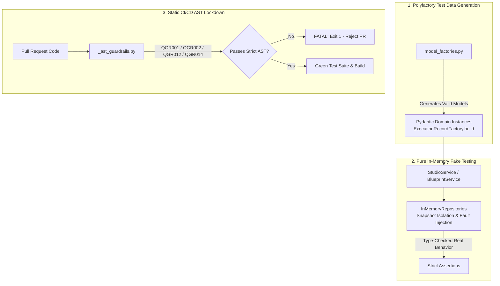

# Automated Implementation Plan: WP3 — Test Architecture Lockdown, Mock-Giljotiini & Polyfactory (Testiarkkitehtuurin Hermeettinen Lukitus)

> **SSOT Implementation Plan — Work Package 3 (WP3)**  
> **Tavoite:** Sementoida tehdyt arkkitehtuurimuutokset, poistaa hauras `unittest.mock.patch`- ja `MagicMock`-kytkentä, keskittää testidatan luonti `polyfactory`-tehtaisiin ja lukita AST-guardrailit (`QGR001`, `QGR002`, `QGR012`, `QGR014`) `FATAL`-tasolle CI/CD-putkessa.

<required_context_rules>
  <rule>@[.agents/rules/00-antigravity-core.md]</rule>
  <rule>@[.agents/rules/01-python-backend.md]</rule>
  <rule>@[.agents/rules/04_directory_reference.md]</rule>
  <knowledge_item>@[ki_zero_permissive_typing.md]</knowledge_item>
  <knowledge_item>@[ki_ast_guardrail_engine.md]</knowledge_item>
  <knowledge_item>@[ki_python_314_concurrency_strictness.md]</knowledge_item>
  <knowledge_item>@[ki_god_code_prevention.md]</knowledge_item>
</required_context_rules>

<anti_targets>
- Do NOT use `unittest.mock.patch`, `MagicMock`, or `AsyncMock` to mock database repositories in service unit tests (`anti_tdd_trap`).
- Do NOT write manual 50-line JSON mock dictionaries (`dummy_data = {"id": ...}`) in unit test fixtures; use `polyfactory` model factories (`deterministic_testing_delegation`).
- Do NOT silence failing tests by adding `@pytest.mark.skip` or commenting assertions out (`anti_test_skipping_mandate`).
- Do NOT allow AST guardrails to emit non-blocking warnings (`WARN`); all guardrails MUST produce `exit 1` (`FATAL`) (`universal_quality_gate`).
- Do NOT execute live external HTTP/LLM calls in unit tests; use `backend_v2/llm/mock_data.py` and `in_memory_repositories.py` (`mocking_mandate_for_llm`).
</anti_targets>

---

## 1. Problem Statement & Nykyarkkitehtuurin Haasteet

1. **Hauras ja Valheellinen Mockaus (`unittest.mock.patch` / `MagicMock`):**
   * Useat palvelutestit (`backend_v2/tests/unit/services/`) käyttävät `unittest.mock.patch`-kutsuja tai `AsyncMock()`-olioita repositoriorajapintojen korvikkeena.
   * `MagicMock` ottaa vastaan minkä tahansa metodikutsun ja palauttaa mitä tahansa, vaikka oikeaa metodia olisi muutettu, poistettu tai sen tyypitystä tiukennettu. Tämä luo "Valheellisen Vihreän" testituloksen ("Fake Green"), joka peittää rajapintamurtumat.
2. **Käsinkirjoitetut Kovakoodatut JSON-Testidatat:**
   * Testit sisältävät kymmeniä käsinkirjoitettuja sanakirjoja (`{"status": "PENDING", "user_id": "123"}`).
   * Jos Pydantic-skeemaan lisätään uusi pakollinen kenttä tai tyyppiä tiukennetaan, testit hajoavat vanhentuneeseen testidataan eikä itse liiketoimintavirheeseen.
3. **AST-Laatuporttien Puutteellinen Pysäytysvoima:**
   * Vaikka `_ast_guardrails.py` sisältää säännöt `QGR001–QGR012`, tietyt säännöt ovat aiemmin toimineet varoitustilassa, jolloin huono koodi on voinut livahtaa katselmointiin ja master-haaraan.

---

## 2. Tavoitetila & Ratkaisuarkkitehtuuri



### 2.1 Aito In-Memory Testaus (`InMemoryRepositories`)
* Korvataan kaikki palvelutestien repositoriomockit aidoilla, muistissa toimivilla `InMemoryRepositories`-fakeilla ([`in_memory_repositories.py`](file:///c:/src/quorum/backend_v2/tests/fakes/in_memory_repositories.py)).
* Testattavalle palvelulle injektoidaan oikea säiliö, jolloin Pydantic-validointi, tallennus ja palautus ajetaan 100 % oikean Rust-ytimen läpi.
* Virhetilanteet (esim. `TimeoutError`, `AppException`) testataan `repo.inject_fault("get", AppException(...))` -moottorilla ilman mockausta.

### 2.2 Keskitetty `polyfactory`-Testidatageneraattori
* Laajennetaan [`model_factories.py`](file:///c:/src/quorum/backend_v2/tests/factories/model_factories.py) kattamaan kaikki Domain- ja DTO-mallit (`ExecutionRecordFactory`, `PromptBlockFactory`, `StepFactory`, `TaskBlueprintFactory`, `OutputProfileFactory`).
* Testeissä käytetään suoraan `Factory.build()`- tai `Factory.build(custom_field=value)` -kutsuja.

### 2.3 AST-Laatuporttien "FATAL"-Lukitus (`QGR001`, `QGR002`, `QGR012`, `QGR014`)
* Säännöt lukitaan tuottamaan poikkeuksetta `sys.exit(1)`:
  * `QGR001`: Raakasanakirjat tilansiirrossa ja rajapinnoissa
  * `QGR002`: Heijastukset ja duck-typing (`getattr`, `hasattr`, `isinstance(dict)`)
  * `QGR012`: Puuttuva `frozen=True` tai salliva `extra="allow"` DTO:ssa
  * `QGR014`: Kielto mockata repositoriorajapintoja palvelutesteissä (`unittest.mock.patch` kielletty palvelukerroksen repositoriotesteissä)

---

## 3. Implementation Phases (WP3 Vaihejako)

### Phase 1: Polyfactory-Tehtaiden Laajennus (`tests/factories/model_factories.py`)

#### [MODIFY] `@[backend_v2/tests/factories/model_factories.py]`
- Luodaan puuttuvat `ModelFactory`-luokat:
  - `ExecutionRecordFactory(ModelFactory[ExecutionRecord])`
  - `ExecutionMetadataFactory(ModelFactory[ExecutionMetadata])`
  - `PromptBlockFactory(ModelFactory[PromptBlock])` ja sen alaluokat
  - `OutputProfileFactory(ModelFactory[OutputProfile])`
  - `StepFactory(ModelFactory[Step])`
  - `MatrixFactory(ModelFactory[Matrix])`
  - `UserFactory(ModelFactory[User])` ja `OrganizationFactory(ModelFactory[Organization])`
- Varmistetaan, että jokainen tehdas tuottaa validit Opaque Stripe ID:t (`f"wor_{uuid.uuid4().hex[:16]}"`).

---

### Phase 2: Palveluyksikkötestien Mock-Giljotiini (`tests/unit/services/`)

#### [MODIFY] `@[backend_v2/tests/unit/services/studio/test_workflow_service.py]`
- Poistetaan `AsyncMock` ja `@patch` repositoriokutsuista.
- Injektoidaan `InMemoryWorkflowRepository` ja `InMemoryIdentityRepository`.
- Korvataan käsinkoodatut JSON-fixturet `WorkflowFactory.build()`-kutsuilla.

#### [MODIFY] `@[backend_v2/tests/unit/services/studio/test_prompt_block_service.py]`
- Injektoidaan `InMemoryPromptBlockRepository`.
- Korvataan sanakirjadatat `PromptBlockFactory.build()`-kutsuilla.

#### [MODIFY] `@[backend_v2/tests/unit/services/studio/test_simulation_service.py]`
- Injektoidaan `InMemoryTaskBlueprintRepository` ja `InMemoryWorkflowRepository`.

#### [MODIFY] `@[backend_v2/tests/unit/services/test_blueprint.py]`
- Korvataan vanhat sanakirjamockit `InMemoryRepositories`-fakeilla.

---

### Phase 3: AST Guardrail `QGR014` (Mock-Kielto) & FATAL-Lukitus

#### [MODIFY] `@[scripts/_ast_guardrails.py]`
- Lisätään ja aktivoidaan `QGR014`:
  * Skannaa `backend_v2/tests/unit/services/` -hakemiston.
  * Tunnistaa `@patch("...repository...")`, `patch.object(repo, ...)`, `MagicMock(spec=IRepository)` ja `AsyncMock(spec=IRepository)`.
  * Nostaa välittömästi `FATAL`-virheen (`exit 1`), jos repositoriorajapintoja mockataan fakien sijasta.
- Varmistetaan, että `QGR001`, `QGR002`, `QGR012` ja `QGR014` ovat kukin tilassa `Severity.FATAL`.

#### [MODIFY] `@[.github/workflows/backend-quality.yml]`
- Varmistetaan, että CI/CD-työnkulku suorittaa `scripts/backend_audit_loop.py` -ajon `--fatal`-lipulla jokaisessa Pull Requestissa.

---

### Phase 4: Koko Testipatteriston Regressioajo & Puhdistus

#### [RUN] `uv run pytest backend_v2/tests/unit/services/ -v`
- Ajetaan kaikki palvelutestit varmistaen 100 % läpimeno aidoilla In-Memory fakeilla.

#### [RUN] `uv run python scripts/_ast_guardrails.py backend_v2/ --fatal`
- Varmistetaan, että koko koodikanta läpäisee FATAL-tasoisen arkkitehtuuritarkastuksen nollavirheellä.

---

## 4. Verification Plan (Laadunvarmistus & Testit)

### Automatisoidut Testit & Laatuportit (PowerShell)

```powershell
# 1. Ajetaan Polyfactory-tehtaiden validointitestit
uv run pytest backend_v2/tests/factories/ -v

# 2. Ajetaan kaikki palvelutestit (100% In-Memory Fakes ilman mockeja)
uv run pytest backend_v2/tests/unit/services/ -v

# 3. Ajetaan In-Memory Repositories -yksikkötestit ja vikasimulaatiot
uv run pytest backend_v2/tests/unit/fakes/ -v

# 4. Suoritetaan tiukka AST Guardrail -skannaus (QGR001, QGR002, QGR012, QGR014)
uv run python scripts/_ast_guardrails.py backend_v2/ --fatal

# 5. Täysi Backend Audit Loop
uv run python scripts/backend_audit_loop.py backend_v2/tests/unit/services/ --test
```

### Manuaalinen / CI Vahvistus
- Tarkistetaan GitHub Actions -tulokset ja varmistetaan, että kaikki PR-laatuportit vaativat 100 % puhtaan AST-skannauksen.
