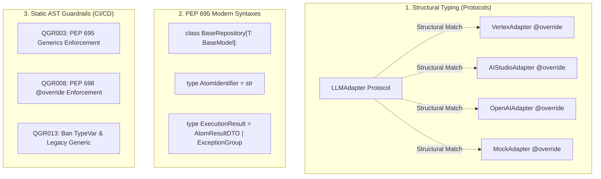

> **STATUS: PENDING / ODOTTAA TOTEUTUSTA (Work Package 2: Tyypityssyntaksin ja rajapintojen modernisointi)**

# Automated Implementation Plan: WP2 — Typing Syntax & Interface Modernization (Tyypityssyntaksin ja Rajapintojen Modernisointi)

> **SSOT Implementation Plan — Work Package 2 (WP2)**  
> **Tavoite:** Nostaa koko koodikanta natiivien Python 3.12–3.14+ tyyppitysominaisuuksien tasolle staattisen analyysin (MyPy strict / IDE) ja kääntöaikaisen turvallisuuden maksimoimiseksi. Korvataan perinteinen periytyminen (`ABC`) rakenteellisella tyypityksellä (`Protocol`), suojataan rajapintatoteutukset `@override`-dekoraattoreilla (`PEP 698`) ja modernisoidaan tyyppisyntaksit (`PEP 695`).

<required_context_rules>
  <rule>@[.agents/rules/00-antigravity-core.md]</rule>
  <rule>@[.agents/rules/01-python-backend.md]</rule>
  <rule>@[.agents/rules/04_directory_reference.md]</rule>
  <rule>@[.agents/rules/05_llm_architecture.md]</rule>
  <knowledge_item>@[ki_zero_permissive_typing.md]</knowledge_item>
  <knowledge_item>@[ki_ast_guardrail_engine.md]</knowledge_item>
  <knowledge_item>@[ki_python_314_concurrency_strictness.md]</knowledge_item>
  <knowledge_item>@[ki_god_code_prevention.md]</knowledge_item>
</required_context_rules>

<anti_targets>
- Do NOT use legacy `abc.ABC` or `@abstractmethod` where structural `typing.Protocol` can achieve loose coupling (`schema_convergence_mandate`).
- Do NOT implement protocol or base class methods without explicit `@override` (PEP 698) annotations (`modern_type_aliases_pep695`).
- Do NOT use legacy `TypeVar`, `Generic[T]`, `Optional[X]`, `Union[A, B]`, or `TypeAlias` in new or refactored code (`python_314_modern_syntax`).
- Do NOT introduce duck-typing (`getattr`/`hasattr`/`isinstance(dict)`) during protocol modernizations (`the_zero_compromise_pledge`).
- Do NOT break runtime introspection in FastAPI, Pydantic, or dependency injection containers (`acyclic_top_level_import_invariant`).
- Do NOT leave `# noqa: QGR...` suppressions or bypass AST guardrails without explicit architectural justification (`the_duct_tape_ban`).
</anti_targets>

---

## 1. Problem Statement & Nykytilan Haasteet

1. **Jäykkä Periytyminen (`abc.ABC` & `@abstractmethod`):**
   * [`backend_v2/llm/adapters/base_adapter.py`](file:///c:/src/quorum/backend_v2/llm/adapters/base_adapter.py) käyttää perinteistä `class BaseLLMAdapter(ABC)` -abstraktioluokkaa. Tämä luo kiinteän periytymishierarkian ja vaikeuttaa kevyiden, tilattomien testifakien ja erillisten adaptereiden kytkemistä.
2. **Kääntöaikaisen Ylikirjoitusturvan Puute (`PEP 698` – `@override`):**
   * Suurin osa `Protocol`-toteutuksista (9 tietokantarepositoriota, 4 LLM-adapteria, SDUI-adapterit) toteuttaa metodit ilman `@override`-dekoraattoria. Jos `interfaces.py`:n tai `LLMAdapter`-protokollan metodisignatuuri muuttuu (esim. parametri poistetaan tai nimetään uudelleen), tyyppitarkastin ei aina varoita toteutuksesta, mikä johtaa ajonaikaisiin virheisiin (`TypeError: unexpected keyword argument`).
3. **Vanhentunut Tyyppisyntaksi (`PEP 484` vs. `PEP 695`):**
   * Koodikannassa esiintyy edelleen hajallaan `TypeVar("T")`, `Generic[T]`, `Optional[T]` ja `Union[A, B]` (esim. `chunking.py`, `auth.py`, `handler.py`, `ingress_pipeline.py`).
   * Python 3.12–3.14+ tarjoaa natiivin PEP 695 `type`-aliassyntaksin ja `class Foo[T: BaseModel]:` -syntaksin, joka on suorituskykyisempi, siistimpi ja paremmin MyPy/IDE-tuettu.

---

## 2. Tavoitetila & Ratkaisuarkkitehtuuri



### 2.1 Abstraktiot $\rightarrow$ `typing.Protocol`
* Muutetaan `BaseLLMAdapter` `LLMAdapter(Protocol)` -muotoon. Konkreettiset adapterit eivät enää periydy suoraan perusluokasta, vaan toteuttavat protokollan vaatimat metodit (`prepare_payload`, `calculate_cost`, `extract_token_usage`).

### 2.2 Ylikirjoitusturva $\rightarrow$ `@override`
* Merkitään kaikki protokollia tai rajapintoja toteuttavat metodit `@override`-dekoraattorilla. Tämä takaa 100 % suojan refaktorointien aiheuttamia signatuurieroja vastaan.

### 2.3 PEP 695 Generics & Type Aliases
* Kaikki generiikat muutetaan muotoon `[T: BaseModel]`.
* Kaikki tyyppialiakset muutetaan muotoon `type X = Y | Z`.
* Kaikki `Optional[T]` ja `Union[A, B]` korvataan `T | None` ja `A | B`.

---

## 3. Implementation Phases (WP5 Vaihejako)

### Phase 1: LLM-Adapterien Abstraktiopäivitys (`ABC` $\rightarrow$ `Protocol`)

#### [MODIFY] `@[backend_v2/llm/adapters/base_adapter.py]`
- Poistetaan `from abc import ABC, abstractmethod`.
- Tuodaan `from typing import Protocol, runtime_checkable`.
- Määritellään `LLMAdapter(Protocol)` puhtaana protokollana.
- Säilytetään jaettavat apufunktiot (`apply_provider_pacing`, `get_redis_client_for_pacing`) itsenäisinä moduulitason funktioina.

#### [MODIFY] `@[backend_v2/llm/adapters/vertex_adapter.py]`
- Poistetaan periytyminen `class VertexAdapter(BaseLLMAdapter)`.
- Lisätään `from typing import override` ja merkitään kaikki protokollametodit `@override`.

#### [MODIFY] `@[backend_v2/llm/adapters/ai_studio_adapter.py]`
- Poistetaan periytyminen `class AIStudioAdapter(BaseLLMAdapter)`.
- Lisätään `@override` protokollametodeille.

---

### Phase 2: Systemaattinen `@override` -Kattavuus Repositorioille & Moottoreille

#### [MODIFY] `@[backend_v2/database/repositories/]` (Kaikki 9 repositoriotiedostoa)
- Lisätään `from typing import override` tiedostoihin:
  - `repositories/execution.py`
  - `repositories/workflow.py`
  - `repositories/component.py`
  - `repositories/identity.py`
  - `repositories/knowledge.py`
  - `repositories/system.py`
  - `repositories/audit.py`
  - `repositories/components/` (kaikki alirepositoriot)
- Merkitään jokainen `interfaces.py`:n protokollametodi `@override`-dekoraattorilla.

#### [MODIFY] `@[backend_v2/utils/scoring/]` (Kaikki pisteytysmoottorit)
- Merkitään `AverageEngine`, `PureMathEngine`, `VarianceEngine` ja `WaterfallEngine` metodit `@override`-dekoraattorilla suhteessa `BaseScoringEngine` (Protocol) -sopimukseen.

---

### Phase 3: PEP 695 -Syntaksin ja Legacy-Tyyppien Siivous

#### [MODIFY] `@[backend_v2/models/chunking.py]`
- Korvataan `Optional[...]` syntaksilla `... | None`.

#### [MODIFY] `@[backend_v2/models/auth.py]`
- Korvataan `Optional[...]` syntaksilla `... | None`.

#### [MODIFY] `@[backend_v2/llm/handler.py]`
- Korvataan `Optional[...]` syntaksilla `... | None`.

#### [MODIFY] `@[backend_v2/llm/ingress_pipeline.py]`
- Korvataan `Union[...]` syntaksilla `... | ...`.

#### [MODIFY] `@[backend_v2/models/dtos/]` & `@[backend_v2/models/domain/]`
- Muutetaan tyyppialiakset käyttämään natiivia `type ID = str` -syntaksia.

---

### Phase 4: AST-Laatuporttien Päivitys & Valvonta

#### [MODIFY] `@[scripts/_ast_guardrails.py]`
- Varmistetaan `QGR003` (PEP 695 generics enforcement) ja `QGR008` (PEP 698 @override enforcement).
- Lisätään `QGR013` (kielletään `TypeVar` ja vanha `Generic[T]` tuotantokoodissa).

#### [MODIFY] `@[backend_v2/tests/unit/scripts/test_ast_guardrails.py]`
- Päivitetään guardrail-yksikkötestit todentamaan uusien sääntöjen toimivuus.

---

## 4. Verification Plan (Laadunvarmistus & Testit)

### Automatisoidut Testit & Laatuportit (PowerShell)

```powershell
# 1. LLM Adapter -yksikkötestit
uv run pytest backend_v2/tests/unit/llm/adapters/ -v

# 2. Repositorio- ja Interface-testit
uv run pytest backend_v2/tests/unit/test_repositories_v2.py backend_v2/tests/unit/database/repositories/ -v

# 3. Pisteytysmoottorien testit
uv run pytest backend_v2/tests/unit/utils/scoring/ -v

# 4. AST Guardrail -tarkistukset koko backendille
uv run python scripts/_ast_guardrails.py backend_v2/ --fatal
uv run python scripts/backend_audit_loop.py backend_v2/llm/ --test
uv run python scripts/backend_audit_loop.py backend_v2/database/ --test
```

### Manuaalinen / MyPy Strict Tarkastus
- Ajetaan `uv run mypy backend_v2/ --strict` todentamaan, että kaikki `@override`-dekoraattorit täsmäävät täydellisesti protokollasignatuureihin ilman ainuttakaan tyyppivaroitusta.
