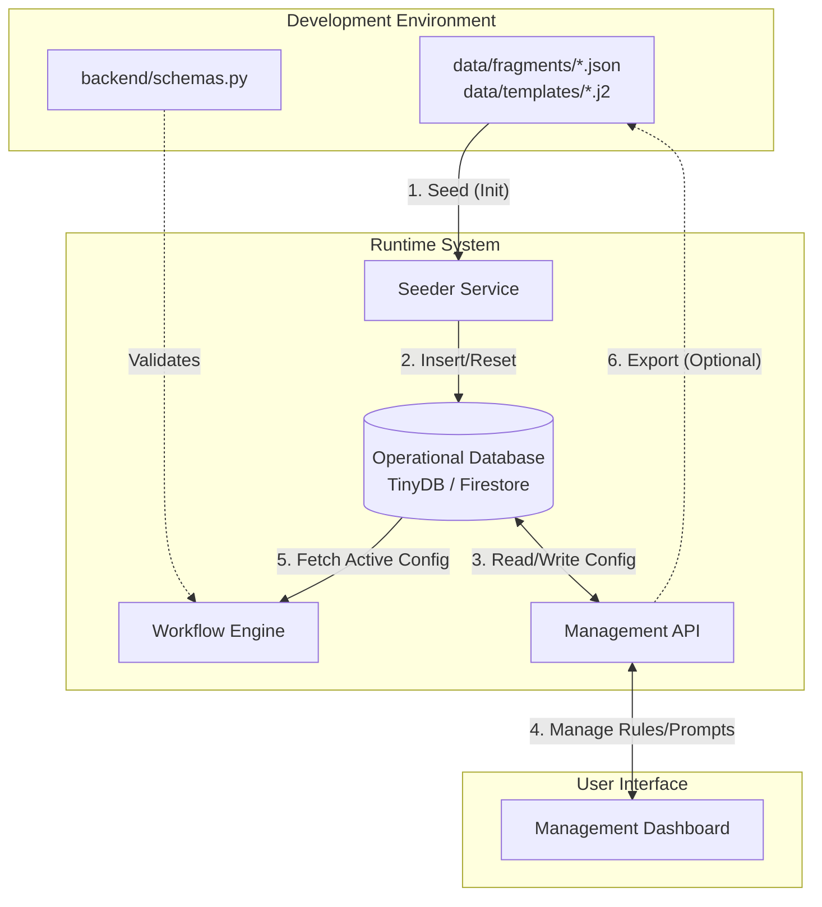

# Proposed Architecture: Hybrid Database-First Management

This document outlines a proposed architecture where the system transitions from a "File-First" to a "Database-First" approach for configuration management. This enables a rich Management UI while maintaining the robustness of hardcoded data structures.

## Core Philosophy

**"Seed from Files, Live in Database, Structure in Code."**

1.  **Structure (Immutable)**: Data structures (Schemas) remain hardcoded in Python (`schemas.py`) to ensure type safety and validation.
2.  **Semantics (Mutable)**: Rules, Prompts, and Workflows are stored in the Database (`db.json` / Firestore). Files (`data/fragments`) are only used for initialization (Seeding) and version control (Export).

## Component Breakdown

| Component | Source of Truth (Runtime) | Source of Truth (Init/Backup) | Editable via UI? |
| :--- | :--- | :--- | :--- |
| **Tietorakenteet** (Schemas) | `backend/schemas.py` | `backend/schemas.py` | ❌ **Ei** (Vaatii koodimuutoksen) |
| **Säännöt & Mandaatit** | Tietokanta (`db.json`) | `data/fragments/*.json` | ✅ **Kyllä** (Lomake-editori) |
| **Prompti-pohjat** | Tietokanta (`db.json`) | `data/templates/*.j2` | ✅ **Kyllä** (Tekstieditori) |
| **Workflow-määrittelyt** | Tietokanta (`db.json`) | `data/seed_data.json` | ✅ **Kyllä** (Flowchart-editori) |

## Architecture Diagram

## Operational Workflows

### 1. Initialization (Seeding)
*   **Trigger**: System startup (if DB empty) or manual "Factory Reset".
*   **Action**: The `Seeder` reads JSON fragments and Jinja2 templates from the file system and inserts them into the Database.
*   **Result**: The Database is populated with the default configuration.

### 2. Runtime Execution
*   **Trigger**: User starts a workflow.
*   **Action**: The `Workflow Engine` fetches the *current* rules and prompts directly from the Database.
*   **Benefit**: Changes made in the UI are immediately reflected in the next run without restarting the server.

### 3. Management (UI Editing)
*   **Trigger**: Admin user edits a rule in the Dashboard.
*   **Action**: The UI sends a `PUT` request to the API. The API updates the record in the Database.
*   **Constraint**: The UI cannot change the *structure* of the data (e.g., cannot add a new field to `TuomioJaPisteet`), only the *instructions* on how to fill it.

### 4. Version Control (Export)
*   **Trigger**: Developer wants to commit changes made in the UI to Git.
*   **Action**: "Export Configuration" feature dumps the current Database state back into `data/fragments/*.json` and `data/templates/*.j2`.
*   **Result**: The file system is updated, ready for `git commit`.

## Benefits

1.  **No Code for Logic Changes**: Subject Matter Experts (SMEs) can tune prompts and rules via a UI without touching Python code.
2.  **Immediate Feedback**: Changes take effect instantly.
3.  **Safety**: Hardcoded schemas prevent the UI from breaking the internal data flow or validation logic.
4.  **Best of Both Worlds**: Combines the flexibility of a CMS (Content Management System) with the rigor of a typed software application.
