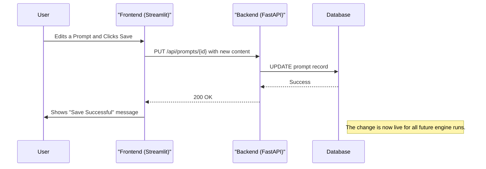

# Management Architecture

The Management Architecture of Cognitive Quorum v2 is a decoupled system designed for dynamic, real-time configuration of the AI engine. It allows administrators to create, modify, and manage the system's core logic—including workflows, prompts, and agent configurations—through a web interface, without requiring code changes or deployments.

This is achieved by separating the system into four key components: a user-facing Frontend, an API-driven Backend, a data-driven Generic Engine, and a Database that serves as the single source of truth.

## System Components

The v2 architecture is composed of distinct, interacting services. This separation of concerns enhances scalability, maintainability, and flexibility.

```mermaid
graph TD
    subgraph "User Interface"
        A[Management UI (Streamlit)]
    end
    subgraph "Application Layer"
        B[Backend (FastAPI)]
    end
    subgraph "Core Logic"
        C[Generic Engine]
        D[Agents]
    end
    subgraph "Data Layer"
        E[Database (db.json)]
    end

    A -- API Calls (HTTP) --> B
    B -- Manages/Persists Config --> E
    B -- Initiates/Orchestrates --> C
    C -- Reads Workflow & Prompts --> E
    C -- Executes --> D
    D -- Uses Config from --> E
```

*   **Frontend (Streamlit)**: A web-based user interface for system administrators. It provides tools to edit all system configurations. It does not interact with the database directly; instead, it communicates exclusively with the Backend via API calls.
*   **Backend (FastAPI)**: A RESTful API that serves as the system's control plane. It handles all incoming requests from the frontend, validates data, manages business logic, and is the sole component responsible for reading from and writing to the database.
*   **Generic Engine**: The core processing unit. When a task is initiated, the Engine reads the corresponding workflow definition from the database. It then executes the defined sequence of steps, invoking the appropriate Agents with the correct configurations.
*   **Database (JSON)**: The single source of truth for the entire system's configuration. It stores all prompts, rules, agent settings, and crucially, the workflow definitions that dictate the engine's behavior.

## The Data-Driven Workflow Engine

Cognitive Quorum v2 operates as a generic, data-driven engine. All processing logic is defined as a **Workflow** within the database, rather than being hardcoded in the application.

A workflow is an ordered list of **Steps**. Each step is a JSON object that instructs the engine on what to do, defining:
*   `agent_name`: The specific agent to execute (e.g., `ScoringAgent`, `RefinementAgent`).
*   `prompt_id`: The ID of the prompt template to load from the database.
*   `config`: Agent-specific parameters, such as the LLM to use (`gpt-4-turbo`, `gemini-1.5-flash`), output parsing rules, and other settings.

This data-driven approach means new, complex behaviors and chains of logic can be created, tested, and deployed entirely through the Management UI, simply by defining a new workflow in the database.

## Management Data Flow

All configuration changes follow a clear, API-driven pattern. The concept of "deploying to seed" from v1 is obsolete. Persistence is immediate and transactional via the API.

Here is the flow for a typical change, such as updating a prompt:
1.  **Edit**: An administrator modifies a prompt in the Streamlit UI.
2.  **API Request**: Upon saving, the UI sends a `PUT /api/prompts/{prompt_id}` request to the FastAPI backend, containing the new prompt content.
3.  **Persistence**: The backend validates the data and updates the corresponding record in the database (`db.json` or `db_mock.json`).
4.  **Confirmation**: The backend returns a success response (e.g., `200 OK`) to the UI, which displays a confirmation message.
5.  **Live Update**: The change is now live. Any subsequent workflow run initiated by the engine will read the updated prompt directly from the database.



## UI Components (`pages/management.py`)

The Management Dashboard is organized into task-oriented tabs:

### 1. Workflow Editor
This is the primary interface for defining the system's behavior.
*   **Visualizer**: Displays the sequence of agent steps for a selected workflow.
*   **Step Configuration**: Allows administrators to add, remove, and reorder steps in a workflow. For each step, they can select the agent, assign a prompt, and configure parameters like the model (e.g., Flash vs Pro).

### 2. Prompts & Rules Editor
This area manages the content assets used by the workflows.
*   **Prompt Editor**: A rich text editor for creating and modifying prompt templates, with full support for Jinja2 syntax.
*   **Rules/Mandates Editor**: A structured interface (e.g., a form or JSON editor) for editing sets of rules that can be injected into prompts.
*   **Previewer**: Shows how a prompt will be rendered after Jinja2 variables are populated.

### 3. System Maintenance
Tools for managing the system's data and environments.
*   **Database Seeding**: An API-driven function that wipes the current database and reloads it from a baseline `seed.json` file.
*   **Environment Sync**: Tools to promote configurations between the Mock and Production environments.
    *   *Deploy Mock to Prod*: Copies the entire validated Mock DB configuration to the Prod DB via an API endpoint.
    *   *Sync Prod to Mock*: Copies the live Prod DB to the Mock DB for safe testing or debugging.

## Environments & Data Synchronization

The system maintains two parallel environments to ensure safe development and testing.

| Environment | Database File | Purpose |
| :--- | :--- | :--- |
| **MOCK** | `data/db_mock.json` | Sandbox for testing new prompts, rules, and workflows safely. |
| **PROD** | `data/db.json` | The live environment used for actual assessments. |

The Management UI sends API requests to the active backend (determined by environment variables). The backend is solely responsible for all interactions with the corresponding database file, ensuring a clean separation of concerns.