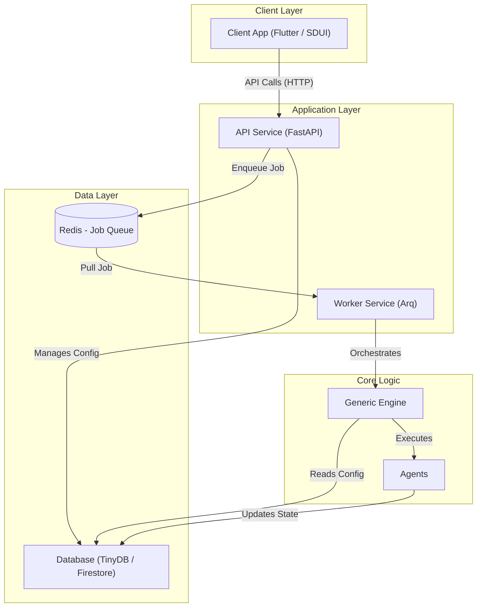

# Management Architecture

The Management Architecture for **Cognitive Quorum V2026** is a decoupled system designed for dynamic, real-time configuration of the AI engine. It enables administrators to manage the system's core logic—workflows, prompts, and agent configurations—through a web interface, without deploying new code.

This architecture separates the system into four execution components: a user-facing **Frontend (Cognitive Studio)**, an Async **API Backend**, a distributed **Worker Service** (Arq), and a data-driven **Generic Engine**.

---

## System Components (V2.9)

The architecture uses asynchronous processing and a "Modular Core" API to handle long-running cognitive tasks (Deep Research, Causal Analysis) without blocking the management UI.

```mermaid
graph TD
    subgraph "Client Layer"
        A["Client App (Flutter / SDUI)"]
    end
    subgraph "Application Layer"
        B["API Service (FastAPI)"]
        W["Worker Service (Arq)"]
    end
    subgraph "Core Logic"
        C["Generic Engine"]
        D["Agents"]
    end
    subgraph "Data Layer"
        R[(Redis - Job Queue)]
        E["Database (TinyDB / Firestore)"]
    end

    A -- API Calls (HTTP) --> B
    B -- Manages Config --> E
    B -- Enqueue Job --> R
    R -- Pull Job --> W
    W -- Orchestrates --> C
    C -- Reads Config --> E
    C -- Executes --> D
    D -- Updates State --> E
```

### Client App (Flutter / Cognitive Studio)
A native, multi-platform user interface found in `client_app/`. It provides tools for workflow execution, system monitoring, and deep configuration. It communicates exclusively with the Backend via REST API calls and manages local state via **Riverpod 2.0**. It uses **Server-Driven UI (SDUI)** principles to render configuration forms dynamically from backend schemas.

### Backend (FastAPI - Modular Core)
The Control Plane. It handles incoming HTTP requests, validates configuration changes via **Pydantic V2** schemas, and serves as the gateway. It is organized into a hybrid router structure:

*   **Core Systems** (`backend/api/`): Top-level routers for Auth, Admin, and Organizations (`admin_router.py`, `organization_router.py`, `auth_router.py`).
*   **Domain Logic** (`backend/api/routes/`): dedicated sub-routers for business logic.
    *   `execution/`: Life-cycle management of jobs and runs.
    *   `config/`: CRUD for Workflows, Steps, and Components.
    *   `builder/`: Advanced workflow construction tools.

### Worker Service (Arq + Redis)
The Execution Plane. A distributed background service that pulls jobs from Redis. This allows the system to scale horizontally and handle tasks that exceed standard HTTP timeout limits (e.g., 60s+ LLM reasoning chains). Monitoring and traces are exported to **Logfire**.

### Generic Engine
The core processing unit running inside the Worker. It reads the `WorkflowState` and `WorkflowDefinition` from the database, initializes the required Agents using Strict Dependency Injection, and executes the pipeline.

### Database (JSON / Firestore)
The **Single Source of Truth** (SSOT). It stores:
*   **Definitions**: Prompts, Rules, Agent Configs (Managed via Registry).
*   **State**: Live execution data (`WorkflowState`).

---

## Management Data Flow

Configuration changes follow an API-driven, immediate consistency model, enforced by the **Zero-Fallback Mandate**.

1.  **Action**: An administrator modifies a Prompt or Workflow in the **Studio**.
2.  **API Request**: The Client App sends a `PATCH` request to `api/v1/config/`.
3.  **Strict Validation**: The backend validates the data against Pydantic V2 schemas. Invalid data is rejected immediately (Fail-Fast).
4.  **Persistence**: The record is updated in the active database (TinyDB or Firestore).
5.  **Live Update**: The next job picked up by a Worker will immediately use the new configuration.

---

## UI Architecture (`client_app/lib/`)

The Client App uses a **Shell Route** architecture to separate concerns:

### 1. Studio (`/studio`)
The workspace for "Cognitive Architects", accessed via the `StudioDashboardScreen`.
*   **Workflows** (`/studio/workflows`): Visual management of workflow definitions.
*   **Steps** (`/studio/steps`): Library of reusable cognitive steps.
*   **Matrices** (`/studio/matrices`): Evaluation matrices and ontology definitions.
*   **Components** (`/studio/components`): General component registry (Rules, Prompts).

### 2. Registry (`/registry`)
The component library.
*   **Model Registry**: Management of AI Models (LLMs) and Providers.
*   **Component Manager**: CRUD for Prompts, Matrices, and Reusable Rules.

### 3. Administration (`/admin`)
A protected environment for Governance, utilizing strict **RBAC**:
*   **Overview**: High-level system stats.
*   **Organization Management**: Root-level creation and suspension of tenants.
*   **User Governance**: Role assignment with "Last Admin Protection".
*   **System Inspector**: Health checks for Redis, Database, and Workers.

---

## Identity & Access Management (IAM)

The system enforces a strict hierarchy via `AuthService` (`backend/services/auth.py`):

| Role | Scope | Permissions |
| :--- | :--- | :--- |
| **ROOT** | System | God-mode. Create Orgs, Reset DB, Manage System Config. |
| **ADMIN** | Organization | Manage Users, Billing, and Org Configuration. |
| **MANAGER** | Organization | Create/Edit Workflows and Components. (Technical Lead). |
| **MEMBER** | Organization | Run Workflows and View Reports. |
| **VIEWER** | Organization | Read-Only access to specific Reports. |

### Key Protections
*   **Last Admin Protection**: The system prevents deleting or demoting the last Administrator of an Organization to avoid orphan tenants.
*   **Root Protection**: The `root_master` account cannot be deleted.
*   **Organization Isolation**: Users cannot access data outside their `organization_id`. `AbstractWorkflowRepository` enforces this at the query level.

---

## Environments & Data Synchronization

The system maintains a **3-Tier Environment** model, governed by the **Blueprint Authority** principle (Seed Data is Dictator).

| Environment | Database | Purpose | Seeding Command |
| :--- | :--- | :--- | :--- |
| **Local Mock** | `data/db_mock.json` | Sandbox for offline testing (Fake LLMs). | `python backend/seed/run_seed.py mock` |
| **Local Prod** | `data/db.json` | Local testing with Live LLMs (Vertex/OpenAI). | `python backend/seed/run_seed.py local` |
| **Cloud Prod** | Firestore (GCP) | Production traffic in `europe-north1`. | `python backend/seed/run_seed.py firestore` |

**Sync Protocol**: Changes made in Local Prod can be exported to `seed_data.json` and then promoted to Cloud Prod via the Seeder. Use `backend/services/administration_service.py` for exports.

---

## Operational Management (Process Hygiene)

Managing the distributed components (API, Worker, Redis) requires strict process hygiene, especially in Windows development environments.

### Docker-Based Orchestration
The primary deployment interface is Docker Compose.
*   **Startup**: `run_full_docker.bat` performs a "Clean Build & Start". It forcefully rebuilds images to ensure `worker.py` code changes are propagated.
*   **Shutdown**: `docker-compose down`.

### Process Hygiene & "Zombie Kill"
Due to the multi-process nature of the Worker and Python's behavior on Windows:
*   **The Problem**: Terminating a terminal often leaves orphan `python.exe` or `uv` processes running in the background, holding onto file locks (TinyDB) or ports (8000).
*   **The Protocol**: The **Nuclear Kill Mandate** is enforced via `kill_services.bat`, which aggressively terminates all related processes by name/port before restarting. This is standard operating procedure when switching environments or recovering from "Split-Brain" database states.