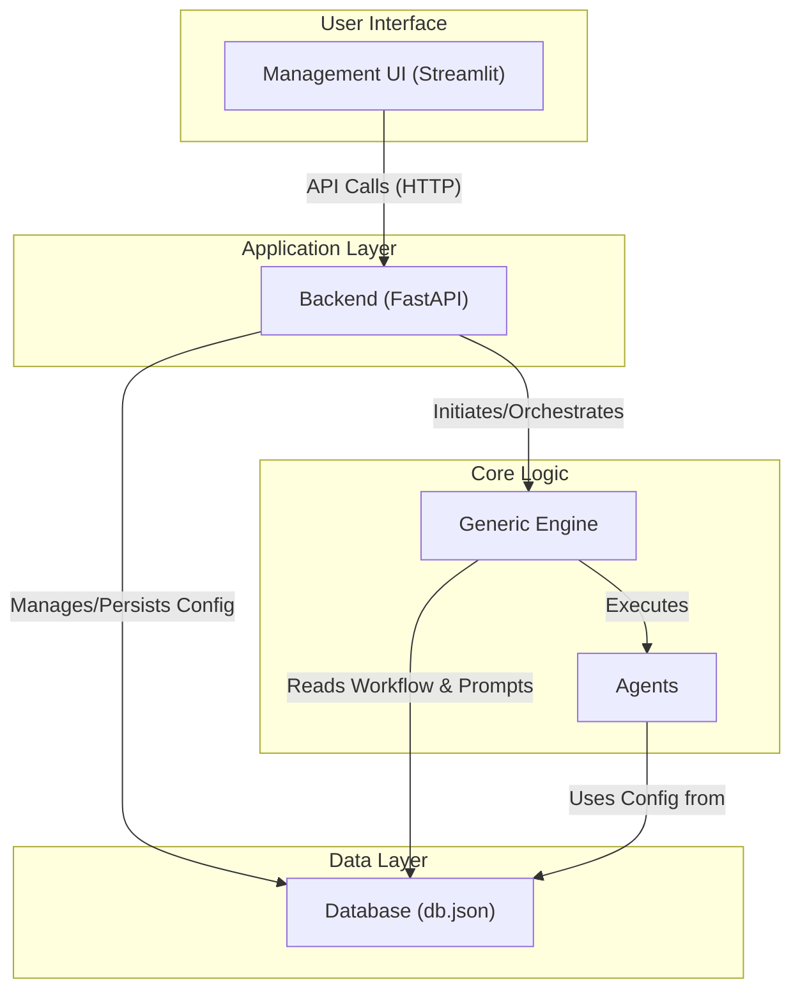

# Management Architecture

The Management Architecture for Cognitive Quorum v2.0 is a decoupled system designed for dynamic, real-time configuration of the AI engine. It enables administrators to manage the system's core logic—workflows, prompts, and agent configurations—through a web interface, eliminating the need for code changes or new deployments for logic updates.

This architecture separates the system into four key components: a user-facing Frontend, an API-driven Backend, a data-driven Generic Engine, and a Database that acts as the single source of truth for all configuration.

## System Components

The v2.0 architecture is composed of distinct, interacting services. This separation of concerns enhances scalability, maintainability, and flexibility.

```mermaid
graph TD
    subgraph "User Interface"
        A["Management UI (Streamlit)"]
    end
    subgraph "Application Layer"
        B["Backend (FastAPI)"]
    end
    subgraph "Core Logic"
        C["Generic Engine"]
        D["Agents"]
    end
    subgraph "Data Layer"
        E["Database (db.json)"]
    end

    A -- API Calls (HTTP) --> B
    B -- Manages/Persists Config --> E
    B -- Initiates/Orchestrates --> C
    C -- Reads Workflow & Prompts --> E
    C -- Executes --> D
    D -- Uses Config from --> E
```

### Frontend (Streamlit)
A web-based user interface (`pages/Management_Dashboard.py`) for system administrators. It provides tools to edit all system configurations. It communicates exclusively with the Backend via API calls and has no direct access to the database.

### Backend (FastAPI)
A RESTful API that serves as the system's control plane. It handles all incoming requests from the frontend, validates data, and is the sole component responsible for reading from and writing to the database.

### Generic Engine
The core processing unit. When a task is initiated by the backend, the Engine reads the corresponding workflow definition from the database. It then executes the defined sequence of steps, invoking the appropriate Agents with their specified configurations.

### Database (JSON)
The single source of truth for the entire system's configuration. It stores all prompts, rules, agent settings, and the workflow definitions that dictate the engine's behavior.

## The Data-Driven Workflow Engine

Cognitive Quorum v2.0 operates as a generic, data-driven engine. All processing logic is defined as a Workflow within the database, rather than being hardcoded in the application.

A **Workflow** is an ordered list of **Steps**. Each step is a JSON object that acts as an instruction, defining:

*   **`agent_name`**: The specific agent class to execute (e.g., `LogicianAgent`, `JudgeAgent`).
*   **`prompt_id`**: The ID of the prompt template to load.
*   **`llm_config`**: Agent-specific parameters, such as the LLM model (e.g., `gemini-1.5-pro`) and temperature.
*   **`output_schema`**: The Pydantic model name (e.g., `JudgeVerdict`) used for strict validation.

This data-driven approach means new, complex behaviors can be created entirely through the Management UI.

## Management Data Flow

All configuration changes follow a clear, API-driven pattern. Unlike v1's "deploy to seed" model, changes are persisted immediately via the API.

1.  **Edit**: An administrator modifies a prompt in the Streamlit UI.
2.  **API Request**: Upon saving, the UI sends a `PUT /prompts/{id}` request to the FastAPI backend.
3.  **Persistence**: The backend validates the data and updates the record in the active database (`db.json` or `db_mock.json`).
4.  **Live Update**: The change is live immediately.

## UI Components (`pages/Management_Dashboard.py`)

The Management Dashboard is organized into task-oriented tabs:

### 1. Workflow Editor
The primary interface for defining behavior.
*   **Visualizer**: Displays the sequence of agent steps.
*   **Step Configuration**: Drag-and-drop interface to add/remove/reorder steps and assign Agents/Prompts.

### 2. Prompts & Rules Editor
Manages the content assets.
*   **Prompt Editor**: Jinja2-aware text editor.
*   **Rules Editor**: Managed list of Mandates and Protocols.
*   **Previewer**: Real-time rendering of prompts with sample data.

### 3. System Maintenance
*   **Database Seeding**: Reset the active database to `seed_data.json` baseline interactively via API.
*   **Environment Sync**: APIs to promote configurations from Mock to Prod (`Deploy Mock to Prod`) or clone Prod to Mock (`Sync Prod to Mock`).

## Environments & Data Synchronization

The system maintains two parallel environments:

| Environment | Database File | Purpose |
| :--- | :--- | :--- |
| **MOCK** | `data/db_mock.json` | Sandbox for testing new prompts and workflows. |
| **PROD** | `data/db.json` | Live production processing. |

The Backend determines the active database from the `ENV` environment variable, ensuring isolation.