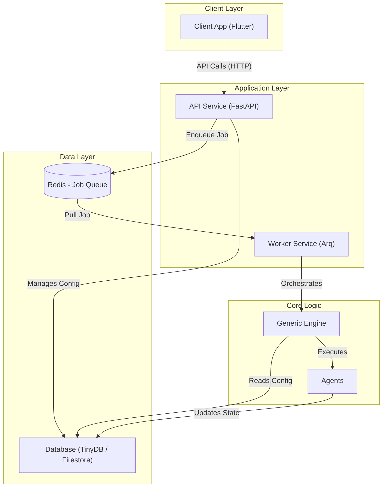

# Management Architecture

The Management Architecture for Cognitive Quorum v2.5 is a decoupled system designed for dynamic, real-time configuration of the AI engine. It enables administrators to manage the system's core logic—workflows, prompts, and agent configurations—through a web interface, without deploying new code.

This architecture separates the system into four execution components: a user-facing **Frontend**, an Async **API Backend**, a distributed **Worker Service**, and a data-driven **Generic Engine**.

---

## System Components

The v2.5 architecture introduces asynchronous processing to handle long-running cognitive tasks (Deep Research, Causal Analysis) without blocking the management UI.

```mermaid
graph TD
    subgraph "Client Layer"
        A["Client App (Flutter)"]
    end
    subgraph "Application Layer"
        B["API Service (FastAPI)"]
        W["Worker Service (Arq)"]
    end
    subgraph "Core Logic"
        C["Generic Engine"]
        D["Agents"]
    end
    subgraph "Data Layer"
    	R[(Redis - Job Queue)]
        E["Database (TinyDB / Firestore)"]
    end

    A -- API Calls (HTTP) --> B
    B -- Manages Config --> E
    B -- Enqueue Job --> R
    R -- Pull Job --> W
    W -- Orchestrates --> C
    C -- Reads Config --> E
    C -- Executes --> D
    D -- Updates State --> E
```

### Client App (Flutter)
A native, multi-platform user interface found in (`client_app/`). It provides tools for workflow execution, system monitoring, and user management. It communicates exclusively with the Backend via REST API calls and manages local state via **Riverpod**.

### Backend (FastAPI)
The Control Plane. It handles incoming HTTP requests, validates configuration changes via Pydantic V2 schemas, and serves as the gateway for enqueuing execution jobs.

### Worker Service (Arq + Redis)
The Execution Plane. A distributed background service that pulls jobs from Redis. This allows the system to scale horizontally and handle tasks that exceed standard HTTP timeout limits (e.g., 60s+ LLM reasoning chains). Monitoring and traces are exported to **Logfire**.

### Generic Engine
The core processing unit running inside the Worker. It reads the `WorkflowState` and `WorkflowDefinition` from the database, initializes the required Agents using Dependency Injection, and executes the pipeline.

### Database (JSON / Firestore)
The single source of truth. It stores:
*   **Definitions**: Prompts, Rules, Agent Configs.
*   **State**: Live execution data (`WorkflowState`).

---

## Management Data Flow

Configuration changes follow an API-driven, immediate consistency model.

1.  **Action**: An administrator modifies a setting in the Client App.
2.  **API Request**: The Client App sends a `PATCH` request to the FastAPI backend.
3.  **Persistence**: The backend validates the data (Pydantic) and updates the record in the active database.
4.  **Live Update**: The next job picked up by a Worker will immediately use the new configuration.

## UI Components (`client_app/lib/`)

The Client App is organized into task-oriented features:

### 1. Dashboard
The primary interface for monitoring system health and execution status.
*   **Execution Tracking**: Real-time status of running workflows.
*   **Visualizer**: Step-by-step progress tracking.

### 2. Analysis Wizard
The primary interface for launching new workflows.
*   **Workflow Selection**: Dynamic loading of available analysis templates.
*   **Input Configuration**: Dynamic forms based on workflow requirements.

### 3. Settings & Administration
*   **System Maintenance**: Database reset and seeding tools.
*   **User Management**: Role assignment and user audit.
*   **Usage Stats**: Visual quotas and consumption tracking.
*   **Environment Sync**: APIs to promote configurations from Mock to Prod.

## Environments & Data Synchronization

## Environments & Data Synchronization

The system maintains a **3-Tier Environment** model to ensure safe promotion of configuration:

| Environment | Database | Purpose | Seeding Command |
| :--- | :--- | :--- | :--- |
| **Local Mock** | `data/db_mock.json` | Sandbox for offline testing and development. | `tools/seed_mock.py` |
| **Local Prod** | `data/db.json` | Local testing with Live LLMs (Vertex AI). | `run_rebuild_prod_db.py` |
| **Cloud Prod** | Firestore (GCP) | Production traffic in `europe-north1`. | `scripts/seed_firestore.py` |

## Operational Management (Process Hygiene)

Managing the distributed components (API, Worker, Redis) requires strict process hygiene, especially in Windows development environments.

### Docker-Based Orchestration
The primary deployment interface is Docker Compose.
*   **Startup**: `run_full_docker.bat` performs a "Clean Build & Start". It forcefully rebuilds images to ensure `worker.py` code changes are propagated.
*   **Shutdown**: Standard `docker-compose down`.

### Process Hygiene & "Zombie Kill"
Due to the multi-process nature of the Worker and Python's behavior on Windows:
*   **The Problem**: Terminating a terminal often leaves orphan `python.exe` or `uv` processes running in the background, holding onto file locks (TinyDB) or ports (8000).
*   **The Protocol**: The **Nuclear Kill Mandate** is enforced via `kill_services.bat`, which aggressively terminates all related processes by name/port before restarting. This is standard operating procedure when switching environments or recovering from "Split-Brain" database states.