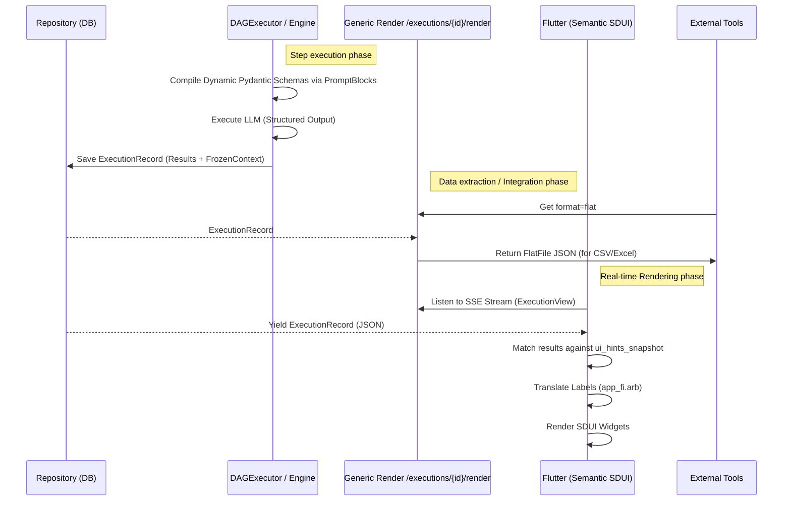

# End-to-End Output Generation Pipeline (V5.1 / Phase 9 Hardening)

## Overview

This document details the complete lifecycle of data execution in the Cognitive Quorum system. It traces the data flow from the initial user input, through the cognitive processing layers, database persistence, and finally to the rendering tier (SDUI & PDF).

**Core Philosophy**: The system enforces **Zero-Deploy** and **Late-Binding Omni-Channel** principles. It strictly separates **Cognition** (Thinking) from **Presentation** (Rendering). Kaikki kognitiivinen liiketoimintalogiikka ja arvioinnin kalibrointi on tietokannassa (Zero-Deploy). The "Brain" produces strict, unformatted data models; the "Renderer" translates them into human-readable visual layouts (Flutter SDUI, PDF, Flat File/CSV) based on late-binding logic.

---

## 1. The Foundation: Database & Event Log

### The Database (Service / Repository Layer)
* **Role**: The **Immutable Ledger**.
* **Function**: Persists the entire event log (`ExecutionRecord`) of the execution.
* **Significance**: Relational integrity and auditing. The database is accessed exclusively via the secure Service layer.

### The Software (GraphEngine / DAGExecutor)
* **Role**: The **Deterministic Processor**.
* **Function**:
    1. **Hydration**: Loads workflows from the Service layer (SSOT: `seed_data.json`).
    2. **Hook Execution & Universal Routing**: Pre-hooks (e.g., `input_processing.py`) intercept incoming data, injecting the User-defined `ai_description` (Semantic Intent) into the raw text payloads. This enables agnostic processing of arbitrary documents without coding changes.
    3. **Execution**: The `DAGExecutor` runs dynamic steps reading exclusively from `$inputs` and `$steps` DAG mappings.
    4. **Standardization & Python Authority**: `PromptCompiler` dynamically builds strictly typed Pydantic V2 Domains (`Step_{id}_Response`) on the fly based on the `PromptBlock` definitions in the Seed Vault. If an LLM hallucinates an unexpected field in the DTO, it is silently dropped (`extra="ignore"`). If a required field is missing, it causes a Fail-Fast crash.
    5. **Persistence Boundary**: The engine strictly persists these generated results into `ExecutionRecord.results`, never raw untyped strings.

---

## 2. Phase I: Data Production (The "Backstage")

### 2.1 The Atomic Strikes (Dynamic DAG)
Unlike older architectures that hardcoded agent classes (`GuardAgent`, `AnalystAgent`), the V2 system is fully dynamic. Each step produces specific outputs defined by its `PromptBlock` schemas, which are persisted in the `ExecutionRecord`.

* **ExecutionRecord Structure**:
  * `id`: The unique execution identifier.
  * `status`: Current state (e.g., pending, running, completed, failed).
  * `results`: The explicit key-value dictionary where output pairs from the dynamic Pydantic schemas are saved.
  * `frozen_context`: A critical snapshot taken at execution start.
    * `ui_hints_snapshot`: Locks the SDUI rendering definitions (`ComponentType`, `validation_rules`) mapped from the `PromptBlock`.

> *Note: Agents operate in a Vacuum. They do not know about Flutter, PDFs, or translations.* 
> 🚫 **Forbidden in Workflow/Agents**: Agents MUST NOT perform string formatting for UI (e.g., adding `%` signs), compute layout coordinates, or inject localization strings. They only produce raw data values (e.g., `score: 4`).

---

## 3. Phase II: State Presentation & Rendering (Omni-Channel)

Because `ExecutionRecord` contains massive amounts of raw internal event logs, it must be mapped via exact keys to the frozen UI definitions.

### 3.1 The Generic Render Endpoint
* **Location**: `backend_v2/api/routers/execution/executions.py`
* **Endpoint**: `GET /executions/{execution_id}/render?format={json|flat|pdf}`
* **Role**: Serves as the Universal Transformer Hub. Instead of creating specific code for each view type, this endpoint dynamically applies serializers.
* **Use Cases**:
    * **Simulations / Debugging (`json`)**: Allows developers to view the exact raw Pydantic JSON state without UI formatting.
    * **Data Integrations (`flat`)**: Flattens nested results via `FlatFileService` for immediate CSV export to enterprise integration pipelines.

---

## 4. Phase III: Rendering Environments (Late-Binding)

### 4.1 Flutter SDUI (Client App)
* **Source**: Real-time SSE Stream hitting `ExecutionView` / Riverpod State.
* **Mechanism**:
    1. Frontend requests execution details and starts listening to the SSE Stream.
    2. The API triggers the strictly typed database lookup and yields `ExecutionRecord` models to the stream.
    3. The Frontend `SDUIWidgetFactory` reads the `ui_hints_snapshot` map.
    4. **I18N No-String Mandate**: `SDUIWidgetFactory` matches the keys from `results` against the components mapped in the `ui_hints_snapshot` and dynamically interprets localization Enum Keys (Not translated strings) using `.arb` files and ICU plurals/formatting.
    5. **Graceful Degradation**: If backend validation fails or the stream is interrupted, Flutter degrades safely preventing white screens but logs `🔴 UI GRACEFUL DEGRADATION` for the developer.

### 4.2 PDF Generation & Flat File/CSV Export (Server-Side)
* **Mechanism**:
    1. The PDF generator directly uses the same `ExecutionRecord` payload via the endpoint `format=pdf`.
    2. Because PDF generation is server-side, it is the *only* place permitted to use the internal translation dictionaries (if necessary, though avoiding it is preferred) to resolve strings directly on the server before rendering to the PDF layout via `PdfReportService`.
    3. **CSV/Flat-File Export**: `FlatFileService` tarjoaa täyden datapariteetin litteänä listana, jolloin integraatiot ja BI-raportointi sujuvat ongelmitta.

---

## 5. Summary Diagram

