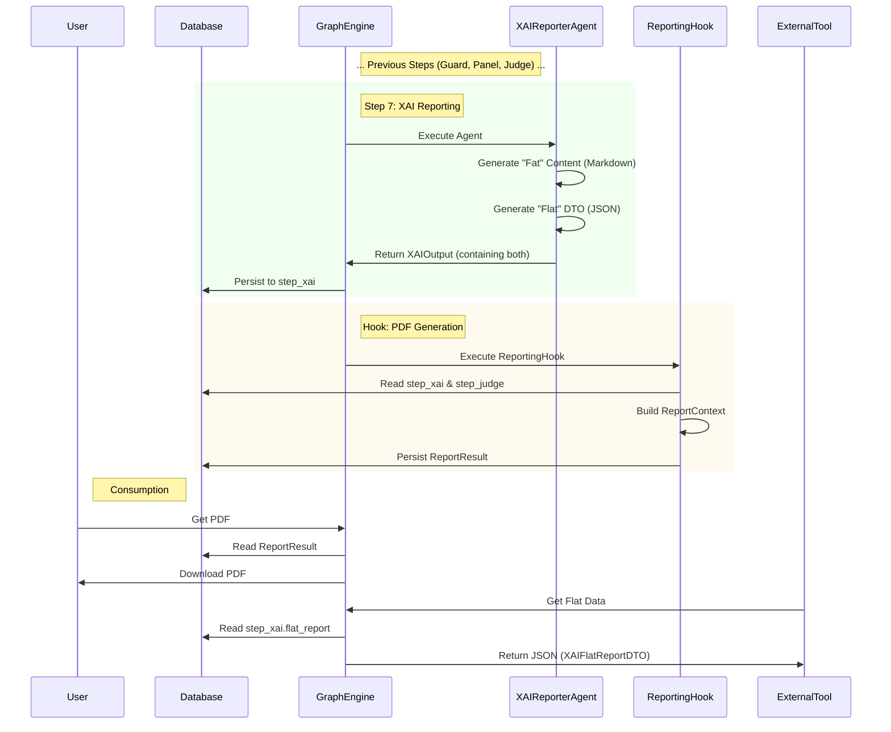

# End-to-End Output Generation Pipeline (V3.2 - Phase 8 Standards)

## Overview

This document details the complete lifecycle of an output artifact (PDF Report or UI Screen) in the Cognitive Quorum system. It traces the data flow from the initial user input, through the cognitive processing layers, database persistence, and finally to the rendering tier.

**Core Philosophy**: The system separates **Cognition** (Thinking) from **Presentation** (Rendering). The "Brain" produces strict data models; the "Renderer" translates them into human-readable formats.

**Architecture Hardening Mandate (Phase 8)**: All data exchange between layers (Service -> Agent -> Hook -> Presentation) **MUST** use strict Pydantic models. Raw dictionaries or unstructured strings are strictly forbidden in internal APIs.

---

## 1. The Foundation: Database & Software Roles

### The Database (TinyDB / Firestore)
*   **Role**: The **Immutable Ledger**.
*   **Function**: Persists the entire event log (`WorkflowState`) of the execution.
*   **Significance**: Every output is reproducible. We can regenerate a report from past executions exactly as it was.

### The Software (GraphEngine & Agents)
*   **Role**: The **Deterministic Processor**.
*   **Function**:
    1.  **Hydration (Relational Model)**: Loads workflow *skeletons* and hydrates Step Definitions from the **Step Registry** (`UnifiedWorkflowRepository`). **No embedded steps allowed.**
    2.  **Execution**: Runs Agents (LLM) and Hooks (Python).
    3.  **Standardization**: Converts fuzzy LLM text into strict **Pydantic V2 Domain Models**.
*   **Significance**: The software ensures that the "raw material" for the report is strictly typed and validated before rendering begins.

---

## 2. Phase I: Data Production (The "Backstage")

### 2.1 The Atomic Strikes (Strict Execution Steps)
The pipeline is composed of 7 discrete, strictly typed execution steps ("Atomic Strikes"). Each step produces a specific **Domain Model** that is persisted in the `WorkflowState`.

| Step ID | Agent | Input Model | Output Model (Domain) | Persistence Key |
| :--- | :--- | :--- | :--- | :--- |
| **01** | `GuardAgent` | `GuardInput` | `GuardOutput` | `step_guard` |
| **02** | `AnalystAgent` | `AnalystInput` | `AnalystOutput` | `step_analyst` |
| **03** | `InteractionAgent` | `InteractionInput` | `InteractionOutput` | `step_interaction` |
| **04** | `PanelAgent` | `PanelInput` | `PanelOutput` | `step_panel` |
| **05** | `JudgeAgent` | `JudgeInput` | `JudgeOutput` | `step_judge` |
| **06** | `CoachAgent` | `CoachInput` | `CoachOutput` | `step_coach` |
| **07** | `XAIReporterAgent` | `XAIReporterInput` | `XAIOutput` | `step_xai` |

### 2.2 Detailed Model Schemas

#### Step 1: Guard (`GuardOutput`)
Ensures data safety and PII redaction *before* cognitive load.
*   **`is_safe`** (bool): If False, pipeline halts (Fail Fast).
*   **`tainted_data`** (TaintedData | None): Details on what was redacted (PII, toxicity).
*   **`reasoning_trace`** (ReasoningTrace): Hidden thinking process.

#### Step 2: Analyst (`AnalystOutput`)
Provides grounded context via RAG.
*   **`search_results`** (list[dict]): Raw search metadata.
*   **`document_analysis`** (str): Synthesis of retrieved documents.
*   **`knowledge_items`** (list[KnowledgeItem]): Strict references to KB artifacts.

#### Step 3: Interaction (`InteractionOutput`)
Analyzes user intent and agency.
*   **`user_agency`** (Enum): `Driver` (Active) vs `Passenger` (Passive).
*   **`parameters`** (dict): Extracted intent parameters.

#### Step 4: Panel (`PanelOutput`) - **FUSED**
The "Fused Courtroom" concept. One Agent, Multiple Personas.
*   **`logician_output`** (LogicianData): Logical consistency checks.
*   **`falsifier_output`** (FalsifierData): Counter-arguments and stress tests.
*   **`profiler_output`** (ProfilerData): Psychological/Behavioral profiling.
*   **`overseer_output`** (OverseerData): Meta-cognitive supervision (Process Adherence).

#### Step 5: Judge (`JudgeOutput`)
The Scoring Authority.
*   **`score_card`** (JudgeScoreCard): Strict, auditable scoring object.
    *   **`total_score`** (float): 0.0 - 5.0.
    *   **`verdict`** (str): "Approved", "Rejected", "Conditional".
    *   **`dimensions`** (list[DimensionResultInt]): Granular criteria scores (e.g., "Clarity: 4/5").
*   **`matrix_id`** (str): Reference to the Evaluation Matrix used (e.g., `matrix_standard_v2`).

#### Step 6: Coach (`CoachOutput`)
Pedagogical feedback loop.
*   **`actionable_steps`** (list[str]): Concrete advice for improvement.
*   **`bibliography`** (list[BibliographyItem]): Formatted references.

#### Step 7: XAI Reporter (`XAIOutput`)
The Final Verdict and Data Export.
*   **`executive_summary`** (str): High-level overview.
*   **`final_verdict`** (str): Concluding statement.
*   **`confidence_score`** (float): 0.0 - 1.0.
*   **`flat_report`** (XAIFlatReportDTO): **[NEW]** Flattened, formatting-free data for external tools.

---

## 3. Phase II: The Reporting Architecture

### 3.1 The "Two-Report" Strategy (Fat vs. Flat)
To satisfy both high-fidelity rendering (PDF) and data integration (BI Tools), the `XAIReporterAgent` produces **two** distinct artifacts in its output.

#### A. The "Fat Report" (`ReportContext`) via ReportingHook
*   **Purpose**: Human Consumption (PDF, UI).
*   **Format**: Deeply nested, rich JSON.
*   **Content**: Full reasoning traces, markdown text, complex objects, bibliography.
*   **Persistence**: Stored in `audit_results` (or computed on-the-fly from `step_xai` + `step_judge`).
*   **Consumer**: Jinja2 Templates, Flutter "Read Mode".

#### B. The "Flat Report" (`XAIFlatReportDTO`) via XAIReporterAgent
*   **Purpose**: Machine Consumption (Data Warehouse, Excel, BI).
*   **Format**: Flat JSON (Key-Value pairs). **No Markdown.**
*   **Content**:
    *   `execution_id` (UUID)
    *   `timestamp` (ISO8601)
    *   `verdict` (String)
    *   `score_total` (Float)
    *   `top_strength_id` (String)
    *   `top_weakness_id` (String)
    *   `flattened_scores` (Dict[str, float]): e.g., `{"clarity": 4.5, "logic": 3.0}`.
*   **Persistence**: Stored in `state.step_xai.flat_report`.
*   **Consumer**: External API consumers, Dashboard Analytics widgets.

> [!IMPORTANT]
> **Persistence Mandate**
> Both artifacts are persisted. The database must contain the *exact* data used to generate the PDF (Fat) and the *exact* data exported to the BI tool (Flat) to ensure forensic auditability.

---

## 4. Phase III: Rendering (The "Artist")

### 4.1 PDF Generation (Legacy & High-Fidelity)
*   **Source**: `ReportContext` (The "Fat" Report, prepared by `ReportingHook`).
*   **Engine**: Jinja2 + WeasyPrint (or compatible).
*   **Logic**:
    1.  `ReportingHook` aggregates all agent outputs into a validated `ReportContext` object.
    2.  Use existing PDF generation logic to render this context into a document.
    3.  **Note**: This does *NOT* use the "Flat" report. It requires the full, rich context (markdown, citations, reasoning).

### 4.2 Flutter UI (BFF Pattern)
*   **Source**: `WorkflowState` (Domain Models: `step_xai`, `step_judge`).
*   **Transformation**: `ReportTransformer` (Backend-for-Frontend).
*   **Mechanism**:
    1.  Frontend requests `/workflows/{id}/report`.
    2.  Backend `ReportTransformer` converts Domain Models to `ReportView` (ViewModel).
    3.  **Note**: Flutter does *NOT* use the "Flat" report. It uses a View Model optimized for widgets.
    4.  **Responsive Layout**: Koodaan älykkään responsiivisen "LayoutBuilder"-apufunktion SpecialistSection.dart-tiedostoon ja kytken sen pala palalta Logic-analyysiin (Matriisi), Kausaaliseen analyysiin, Profiloijaan ja Tuomariin. Tämä tekee kaikista analyyseista monisarakkeisia leveillä näytöillä ja pinottuja mobiililla.

### 4.3 External Integration (The "Flat" Standard)
*   **Source**: `step_xai.flat_report` (`XAIFlatReportDTO`).
*   **Purpose**: BI Tools, Excel, Data Warehousing.
*   **Mechanism**:
    1.  External Tool requests `/workflows/{id}/flat`.
    2.  Backend returns the pre-calculated `XAIFlatReportDTO` directly.
    3.  **Characteristics**: One-dimensional JSON (Key-Value), no Markdown, machine-readable.

---

---

## 5. Resilience & The Developer Visibility Mandate (Phase 8.1)

The output generation pipeline operates simultaneously under two opposing constraints: **Zero-Compromise Domain Logic** and **Graceful UI Degradation**. To bridge this gap without losing observability, the system enforces the **Developer Visibility Mandate**.

### 5.1 The Dual-Requirement
1. **The Brain (Domain Layer)**: Strict "Fail Fast". If an LLM generates a score of 101/100, the Agent crashes (raising `ValueError` / RFC 7807 `AppException`). Invalid logic must never corrupt the Single Source of Truth (`WorkflowState`).
2. **The Artist (Rendering/BFF Layer)**: "Graceful Degradation". If the BFF finds that an Agent completely failed to generate its specialist data (e.g., `step_logician` is missing or invalid), the UI must **not** crash. A missing logic analysis should just render as an empty box or specific fallback widget (e.g., `USAGE_STATS`), allowing the rest of the report (scores, facts, etc.) to remain visible to the user.

### 5.2 Implementation of the Mandate
To ensure that UI Resilience does not act as a rug under which bugs are swept, the pipeline implements strict Developer Visibility:
* **Backend BFF (`bff_transformer`)**: When returning `{}` (empty dict) as a fallback for missing section data, the Python code MUST execute `logger.warning("Missing data for [Section]...")`.
* **Frontend UI (Flutter)**: When the component tree routes an unknown, missing, or broken `UiSection` type to a generic `ErrorView` or `SizedBox.shrink()`, the Dart code MUST execute `debugPrint('🔴 UI GRACEFUL DEGRADATION: ...')`.

This guarantees that users experience a seamless (if partially empty) application, while developers instantly see loud warnings in their local `client_debug.log` and backend logs (Logfire) indicating that the Data Integrity pipeline failed to provide full data.

---

## 6. API Access Layer

To support both high-fidelity rendering, raw data integration, and dynamic UI building, the system exposes distinct endpoints for retrieving different representations of the execution artifacts.

### 6.1 Fetching the "Fat Report" (Context)
*   **Endpoint**: `GET /api/v1/workflows/{execution_id}/report`
*   **Response Model**: `ReportContext` (JSON)
*   **Use Case**:
    *   **Forensics**: Auditing the full chain-of-thought and deep reasoning.
    *   *Note: This is the raw heavy domain state, not optimized for UI.*

### 6.2 Fetching the "Flat Report" (Integration)
*   **Endpoint**: `GET /api/v1/workflows/{execution_id}/flat`
*   **Response Model**: `XAIFlatReportDTO` (JSON)
*   **Use Case**:
    *   **BI Tools**: PowerBI / Tableau integration.
    *   **External Dashboards**: Aggregating stats across thousands of runs.
    *   **Excel/CSV Export**: Simple data dumps.

### 6.3 Fetching the BFF "ReportView" (SDUI)
*   **Endpoint**: `GET /api/v1/workflows/{execution_id}/report-view`
*   **Response Model**: `ReportView` (JSON)
*   **Transformers**: `backend.api.transformers.report_transformer.ReportTransformer` & `report_core.py`
*   **Use Case**:
    *   **Unified UI & PDF Generation**: This is the single source of truth for all complex visual rendering. Both the **Flutter Frontend** (Dashboard) and the **Backend PDF Service** (`PdfReportService`) consume this *exact same* transformed View Model.
        *   *Architecture Note:* When `/api/v1/executions/{id}/pdf` is requested, the backend does **not** make an HTTP network loopback call to the UI endpoint. Instead, the `PdfReportService` shares the exact same `ReportTransformer` instance internally in-memory, achieving maximum performance while maintaining a single cohesive code path.
    *   **Mechanism**: The backend transformers safely map complex Domain objects (like `step_judge`) into strictly typed, Flutter-ready View Models (like `DimensionDisplay`), ensuring safe adherence to strict typing without fallbacks.

> [!NOTE]
> **Why are SDUI and Flat Data separate?**
> The `XAIFlatReportDTO` (Flat Data) strategically strips away hierarchy to provide raw numerical/text values for external tools like Excel or BI dashboards. However, high-fidelity visual reports (like the Flutter UI or the final PDF) require **structural and visual instructions**—such as layout constraints, colors, and specific component labels (e.g., drawing a Radar Chart with green logic nodes). The `ReportView` SDUI format encapsulates both the data *and* these rendering instructions, making it fundamentally different (and necessary) for the presentation layer.

## 7. Summary Diagram

