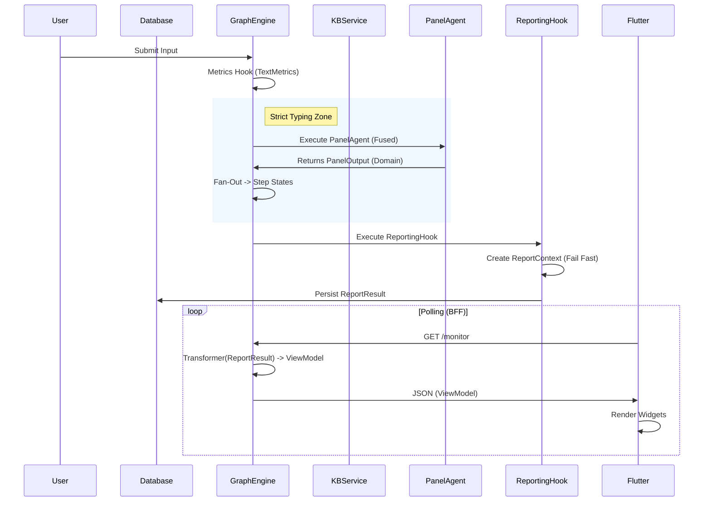

# End-to-End Output Generation Pipeline (V3.2 - Phase 8 Standards)

## Overview

This document details the complete lifecycle of an output artifact (PDF Report or UI Screen) in the Cognitive Quorum system. It traces the data flow from the initial user input, through the cognitive processing layers, database persistence, and finally to the rendering tier.

**Core Philosophy**: The system separates **Cognition** (Thinking) from **Presentation** (Rendering). The "Brain" produces strict data models; the "Renderer" translates them into human-readable formats.

**Architecture Hardening Mandate (Phase 8)**: All data exchange between layers (Service -> Agent -> Hook -> Presentation) **MUST** use strict Pydantic models. Raw dictionaries or unstructured strings are strictly forbidden in internal APIs.

---

## 1. The Foundation: Database & Software Roles

### The Database (TinyDB / Firestore)
*   **Role**: The **Immutable Ledger**.
*   **Function**: Persists the entire event log (`WorkflowState`) of the execution.
*   **Significance**: Every output is reproducible. We can regenerate a report from past executions exactly as it was.

### The Software (GraphEngine & Agents)
*   **Role**: The **Deterministic Processor**.
*   **Function**:
    1.  **Hydration (Relational Model)**: Loads workflow *skeletons* and hydrates Step Definitions from the **Step Registry** (`UnifiedWorkflowRepository`). **No embedded steps allowed.**
    2.  **Execution**: Runs Agents (LLM) and Hooks (Python).
    3.  **Standardization**: Converts fuzzy LLM text into strict **Pydantic Models** (e.g., `ScoringResult`, `TextMetrics`, `KnowledgeItem`).
*   **Significance**: The software ensures that the "raw material" for the report is strictly typed and validated before rendering begins.

---

## 2. Phase I: Data Production (The "Backstage")

### Step 1: Input & Metrics (Hook-Based)
*   **Action**: User submits text.
*   **Software**: `backend/hooks/metrics.py` (via `calculate_text_metrics` Hook).
*   **Strict Typing**: Uses `WorkflowInputs` object.
*   **Result**: `TextMetrics` model is created.
*   **Constraint**: Fail Fast on invalid input (AppException).

### Step 2: Cognitive Processing (The Panel Fusion)
*   **Action**: Agents analyze the input.
*   **Evolution (V3.2)**: We use the **Panel Pattern**.
    *   **Fused Execution**: The `PanelAgent` runs *once* but acts as multiple critics (Logician, Falsifier, Causal, Overseer).
    *   **Fan-Out**: The Agent produces a single `PanelOutput` (Domain Model) which the Engine then *fans out* to individual state keys (`step_logician`, `step_falsifier`).
    *   **Strict DTOs**: The LLM produces a `PanelOutputDTO` (Content Only). The Python Backend injects Authority (`metadata`, `timestamps`) to create the final Domain Object.

### Step 3: Retrieval & Grounding (Hybrid Strategy)
*   **Action**: `RetrievalAgent` fetches context.
*   **Software**: `backend/agents/retrieval.py` + `KnowledgeBaseService`.
*   **Lazy Inflation**: The Agent implementation safely handles legislative legacy data (dicts) while enforcing strict `KnowledgeItem` models for new executions.

### Step 4: Aggregation & Scoring (Safety Clamp)
*   **Action**: Consolidating multiple inputs into a final score (`backend/hooks/scoring.py`).
*   **Logic**: Aggregates scores from all judges and applies deterministic penalties.
*   **Safety Clamp**: Ensures `new_score = max(calculated_score, scale_min)`. This prevents scores from dropping below the schema minimum (e.g., 0.1), avoiding Pydantic validation crashes.
*   **Result**: `ScoringResult` (Total Score, Average, Penalties).

---

## 3. Phase II: The Bridge (Logic to Presentation)

### Software: `ReportingHook` (`backend/hooks/reporting.py`)

The `generate_report` hook acts as the **Director**.

1.  **Data Gathering**: Reads from `context_variables` (strictly typed).
2.  **Context Construction**: Instantiates the **`ReportContext`** Pydantic model.
    *   *New (V3.2)*: Extracts `knowledge_items` (List[KnowledgeItem]) from `step_retrieval` and passes them strictly to the report context.
3.  **Strict Validation**: The `ReportContext` constructor performs strict type checking. If any required field (e.g., `average_score`, `scores`, `knowledge_items`) is missing or invalid, the process **Fails Fast** (AppException).
4.  **Normalization**: Converts various data shapes into a unified structure.

---

## 4. Phase III: Rendering (The "Artist")

### The Golden Rule: JSON First (Single Source of Truth)
**Mandate**: The system MUST generate a complete, validated `ReportContext` (JSON/Pydantic) **BEFORE** any rendering takes place.

1.  **Creation**: The `ReportingHook` first aggregates all data into a `ReportContext` object.
2.  **Validation**: This object is strictly validated by Pydantic (fail fast if data is missing).
3.  **Persistence**: This JSON object is saved in `ReportResult.data` in the workflow state.
4.  **Rendering**:
    *   **PDF**: Jinja2 uses this EXACT JSON object to render Markdown/PDF.
    *   **Screen**: The Frontend uses this EXACT JSON object (`ReportResult.data`) to render the UI.

This guarantees that the PDF and the Dashboard **ALWAYS** show identical numbers, texts, and references.

### Target A: PDF / Markdown Report
*   **Source**: `ReportContext` (The JSON).
*   **Engine**: **Jinja2**.
*   **Process**: `ReportingHook` -> `ReportContext` -> `Jinja2` -> Markdown -> PDF.
*   **Bibliography**: The `ReportContext.bibliography` field is the authoritative list. The Template iterates this list; it does NOT generate references itself.

### Target B: The Screen (Flutter UI / BFF)
*   **Pattern**: **BFF (Backend-for-Frontend)** via **Transformers**.
*   **Software**: `backend/api/transformers/`.
*   **Role**: Converts Domain Models (Python Pydantic) into UI ViewModels (JSON for Flutter).
*   **Example**: `AssessmentTransformer` converts `ContextData` into a `StepContext` view model.

#### Transformer Example (Retrieval)
When the Frontend polls `/monitor`, the `RetrievalTransformer` does this:
1.  Receives `ContextData` from the workflow state.
2.  Maps `knowledge_items` (List[KnowledgeItem]) to `KnowledgeCardViewModel` (JSON).
    ```json
    {
      "type": "knowledge_list",
      "items": [
        {
          "term": "GDPR",
          "definition": "General Data Protection Regulation...",
          "source": "privacy_policy.docx"
        }
      ]
    }
    ```
3.  The Flutter client renders this as a carousel of cards, NOT a blob of text.

---

## 5. Summary Diagram


