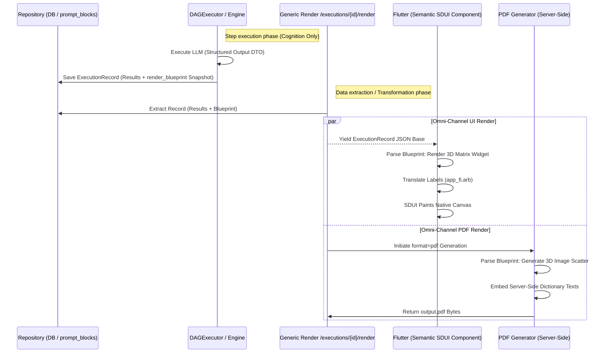

# End-to-End Output Generation Pipeline (V6.0 / Dynamic SDUI Blueprints)

## 0. Tavoite (System Objective)
Tämän järjestelmän päätavoite on rakentaa **radikaalisti joustava ja ylläpidoltaan huoltovapaa tulostusarkkitehtuuri** (Zero-Deploy UI). 

Tämä saavutetaan erottamalla tekoälyn "kognitiivinen aivotyö" (tiedon louhinta ja pisteytys) täydellisesti sen "graafisesta esittämisestä" (datan näyttäminen käyttäjälle). Tavoitteena on kyetä luomaan, muokkaamaan ja poistamaan mielivaltaisen monimutkaisia tekoälyraportteja – olivatpa ne sitten interaktiivisia mobiilinäkymiä tai paperisia PDF-tulosteita – puuttumatta riviäkään itse ohjelmakoodiin, yksinomaan tietokannan asetteluohjeita (Blueprints) manipuloimalla.

## 1. Overview

This document details the complete lifecycle of data execution in the Cognitive Quorum system. It traces the data flow from the initial user input, through the cognitive processing layers, database persistence, and finally to the rendering tier (SDUI & PDF).

**Core Philosophy**: The system enforces **Zero-Deploy**, **Late-Binding Omni-Channel**, and **Semantic Display Flow** principles. 
Se erottaa täysin kognitiivisen työn (LLM/DAG) ja sen **visuaalisen esittämisen**. Kaikki kognitiivinen liiketoimintalogiikka, tulostuksen asettelu (layout) ja tekstit määritellään tietokannassa. Kognitio tuottaa raakaa JSON-tulosta, ja renderöintimoottorit (Flutter SDUI, PDF) kokoavat datan, visualisoinnit ja oikeakieliset käännökset abstraktien "Blueprinteiksi" kutsuttujen ohjeiden varassa.

---

## 1. The Foundation: Database & Event Log

### The Database (Service / Repository Layer)
* **Role**: The **Immutable Ledger & Layout Master**.
* **Function**: Persists the entire event log (`ExecutionRecord`) and the visual definitions (`render_blueprint`).
* **Significance**: Relational integrity and zero-deploy updates. The database is accessed exclusively via the secure Service layer.

### The Software (GraphEngine / DAGExecutor)
* **Role**: The **Deterministic Processor**.
* **Function**:
    1. **Hydration**: Loads workflows from the Service layer (SSOT: `seed_data.json`).
    2. **Hook Execution & Universal Routing**: Pre-hooks (e.g., `input_processing.py`) intercept incoming data, injecting the User-defined `ai_description` (Semantic Intent) into the raw text payloads. This enables agnostic processing of arbitrary documents without coding changes.
    3. **Execution**: The `DAGExecutor` runs dynamic steps reading exclusively from `$inputs` and `$steps` DAG mappings.
    4. **Standardization & Python Authority**: `PromptCompiler` dynamically builds strictly typed Pydantic V2 Domains (`Step_{id}_Response`) on the fly based on the `PromptBlock` definitions in the Seed Vault. If an LLM hallucinates an unexpected field, it is silently dropped (`extra="ignore"`). If a required field is missing, it causes a Fail-Fast crash.
    5. **Persistence Boundary**: The engine strictly persists these generated results into `ExecutionRecord.results`.

---

## 2. Phase I: Data Production (The "Backstage")

### 2.1 The Atomic Strikes (Dynamic DAG)
Unlike older architectures that hardcoded agent classes (`GuardAgent`, `AnalystAgent`), the V2 system is fully dynamic. Each step produces specific outputs defined by its `PromptBlock` schemas, which are persisted in the `ExecutionRecord`.

* **ExecutionRecord Structure**:
  * `id`: The unique execution identifier.
  * `status`: Current state (e.g., pending, running, completed, failed).
  * `results`: The explicit key-value dictionary where output pairs from the dynamic Pydantic schemas are saved.
  * `render_blueprints`: **(Asettelu)** Lukitsee työnkulun dynaamisen ulkoasun. Määrittelee tarkalleen, *visuaalisen puitteen* jolla kognitiivinen data näytetään (1D, 2D, 3D graafit). **(HUOM: Tämä on puhdas kehys ilman renderöintiarvoja tai dataa!)**

> *Note: Tietokanta (ExecutionRecord) on Single Source of Truth Vain faktuaaliselle datalle.* 
> 🚫 **Forbidden (DB Purity Mandate)**: Tietokantaan ei saa koskaan tallentaa käyttöliittymän laskennallisia renderöintimuuttujia (kuten `visual_pct`, koordinaatteja tai lokalisointeja). Tietokanta säilytetään matematiikasta vapaana ja muuttumattomana event-lokina. Pydantic `extra="forbid"` pakottaa tämän.

---

## 3. Phase II: State Presentation & Rendering (Omni-Channel)

Koska `ExecutionRecord` sisältää valtavan määrän raakaa lokidataa, se on yhdistettävä `render_blueprint`-määrittelyyn, joka kertoo, mitkä asiat nostetaan esille ja missä muodossa.

### 3.1 Työnkulkukohtaiset Bluekuvat (Workflow-Specific Layouts)
Jokaisella työnkululla (esim. Massahaku, Reklamaatio) voi olla **useita täysin uniikkeja tulosten asetteluja** (esim. "Johdon Yhteenveto" vs. "Tekninen Syväanalyysi") ilman riviäkään uutta front-end -koodia. Tämä on **Semantic Display Flow**:

Tietokannan `render_blueprint` -kokoelma sisältää työnkulkuun liitettyjä asetteluja. Blueprint koostuu esityssivuista (Pages/Sections) ja niiden sisältämistä dynaamisista visualisoijista. Se reitittää `results`-avaimet suoraan graafisiin komponentteihin:

* **1D-Visualisoijat (Jana-tyylinen)**
  * Käyttötarkoitus: Eristetyt yksittäiset mittarit.
  * Esimerkki: Yksinkertainen edistymispalkki, luottamusmittari (Confidence Score 0-100%).
  * Datareititys: Hakee tuloksen esim. polusta `$steps.analyst.score`.

* **2D-Visualisoijat (Kaksiulotteinen Matriisi)**
  * Käyttötarkoitus: Vertailevat analyysit, siroitekuviot.
  * Esimerkki: "Logiikka vs Tunteet" -nelikenttä.
  * Datareititys: Hakee matriisidatan: X-akseli `$steps.logic.score`, Y-akseli `$steps.emotion.score`.

* **Numeeristen arvioiden Sanalliset Perustelut (Evaluation Notes / Justifications)**
  * Käyttötarkoitus: LLM:n tuottaman laadullisen analyysin (`evaluation_notes`) esittäminen visuaalisen graafin rinnalla.
  * Moniulotteisten graafien (2D/3D) käsittely: Blueprint mahdollistaa usean selitteen kytkemisen samaan näkymään. Esimerkiksi 2D-matriisissa Blueprintiin voidaan määritellä "Selite-paneeli", joka kokoaa akselien perustelut yhteen paikkaan:
    * `x_axis_note`: `$steps.logic.evaluation_notes`
    * `y_axis_note`: `$steps.emotion.evaluation_notes`
  * Datareititys: Koska nämä tekstit ovat LLM:n dynaamisesti tuottamia (eivät staattisia matriisilabelita), ne tulostetaan suoraan sellaisenaan ilman lokaalin sanakirjan käännöstä. Blueprint päättää vain *visuaalisen puitteen* (esim. Listanäkymä, Tooltip tai Tab-rakenne, johon nämä tekstit renderöidään).

* **3D-Visualisoijat (Kolmiulotteinen Matriisi / Validioitu Tutka)**
  * Käyttötarkoitus: Kompleksisen arvioinnin validiointi.
  * Esimerkki: X/Y-akselilla peruspisteet, mutta kuvaajan *pallon koko* tai väri määräytyy kolmannesta dimensioista, kuten "Citation Integrity" (Kuinka uskollinen todistusaineisto tälle pisteelle löytyi).
  * Datareititys: Tuo yhteen tuloksia useasta solmusta `$steps.judge.score`, `$steps.critic.score`, ja `$steps.falsifier.audit_confidence`.

### 3.1.1 Keskitetty Lähdeluettelo ja Viittaukset (Unified Bibliography)
Kognitiivinen tekoälymoottori käyttää `evaluation_notes` -teksteissään tieteellisiä tekstinsisäisiä viittauksia (esim. `(Toulmin 2003)`). Arkkitehtonisena linjauksena **lähdeluetteloa ei pilkota osiin**, vaan se kootaan yhdeksi globaaliksi luetteloksi koko tulosteen loppuun:
1. **Aggregaatio ajon aikana:** Kun DAG-moottori suorittaa askeleet, taustalla pyörivät Pydantic-koukut (Backend V2 Integrity Layer) keräävät automaattisesti kaikki `evaluation_notes` -kentissä esiintyneet lähteet (citation_reference).
2. **Tallennus:** Nämä kootaan yhdeksi siistiksi `$global.bibliography` tai `$results.bibliography` -listaksi `ExecutionRecord`in juureen.
3. **Render Blueprint:** Blueprintin määritelmässä sivun tai raportin aivan loppuun voidaan asettaa `BibliographyFooter` -komponentti, joka yksinkertaisesti tulostaa tämän yhdistetyn ja deduplikoidun listan. 
Tämä pitää Flutter/PDF-esityksen puhtaana ja akateemisena ilman, että lähteitä toistetaan jokaisen yksittäisen graafin alla.

### 3.1.2 Globaali Metatietojen Näkymä (Execution Metadata Panel)
Jokainen `ExecutionRecord` sisältää rikasta metatietoa ajetusta työnkulusta (esim. `execution_id`, `timestamp`, `ai_model`, `duration_ms` jne.). Kuten lähdeluettelo, metatietoa ei ripotella hajalleen pitkin komponentteja.
1. **SSOT-Lähde:** Data lepää juuritasolla `ExecutionRecord.metadata` kohdassa, eli täysin erillään itse kognitiivisen datan `$results` -hierarkiasta.
2. **Kertaalleen Renderöinti:** Blueprintin sivumäärittely (Page Definition) tukee globaaleja asetteluja. Metatieto upotetaan tyypillisesti raportin alkuun `HeaderPanel` tai loppuun `FooterPanel` (ennen lähdeluetteloa). Esimerkiksi `GlobalMetadataComponent` hakee suoraan juurioliolta polun: `$metadata.timestamp` ja tulostaa sen **vain yhden kerran koko dokumentissa**.

Näin vältetään täysin staattisen tiedon redundanssi 1D/2D/3D -graafien sisällä, tehden katselukokemuksesta järjestelmällisen. Blueprint pitää asiat hallinnassa yhdellä visuaalisella MDI-paneelilla / Infoboxilla.

### 3.2 Late-Binding Käännökset ja Matriisien Tekstien Tuonti (Localization Injection)
Tulosteessa ei koskaan talleteta generoitua kieltä tai käyttöliittymätekstejä `results`-kokoelmaan. Blueprint sisältää ainoastaan käännösavaimia (`title: "report.complaint.header"`) tai viittauksia tietokannan matriiseihin.

**Matriisien Monikielisyys (The Translation Schema Doctrine):**
Aivan kuten näimme `seed_data.json` -rakenteessa, jokainen matriisi ja prompt-blokki sisältää `translations`-objektin. Tässä on noudatettava tiukkaa arkkitehtonista kahtiajakoa (Bifurcation):
*   **LLM Prosessointi (The Brain):** Konepellin alla, kun DAG-moottori rakentaa kehotetta (promptia) LLM:lle, se syöttää matriisien kuvaukset ja skaalat **aina englanniksi** (Language of instructions). Tämä maksimoi LLM:n ymmärryksen, sillä tekoälymallit ovat älykkäimpiä englanninkielisellä datalla.
*   **Renderöinti (The UI/PDF):** Kun `render_blueprint` käskee moottoria piirtämään matriisin X/Y-akselit ja tulostamaan skaalan "tason 4" kuvauksen, renderöintimoottori (`/render`) lukee Front-endin pyytämän kielen (esim. `Accept-Language: fi`). Moottori hakee tietokannan matriisista vastaavan solmun (esim. skaalan 4 selitteen) ja poimii sieltä `translations.fi` mukaisen arvon näytölle (Language of presentation). **Tämä on arkkitehtuurin erikseen hyväksytty poikkeus No-String -sääntöön. Staattiset UI-tekstit tulevat Frontendin `.arb`-tiedostosta, mutta dynaamiset SDUI-sisällöt resolvoidaan poikkeuksellisesti Backendin BlueprintTransformerissa asiointikielelle.**

Näin yhdestä ja samasta englanninkielisestä "Aivojen" ajosta (Execution) voidaan napin painalluksella renderöidä täydellinen suomenkielinen tai englanninkielinen raportti pelkkää asetteluohjetta (Blueprint) tulkitsemalla.

### 3.3 The Generic Render Endpoint & BlueprintTransformer
* **Location**: `backend_v2/services/blueprint.py` ja API: `GET /executions/{id}/render?format={json|flat}`
* **Role (The Calculator)**: Tämä rajapinta on ohjelmiston ainoa rendering-moottori. Se toteuttaa "Zero-Math UI" -mandaatin tekemällä on-the-fly laskelmat:
  1. Hakee `ExecutionRecord`in (Puhdas data)
  2. Mapittaa viittaukset oikeisiin lukuihin (esim. max scoret työnkulun `scales` taulukosta).
  3. **Laskee Display-muuttujat:** Tuottaa kaikki UI:n tarvitsemat valmiit laskelmat lennosta: `visual_pct` (esim. 45.6%), `x_display_value_only` (esim. "3.5"), `title` (käännetyt otsikot).
  4. Palauttaa rikkaan JSON-payloadin.
* Näin ollen Flutter ja PDF eivät tee riviäkään omaa matematiikkaa tai datan koostamista – ne ottavat vastaan valmiiksi lasketun ja formatoidun asettelun.

---

## 4. Phase III: Rendering Environments (Late-Binding Parity)

Tavoitteena on sataprosenttinen pariteetti Flutterin (Näyttö) ja PDF:n (Tuloste) välillä tukeutuen samaan Blueprint-määrittelyyn.

### 4.1.1 Dynaaminen Blueprint-Editori (GUI Builder)
Jotta arkkitehtuurin Zero-Deploy lupaus täyttyy, järjestelmään rakennetaan erillinen Hallinnan Käyttöliittymä (Blueprint Editor). Sen rooli on:
* Rakentaa uusia `render_blueprint` -määrittelyitä *workflow-kohtaisesti* ilman koodaamista.
* Käyttäjä voi editorissa valita X määrän komponentteja (Tulosteosia) haluamassaan järjestyksessä.
* Komponenttiin voidaan kytkeä 1-3 matriisia, määrittää niiden oheistietojen/perustelujen tulostus, ja valita tulostustapa (esim. 1D/2D/3D tai Metatieto-näkymä).
* Editori tallentaa "Säännöstön" (ohjelukujoukon JSON:ina), jota sekä Flutter että PDF myöhemmin resonoivat. Kumpikin moottori on ohjelmoitu tottelemaan tätä standardoitua sanastoa.

### 4.2 Kaksivaiheinen Renderöintimoottori (Dual-Engine Execution)
Molemmat renderöintiratkaisut – Flutter ja PDF – perustuvat siihen, että **ne saavat tismalleen saman JSON-pohjaisen ohjesarjan (Blueprintin) ja työnkulun tuottaman tuloksen (ExecutionRecord) yhdistelmänä.** Niiden vastuulla on tulkita tuo "Ajo, jossa on määräyksiä" omassa ympäristössään. Kyllä, tämä on teoriassa ja käytännössä täysin mahdollista abstraktiolla:

**A. Flutter SDUI (Reaaliaikainen Näyttötulostus)**
* **Käynnistin (Trigger):** Käyttäjä avaa raporttisivun. Flutter tekee estävän (Synchronous) API-kutsun `GET /executions/{id}/render?format=json`.
* **Mekanismi:** API hakee nopeasti tietokannasta `results` ja `render_blueprint` JSON:it, yhdistää ne ja palauttaa vastauksen millisekunneissa. **Tämä ei mene Workerin kautta**, koska raskasta grafiikkapiirtoa ei tehdä palvelimella.
* **Tulkinta:** Flutter sisältää koodatun `WidgetFactoryn`. Kun JSON saapuu, päätelaitteen oma suoritin (puhelin tai selain) rakentaa interaktiivisen Flutter Canvas/Widget -elementin ruudulle tukeutuen `.arb` käännöstiedostoihin lokaalisti.

**B. Palvelimen Asynkroninen PDF-Worker (Staattinen Tulostus Taskina)**
* **Käynnistin (Trigger):** Käyttäjä painaa käyttöliittymässä "Tulosta PDF" -nappia. Flutter tekee asynkronisen API-kutsun (esim. `POST /executions/{id}/render_pdf`).
* **Mekanismi:** Koska PDF-koonti raskailla SVG/PNG graafeilla voi kestää sekunteja, API palauttaa vain tiedon työn aloittamisesta (`202 Accepted`). Itse tulostus ohjataan **samalle taustaprosessille (Worker), joka suorittaa itse Quorumin LLM/DAG -ajoja**. Uutta infrastruktuuria ei perusteta.
* **Tulkinta:** Tämä olemassa oleva resurssi (Worker) ajaa asetteluohjesarjan serverillä (esim. ReportLab, Cairo tai Headless Browser). Kun ohje lukee `{ type: "2d_matrix" }`, PDF-kone mallintaa kuvat sivulle kiinni yhdessä palvelimelta lokalisoidun tekstin kanssa. Vasta tämän koontiajon päätteeksi Worker siirtää `.pdf`-tiedoston pilvitallennustilaan ja lähettää onnistumisesta signaalin/URL-linkin käyttöliittymään.

### 4.3 Yhteinen Ydinlogiikka (The Shared Core)
Vaikka näytöntulostus ja PDF-generointi tapahtuvat teknisesti eri "käynnistimien" (API vs Worker) kautta, **ne hyödyntävät 100% samaa ohjelmiston ydinlogiikkaa (Single Source of Truth)**. Tätä kutsutaan yhtenäiseksi datan alustusputkeksi:

Sama sisäinen Python-funktio (`BlueprintTransformer.resolve_component()`) laukeaa ensin molemmissa moottoreissa:
1. Käyttäjä avaa näytön -> Flutter (ExecutionReportView) kutsuu `/render` -> Palauttaa valmiiksi lasketun Blueprint/Data -JSONin Flutterille.
2. Työnkulku aloittaa PDF-tulostuksen -> Backend kutsuu TÄSMÄLLEEN SAMAA `resolve_component()` -mekanismia -> Jinja2-moottori saa tismalleen saman lasketun renderöintikartan PDF-piirturille.

Muotoilu, prosenttien tuottaminen (`visual_pct`) tai matriisien maksimiarvojen kaivaminen ei koskaan tapahdu Flutterissa tai WeasyPrint-templaatissa (Jinja2). Kaikki matematiikka hoidetaan `BlueprintTransformer` -moduulissa, taaten sen, että se mitä käyttäjä näkee kännykän ruudulla on pikselilleen sama skaala ja arvo, mikä tuodaan paperiseen PDF-asiakirjaan. Tämä on The Zero-Math UI -sääntö käytännössä.

### 4.4 Forensic Auditability & Self-Healing Fallback
Suoritusajon (*Execution*) täydellinen jatkuvuus turvataan kahdella päättelyllä, joiden ansiosta raportti voidaan aina todentaa matemaattisesti (esim. viranomaistarkastusta varten):
1. **The Frozen Context (`frozen_context.json`)**: Kun LLM-ajo alkaa, työnkulku "jäädyttää" täydellisen tilannevedoksen säännöistä (`generated_schemas`, `compiled_prompts`). Tässä tiedostossa tapahtuu radikaali erottelu: tekoälyn askeleiden kuvaukset ovat 100% englanniksi tiukassa imperatiivissa (esim. `You MUST RETURN...`), ja käyttöliittymän näytettävät tekstit ovat täysin erillisessä `ui_hints_snapshot` kuplassa. Täten LLM-promptit eivät koskaan saastu käyttöliittymäteksteillä tai lokalisaatioilla. 
2. **Synchronous Fallback & Self-Healing**: Vaikka taustaprosessi tuottaa PDF-raportin pysyvään säilöön (`data/files`), jos kyseinen tiedosto tuhoutuu tai on saavuttamattomissa, käyttöliittymän API-kutsu (`GET /render?format=pdf`) ei kaadu. Sen sijaan API hakee alkuperäisen datan, yhdistää sen kielelliseen näkymään `BlueprintTransformerin` avulla, **generoi PDF:n lennosta (in RAM)**, asettaa sen automaattisesti takaisin kovalevylle ("Self-Healing"), ja lähettää sen katkeamattomasti käyttäjälle 200 OK -koodilla. Fail-fast mandaatti edellyttää, että `BlueprintTransformer` on mukana tässäkin varareitissä, jotta `rendered_blueprint` taataan, eikä näytölle synny "V2 ARCHITECTURE VIOLATION" punaisia varoituslaatikoita tästä puuttuvasta kytköksestä.
---

## 5. Best Practices & Hazard Remediation (Golden Rules for SDUI)

Server-Driven UI (SDUI) on tehokas, mutta väärin toteutettuna teknisesti monimutkainen ja vaikeasti ylläpidettävä. Seuraavat 5 "Kultaista Sääntöä" ohjaavat toteutusta ja estävät arkkitehtuuria muuttumasta Frankensteinin hirviöksi:

**1. The Minimal Component Set (Rajoita osien määrää)**
Älä ohjelmoi kymmeniä eri komponentteja heti alkuun. Rajoita MVP-vaihe täysin minimaaliseen määrään Widgettejä, jotka kykenevät esittämään kaiken V2-raportoinnin. Kuusi komponenttia riittää: `HeaderPanel`, `1D_Gauge`, `2D_Matrix`, `3D_SpiderWeb`, `EvaluationNotesPanel`, `BibliographyFooter`.

**2. Fail-Fast UI via Pydantic Validation (Tietorakenteen vahvistaminen)**
Kaikki tietokantaan tallennettavat Blueprint-JSONit täytyy validoida Pydantic V2 -skeemoilla ennen niiden tallennusta ja uudelleen `/render` -rajapinnassa. Jos Blueprintistä puuttuu X-akselin datareititys tai `title` -avain, UI kaatuu valkoiseen ruutuun. Fail-Fast varmistaa, että virheellinen Blueprint palauttaa aina virheen 7807, jonka Flutter-sovellus voi pyydystää asiallisesti (Error Boundary).

**3. Strict Styling Independence (Ulkonäön ja Sisällön erottaminen)**
Blueprint = Sisällön asettelu (Mitä piirretään ja missä järjestyksessä). Tämä JSON ei KOSKAAN sisällä värejä (esim. `color: "#FF0000"`), marginaaleja (padding) tai fonttikokoja. 
Ulkonäkö sanellaan alustan omassa Design Systemissä (Teemat). PDF hakee värinsä omista Pydantic-teemoistaan, ja Flutter hakee Material 3 ThemeData -määrityksistään. Tämä pitää Blueprint JSON:it pieninä ja ylläpidettävinä.

**4. MVP-First Rendering (Hardcoded Blueprint MVP)**
Siirrä Dynaamisen Blueprint Editorin (GUI) ohjelmointi koko putken viimeiseksi vaiheeksi. Rakenna ensin manuaalisesti VS Codella yksi virheetön JSON-blueprint. Ohjelmoi ensin PDF-kone lukemaan tämä JSON. Sitten ohjelmoi Flutter lukemaan tämä JSON. Kun molemmat moottorit tuottavat identtisen näkymän onnistuneesti backendista, siirry vasta silloin ohjelmoimaan käyttöliittymää näiden JSON:ien rakentamiselle tietokantaan.

**5. Versiointi (Blueprint Versioning)**
Blueprint-JSON -skeemat kehittyvät ajan myötä. Jokaisella blueprintillä on oltava versio (esim. `"version": "1.0"`). Jos uusi `2D_Matrix_v2` julkaistaan, vanha `2D_Matrix` (1.0) on säilytettävä taaksepäin yhteensopivuuden turvaamiseksi, tai Blueprint-migraatio-skriptien on päivitettävä vanhat JSONit tietokannassa uuteen muotoon.

---

## 6. Summary Diagram: The V6 Blueprint Rendering Flow

---

## 7. Toteutuksen ja Testauksen Osatehtävät (Implementation Milestones)

Tämän V6.0 SDUI-arkkitehtuurin toteuttaminen vaatii strukturoidun, vaiheittaisen insinöörisuunnitelman. Seuraavat osatehtävät on suunniteltu ohjelmallisesti niin tarkasti, että **tekoälyagentti (AI Developer) pystyy lukemaan nämä askeleet ja koodaamaan ne suoraan tuotantoon**.

**Vaihe 1: Blueprint-Skeeman ja Datan Irrotus (Backend Core)**
* **Tavoite:** Luoda Pydantic-vahvistettu perusta tuhoamaan sidos laskennan ja esitystavan väliltä (Zero-String Mandate).
* **Tekniset askeleet:**
  1. Koodaa Pydantic V2 -mallit Blueprintille (esim. `RenderBlueprint`, `BlueprintComponent`), joka tukee tyyppejä kuten `header`, `1d_gauge`.
  2. Päivitä `ExecutionRecord`-tietokantamalli sisältämään erillinen `render_blueprint` (dict).
  3. Refaktoroi olemassa oleva `DAGExecutor` tallentamaan ajon päätteeksi puhdas `$results` raakadata (scoret) sekä liittämään kovaan koodattu "esimerkki Blueprint" ajolle.
* **Hyväksymiskriteeri (DoD):** LLM-ajon ohjaama työnkulku tallentuu kantaan siten, että `ExecutionRecord.results` sisältää pelkkää dataa, ja UI-lokalisoitua sanastoa ei ole generoituna tietokantaan enää lainkaan.

**Vaihe 2: Shared Core: BlueprintTransformer & UI Render API**
* **Tavoite:** Rakenna yhteinen "The Universal Transformer Hub" -ydinlogiikka ja reaaliaikainen API Frontendille.
* **Tekniset askeleet:**
  1. Koodaa Python-luokka `BlueprintTransformer`, jossa funktio `build_render_payload(execution_id)`. Se lataa kannasta datan + ohjeen ja nivoo ne yhteen (`{"type": "1d_gauge", "value": 7}`).
  2. Määrittele API-ruuteri: `GET /executions/{id}/render?format=json`.
  3. Lisää Pydantic Fail-Fast **rakenteellisille vioille**: Jos itse Blueprint JSON on korruptoitunut (tuntematon tyyppi), palauta 7807. Mutta jos viitattu kognitiivinen **data** puuttuu (agentti ei tuottanut sitä), Backendin tulee lokittaa `VALIDATION_FAILED` (Dual-Reporting) ja palauttaa kentän arvoksi `null`. Tämä mahdollistaa Frontendin Graceful Degradationin komponenttitasolla.
* **Hyväksymiskriteeri (DoD):** Rajapintakutsu palauttaa 200 OK kootulla JSON-säännöstöllä, TAI virheen 7807 jos kytkös on viallinen, millisekunneissa ilman Worker-prosessia.

**Vaihe 3: Asynkroninen PDF-Worker (Staattisen Generoinnin Perusta)**
* **Tavoite:** Kytkeä "Tulosta PDF" -komento olemassa olevaan taustaprosessiin (LLM/DAG Worker) ilman API:n jumiuttamista.
* **Tekniset askeleet:**
  1. Luo uusi rajapinta `POST /executions/{id}/render_pdf`, joka vastaa vain `202 Accepted` ja siirtää viestin Job Queueen (Workerille).
  2. Koodaa Worker-tehtävä kutsumaan luokkaa `BlueprintTransformer.build_render_payload()` (Sama kuin Vaiheksessa 2).
  3. Rakenna PDF-moottorin tehdas (esim. ReportLab), joka osaa lukea aluksi simppeleitä ohjeita (`header`, `1d_gauge`), luo sivun PDF:nä ja tallentaa levylle/pilveen.
* **Hyväksymiskriteeri (DoD):** Käyttäjä pystyy generoimaan PDF:n, ja se syntyy asynkronisesti taustalla estämättä web-palvelinta.

**Vaihe 4: Kompleksisten Komponenttien Ekstensio (2D, 3D, Notes & Bibliography)**
* **Tavoite:** Laajentaa Blueprint-järjestelmä tukemaan Cognitive Quorum V2:n The Brain -syväanalyysejä.
* **Tekniset askeleet:**
  1. Päivitä Blueprint Pydantic -skeemat tukemaan tuotteita: `2d_matrix`, `3d_scatter`, `evaluation_notes_panel` ja `metadata_header`.
  2. Rakenna **100% sanakirjapohjainen (Dictionary-based)** Integrity-koukku (Hook) keräämään koko työnkulusta kaikki `citation_reference` arvot yhdeksi yhdistetyksi Global Bibliography -arrayksi.
  3. Päivitä PDF Workerin tehdas ymmärtämään nämä raskaat graafit ja piirtämään niistä SVG/PNG kuvia dokumentin sivuille tekstin ja viittauksien viereen.
* **Hyväksymiskriteeri (DoD):** Koodattu PDF pystyy tuottamaan X/Y matriisin ja keräämään lähdeluettelon dokumentin loppuun tyylikkäästi ilman tekstin turhaa duplikaatiota.

**Vaihe 5: Flutter SDUI Widget Factory (Frontend Toteutus)**
* *(Koska painopiste on arkkitehtuurin todistamisessa, Frontend rakennetaan turvallisesti backendin valmistuttua, luottaen Shared Core Logiciin)*.
* **Tavoite:** Toteuttaa reaaliaikainen näytönpiirtäjä, joka tottelee sokeasti Blueprintin asetteluohjetta (Zero-Deploy UI).
* **Tekniset askeleet:**
  1. Flutter-tehtaan koodaus purkamaan `GET /render` API:n generoima JSON Widget-puuksi. **Käytä WidgetFactoryn toteutuksessa ehdottomasti Dart 3:n Pattern Matchingia (switch expression) JSONin `type`-avaimen purkamiseen ja `SafeCast`-luokkaa tyyppimuunnoksiin.**
  2. Reititä kaikki Blueprintin avaimet (esim. `"report.title_main"`) lennosta lokaalin `app_fi.arb` sanakirjan kautta näkyväksi tekstiksi (The Translation Schema Doctrine).
* **Hyväksymiskriteeri (DoD):** WidgetFactory rakentaa saman asettelun mobiilinäytölle identtisesti PDF:n kanssa estäen Graceful Degradationilla valkoisen ruudun, jos avaimia uupuu.

**Vaihe 6: The Final Proof: End-to-End API Testiajo (Automatisoitu Todiste)**
* **Tavoite:** Kirjallinen ja ohjelmallinen takuu siitä, että The Shared Core Architecture toimii ja tuottaa halutun Outputin 100% varmuudella ilman Frontend-asiakasohjelmaa (Clientless Validation). **Tästä vaiheesta (PDF/Python proof) ei saa ohjelmallisesti (AI Developer) edetä lainkaan eteenpäin ennen kuin testi menee fyysisesti ja puhtaasti läpi.**
* **Tekniset askeleet:**
  1. Luo uusi tai muokkaa `backend_v2/scripts/test_api_execution.py` ajoskripti.
  2. Skripti injektoi yhden esimerkkiajon systeemin läpi. Se ajaa työnkulun, tallentaa tuloksen + kovan koodin Bluekuvan.
  3. Skripti kutsuu lokaalisti asynkronista PDF-Workeria API:n kautta: *Luo tästä Executionista PDF blueprintillä X.*
  4. Skripti odottaa ja noutaa valmiin `.pdf` tiedoston fyysisenä ulostulona samaan `backend_v2/scripts/` kansioon tarkisteltavaksi.
* **Hyväksymiskriteeri (DoD):** Yhdestä napinpainalluksesta terminaalissa järjestelmä menee alusta loppuun ja fyysinen, moitteeton PDF ilmestyy ruudulle sisältäen työnkulun tekstit, matriisit ja lähdeluettelon. Kun tämä menee läpi, oletamme että myös Flutterin asettelu (Vaihe 5) on saumattomasti toimiva!

**Vaihe 7: Dynaaminen Drag-and-Drop -Editori (Admin GUI)**
* **Tavoite:** Sulkea arkkitehtuurikehä luomalla Hallintaan visuaalinen käyttöliittymä uusien työnkulkujen Blueprinttien JSON:ien kasaamiseen ilman ohjelmoijia, saavuttaen lopullisen Zero-Deploy tason. Tämän ohjelmointi aloitetaan vasta Vaiheen 6 PDF Proofin läpäisyn jälkeen.

**Vaihe 8: Kattava Yksikkötestaus (Unit Testing & CI/CD)**
* **Tavoite:** Varmistaa `pytest`-arkkitehtuurilla nopeilla testeillä (alle 1s), että The Shared Core ja PDF-Factory reagoivat oikein sekä täydellisiin että korruptoituneisiin Blueprint-ohjeisiin ohjelmistopäivitysten yhteydessä.
* **Tekniset askeleet:**
  1. **Pydantic Validation -testit:** Syötä Blueprintille tyhjiä JSON-avaruuksia, virheellisiä tyyppejä (esim. `type: "himmeli"`) ja puuttuvia käännösavaimia. Vahvista, että moottori hylkää ne ja heittää aina oikeaoppisen `AppException 7807` -virheen.
  2. **Data-Mapping -testit:** Luo Mock-ExecutionRecord ja Mock-Blueprint. Assertoi `BlueprintTransformerin` paluuarvosta, että esimerkiksi `$steps.logic.score` palauttaa oikean numeron JSON-vastauksessa ilman sivuvaikutuksia.
  3. **Translation Doctrine -testit:** Varmista API-rajapinnasta (backend integration test), että valitut tekstiviittaukset (esim. `label: "report.complaint"`) siirtyvät API-vastaukseen sellaisenaan kääntämättöminä "avaimina", ei koskaan vahingossa englannin kielelle resolvoituna koodin uumenissa.
* **Hyväksymiskriteeri (DoD):** Kaikki V6 Blueprint-arkkitehtuuriin liittyvät sadat testitestit menevät läpi CI/CD-putkessa (GitHub Actions) 100% kattavuudella ydinlogiikan (BlueprintTransformer) osalta. Näin regressointia Fail-Fast logiikkaan ja Zero-String Doctrineen ei pääse jatkossa syntymään.

