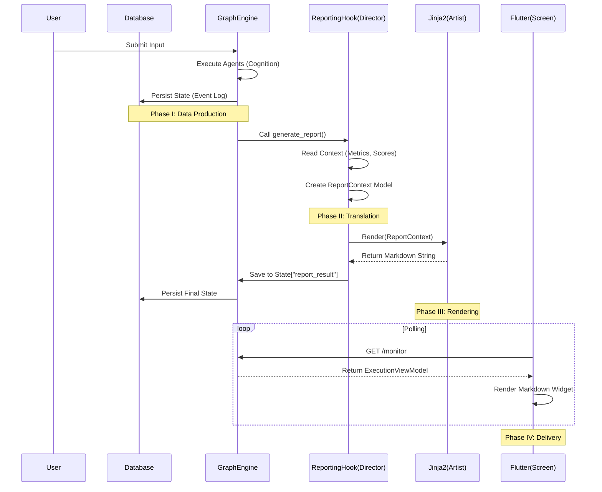

# End-to-End Output Generation Pipeline (V3.0)

## Overview

This document details the complete lifecycle of an output artifact (PDF Report or UI Screen) in the Cognitive Quorum system. It traces the data flow from the initial user input, through the cognitive processing layers, database persistence, and finally to the rendering tier.

**Core Philosophy**: The system separates **Cognition** (Thinking) from **Presentation** (Rendering). The "Brain" produces strict data models; the "Renderer" translates them into human-readable formats.

---

## 1. The Foundation: Database & Software Roles

### The Database (TinyDB / Firestore)
*   **Role**: The **Immutable Ledger**.
*   **Function**: It does not merely "store current state"; it persists the entire event log (`WorkflowState`) of the execution.
*   **Significance**: Every output is reproducible. We can regenerate a report from 6 months ago exactly as it was, because the database holds the frozen state snapshot.

### The Software (GraphEngine & Agents)
*   **Role**: The **Deterministic Processor**.
*   **Function**:
    1.  **Hydration**: Loads the workflow definition from `seed_data.json`.
    2.  **Execution**: Runs Agents (LLM) and Hooks (Python).
    3.  **Standardization**: Converts fuzzy LLM text into strict **Pydantic Models** (e.g., `ScoringResult`, `TextMetrics`).
*   **Significance**: The software ensures that the "raw material" for the report is strictly typed and validated before rendering begins.

---

## 2. Phase I: Data Production (The "Backstage")

Before any output is visible, the system must generate valid data.

### Step 1: Input & Metrics
*   **Action**: User submits text.
*   **Software**: `backend/hooks/metrics.py`.
*   **Result**: `TextMetrics` model is created (Word Count, Control Ratio).
*   **State**: Saved to `context_variables["audit_metrics"]`.

### Step 2: Cognitive Processing
*   **Action**: Agents (Analyst, Judge, etc.) analyze the input.
*   **Software**: `backend/agents/*.py`.
*   **Result**: High-level models like `AnalystOutput`, `JudgeOutput` (Scorecards).
*   **State**: Saved to `context_variables`.

### Step 3: Aggregation & Scoring
*   **Action**: Consolidating multiple inputs into a final score.
*   **Software**: `backend/hooks/scoring.py` (`apply_scoring_logic`).
*   **Result**: `ScoringResult` (Total Score, Average, Penalties).
*   **State**: Saved to `context_variables["scoring_result"]`.

---

## 3. Phase II: The Bridge (Logic to Presentation)

This is the critical "Translation" phase where raw data becomes a Report.

### Software: `ReportingHook` (`backend/hooks/reporting.py`)

The `generate_report` hook acts as the **Director**. It gathers actors (data models) onto the stage.

1.  **Data Gathering**: It reads from `context_variables`:
    *   `TextMetrics` (Input Stats)
    *   `ScoringResult` (Grades)
    *   `JudgeOutput` (Reasoning)
2.  **Context Construction**: It instantiates the **`ReportContext`** Pydantic model.
    *   *Why?* To ensure the template engine receives exactly what it expects (e.g., ensuring `word_count` is an integer, not a string or None).
3.  **Normalization**: It converts various data shapes (e.g., different Agent output formats) into a unified structure for the template.

---

## 4. Phase III: Rendering (The "Artist")

The system supports two distinct output targets: **PDF/Document** (Static) and **Screen/UI** (Dynamic).

### Target A: PDF / Markdown Report

*   **Engine**: **Jinja2** Templating Engine.
*   **Template**: `backend/templates/report_template.jinja2`.
*   **Process**:
    1.  The `ReportingHook` passes the `ReportContext` object to the Jinja2 template.
    2.  **Conditional Rendering**:
        *   *If* `input_control_ratio < 0.3`, render the "Low Activity" warning.
        *   *If* `word_count` exists, display it.
    3.  **Text Generation**: Jinja2 produces a raw Markdown string.
    4.  **PDF Conversion**: (Optional) A library like `weasyprint` or client-side PDF generator converts Markdown -> PDF.
*   **Final Artifact**: A structured, professional audit report.

### Target B: The Screen (Flutter UI)

*   **Pattern**: **BFF (Backend-for-Frontend)**.
*   **Software**: `backend/api/routes/execution.py` & `BFF Transformer`.
*   **Process**:
    1.  **Polling**: The Flutter client polls the `/monitor` endpoint.
    2.  **Transformation**: The Backend transforms the complex `WorkflowState` into a simplified `ExecutionViewModel`.
    3.  **Rendering**:
        *   The generated Markdown report (from Target A) is sent as a string `final_report_markdown`.
        *   Flutter's `MarkdownWidget` renders this string visually.
        *   Simultaneously, live status indicators (spinners, progress bars) update based on the `step_status`.

---

## 5. Summary Diagram

## 6. Artifact Persistence (Storage Driver)

Once a report is generated, it must be persisted reliably. The system uses the **Storage Driver Pattern** to ensure this happens regardless of the environment (Local vs. Cloud).

### The Process
1.  **Generation**: The `ReportingHook` produces the final Markdown/PDF content.
2.  **Resolution**: The `StorageService` provides the active driver (`LocalFileDriver` or `GCSFileDriver`).
3.  **Persistence**: The content is saved to the configured path (e.g., `reports/2026/02/audit_123.md`).
4.  **Retrieval**: The API generates a URL (local file path or signed GCS link) for the frontend to download.

### Why this matters?
*   **Dev/Prod Parity**: Developers use local files; Production uses Firebase Storage. The code (`await driver.save()`) remains identical.
*   **Immutable History**: Reports are stored permanently, allowing for historical audits even if the database state changes.

---

## Conclusion

The power of this architecture lies in **Consistency**.
Because the **PDF Report** and the **Screen Display** both originate from the same standardized `ReportContext` model populated by the same `ReportingHook`, there is zero discrepancy between what the user sees on the dashboard and what they download as a file. The database guarantees that this exact result can be retrieved and verifying years later.
