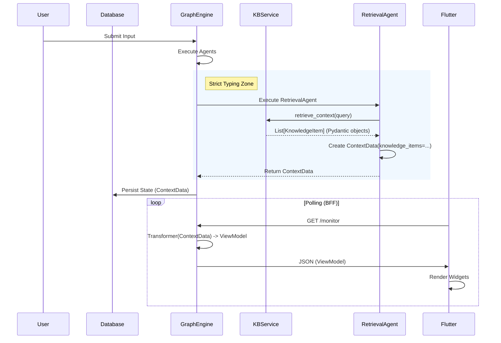

# End-to-End Output Generation Pipeline (V5.0 - Architecture Hardened)

## Overview

This document details the complete lifecycle of an output artifact (PDF Report or UI Screen) in the Cognitive Quorum system. It traces the data flow from the initial user input, through the cognitive processing layers, database persistence, and finally to the rendering tier.

**Core Philosophy**: The system separates **Cognition** (Thinking) from **Presentation** (Rendering). The "Brain" produces strict data models; the "Renderer" translates them into human-readable formats.

**Architecture Hardening Mandate (2026)**: All data exchange between layers (Service -> Agent -> Hook -> Presentation) **MUST** use strict Pydantic models. Raw dictionaries or unstructured strings are strictly forbidden in internal APIs.

---

## 1. The Foundation: Database & Software Roles

### The Database (TinyDB / Firestore)
*   **Role**: The **Immutable Ledger**.
*   **Function**: Persists the entire event log (`WorkflowState`) of the execution.
*   **Significance**: Every output is reproducible. We can regenerate a report from past executions exactly as it was.

### The Software (GraphEngine & Agents)
*   **Role**: The **Deterministic Processor**.
*   **Function**:
    1.  **Hydration (Relational Model)**: Loads workflow *skeletons* and hydrates Step Definitions from the **Step Registry** (`UnifiedWorkflowRepository`). **No embedded steps allowed.**
    2.  **Execution**: Runs Agents (LLM) and Hooks (Python).
    3.  **Standardization**: Converts fuzzy LLM text into strict **Pydantic Models** (e.g., `ScoringResult`, `TextMetrics`, `KnowledgeItem`).
*   **Significance**: The software ensures that the "raw material" for the report is strictly typed and validated before rendering begins.

---

## 2. Phase I: Data Production (The "Backstage")

### Step 1: Input & Metrics (Hook-Based)
*   **Action**: User submits text.
*   **Software**: `backend/hooks/metrics.py` (via `calculate_text_metrics` Hook).
*   **Result**: `TextMetrics` model is created.
*   **Constraint**: Fail Fast on invalid input.
*   **Pydantic Enforcement**: The input to the hook must be a valid Pydantic model or a strictly typed dictionary that matches the expected schema. No loose types allowed.

### Step 2: Cognitive Processing (Fail Fast)
*   **Action**: Agents (Analyst, Judge, Logician, Falsifier, Causal) analyze the input.
*   **Validation**: Every agent enforces strict input requirements (e.g., `Logician` requires `step_analyst`).
*   **Result**: High-level models like `AnalystOutput`.

### Step 2b: Retrieval & Grounding (Hybrid Strategy)
*   **Action**: `RetrievalAgent` fetches context.
*   **Software**: `backend/agents/retrieval.py` + `KnowledgeBaseService`.
*   **Strict Typing Flow**:
    1.  **Service Layer**: `KnowledgeBaseService` returns `list[KnowledgeItem]`.
        ```python
        class KnowledgeItem(BaseModel):
            id: str
            type: str  # "concept", "reference"
            term: str
            definition: str
            source: str
        ```
    2.  **Agent Layer**: `RetrievalAgent` consumes the list and aggregates it into `ContextData`.
        ```python
        class ContextData(ReasoningTrace):
            precedents: str  # Legacy string summary for LLM prompt context
            precedent_list: list[Precedent]
            knowledge_items: list[KnowledgeItem]  # Structured data for UI/Reports
        ```
    3.  **No raw strings**: The Service does NOT return formatted text. Formatting is the Agent's responsibility (Separation of Concerns).

### Step 3: Aggregation & Scoring
*   **Action**: Consolidating multiple inputs into a final score.
*   **Result**: `ScoringResult` (Total Score, Average, Penalties).

---

## 3. Phase II: The Bridge (Logic to Presentation)

### Software: `ReportingHook` (`backend/hooks/reporting.py`)

The `generate_report` hook acts as the **Director**.

1.  **Data Gathering**: Reads from `context_variables`.
2.  **Context Construction**: Instantiates the **`ReportContext`** Pydantic model.
    *   *New (V5.0)*: Extracts `knowledge_items` (List[KnowledgeItem]) from `step_retrieval` and passes them strictly to the report context.
3.  **Strict Validation**: The `ReportContext` constructor performs strict type checking. If any required field (e.g., `average_score`, `scores`, `knowledge_items`) is missing or invalid, the process **Fails Fast** (ValidationError).
4.  **Normalization**: Converts various data shapes into a unified structure.

---

## 4. Phase III: Rendering (The "Artist")

### The Golden Rule: JSON First (Single Source of Truth)
**Mandate**: The system MUST generate a complete, validated `ReportContext` (JSON/Pydantic) **BEFORE** any rendering takes place.

1.  **Creation**: The `ReportingHook` first aggregates all data into a `ReportContext` object.
2.  **Validation**: This object is strictly validated by Pydantic (fail fast if data is missing).
3.  **Persistence**: This JSON object is saved in `ReportResult.data` in the workflow state.
4.  **Rendering**:
    *   **PDF**: Jinja2 uses this EXACT JSON object to render Markdown/PDF.
    *   **Screen**: The Frontend uses this EXACT JSON object (`ReportResult.data`) to render the UI.

This guarantees that the PDF and the Dashboard **ALWAYS** show identical numbers, texts, and references.

### Target A: PDF / Markdown Report
*   **Source**: `ReportContext` (The JSON).
*   **Engine**: **Jinja2**.
*   **Process**: `ReportingHook` -> `ReportContext` -> `Jinja2` -> Markdown -> PDF.
*   **Bibliography**: The `ReportContext.bibliography` field is the authoritative list. The Template iterates this list; it does NOT generate references itself.

### Target B: The Screen (Flutter UI / BFF)
*   **Pattern**: **BFF (Backend-for-Frontend)** via **Transformers**.
*   **Software**: `backend/api/transformers/`.
*   **Role**: Converts Domain Models (Python Pydantic) into UI ViewModels (JSON for Flutter).
*   **Example**: `AssessmentTransformer` converts `ContextData` into a `StepContext` view model.

#### Transformer Example (Retrieval)
When the Frontend polls `/monitor`, the `RetrievalTransformer` does this:
1.  Receives `ContextData` from the workflow state.
2.  Maps `knowledge_items` (List[KnowledgeItem]) to `KnowledgeCardViewModel` (JSON).
    ```json
    {
      "type": "knowledge_list",
      "items": [
        {
          "term": "GDPR",
          "definition": "General Data Protection Regulation...",
          "source": "privacy_policy.docx"
        }
      ]
    }
    ```
3.  The Flutter client renders this as a carousel of cards, NOT a blob of text.

---

## 5. Summary Diagram


