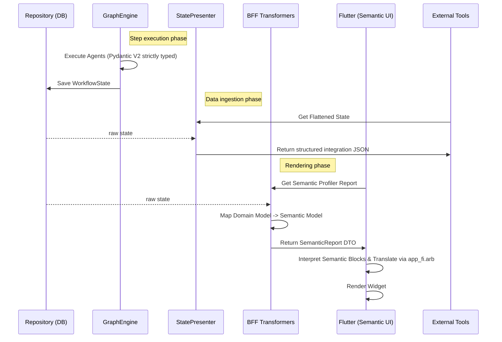

# End-to-End Output Generation Pipeline (V5.1 / Phase 9 Hardening)

## Overview

This document details the complete lifecycle of data execution in the Cognitive Quorum system. It traces the data flow from the initial user input, through the cognitive processing layers, database persistence, and finally to the rendering tier (SDUI & PDF).

**Core Philosophy**: The system enforces **Zero-Deploy** and **Late-Binding Omni-Channel** principles. It strictly separates **Cognition** (Thinking) from **Presentation** (Rendering). Kaikki kognitiivinen liiketoimintalogiikka ja arvioinnin kalibrointi on tietokannassa (Zero-Deploy). The "Brain" produces strict, unformatted data models; the "Renderer" reads BFF Transformers to translate them into human-readable visual layouts (Flutter SDUI, PDF, Flat File/CSV) based on late-binding logic.

---

## 1. The Foundation: Database & Event Log

### The Database (Service / Repository Layer)
* **Role**: The **Immutable Ledger**.
* **Function**: Persists the entire event log (`WorkflowState`) of the execution.
* **Significance**: Relational integrity and auditing. The database is accessed exclusively via the Service layer.

### The Software (GraphEngine)
* **Role**: The **Deterministic Processor**.
* **Function**:
    1. **Hydration**: Loads workflows from the Service layer (SSOT: `seed_data.json`).
    2. **Execution**: Runs `BaseAgent` implementations.
    3. **Standardization & Python Authority**: Agents accept raw LLM outputs (DTOs) and promote them to strictly typed **Domain Models** by injecting metadata (checksums, usage, etc.) before handing them back to the Engine.
    4. **Persistence Boundary**: The engine strictly persists these **Domain Models** into the database, never the raw LLM DTOs. If an LLM hallucinates an unexpected field in the DTO, it is silently dropped (`extra="ignore"`). If a required field is missing, it causes a Fail-Fast crash.

---

## 2. Phase I: Data Production (The "Backstage")

### 2.1 The Atomic Strikes
Each step produces a specific **Domain Model** persisted in the `WorkflowState`.

| Step ID | Agent | Output Model (Domain) | Persistence Key |
| :--- | :--- | :--- | :--- |
| **01** | `GuardAgent` | `GuardOutput` | `step_guard` |
| **02** | `AnalystAgent` | `AnalystOutput` | `step_analyst` |
| **03** | `InteractionAgent`| `InteractionAnalysis` | `step_interaction`|
| **04** | `PanelAgent` | `PanelOutput` | `step_panel` |
| **05** | `JudgeAgent` | `JudgeOutput` | `step_judge` |
| **06** | `CoachAgent` | `CoachingPlan` | `step_coach` |
| **07** | `XAIReporterAgent`| `XAIOutput` | `step_xai` |

> *Note: Agents operate in a Vacuum. They do not know about Flutter, PDFs, or translations.* 
> 🚫 **Forbidden in Workflow/Agents**: Agents MUST NOT perform string formatting for UI (e.g., adding `%` signs), compute layout coordinates, or inject localization strings. They only produce raw data values (e.g., `score: 0.78`).

---

## 3. Phase II: State Presentation & Transformation (BFF Layer)

Because `WorkflowState` contains massive amounts of raw internal event logs, it cannot be sent to the frontend. It must be transformed.

### 3.1 The `StatePresenter` Pattern
* **Location**: `backend/services/state_presenter.py`
* **Role**: Collapses the massive state hierarchy into a flat, deterministic JSON representation. 
* **Use Cases**:
    * **Simulations / Debugging**: Allows developers to view the exact raw state without UI formatting.
    * **Data Integrations**: Sending execution webhooks to external business tools.

### 3.2 The BFF Transformers (Semantic Transformers & Omni-Channel Hub)
* **Location**: `backend/api/transformers/domain/*.py`
* **Role**: Maps heavy Domain models to strictly typed **Semantic Models** for the Omni-Channel output. This includes extracting **Theory-Grounded XAI justifications** into the semantic blocks. *Note: We have strictly moved away from generic Server-Driven UI (SDUI) (like sending raw UI components/colors from the backend). We now send agnostic Semantic Blocks containing UI hints.*
* **Architectural Responsibility (Mathematical & Visu-Logical Formatting)**: This layer is explicitly responsible for transforming raw metrics (e.g. `score: 3.0`) into pre-calculated view-ready strings (e.g. `score_display: "3.0"`, `bubble_style: "left: 50%..."`) to ensure absolute **Parity** across all Late-Binding renderers (Flutter SDUI, Jinja2 PDF, CSV export). 
    * 🚫 **Forbidden in Transformers**: Calling LLMs or mutating database state.
* **Examples**:
    * `LogicDomainTransformer`: Maps `ToulminComponent` to `ToulminDisplay` (adds `bubble_size` calculations for the quadrant radar).
    * `ReportTransformer`: Maps execution results into a `SemanticReport` containing `SemanticSection` and `SemanticBlock`.

---

## 4. Phase III: Rendering (Late-Binding Omni-Channel)

### 4.1 Flutter SDUI (Client App)
* **Source**: `/api/v1/executions/{id}/views/...`
* **Mechanism**:
    1. Frontend requests specific views (e.g. Profiler Analysis).
    2. The API triggers the BFF Transformers.
    3. The Frontend receives lean `Display` models containing **Enum Keys** (Not translated strings).
    4. **I18N No-String Mandate**: Flutter translates the keys dynamically using `.arb` files and ICU plurals/formatting.
    5. **Graceful Degradation**: If the backend fails to extract a view, or the view is partially missing, Flutter uses `SizedBox.shrink()` to prevent white screens but logs `🔴 UI GRACEFUL DEGRADATION` for the developer.
    * 🚫 **Forbidden in Renderers**: Renderers MUST NOT perform inline mathematical combinations or conditional formatting (e.g. `{{ value | round(1) }}` or `(score * 100).toStringAsFixed(1)`). They must use the pre-calculated `_display` strings provided by the BFF to guarantee parity.

### 4.2 PDF Generation & Flat File/CSV Export (Server-Side)
* **Mechanism**:
    1. The PDF generator directly uses the same BFF Transformers and `ReportView` models as the frontend to maintain exact parity.
    2. Because PDF generation is server-side, it is the *only* place permitted to use the internal `backend/l10n` dictionary to resolve strings directly on the server before rendering to PDF.
    3. **CSV/Flat-File Export**: Sama purkautuva yhtenäinen JSON-data voidaan reitittää litistettyyn muotoon yritysjärjestelmien integraatioita varten (One-Liner). Täysi datapariteetti säilyy.

---

## 5. Summary Diagram

