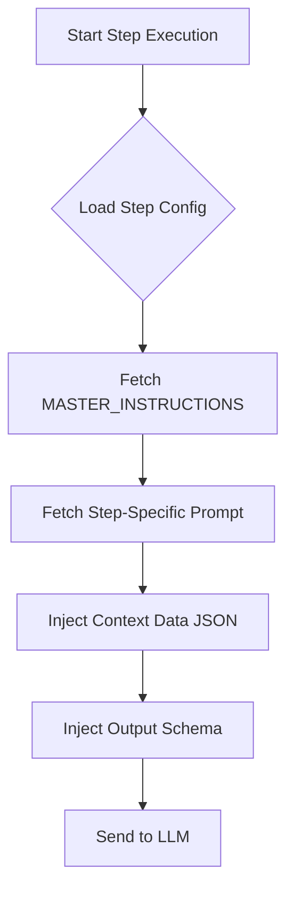
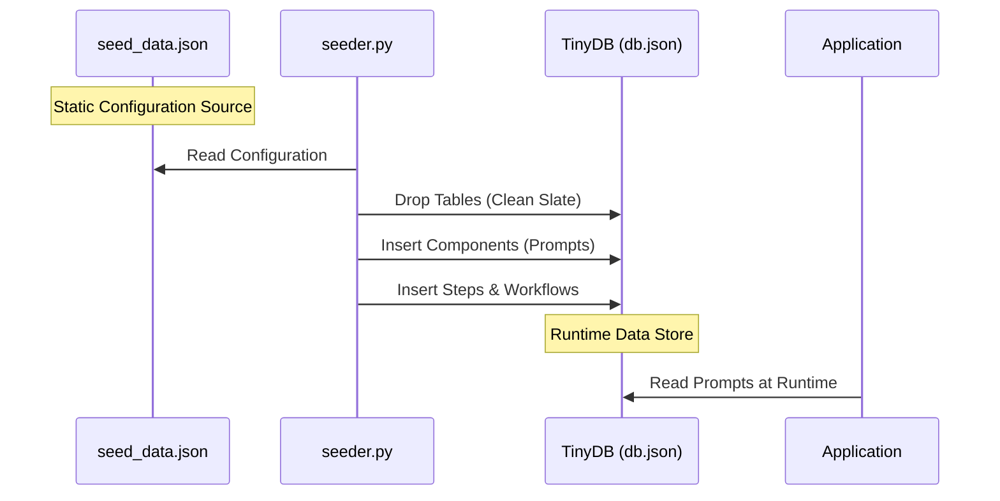

# Prompt Engineering & Data Seeding

This document explains how Cognitive Quorum v2 constructs prompts dynamically and manages its configuration data.

## 1. Dynamic Prompt Construction

The system does not use static, pre-written prompts. Instead, it assembles prompts at runtime from modular components stored in the database. This ensures flexibility, context-awareness, and strict schema enforcement.

### The Construction Pipeline

The `Executor` class (`src/engine/executor.py`) is responsible for building the final prompt sent to the LLM.

### Components of a Prompt

1.  **Master Instructions (`MASTER_INSTRUCTIONS`):**
    *   **Source:** `components` table in DB.
    *   **Purpose:** Defines the global persona (Cognitive Quorum), core principles (Truth, Role Adherence), and universal rules.
    *   **Example:** "You are COGNITIVE QUORUM... Do not hallucinate."

2.  **Step-Specific Prompt (e.g., `PROMPT_GUARD`):**
    *   **Source:** `components` table in DB.
    *   **Purpose:** Defines the specific task for the current agent.
    *   **Example:** "VAIHE 1: VARTIJA-AGENTTI... Sanitize input..."

3.  **Context Data (`CONTEXT DATA`):**
    *   **Source:** Runtime execution context.
    *   **Purpose:** Provides the actual data to process (e.g., uploaded files, previous agent outputs).
    *   **Format:** Injected as a JSON string under the header `CONTEXT DATA`.

4.  **Output Schema Enforcement:**
    *   **Source:** `src/models/schemas.py` (via `SchemaRegistry`).
    *   **Purpose:** Forces the LLM to output valid JSON matching a Pydantic model.
    *   **Mechanism:** The system generates a JSON Schema from the Pydantic model and appends a strict system instruction: *"SYSTEM: You must output a valid JSON object that strictly matches the following schema..."*

## 2. Data Seeding (Configuration Management)

The system's "intelligence" (prompts, rules, workflow definitions) is defined as **data**, not code. This data is managed in a JSON file and seeded into the database.

### The Seeding Process

### Key Files

*   **`data/seed_data.json`:** The single source of truth for all static configuration. Contains:
    *   `components`: Reusable prompt parts (Master Instructions, Agent Prompts).
    *   `steps`: Definitions of what each step does (inputs, outputs, hooks).
    *   `workflows`: Sequences of steps.
*   **`backend/seeder.py`:** The script that loads `seed_data.json` into the TinyDB database. It handles:
    *   Database cleanup.
    *   Model validation (checking if configured models exist).
    *   Data insertion.

### How to Modify Prompts

1.  **Edit** `data/seed_data.json`.
2.  **Run** `python backend/seeder.py`.
3.  **Restart** the application (if caching is used, though currently it reads from DB on demand).
