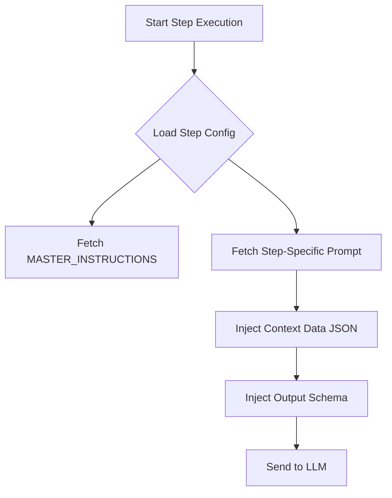
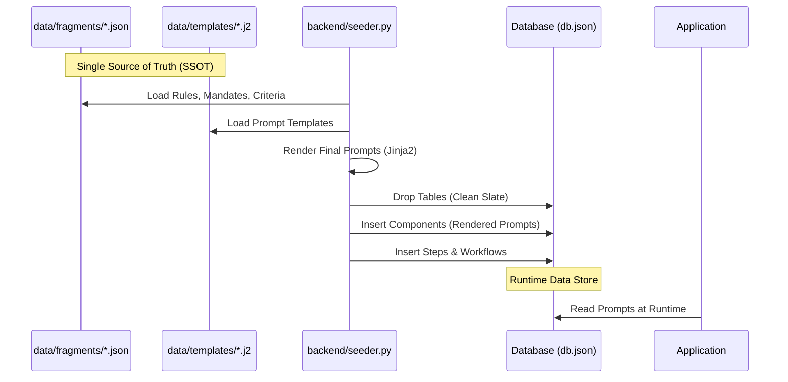

# Prompt Engineering & Data Seeding

This document explains how Cognitive Quorum v2 constructs prompts dynamically and manages its configuration data.

## 1. Dynamic Prompt Construction

The system does not use static, pre-written prompts. Instead, it assembles prompts at runtime from modular components stored in the database. This approach ensures flexibility, context-awareness, and strict schema enforcement.

### The Construction Pipeline

The `Executor` class (defined in `src/engine/executor.py`) is responsible for building the final prompt sent to the LLM.

### Components of a Prompt

1.  **Master Instructions (`MASTER_INSTRUCTIONS`):**
    *   **Source:** `components` table in the database (seeded from `data/templates/master_instructions.j2`).
    *   **Purpose:** Defines the global persona (Cognitive Quorum), core principles (e.g., Truth, Role Adherence), and universal rules.
    *   **Example:** "You are COGNITIVE QUORUM... Do not hallucinate."

2.  **Step-Specific Prompt (e.g., `PROMPT_GUARD`):**
    *   **Source:** `components` table in the database (seeded from `data/templates/prompt_*.j2`).
    *   **Purpose:** Provides the specific instructions for the current agent's task.
    *   **Example:** "PHASE 1: GUARD AGENT... Sanitize input..."

3.  **Context Data (`CONTEXT DATA`):**
    *   **Source:** Runtime execution context.
    *   **Purpose:** Provides the actual data for the agent to process, such as uploaded files or outputs from previous agents.
    *   **Format:** Injected as a JSON string under the header `CONTEXT DATA`.

4.  **Output Schema Enforcement:**
    *   **Source:** `backend/schemas.py` (via `SchemaRegistry`).
    *   **Purpose:** Instructs the LLM to produce a valid JSON output that conforms to a specific Pydantic model.
    *   **Mechanism:** The system generates a JSON Schema from the corresponding Pydantic model and appends it to the prompt with a strict instruction: *"SYSTEM: You must output a valid JSON object that strictly matches the following schema..."*

## 2. Data Seeding (Configuration Management)

The system's "intelligence"—including prompts, rules, and workflow definitions—is defined as **data**, not code. This data is managed in JSON fragments and Jinja2 templates, which are then seeded into the database.

### The Seeding Process

### Key Files

*   **`data/fragments/`**: Contains reusable JSON snippets, such as rules and mandates, that can be injected into prompt templates.
*   **`data/templates/`**: Contains the Jinja2 templates used to build the final prompt components.
*   **`backend/seeder.py`**: This script combines fragments and templates, renders the final prompt components, and loads them into the TinyDB database. Its responsibilities include:
    *   Cleaning up the database.
    *   Validating model configurations.
    *   Inserting all configuration data.

### How to Modify Prompts

1.  **Edit** the relevant Jinja2 template in `data/templates/` or JSON fragment in `data/fragments/`.
2.  **Run** the seeder script to update the database: `python backend/seeder.py`.
3.  **Restart** the application to ensure it loads the new configuration from the database.