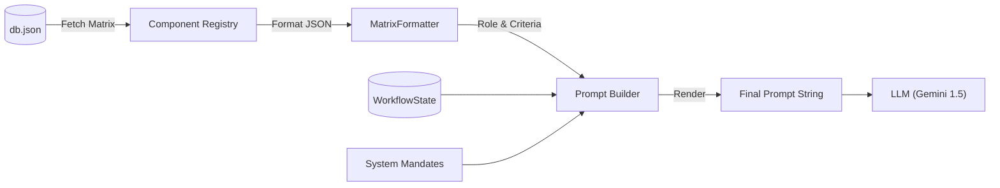

# Dynamic Prompt Engineering (V2.6)

In Cognitive Quorum v2.6, prompts are dynamically assembled artifacts. The system uses a **Polymorphic Injection** strategy to combine rigid System Mandates with configuration-driven Evaluation Matrices (BARS).

---

## 1. Composition Architecture

The `PromptBuilder` service (`backend/services/prompt_builder.py`) and `MatrixFormatter` (`backend/services/matrix_formatter.py`) collaborate to assemble the final prompt.

### The 4-Layer "Hamburger" Model

1.  **Directives Layer (The Bun)**:
    *   **Mandates**: Irrevocable constraints (e.g., "Mandaatti 1: Hidas ajattelu").
    *   **Rules**: Operational boundaries (e.g., "Sääntö 2: Pysy roolissasi").
    *   *Source*: injected from `db.json` via `llm_prompts` config.
2.  **Context Layer (The Lettuce)**:
    *   **WorkflowState**: Dynamic data from previous steps (e.g., `{{ step_analyst.hypotheses }}`).
    *   **Evidence**: Quotes and findings discovered from upstream agents.
3.  **Cognitive Layer (The Meat)**:
    *   **Evaluation Matrix (BARS)**: The specific "Lens" for the Judge.
    *   *Dynamic Injection*: The `JudgeAgent` looks up `matrix_id` (e.g., `matrix_cognitive_v2`) in `db.json`, formats it into a human-readable rubric, and injects it into the system prompt.
4.  **Output Layer (The Plate)**:
    *   **Strict JSON Schema**: The Pydantic model (`EvaluationResult`) required for the response.

### Data Flow

```mermaid
graph LR
    DB[("db.json")] -->|Fetch Matrix| Registry["Component Registry"]
    Registry -->|Format JSON| Formatter["MatrixFormatter"]
    
    Formatter -- "Role & Criteria" --> Builder["Prompt Builder"]
    State[("WorkflowState")] --> Builder
    Mandates["System Mandates"] --> Builder
    
    Builder -- Render --> Final["Final Prompt String"]
    Final --> LLM["LLM (Gemini 1.5)"]
```

---

## 2. Behaviorally Anchored Rating Scales (BARS)

V2.6 moves away from generic "Rate 1-5" instructions. We use **BARS** matrices defined in `db.json`.

**Why BARS?**
*   **Objectivity**: Instead of "Good/Bad", anchors describe specific behaviors (e.g., "User accepted first output without question").
*   **No-Code Updates**: You can change the evaluation criteria by editing `db.json` without touching Python code.

**Structure:**
```json
"criteria": [
  {
    "id": "agency",
    "label": "Strateginen Ohjaus",
    "anchors": {
      "1": "Matkustaja: Ulkoistaa ajattelun.",
      "4": "Arkkitehti: Purkaa ongelman osiin."
    }
  }
]
```

---

## 3. Strict JSON Enforcement

We use **Type-Driven Prompting**.

1.  **Schema Definition**: Every agent output is defined as a Pydantic V2 model.
2.  **Schema Injection**: The `PromptBuilder` automatically generates the JSON Schema of the target model using `model.model_json_schema()`.
3.  **Instruction**: "You MUST output valid JSON adhering to this schema..."

This ensures >99% reliability. Failures trigger a **Heuristic Repair** loop.

---

## 4. Reasoning Tokens (Chain-of-Thought)

V2.6 supports **Reasoning Token Extraction** (e.g., Gemini 1.5 Thinking models / CoT).

*   **The Problem**: Standard LLM outputs lose the "hidden thought process".
*   **The Solution**: Agents generate a `reasoning_trace` (CoT) alongside their structured JSON.
*   **State Persistence**: This trace is stored in `WorkflowState` and can be passed to the *next* agent as context.

---

## 5. Development Workflow

To add a new prompt or matrix:
1.  **Define Matrix**: Add a new `evaluation_matrix` entry to `db.json` under `components`.
2.  **Configure Workflow**: Update the `step_judge` config in `db.json` to point to the new `matrix_id`.
3.  **No Code Change Required**: The `JudgeAgent` will automatically load and use the new criteria.

---

## 6. Authoritative Language Enforcement

To ensure strict compliance with language requirements (e.g., Finnish content vs. English schemas), V2.6 employs **Authoritative Instruction Injection**.

*   **The Conflict**: Pydantic schemas are best defined in English for technical precision, but the output content must be Finnish.
*   **The Solution**: An explicit, high-priority instruction (`INSTRUCTION_LANGUAGE_FI`) is injected *after* standard rules but *before* the task definition.
*   **Mechanism**:
    > "KIELI: Kirjoita vastauksesi... AINA suomeksi. Tämä on EHDOTON vaatimus."
    This overrides the implicit language bias of the English schema descriptions ("System 2" Override).