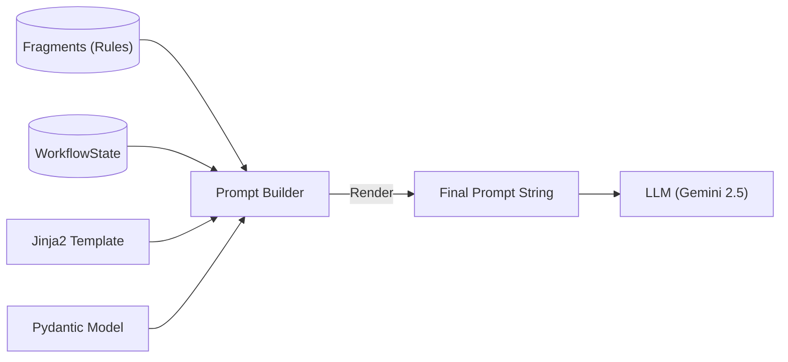

# Dynamic Prompt Engineering (V2.5)

In Cognitive Quorum v2.5, prompts are not static text strings. They are dynamic, context-aware artifacts constructed at runtime using **Jinja2 templates**, **Content Fragments**, and strict **Pydantic V2 Schemas**.

---

## 1. Composition Architecture

The `PromptBuilder` service (`backend/services/prompt_builder.py`) assembles the final prompt from four layers:

1.  **System Mandates (Fragments)**: Global rules (e.g., "Always speak English internally", "Be objective").
2.  **Context Injection (State)**: Data from previous steps (e.g., `{{ step_analyst.hypotheses }}`).
3.  **Task Instruction (Template)**: The specific goal of the current agent (e.g., "Analyze the logic").
4.  **Output Enforcement (Schema)**: The exact JSON structure required.

### Data Flow

```mermaid
graph LR
    Fragments[("Fragments (Rules)")] --> Builder["Prompt Builder"]
    State[("WorkflowState")] --> Builder
    Template["Jinja2 Template"] --> Builder
    Schema["Pydantic Model"] --> Builder
    
    Builder -- Render --> Final["Final Prompt String"]
    Final --> LLM["LLM (Gemini 2.5)"]
```

---

## 2. Strict JSON Enforcement

We do not rely on "vibes" for output formatting. We use **Type-Driven Prompting**.

1.  **Schema Definition**: Every agent output is defined as a Pydantic V2 model in `backend/models/domain.py`.
2.  **Schema Injection**: The `PromptBuilder` automatically generates the JSON Schema of the target model using `model.model_json_schema()`.
3.  **Instruction**: The prompt includes a standardized block:
    > "You MUST output valid JSON adhering to this schema: {json_schema}. You MUST include a 'thought' field to show your reasoning."

This ensures 99.9% structural reliability. If validation fails, the `WorkflowEngine` triggers a **Heuristic Repair** attempt or a retry loop.

---

## 3. Reasoning Tokens (Chain-of-Thought)

V2.5 introduces support for **Reasoning Token Extraction** (e.g., Gemini 2.5 Thinking models).

*   **The Problem**: Standard LLM outputs lose the "hidden thought process" between turns.
*   **The Solution**: Agents generate a `reasoning_trace` (CoT) alongside their structured JSON.
*   **State Persistence**: This trace is stored in `WorkflowState.reasoning_context` and passed to the *next* agent as a "Warm Start" context, preserving the train of thought across the pipeline.

---

## 4. Template Strategy

Templates are stored in `db.json` (or `backend/templates/` as fallback). They utilize standard Jinja2 syntax.

**Example Template:**
```jinja2
You are the {{ agent_name }}.

CONTEXT:
{{ previous_steps_summary }}

TASK:
Analyze the following text for logical fallacies.

INPUT:
{{ product_text }}

OUTPUT SCHEMA:
{{ output_schema_json }}
```

## 5. Development Workflow

To add a new prompt:
1.  **Define Model**: Create `class MyResult(BaseJSON): ...` in `backend/models/`.
2.  **Create Template**: Add a new entry to `seed_data.json` with the Jinja2 text.
3.  **Register Schema**: Link the template ID to the Pydantic model in `backend/core/factory.py` (or dynamic config).