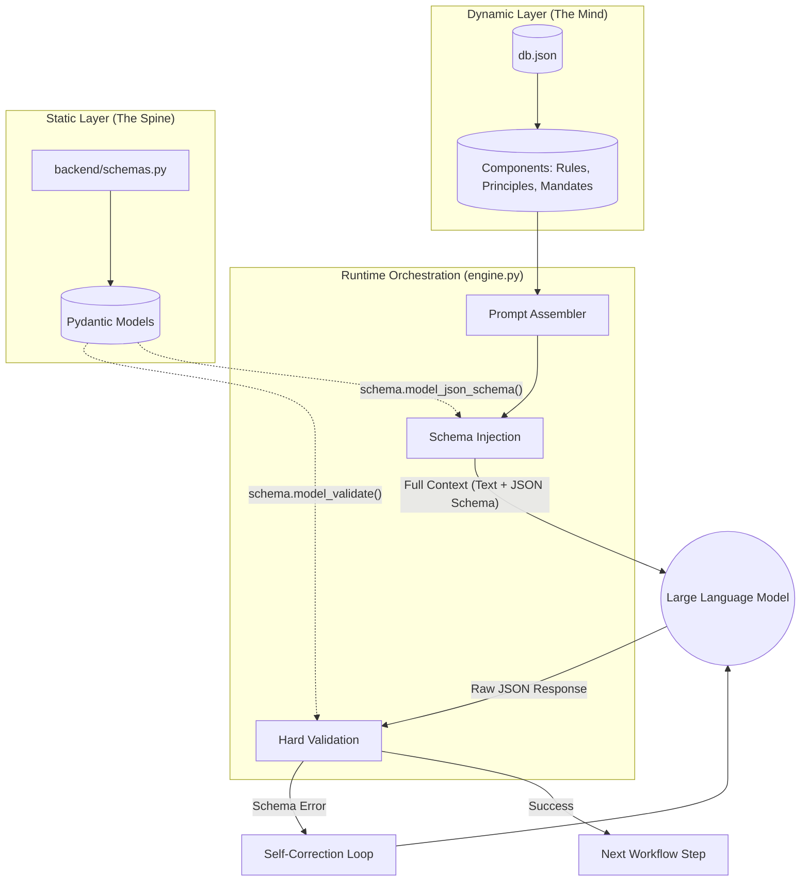

# Cognitive Quorum: A Data-Driven Architecture for Robust Multi-Agent Reasoning

## Abstract

This document outlines the **Cognitive Quorum**, a structured cognitive architecture designed to resolve the fundamental tension between the stochastic, generative nature of Large Language Models (LLMs) and the deterministic, reliable requirements of production-grade software systems. The architecture achieves this by separating cognitive logic from procedural execution, defining the system's reasoning workflow declaratively within a database. This data-driven approach allows for dynamic, auditable, and robust multi-agent systems that can perform complex analytical tasks with a high degree of scientific and logical rigor.

## Architectural Principles: The Mind and The Spine

The architecture is founded on a dualistic principle that separates the system's components into two complementary layers: a dynamic cognitive layer ("The Mind") and a static structural layer ("The Spine"). An orchestration engine fuses these layers at runtime.

### The Dynamic Layer ("The Mind")

*   **Source:** `db.json` (Database)
*   **Role:** This layer serves as the system's declarative "mind," holding the complete cognitive logic of the agentic system. It is composed of discrete, composable **Components** such as `methods`, `rules`, `principles`, `mandates`, and `protocols`. These components define the high-level reasoning strategies and constraints that guide agent behavior.
*   **Behavior:** The Mind is entirely dynamic. Cognitive strategies can be iterated upon, fine-tuned, and reconfigured by modifying the database, without requiring code redeployment. This maximizes the system's adaptability and allows for rapid experimentation with different reasoning frameworks.

### The Static Layer ("The Spine")

*   **Source:** `backend/schemas.py` (Pydantic Models), `backend/agents/*.py` (Agent Classes)
*   **Role:** This layer provides the rigid, procedural "spine" of the system. It consists of strictly-typed data contracts (Pydantic schemas) that define the interfaces between agents, and the agent classes themselves which provide the basic execution capabilities.
*   **Behavior:** The Spine is static and strictly typed. Changes to data structures or core agent capabilities require a code deployment. This ensures the structural integrity, reliability, and type-safety of the data flowing through the cognitive workflow.

## The Cognitive Quorum Workflow

The system's primary workflow, `sequential_audit_chain`, is defined in the database and orchestrates a nine-step process of adversarial reasoning and synthesis. Each step is executed by a specialized agent whose behavior is configured by a specific set of cognitive components loaded from the database. This process is designed to emulate a scientific peer-review or a legal adjudication, where a claim is constructed, rigorously challenged from multiple perspectives, and finally judged based on the surviving evidence.

---

### Step 1: Vartija (Guard Agent)

*   **Purpose:** To serve as the system's security gateway, sanitizing all incoming data and establishing a "Chain of Trust." This initial step is critical for mitigating prompt injection attacks and ensuring the integrity of all subsequent processing.
*   **Methodology:** The agent performs an internal adversarial simulation (`method_1`) to anticipate threats. It then executes a three-phase validation (`protocol_2`) for structural and semantic integrity. Finally, it applies `Negative Logging` (`protocol_1`) to explicitly document unmitigated risks and wraps the sanitized data in a trusted object, initiating the `Chain of Trust` (`rule_1`).
*   **Cognitive Components Loaded:** `rule_1` (Chain of Trust), `protocol_1` (Negative Logging), `protocol_2` (Three-Phase Validation).

### Step 2: Analyytikko (Analyst Agent)

*   **Purpose:** To ground the analysis in verifiable evidence. This agent deconstructs the sanitized input and creates a structured "evidence map," anchoring every subsequent claim to a specific piece of data.
*   **Methodology:** The agent is mandated to mitigate cognitive biases (`mandate_2`), such as confirmation bias, and maintain methodological humility (`mandate_3`), recognizing the limits of its analytical framework. It is explicitly forbidden from being swayed by superficial presentation (`rule_3`, Aesthetic Bias Ban).
*   **Cognitive Components Loaded:** `rule_1` (Chain of Trust), `rule_3` (Aesthetic Bias Ban), `mandate_2` (Active Bias Mitigation), `mandate_3` (Methodological Humility).

### Step 3: Loogikko (Logician Agent)

*   **Purpose:** To construct a coherent, logically sound argument or hypothesis based on the evidence map provided by the Analyst.
*   **Methodology:** Following the same core mandates as the Analyst (`mandate_2`, `mandate_3`), the Logician synthesizes the evidence into a primary argument, often using formal argumentation frameworks (e.g., Toulmin model). This creates a clear, falsifiable proposition for the critic agents to challenge.
*   **Cognitive Components Loaded:** `rule_1` (Chain of Trust), `rule_3` (Aesthetic Bias Ban), `mandate_2` (Active Bias Mitigation), `mandate_3` (Methodological Humility).

### Step 4: Looginen Falsifioija (Logical Falsifier Agent)

*   **Purpose:** To act as a dedicated "devil's advocate," applying rigorous logical scrutiny to the argument constructed by the Logician. Its sole function is to find flaws in the argument's structure.
*   **Methodology:** This agent operates under the core `Falsification Principle` (`principle_1`), as defined by Karl Popper. It is explicitly instructed by the `Mandate to Maintain Disagreement` (`mandate_1`) to resist consensus and highlight logical fallacies, internal contradictions, or unsupported leaps in reasoning.
*   **Cognitive Components Loaded:** `principle_1` (Falsification Principle), `mandate_1` (Mandate to Maintain Disagreement), `rule_1` (Chain of Trust).

### Step 5: Faktuaalinen ja Eettinen Valvoja (Factual & Ethical Overseer Agent)

*   **Purpose:** To verify the factual accuracy and ethical alignment of the evidence, independent of its logical coherence. An argument can be logically valid but based on false or ethically problematic premises.
*   **Methodology:** The agent executes the `RFI-Protocol` (`protocol_3`) to perform information retrieval and cross-verification. Crucially, this step is bound by the `Heterogeneity Requirement` (`requirement_1`), which mandates that this critical validation should be performed by a different LLM family to mitigate model-specific biases or knowledge gaps.
*   **Cognitive Components Loaded:** `protocol_3` (RFI-Protocol), `requirement_1` (Heterogeneity Requirement), `rule_1` (Chain of Trust).

### Step 6: Kausaalinen Analyytikko (Causal Analyst Agent)

*   **Purpose:** To audit the plausibility of causal claims, distinguishing correlation from causation.
*   **Methodology:** The agent employs a suite of causal reasoning heuristics derived from the works of Hume and Pearl. These include `Temporal Auditing` (`heuristic_1`) to ensure causes precede effects, `Counterfactual Stress-Testing` (`heuristic_2`) to question necessity, and an `Abductive Challenge` (`heuristic_3`) to seek simpler explanations.
*   **Cognitive Components Loaded:** `heuristic_1` (Temporal Auditing), `heuristic_2` (Counterfactual Stress-Test), `heuristic_3` (Abductive Challenge), `rule_1` (Chain of Trust).

### Step 7: Performatiivisuuden Tunnistaja (Performativity Detector Agent)

*   **Purpose:** To analyze the input for signs of strategic manipulation, disingenuousness, or "gaming the system."
*   **Methodology:** Guided by the `Performativity Detection Mandate` (`mandate_4`), this agent looks for behaviors that align with Goodhart's Law. It uses the `Suspicious Perfection Rule` (`rule_4`) to flag analyses that appear too clean or linear, as genuine processes often involve iteration and error.
*   **Cognitive Components Loaded:** `mandate_4` (Performativity Detection), `rule_4` (Suspicious Perfection), `rule_1` (Chain of Trust).

### Step 8: Tuomari (Judge Agent)

*   **Purpose:** To synthesize the findings from the Logician and all critic agents (Falsifier, Overseer, etc.) and render a final, adjudicated assessment.
*   **Methodology:** The Judge resolves conflicts using a strict decision-making hierarchy. The `Primacy of Falsification Rule` (`rule_6`) dictates that any verified factual or ethical refutation from the Overseer automatically overrides interpretive or logical arguments. The Judge must also uphold the `Mandate to Maintain Disagreement` (`mandate_1`), ensuring that dissenting views are preserved in the final output rather than being forced into a false consensus.
*   **Cognitive Components Loaded:** `rule_6` (Primacy of Falsification), `mandate_1` (Mandate to Maintain Disagreement), `rule_1` (Chain of Trust).

### Step 9: XAI-Raportoija (XAI Reporter Agent)

*   **Purpose:** To produce a final, transparent eXplainable AI (XAI) report that makes the entire reasoning process, including all disagreements and identified uncertainties, legible to a human overseer.
*   **Methodology:** The agent employs `Question-Driven Reporting` (`method_3`) to actively engage the human user and combat automation bias. It is compelled by the `Mandatory Fragility Reporting Rule` (`rule_5`) to disclose the system's own limitations (e.g., vulnerability to prompt injection). Finally, it uses the `Responsibility Hand-off Protocol` (`protocol_4`) to explicitly delegate critical decisions and final sign-off to a human-in-the-loop (HITL).
*   **Cognitive Components Loaded:** `method_3` (Question-Driven Reporting), `rule_5` (Mandatory Fragility Reporting), `protocol_4` (Responsibility Hand-off, HITL), `rule_1` (Chain of Trust).

## Monolithic Validation and Self-Correction

The critical innovation that enables this architecture is the **Monolithic Validation** mechanism enforced by the orchestration engine. The system does not trust the LLM to adhere to output formats based on prompt instructions alone. Instead, the Pydantic schema (from The Spine) is treated as the single source of truth for data structures.

### Execution Flow

1.  **Schema Injection:** Before executing an agent, the engine retrieves the required output schema name (e.g., `TaintedData`) from the current step's definition in the database.
2.  **Dynamic Import:** The engine dynamically imports the corresponding Pydantic class from the static code layer (`backend.schemas`).
3.  **Contextualization:** The JSON schema definition of the Pydantic model is injected into the prompt sent to the LLM, providing explicit structural instructions.
4.  **Hard Validation:** Upon receiving the LLM's response, the engine immediately attempts to validate the raw JSON against the Pydantic model (`schema.model_validate(parsed_json)`).
5.  **Self-Correction Loop:** If validation fails (e.g., due to a hallucinated field or incorrect data type), an error is raised. The system automatically retries the request, including the validation error in the context, effectively forcing the LLM to correct its own output until it conforms to the rigid structural requirements of The Spine.

This self-correcting loop ensures that the data passed between agents is always well-formed and reliable, making the `Chain of Trust` (`rule_1`) technologically enforceable.

## Conclusion

The Cognitive Quorum architecture provides a robust, transparent, and adaptable framework for building sophisticated multi-agent systems. By defining cognitive workflows declaratively in a database and enforcing structural integrity through code, it leverages the generative power of LLMs while mitigating their inherent unpredictability. This approach creates auditable and scientifically-grounded reasoning processes suitable for critical applications requiring high degrees of reliability and explainability.