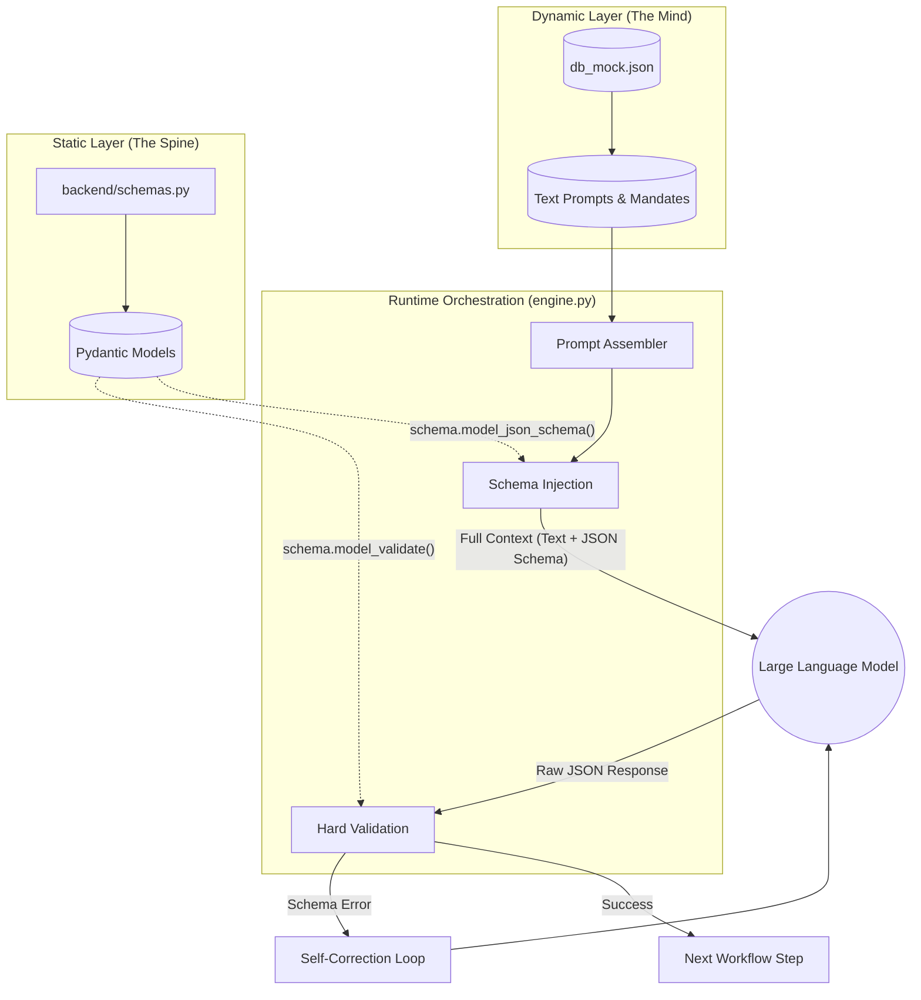

# Structured Cognitive Architecture

This project implements a design pattern we call **Structured Cognitive Architecture**. This pattern resolves the fundamental tension between the stochastic nature of Large Language Models (LLMs) and the deterministic requirements of production software.

Instead of choosing between flexibility or structure, our architecture separates them into two distinct layers that are fused together at runtime by the Orchestration Engine.

## The Core Concept: "The Mind vs. The Spine"

Our architecture divides the agentic system into two opposing but complementary forces:

### The Dynamic Layer ("The Mind")

*   **Source:** `data/db.json` (TinyDB)
    *   *Note: Originally `db_mock.json`, now migrated to production `db.json`.*
*   **Role:** Holds the cognitive logic, reasoning strategies (Chain-of-Thought), mandates, and rules.
    *   **Example:** `PROMPT_GUARD` (ID: 23) in `db.json` defines the high-level task for the Guard Agent.
    *   **Example:** `MANDATE_1_1` (ID: 2) enforces "System 2" thinking.
*   **Behavior:** Completely dynamic. Prompts can be iterated on, tuned, and hot-swapped without redeploying code. This maximizes the intelligence and adaptability of the agents.

### The Static Layer ("The Spine")

*   **Source:** `backend/schemas.py` (Pydantic Models)
*   **Role:** Defines the rigid data contracts (Interfaces) between agents.
    *   **Example:** `TaintedData` class defines the strict output format for Step 1.
    *   **Example:** `TuomioJaPisteet` class defines the scoring structure for Step 8.
*   **Behavior:** Strictly typed. Changes here require a code deployment. This ensures the reliability and structural integrity of the system.

## Monolithic Validation Mechanism

The critical innovation in this project is how `backend/engine.py` bridges these two layers using **Monolithic Validation**.

We do not trust the LLM to "remember" data structures from the prompt alone. Instead, we treat the Pydantic Schema as the **Single Source of Truth** and inject it into both the Input and Output phases of the agent execution cycle.

### The Execution Flow

1.  **Schema Injection (Input):** 
    *   In `backend/engine.py` (approx. line 234), the `WorkflowEngine` resolves the `output_schema` name (e.g., "TaintedData") from the step definition.
    *   It dynamically imports the corresponding Pydantic class from `backend.schemas`.
    *   This schema class is passed to the agent's `execute` method.
    *   *Code Reference:* `backend/engine.py`: `validation_schema_class = getattr(schemas, output_schema_name)`

2.  **Code-Side Verification (Output):** 
    *   When the `BaseAgent` receives a response, it calls `get_json_response` (`backend/agents/base.py`).
    *   This method not only parses the JSON but enforces **Hard Validation** using `validation_schema.model_validate(parsed_json)`.
    *   If the LLM hallucinates a field (e.g., `risk_level` instead of `riski_taso`), the Pydantic validation fails, raising an error.
    *   The system then automatically retries (up to `max_retries`), effectively forcing the LLM to self-correct until it satisfies the schema.
    *   *Code Reference:* `backend/agents/base.py`: `validation_schema.model_validate(parsed_json)`

## Architecture Diagram

The following diagram illustrates how the Dynamic Prompt (DB) and Static Schema (Code) converge in the Engine to create a self-correcting loop.

## Why We Use This Approach

*   **Robustness against Hallucinations:** By treating prompts as fluid but schemas as code, we prevent "drift" where an agent slowly starts changing its output format over long conversations.
*   **Input Tainting Security:** The `GuardAgent` (Step 1) establishes a "Chain of Trust." Because the data structure is enforced by code, downstream agents (like `AnalystAgent`) can safely consume `TaintedData` objects knowing the types are guaranteed.
*   **Developer Experience:** While prompts are managed in the DB, developers still get full IDE support (IntelliSense/Type Hinting) when writing agent logic because the data structures are defined in standard Python code.
