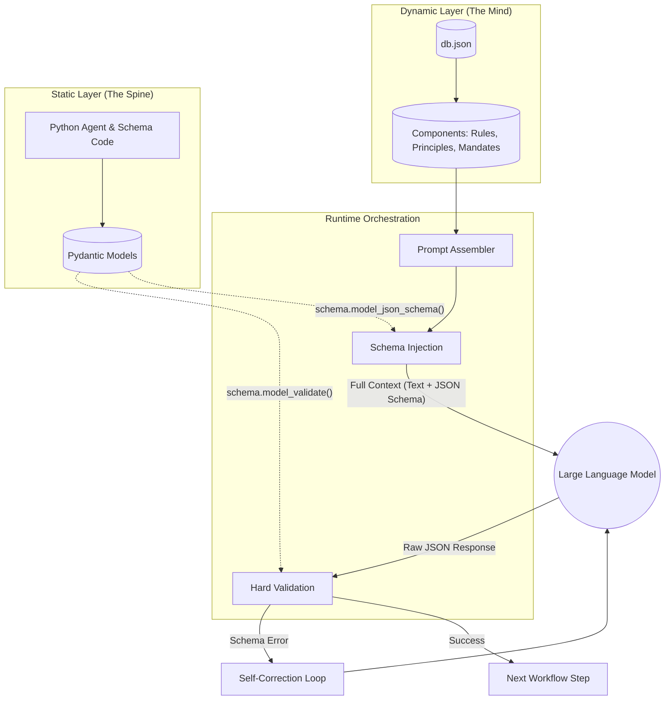

# Cognitive Quorum: A Data-Driven Architecture for Robust Multi-Agent Reasoning

## Abstract

This document outlines the **Cognitive Quorum**, a structured cognitive architecture designed to resolve the fundamental tension between the stochastic, generative nature of Large Language Models (LLMs) and the deterministic, reliable requirements of production-grade software systems. The architecture achieves this by separating cognitive logic from procedural execution, defining the system's reasoning workflow declaratively within a database. This data-driven approach allows for dynamic, auditable, and robust multi-agent systems that can perform complex analytical tasks with a high degree of scientific and logical rigor.

## Architectural Principles: The Mind and The Spine

The architecture is founded on a dualistic principle that separates the system's components into two complementary layers: a dynamic cognitive layer ("The Mind") and a static structural layer ("The Spine"). An orchestration engine fuses these layers at runtime.

### The Dynamic Layer ("The Mind")

*   **Source:** The provided database configuration (`db.json`).
*   **Role:** This layer serves as the system's declarative "mind," holding the complete cognitive logic of the agentic system. It is composed of discrete, composable **Components** such as `methods`, `rules`, `principles`, `mandates`, and `protocols`, which are assembled into multi-step **Workflows** (e.g., `sequential_audit_chain`). These components define the high-level reasoning strategies and constraints that guide agent behavior.
*   **Behavior:** The Mind is entirely dynamic. Cognitive strategies can be iterated upon, fine-tuned, and reconfigured by modifying the database, without requiring code redeployment. This maximizes the system's adaptability and allows for rapid experimentation with different reasoning frameworks.

### The Static Layer ("The Spine")

*   **Source:** Python code, specifically agent classes (e.g., `GuardAgent`) and Pydantic data models.
*   **Role:** This layer provides the rigid, procedural "spine" of the system. It consists of strictly-typed data contracts (Pydantic schemas, e.g., `TaintedData`, `TodistusKartta`) that define the interfaces between agents, and the agent classes themselves which provide the basic execution capabilities.
*   **Behavior:** The Spine is static and strictly typed. Changes to data structures or core agent capabilities require a code deployment. This ensures the structural integrity, reliability, and type-safety of the data flowing through the cognitive workflow.

## The Cognitive Quorum Workflow: `sequential_audit_chain`

The system's primary workflow, `sequential_audit_chain`, is defined in the database and orchestrates a nine-step process of adversarial reasoning and synthesis. Each step is executed by a specialized agent whose behavior is configured by a specific set of cognitive components loaded from the database. This process is designed to emulate a scientific peer-review or a legal adjudication, where a claim is constructed, rigorously challenged from multiple perspectives, and finally judged based on the surviving evidence.

---

### Step 1: Vartija (Guard Agent)

*   **Purpose:** To serve as the system's security gateway and pre-processor. It sanitizes all incoming data, establishes a "Chain of Trust," and mitigates input-based threats like prompt injection. This initial step is critical for the integrity of all subsequent processing.
*   **Methodology:** The agent is configured to perform an internal adversarial simulation (`METHOD_1: Adversarial Simulation`) to anticipate attack vectors. It executes a three-phase validation (`PROTOCOL_2: Three-Phase Validation`) for structural and semantic integrity and applies `Negative Logging` (`PROTOCOL_1`) to explicitly document unmitigated risks. All subsequent steps rely on the `RULE_1: Chain of Trust` established here.
*   **Cognitive Components Loaded:** `TASK_GUARD`, `METHOD_1`, `PROTOCOL_1`, `PROTOCOL_2`, `RULE_1`, `RULE_2`, `RULE_3`, `MANDATE_1-4`.

### Step 2: Analyytikko (Analyst Agent)

*   **Purpose:** To ground the analysis in verifiable evidence and mitigate hallucination. This agent deconstructs the sanitized input from the Guard and creates a structured `TodistusKartta` (Evidence Map), anchoring every subsequent claim to specific source data.
*   **Methodology:** The Analyst initiates the core analytical process by performing a `METHOD_2: Cross-Validating Chain-of-Thought`, ensuring its own reasoning is sound. It is guided by high-level mandates to actively fight cognitive biases (`MANDATE_2`) and maintain methodological humility (`MANDATE_3`). An instruction for `RAG Optimization` (`INSTRUCTION_RAG_OPT`) guides it to mitigate the "lost in the middle" problem common in context-heavy tasks.
*   **Cognitive Components Loaded:** `TASK_ANALYST`, `METHOD_2`, `INSTRUCTION_RAG_OPT`, `RULE_1-3`, `MANDATE_1-4`.

### Step 3: Loogikko (Logician Agent)

*   **Purpose:** To construct a coherent, logically sound argument based on the Evidence Map. This step translates raw data and claims into a formal analytical structure that can be systematically challenged.
*   **Methodology:** The Logician applies formal frameworks to structure its analysis. It is explicitly instructed to use `INSTRUCTION_TOULMIN` to model the argument's structure (Claim, Data, Warrant) and `INSTRUCTION_BLOOM` to assess the cognitive level of the input. This creates a clear, falsifiable proposition for the subsequent critic agents to audit.
*   **Cognitive Components Loaded:** `TASK_LOGICIAN`, `METHOD_2`, `INSTRUCTION_TOULMIN`, `INSTRUCTION_BLOOM`, `RULE_1-3`, `MANDATE_1-4`.

### Step 4: Looginen Falsifioija (Logical Falsifier Agent)

*   **Purpose:** To act as a dedicated "devil's advocate," applying rigorous logical scrutiny to the argument constructed by the Logician. Its sole function is to find flaws in the argument's internal structure, independent of external facts.
*   **Methodology:** This agent embodies Karl Popper's `PRINCIPLE_1: Falsification Principle`. It is explicitly driven by the `MANDATE_1: Maintain Disagreement` to resist consensus and highlight logical fallacies, internal contradictions, or unsupported leaps in reasoning. It functions as the first layer of adversarial review.
*   **Cognitive Components Loaded:** `TASK_FALSIFIER`, `PRINCIPLE_1`, `METHOD_2`, `RULE_1-3`, `MANDATE_1-4`.

### Step 5: Kausaalinen Analyytikko (Causal Analyst Agent)

*   **Purpose:** To audit the plausibility of causal claims within the argument, distinguishing valid causal inference from mere correlation.
*   **Methodology:** The agent employs a suite of causal reasoning heuristics. These include `HEURISTIC_1: Temporal Auditing` (causes must precede effects), `HEURISTIC_2: Counterfactual Stress-Testing` (would the effect have occurred without the cause?), and `HEURISTIC_3: Abductive Challenge` (is there a simpler explanation?). This provides a sophisticated check against common reasoning errors.
*   **Cognitive Components Loaded:** `TASK_CAUSAL`, `HEURISTIC_1`, `HEURISTIC_2`, `HEURISTIC_3`, `METHOD_2`, `RULE_1-4`, `MANDATE_1-4`.

### Step 6: Performatiivisuuden Tunnistaja (Performativity Detector Agent)

*   **Purpose:** To analyze the input for signs of strategic manipulation or "gaming the system." This agent assesses the *intent* behind the data, looking for behavior designed to produce a favorable assessment rather than an authentic outcome.
*   **Methodology:** Guided by the `MANDATE_4: Performativity Detection`, this agent looks for behaviors that align with Goodhart's Law ("When a measure becomes a target, it ceases to be a good measure."). It uses the `RULE_4: Suspicious Perfection` to flag analyses that appear too clean or linear, as genuine complex reasoning often involves iteration and error correction.
*   **Cognitive Components Loaded:** `TASK_PERFORMATIVITY`, `METHOD_2`, `RULE_1-4`, `MANDATE_1-4`.

### Step 7: Faktuaalinen ja Eettinen Valvoja (Factual & Ethical Overseer Agent)

*   **Purpose:** To verify the factual accuracy and ethical alignment of the evidence, independent of its logical coherence. An argument can be logically valid but based on false or ethically problematic premises.
*   **Methodology:** The agent executes the `PROTOCOL_3: RFI-Protocol` to perform external information retrieval and cross-verification. Crucially, this step is bound by the `REQUIREMENT_1: Heterogeneity Necessity`, which mandates that this critical validation should be performed by a different LLM family to mitigate model-specific biases or knowledge gaps, introducing a key scientific control.
*   **Cognitive Components Loaded:** `TASK_OVERSEER`, `PROTOCOL_3`, `REQUIREMENT_1`, `METHOD_2`, `RULE_1-3`, `MANDATE_1-4`.

### Step 8: Tuomari (Judge Agent)

*   **Purpose:** To synthesize the initial argument from the Logician and the critiques from all adversarial agents (Falsifier, Causal Analyst, etc.) to render a final, adjudicated assessment and score.
*   **Methodology:** The Judge resolves conflicts using a strict decision-making hierarchy. Its judgment is normatively bound by the `BARS_MATRIX`, a detailed scoring rubric. The `RULE_6: Primacy of Falsification` dictates that any verified factual or ethical refutation automatically overrides interpretive arguments. It must also uphold the `MANDATE_1: Maintain Disagreement`, ensuring that dissenting views are preserved rather than being forced into a false consensus.
*   **Cognitive Components Loaded:** `TASK_JUDGE`, `BARS_MATRIX`, `RULE_6`, `PRINCIPLE_1`, `OP_RULE_1-4`, `RULE_1-3`, `MANDATE_1-4`.

### Step 9: XAI-Raportoija (XAI Reporter Agent)

*   **Purpose:** To produce a final, transparent eXplainable AI (XAI) report that makes the entire reasoning process—including all disagreements, identified uncertainties, and the final judgment—legible to a human overseer.
*   **Methodology:** The agent employs `METHOD_3: Question-Driven Reporting` to actively prompt the human user for critical review, combating automation bias. It is compelled by `RULE_5: Mandatory Fragility Reporting` to disclose the system's own limitations. Finally, it uses `PROTOCOL_4: Responsibility Hand-off` to explicitly delegate final sign-off to a Human-in-the-Loop (HITL).
*   **Cognitive Components Loaded:** `TASK_XAI`, `METHOD_3`, `RULE_5`, `PROTOCOL_4`, `RULE_1-3`, `MANDATE_1-4`.

## Monolithic Validation and Self-Correction

The critical innovation that enables this architecture is the **Monolithic Validation** mechanism enforced by the orchestration engine. The system does not trust the LLM to adhere to output formats based on prompt instructions alone. Instead, the Pydantic schema (from The Spine) is treated as the single source of truth for data structures.

### Execution Flow

1.  **Schema Injection:** Before executing an agent, the engine retrieves the required output schema name (e.g., `TaintedData`) from the current step's definition in the database.
2.  **Dynamic Import:** The engine dynamically imports the corresponding Pydantic class from the static code layer.
3.  **Contextualization:** The JSON schema definition of the Pydantic model is injected into the prompt sent to the LLM, providing explicit structural instructions.
4.  **Hard Validation:** Upon receiving the LLM's response, the engine immediately attempts to validate the raw JSON against the Pydantic model (`schema.model_validate(parsed_json)`).
5.  **Self-Correction Loop:** If validation fails (e.g., due to a hallucinated field or incorrect data type), an error is raised. The system automatically retries the request, including the validation error in the context, effectively forcing the LLM to correct its own output until it conforms to the rigid structural requirements of The Spine.

This self-correcting loop ensures that the data passed between agents is always well-formed and reliable, making the `RULE_1: Chain of Trust` technologically enforceable.

## Conclusion

The Cognitive Quorum architecture provides a robust, transparent, and adaptable framework for building sophisticated multi-agent systems. By defining cognitive workflows declaratively in a database and enforcing structural integrity through code, it leverages the generative power of LLMs while mitigating their inherent unpredictability. This approach creates auditable and scientifically-grounded reasoning processes suitable for critical applications requiring high degrees of reliability and explainability.