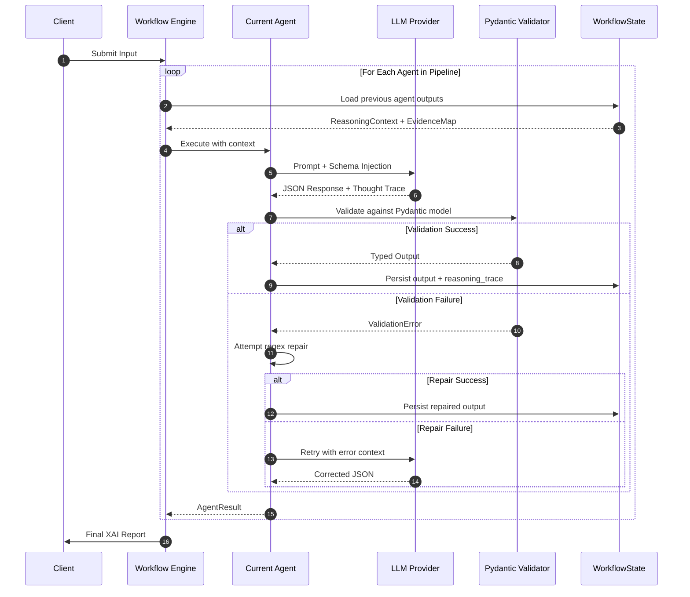

# Cognitive Quorum: A Data-Driven Architecture for Robust Multi-Agent Reasoning (V2.6)

## Abstract

This document outlines the **Cognitive Quorum**, a structured cognitive architecture designed to resolve the fundamental tension between the stochastic, generative nature of Large Language Models (LLMs) and the deterministic, reliable requirements of production software. The architecture achieves this by separating cognitive logic ("The Mind") from procedural execution ("The Spine"), upgraded in **V2.6 (Jan 2026)** to support **Configuration-Driven Evaluation Matrices (BARS)** and **Autonomous Evidence Discovery**.

## Input Ingestion & Structuring

Before entering the reasoning pipeline, raw multi-modal input (PDF, Docx, Text) undergoes **Structural Normalization** via the `ChatLogParser`. This component is critical for preserving the semantic distinction between User queries and AI responses.

### Dialogue Preservation (The "Sitra" Benchmark)
The system employs a "Fail-Open" line-based parser to identify speaker labels (`User:` / `AI:`). This ensures that complex cognitive shifts are correctly attributed.

**Canonical Example (Verified V2.5 Ingestion):**
> **User Input**: *"Miten sitra tämän näkee raporttien perusteella"*
>
> **AI Response**: *"Sitran megatrendiraporttien perusteella näkymä tulevaisuuteen on siirtynyt potentiaalista ja nousevista ilmiöistä (2017) kohti kasautuvia, geopoliittisesti latautuneita kriisejä ja systeemisiä murtumia (2023)."*

By strictly separating these entities, the **Interaction Analyst (2.2)** can accurately assess the user's intent versus the AI's provided evidence, preventing "Source Confusion" hallucinations.

## Pipeline Overview

The Cognitive Quorum implements a **sequential or fused multi-agent reasoning pipeline** where information flows through specialized agents, each performing a distinct cognitive function. The pipeline enforces strict data contracts between stages, ensuring deterministic behavior despite the stochastic nature of LLMs.

### Agent Flow Diagram (Sequential Model)


```mermaid
flowchart TD
    subgraph Input
        A[Raw User Input]
    end
    
    subgraph Security["Security Layer"]
        B["1. Vartija<br/>(Guard)"]
    end
    
    subgraph Analysis["Analysis Layer"]
        C["2. Analyytikko<br/>(Analyst)"]
        D["2.2 Vuorovaikutusanalysaattori<br/>(Interaction Analyst)"]
        E["2.5 Profiloija<br/>(Profiler)"]
    end
    
    subgraph Reasoning["Reasoning Layer"]
        F["3. Loogikko<br/>(Logician)"]
        G["4. Falsifioija<br/>(Falsifier)"]
        H["5. Valvoja<br/>(Overseer)"]
        I["6. Kausaalinen Analyytikko<br/>(Causal Analyst)"]
    end
    
    subgraph Validation["Validation Layer"]
        J["7. Performatiivisuuden Tunnistaja<br/>(Detector)"]
        K["8. Arkistonhoitaja<br/>(Archivist)"]
        L["8c. Valmentaja<br/>(Coach)"]
    end
    
    subgraph Synthesis["Synthesis Layer"]
        M["9. Tuomari<br/>(Judge Rules Engine)"]
        N["10. XAI-Raportoija<br/>(XAI Reporter)"]
    end
    
    subgraph Output
        O[Final Report]
    end
    
    A --> B
    B --> C
    C --> D
    D --> E
    E --> F
    F --> G
    G --> H
    H --> I
    I --> J
    J --> K
    K --> L
    L --> M
    M --> N
    N --> O
    
    style Security fill:#ff6b6b,color:#fff
    style Analysis fill:#4ecdc4,color:#fff
    style Reasoning fill:#45b7d1,color:#fff
    style Validation fill:#96ceb4,color:#fff
    style Synthesis fill:#dda0dd,color:#fff
```

### Sequence Diagram: Data Flow & Validation


```mermaid
sequenceDiagram
    autonumber
    participant Client
    participant Engine as Workflow Engine
    participant Agent as Current Agent
    participant LLM as LLM Provider
    participant Validator as Pydantic Validator
    participant State as WorkflowState
    
    Client->>Engine: Submit Input
    
    loop For Each Agent in Pipeline
        Engine->>State: Load previous agent outputs
        State-->>Engine: ReasoningContext + EvidenceMap
        
        Engine->>Agent: Execute with context
        Agent->>LLM: Prompt + Schema Injection
        LLM-->>Agent: JSON Response + Thought Trace
        
        Agent->>Validator: Validate against Pydantic model
        
        alt Validation Success
            Validator-->>Agent: Typed Output
            Agent->>State: Persist output + reasoning_trace
        else Validation Failure
            Validator-->>Agent: ValidationError
            Agent->>Agent: Attempt regex repair
            alt Repair Success
                Agent->>State: Persist repaired output
            else Repair Failure
                Agent->>LLM: Retry with error context
                LLM-->>Agent: Corrected JSON
            end
        end
        
        Agent-->>Engine: AgentResult
    end
    
    Engine->>Client: Final XAI Report
```

## Architectural Principles

### The Mind (Dynamic Layer)
*   **Source:** `seed_data.json` / Firestore / `db.json`.
*   **Components:** Prompts, Mandates (`MANDATE_1`), Methods (`METHOD_1`), **Evaluation Matrices**.
*   **Role:** Defines the *strategy* of reasoning. Configurable without code changes.
    *   **V2.6 Update**: The core evaluation logic (The Judge's Matrix) is now fully decoupled from code. The definition of "What is good reasoning?" is stored in JSON components (`matrix_standard_v1`, `matrix_cognitive_v1`).

### The Spine (Static Layer)
*   **Source:** Python Code (`backend/agents/`, `backend/models/`).
*   **Components:** Agent Classes, Pydantic V2 Models (`typing.Annotated`), Arq Workers.
*   **Role:** Defines the *structure* of data and execution. Enforces type safety, manages async concurrency, and provides observability via **Logfire**.
    *   **Contract-First Data Integrity:** All internal data exchange is strictly validated against Pydantic models.
    *   **Configuration-Driven Discovery (New in V2.6):** Agents like `JudgeAgent` no longer have hardcoded dependencies on upstream agents. Instead, they read a `monitored_steps` map from their `execution_config` to discover evidence dynamically.

## Dynamic Evaluation System (BARS - V2.6)

A central innovation in V2.6 is the **Behaviorally Anchored Rating Scale (BARS)** interface, which allows the "Judge" to switch between completely different audit frameworks on the fly.

### 1. Dynamic Matrix Injection
Unlike traditional agents with fixed system prompts, the `JudgeAgent` constructs its identity dynamically:
1.  **Lookup**: It reads `matrix_id` from the workflow configuration (e.g., `matrix_standard_v1`).
2.  **Retrieval**: It fetches the corresponding Component definition from `db.json`.
3.  **Compilation**: It compiles a prompt injection containing:
    *   **Role Persona**: "You are the Evaluator..."
    *   **Criteria**: A list of dimensions (e.g., Agency, Synthesis, Falsification).
    *   **Anchors**: Specific behaviors defining levels 1-4 for *each* dimension.

### 2. Autonomous Evidence Discovery
The Judge does not know *a priori* which agents ran before it. It uses a **Configuration-Driven Discovery** mechanism:
*   It iterates through the `monitored_steps` dictionary in its config (e.g., `{"step_profiler": "PROFILOIJA"}`).
*   It scans the `WorkflowState` for these keys.
*   If found, it serializes the agent's output into a "Courtroom Evidence" block (`### PROFILOIJA (BIAS AUDIT)...`).
*   This allows the same Judge code to referee a "Sequential" legacy workflow or a modern "Fused" workflow (where multiple critics are merged into `step_panel`).

### 3. Reporting Abstraction
The final `EvaluationResult` structure is polymorphic:
```python
class EvaluationResult(BaseJSON):
    matrix_id: str
    dimensions: list[DimensionResultItem] # [ {id="agency", score=3}, {id="logic", score=2} ]
    total_score: float
```
The **StatePresenter** creates the final report by flattening these dynamic dimensions into the reporting payload. This means adding a new dimension to `db.json` automatically makes it appear in the final PDF/UI report without a single line of Python code.

## The Cognitive Assembly Line (`sequential_audit_chain`)

The system processes information through a pipeline of specialized agents:

### 1. Vartija (Guard Agent)
**Role:** Security Gateway.
Mitigates prompt injection and ensures PII privacy via Regex-based hooks.

### 2. Analyytikko (Analyst Agent)
**Role:** Data Structuring.
Transforms raw input into a grounded `EvidenceMap`, mitigating hallucination via "Chain of Trust".

### 2.2. Vuorovaikutusanalysaattori (Interaction Analyst)
**Role:** Dynamic Control Assessment.
Determines if the user is a "Driver" (Active) or "Passenger" (Passive) in the process.

### 2.5. Profiloija (Profiler Agent)
**Role:** Cognitive Bias Detection.
Identifies psychological profiles and cognitive biases in the source text.

### 3. Loogikko (Logician Agent)
**Role:** Argument Mapping.
Constructs Toulmin arguments (Claim, Data, Warrant) to expose logical structure.

### 4. Falsifioija (Falsifier Agent)
**Role:** Stress Testing.
Acts as "Devil's Advocate" (Popperian Falsification) to find internal contradictions.

### 5. Valvoja (Overseer Agent)
**Role:** Fact & Ethics.
Verifies factual accuracy (Google Search) and ethical alignment.

### 6. Kausaalinen Analyytikko (Causal Agent)
**Role:** Causal Inference.
Distinguishes correlation from causation using causal refutation logic.

### 7. Performatiivisuuden Tunnistaja (Detector Agent)
**Role:** Anti-Gaming.
Detects manipulative rhetoric or "fluff" designed to bias the system.

### 8. Arkistonhoitaja (Archivist Agent)
**Role:** Context Retrieval.
Connects the current case to historical precedents via Vector RAG Search.

### 8c. Valmentaja (Coach Agent)
**Role:** Pedagogical Feedback.
Provides actionable advice to the user on improving their reasoning.

### 9. Tuomari (Judge Agent)
**Role:** Dynamic Adjudication.
Synthesizes all critiques into a final Verdict using the injected **BARS Matrix**. It calculates scores across dynamically defined dimensions (e.g., Agency, Logic, Ethics) and resolves conflicts between critic agents.

### 10. XAI-Raportoija (XAI Reporter)
**Role:** Transparency.
Generates a human-readable, explainable report. It is "matrix-agnostic," meaning it renders whatever dimensions the Judge evaluated, ensuring forward compatibility with new audit frameworks.

## Reasoning Continuity Architecture (V2.5)

To maintain high-level cognitive coherence across multiple agent turns, the system implements a **Dual-Layer Reasoning Trace** mechanism.

### The Challenge: Statelessness vs. Context
LLMs are inherently stateless. When `AnalystAgent` finishes and `JudgeAgent` begins, the specific "train of thought" that led to the analysis is typically lost, leaving only the final JSON output.

### Solution: Thinking Tokens & Explicit Traces

1.  **Reasoning Models (Gemini 1.5 Thinking)**: 
    *   **Mechanism**: The model generates a "Show Your Work" trace (`thought` signature) alongside the JSON.
    *   **Persistence**: We capture this trace and store it in `WorkflowState.reasoning_context`.
    *   **Transfer**: It is passed to the next agent, allowing it to "see" the logic that led to the conclusion.

2.  **Standard Models (Gemini Flash/Pro)**:
    *   **Mechanism**: Explicit Chain-of-Thought (CoT) text generation via `thought` field in JSON.
    *   **Persistence**: Stored in `state.last_reasoning_trace`.
    *   **Transfer**: Injected into the next prompt as text.

This approach ensures transparency and high-fidelity reasoning transfer regardless of the underlying model capability.

## Verification & Self-Correction

The system employs a **Monolithic Validation Loop**:

1.  **Schema Injection**: The engine injects the Pydantic V2 JSON Schema into the prompt.
2.  **Hard Validation**: LLM output is parsed against the strict `Annotated` model.
3.  **Heuristic Repair**: If JSON is malformed, a lightweight regex repair is attempted.
4.  **Self-Correction**: If repair fails, validation errors trigger an automatic retry, forcing the LLM to fix its own formatting mistakes.

This guarantees that the input to Step N+1 is always valid data produced by Step N.