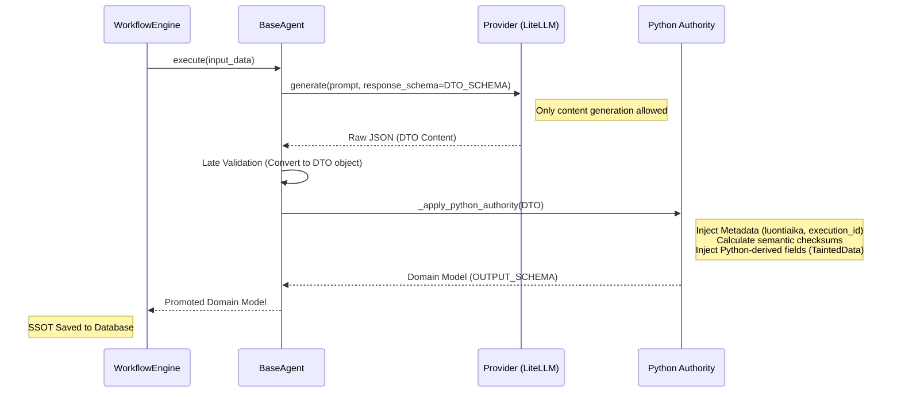

# Cognitive Quorum: Structured Cognitive Architecture (V5.1 - Phase 9 Hardening)

## Abstract

**Cognitive Quorum V5.1** is a data-driven cognitive architecture designed to produce deterministic, high-fidelity reasoning from stochastic LLMs. It separates the **Cognitive Strategy** (JSON-defined logic) from the **Execution Spine** (Python-defined flow).

The V5.1 iteration enforces a **Unidirectional Data Flow** where the "DNA" of the system (Evaluation Matrices, Prompts, System Config) is immutable code, seeded into the database to drive execution.

---

## 1. The Core Architecture

### A. The "Spine" (Execution Layer)
*   **Role**: Orchestration, State Management, and Type Enforcement.
*   **Implementation**: `backend/core/engine.py`, `backend/models/state.py`.
*   **Key Feature**: **Strict Object Mode**. Data is passed between agents as strictly typed Pydantic V2 models (`EvaluationResult`, `XAIReport`), never as loose dictionaries.

### B. The "Mind" (Cognitive Layer)
*   **Role**: Reasoning Strategy and Criteria.
*   **Implementation**: `seed_data.json` -> Database -> Configuration Service.
*   **Components**:
    *   **System Config**: Defines Agent Strategies (e.g., `PanelAgent` -> `deep`).
    *   **Matrices (BARS)**: "What is a score of 4 vs 1?"
    *   **Prompts**: "You are a ruthless prosecutor."

---

## 2. Advanced Implementation Patterns

### Strict DTO Pattern (The "Air Gap")
To prevent LLM hallucinations of system metadata (timestamps, IDs) and guarantee relational integrity, we use a strict **DTO Pattern** combined with **Prefixed NewTypes**:
1.  **LLM Output**: The model generates a lean **PROPOSAL** (DTO), e.g., `PanelOutputDTO`. It contains *only* content (analysis, scores).
2.  **Python Authority**: The Agent's Python code acts as the **AUTHORITY**. It receives the DTO, validates it, and injects system metadata (Run ID, Timestamp, Model Name, Provider Metadata) via `_apply_python_authority()`.
3.  **Domain Promotion**: The enriched object is promoted to a full **Domain Model** (e.g., `PanelOutput`) before entering the `WorkflowState`.


```mermaid
sequenceDiagram
    participant Engine as WorkflowEngine
    participant BA as BaseAgent
    participant LLM as Provider (LiteLLM)
    participant Python as Python Authority

    Engine->>BA: execute(input_data)
    BA->>LLM: generate(prompt, response_schema=DTO_SCHEMA)
    Note right of LLM: Only content generation allowed
    LLM-->>BA: Raw JSON (DTO Content)
    BA->>BA: Late Validation (Convert to DTO object)
    BA->>Python: _apply_python_authority(DTO)
    Note right of Python: Inject Metadata (luontiaika, execution_id)<br>Calculate semantic checksums<br>Inject Python-derived fields (TaintedData)
    Python-->>BA: Domain Model (OUTPUT_SCHEMA)
    BA-->>Engine: Promoted Domain Model
    Note left of Engine: SSOT Saved to Database
```

### Panel Fusion Pattern (The "Senate")
In V5.1, we replaced individual Critic agents with a single **Panel Agent**.
*   **Goal**: Reduce latency and improve coherence.
*   **Mechanism**: A single LLM call (using a "Deep" strategy model like Gemini Pro) assumes multiple personas (Logician, Falsifier, Profiler) simultaneously.
*   **Fan-Out**: The `PanelOutput` is then "fanned out" by the Engine to individual state keys, maintaining backward compatibility with the rest of the pipeline.

---

## 3. Dynamic Evaluation System (BARS)

The system uses **Behaviorally Anchored Rating Scales (BARS)** to decouple the *definition* of quality from the *code* that measures it.

### Dynamic Matrix Injection
The `JudgeAgent` utilizes the **MatrixFormatter** service to convert abstract JSON criteria into high-fidelity Markdown BARS.

> **Strict Scale Enforcement**: The Judge Agent enforces the specific min/max scale defined in the DB. If the LLM generates a score outside this range, the system **Fails Fast** (AppException).

### Configuration-Driven Discovery
The Judge uses a **config-driven** protocol to find evidence. It scans the `WorkflowState` for keys defined in `monitored_steps`. This allows swapping the `PanelAgent` for individual critics without changing the Judge's code.

---

## 4. The Cognitive Assembly Line

The standard `Courtroom 3.0` (Fused) workflow consists of:

### I. The Guardians (Input Processing)
*   **Guard**: Regex/LLM hybrid for PII stripping and Prompt Injection defense.
    *   **Zero-Fallback**: Banned phrases are loaded strictly from the database. If the DB is empty, the system halts.
*   **Retrieval (RAG/Search)**: Fetches external context.
    *   **Gating**: External search is strictly controlled by `ENABLE_VERTEX_SEARCH`.

### II. The Panel (Fused Cognitive)
*   **Panel Agent**: Operates as a "Committee of One".
    *   **Logician**: Toulmin Argument mapping.
    *   **Falsifier**: Popperian stress-testing.
    *   **Profiler**: Bias detection.
    *   **Interaction**: User intent analysis.

### III. The Synthesis (Judgement)
*   **Judge**: The matrix-driven decision engine. Synthesizes Panel outputs into a strict `EvaluationResult`.
*   **Coach**: Pedagogical feedback generator.

### IV. The Reporter (Output Generation)
*   **XAI Reporter**: Aggregates the final execution state into a comprehensive explanation.
    *   **Bifurcated Output**: The architecture specifically bifurcates the final data presentation into two distinct streams:
        1.  **Flat Integration (`XAIFlatReportDTO`)**: A purely structural, hierarchy-free JSON dictionary meant for external BI dashboards (PowerBI, Tableau) and database exports.
        2.  **Unified SDUI Pipeline (`ReportView`)**: A rich, Server-Driven UI format generated by the specialized `ReportCoreTransformer`. This unified code path is consumed directly by the **Flutter UI** over HTTP and internally by the **PDF Generator Service**, ensuring 100% visual and logical parity without code duplication.

---

## 5. Verification Protocols

The architecture is self-verifying via:
1.  **Strict Pydantic Validation**: Every step output is validated against a strict schema (Domain vs DTO pattern).
2.  **Fail Fast & Zero Fallbacks**: The system crashes (raises `AppException` with RFC 7807 code) rather than retaining invalid state or masking errors with default string fallbacks. This guarantees data integrity in downstream reporting (e.g., PDF generation).
3.  **Configuration Authority**: Configuration must be explicit. No hardcoding of models or rules in Python code.

---

## 6. Database to Agent Schema Synchronization (The Input Pipeline)

The synchronization between the static database (`seed_data.json`) and the runtime Python Agents is arguably the most robust architectural pattern in Cognitive Quorum. It is designed to be **Fail-Fast** and **Zero-Fallback**.

Here is a step-by-step breakdown of how the routing and validation mechanism works:

### Step 1: Static Definition in the Database (`seed_data.json`)
Every step in the database defines an `inputs` mapping. This is NOT the data itself; it is a **Routing Map** that tells the Engine *where* in the `WorkflowState` (the Blackboard) to find the required data.
```json
// Example: Judge Agent configuration in seed_data.json
"slug": "step_judge",
"inputs": {
    "history_text": "$inputs.history_text",
    "step_analyst": "$683eb4b9-147c-4f5d-89a7-7b18d75c4202"
}
```
At this stage, the database has no concept of types. It simply acts as a pointer: *"When running the Judge, take the output generated by step 683eb4b9 and pass it in under the key `step_analyst`."*

### Step 2: Dynamic Resolution & Inflation (`_resolve_inputs`)
When the `GraphEngine` prepares to run an agent, it executes the `_resolve_inputs` method. This is where the magic happens:
1.  **Schema Lookup**: The Engine looks up the Agent in the `TaskRegistry` and retrieves its formal Pydantic Input Schema (e.g., `JudgeInput`).
2.  **Type Introspection**: It checks the annotation for `step_analyst` inside `JudgeInput` and sees it expects an `AnalystOutput` Pydantic model.
3.  **Strict Hydration**: It fetches the raw JSON data produced by step `683...` from the state, and immediately attempts to "pump" (inflate) it into an `AnalystOutput` object using `state.get_context(head, model_class=expected_model)`.

### Step 3: Fast-Fail Execution (`model_validate`)
Before the Agent's Python code is even triggered, the Engine performs the ultimate verification:
```python
# From engine.py
validated_input = task_def.input_schema.model_validate(task_inputs)
```
If the database mapped a string where an object was expected, or if it mapped a key that `JudgeInput` doesn't recognize (or forgot to map a required key), this line **Fail-Fasts immediately** with an `AGENT_SCHEMA_VALIDATION_FAILED` Exception. 

**Why is this a Best Practice?**
- **No Silent Failures**: Data mismatches never reach the LLM, saving cost and preventing hallucinations.
- **100% Synchronization**: The `seed_data.json` and the Python code are forced to be perfectly, structurally synchronized. If they aren't, the Workflow Engine refuses to execute.

### Step 4: Statically Preventing Drift (CI/CD Testing)
While the runtime Engine will reliably crash upon detecting a mismatch, developer experience demands we catch these errors earlier. 
We utilize a static CI/CD audit test (`backend/tests/unit/test_seed_schema_alignment.py`) that performs a "Dry Run":
1. It loads `seed_data.json`.
2. For each step, it retrieves the `input_schema` from the `TaskRegistry`.
3. It performs Set-Math (`provided_keys - schema_keys` and `required_keys - provided_keys`) to guarantee that every key mapped in the DB perfectly aligns with the Pydantic requirements. 
If a developer adds a new mandatory field to `JudgeInput` but forgets to update `seed_data.json`, this test will fail instantly, ensuring the Data and the Code exist as a Unified Single Source of Truth.