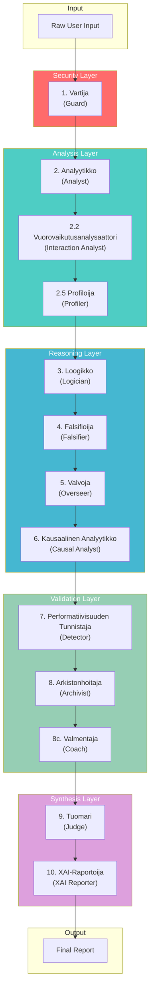
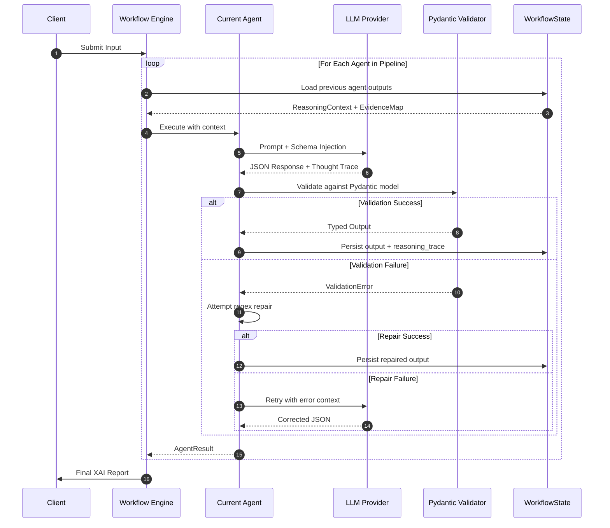

# Cognitive Quorum: A Data-Driven Architecture for Robust Multi-Agent Reasoning (V2.5)

## Abstract

This document outlines the **Cognitive Quorum**, a structured cognitive architecture designed to resolve the fundamental tension between the stochastic, generative nature of Large Language Models (LLMs) and the deterministic, reliable requirements of production software. The architecture achieves this by separating cognitive logic ("The Mind") from procedural execution ("The Spine"), now enhanced with **Asynchronous Distributed Processing** in V2.5.

## Pipeline Overview

The Cognitive Quorum implements a **sequential multi-agent reasoning pipeline** where information flows through specialized agents, each performing a distinct cognitive function. The pipeline enforces strict data contracts between stages, ensuring deterministic behavior despite the stochastic nature of LLMs.

### Agent Flow Diagram

```mermaid
flowchart TD
    subgraph Input
        A[Raw User Input]
    end
    
    subgraph Security["Security Layer"]
        B["1. Vartija<br/>(Guard)"]
    end
    
    subgraph Analysis["Analysis Layer"]
        C["2. Analyytikko<br/>(Analyst)"]
        D["2.2 Vuorovaikutusanalysaattori<br/>(Interaction Analyst)"]
        E["2.5 Profiloija<br/>(Profiler)"]
    end
    
    subgraph Reasoning["Reasoning Layer"]
        F["3. Loogikko<br/>(Logician)"]
        G["4. Falsifioija<br/>(Falsifier)"]
        H["5. Valvoja<br/>(Overseer)"]
        I["6. Kausaalinen Analyytikko<br/>(Causal Analyst)"]
    end
    
    subgraph Validation["Validation Layer"]
        J["7. Performatiivisuuden Tunnistaja<br/>(Detector)"]
        K["8. Arkistonhoitaja<br/>(Archivist)"]
        L["8c. Valmentaja<br/>(Coach)"]
    end
    
    subgraph Synthesis["Synthesis Layer"]
        M["9. Tuomari<br/>(Judge)"]
        N["10. XAI-Raportoija<br/>(XAI Reporter)"]
    end
    
    subgraph Output
        O[Final Report]
    end
    
    A --> B
    B --> C
    C --> D
    D --> E
    E --> F
    F --> G
    G --> H
    H --> I
    I --> J
    J --> K
    K --> L
    L --> M
    M --> N
    N --> O
    
    style Security fill:#ff6b6b,color:#fff
    style Analysis fill:#4ecdc4,color:#fff
    style Reasoning fill:#45b7d1,color:#fff
    style Validation fill:#96ceb4,color:#fff
    style Synthesis fill:#dda0dd,color:#fff
```

### Sequence Diagram: Data Flow & Validation

```mermaid
sequenceDiagram
    autonumber
    participant Client
    participant Engine as Workflow Engine
    participant Agent as Current Agent
    participant LLM as LLM Provider
    participant Validator as Pydantic Validator
    participant State as WorkflowState
    
    Client->>Engine: Submit Input
    
    loop For Each Agent in Pipeline
        Engine->>State: Load previous agent outputs
        State-->>Engine: ReasoningContext + EvidenceMap
        
        Engine->>Agent: Execute with context
        Agent->>LLM: Prompt + Schema Injection
        LLM-->>Agent: JSON Response + Thought Trace
        
        Agent->>Validator: Validate against Pydantic model
        
        alt Validation Success
            Validator-->>Agent: Typed Output
            Agent->>State: Persist output + reasoning_trace
        else Validation Failure
            Validator-->>Agent: ValidationError
            Agent->>Agent: Attempt regex repair
            alt Repair Success
                Agent->>State: Persist repaired output
            else Repair Failure
                Agent->>LLM: Retry with error context
                LLM-->>Agent: Corrected JSON
            end
        end
        
        Agent-->>Engine: AgentResult
    end
    
    Engine->>Client: Final XAI Report
```

### Agent Summary Table

| Step | Agent (FI) | Agent (EN) | Primary Function | Output Type |
|------|------------|------------|------------------|-------------|
| 1 | Vartija | Guard | Prompt injection defense, PII redaction | `SecurityCheckResult` |
| 2 | Analyytikko | Analyst | Evidence extraction, grounding | `EvidenceMap` |
| 2.2 | Vuorovaikutusanalysaattori | Interaction Analyst | User role classification (Driver/Passenger) | `InteractionProfile` |
| 2.5 | Profiloija | Profiler | Cognitive bias detection | `CognitiveBiasProfile` |
| 3 | Loogikko | Logician | Toulmin argument mapping | `ArgumentStructure` |
| 4 | Falsifioija | Falsifier | Contradiction detection (Popperian) | `FalsificationResult` |
| 5 | Valvoja | Overseer | Fact-checking, ethics verification | `OverseerReport` |
| 6 | Kausaalinen Analyytikko | Causal Analyst | Causation vs. correlation | `CausalInference` |
| 7 | Performatiivisuuden Tunnistaja | Detector | Manipulation/rhetoric detection | `PerformativeAnalysis` |
| 8 | Arkistonhoitaja | Archivist | Historical precedent retrieval (RAG) | `HistoricalContext` |
| 8c | Valmentaja | Coach | Pedagogical feedback | `CoachingAdvice` |
| 9 | Tuomari | Judge | Final adjudication with scoring | `JudgeVerdict` |
| 10 | XAI-Raportoija | XAI Reporter | Explainable report generation | `XAIReport` |

### Key Architectural Invariants

1. **Contract-First Data Flow**: Every agent-to-agent handoff is validated against a strict Pydantic V2 schema. No raw dictionaries cross boundaries.

2. **Reasoning Continuity**: The `thought` trace from each agent is persisted in `WorkflowState.reasoning_context` and injected into the next agent's prompt, maintaining cognitive coherence.

3. **Zero-Fallback Execution**: If any validation fails after repair attempts, the pipeline halts rather than proceeding with corrupt data.

---

## Architectural Principles

### The Mind (Dynamic Layer)
*   **Source:** `seed_data.json` / Firetore.
*   **Components:** Prompts, Mandates (`MANDATE_1`), Methods (`METHOD_1`).
*   **Role:** Defines the *strategy* of reasoning. Configurable without code changes.

### The Spine (Static Layer)
*   **Source:** Python Code (`backend/agents/`, `backend/models/`).
*   **Components:** Agent Classes, Pydantic V2 Models (`typing.Annotated`), Arq Workers.
*   **Role:** Defines the *structure* of data and execution. Enforces type safety, manages async concurrency, and provides observability via **Logfire**.
    *   **Contract-First Data Integrity:** All internal data exchange is strictly validated against Pydantic models (e.g., `ReportContext` instead of dicts).
    *   **Zero-Fallback Configuration:** The system refuses to start or execute if configuration is ambiguous, preventing "silent failures" or accidental defaults.
    > **Constraint:** Currently requires code changes to add new steps. Phase 7 aims to make this fully dynamic.

## The Cognitive Assembly Line (`sequential_audit_chain`)

The system processes information through a pipeline of specialized agents:

### 1. Vartija (Guard Agent)
**Role:** Security Gateway.
Mitigates prompt injection and ensures PII privacy via `Presidio` hooks.

### 2. Analyytikko (Analyst Agent)
**Role:** Data Structuring.
Transforms raw input into a grounded `EvidenceMap`, mitigating hallucination via "Chain of Trust".

### 2.2. Vuorovaikutusanalysaattori (Interaction Analyst)
**Role:** Dynamic Control Assessment.
Determines if the user is a "Driver" (Active) or "Passenger" (Passive) in the process.

### 2.5. Profiloija (Profiler Agent)
**Role:** Cognitive Bias Detection.
Identifies psychological profiles and cognitive biases in the source text.

### 3. Loogikko (Logician Agent)
**Role:** Argument Mapping.
Constructs Toulmin arguments (Claim, Data, Warrant) to expose logical structure.

### 4. Falsifioija (Falsifier Agent)
**Role:** Stress Testing.
Acts as "Devil's Advocate" (Popperian Falsification) to find internal contradictions.

### 5. Valvoja (Overseer Agent)
**Role:** Fact & Ethics.
Verifies factual accuracy (Google Search) and ethical alignment.

### 6. Kausaalinen Analyytikko (Causal Agent)
**Role:** Causal Inference.
Distinguishes correlation from causation using `DoWhy` refutation tests.

### 7. Performatiivisuuden Tunnistaja (Detector Agent)
**Role:** Anti-Gaming.
Detects manipulative rhetoric or "fluff" designed to bias the system.

### 8. Arkistonhoitaja (Archivist Agent)
**Role:** Context Retrieval.
Connects the current case to historical precedents via Vector RAG Search.

### 8c. Valmentaja (Coach Agent)
**Role:** Pedagogical Feedback.
Provides actionable advice to the user on improving their reasoning.

### 9. Tuomari (Judge Agent)
**Role:** Adjudication.
Synthesizes all critiques into a final Verdict using a strict scoring matrix.

### 10. XAI-Raportoija (XAI Reporter)
**Role:** Transparency.
Generates a human-readable, explainable report documenting the entire decision chain.

## Reasoning Continuity Architecture (V2.5)

To maintain high-level cognitive coherence across multiple agent turns, the system implements a **Dual-Layer Reasoning Trace** mechanism.

### The Challenge: Statelessness vs. Context
LLMs are inherently stateless. When `AnalystAgent` finishes and `JudgeAgent` begins, the specific "train of thought" that led to the analysis is typically lost, leaving only the final JSON output.

### Solution: Thinking Tokens & Explicit Traces

1.  **Reasoning Models (Gemini 2.5 Thinking)**: 
    *   **Mechanism**: The model generates a "Show Your Work" trace (`thought` signature) alongside the JSON.
    *   **Persistence**: We capture this trace and store it in `WorkflowState.reasoning_context`.
    *   **Transfer**: It is passed to the next agent, allowing it to "see" the logic that led to the conclusion.

2.  **Standard Models (Gemini Flash/Pro)**:
    *   **Mechanism**: Explicit Chain-of-Thought (CoT) text generation via `thought` field in JSON.
    *   **Persistence**: Stored in `state.last_reasoning_trace`.
    *   **Transfer**: Injected into the next prompt as text.

This approach ensures transparency and high-fidelity reasoning transfer regardless of the underlying model capability.

## Verification & Self-Correction

The system employs a **Monolithic Validation Loop**:

1.  **Schema Injection**: The engine injects the Pydantic V2 JSON Schema into the prompt.
2.  **Hard Validation**: LLM output is parsed against the strict `Annotated` model.
3.  **Heuristic Repair**: If JSON is malformed, a lightweight regex repair is attempted.
4.  **Self-Correction**: If repair fails, validation errors trigger an automatic retry, forcing the LLM to fix its own formatting mistakes.

This guarantees that the input to Step N+1 is always valid data produced by Step N.