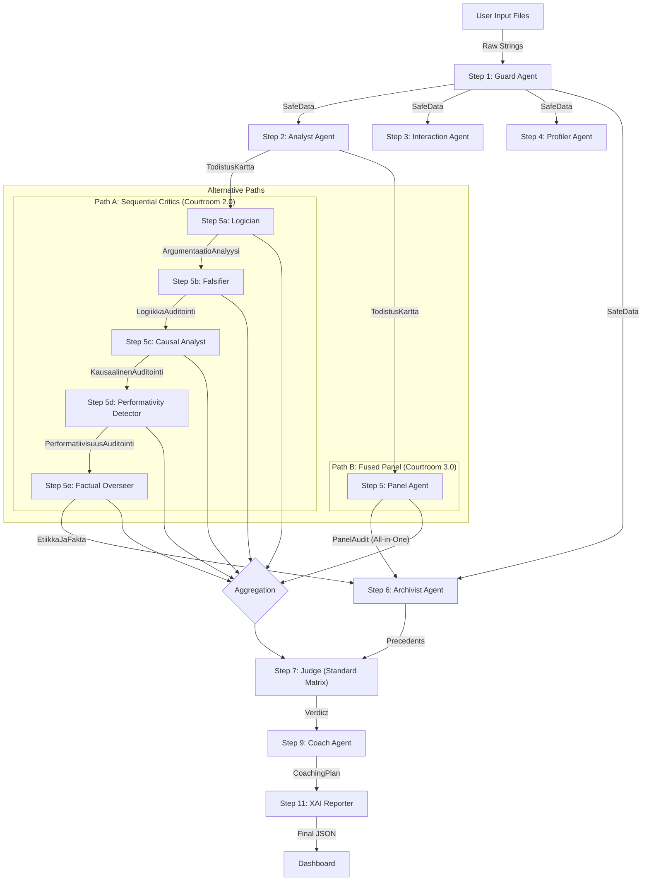

# Workflow Data Architecture: Courtroom Audit Chains (V2.9)

**Workflows Covered:**
1.  **Courtroom 2.0 (Sequential):** `sequential_audit_chain`
2.  **Courtroom 3.0 (Fused):** `fused_audit_chain_dual`

**Description:** This document details the data lineage and information flow. It illustrates how the system branches between a "Sequential" execution of specialist critics and a "Fused" parallel execution via the Panel Agent.

---

## 1. High-Level Data Flow (Mermaid)

The workflow splits after the Profiling stage depending on the configuration.

---

## 2. Step-by-Step Data Contracts
 
 All steps operate on the **Hybrid State Architecture**:
 *   **Inputs**: Read from the Blackboard (`WorkflowState.context_variables`).
 *   **Outputs**: Written to the Event Log (`TraceEvent`) and projected back to the Blackboard.
 *   **Validation**: Strict Pydantic V2 schemas are enforced at every step boundary.

### Step 1: Guard (`step_guard`)
**Objective:** Input hygiene, PII redaction, and security scanning.
- **Input:** Raw strings (`history_text`, `product_text`, `reflection_text`).
- **Process:** Regex scanning, PII detection logic.
- **Output:** `TaintedData` schema.
    - `safe_data`: **CRITICAL.** Sanitized text used by ALL subsequent agents.

### Step 2: Analyst (`step_analyst`)
**Objective:** Establish the "Ground Truth".
- **Input:** `safe_data` (from Guard).
- **Process:** Extraction of claims and mapping them to evidence.
- **Output:** `TodistusKartta` schema.
    - `hypoteesit`: List of claims made by the user.
    - `rag_todisteet`: Direct quotes from the input supporting/refuting claims.

### Step 3: Interaction (`step_interaction`)
**Objective:** Analyze user agency and control.
- **Input:** `safe_data`.
- **Output:** `InteractionAnalysis`.
    - `driver_classification`: "Driver" vs "Passenger".
    - `imperative_command_count`: Number of direct commands.

### Step 4: Profiler (`step_profiler`)
**Objective:** Behavioral and cognitive bias analysis.
- **Input:** `safe_data`.
- **Output:** `ProfilerAnalysis`.
    - `tunnistetut_vinoumat`: Cognitive biases (e.g., Confirmation Bias).
    - `teksti_metriikka`: Objective stats (word count, etc.).

---

### Alternative Path A: Sequential Critics (Courtroom 2.0)
*In this path, agents run one after another. Each feeds into the global state, eventually aggregated for the Judge.*

#### Step 5a: Logician (`step_logician`)
**Objective:** Structural audit of argumentation.
- **Input:** `TodistusKartta`, `safe_data`.
- **Process:** Toulmin Model application.
- **Output:** `ArgumentaatioAnalyysi`.
    - `toulmin_analyysi`: Breakdown into Claim, Data, Warrant.

#### Step 5b: Falsifier (`step_falsifier`)
**Objective:** Stress-testing the logic.
- **Input:** `TodistusKartta`, `safe_data`.
- **Process:** Checks iteration loops and critical handling errors.
- **Output:** `LogiikkaAuditointi`.
    - `walton_stressitesti_loydokset`: Results of critical questions.

#### Step 5c: Causal Analyst (`step_causal`)
**Objective:** Verifying cause-and-effect in learning.
- **Input:** `TodistusKartta`, `safe_data`.
- **Process:** Counterfactual analysis ("Would this result exist without the user?").
- **Output:** `KausaalinenAuditointi`.
    - `abduktiivinen_paatelma`: "Genuine Insight" vs "Lucky Guess".

#### Step 5d: Performativity Detector (`step_detector`)
**Objective:** Detecting "Illusion of Competence".
- **Input:** `TodistusKartta`, `safe_data`.
- **Output:** `PerformatiivisuusAuditointi`.
    - `yleisarvio_aitoudesta`: "Organic" vs "Performative".

#### Step 5e: Factual Overseer (`step_overseer`)
**Objective:** Hallucination and Fact Checking.
- **Input:** `TodistusKartta`, `safe_data`.
- **Output:** `EtiikkaJaFakta`.
    - `faktantarkistus_rfi`: Verification results against external signals.

---

### Alternative Path B: Fused Panel (Courtroom 3.0)
*In this path, a single 'Panel Agent' runs the logic of all 5 critics above in parallel (or integrated prompts).*

#### Step 5: Panel (`step_panel`)
**Objective:** Parallel execution of specialized critics.
- **Input:** `TodistusKartta`, `safe_data`.
- **Output:** `PanelAudit` (Consolidated Schema).
    - `logiikka_auditointi`: (See 5a)
    - `falsifiointi_auditointi`: (See 5b)
    - `kausaalinen_auditointi`: (See 5c)
    - `performatiivisuus_auditointi`: (See 5d)
    - `etiikka_ja_fakta`: (See 5e)

---

### Step 6: Archivist (`step_archivist`)
**Objective:** Best practices consistency.
- **Input:** `safe_data`.
- **Output:** `ArchivistOutput`.
    - `compliance_score`: Alignment with known standards.

### Step 7: Judge (`step_judge`)
**Objective:** Authoritative scoring based on the Matrix.
- **Input:** Aggregated results from ALL previous steps.
- **Process:** Application of **BARS Matrix** (e.g., `matrix_standard_v1`).
- **Output:** `EvaluationResult`.
    - `total_score`: Final numeric grade.
    - `dimensions`: Breakdown per matrix dimension.
    - `matrix_id`: The ID of the matrix used.

### Step 9: Coach (`step_coach`)
**Objective:** Remediation.
- **Input:** `EvaluationResult`.
- **Output:** `CoachingPlan`.

### Step 11: XAI Reporter (`step_xai`)
**Objective:** Final Report.
- **Input:** All previous outputs.
- **Output:** `XAIReport` (Dashboard Data).
