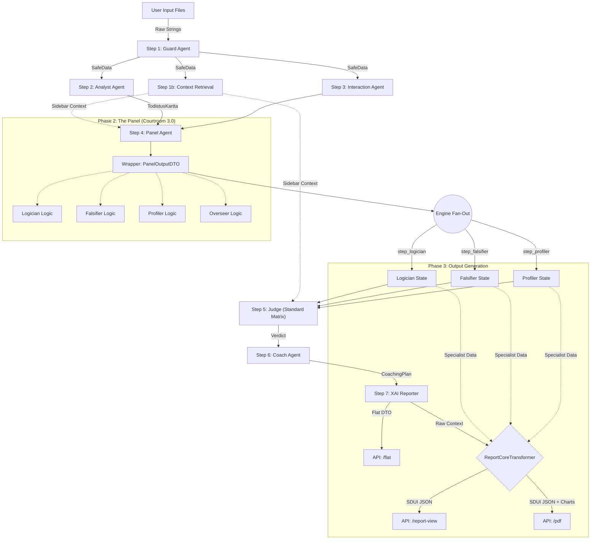

# Workflow Data Architecture: Courtroom Audit Chains (V3.2 - Phase 8 Standards)

**Workflows Covered:**
1.  **Courtroom 3.0 (Fused):** `fused_audit_chain` (Primary Production Workflow).
2.  **Courtroom 2.0 (Sequential):** `sequential_audit_chain` (Legacy/Deprecated).

**Description:** This document details the data lineage and information flow. It illustrates the transition from "Sequential" execution to the high-performance "Fused" parallel execution via the Panel Agent.

---

## 1. High-Level Data Flow (Mermaid)

The workflow primarily uses the **Fused Panel** pattern to reduce latency and improve coherence.

---

## 2. Step-by-Step Data Contracts

All steps operate on the **Hybrid State Architecture**:
*   **Inputs**: Read from the Blackboard (`WorkflowState.context_variables`).
*   **Outputs**: Written to the Event Log (`TraceEvent`) and projected back to the Blackboard.
*   **Strict DTOs**: LLMs generate `*OutputDTO` (Content Only). Python code promotes this to `*Output` (Domain Model) with system metadata.

### Step 1: Guard (`step_guard`)
**Objective:** Input hygiene, PII redaction, and security scanning.
- **Input:** Raw strings.
- **Output:** `TaintedData`.
    - `safe_data`: **CRITICAL.** Sanitized text used by ALL subsequent agents.
    - **Fail-Fast**: Halts execution if `banned_phrases` are detected.

### Step 1b: Context Retrieval (`step_context`)
**Objective:** Fetch external knowledge (RAG) for fact-checking.
- **Input:** `safe_data`.
- **Output:** `RetrievalOutput`.
    - `rag_evidence`: List of retrieved context snippets.

### Step 2: Analyst (`step_analyst`)
**Objective:** Establish the "Ground Truth".
- **Input:** `safe_data`.
- **Output:** `AnalystOutput` (Domain Model).
    - `provenance_map`: Claims mapped to evidence.

### Step 3: Panel (`step_panel`)
**Objective:** Parallel execution of specialized critics.
- **Strategy:** "Deep" (Gemini Pro).
- **Process**:
    1.  **LLM**: Generates `PanelOutputDTO` containing:
        - `logician_analysis`: Toulmin mapping.
        - `falsifier_analysis`: Popperian stress-testing.
        - `profiler_analysis`: Bias detection.
    2.  **Engine**: Promotes to `PanelOutput` (Domain Model).
    3.  **Fan-Out**: The Engine splits this object and writes to individual keys (`step_logician`, `step_falsifier`, etc.) to simulate independent agents for downstream consumers.

### Step 4: Judge (`step_judge`)
**Objective:** Authoritative scoring based on the Matrix.
- **Input:** Aggregated results (via Fan-Out keys).
- **Process:** Application of **BARS Matrix**.
- **Output:** `EvaluationResult`.
    - `total_score`: Final numeric grade.
    - `dimensions`: Breakdown per matrix dimension.

### Step 5: XAI Reporter (`step_xai`) & Output Generation
**Objective:** Final Report Aggregation and Presentation.
- **Input:** All previous outputs from the Blackboard.
- **Process:** The Reporter creates the narrative and a flattened data structure (`XAIFlatReportDTO`).
- **Output Branches:**
    1.  **Flat Data (`/flat`)**: Serves the lightweight `XAIFlatReportDTO` directly for external BI tools (Excel, Tableau). Hierarchy is stripped out.
    2.  **Unified SDUI Pipeline (`/report-view` & `/pdf`)**: The complex execution state (including all Specialist data like Logician, Falsifier, Profiler) is passed through a single, unified `ReportCoreTransformer`. 
        *   This transformer emits a strict Server-Driven UI (SDUI) schema (`ReportView`).
        *   Both the **Flutter Frontend** and the in-memory **PDF Generator** consume this identical SDUI output to render rich, consistent visual components (Radar charts, scorecards, logic bubbles) without duplicating presentation logic.
